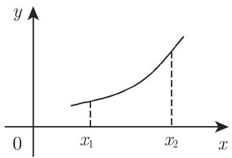
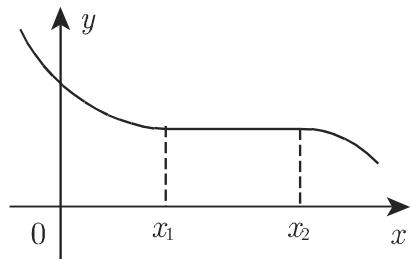
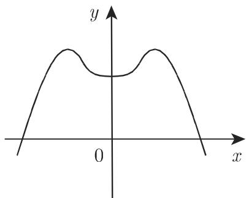
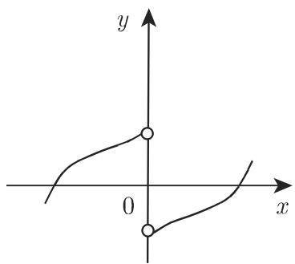
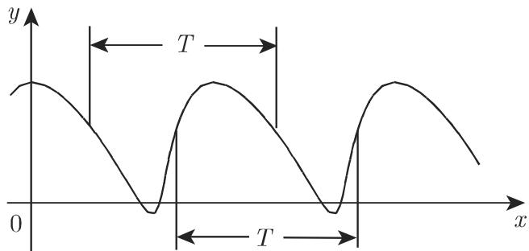

#### 2.1.3 某些类型的函数

2.1.3.1 单调函数

若对定义域内的任意自变量 $x_{1}, x_{2}$ , 当 $x_{2} > x_{1}$ 时, 函数满足关系

$$
f \left(x _ {2}\right) \geqslant f \left(x _ {1}\right) \quad {\text {或}} \quad f \left(x _ {2}\right) \leqslant f \left(x _ {1}\right),\tag{2.7a}
$$

则称函数为单调递增函数或单调递减函数(图 2.3(a), (b)).

若上述关系 (2.7a) 并非对函数定义域内的每个 $x$ 都成立, 而是在其中一个区间或半轴上成立, 则称该函数为此区域内的单调函数. 若函数满足关系

$$
f \left(x _ {2}\right) > f \left(x _ {1}\right) \quad {\text {或}} \quad f \left(x _ {2}\right) <   f \left(x _ {1}\right),\tag{2.7b}
$$

即 (2.7a) 中的等号恒不成立, 则称函数为严格单调递增函数或严格单调递减函数. 图 2.3(a) 表示一个严格单调递增函数; 图 2.3(b) 表示一个在 $x_{1}, x_{2}$ 之间为常数的单调递减函数.

  
(a)

  
图2.3  
(b)

■ $y = \mathrm{e}^{-x}$ 是严格单调递减函数, $y = \ln x$ 是严格单调递增函数.

2.1.3.2 有界函数

函数称为有上界函数, 若存在一个数 (称为上界), 使得所有函数值都不超过该数. 函数称为有下界函数, 若存在一个数 (称为下界), 使得所有函数值都不小于该数. 若一个函数既有上界又有下界, 则简称它为有界函数.

■ A: $y = 1 - x^{2}$ 有上界 $(y \leqslant 1)$ .
■ B: $y = e^{x}$ 有下界 $(y > 0)$ .
■ C: $y = \sin x$ 有界 $(-1 \leqslant y \leqslant +1)$ . ■ D: $y = \frac{4}{1 + x^{2}}$ 有界 $(0 < y \leqslant 4)$ .

2.1.3.3 函数的极值

设函数 $f(x)$ 的定义域为 D, 若对 $\forall x \in D$ , 有

$$
f (a) \geqslant f (x),\tag{2.8a}
$$

则称 $f(x)$ 在点 $a$ 取得绝对极大值或全局极大值. 若不等式 (2.8a) 仅在点 $a$ 的周围, 即 $a - \varepsilon < x < a + \varepsilon$ , $\varepsilon > 0$ , $x \in D$ 时成立, 则称函数 $f(x)$ 点 $a$ 取得相对极大值或局部极大值.

类似地, 通过不等式

$$
f (a) \leqslant f (x),\tag{2.8b}
$$

可以定义绝对极小值或全局极小值以及相对极小值或局部极小值.

注 (1) 极大值和极小值也称为极值, 它们与函数的可微性无关, 即定义域内函数不可微的点也可能为极值点. 如曲线的间断点 (参见 75 页图 2.9 和 595 页图 6.10(b), (c)).

(2) 可微函数中极值的判定准则参见第 595 页 6.1.5.2.

2.1.3.4 偶函数

偶函数(图 2.4(a)) 满足关系

$$
f (- x) = f (x).\tag{2.9a}
$$

若 $f$ 的定义域为 $D$ , 则

$$
(x \in D) \Rightarrow (- x \in D).\tag{2.9b}
$$

2.1.3.5 奇函数

奇函数(图 2.4(b)) 满足关系

$$
f (- x) = - f (x).\tag{2.10a}
$$

若 $f$ 的定义域为 $D$ , 则

$$
(x \in D) \Rightarrow (- x \in D).
$$

(2.10b)

(a)  
  
(b)  
图2.4

■ A: $y = \sin x$ ,

■ B: $y = x^{3} - x$ .

2.1.3.6 偶函数和奇函数的表示

设函数 $f$ 的定义域为 $D$ , 若由 $x \in D$ , 有 $-x \in D$ , 则 $f$ 可写成偶函数 $g$ 与奇函数 $u$ 之和:

$f(x) = g(x) + u(x)$ ，其中 $g(x) = \frac{1}{2} [f(x) + f(-x)]$ ， $u(x) = \frac{1}{2} [f(x) - f(-x)]$ 。

(2.11) $\text{■} f(x) = \mathrm{e}^{x} = \frac{1}{2}\left(\mathrm{e}^{x} + \mathrm{e}^{-x}\right) + \frac{1}{2}\left(\mathrm{e}^{x} - \mathrm{e}^{-x}\right) = \cosh x + \sinh x$ (参见第 115 页 2.9.1).

2.1.3.7 周期函数

周期函数满足关系

$$
f \left(x + T\right) = f \left(x\right), \quad T \text {为非零常数}.\tag{2.12}
$$

显然, 若上式对于某一常数 $T$ 成立, 则对 $T$ 的倍数也成立, 满足如上关系的最小正整数称为周期(图 2.5).

  
图2.5

2.1.3.8 反函数

设函数 $y = f(x)$ 的定义域和值域分别为 $D$ 和 $W$ , 则对于任一 $x \in D$ , 存在唯一的 $y \in W$ . 反之, 若对任一 $y \in W$ , 存在唯一的 $x \in D$ , 则可以定义 $f$ 的反函数, 记为 $\varphi$ 或 $f^{-1}$ . 其中 $f^{-1}$ 是一个函数符号, 并不是 $f$ 的幂.

为求 $f$ 的反函数, 交换公式 $f$ 中 $x, y$ 的位置, 再利用 $x = f(y)$ 把 $y$ 表示出来, 就得到 $y = \varphi(x)$ . 又表达式 $y = f(x)$ 与 $x = \varphi(y)$ 等价, 由此可以得到如下重要公式:

$$
f \left(\varphi \left(y\right)\right) = y \quad {\text {和}} \quad \varphi \left(f \left(x\right)\right) = x.\tag{2.13}
$$

反函数 $y = \varphi(x)$ 的图像可由 $y = f(x)$ 的图像沿直线 $y = x$ 反射得到 (图 2.6).

  
(a)

  
(b)  
图2.6

  
(c)

■ 函数 $y = f(x) = \mathrm{e}^{x}(D : -\infty < x < +\infty, W : y > 0)$ 显然与 $x = \varphi(y) = \ln y$ 等价，且每个严格单调函数都有反函数.

反函数举例：

■ A: $y = f(x) = x^{2}$ ，其中 $D : x \geqslant 0, W : y \geqslant 0;$

$$
y = \varphi (x) = \sqrt {x}, \text {其中} D: x \geqslant 0, W: y \geqslant 0.
$$

■ B: $y = f(x) = \mathrm{e}^{x}$ ，其中 $D : -\infty < x < +\infty, W : y > 0;$

$y = \varphi(x) = \ln x, \text{ 其中 } D : x > 0, W : -\infty < y < +\infty.$

■ C: $y = f(x) = \sin x$ , 其中 $D : -\frac{\pi}{2} \leqslant x \leqslant \frac{\pi}{2}$ , $W : -1 \leqslant y \leqslant 1$ ;

$y = \varphi (x) = \arcsin x,$ 其中 $D: - 1\leqslant x\leqslant 1,W: - \frac{\pi}{2}\leqslant y\leqslant \frac{\pi}{2}.$

注 (1) 若函数 $f$ 在区间 $I \subset D$ 上严格单调, 则在此区间存在反函数 $f^{-1}$ .

(2) 若非单调函数在严格单调部分能够进行分割, 则在这些部分存在相应的反函数.
