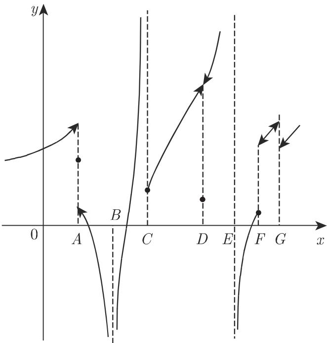
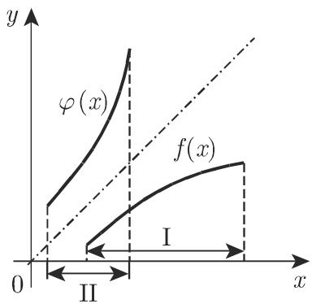

#### 2.1.5 函数的连续性

2.1.5.1 连续与间断的概念

实际上大部分函数都是连续函数, 也就是函数自变量变化很小时, 连续函数 $y(x)$ 的变化也很小, 这样的函数图像为一条连续曲线. 如果曲线在某些点断开, 相应的函数就不是连续函数, 曲线断开的自变量的值称为间断点. 图 2.9 所示为分段连续曲线, 间断点为 $A$ , $B$ , $C$ , $D$ , $E$ , $F$ , $G$ , 箭头表示端点不在曲线上.

  
图2.9

2.1.5.2 连续的定义

函数 $y = f(x)$ 称为在点 $x = a$ 连续, 若

(1) $f(x)$ 在 $a$ 点有定义；

(2) $\lim_{x\to a}f(x)$ 存在且 $\lim_{x\to a}f(x) = f(a)$ .

即对任意 $\varepsilon > 0$ , 存在 $\delta(\varepsilon) > 0$ , 使得当 $|x - a| < \delta$ 时, 对一切 $x$ 有

$$
\left| f (x) - f (a) \right| <   \varepsilon .\tag{2.30}
$$

若不管 $\lim_{x\to a}f(x) = f(a)$ 与否，只考虑一侧的极限 $\lim_{x\to a - 0}f(x)\Bigl (\text{或}\lim_{x\to a + 0}f(x)\Bigr)$ 且其等于 $f(a)$ ，则称为单侧（左侧或右侧）连续.

若函数在 a 到 b 区间内每一点连续, 则称函数为该区间的连续函数, 其中的区间可以为开区间、半开区间或闭区间 (参见第 3 页 1.1.1.3,3). 若函数在数轴上的每一点都有定义且连续, 则称该函数为处处连续函数.

若函数在 $x = a$ 处无定义，或有定义但 $\lim_{x\to a}f(x)\neq f(a)$ ，或极限不存在，则 $x = a$ 为函数的间断点，它可能是函数定义域的内点或端点.

若函数仅在 $x = a$ 的一侧有定义, 如 $\sqrt{x}$ 仅在 $x = 0$ 的一侧有定义, $\arccos x$ 仅在 $x = 1$ 的一侧有定义, 则它不是间断点, 但是为终点.

若函数除在有限个有限跳跃间断点外, 在区间上的每一点都连续, 则称该函数为分段连续函数.

2.1.5.3 常见间断点的类型

1. 函数值趋近无穷

当函数趋于 $\pm \infty$ 时, 是最常见的间断点 (图2.9中的 $B, C, E$ ).

■ A: $f(x) = \tan x$ , $f\left(\frac{\pi}{2} - 0\right) = +\infty$ , $f\left(\frac{\pi}{2} + 0\right) = -\infty$ (参见第 99 页图 2.34), 图 2.9 中的点 E 也是这种类型的间断点, 符号 $f(a - 0)$ , $f(a + 0)$ 的意义参见第 70 页 2.1.4.5.

■ B: $f(x)=\frac{1}{(x-1)^{2}}$ , $f(1-0)=+\infty$ , $f(1+0)=+\infty$ , 图 2.9 中的点 B 是这种类型的间断点.

■ C: $f(x) = \mathrm{e}^{\frac{1}{x-1}}$ , $f(1-0) = 0$ , $f(1+0) = \infty$ , 图 2.9 中的点 C 是这种类型的间断点, 不同之处在于函数 $f(x)$ 在点 x = 1 处无定义.

2. 有限跳跃间断点

在 $x = a$ 时, 函数 $f(x)$ 由一个有限值跳跃到另一个有限值 (如图2.9中的点 $A, F, G$ ). 函数 $f(x)$ 在 $x = a$ 时可能像点 $G$ 那样没有定义; 或 $f(a)$ 等于 $f(a - 0)$ 与 $f(a + 0)$ 之一 (点 $F$ ); 或 $f(a)$ 与 $f(a - 0)$ 和 $f(a + 0)$ 均不相等 (点 $A$ ). ■ A: $f(x) = \frac{1}{1 + \mathrm{e}^{\frac{1}{x - 1}}}$ , $f(1 - 0) = 1$ , $f(1 + 0) = 0$ (参见第70页图2.8).

■ B: $f(x) = E(x)$ (参见第 64 页图 2.1), $f(n-0) = n-1$ , $f(n+0) = n$ (n 为整数).

■ $\mathbf{C}$ : $f(x) = \lim_{n\to \infty}\frac{1}{1 + x^{2n}}$ , $f(1 - 0) = 1$ , $f(1 + 0) = 0$ , $f(1) = \frac{1}{2}$ .

3. 可去间断点

设 $\lim_{x\to a}f(x)$ 存在, 即 $f(a - 0) = f(a + 0)$ , 但函数在 $x = a$ 处或者没定义, 或者 $f(a)\neq \lim_{x\to a}f(x)$ (如75页图2.9中的点 $D$ ). 因为若定义 $f(a) = \lim_{x\to a}f(x)$ , 函数在 $x = a$ 处连续, 所以 $x = a$ 称为可去间断点, 此时只需在曲线上添加一个点或者改变点 $D$ 的位置, 就变为连续曲线. 当 $x = a$ 时对于不同的未定式, 若利用洛必达法则或其他方法判断其具有有限极限, 则 $x = a$ 为可去间断点.

■当 $x\to 0$ 时， $f(x) = \frac{\sqrt{1 + x} - 1}{x}$ 是 $\frac{0}{0}$ 型未定式，但是 $\lim_{x\to 0}f(x) = \frac{1}{2}$ ；函数

$$
f (x) = \left\{ \begin{array}{l l} \frac {\sqrt {1 + x} - 1}{x}, & x \neq 0 \\ \frac {1}{2}, & x = 0 \end{array} \right.
$$

是连续函数.

2.1.5.4 初等函数的连续性与间断性

初等函数是其定义域内的连续函数, 在定义域内没有间断点. 下列结论成立:

(1) 多项式是处处连续函数.

(2) 设 $P(x)$ 和 $Q(x)$ 为多项式, 则除了在 $Q(x) = 0$ 处外, 对所有点 $x$ , 有理函数 $\frac{P(x)}{Q(x)}$ 都连续. 若当 $x = a$ 时, $Q(a) = 0$ , $P(a) \neq 0$ , 则函数在 $a$ 的两侧趋于 $\pm \infty$ , 这个点称为极点. 若 $P(a) = 0$ , 但 $a$ 是分母比分子更高重的根 (参见第56页1.6.3.1,2.), 则函数也有一个极点, 否则该间断点是可去间断点.

(3) 无理函数 多项式的根对其定义域内的每个 $x$ 都是连续函数. 若被开方式变号, 则其在区间端点处可能是有限值. 在被开方式间断的 $x$ 处, 有理函数的根也是间断的.

(4) 三角函数 函数 $\sin x, \cos x$ 处处连续； $\tan x, \sec x$ 在点 $x = \frac{(2n + 1)\pi}{2}$ 处有无穷间断点；函数 $\cot x, \csc x$ 在点 $x = n\pi (n$ 为整数）处有无穷间断点.

(5) 反三角函数 函数 $\arctan x, \operatorname{arccot} x$ 处处连续. 因为 $-1 \leqslant x \leqslant 1$ , 故 $\arcsin x, \arccos x$ 在区间端点中断, 且在端点处单侧连续.

(6) 指数函数 $e^{x}$ 或 $a^{x}(a > 0)$ 它们是处处连续函数.

(7) 底数是任意正数的对数函数 $\log x$ 对任意正数 $x$ 函数都连续, 因为右极限 $\lim_{x \to +0} \log x = -\infty$ , 所以函数在 $x = 0$ 处中断.

(8) 复合初等函数 它们的连续性可由复合过程中每个初等函数在点 $x$ 的连续性来判断 (也可参见本页 2.1.5.5,2. 中复合函数).

■ 求函数 $y = \frac{\mathrm{e}^{\frac{1}{x - 2}}}{x\sin\sqrt[3]{1 - x}}$ 的间断点. $x = 2$ 是 $\frac{1}{x - 2}$ 的无穷间断点, 又 $\left(\mathrm{e}^{\frac{1}{x - 2}}\right)_{x = 2 - 0} = 0, \left(\mathrm{e}^{\frac{1}{x - 2}}\right)_{x = 2 + 0} = \infty$ , 故 $x = 2$ 也是 $\mathrm{e}^{\frac{1}{x - 2}}$ 的无穷间断点. 当 $x = 2$ 时, $y$ 的分母是有限值, 因此 $x = 2$ 是与图2.9点 $C$ 相同的无穷间断点.

当 x=0 时, $\sin\sqrt[3]{1-x}=\sin1$ , 故分母为 0. $\sin\sqrt[3]{1-x}=0$ 的根为 $\sqrt[3]{1-x}=n\pi$ 或 $x=1-n^{3}\pi^{3}$ , 其中 n 为任意整数. 而当 x 为上述数时, 分子不等于 0, 因此点 x=0, x=1, $x=1\pm\pi^{3}$ , $x=1\pm8\pi^{3}$ , $x=1\pm27\pi^{3}$ , $\cdots$ 也是函数的间断点, 且与 75 页图 2.9 中的点 E 类似.

2.1.5.5 连续函数的性质

1. 连续函数的和、差、积、商仍为连续函数

若 $f(x), g(x)$ 是区间 $[a, b]$ 上的连续函数，则 $f(x) \pm g(x), f(x)g(x)$ 也是该区间的连续函数，且若在 $[a, b]$ 上 $g(x) \neq 0, \frac{f(x)}{g(x)}$ 仍为连续函数.

2. 复合函数 $y = f(u(x))$ 的连续性

若 $u(x)$ 在 $x = a$ 连续, $f(u)$ 在 $u = u(a)$ 连续, 则复合函数 $y = f(u(x))$ 在 $x = a$ 连续, 且

$$
\lim _ {x \to a} f (u (x)) = f (\lim _ {x \to a} u (x)) = f (u (a)).\tag{2.31}
$$

这说明连续函数的连续函数仍为连续函数.

注 反之不成立, 不连续函数的复合函数也可能为连续函数.

3. 波尔查诺定理

若函数 $f(x)$ 在有限闭区间 $[a, b]$ 上连续， $f(a)f(b) < 0$ ，则在此区间上至少有 $f(x)$ 的一个根，即 $[a, b]$ 至少有一个内点 $c$ 满足：

$$
f (c) = 0, \quad a <   c <   b.\tag{2.32}
$$

上述定理的几何意义为：若连续函数的图像可以从 $x$ 轴的一侧走向另一侧，则曲线与 $x$ 轴至少有一个交点.

4. 介值定理

若函数 $f(x)$ 在区间 $[a, b]$ 上连续，且

$$
f (a) = A, \quad f (b) = B, \quad A \neq B,\tag{2.33a}
$$

则对于任意介于 $A, B$ 之间的数 $C$ , 存在 $c \in (a, b)$ , 使得

$$
f \left(c\right) = C \quad (a <   c <   b, A <   C <   B \text {或} B <   C <   A).\tag{2.33b}
$$

换句话说, 对于介于 $A, B$ 的每个值, 函数 $f(x)$ 在 $(a, b)$ 内至少能有一次取得该值, 或者说一个区间的连续像仍为一个区间.

5. 反函数的存在性

若一个一对一函数是某区间上的连续函数，则它在该区间严格单调.

若函数 $f(x)$ 在连通区域I上连续，且严格单调递增或递减，则该函数也存在一个连续的、严格单调递增或递减的反函数 $\varphi (x)$ (参见第67页2.1.3.8)，其定义域是由 $f(x)$ 的值域所确定的区域II(图2.10).

  
(a)

  
图2.10  
(b)

注 为了保障 $f(x)$ 的反函数的连续性, 要求 $f(x)$ 必须在一个区间连续. 若仅假设函数在区间上严格单调, 在内点 $c$ 连续, 且 $f(c) = C$ , 则有反函数存在, 但可能在点 $C$ 不连续.

6. 函数有界性定理

若函数 $f(x)$ 在有限闭区间 $[a, b]$ 上连续，则它在该区间有界，即存在两个数 $m, M$ ，使得

$$
m \leqslant f (x) \leqslant M, \quad a \leqslant x \leqslant b.\tag{2.34}
$$

7. 魏尔斯特拉斯定理

若函数 $f(x)$ 在有限闭区间 $[a, b]$ 连续，则 $f(x)$ 有一个绝对极大值 $M$ 和一个绝对极小值 $m$ ，即该区间至少存在一点 $c$ 和至少存在一点 $d$ ，使得当 $a \leqslant x \leqslant b$ 时，有

$$
m = f (d) \leqslant f (x) \leqslant f (c) = M.\tag{2.35}
$$

连续函数最大值与最小值之差称为函数在给定区间的变化量, 变化量的概念可以推广到函数没有最大值和最小值的情形.
