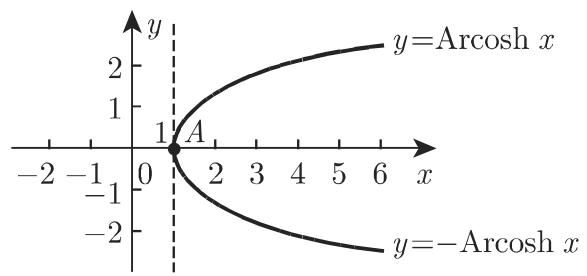

### 2.10 面积函数

#### 2.10.1 定义

面积函数是双曲函数的反函数, 即反双曲函数. 函数 $\sinh x$ , $\tanh x$ 和 $\coth x$ 均严格单调, 因此没有任何限制地具有唯一反函数; 函数 $\cosh x$ 有两个单调区间, 因此存在两个反函数. 面积一词意指这些函数的几何意义是某些双曲线扇形的面积 (参见第 172 页 3.1.2.2).

2.10.1.1 面积正弦

函数

$$
y = \operatorname{Arsinh} x\tag{2.207}
$$

(图 2.53) 为严格单调递增的奇函数, 定义域和值域见表2.8. 该函数等价于表达式 $x = \sinh y$ , 原点为曲线的对称中心和拐点, 此处切线的倾斜角 $\varphi = \frac{\pi}{4}$ .

2.10.1.2 面积余弦

函数

$$
y = \operatorname{Arcosh} x \quad {\text {和}} \quad y = - \operatorname{Arcosh} x\tag{2.208}
$$

(图 2.54) 或 $x = \cosh y$ 的定义域和值域见表 2.8；仅当 $x \geqslant 1$ 时，函数有定义。函数曲线的起点为 A(1, 0)，此处有一条垂直切线， $y = \operatorname{Arcosh} x$ 和 $y = -\operatorname{Arcosh} x$ 分别严格单调递增和严格单调递减。

  
图2.53

  
图2.54

表 2.8 面积函数的定义域和值域

<table><tr><td>面积函数</td><td>定义域</td><td>值域</td><td>具有相同意义的双曲函数</td></tr><tr><td>面积正弦</td><td></td><td></td><td></td></tr><tr><td>y = Arsinh x</td><td>-∞ &lt; x &lt; ∞</td><td>-∞ &lt; y &lt; ∞</td><td>x = sinh y</td></tr><tr><td>面积余弦</td><td></td><td></td><td></td></tr><tr><td>y = Arcosh x</td><td></td><td>0 ≤ y &lt; ∞</td><td></td></tr><tr><td>y = -Arcosh x</td><td>1 ≤ x &lt; ∞</td><td>-∞ &lt; y ≤ 0</td><td>x = cosh y</td></tr><tr><td>面积正切</td><td></td><td></td><td></td></tr><tr><td>y = Artanh x</td><td>|x| &lt; 1</td><td>-∞ &lt; y &lt; ∞</td><td>x = tanh y</td></tr><tr><td>面积余切</td><td></td><td></td><td></td></tr><tr><td>y = Arcoth x</td><td>|x| &gt; 1</td><td>-∞ &lt; y &lt; 0</td><td>x = coth y</td></tr><tr><td></td><td></td><td>0 &lt; y &lt; ∞</td><td></td></tr></table>

2.10.1.3 面积正切

函数

$$
y = \operatorname{Artanh} x\tag{2.209}
$$

(图 2.55) 或 $x = \tanh y$ 为奇函数, 仅在 $|x| \leqslant 1$ 时有定义, 定义域和值域见表 2.8. 原点为曲线的对称中心和拐点, 此处切线的倾斜角 $\varphi = \frac{\pi}{4}$ . 函数具有铅直渐近线 $x = \pm 1$ .

2.10.1.4 面积余切

函数

$$
y = \operatorname{Arcoth} x\tag{2.210}
$$

(图 2.56) 或 $x = \coth y$ 为奇函数, 仅在 $|x| > 1$ 时有定义, 定义域和值域见表 2.8. 在区间 $(-∞, -1)$ 上, 函数从 0 到 $-∞$ 严格单调递减, 在区间 $(1, +∞)$ 上, 函数从 $+∞$ 到 0 严格单调递减. 函数有三条渐近线, 分别为 y = 0 和 $x = \pm 1$ .

  
图2.55

  
图2.56

#### 2.10.2 利用自然对数对面积函数的确定

由双曲函数 $((2.166) \sim (2.171)$ , 参见第 115 页 2.9.1) 的定义可知, 面积函数可由对数函数来表示:

$$
\operatorname{Arsinh} x = \ln \left(x + \sqrt {x ^ {2} + 1}\right),\tag{2.211}
$$

$$
\operatorname{Arcosh} x = \ln \left(x + \sqrt {x ^ {2} - 1}\right) = \ln \left(\frac {1}{x - \sqrt {x ^ {2} - 1}}\right) (x \geqslant 1),\tag{2.212}
$$

$$
\operatorname{Artanh} x = \frac {1}{2} \ln \frac {1 + x}{1 - x} (| x | <   1),\tag{2.213}
$$

$$
\operatorname{Arcoth} x = \frac {1}{2} \ln \frac {x + 1}{x - 1} \quad (| x | > 1).\tag{2.214}
$$

#### 2.10.3 不同面积函数间的关系

$$
\begin{array}{r l} & {\operatorname{Arsinh} x = (\operatorname{sign} x) \operatorname{Arcosh} \sqrt {x ^ {2} + 1} = \operatorname{Artanh} \frac {x}{\sqrt {x ^ {2} + 1}}} \\ & {\qquad = \operatorname{Arcoth} \frac {\sqrt {x ^ {2} + 1}}{x} (| x | <   \infty),} \end{array}\tag{2.215}
$$

$$
\begin{array}{r l} & {\operatorname{Arcosh} x = \operatorname{Arsinh} \sqrt {x ^ {2} - 1} = \operatorname{Artanh} \frac {\sqrt {x ^ {2} - 1}}{x}} \\ & {\qquad = \operatorname{Arcoth} \frac {x}{\sqrt {x ^ {2} - 1}} (| x | \geqslant 1),} \end{array}\tag{2.216}
$$

$$
\begin{array}{r l} & {\operatorname{Artanh} x = \operatorname{Arsinh} \frac {x}{\sqrt {1 - x ^ {2}}} = \operatorname{Arcoth} \frac {1}{x}} \\ & {\qquad = (\operatorname{sign} x) \operatorname{Arcosh} \frac {1}{\sqrt {1 - x ^ {2}}} \qquad (| x | <   1),} \end{array}\tag{2.217}
$$

$$
\begin{array}{r l} & {\operatorname{Arcoth} x = \operatorname{Artanh} \frac {1}{x} = (\operatorname{sign} x) \operatorname{Arsinh} \frac {1}{\sqrt {x ^ {2} - 1}}} \\ & {\qquad = (\operatorname{sign} x) \operatorname{Arcosh} \frac {| x |}{\sqrt {x ^ {2} - 1}} (| x | > 1).} \end{array}\tag{2.218}
$$

#### 2.10.4 面积函数的和与差

$$
\operatorname{Arsinh} x \pm \operatorname{Arsinh} y = \operatorname{Arsinh} \left(x \sqrt {1 + y ^ {2}} \pm y \sqrt {1 + x ^ {2}}\right),\tag{2.219}
$$

$$
\operatorname{Arcosh} x \pm \operatorname{Arcosh} y = \operatorname{Arcosh} \left(x y \pm \sqrt {(x ^ {2} - 1) (y ^ {2} - 1)}\right),\tag{2.220}
$$

$$
\operatorname{Artanh} x \pm \operatorname{Artanh} y = \operatorname{Artanh} \frac {x \pm y}{1 \pm x y}.\tag{2.221}
$$

#### 2.10.5 负角公式

$$
\operatorname{Arsinh} (- x) = - \operatorname{Arsinh} x,\tag{2.222}
$$

$$
\operatorname{Artanh} (- x) = - \operatorname{Artanh} x,\tag{2.223}
$$

$$
\operatorname{Arcoth} (- x) = - \operatorname{Arcoth} x.\tag{2.224}
$$

函数 Arsinh x, Artanhx 和 Arcothx 为奇函数, 当 x < 1 时, Arcosh x 无定义.
