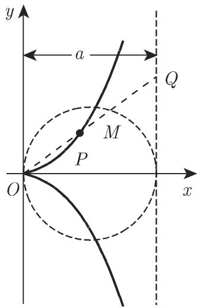

### 2.11 三阶(三次)曲线

若曲线可以写成关于两个变量的多项式方程 $F(x,y) = 0$ 的形式, 其中方程的左边为一个 $n$ 次多项式表达式, 则称该曲线为 $n$ 阶代数曲线.

■ 心脏线 $\left(x^{2} + y^{2}\right)\left(x^{2} + y^{2} - 2ax\right) - a^{2}y^{2} = 0(a > 0)$ (参见第128页2.12.2)是一四阶代数曲线. 著名的圆锥曲线 (参见第277页3.5.2.11) 是一二阶曲线.

#### 2.11.1 二分之三次抛物线

方程

$$
y = a x ^ {\frac {3}{2}} \quad (a > 0, x \geqslant 0)\tag{2.225a}
$$

或参数方程

$$
x = t ^ {2}, \quad y = a t ^ {3} \quad (a > 0, - \infty <   t <   \infty)\tag{2.225b}
$$

确定了二分之三次抛物线(图 2.57). 原点为尖点, 函数无渐近线, 曲率 $K = \frac{6a}{\sqrt{x}(4 + 9a^2x)^{3/2}}$ 取遍从 $\infty$ 到 0 的所有值. 从原点到点 $P(x, y)$ 的曲线弧长 $L = \frac{1}{27a^2}\left[(4 + 9a^2x)^{3/2} - 8\right]$ .

#### 2.11.2 阿涅西箕舌线

方程

$$
y = \frac {a ^ {3}}{a ^ {2} + x ^ {2}} (a > 0, - \infty <   x <   \infty)\tag{2.226a}
$$

确定的曲线如图 2.58 所示, 称为阿涅西箕舌线. 渐近线方程为 y = 0, 极值点为

$A(0, a)$ , 该点处曲率半径 $r = \frac{a}{2}$ . 拐点 $B, C$ 为 $\left(\pm \frac{a}{\sqrt{3}}, \frac{3a}{4}\right)$ , 此处切线倾斜角的斜率 $\tan \varphi = \mp \frac{3\sqrt{3}}{8}$ .

  
图2.57

  
图2.58

曲线和渐近线围成的面积 $S = \pi a^2$ ，阿涅西箕舌线(2.226a）是洛伦兹(Lorentz)曲线或布赖特-维格纳(Breit-Wigner）曲线

$$
y = \frac {a}{b ^ {2} + (x - c) ^ {2}} \quad (a > 0, b \neq 0)\tag{2.226b}
$$

的特殊情况.

■ 阻尼振荡的傅里叶变换是洛伦兹或布赖特-维格纳曲线 (参见第 1033 页 15.3.1.4).

#### 2.11.3 笛卡儿叶形线

方程

$$
x ^ {3} + y ^ {3} = 3 a x y \quad (a > 0)\tag{2.227a}
$$

或参数方程

$$
x = \frac {3 a t}{1 + t ^ {3}}, y = \frac {3 a t ^ {2}}{1 + t ^ {3}},
$$

其中

$$
t = \tan \nless P O x (a > 0, - \infty <   t <   - 1, - 1 <   t <   \infty)\tag{2.227b}
$$

确定了笛卡儿叶形线, 如图 2.59 所示. 曲线两次通过原点, 故原点为二重点, 坐标轴为该点处的切线. 原点处两曲线分支的曲率半径均为 $r = \frac{3a}{2}$ , 渐近线方程为 $x + y + a = 0$ , 顶点 $A$ 的坐标为 $\left(\frac{3}{2} a, \frac{3}{2} a\right)$ . 环部面积 $S_{1} = \frac{3a^{2}}{2}$ , 曲线与渐近线围成的面积 $S_{2}$ 的值与之相同.

  
图2.59

#### 2.11.4 蔓叶线

方程

$$
y ^ {2} = \frac {x ^ {3}}{a - x} (a > 0)\tag{2.228a}
$$

或参数方程

$$
x = \frac {a t ^ {2}}{1 + t ^ {2}}, y = \frac {a t ^ {3}}{1 + t ^ {2}},
$$

其中

$$
t = \tan \nless P O x (a > 0, - \infty <   t <   \infty),\tag{2.228b}
$$

或极坐标方程

$$
\rho = \frac {a \sin^ {2} \varphi}{\cos \varphi} (a > 0)\tag{2.228c}
$$

(图 2.60) 是满足

$$
\overline {{O P}} = \overline {{M Q}}\tag{2.229}
$$

的点 P 的轨迹. 其中 M 是直线 OP 和半径为 $\frac{a}{2}$ 的圆的交点, 且 Q 为直线 OP 和渐近线 x = a 的交点. 曲线与渐近线围成的面积 $S = \frac{3}{4}\pi a^{2}$ .

  
图2.60

#### 2.11.5 环索线

设 $P_{1}, P_{2}$ 是以 $A(A$ 在 $x$ 轴的负半轴)为起点且满足

$$
\overline {{M P _ {1}}} = \overline {{M P _ {2}}} = \overline {{O M}}\tag{2.230}
$$

的任意射线上的点, 其中 $M$ 为射线与 $y$ 轴的交点, 则称点 $P_{1}, P_{2}$ 的轨迹为环索线(图2.61). 环索线的笛卡儿方程、极坐标方程和参数方程分别为

$$
y ^ {2} = x ^ {2} \left(\frac {a + x}{a - x}\right) \quad (a > 0),\tag{2.231a}
$$

$$
\rho = - a \frac {\cos 2 \varphi}{\cos \varphi} (a > 0),\tag{2.231b}
$$

$x = a\frac{t^2 - 1}{t^2 + 1},\quad y = at\frac{t^2 - 1}{t^2 + 1}$ ，其中 $t = \tan xPOx$ （ $a > 0$ ， $-\infty < t < \infty$ ）.

(2.231c)

原点为二重点, 此处切线方程为 $y = \pm x$ . 函数渐近线方程为 $x = a$ , 顶点为 $A(-a, 0)$ . 环部面积 $S_{1} = 2a^{2} - \frac{1}{2}\pi a^{2}$ , 曲线与渐近线围成的面积 $S_{2} = 2a^{2} + \frac{1}{2}\pi a^{2}$ .

  
图2.61
