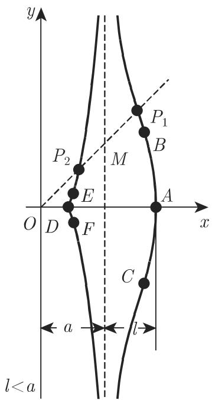
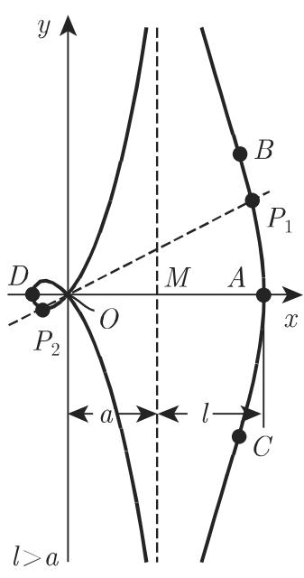
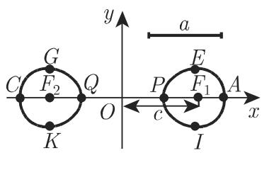

### 2.12 四阶(四次)曲线

#### 2.12.1 尼科梅德斯蚌线

尼科梅德斯(Nicomedes)蚌线(图 2.62) 是满足

$$
\overline {{O P}} = \overline {{O M}} \pm l\tag{2.232}
$$

的点 $P$ 的环形线, 其中 $M$ 为直线 $\overline{OP_1OP_2}$ 与渐近线 $x = a$ 的交点. 相对于渐近线, 曲线的右分支符号取 “+”, 左分支取 “-”. 尼科梅德斯蚌线的笛卡儿坐标、参数方程和极坐标方程分别为

$$
(x - a) ^ {2} \left(x ^ {2} + y ^ {2}\right) - l ^ {2} x ^ {2} = 0 \quad (a > 0, l > 0),\tag{2.233a}
$$

$$
x = a + l \cos \varphi , y = a \tan \varphi + l \sin \varphi
$$

$\left(a > 0, \text{右分支: } -\frac{\pi}{2} < \varphi < \frac{\pi}{2}, \text{左分支: } \frac{\pi}{2} < \varphi < \frac{3\pi}{2}\right),$

(2.233b)

$\rho = \frac{a}{\cos\varphi} \pm l$ （+:右分支，-：左分支）.

(2.233c)

  
(a)

  
(b)

  
图2.62  
(c)

(1) 右分支 渐近线为 $x = a$ 。顶点 $A$ 的坐标为 $(a + l, 0)$ ，拐点 $B, C$ 的横坐标为方程 $x^3 - 3a^2x + 2a(a^2 - l^2) = 0$ 的最大根，右分支与渐近线围成的面积 $S = \infty$ .

(2) 左分支 渐近线为 $x = a$ . 顶点 $D$ 的坐标为 $(a - l, 0)$ , 原点为奇点, 它的类型与 $a$ 和 $l$ 有关:

情形 a) 若 $l < a$ , 原点为孤立点 (图 2.62(a)), 曲线有两个拐点 $E, F$ , 其横坐标为方程 $x^{3} - 3a^{2}x + 2a(a^{2} - l^{2}) = 0$ 的第二大根.

情形 b) 若 l > a, 原点为二重点 (图 2.62(b)), 曲线在点 $x = a - \sqrt[3]{al^{2}}$ 有一个极大值和极小值. 原点处切线的斜率 $\tan \alpha = \frac{\pm \sqrt{l^{2} - a^{2}}}{a}$ , 曲率半径 $r_{0} = \frac{l \sqrt{l^{2} - a^{2}}}{2a}$ .

情形 c) 若 l = a，原点为尖点（图 2.62(c)).

#### 2.12.2 一般蚌线

尼科梅德斯蚌线是一般蚌线的特例, 通过把每点位置向量的长度延长一给定的常数 $\pm l$ , 可得到一已知曲线的蚌线. 若曲线的极坐标方程为 $\rho = f(\varphi)$ , 则其蚌线方程为

$$
\rho = f (\varphi) \pm l,\tag{2.234}
$$

因此尼科梅德斯蚌线是直线的蚌线.

#### 2.12.3 帕斯卡蜗线

(2.232) 中, 原点在圆周上的圆的蚌线称为帕斯卡蜗线(图 2.63), 它是一般蚌线的又一特例 (参见本页 2.12.2). 其笛卡儿坐标形式方程、极坐标方程和参数方程分别为 (也可参见第 136 页 (2.246c))

$$
\left(x ^ {2} + y ^ {2} - a x\right) ^ {2} = l ^ {2} \left(x ^ {2} + y ^ {2}\right) \quad (a > 0, l > 0),\tag{2.235a}
$$

$$
\rho = a \cos \varphi + l (a > 0, l > 0),\tag{2.235b}
$$

$$
x = a \cos^ {2} \varphi + l \cos \varphi , \quad y = a \cos \varphi \sin \varphi + l \sin \varphi \quad (a > 0, l > 0, 0 \leqslant \varphi <   2 \pi),\tag{2.235c}
$$

其中 $a$ 是圆的直径. 顶点 $A, B$ 坐标为 $(a \pm l, 0)$ , 曲线的形状与 $a$ 和 $l$ 有关, 参见图2.63和图2.64.

  
(a)

  
(b)  
图2.63

  
(c)

a) 极值点和拐点 若 $a > l$ , 曲线有四个极值点 $C, D, E, F$ ; 若 $a \leqslant l$ , 曲线在 $\cos \varphi = \frac{-l \pm \sqrt{l^2 + 8a^2}}{4a}$ 处有两个极值点. 若 $a < l < 2a$ , 在 $\cos \varphi = -\frac{2a^2 + l^2}{3al}$ 处有两拐点 $G$ 和 $H$ .

b) 二重切线 若 $l < 2a$ , 在点 $I, K$ 即 $\left(-\frac{l^2}{4a}, \pm \frac{l\sqrt{4a^2 - l^2}}{4a}\right)$ 处有二重切线.

c) 奇点 原点为奇点. 若 $a < l$ , 该点为孤立点; 若 $a > l$ , 该点为二重点, 此处切线斜率 $\tan \alpha = \pm \frac{\sqrt{a^2 - l^2}}{l}$ , 曲率半径 $r_0 = \frac{1}{2} \sqrt{a^2 - l^2}$ .

  
图2.64

当 a = l 时, 原点是尖点; 该曲线称为心脏线.

蜗线的面积 $S = \frac{\pi a^2}{2} + \pi l^2$ ，其中当 $a > l$ 时 (图 2.63(c))，内部环形的面积要计算两次.

#### 2.12.4 心脏线

心脏线(图 2.64) 可以按如下两种方式定义:

(1) 满足

$$
\overline {{O P}} = \overline {{O M}} \pm a\tag{2.236}
$$

的帕斯卡蜗线的特例, 其中 a 是圆的直径.

(2) 外摆线在定圆和动圆具有相同直径 $a$ 时的特例. 方程为

$$
\left(x ^ {2} + y ^ {2}\right) ^ {2} - 2 a x \left(x ^ {2} + y ^ {2}\right) = a ^ {2} y ^ {2} \quad (a > 0),\tag{2.237a}
$$

其参数方程和极坐标方程分别为

$$
x = a \cos \varphi (1 + \cos \varphi), \quad y = a \sin \varphi (1 + \cos \varphi) \quad (a > 0, 0 \leqslant \varphi <   2 \pi),\tag{2.237b}
$$

$$
\rho = a (1 + \cos \varphi) \quad (a > 0).\tag{2.237c}
$$

原点是一个尖点, 顶点 $A$ 的坐标为 $(2a,0)$ ; 当 $\cos \varphi = \frac{1}{2}$ 时, 有极值点 $C$ 和 $D$ , 坐标为 $\left(\frac{3}{4} a, \pm \frac{3\sqrt{3}}{4} a\right)$ . 面积 $S = \frac{3}{2}\pi a^2$ , 即为圆的面积与直径 $a$ 乘积的六倍; 曲线长 $L = 8a$ .

$a < c$

#### 2.12.5 卡西尼曲线

与两焦点 $F_{1}(c,0)$ 和 $F_{2}(-c,0)$ 的距离乘积为常数 $a^2 \neq 0$ 的点 $P$ 的轨迹称为卡西尼曲线(图2.65):

$$
\overline {{F _ {1} P}} \cdot \overline {{F _ {2} P}} = a ^ {2},\tag{2.238}
$$

其笛卡儿坐标方程与极坐标方程分别为

$$
(x ^ {2} + y ^ {2}) ^ {2} - 2 c ^ {2} (x ^ {2} - y ^ {2}) = a ^ {4} - c ^ {4} \quad (a > 0, c > 0),\tag{2.239a}
$$

$$
\rho^ {2} = c ^ {2} \cos 2 \varphi \pm \sqrt {c ^ {4} \cos^ {2} 2 \varphi + (a ^ {4} - c ^ {4})} (a > 0, c > 0).\tag{2.239b}
$$

曲线的形状与 $a$ 和 $c$ 有关：

  
(a)

  
(b)

  
图2.65  
(c)

$a > c\sqrt{2}$ 当 $a > c\sqrt{2}$ 时，曲线形状为类似椭圆的卵形（图2.65(a))，与 $x$ 轴交点 $A, C$ 的坐标为 $(\pm\sqrt{a^2 + c^2}, 0)$ ，与 $y$ 轴交点 $B, D$ 的坐标为 $(0, \pm\sqrt{a^2 - c^2})$ .

$a = c\sqrt{2}$ 当 $a = c\sqrt{2}$ 时, 曲线在点 $A, C(\pm c\sqrt{3}, 0)$ 和点 $B, D(0, \pm c)$ 的类型相同, 在点 $B, D$ 的曲率为 0 , 即与直线 $y = \pm c$ 存在紧密接触.

$c < a < c\sqrt{2}$ 当 $c < a < c\sqrt{2}$ 时, 曲线为压卵形 (图 2.65(b)), 与坐标轴的交点同 $a > c\sqrt{2}$ 时的情况相同, 极值点除 $B, D$ 外, 点 $E, G, K, I$ 也为极值点, 坐标为 $\left(\pm\frac{\sqrt{4c^{4}-a^{4}}}{2c}, \pm\frac{a^{2}}{2c}\right)$ , 点 $P, L, M, N$ 为四个拐点, 坐标为 $\left(\pm\sqrt{\frac{1}{2}(m-n)}, \pm\sqrt{\frac{1}{2}(m+n)}\right)$ , 其中 $n = \frac{a^{4}-c^{4}}{3c^{2}}, m = \sqrt{\frac{a^{4}-c^{4}}{3}}$ .

a = c 当 a = c 时, 曲线为双纽线.

a < c 当 a < c 时, 为两条卵形线 (图 2.65(c)), 与 x 轴交点 A, C 和 P, Q 的坐标分别为 $\left(\pm\sqrt{a^{2}+c^{2}}, 0\right)$ 和 $\left(\pm\sqrt{c^{2}-a^{2}}, 0\right)$ . 极值点 E, G, K, I 的坐标为 $\left(\pm\frac{\sqrt{4c^{4}-a^{4}}}{2c}, \pm\frac{a^{2}}{2c}\right)$ , 曲率半径 $r=\frac{2a^{2}\rho^{3}}{c^{4}-a^{4}+3\rho^{4}}$ , 其中 $\rho$ 满足极坐标表达式.

#### 2.12.6 双纽线

双纽线(图 2.66) 是卡西尼曲线的特殊情况, 满足条件

$$
\overline {{F _ {1} P}} \cdot \overline {{F _ {2} P}} = \left(\frac {\overline {{F _ {1} F _ {2}}}}{2}\right) ^ {2},\tag{2.240}
$$

定点 $F_{1}, F_{2}$ 坐标为 $(\pm a, 0)$ . 曲线在笛卡儿坐标系下的方程为

$$
(x ^ {2} + y ^ {2}) ^ {2} - 2 a ^ {2} (x ^ {2} - y ^ {2}) = 0 \quad (a > 0),\tag{2.241a}
$$

极坐标方程为

$$
\rho = a \sqrt {2 \cos 2 \varphi} (a > 0).\tag{2.241b}
$$

原点为一个二重点, 同时也为拐点, 此处的切线方程为 $y = \pm x$ .

  
图2.66

与 $x$ 轴交点 $A, C$ 的坐标为 $(\pm a\sqrt{2}, 0)$ ，曲线极值点 $E, G, K, I$ 的坐标为 $\left(\pm \frac{a\sqrt{3}}{2}, \pm \frac{a}{2}\right)$ ，极值点处极角 $\varphi = \pm \frac{\pi}{6}$ 。曲率半径 $r = \frac{2a^2}{3\rho}$ ，每个环形的面积均为 $S = a^2$ 。
