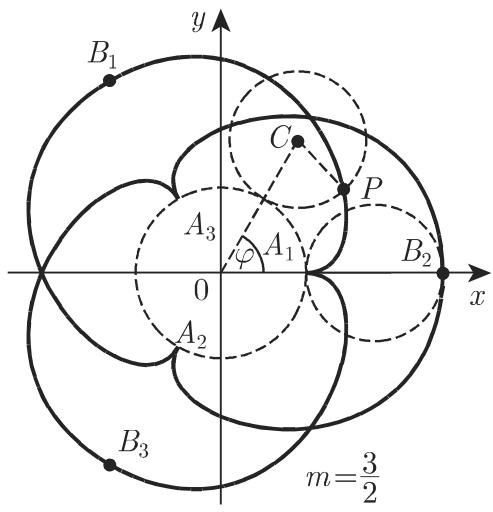
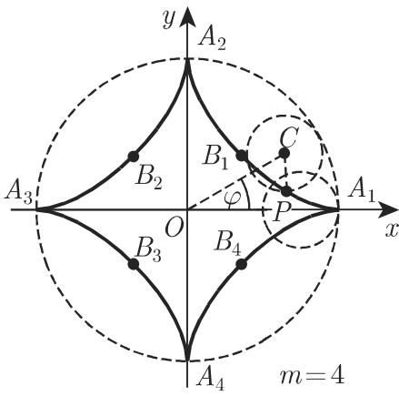
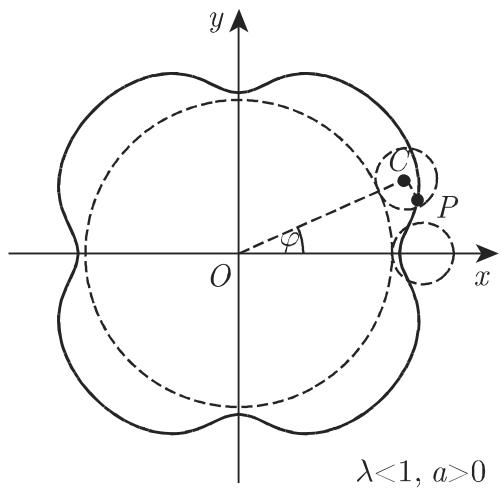
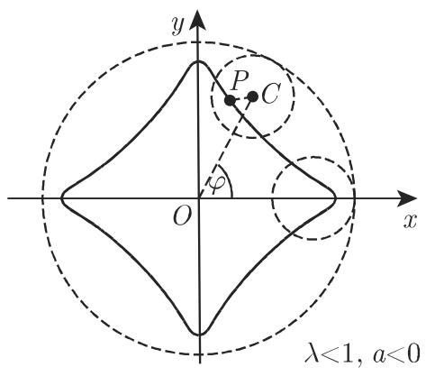

### 2.13 摆线

#### 2.13.1 常见(标准)摆线

摆线是当圆沿一直线做无滑动滚动时，圆周上的一个固定点所经过的轨迹(图2.67). 通常摆线的参数方程为

$$
x = a (t - \sin t), \quad y = a (1 - \cos t) \quad (a > 0, - \infty <   t <   \infty),\tag{2.242a}
$$

其中 $a$ 为圆的半径, $t$ 为角 $\angle PC_{1}B$ 的弧度. 在笛卡儿坐标系下, 有

$$
x + \sqrt {y (2 a - y)} = a \mathrm{arc} _ {k} \cos {\frac {a - y}{a}} \quad (a > 0, k = 0, \pm 1, \pm 2, \dots).\tag{2.242b}
$$

曲线是以 $\overline{O_{0}O_{1}} = 2\pi a$ 为周期的周期曲线，点 $O_{0}, O_{1}, O_{2}, \cdots, O_{k} = (2k\pi a, 0)$ 为尖点，最高点为 $A_{k+1} = ((2k + 1)\pi a, 2a) (k = 0, \pm1, \pm2, \cdots)$ . $O_{0}P$ 的弧长

$L = 8a \sin^{2} \left( \frac{t}{4} \right)$ , 单拱形的长度 $L_{O_0 A_1 O_1} = 8a$ , 单拱形围成的面积 $S = 3\pi a^2$ , 曲率半径 $r = 4a \sin \frac{t}{2}$ , 在最高点处曲率 $r_A = 4a$ . 摆线的渐屈线 (参见第 340 页 3.6.1.6) 为全等的摆线, 如图 2.67 中虚线所示.

  
图2.67

#### 2.13.2 长摆线与短摆线,或次摆线

当圆沿一直线做无滑动滚动时, 固定在以圆心为始点的半直线上的圆内或圆外一定点经过的轨迹称为长摆线与短摆线, 或次摆线(图 2.68).

  
图2.68

次摆线的参数方程形如

$$
x = a (t - \lambda \sin t),\tag{2.243a}
$$

$$
y = a (1 - \lambda \cos t),\tag{2.243b}
$$

其中 $a$ 为圆的半径， $t$ 为角 $\angle PC_{1}M, \lambda a = \overline{C_{1}P}$ .

当 $\lambda > 1$ 时, 为长摆线, 当 $\lambda < 1$ 时, 为短摆线.

曲线为以 $\overline{O_0O_1} = 2\pi a$ 为周期的周期曲线，极大值点

$$
A _ {1}, A _ {2}, \dots , A _ {k + 1} = ((2 k + 1) \pi a, (1 + \lambda) a),
$$

极小值点

$$
B _ {0}, B _ {1}, B _ {2}, \dots , B _ {k} = (2 k \pi a, (1 - \lambda) a) \quad (k = 0, \pm 1, \pm 2, \dots).
$$

长摆线有二重点 $D_{0}, D_{1}, D_{2}, \cdots, D_{k} = (2k\pi a, a\left(1 - \sqrt{\lambda^{2} - t_{0}^{2}}\right))$ ，其中 $t_{0}$ 为方程 $t = \lambda \sin t$ 的最小正根.

短摆线有拐点 $E_{1}, E_{2}, \cdots, E_{k+1} = \left[a \left(\operatorname{arc}_{k} \cos \lambda - \lambda \sqrt{1 - \lambda^{2}}\right), a (1 - \lambda^{2})\right]$ .
通过计算积分 $L = a \int_{0}^{2\pi} \sqrt{1 + \lambda^{2} - 2\lambda \cos t} dt$ 可得到一个周期的曲线长．图 2.68 中阴影部分的面积 $S = \pi a^{2}(2 + \lambda^{2})$ ．曲率半径 $r = a \frac{(1 + \lambda^{2} - 2\lambda \cos t)^{3/2}}{\lambda (\cos t - \lambda)}$ ，且在极大值点曲率 $r_{A} = -a \frac{(1 + \lambda)^{2}}{\lambda}$ ，极小值点曲率 $r_{B} = a \frac{(1 - \lambda)^{2}}{\lambda}$ .

#### 2.13.3 外摆线

一个动圆沿着另一个定圆的外侧做无滑动滚动时, 圆周上一点的轨迹称为外摆线(图 2.69). 外摆线的参数方程为

$$
\begin{array}{l} {x = (A + a) \cos \varphi - a \cos \frac {A + a}{a} \varphi ,} \\ {y = (A + a) \sin \varphi - a \sin \frac {A + a}{a} \varphi \quad (- \infty <   \varphi <   \infty),} \end{array}\tag{2.244}
$$

其中 A 为定圆为半径, a 为动圆的半径, $\varphi$ 为角 $\not\prec C_{0}x$ , 曲线的形状与商 $m = \frac{A}{a}$ 有关.

当 $m = 1$ 时, 曲线为心脏线(参见第129页2.12.4).

  
(a)

  
图2.69  
(b)

m 为整数 当 m 为整数时, 曲线由围绕着固定曲线的 m 个形状相同分支组成 (图 2.69(a)). 尖点 $A_{1}, A_{2}, \cdots, A_{m}$ 坐标为 $\left(\rho = A, \varphi = \frac{2k\pi}{m} (k = 0, 1, \cdots, m - 1)\right)$ , 顶点 $B_{1}, B_{2}, \cdots, B_{m}$ 坐标为 $\left(\rho = A + 2a, \varphi = \frac{2\pi}{m} \left(k + \frac{1}{2}\right)\right)$ .

m 为有理分数 若 m 为非整有理数, 形状相同的分支彼此依次绕一定圆, 且与前一分支相交, 直到动点 P 经有限次循环后回到起点 (图 2.69(b)).

m 为无理数 当 m 为无理数时, 动点 P 要往返无穷多次, 且永远不会回到起点.

一个分支的长度 $L_{A_1B_1A_2} = \frac{8(A + a)}{m}$ ，故对整数 $m$ ，封闭曲线的总长 $L_{\text{总}} = 8(A + a)$ 。区域 $A_1B_1A_2A_1$ 的面积（不包括定圆部分） $S = \pi a^2\left(\frac{3A + 2a}{A}\right)$ 。曲率半径 $r = \frac{4a(A + a)}{2a + A}\sin \frac{A\varphi}{2a}$ ，顶点处 $r_B = \frac{4a(A + a)}{2a + A}$ 。

#### 2.13.4 内摆线与星形线

一个动圆内切于一个定圆做无滑动滚动时，动圆圆周上一点的轨迹称为内摆线(图2.70). 内摆线的方程、顶点坐标、尖点坐标、弧长公式、面积公式以及曲率半径都与外摆线的相应公式类似，只需用“-a”代替原来的“+a”. 当 $m$ 为整数、有理数和无理数时，尖点的个数都与外摆线相同（现在 $m > 1$ 成立）.

  
(a)

  
(b)  
图2.70

m = 2 当 m = 2 时, 曲线实际上为定圆的直径.

m = 3 当 m = 3 时, 内摆线有三个分支 (图 2.70(a)), 方程为

$$
x = a (2 \cos \varphi + \cos 2 \varphi), \quad y = a (2 \sin \varphi - \sin 2 \varphi),\tag{2.245a}
$$

且有 $L_{总} = 16a, S_{总} = 2\pi a^{2}.$

m = 4 当 m = 4 时 (图 2.70(b)), 内摆线有四个分支, 称为星形线. 笛卡儿坐标系下的方程和参数方程分别为

$$
x ^ {\frac {2}{3}} + y ^ {\frac {2}{3}} = A ^ {\frac {2}{3}},\tag{2.245b}
$$

$$
x = A \cos^ {3} \varphi , y = A \sin^ {3} \varphi (0 \leqslant \varphi <   \pi),\tag{2.245c}
$$

且有 $L_{\text{总}} = 24a = 6A, S_{\text{总}} = \frac{3}{8}\pi A^2.$

#### 2.13.5 长短幅外摆线与内摆线

长短幅外摆线和长短幅内摆线也称为外旋轮线和内旋轮线，是指一动圆绕一定圆的内侧（内旋轮线）或外侧（外旋轮线）做无滑动滚动时，在动圆的内侧或外侧，从动圆圆心出发的射线上一点的轨迹（图2.71和图2.72).

  
(a)

  
(b)

图2.71  
  
(a)

  
图2.72  
(b)

外旋轮线的参数方程为

$$
\begin{array}{l} {x = (A + a) \cos \varphi - \lambda a \cos \left(\frac {A + a}{a} \varphi\right),} \\ {y = (A + a) \sin \varphi - \lambda a \sin \left(\frac {A + a}{a} \varphi\right),} \end{array}\tag{2.246a}
$$

其中 A 为定圆的半径, a 为动圆的半径. 用 “-a” 代替上式中的 “+a”, 得内旋轮线的参数方程. 当 $\lambda a = \overline{CP}$ 时, 根据考虑的是长辐曲线还是短辐曲线, 不等式 $\lambda > 1$ 或 $\lambda < 1$ 有一个成立.

若 $A = 2a$ ，对任意 $\lambda \neq 1$ ，内摆线方程

$$
x = a (1 + \lambda) \cos \varphi , \quad y = a (1 - \lambda) \sin \varphi \quad (0 \leqslant \varphi <   2 \pi)\tag{2.246b}
$$

是半轴为 $a(1 + \lambda)$ 和 $a(1 - \lambda)$ 的椭圆. 当 $A = a$ 时, 曲线为帕斯卡蜗线(也可参见第128页2.12.3)

$$
x = a (2 \cos \varphi - \lambda \cos 2 \varphi), y = a (2 \sin \varphi - \lambda \sin 2 \varphi).\tag{2.246c}
$$

注 对于 128 页 2.12.3 中的帕斯卡蜗线, 用 a 表示的量此处用 $2a\lambda$ 表示, l 是此处的直径 2a. 另外坐标系不同.
