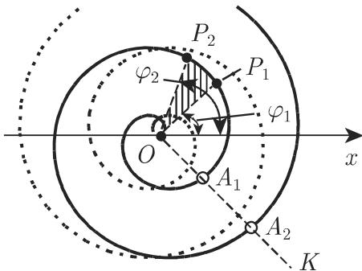
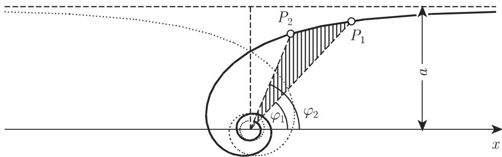
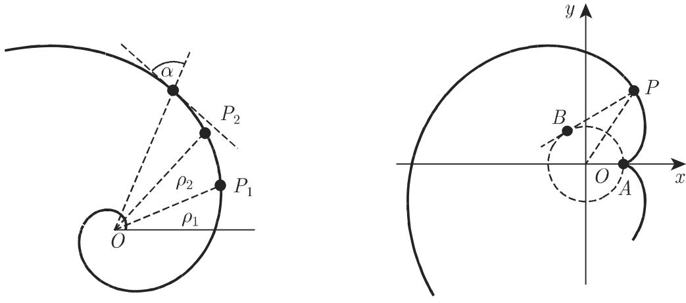
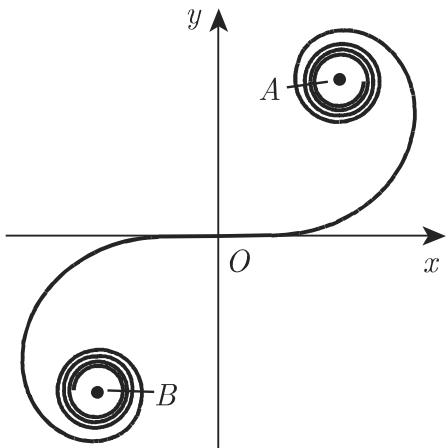

### 2.14 螺线

#### 2.14.1 阿基米德螺线

当射线以固定的角速度 w 绕原点旋转时, 一个点从原点沿射线以匀速 v 移动所产生的轨迹称为阿基米德螺线(图 2.73), 阿基米德螺线的极坐标方程为

$$
\rho = a | \varphi |, \quad a = \frac {v}{\omega} \quad (a > 0, - \infty <   \varphi <   \infty).\tag{2.247}
$$

曲线在关于 y 轴对称位置有两个分支 $(\varphi < 0, \varphi > 0)$ . 每条射线 OK 与曲线的交点为 $O, A_{1}, A_{2}, \cdots, A_{n}, \cdots$ ; 距离 $\overline{A_{i}A_{i+1}} = 2\pi a$ . $\widehat{OP}$ 的弧长 $L = \frac{a}{2}\left(\varphi\sqrt{\varphi^{2} + 1} + \operatorname{Arsinh}\varphi\right)$ , 当 $\varphi$ 很大时, 表达式 $\frac{2L}{a\varphi^{2}}$ 趋于 1. 区域 $P_{1}OP_{2}$ 的面积 $S = \frac{a^{2}}{6}(\varphi_{2}^{3} - \varphi_{1}^{3})$ . 曲率半径 $r = a\frac{(\varphi^{2} + 1)^{3/2}}{\varphi^{2} + 2}$ , 原点处曲率半径 $r_{0} = \frac{a}{2}$ .

  
图2.73

#### 2.14.2 双曲螺线

双曲螺线的极坐标方程为

$$
\rho = \frac {a}{| \varphi |} \quad (a > 0, - \infty <   \varphi <   0, 0 <   \varphi <   \infty).\tag{2.248}
$$

双曲螺线（图2.74）在关于 $y$ 轴对称位置有两个分支 $(\varphi < 0, \varphi > 0)$ . 直线 $y = a$ 为两个分支的渐近线, 原点为渐近点. 区域 $P_{1}OP_{2}$ 的面积 $S = \frac{a^{2}}{2}\left(\frac{1}{\varphi_{1}} - \frac{1}{\varphi_{2}}\right)$ , 且 $\lim_{\varphi_{2} \to \infty} S = \frac{a^{2}}{2\varphi_{1}}$ . 曲率半径 $r = \frac{a}{\varphi}\left(\frac{\sqrt{1 + \varphi^{2}}}{\varphi}\right)^{3}$ .

  
图2.74

#### 2.14.3 对数螺线

对数螺线(图 2.75) 与从原点 O 出发的所有射线的交角均相等, 为 $\alpha$ . 对数螺线的极坐标方程为

$$
\rho = a ^ {k \varphi} (a > 0, - \infty <   \varphi <   \infty),\tag{2.249}
$$

其中 $k = \cot \alpha$ . 曲线的渐近点为原点, $\widehat{P_{1}P_{2}}$ 的弧长 $L = \frac{\sqrt{1 + k^{2}}}{k} (\rho_{2} - \rho_{1})$ , 从原点到 P 的曲线 $\widehat{OP}$ 弧长的极限 $L_{0} = \frac{\sqrt{1 + k^{2}}}{k} \rho$ . 曲率半径 $r = \sqrt{1 + k^{2}} \rho = L_{0} k$ .

圆的特例 若 $\alpha = \frac{\pi}{4}$ , 则 k = 0, 曲线为圆.

圆的特例 若 $\alpha = \frac{\pi}{2}$ , 则 $k = 0$ , 曲线为圆.

#### 2.14.4 圆的渐伸线

把一条细绳绕在一个定圆上, 拉开绳子的一端并拉直, 绳子端点的轨迹是一条曲线, 满足 $\widehat{AB} = \overline{BP}$ , 这条曲线称作圆的渐伸线(图 2.76). 圆的渐伸线的参数方程为

$$
x = a \cos \varphi + a \varphi \sin \varphi , y = a \sin \varphi - a \varphi \cos \varphi ,\tag{2.250}
$$

其中 $a$ 为圆的半径, $\varphi = \not\leq BOx$ . 曲线在关于 $x$ 轴对称的位置有两个分支, $A(a,0)$ 为尖点, 与 $x$ 轴的交点坐标 $x = \frac{a}{\cos\varphi_0}$ , 其中 $\varphi_0$ 为方程 $\tan \varphi = \varphi$ 的根. $\widehat{AP}$ 的弧长 $L = \frac{1}{2} a\varphi^2$ 。曲率半径 $r = a\varphi = \sqrt{2aL}$ ；曲率中心 $B$ 在圆上，即圆是曲线的渐屈线。

  
图2.75  
图2.76

  
图2.77

#### 2.14.5 回旋螺线

在一点处曲率半径与原点到该点的弧长成反比的点的集合为回旋螺线(图 2.77), 即

$$
r = \frac {a ^ {2}}{s} (a > 0).\tag{2.251a}
$$

回旋螺线的参数方程为

$$
x = a \sqrt {\pi} \int_ {0} ^ {t} \cos \frac {\pi t ^ {2}}{2} \mathrm{d} t, \quad y = a \sqrt {\pi} \int_ {0} ^ {t} \sin \frac {\pi t ^ {2}}{2} \mathrm{d} t, \quad \text {其中} \quad t = \frac {s}{a \sqrt {\pi}}, \quad s = \widehat {O P}.\tag{2.251b}
$$

上述积分尽管不能用初等函数表示, 但对任意给定的参数值 $t = t_0, t_1, \cdots$ , 可用数值积分进行计算 (参见第 1252 页 19.3), 因此回旋螺线可以逐点画出. 计算机算法见文献 [3.12].

曲线关于原点中心对称, 原点也为拐点. 拐点处的切线为 $x$ 轴, $A, B$ 为曲线的渐近点, 坐标分别为 $\left(+\frac{a\sqrt{\pi}}{2}, +\frac{a\sqrt{\pi}}{2}\right)$ 和 $\left(-\frac{a\sqrt{\pi}}{2}, -\frac{a\sqrt{\pi}}{2}\right)$ . 回旋螺线广泛应用于公路工程, 如用回旋螺线段实现直线和圆弧间的过渡.
