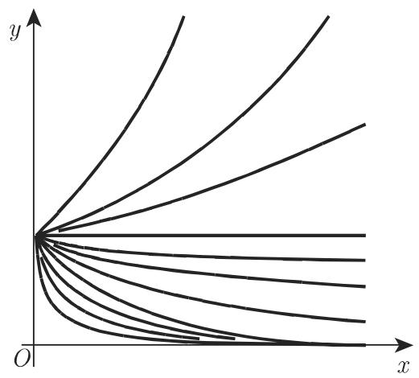
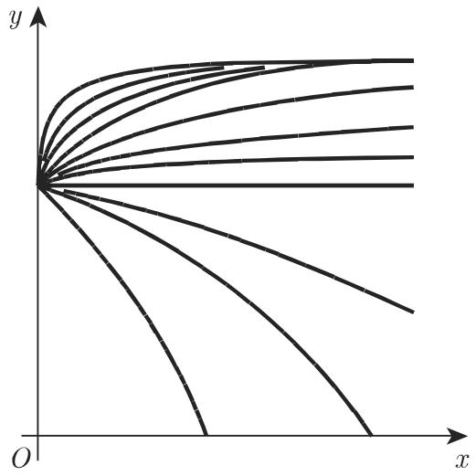
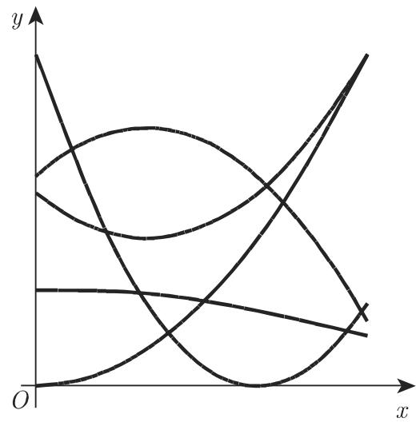
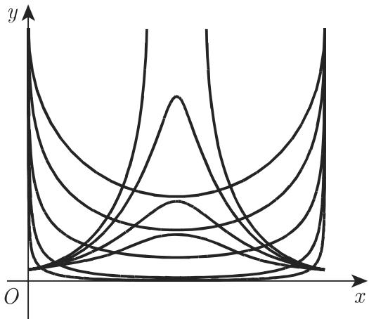
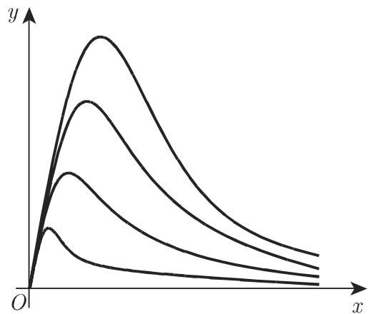
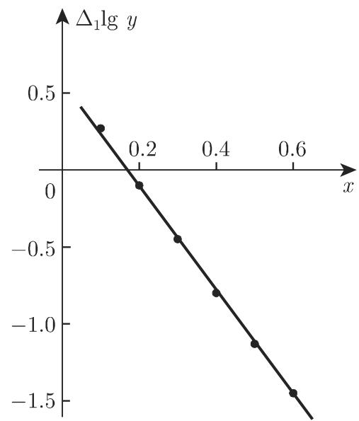

### 2.16 经验曲线的确定

#### 2.16.1 步骤

2.16.1.1 曲线形状的比较

若只有关于函数 $y = f(x)$ 的经验数据，则有可能通过两步得到一个近似公式。首先选择一个含三个参数的近似公式，再计算参数的值。若对这类公式没有理论上的描述，可以先从所有可能的函数中选择一个最简单的近似公式，再将其曲线与经验数据曲线相比较。有时从直观上去判断的相似性并不可靠，故此选择完近似公式后，确定参数之前必须检查它是否恰当。

2.16.1.2 修正

假设 $x$ 与 $y$ 之间有明确关系, 选择近似公式时引进两个函数 $X = \varphi(x, y)$ 和 $Y = \psi(x, y)$ , 满足线性关系

$$
Y = A X + B,\tag{2.254}
$$

其中 A, B 为常数. 对给定的 x 和 y 的值, 计算相应的 X 和 Y 的值, 借助其图示很容易判断出它们是否大约在一条直线上, 据此能够判断所选择的公式恰当与否.

■ A: 若近似公式为 $y = \frac{x}{ax + b}$ , 则可令 X = x, $Y = \frac{x}{y}$ , 有 $Y = aX + b$ ; 另外也

可令 $X = \frac{1}{x}, Y = \frac{1}{y}$ , 有 $Y = a + bX$ .

■ B: 利用半对数坐标纸, 参见第 151 页 2.17.2.1.

■ C: 利用双对数坐标纸, 参见第 152 页 2.17.2.2.

为了确定经验数据是否满足线性关系 $Y = AX + B$ ，可以利用线性回归或相关(参见第1095页16.3.4). 把函数关系化简成线性关系称为修正, 本页2.16.2中举例介绍了一些公式的修正, 148页2.16.2.12也详细讨论了一个例子.

2.16.1.3 参数的确定

最小二乘法是确定参数的最重要、最准确的方法 (参见第 1097 页 16.3.4.2), 但有时也可以成功地采用一些更简单的方法, 如平均值法.

1. 平均值法

利用 “修正” 的变量 X 和 Y 的线性相关性 $Y = AX + B$ ，平均值法如下进行：把给定值 $Y_{i}, X_{i}$ 的条件方程分为两组，每组方程的数目相等或者近似相等，通过向这两组方程中添加方程，可以得到两个方程，从中确定出 A, B。接着由最初的 x, y 代替 X 和 Y，就得到了要找的 x, y 之间的关系。

若不能确定所有的参数, 可以借助其他量 $\overline{X}$ 和 $\overline{Y}$ 的修正再次利用平均值法 (参见第 147 页 2.16.2.11 中的例子).

当某些参数出现在近似公式的非线性关系中时, 前面所说的修正和平均值法都会用到, 具体例子见 (2.267b) 和 (2.267c).

2. 最小二乘法

当某些参数出现在近似公式的非线性关系中时，最小二乘法往往会产生非线性拟合问题。它们的解往往要经过大量数值计算和一个比较好的初始近似，利用修正和平均值法可能确定这些近似。

#### 2.16.2 实用的经验公式

本节讨论经验函数相关性的一些简单情形，并给出相应的图示。每个图示都给出几条与公式中不同参数值相对应的曲线，在随后几节中讨论参数对曲线形状的影响。

为了选择恰当的函数, 必须考虑其对应的图像, 以便再现经验数据. 例如, 我们不能仅在经验数据曲线有极大或极小值时判断公式 $y = ax^2 + bx + c$ 是否合理.

2.16.2.1 幂函数

1. $y = ax^{b}$ 型

图2.80给出了当幂函数

$$
y = a x ^ {b}\tag{2.255a}
$$

的指数 b 取不同值时曲线的形状. 图 2.15、图 2.21、图 2.24～图 2.26 也给出了不同指数的曲线. 将 (2.44)、(2.45) 和 (2.50) 作为 n 次抛物线、反比函数和倒数幂进行了讨论, 做修正时可取对数

$$
X = \log x, Y = \log y: Y = \log a + b X.\tag{2.255b}
$$

  
图2.80

2. $y = ax^{b} + c$ 型

公式

$$
y = a x ^ {b} + c\tag{2.256a}
$$

所表示的曲线与 (2.255a) 类似, 但要在 $y$ 轴方向上平移 $c$ 个单位 (图 2.82), 若 $b$ 已知, 可做修正

$$
X = x ^ {b}, \quad Y = y: \quad Y = a X + c.\tag{2.256b}
$$

若 b 未知, 首先确定 c, 然后可做修正

$$
X = \log x, Y = \log (y - c): Y = \log a + b X.\tag{2.256c}
$$

  
图2.81

  
图2.82

为了确定 $c$ , 可以任选两个横坐标 $x_{1}, x_{2}$ 和第三个横坐标 $x_{3} = \sqrt{x_{1}x_{2}}$ , 以及三个相应的纵坐标 $y_{1}, y_{2}, y_{3}$ , 满足

$$
c = \frac {y _ {1} y _ {2} - y _ {3} ^ {2}}{y _ {1} + y _ {2} - 2 y _ {3}}.\tag{2.256d}
$$

在确定出 a, b 之后, 可以得到正确的 c, 即量 $y - ax^{b}$ 的均值.

2.16.2.2 指数函数

1. $y = a\mathrm{e}^{bx}$ 型

图2.81给出了函数

$$
y = a \mathrm{e} ^ {b x}\tag{2.257a}
$$

的曲线图形. 92 页 2.6.1 中讨论了指数函数(2.54) 和它的图像 (图 2.26). 可进行如下修正

$$
X = x, \quad Y = \log y \colon \quad Y = \log a + b \log \mathrm{e} \cdot X.\tag{2.257b}
$$

2. $y = a\mathrm{e}^{bx} + c$ 型

公式

$$
y = a \mathrm{e} ^ {b x} + c\tag{2.258a}
$$

所表示的曲线与 (2.257a) 相同, 但要在 $y$ 轴方向上平移 $c$ 个单位 (图 2.83). 对 $c$ 确定出 $c_{1}$ 后可做如下修正

$$
Y = \log (y - c _ {1}), \quad X = x: \quad Y = \log a + b \log \mathrm{e} \cdot X.\tag{2.258b}
$$

为了确定像 (2.256d) 中那样的 $c$ , 可以任选两个横坐标 $x_{1}, x_{2}$ 和第三个横坐标 $x_{3} = \frac{x_{1} + x_{2}}{2}$ , 以及三个相应的纵坐标 $y_{1}, y_{2}, y_{3}$ , 得到 $c = \frac{y_{1}y_{2} - y_{3}^{2}}{y_{1} + y_{2} - 2y_{3}}$ . 确定出 $a, b$ 之后, 可以得到正确的 $c$ , 即量 $y - ax^{b}$ 的均值.

2.16.2.3 二次多项式

图2.84给出了二次多项式

$$
y = a x ^ {2} + b x + c\tag{2.259a}
$$

的所有可能的曲线形状. 关于二次多项式 (2.41) 及其曲线图示 2.12 的讨论见 82 页 2.3.2. 通常利用最小二乘法可确定出系数 $a, b, c$ ; 但在这种情况下也可能进行修正. 选择任一数据点 $(x_{1}, y_{1})$ , 做修正

$$
X = x, \quad Y = \frac {y - y _ {1}}{x - x _ {1}}: \quad Y = (b + a x _ {1}) + a X.\tag{2.259b}
$$

若给定的 $x$ 值构成一个公差为 $h$ 的等差数列, 可做修正

$$
Y = \Delta y, \quad X = x: \quad Y = (b h + a h ^ {2}) + 2 a h X.\tag{2.259c}
$$

在这两种情况中，由方程

$$
\sum y = a \sum x ^ {2} + b \sum x + n c\tag{2.259d}
$$

确定出 a, b 后, 可计算 c; n 为给定的 x 值的个数, 并由此可以计算和式.

  
图2.83

  
图2.84

2.16.2.4 有理线性函数

第 85 页 2.4 中 (2.46) 和图 2.17(参见第 86 页) 已讨论了有理线性函数:

$$
y = \frac {a x + b}{c x + d}.\tag{2.260a}
$$

对任一数据点 $(x_{1},y_{1})$ ，可按如下方式进行修正

$$
Y = \frac {x - x _ {1}}{y - y _ {1}}, \quad X = x: \quad Y = A + B X.\tag{2.260b}
$$

A, B 确定后, 可得到形如 $(2.260c)$ 的关系

$$
y = y _ {1} + \frac {x - x _ {1}}{A + B x}.\tag{2.260c}
$$

有时有理线性函数不是 (2.260a) 的形式, 而是满足 (2.260d)

$$
y = \frac {x}{c x + d} \quad \text {或} \quad y = \frac {1}{c x + d},\tag{2.260d}
$$

在前一情况下可做修正 $X = \frac{1}{x}, Y = \frac{1}{y}$ 或 $X = x, Y = \frac{x}{y}$ ; 后一情况可做修正 $X = x, Y = \frac{1}{y}$ .

2.16.2.5 二次多项式的平方根

方程

$$
y ^ {2} = a x ^ {2} + b x + c\tag{2.261}
$$

可能表示的曲线形状如图 2.85 所示．91 页中已讨论过函数 (2.52) 及其图像 (图 2.23). 若引进新的变量 $Y = y^{2}$ ，这个问题可以转化成 143 页 2.16.2.3 中二次多项式的情况.

2.16.2.6 一般误差曲线

函数

$$
y = a \mathrm{e} ^ {b x + c x ^ {2}} \quad \text {或} \quad \log y = \log a + b x \log \mathrm{e} + c x ^ {2} \log \mathrm{e}\tag{2.262}
$$

的典型曲线图像如图 2.86 所示. 方程 (2.61) 和图 2.30 $^{①}$ 已讨论过这个函数 (参见 95\~96 页).

  
图2.85

  
图2.86

若引进新的变量 $Y = \log y$ ，这个问题可以转化成 143 页 2.16.2.3 中二次多项式的情况.

2.16.2.7 第II类三次曲线

函数

$$
y = \frac {1}{a x ^ {2} + b x + c}\tag{2.263}
$$

的所有可能形状如图 2.87 所示, 方程 (2.48) 和图 2.19 曾讨论过该函数 (参见第 87\~88 页).

若引进新的变量 $Y = \frac{1}{y}$ ，这个问题可以转化成 143 页 2.16.2.3 中二次多项式的情况.

2.16.2.8 第 III 类三次曲线

函数

$$
y = \frac {x}{a x ^ {2} + b x + c}\tag{2.264}
$$

①原文中为图 2.31, 译者认为, 应订正为图 2.30.——译者注的典型曲线形状如图 2.88 所示, 方程 (2.49) 和图 2.20 讨论过该函数 (参见 88\~89 页).

  
图2.87

  
图2.88

若引进新的变量 $Y = \frac{x}{y}$ ，这个问题可以转化成143页2.16.2.3中二次多项式的情况.

2.16.2.9 第I类三次曲线

函数

$$
y = a + \frac {b}{x} + \frac {c}{x ^ {2}}\tag{2.265}
$$

的典型曲线形状如图 2.89 所示, 方程 (2.47) 和图 2.18 讨论过该函数 (参见第 86\~87 页).

若引进新的变量 $X = \frac{1}{x}$ , 这个问题可以转化成 143 页 2.16.2.3 中二次多项式的情况.

2.16.2.10 幂函数和指数函数的乘积

函数

$$
y = a x ^ {b} \mathrm{e} ^ {c x} (c \neq 0)\tag{2.266a}
$$

的典型曲线形状如图 2.90 所示, 方程 (2.62) 和图 2.31 讨论过该函数 (参见第 96\~97 页).

  
图2.89

  
图2.90

若 $x$ 的经验值构成公差为 $h$ 的等差数列, 可按

$$
Y = \Delta \log y, \quad X = \Delta \log x: \quad Y = h c \log \mathrm{e} + b X\tag{2.266b}
$$

做修正. 其中 $\Delta \log y$ 和 $\Delta \log x$ 分别表示两个相继的 $\log y$ 和 $\log x$ 之差. 若 $x$ 的经验值构成公比为 $q$ 的等比数列, 可按

$$
X = x, \quad Y = \Delta \log y \colon \quad Y = b \log q + c (q - 1) X \log e\tag{2.266c}
$$

做修正．b,c 确定之后，可得到给定方程的对数，并像 $(2.259\mathrm{d})$ 那样计算出 $\log a$ 的值.

若 $x$ 的值不构成等比数列, 但可选择由两个 $x$ 的值构成的数对, 满足它们的商为常数 $q$ , 则作代换 $Y = \Delta_1 \log y$ 后可按 $x$ 的值为等比数列的修正方法进行修正. 其中 $\Delta_1 \log y$ 表示商为常数 $q$ 的两个 $x$ 值所对应的两个 $\log y$ 的差 (参见第 148 页 2.16.2.12).

2.16.2.11 指数和

指数和

$$
y = a \mathrm{e} ^ {b x} + c \mathrm{e} ^ {d x}\tag{2.267a}
$$

的典型曲线形状如图 2.91 所示．方程 (2.60) 和图 2.29 讨论过该函数 (参见第 94\~95 页).

  
图2.91

若 $x$ 的值构成公差为 $h$ 的等差数列, $y, y_1, y_2$ 为已知函数的任意三个连续的值, 则可做如下修正

$$
Y = \frac {y _ {2}}{y}, X = \frac {y _ {1}}{y}: Y = (\mathrm{e} ^ {b h + d h}) X - \mathrm{e} ^ {b h} \mathrm{e} ^ {d h}.\tag{2.267b}
$$

b,d 确定之后, 利用

$$
\overline {{Y}} = y \mathrm{e} ^ {- d x}, \quad \overline {{X}} = \mathrm{e} ^ {(b - d) x}: \quad \overline {{Y}} = a \overline {{X}} + c\tag{2.267c}
$$

可再次进行修正.

2.16.2.12 数值算例

根据表 2.9 中给定的 x, y 值, 求一个用以描述 x, y 之间关系的经验公式.

表 2.9 经验函数关系的近似确定

<table><tr><td>x</td><td>y</td><td> $\frac{x}{y}$ </td><td> $\Delta \frac{x}{y}$ </td><td>lg x</td><td>lg y</td><td> $\Delta \lg x$ </td><td> $\Delta \lg y$ </td><td> $\Delta_1 \lg y$ </td><td> $y_{\text{err}}$ </td></tr><tr><td>0.1</td><td>1.78</td><td>0.056</td><td>0.007</td><td>-1.000</td><td>0.250</td><td>0.301</td><td>0.252</td><td>0.252</td><td>1.78</td></tr><tr><td>0.2</td><td>3.18</td><td>0.063</td><td>0.031</td><td>-0.699</td><td>0.502</td><td>0.176</td><td>+0.002</td><td>-0.097</td><td>3.15</td></tr><tr><td>0.3</td><td>3.19</td><td>0.094</td><td>0.063</td><td>-0.523</td><td>0.504</td><td>0.125</td><td>-0.099</td><td>-0.447</td><td>3.16</td></tr><tr><td>0.4</td><td>2.54</td><td>0.157</td><td>0.125</td><td>-0.398</td><td>0.405</td><td>0.097</td><td>-0.157</td><td>-0.803</td><td>2.52</td></tr><tr><td>0.5</td><td>1.77</td><td>0.282</td><td>0.244</td><td>-0.301</td><td>0.248</td><td>0.079</td><td>-0.191</td><td>-1.134</td><td>1.76</td></tr><tr><td>0.6</td><td>1.14</td><td>0.526</td><td>0.488</td><td>-0.222</td><td>0.057</td><td>0.067</td><td>-0.218</td><td>-1.455</td><td>1.14</td></tr><tr><td>0.7</td><td>0.69</td><td>1.014</td><td>0.986</td><td>-0.155</td><td>-0.161</td><td>0.058</td><td>-0.237</td><td>-</td><td>0.70</td></tr><tr><td>0.8</td><td>0.40</td><td>2.000</td><td>1.913</td><td>-0.097</td><td>-0.398</td><td>0.051</td><td>-0.240</td><td>-</td><td>0.41</td></tr><tr><td>0.9</td><td>0.23</td><td>3.913</td><td>3.78</td><td>-0.046</td><td>-0.638</td><td>0.046</td><td>-0.248</td><td>-</td><td>0.23</td></tr><tr><td>1.0</td><td>0.13</td><td>7.69</td><td>8.02</td><td>0.000</td><td>-0.886</td><td>0.041</td><td>-0.269</td><td>-</td><td>0.13</td></tr><tr><td>1.1</td><td>0.07</td><td>15.71</td><td>14.29</td><td>0.041</td><td>-1.155</td><td>0.038</td><td>-0.243</td><td>-</td><td>0.07</td></tr><tr><td>1.2</td><td>0.04</td><td>30.0</td><td>-</td><td>0.079</td><td>-1.398</td><td>-</td><td>-</td><td>-</td><td>0.04</td></tr></table>

选择近似函数 首先画出由这些给定的数据所表示的图像 (图 2.92), 通过把该图像与前面讨论的曲线进行对比, 可以看到图 2.88 和图 2.90 中曲线所刻画的函数 (2.264) 或 (2.266a) 符合目前研究的这种类型.

  
图2.92

确定参数 利用公式 (2.264) 做修正 $\Delta \frac{x}{y}$ 和 $x$ , 但计算显示 $x$ 和 $\Delta \frac{x}{y}$ 之间的关系并不是线性的, 为此要说明公式 (2.266a) 是否适合. 在图 2.93 中, 对 $h = 0.1$ 时描出 $\Delta \log x$ 和 $\Delta \log y$ 的关系图, 也可在图 2.94 中对 $q = 2$ 描出 $\Delta_1 \log y$ 和 $x$ 的关系图, 可发现在这两种情况下的点都与直线足够吻合, 因此可以选择公式 $y = ax^b \mathrm{e}^{cx}$ .

  
图2.93

  
图2.94

为了确定常数 $a, b, c$ , 要利用平均值法考察 $x$ 和 $\Delta_1 \log y$ 间的线性关系, 在每三个方程构成的方程组中增加条件方程 $\Delta_1 \log y = b \log 2 + cx \log e$ , 有

$$
- 0. 2 9 2 = 0. 9 0 3 b + 0. 2 6 0 6 c, - 3. 3 9 2 = 0. 9 0 3 b + 0. 6 5 1 4 c,
$$

由此得到 b = 1.966, c = -7.932. 为了确定 a, 要增加形如 $\log y = \log a + b \log x + c \log e \cdot x$ 的方程, 有 $-2.670 = 12 \log a - 6.529 - 26.87$ , 因此 $\log a = 2.561$ , 故 a = 364. 利用公式 $y = 364x^{1.966} e^{-7.032x}$ 可计算出 y 的值, 如表 2.9 最后一列所示, 记为 $y_{err}$ , 表示 y 的近似值. 误差的平方和为 0.0024.

由经过修正所确定的参数作为非线性最小二乘问题 (参见第 1282 页 19.6.2.4) 迭代解的初始值

$$
\sum_ {i = 1} ^ {1 2} [ y _ {i} - a x _ {i} ^ {b} \mathrm{e} ^ {c x _ {i}} ] ^ {2} = \min!
$$

得到 $a = 396.601986, b = 1.998098, c = -8.0000916$ ，误差的平方和为 $0.0000916$ .
