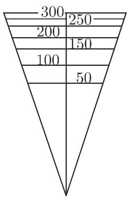

### 2.17 标度与坐标纸

#### 2.17.1 标度

标度的基是一个函数 $y = f(x)$ ，其目标是从这个函数构造出一个标度，满足在如直线等曲线上，能够把函数值 $y$ 像自变量 $x$ 一样描出来。标度可看作数表的一维表示形式。

函数 $y = f(x)$ 标度方程为

$$
y = l [ f (x) - f (x _ {0}) ],\tag{2.268}
$$

标度的起点固定在点 $x_0$ 。对一个具体的标度，为了仅有一个给定的标度长度，要考虑标度因子 $l$ 。

■ A 对数标度 当 $l = 10 \, cm, x_{0} = 1$ 时, 标度方程 $y = 10[\lg x - \lg 1] = 10 \lg x(\text{cm})$ , 由表值

<table><tr><td>x</td><td>1</td><td>2</td><td>3</td><td>4</td><td>5</td><td>6</td><td>7</td><td>8</td><td>9</td><td>10</td></tr><tr><td>y = lg x</td><td>0</td><td>0.30</td><td>0.48</td><td>0.60</td><td>0.70</td><td>0.78</td><td>0.85</td><td>0.90</td><td>0.95</td><td>1</td></tr></table>

可得到如图 2.95 所示标度.

<table><tr><td>1</td><td>2</td><td>3</td><td>4</td><td>5</td><td>6</td><td>7</td><td>8</td><td>9</td><td>10</td></tr><tr><td></td><td></td><td></td><td></td><td></td><td></td><td></td><td></td><td></td><td></td></tr></table>

图2.95  
■ B 滑尺 从历史看, 滑尺是对数标度中最重要的应用. 例如, 利用两个同样的能沿彼此相互移动的标准对数标度, 可以进行乘法和除法运算.  
由表2.96可看出： $y_{3} = y_{1} + y_{2}$ ，即 $\lg x_3 = \lg x_1 + \lg x_2 = \lg x_1x_2$ ，因此 $x_{3} = x_{1}\cdot x_{2};y_{1} = y_{3} - y_{2}$ ，即 $\lg x_1 = \lg x_3 - \lg x_2 = \lg \frac{x_3}{x_2}$ ，因此 $x_{1} = \frac{x_{3}}{x_{2}}.$

■ C 一圆锥形漏斗的侧面上的体积标度 为了能够读出漏斗内部的体积, 在漏斗上刻有标度. 漏斗的高 $H = 15 \mathrm{~cm}$ , 上面直径 $D = 10 \mathrm{~cm}$ .  
图 2.97(a) 给出的标度方程如下：体积 $V = \frac{1}{3} r^{2} \pi h$ ，边心距 $s = \sqrt{h^{2} + r^{2}}$ ， $\tan \alpha = \frac{r}{h} = \frac{D/2}{H} = \frac{1}{3}$ 。由此 $h = 3r, s = r\sqrt{10}, V = \frac{\pi}{(\sqrt{10})^{3}}$ ，故标度方程为 $s = \frac{\sqrt{10}}{\sqrt[3]{\pi}} \sqrt[3]{V} \approx 2.16 \sqrt[3]{V}$ 。下表包含了图示中漏斗的标准刻度：

<table><tr><td>V</td><td>0</td><td>50</td><td>100</td><td>150</td><td>200</td><td>250</td><td>300</td><td>350</td></tr><tr><td>s</td><td>0</td><td>7.96</td><td>10.03</td><td>11.48</td><td>12.63</td><td>13.61</td><td>14.46</td><td>15.22</td></tr></table>

  
图2.96

  
(a)

  
图2.97  
(b)

#### 2.17.2 坐标纸

最常用的坐标纸是通过把直角坐标系的坐标轴用标度方程

$$
x = l _ {1} [ g (u) - g (u _ {0}) ], \quad y = l _ {2} [ f (v) - f (v _ {0}) ]\tag{2.269}
$$

标准化后得到的. 其中 $l_{1}, l_{2}$ 为标度因子, $u_{0}, v_{0}$ 为标度的初始点.

2.17.2.1 半对数坐标纸

若对 $x$ 轴进行等距划分, 对 $y$ 轴进行对数划分, 就得到半对数坐标纸或半对数坐标系.

标度方程

$$
x = l _ {1} [ u - u _ {0} ] \quad (\text {线性标度}), \quad y = l _ {2} [ \lg v - \lg v _ {0} ] \quad (\text {对数标度}).\tag{2.270}
$$

图 2.98 是半对数坐标纸的一个例子.

  
图2.98

指数函数的表示 在半对数坐标纸上, 指数函数

$$
y = \alpha \mathrm{e} ^ {\beta x} (\alpha , \beta \text {为常数})\tag{2.271a}
$$

的图像为一直线 (参见第 143 页 2.16.2.2 中的修正). 可按如下方法利用该性质: 若半对数坐标纸上的测点大约位于一条直线上, 可假设这些变量的关系满足 (2.271a). 借助此直线, 可目测确定 $\alpha, \beta$ 的近似值. 事实上, 考虑直线上的两点 $P_{1}(x_{1}, y_{1})$ 和 $P_{2}(x_{2}, y_{2})$ , 可得

$$
\beta = \frac {\ln y _ {2} - \ln y _ {1}}{x _ {2} - x _ {1}}, \quad \alpha = y _ {1} \mathrm{e} ^ {\beta x _ {1}}.\tag{2.271b}
$$

2.17.2.2 双对数坐标纸

若直角坐标系的坐标轴 $x$ 轴和 $y$ 轴都是经过对数函数标准化后得到的，则称之为双对数坐标纸、重对数坐标纸或双对数坐标系.

标度方程

$$
x = l _ {1} [ \lg u - \lg u _ {0} ], y = l _ {2} [ \lg v - \lg v _ {0} ],\tag{2.272}
$$

其中 $l_{1}, l_{2}$ 为标度因子， $u_{0}, v_{0}$ 为初始点.

幂函数的表示 (参见第 91 页 2.5.3) 双对数坐标纸与半对数坐标纸方法类似, 只不过其 $x$ 轴也进行的是对数划分. 在此坐标系中, 幂函数

$$
y = \alpha x ^ {\beta} (\alpha , \beta \text {为常数})\tag{2.273}
$$

的图像为一直线 (参见第 142 页 2.16.2.1 中幂函数的修正). 这一性质的使用方法与半对数坐标纸中的类似.

2.17.2.3 倒数标度的坐标纸

坐标轴的标度划分来自反比函数 (2.45)(参见第 85 页 2.4.1).

标度方程

$$
x = l _ {1} (u - u _ {0}), \quad y = l _ {2} \left(\frac {a}{v} - \frac {a}{v _ {0}}\right) \quad (a \text {为常数}),\tag{2.274}
$$

其中 $l_{1}, l_{2}$ 为标度因子, $u_{0}, v_{0}$ 为初始点.

■ 化学反应中的浓度 在化学反应中, 浓度可以表示成关于时间 t 的函数 $c = c(t)$ , 对 c, 有如下结果:

<table><tr><td>t/min</td><td>5</td><td>10</td><td>20</td><td>40</td></tr><tr><td> $c \cdot 10^{3} /(\text{mol/L})$ </td><td>15.53</td><td>11.26</td><td>7.27</td><td>4.25</td></tr></table>

假设该反应为二级反应, 即满足

$$
c (t) = \frac {c _ {0}}{1 + c _ {0} k t} \quad (c _ {0}, k \text {为常数}),\tag{2.275}
$$

两边取倒数, 得 $\frac{1}{c} = \frac{1}{c_0} + kt$ . 故此, 若坐标纸选择对 $y$ 轴作倒数划分, $x$ 轴作线性划分, 则方程 (2.275) 表示一条直线. 如 $y$ 轴的标度方程 $y = 10 \cdot \frac{1}{v} \mathrm{~cm}$ .

由相应的图 2.99, 显然测点大约位于一条直线上, 即可认为假设的关系 (2.275) 成立.

  
图2.99

通过这些点, 能确定参数 $k$ (反应速率) 和 $c_{0}$ (初始浓度) 的近似值. 如若选取两点 $P_{1}(10,10)$ 和 $P_{2}(30,5)$ , 有

$$
k = \frac {1 / c _ {1} - 1 / c _ {2}}{t _ {2} - t _ {1}} \approx 0. 0 0 5, c _ {0} \approx 2 0 \cdot 1 0 ^ {- 3}.
$$

2.17.2.4 注

还有绘制和使用坐标纸的其他方法. 尽管当今每天仅凭实验室中得到的几个数据, 高速计算机便能分析出经验数据和测量结果, 但是坐标纸仍是用以说明函数关系和近似参数值最常用的方法, 而这些近似参数值正是采用数值方法所必须的初始值 (参见第 1282 页 19.6.2.4 中的非线性最小二乘法).
