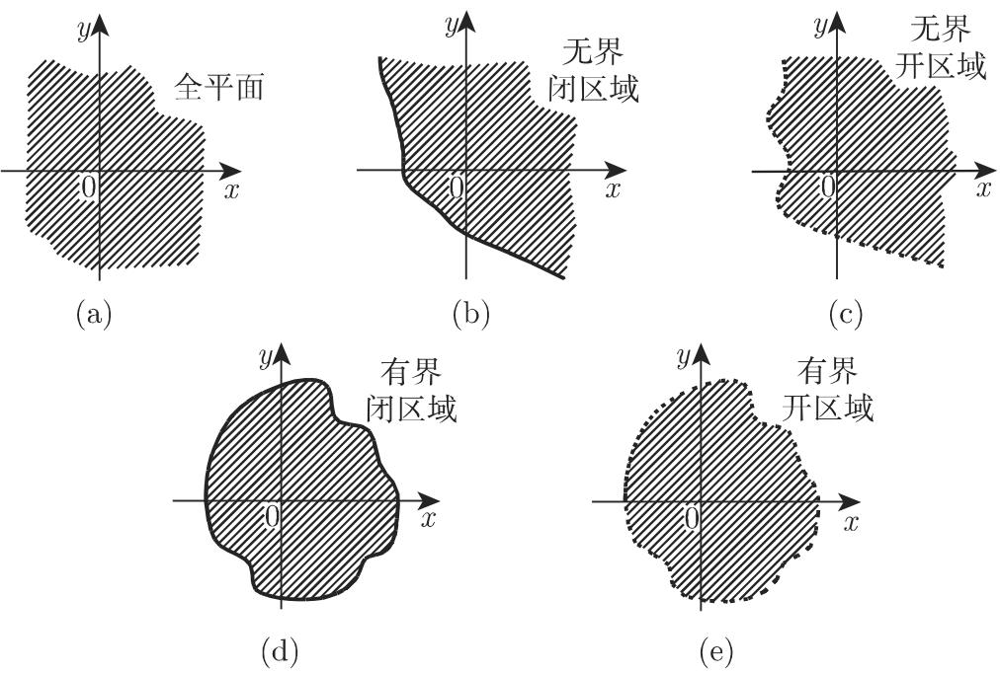
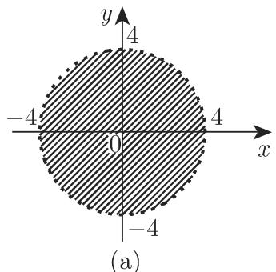
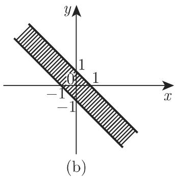
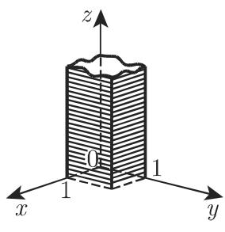

### 2.18 多元函数

#### 2.18.1 定义及其表示

2.18.1.1 多元函数的表示

设函数 u 含有 n 个独立的变元 $x_{1}, x_{2}, \cdots, x_{n}$ ，若对于任意一组给定的值，u 都有唯一确定的值与之对应，则称 u 为 n 元函数。根据变量的个数，如两个、三个或 n 个，可以写成

$$
u = f (x, y), \quad u = f (x, y, z), \quad u = f (x _ {1}, x _ {2}, \dots , x _ {n}).\tag{2.276}
$$

赋予这 $n$ 个独立变量值后, 得到一个变量数组, 它可看成 $n$ 维空间中的一个点. 单个的独立变量称为自变量; 有时整个 $n$ 元数组也称为函数的自变量.

函数值举例:

■ A: 当 x = 2, y = 3 时, 函数 $u = f(x, y) = xy^{2}$ 的值 $f(2, 3) = 2 \cdot 3^{2} = 18$ .

■ B: 当 $x = 3, y = 4, z = 3, t = 1$ 时, 函数 $u = f(x, y, z, t) = x \ln(y - zt)$ 的值 $f(3, 4, 3, 1) = 3 \ln(4 - 3 \cdot 1) = 0$ .

2.18.1.2 多元函数的几何表示

1. 变量数组的表示

两个自变量 $x, y$ 的数组在笛卡儿坐标系中表示平面上的一点；三个自变量 $x, y, z$ 的数组在三维笛卡儿坐标系中表示坐标为 $(x, y, z)$ 的一点。显然，在我们所理解的三维空间中，无法表示具有四个或更多个坐标的数组。

与三维空间中的情况类似, 含 n 个变量的数组 $x_{1}, x_{2}, \cdots, x_{n}$ 可以看成 n 维空间中的一点, 其笛卡儿坐标为 $(x_{1}, x_{2}, \cdots, x_{n})$ . 在 2.18.1.1 例 B 中, 4 个变量定义了四维空间中的一点, 坐标为 x = 3, y = 4, z = 3, t = 1.

2. 二元函数 $u = f(x, y)$ 的表示

a) 与一元函数的图示类似, 含两个独立变量的函数可用三维空间的一曲面来表示 (图 2.100, 也可参见第 350 页 3.6.3.1). 把定义域中自变量的值作为笛卡儿坐标系中点的前两个坐标, 函数值 $u = f(x, y)$ 作为第三个坐标, 这些点就构成了三维空间中的一个曲面.

  
图2.100

函数曲面举例:

■ A: $u = 1 - \frac{x}{2} - \frac{y}{3}$ 表示一平面 (图 2.101(a), 也可参见第 293 页 3.5.3.10).

■ B: $u=\frac{x^{2}}{2}+\frac{y^{2}}{4}$ 表示一椭圆抛物面 (图 2.101(b), 也可参见第 303 页 3.5.3.13,5.).

■ C: $u = \sqrt{16 - x^2 - y^2}$ 表示一半径 $r = 4$ 的半球面（图2.101(c)).

b) 利用平行于坐标面的平面与曲面 $u = f(x, y)$ 相截得到的交线，可以描绘出函数 $u = f(x, y)$ 表示的曲面形状。交线 $u$ 等于常数称为等高线。

■ 在图 2.101(b), (c) 中等高线分别为椭圆和同心圆 (没有在图示中标明).

注 在三维空间中无法表示三元或更多变元的函数. 与三维空间中的曲面类似, 在 $n$ 维空间中使用超曲面的概念.

  
图2.101

#### 2.18.2 平面中的不同区域

2.18.2.1 函数的定义域

函数的定义域是数组或点的集合, 依函数自变量的取值而定. 按这种方式定义的定义域可大不相同, 通常它们为点的有界或无界连通集. 根据边界是否属于定义域, 定义域分为闭集或开集. 开的连通点集称为区域. 若边界属于定义域, 则称之为闭区域, 若不属于定义域, 有时称为开区域.

2.18.2.2 二维区域

图 2.102 给出了含两个变量的连通点集的最简单情况．阴影部分表示的是区域；在图中闭区域即包含边界的区域，其边界用实线表示；开区域的边界用虚线表示．包含全平面在内，图 2.102 中仅有单连通区域．

  
图2.102

2.18.2.3 三维或多维区域

对三维或多维区域的处理方法与二维类似，也分为单连通区域和多连通区域。含三个以上变量的函数可在相应的 $n$ 维空间中进行几何表示。

2.18.2.4 确定函数的方法

1. 数表定义

多元函数可用数表来定义. 关于二元函数的一个例子见椭圆函数积分数表 (参见第 1424 页 21.9). 表的顶部和左侧给出了独立变量的值, 要求的函数值位于相应行和列的交叉位置, 称为复式表.

2. 公式定义

多元函数可用一个或多个公式来定义.

■ A: $u = xy^{2}$ .

■ B: u = x ln(y - zt).

$$
\mathbf {\Phi} \text {■} \mathbf {C} \colon u = \left\{ \begin{array}{l l} x + y, & x \geqslant 0, y \geqslant 0, \\ x - y, & x \geqslant 0, y <   0, \\ - x + y, & x <   0, y \geqslant 0, \\ - x - y, & x <   0, y <   0. \end{array} \right.
$$

3. 由公式给出的函数的定义域

在分析中, 大部分这样的函数可由公式来定义, 函数的定义域则为使解析表达式有意义, 即使得解析表达式取得唯一、有限实值的所有数组的并.

定义域举例:

■ A: $u = x^{2} + y^{2}$ : 定义域为全平面.

■ B: $u = \frac{1}{\sqrt{16 - x^{2} - y^{2}}}$ : 定义域为所有满足不等式 $x^{2} + y^{2} < 16$ 的数组 x, y. 从几何上来看, 该定义域为图 2.103(a) 中圆的内部, 为一个开区域.

■ C: $u = \arcsin(x + y)$ : 定义域为所有满足不等式 $-1 \leqslant x + y \leqslant 1$ 的数组 x, y, 即函数的定义域为图 2.103(b) 中包含在两平行线之间的长条形闭区域.

  
图2.103

■ D: $u = \arcsin(2x - 1) + \sqrt{1 - y^{2}} + \sqrt{y} + \ln z$ : 定义域为所有满足不等式 $0 \leqslant x \leqslant 1, 0 \leqslant y \leqslant 1, z > 0$ 的数组 x, y, z，即函数的定义域由位于图 2.103(c) 中边长为 1 的正方形上方的所有三维点 x, y, z 构成.

若一点或一有界单连通点集从平面某部分的内部消失, 如图 2.104 所示, 则称之为双连通区域; 图 2.105 表示多连通区域; 图 2.106 为非连通区域.

  
图2.106

2.18.2.5 函数解析表示的各种形式

正如一元函数, 多元函数可以按不同的方式来定义.

1. 显形式

若函数值（因变量）由独立的变量来表示，即

$$
u = f (x _ {1}, x _ {2}, \dots , x _ {n}),\tag{2.277}
$$

则称函数由显形式给出或定义.

2. 隐形式

若函数值与自变量的关系按如下方式给出：

$$
F (x _ {1}, x _ {2}, \dots , x _ {n}, u) = 0,\tag{2.278}
$$

且有唯一的 $u$ 满足此等式, 则称函数由隐形式给出或定义.

3. 参数形式

若函数和它的 $n$ 个自变量由 $n$ 个新的变量 (参数) 以显形式来定义, 且参数和自变量之间一一对应, 则称函数由参数形式给出. 例如对二元函数,

$$
x = \varphi (r, s), \quad y = \psi (r, s), \quad u = \chi (r, s);\tag{2.279a}
$$

对三元函数，

$$
x = \varphi (r, s, t), \quad y = \psi (r, s, t), \quad z = \chi (r, s, t), \quad u = \kappa (r, s, t);\tag{2.279b}
$$

等等.

4. 齐次函数

多元函数 $f(x_{1},x_{2},\cdots,x_{n})$ 称为齐次函数, 若对任意 $\lambda$ , 有

$$
f (\lambda x _ {1}, \lambda x _ {2}, \dots , \lambda x _ {n}) = \lambda^ {m} f (x _ {1}, x _ {2}, \dots , x _ {n}),\tag{2.280}
$$

m 称为齐性次数.

■ A: 若 $u(x,y) = x^{2} - 3xy + y^{2} + x\sqrt{xy + \frac{x^{3}}{y}}$ ，齐性次数 $m = 2$ .

■ B: 若 $u(x,y)=\frac{x+z}{2x-3y}$ ，齐性次数 m=0.

2.18.2.6 函数的相关性

1. 两个函数的特殊情况

定义域 $G$ 相同的两个二元函数 $u = f(x, y)$ 和 $v = \varphi(x, y)$ 称为相依函数, 若其中的一个函数可作为另一个的函数的函数 $u = F(v)$ 表示出来, 即对函数定义域 $G$ 中的每个点, 有等式

$$
f (x, y) = F (\varphi (x, y)) \quad {\text {或}} \quad \Phi (f, \varphi) = 0\tag{2.281}
$$

成立. 若不存在这样的函数 $F(\varphi)$ 或 $\Phi(f, \varphi)$ , 则称它们为独立函数.

■ $u(x,y) = (x^{2} + y^{2})^{2}$ , $v = \sqrt{x^2 + y^2}$ 的定义域为 $x^{2} + y^{2} \geqslant 0$ , 即全平面, 因为 $u = v^{4}$ , 所以二者为相依函数.

2. 多个函数的一般情况

与两个函数的情况类似, 具有相同定义域 G 的 m 个 n 元 $x_{1}, x_{2}, \cdots, x_{n}$ 函数 $u_{1}, u_{2}, \cdots, u_{m}$ 称为相依函数, 若其中一个函数可作为其他函数的函数表示出来, 即对函数定义域 G 中的每个点, 有等式

$$
u _ {i} = f (u _ {1}, u _ {2}, \dots , u _ {i - 1}, u _ {i + 1}, \dots , u _ {m}) \quad \text {或} \quad \Phi (u _ {1}, u _ {2}, \dots , u _ {m}) = 0\tag{2.282}
$$

成立. 若不存在这样的函数关系, 则称它们为独立函数.

■ 函数

$$
\begin{array}{l} {u = x _ {1} + x _ {2} + \dots + x _ {n}, v = x _ {1} ^ {2} + x _ {2} ^ {2} + \dots + x _ {n} ^ {2},} \\ {w = x _ {1} x _ {2} + x _ {1} x _ {3} + \dots + x _ {1} x _ {n} + x _ {2} x _ {3} + \dots + x _ {n - 1} x _ {n}} \end{array}
$$

为相依函数, 这是因为 $v = u^2 - 2w$ 成立.

3. 独立的解析条件

假设下面的每个偏导数都存在. 若两个函数 $u = f(x, y)$ , $v = \varphi(x, y)$ 的函数行列式或雅可比行列式不恒等于零, 则它们独立. n 个 n 元函数 $u_{1} = f_{1}(x_{1}, \cdots, x_{n})$ , $\cdots$ , $u_{n} = f_{n}(x_{1}, \cdots, x_{n})$ 的独立性与之类似.

若函数 $u_{1}, u_{2}, \cdots, u_{m}$ 的个数 m 少于变量 $x_{1}, x_{2}, \cdots, x_{n}$ 的个数，且矩阵 (2.283c) 中至少有一个 m 阶子式不为零，则函数 $u_{1}, u_{2}, \cdots, u_{m}$ 独立。独立函数的个数等于矩阵 (2.283c) 的秩 r （参见第 367 页 4.1.4,7），这些独立函数的导数构成 r 阶非零行列式的元素。若 m > n，则给定的 m 个函数中最多有 n 个独立。

(2.283a)

$$
\begin{array}{r l} & {{\left| \begin{array}{l l} {{\frac {\partial f}{\partial x}}} & {{\frac {\partial f}{\partial y}}} \\ {{\frac {\partial \varphi}{\partial x}}} & {{\frac {\partial \varphi}{\partial y}}} \end{array} \right|, \quad \text {简记为} \quad \frac {D (f , \varphi)}{D (x , y)} \text {或} \frac {D (u , v)}{D (x , y)},}} \\ {{\frac {\partial f _ {1}}{\partial x _ {1}}}} & {{\frac {\partial f _ {1}}{\partial x _ {2}} \quad \dots \quad \frac {\partial f _ {1}}{\partial x _ {n}}}} \\ {{\frac {\partial f _ {2}}{\partial x _ {1}}}} & {{\frac {\partial f _ {2}}{\partial x _ {2}} \quad \dots \quad \frac {\partial f _ {2}}{\partial x _ {n}}}} \\ {{\vdots}} & {{\vdots \qquad \qquad \vdots}} \\ {{\frac {\partial f _ {n}}{\partial x _ {1}}}} & {{\frac {\partial f _ {n}}{\partial x _ {2}} \quad \dots \quad \frac {\partial f _ {n}}{\partial x _ {n}}}} \end{array} \right| \equiv \frac {D (f _ {1} , f _ {2} , \cdots , f _ {n})}{D (x _ {1} , x _ {2} , \cdots , x _ {n})} \neq 0. \\ & {{\left( \begin{array}{l l l l} {{\frac {\partial u _ {1}}{\partial x _ {1}}}} & {{\frac {\partial u _ {1}}{\partial x _ {2}}}} & {{\dots}} & {{\frac {\partial u _ {1}}{\partial x _ {n}}}} \\ {{\frac {\partial u _ {2}}{\partial x _ {1}}}} & {{\frac {\partial u _ {2}}{\partial x _ {2}}}} & {{\dots}} & {{\frac {\partial u _ {2}}{\partial x _ {n}}}} \\ {{\vdots}} & {{\vdots \qquad \qquad \vdots}} \\ {{\frac {\partial u _ {m}}{\partial x _ {1}}}} & {{\frac {\partial u _ {m}}{\partial x _ {2}}}} & {{\dots}} & {{\frac {\partial u _ {m}}{\partial x _ {n}}}} \end{array} \right).}} \end{array}\tag{2.283b}
$$

(2.283c)

#### 2.18.3 极限

2.18.3.1 定义

若当 $x, y$ 分别以任意方式趋近于 $a, b$ 时，二元函数 $u = f(x, y)$ 的值任意趋近于值 $A$ ，则称函数 $u = f(x, y)$ 在 $x = a, y = b$ 处的极限为 $A$ ，记为

$$
\lim_{\substack{x\to a\\ y\to b}}f(x,y) = A.\tag{2.284}
$$

函数可能在点 $(a,b)$ 没定义，或有定义但 $f(a,b)\neq A$

2.18.3.2 精确定义

若对任意给定的正数 $\varepsilon$ ，总存在正数 $\eta$ ，使得对于正方形

$$
| x - a | <   \eta , \quad | y - b | <   \eta\tag{2.285a}
$$

内的每个点 $(x,y)$ (参见图2.107)，都有

$$
| f (x, y) - A | <   \varepsilon ,\tag{2.285b}
$$

则称二元函数 $u = f(x,y)$ 在点 $(a,b)$ 处有极限

$$
A = \lim_{\substack{x\to a\\ y\to b}}f(x,y).\tag{2.285c}
$$

  
图2.107

2.18.3.3 向多元函数的推广

a) 与二元函数类似, 可以定义多元函数极限的概念.

b) 把一元函数极限的判别方法进行推广, 可得多元函数极限的判别方法, 即化简成一个序列的极限或者利用柯西收敛条件 (参见第 69 页 2.1.4.3).

2.18.3.4 累次极限

若首先确定出二元函数 $f(x,y)$ 在 $x\to a,y$ 为常数时的极限, 再把它看成 $y$ 的函数, 求 $y\to b$ 时的极限, 则最终结果

$$
B = \lim _ {y \to b} \left(\lim _ {x \to a} f (x, y)\right)\tag{2.286a}
$$

称为累次极限. 改变计算顺序通常会得到另一个极限

$$
C = \lim _ {x \to a} \left(\lim _ {y \to b} f (x, y)\right).\tag{2.286b}
$$

一般地, 即使两个极限都存在, 也有 $B \neq C$ .

■ 当 $x \to 0, y \to 0$ 时, 函数 $f(x, y) = \frac{x^2 - y^2 + x^3 + y^3}{x^2 + y^2}$ 的累次极限 $B = -1, C = +1$ .

注 若函数 $f(x, y)$ 的极限 $A = \lim_{\substack{x \to a \\ y \to b}} f(x, y)$ ，且 $B, C$ 均存在，则 $B = C = A$ 。由极限 $A$ 的存在性不能得到极限 $B, C$ 的存在性，同样由极限 $B = C$ 也不能得到极限 $A$ 的存在性。

#### 2.18.4 连续性

二元函数 $f(x,y)$ 在 $x = a, y = b$ , 即在点 $(a,b)$ 处连续, 若

(1) $(a, b)$ 属于函数的定义域;

(2) 当 $x \to a, y \to b$ 时, 极限存在且等于 $(a, b)$ 处的函数值, 即

$$
\lim_{\substack{x\to a\\ y\to b}}f(x,y) = f(a,b),\tag{2.287}
$$

否则函数在点 $(a, b)$ 不连续. 若函数在一个连通区域上的每个点都有定义且连续, 则称它在整个区域上连续. 类似地, 可以定义二元以上函数的连续性.

#### 2.18.5 连续函数的性质

2.18.5.1 波尔查诺零点定理

若函数 $f(x,y)$ 在一连通区域有定义且连续，且对于定义域中的两点 $(x_{1},y_{1})$ ， $(x_{2},y_{2})$ 函数取值异号，则在该定义域中至少存在一点 $(x_{3},y_{3})$ ，使得 $f(x,y)$ 在该点处等于0，即

若 $f(x_{1},y_{1}) > 0,f(x_{2},y_{2}) <   0,$ 则 $f(x_{3},y_{3}) = 0.$

(2.288)

2.18.5.2 介值定理

若函数 $f(x,y)$ 在一连通区域有定义且连续，对于定义域中的两点 $(x_{1},y_{1})$ ， $(x_{2},y_{2})$ 函数取值分别为 $A = f(x_{1},y_{1})$ 和 $B = f(x_{2},y_{2})$ ，且 $A \neq B$ ，则对介于 $A$ 与 $B$ 之间的任意值 $C$ ，都至少存在一点 $(x_{3},y_{3})$ ，满足

$$
f (x _ {3}, y _ {3}) = C, \quad A <   C <   B \quad {\text {或}} \quad B <   C <   A.\tag{2.289}
$$

2.18.5.3 函数的有界性定理

若函数 $f(x,y)$ 在一有界闭区域上连续，则它在该区域有界，即存在两个数 $m$ 和 $M$ ，使得对于该区域内的任意点 $(x,y)$ ，都有

$$
m \leqslant f (x, y) \leqslant M.\tag{2.290}
$$

2.18.5.4 魏尔斯特拉斯定理 (最大最小值存在定理)

若函数 $f(x, y)$ 在一有界闭区域上连续，则它在该区域上有最大值和最小值，即存在一点 $(x', y')$ ，满足定义域上的所有值 $f(x, y)$ 均小于等于 $f(x', y')$ ，又存在一点 $(x'', y'')$ ，满足定义域上的所有值 $f(x, y)$ 均大于等于 $f(x'', y'')$ ，即对定义域中的任意点 $(x, y)$ ，都有

$$
f (x ^ {\prime}, y ^ {\prime}) \geqslant f (x, y) \geqslant f (x ^ {\prime \prime}, y ^ {\prime \prime}).\tag{2.291}
$$
