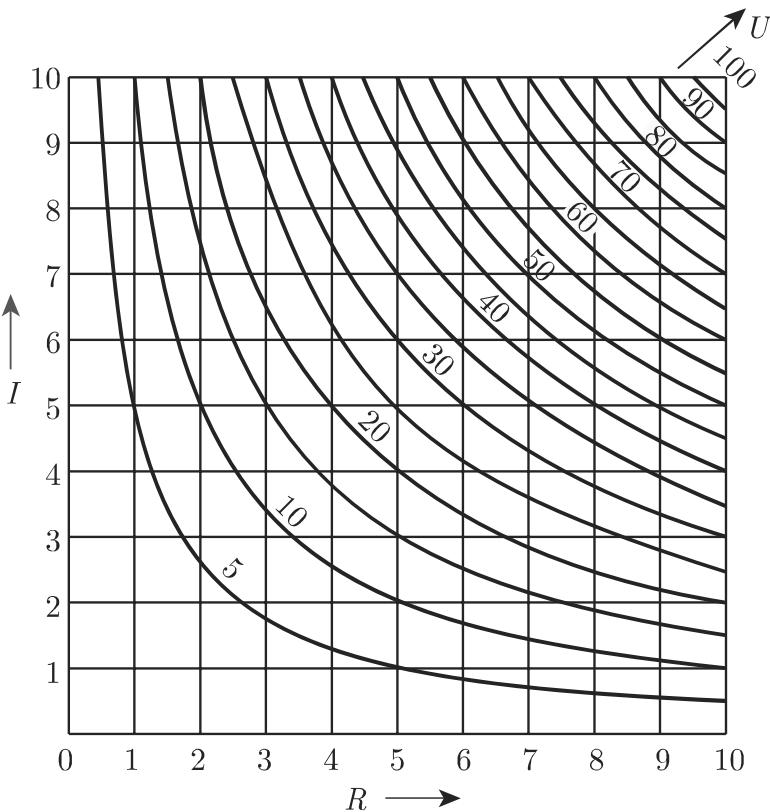
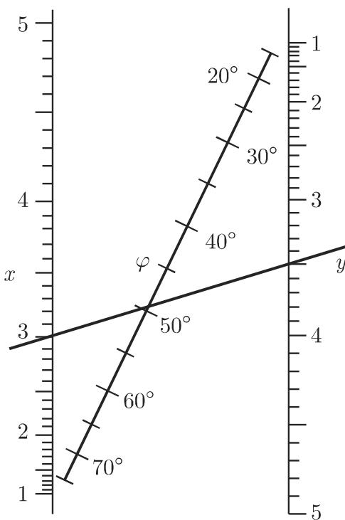
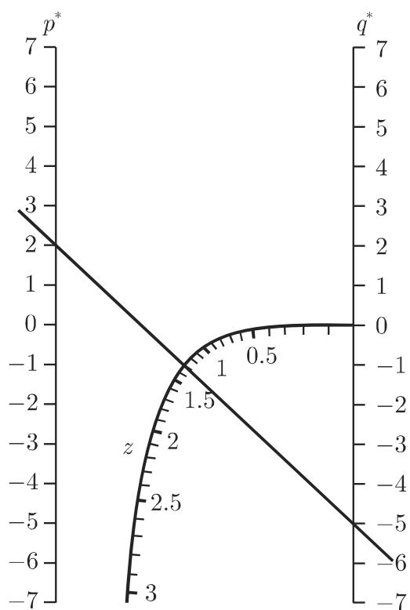

### 2.19 算图法

#### 2.19.1 算图

算图是描述三个或更多个变量间的函数对应关系的图示．由算图，可以直接看出已知公式（关键公式）在定义域中各变量所对应的值．最常见的算图是网络算图和贯线算图.

即使在计算机时代, 实验室还常常使用网络算图, 如用它们计算近似值或进行迭代时的初始推断.

#### 2.19.2 网络算图

为了表示由方程

$$
F (x, y, z) = 0\tag{2.292}
$$

给出的各变量间的对应关系 (在很多情况下, 可直接表示成 $z = f(x, y)$ ), 可以把变量看成空间中的坐标. 方程 (2.292) 定义了一个曲面, 我们可以利用等高线在二维平面上将其直观化 (参见第 154 页 2.18.1.2). 每个变量都被赋予一族曲线, 这些曲线构成一个网: 平行于坐标轴的直线表示变量 $x$ 和 $y$ , 等高线族表示变量 $z$ .

■ 欧姆定律 $U = R \cdot I$ 。电压 $U$ 可用依赖于两个变量的等高线表示, 若把 $R$ 和 $I$ 选为笛卡儿坐标, 则对任意常数, 方程 $U =$ 常数对应一条双曲线 (图2.108). 通过图像, 能够看出每对 $I, R$ 所对应的 $U$ 的值, 每对 $R, U$ 所对应的 $I$ 的值, 以及每对 $I, U$ 所对应的 $R$ 的值. 当然, 上述研究范围仅限制在定义域, 即图2.108中的 $0 < R < 10$ , $0 < I < 10$ 及 $0 < U < 100$ 范围内.

注 (1) 通过改变标度, 算图法也能用于其他区域, 例如, 若图 2.108 中的定义域变为 $0 < I < 1$ , $R$ 保持不变, 则 $U$ 的双曲线变为 $\frac{U}{10}$ .

  
图2.108

(2) 利用标度 (参见第 149 页 2.17.1) 有可能把复杂曲线的算图转换成直线算图. 如利用 $x, y$ 的等分标度, 每个形如

$$
r \varphi (z) + y \psi (z) + \chi (z) = 0\tag{2.293}
$$

的方程都能表示成由直线组成的算图．若利用函数标度 $x = f(z_{2}), y = g(z_{2})$ ，对于变量 $z_{1}, z_{2}, z_{3}$ ，形如

$$
f (z _ {2}) \varphi (z _ {1}) + g (z _ {2}) \psi (z _ {1}) + \chi (z _ {1}) = 0\tag{2.294}
$$

的方程能够表示为平行于坐标轴的两族曲线和任意一族直线.

■ 利用对数标度 (参见第 150 页 2.17.1) 可把欧姆定律表示成一直线算图. 对 $R \cdot I = U$ 取对数, 有 $\log R + \log I = \log U$ . 令 $x = \log R, y = \log I$ , 有 $x + y = \log U$ , 即得到 (2.294) 的特殊形式. 图 2.109 给出了相应的算图.

  
图2.109

#### 2.19.3 贯线算图

变量 $z_{1}, z_{2}, z_{3}$ 间的关系图可以通过赋予每个变量一个标度来实现 (参见第 149 页 2.17.1). $z_{i}$ 的标度方程为

$$
x _ {i} = \varphi_ {i} (z _ {i}), \quad y _ {i} = \psi_ {i} (z _ {i}) \quad (i = 1, 2, 3),\tag{2.295}
$$

函数 $\varphi_{i},\psi_{i}$ 应使得满足算图方程的三个变量 $z_{1},z_{2},z_{3}$ 位于同一直线上．为此，点 $(x_{1},y_{1}),(x_{2},y_{2}),(x_{3},y_{3})$ 构成的三角形面积必须为0(参见第261页(3.301))，即必有

$$
\left| \begin{array}{c c c} x _ {1} & y _ {1} & 1 \\ x _ {2} & y _ {2} & 1 \\ x _ {3} & y _ {3} & 1 \end{array} \right| = \left| \begin{array}{c c c} \varphi_ {1} (z _ {1}) & \psi_ {1} (z _ {1}) & 1 \\ \varphi_ {2} (z _ {2}) & \psi_ {2} (z _ {2}) & 1 \\ \varphi_ {3} (z _ {3}) & \psi_ {3} (z _ {3}) & 1 \end{array} \right| = 0.\tag{2.296}
$$

能够转化成形式 (2.296) 的三个变量 $z_{1}, z_{2}, z_{3}$ 间任意两个的关系都可用贯线算图表示.

接下来给出 (2.296) 的一些重要特例.

2.19.3.1 过一点具有三个直线标度的贯线算图

若零点是具有三个标度 $z_{1}, z_{2}, z_{3}$ 的直线的公共点，因为过原点的直线方程为 $y = mx$ ，则 (2.296) 的形式为

$$
\left| \begin{array}{c c c} \varphi_ {1} (z _ {1}) & m _ {1} \varphi_ {1} (z _ {1}) & 1 \\ \varphi_ {2} (z _ {2}) & m _ {2} \varphi_ {2} (z _ {2}) & 1 \\ \varphi_ {3} (z _ {3}) & m _ {3} \varphi_ {3} (z _ {3}) & 1 \end{array} \right| = 0.\tag{2.297}
$$

计算行列式 (2.297), 有

$$
\frac {m _ {2} - m _ {3}}{\varphi_ {1} (z _ {1})} + \frac {m _ {3} - m _ {1}}{\varphi_ {2} (z _ {2})} + \frac {m _ {1} - m _ {2}}{\varphi_ {3} (z _ {3})} = 0\tag{2.298a}
$$

或

$$
\frac {C _ {1}}{\varphi_ {1} (z _ {1})} + \frac {C _ {2}}{\varphi_ {2} (z _ {2})} + \frac {C _ {3}}{\varphi_ {3} (z _ {3})} = 0, \quad C _ {1} + C _ {2} + C _ {3} = 0,\tag{2.298b}
$$

其中 $C_1, C_2, C_3$ 为常数.

■ 方程 $\frac{1}{a} + \frac{1}{b} = \frac{2}{f}$ 是 (2.298b) 的一种特殊情况, 它在光学、电阻的并联等中是一种重要关系. 相应的贯线算图由 3 条标度相同的直线构成.

2.19.3.2 具有两平行倾斜直线标度和一条倾斜直线标度的贯线算图

其中第一个标度在 $y$ 轴上, 第二个在与它距离为 $d$ 的平行线上, 第三个标度在直线 $y = mx$ 上, 此时 (2.296) 具有形式

$$
\left| \begin{array}{c c c} 0 & \psi_ {1} (z _ {1}) & 1 \\ d & \psi_ {2} (z _ {2}) & 1 \\ \varphi_ {3} (z _ {3}) & m \varphi_ {3} (z _ {3}) & 1 \end{array} \right| = 0.\tag{2.299}
$$

按第一列展开计算行列式, 得到

$$
d (m \varphi_ {3} (z _ {3}) - \psi_ {1} (z _ {1})) + \varphi_ {3} (z _ {3}) (\psi_ {1} (z _ {1}) - \psi_ {2} (z _ {2})) = 0.\tag{2.300a}
$$

因此

$$
\psi_ {1} (z _ {1}) \frac {\varphi_ {3} (z _ {3}) - d}{\varphi_ {3} (z _ {3})} - (\psi_ {2} (z _ {2}) - m d) = 0 \text {或} f (z _ {1}) \cdot g (z _ {3}) - h (z _ {2}) = 0.\tag{2.300b}
$$

有时为了使用方便, 引入形如

$$
E _ {1} f (z _ {1}) \frac {E _ {2}}{E _ {1}} g (z _ {3}) - E _ {2} h (z _ {2}) = 0\tag{2.300c}
$$

的分度标度 $E_{1}, E_{2}$ ，则 $\varphi_{3}(z_{3}) = \frac{d}{1 - \frac{E_{2}}{E_{1}} g(z_{3})}$ 。可以选择 $E_{2}: E_{1}$ 使之满足第三个标度接近或集中在某一点。令 m = 0，则 $E_{2}h(z_{2}) = \psi_{2}(z_{2})$ ，且此时第三个标度线穿过第一个和第二个标度的起点. 因此这两个标度必须被方向相反的标度划分取代, 而第三个标度位于二者之间.

■ xOy 面上一点的笛卡儿坐标 x, y 与极坐标中相应角度 $\varphi$ 之间的关系为

$$
y ^ {2} = x ^ {2} \tan^ {2} \varphi ,\tag{2.301}
$$

对应的算图如图 2.110 所示. x, y 的标度划分相同, 但方向相反. 为了与二者之间的第三个标度有更好的交点, 其初始点要经过适当的平移. 第三个标度与第一个或第二个标度的交点分别为记为 $\varphi = 0^{\circ}$ 或 $\varphi = 90^{\circ}$ .

  
图2.110

■例如, 当 $x = 3, y = 3.5$ 时, 有 $\varphi \approx 49.5^{\circ}$ .

2.19.3.3 具有两平行直线和一条曲线标度的贯线算图

其中一个直线标度在 $y$ 轴, 另一个直线标度与它的距离为 $d$ , 则方程 (2.296) 具有形式

$$
\left| \begin{array}{c c c} 0 & \psi_ {1} (z _ {1}) & 1 \\ d & \psi_ {2} (z _ {2}) & 1 \\ \varphi_ {3} (z _ {3}) & \psi_ {3} (z _ {3}) & 1 \end{array} \right| = 0.\tag{2.302}
$$

因此

$$
\psi_ {1} (z _ {1}) + \psi_ {2} (z _ {2}) \frac {\varphi_ {3} (z _ {3})}{d - \varphi_ {3} (z _ {3})} - d \frac {\psi_ {3} (z _ {3})}{d - \varphi_ {3} (z _ {3})} = 0.\tag{2.303a}
$$

设第一个标度为 $E_{1}$ ，第二个为 $E_{2}$ ，则(2.303a）变为

$$
E _ {1} f (z _ {1}) + E _ {2} g (z _ {2}) \frac {E _ {1}}{E _ {2}} h (z _ {3}) + E _ {1} k (z _ {3}) = 0,\tag{2.303b}
$$

其中 $\psi_1(z_1) = E_1f(z_1),\psi_2(z_2) = E_2g(z_2)$ ，且

$$
\varphi_ {3} (z _ {3}) = \frac {d E _ {1} h (z _ {3})}{E _ {2} + E _ {1} h (z _ {3})}, \quad \psi_ {3} (z _ {3}) = - \frac {E _ {1} E _ {2} k (z _ {3})}{E _ {2} + E _ {1} h (z _ {3})}.\tag{2.303c}
$$

■ 简化的三次方程 $z^3 + p^* z + q^* = 0$ (参见52页1.6.2.3) 的形式为(2.303b). 经代换 $E_1 = E_2 = 1, f(z_1) = q^*$ , $g(z_2) = p^*$ , $h(z_3) = z$ 后, 用来计算曲线标度坐标的公式为 $x = \varphi_3(z) = \frac{d \cdot z}{1 + z}$ 和 $y = \psi_3(z) = -\frac{z^3}{1 + z}$ .

图 2.111 仅为 z 取正数时的曲线的标度, 若用 -z 代替 z, 确定方程 $z^{3} + p^{*}z + q^{*} = 0$ 的正根后, 可得到 z 的负值. 复根 $u + iv$ 也可由算图确定出来. 实根总存在, 记为 $z_{1}$ , 则复根的实部 $u = -\frac{z_{1}}{2}$ , 虚部 v 可由方程 $3u^{3} - v^{2} + p^{*} = \frac{3}{4}z_{1}^{2} - v^{2} + p^{*} = 0$ 得到.

  
图2.111

■例如， $y^{3} + 2y - 5 = 0$ ，即 $p^* = 2,q^* = -5,$ 有 $z_{1}\approx 1.3.$

#### 2.19.4 三个以上变量的网络算图

为了构造含三个以上变量公式的算图, 可以借助辅助变量, 将表达式分解成几个公式, 使得每个公式仅含三个变量. 其中, 每个辅助变量必须恰好包含在两个新的方程中. 所有的方程都用一个贯线算图来表示, 且共同的辅助变量具有相同的标度.

(胡俊美 译)
