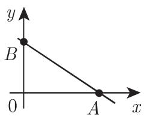
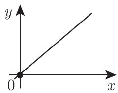
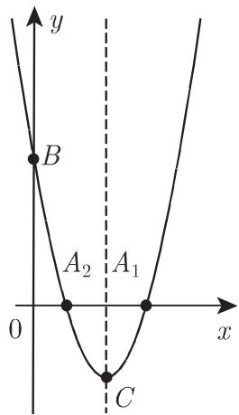
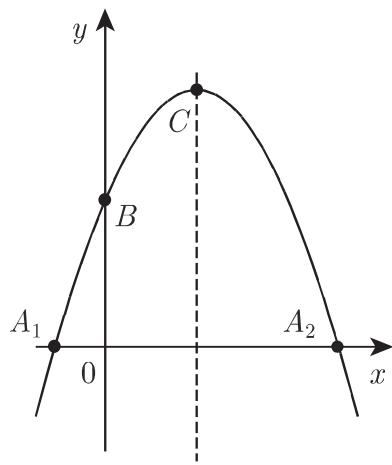
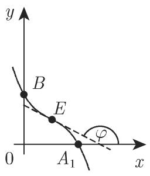
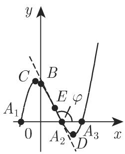
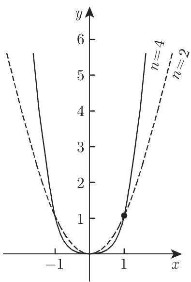

### 2.3 多项式

#### 2.3.1 线性函数

线性函数

$$
y = a x + b\tag{2.39}
$$

的图像是一条直线(图 2.11(a)), 比例因子为 a, 直线与坐标轴的交点为 b.

当 $a > 0$ 时, 函数单调递增, 当 $a < 0$ 时, 函数单调递减; 当 $a = 0$ 时, 函数为零次多项式, 即为常函数. (2.39) 的截距点坐标为 $A\left(-\frac{b}{a}, 0\right)$ 和 $B(0, b)$ (具体分析参见第262页3.5.2.6,1). 当 $b = 0$ 时, 函数为正比例函数

$$
y = a x,\tag{2.40}
$$

  
(a)

  
(b)  
图2.11

图像为一条过原点的直线 (图 2.11(b)).

#### 2.3.2 二次多项式

二次多项式

$$
y = a x ^ {2} + b x + c\tag{2.41}
$$

定义一以 $x = -\frac{b}{2a}$ 为垂直对称轴的抛物线(图2.12). 当 $a > 0$ 时, 函数先单调递减取得最小值, 再单调递增; 当 $a < 0$ 时, 函数先单调递增取得最大值, 再单调递减. 当 $b^{2} - 4ac > 0$ 时, 函数与 $x$ 轴的交点 $A_{1}, A_{2}$ 为 $\left(\frac{-b \pm \sqrt{b^2 - 4ac}}{2a}, 0\right)$ , 与 $y$ 轴的交点 $B$ 为 $(0, c)$ ; 当 $b^{2} - 4ac = 0$ 时, 函数与 $x$ 轴有一个交点 (切点); 当 $b^{2} - 4ac < 0$ 时, 函数与 $x$ 轴没有交点. 曲线的极值点为 $C\left(-\frac{b}{2a}, \frac{4ac - b^2}{4a}\right)$ (关于抛物线的详细说明参见第275页3.5.2.10).

  
(a)

  
(b)  
图2.12

#### 2.3.3 三次多项式

三次多项式

$$
y = a x ^ {3} + b x ^ {2} + c x + d\tag{2.42}
$$

定义一三次抛物线(图 2.13(a),(b),(c)), 曲线的形状和函数的性质均依赖于 $a$ 和判别式 $\Delta = 3ac - b^2$ . 若 $\Delta \geqslant 0$ (图 2.13(a), (b)), 则当 $a > 0$ 时, 函数单调递增, 当 $a < 0$ 时, 函数单调递减. 若 $\Delta < 0$ , 函数恰好有一个局部极小值和一个局部极大值 (图 2.13(c)), 此时当 $a > 0$ 时, 函数由 $-\infty$ 增大到极大值, 然后减到极小值, 接着增大到 $+\infty$ ; 当 $a < 0$ 时, 函数值先由 $+\infty$ 减小到极小值, 然后增大到极大值, 接着减小到 $-\infty$ . 图像与 $x$ 轴的交点为当 $y = 0$ 时 (2.42) 的实根, 且函数可能有一个、两个 (此时存在一点, 在该点处 $x$ 轴是曲线的切线) 或三个实根

$A_{1}, A_{2}, A_{3}$ . 图像与 $y$ 轴的交点为 $B(0, d)$ , 曲线若有极值点 $C, D$ , 则其坐标为 $\left(-\frac{b \pm \sqrt{-\Delta}}{3a}, \frac{d + 2b^{3} - 9abc \pm (6ac - 2b^{2})\sqrt{-\Delta}}{27a^{2}}\right)$ .

  
(a)

  
(b)

  
图2.13  
(c)

拐点也为曲线的对称中心 $E\left(-\frac{b}{3a}, \frac{2b^3 - 9abc}{27a^2} + d\right)$ , 此处切线的斜率 $\tan \varphi = \left(\frac{\mathrm{d}y}{\mathrm{d}x}\right)_E = \frac{\Delta}{3a}$ .

#### 2.3.4 n次多项式

$n$ 次整有理函数

$$
y = a _ {n} x ^ {n} + a _ {n - 1} x ^ {n - 1} + \dots + a _ {1} x + a _ {0}\tag{2.43}
$$

定义一抛物型 n 次或 n 阶曲线(参见第 261 页 3.5.2.5)(图 2.14).

  
图2.14

情形 1, n 为奇数 当 $a_{n} > 0$ 时, y 的值从 $-\infty$ 到 $+\infty$ 连续变化, 当 $a_{n} < 0$ 时, y 的值从 $+\infty$ 到 $-\infty$ 连续变化. 曲线可以与 x 轴相交或相切至 n 次, 且至少有一个交点 (n 次方程的解参见第 56 页 1.6.3.1 和第 1237 页 19.1.2). 函数 (2.43) 的极值可能为 0 个或者不超过 n - 1 的偶数个, 并且极大值和极小值交错出现; 拐点的个数为介于 1 和 n - 2 之间的奇数个; 不存在渐近线或奇点.

情形 2, n 为偶数 当 $a_{n} > 0$ 时, y 的值从 $+\infty$ 达到极小值再变到 $+\infty$ , 当 $a_{n} < 0$ 时, y 的值从 $-\infty$ 达到极大值再变到 $-\infty$ . 曲线可以与 x 轴相交或相切至 n 次, 但也可能一直不相交或相切. 极值的个数为奇数且极大值和极小值交错出现; 拐点的个数为偶数或 0; 不存在渐近线或奇点.

在画函数图像之前, 首先应确定极值点、拐点以及这些点的一阶导数, 再画出这些点的切线, 最后连续地连接这些点.

#### 2.3.5 n次抛物线

函数

$$
y = a x ^ {n} \quad (n \text {为大于零的整数})\tag{2.44}
$$

称为 n 次或 n 阶抛物线(图 2.15).

  
(a)

  
(b)  
图2.15

(1) 特殊情况 $a = 1$ 曲线 $y = x^n$ 过点 $(0,0)$ 和 $(1,1)$ , 与 $x$ 轴的切点或交点为原点. 当 $n$ 为偶数时, 曲线关于 $y$ 轴对称, 且在原点取得极小值; 当 $n$ 为奇数时, 曲线关于原点对称, 且原点为一拐点. 曲线无渐近线.

(2) 一般情况 $a \neq 0$ 通过把曲线 $y = x^n$ 的坐标拉伸 $|a|$ 倍, 可得到曲线 $y = ax^n$ . 当 $a < 0$ 时, 曲线 $y = |a|x^n$ 可由原图像沿 $x$ 轴反射得到.
