### 2.4 有理函数

#### 2.4.1 特殊的分式线性函数(反比)

函数

$$
y = \frac {a}{x}\tag{2.45}
$$

的图像为一等轴双曲线, 渐近线为坐标轴 (图 2.16), 间断点为 $x = 0$ , 此时 $y = \pm \infty$ . 若 $a > 0$ , 函数在区间 $(- \infty, 0)$ 上严格单调递减, 函数值从 0 到 $-\infty$ 变化; 函数在区间 $(0, +\infty)$ 上也严格单调递减, 函数值从 $+\infty$ 到 0 上变化 (曲线位于一、三象限). 若 $a < 0$ , 函数在区间 $(- \infty, 0)$ 上严格单调递增, 函数值从 0 到 $+\infty$ 变化; 函数在区间 $(0, +\infty)$ 上也严格单调递增, 函数值从 $-\infty$ 到 0 上变化 (虚曲线位于二、四象限). 当 $a > 0$ 时, 顶点 $A$ , $B$ 分别为 $(\sqrt{a}, \sqrt{a})$ 和 $(- \sqrt{a}, -\sqrt{a})$ ; 当 $a < 0$ 时, 顶点 $A'$ , $B'$ 分别为 $\left(-\sqrt{|a|}, \sqrt{|a|}\right)$ 和 $\left(\sqrt{|a|}, -\sqrt{|a|}\right)$ . 函数无极值 (关于双曲线的更详细说明参见 271 页 3.5.2.9).

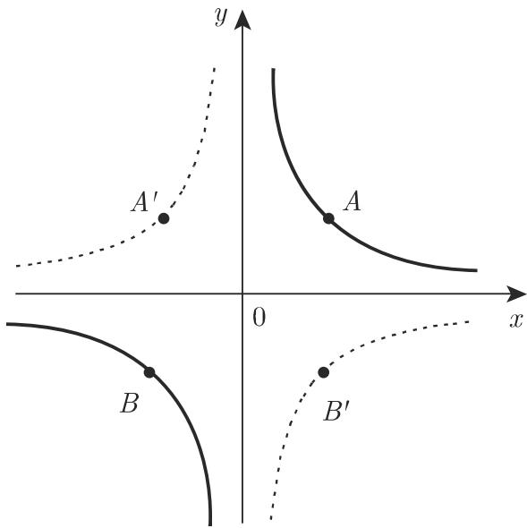  
图2.16

#### 2.4.2 线性分式函数

函数

$$
y = \frac {a _ {1} x + b _ {1}}{a _ {2} x + b _ {2}} \quad \left(a _ {2} \neq 0, \Delta = \left| \begin{array}{c c} a _ {1} & b _ {1} \\ a _ {2} & b _ {2} \end{array} \right| = a _ {1} b _ {2} - b _ {1} a _ {2} \neq 0\right)\tag{2.46}
$$

的图像为一等轴双曲线, 渐近线与坐标轴平行 (图 2.17). 中心在点 $C\left(-\frac{b_2}{a_2}, \frac{a_1}{a_2}\right)$ . 等式 (2.45) 中的参数 $a$ 与此处的 $-\frac{\Delta}{a_2^2}$ 对应, 其中 $\Delta = \left| \begin{array}{ll} a_1 & b_1 \\ a_2 & b_2 \end{array} \right|$ . 双曲线顶点 $A \neq 0$ , $B$ 分别为 $\left(-\frac{b_2 \pm \sqrt{|\Delta|}}{a_2}, \frac{a_1 + \sqrt{|\Delta|}}{a_2}\right)$ 和 $\left(-\frac{b_2 \pm \sqrt{|\Delta|}}{a_2}, \frac{a_1 - \sqrt{|\Delta|}}{a_2}\right)$ , 当 $\Delta < 0$ 时取相同符号, 当 $\Delta > 0$ 时取相反符号. 间断点为 $x = -\frac{b_2}{a_2}$ . 若 $\Delta < 0$ , 函数值由 $\frac{a_1}{a_2}$ 到 $-\infty$ 和 $+\infty$ 到 $\frac{a_1}{a_2}$ 递减; 若 $\Delta > 0$ , 函数值从 $\frac{a_1}{a_2}$ 到 $+\infty$ 和 $-\infty$ 到 $\frac{a_1}{a_2}$ 递增. 函数无极值.

  
图2.17

#### 2.4.3 第I类三次曲线

函数

$$
y = a + \frac {b}{x} + \frac {c}{x ^ {2}} \left(= \frac {a x ^ {2} + b x + c}{x ^ {2}}\right) \quad (b \neq 0, c \neq 0)\tag{2.47}
$$

的图像为一三次曲线(第I类)(图2.18)，有两条渐近线 $x = 0$ 和 $y = a$ ，且有两个分支．其中一个分支上， $y$ 在 $a$ 与 $+\infty$ 或 $a$ 与 $-\infty$ 之间单调变化；另一个分支穿过三个特征点：与渐近线 $y = a$ 的交点 $A\left(-\frac{c}{b}, a\right)$ ，极值点 $B\left(-\frac{2c}{b}, a - \frac{b^2}{4c}\right)$ 及拐点 $C\left(-\frac{3c}{b}, a - \frac{2b^2}{9c}\right)$ . 分支的位置取决于 $b, c$ 的符号，共四种情况（图2.18）．若与 $x$ 轴有交点 $D, E,$ 则当 $a \neq 0$ 时交点坐标为 $\left(\frac{-b \pm \sqrt{b^2 - 4ac}}{2a}, 0\right)$ ，当 $a = 0$ 时交点坐标为 $\left(-\frac{c}{b}, 0\right)$ ；根据 $b^2 - 4ac > 0, b^2 - 4ac = 0$ 或 $b^2 - 4ac < 0$ ，交点的个数可能为两个、一个（ $x$ 轴为切线）或0个.

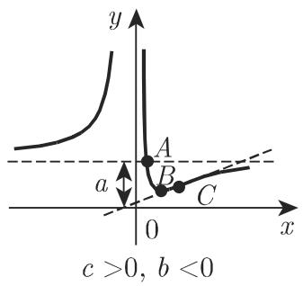  
(a)

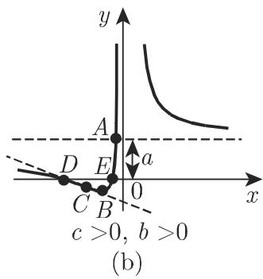

  
(c)

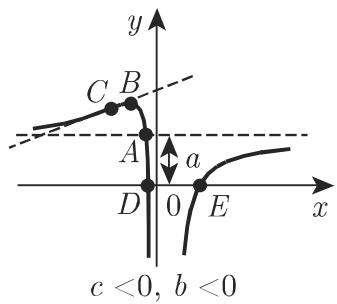  
(d)  
图2.18

当 $b = 0$ 时, 函数 (2.47) 变为 $y = a + \frac{c}{x^2}$ (参见 (图2.21) 倒数幂), 当 $c = 0$ 时, 函数 (2.47) 变成单应函数 $y = \frac{ax + b}{x}$ , 它是 (2.46) 的一种特殊情况.

#### 2.4.4 第II类三次曲线

函数

$$
y = \frac {1}{a x ^ {2} + b x + c} (a \neq 0)\tag{2.48}
$$

的图像为一三次曲线(第Ⅱ类), 关于铅直直线 $x = -\frac{b}{2a}$ 对称, 因为 $\lim_{x \to \pm \infty} y = 0$ , 故 $x$ 轴为它的渐近线 (图2.19). 该曲线的形状与 $a$ 和 $\Delta = 4ac - b^2$ 的符号有关. 在 $a > 0$ 和 $a < 0$ 两种情况中, 仅考虑第一种情况, 事实上, 只需将 $y = \frac{1}{(-a)x^2 - bx - c}$ 沿 $x$ 轴反射就可以得到第二种情况.

情形 a) $\Delta > 0$ 对任意变量 x，函数都是正的连续函数，且在 $\left(-\infty, -\frac{b}{2a}\right)$ 上单调递增，并取得极大值 $\frac{4a}{\Delta}$ ，接着在 $\left(-\frac{b}{2a}, +\infty\right)$ 单调递减。曲线的极值点为 $A\left(-\frac{b}{2a}, \frac{4a}{\Delta}\right)$ ，拐点 B，C 为 $\left(-\frac{b}{2a} \pm \frac{\sqrt{\Delta}}{2a\sqrt{3}}, \frac{3a}{\Delta}\right)$ ；相应切线的斜率（角系数） $\tan \varphi = \mp a^{2}\left(\frac{3}{\Delta}\right)^{3/2}$ （图 2.19(a)).

情形 b) $\Delta = 0$ 对任意变量 x，函数取值均为正，先从 0 增加到 $+\infty, x = -\frac{b}{2a} = x_{0}$ 为间断点（极点）， $\lim_{x \to x_{0}} y = +\infty$ ，接着再由 $+\infty$ 减少到 0（图 2.19(b)）.

情形 c) $\Delta < 0$ 函数值 y 先由 0 增加 $+\infty$ ，在间断点跳跃到 $-\infty$ ，然后递增取得极大值，接着又减小到 $-\infty$ ；在另一个间断点跳跃到 $+\infty$ ，继而又减小到 0。曲线的极值点为 $A\left(-\frac{b}{2a}, \frac{4a}{\Delta}\right)$ ，间断点为 $x = \frac{-b \pm \sqrt{-\Delta}}{2a}$ （图 2.19(c)).

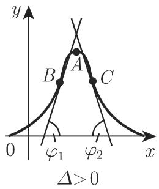  
(a)

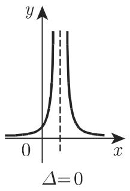  
(b)  
图2.19

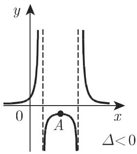  
(c)

#### 2.4.5 第III类三次曲线

函数

$$
y = \frac {x}{a x ^ {2} + b x + c} \quad (a \neq 0, b \neq 0, c \neq 0)\tag{2.49}
$$

的图像为一过原点的三次曲线(第III类), $x$ 轴为它的一条渐近线 (图2.20). 该函数的性状除了与 $a$ 和 $\Delta = 4ac - b^2$ 的符号有关外, 当 $\Delta < 0$ , 还与方程 $ax^2 + bx + c = 0$ 的根 $\alpha, \beta$ 的符号有关; 当 $\Delta = 0$ 时, 与 $b$ 的符号有关. 在 $a > 0$ 和 $a < 0$ 两种情况中, 仅考虑第一种情况, 因为只需将 $y = \frac{x}{(-a)x^2 - bx - c}$ 沿 $x$ 轴反射就可以得到第二种情况.

情形 a) $\Delta > 0$ 函数处处连续, 它的值先由 0 减小到极小值, 再增加到极大值, 最后再次减小到 0.

曲线的极值点 A, B 为 $\left(\pm\sqrt{\frac{c}{a}}, \frac{-b\pm2\sqrt{ac}}{\Delta}\right)$ ，且曲线有三个拐点（图 2.20(a)).

情形 b) $\Delta = 0$ 函数的性质与 b 的符号有关, 因此分为两种情况. 在每种情况中, 函数都有一个间断点 $x = -\frac{b}{2a}$ 和一个拐点.

\- $b > 0$ : 函数值先由 0 减小到 $-\infty$ , 经过一个间断点后, 函数值又由 $-\infty$ 增加到极大值, 接着再减小到 0 (图 $2.20(\mathrm{b}_1)$ ). 曲线的极值点为 $A\left(+\sqrt{\frac{c}{a}}, \frac{1}{2\sqrt{ac} + b}\right)$ .

\- $b < 0$ : 函数值先由 0 减小到极小值, 再经过原点增加到 $+\infty$ , 接着函数经过一个间断点后又由 $+\infty$ 减小到 0 (图 2.20(b₂)). 曲线的极值点为 $A\left(-\sqrt{\frac{c}{a}}, -\frac{1}{2\sqrt{ac} - b}\right)$ .

情形 c) $\Delta < 0$ 函数有两个间断点 $x = \alpha, x = \beta$ ; 其性质与 $\alpha, \beta$ 的符号

有关.

\- $\alpha, \beta$ 的符号互异：函数值先从 0 减小到 $-\infty$ ，接着跳跃到 $+\infty$ ，然后由 $+\infty$ 减小到 $-\infty$ ，且通过原点，随后又跳跃到 $+\infty$ 并减小到 0（图 $2.20(c_1)$ ）。函数无极值。
- $\alpha, \beta$ 均为负数：函数值先从 0 减小到 $-\infty$ ，接着跳跃到 $+\infty$ ，然后减少到极小值后再次增加到 $+\infty$ ，随后跳跃到 $-\infty$ 并增加到极大值，最后逐渐减小至趋于 0（图 $2.20(c_2)$ ）.

极值点 A, B 可以利用与 2.4.5 中的情形 a) 类似的公式来计算.

\- $\alpha, \beta$ 均为正数：函数值先从0减小到极小值，再增加到 $+\infty$ ，接着跳跃到 $-\infty$ ，增加到极大值并再次减小到 $-\infty$ ，随后跳跃到 $+\infty$ 且逐渐减小至趋于0(图 $2.20(c_3)$ ).

极值点 A, B 可以利用与 2.4.5 情形 a) 类似的公式来计算.

在这三种情况中，曲线都有一个拐点.

  
(a)

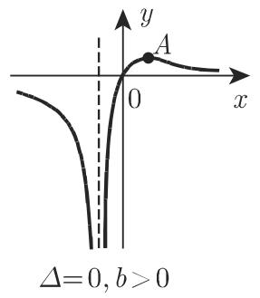

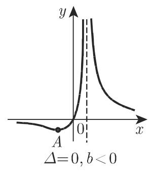

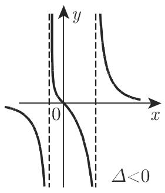  
$\left(c_{1}\right)$

(b $_{1}$ )  
  
$\left(c_{2}\right)$  
图2.20

(b2)  
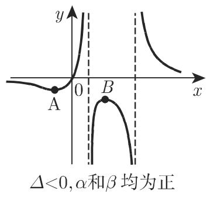  
$\left(\mathrm{c}_{3}\right)$

#### 2.4.6 倒数幂

函数

$$
y = \frac {a}{x ^ {n}} = a x ^ {- n} \quad (a \neq 0, n \text {为大于零的整数})\tag{2.50}
$$

的图像为一双曲型曲线, 坐标轴是渐近线, 间断点为 $x = 0$ (图2.21).

情形 a) 当 $a > 0$ 且 $n$ 为偶数时, 函数值由 0 增加到 $+\infty$ , 再由 $+\infty$ 减小到趋于 0, 且一直为正. 当 $n$ 为奇数时, 函数值由 0 减小到 $-\infty$ , 然后跳跃到 $+\infty$ 并减小到趋于 0.

情形 b) 当 $a < 0$ 且 $n$ 为偶数时, 函数值由 0 减小到 $-\infty$ , 再增加至趋于 0, 且一直为负. 当 $n$ 为奇数时, 函数值由 0 增加到 $+\infty$ , 然后跳跃到 $-\infty$ 并增加到趋于 0.

函数没有极值. $n$ 越大, 曲线趋近 $x$ 轴的速度越快, 趋近 $y$ 轴的速度越慢. 若 $n$ 为偶数, 曲线关于 $y$ 轴对称; 若 $n$ 为奇数, 曲线关于原点呈中心对称. 图2.21是当 $a = 1$ 时 $n = 2$ 和 $n = 3$ 的图像.

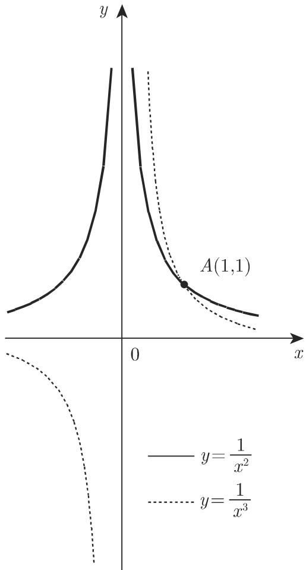  
图2.21
