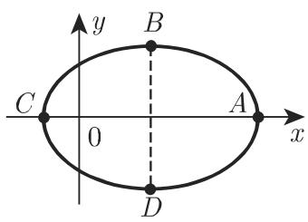
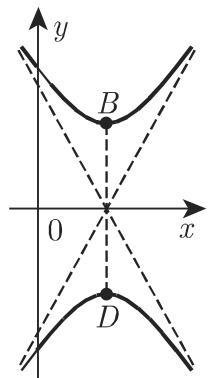
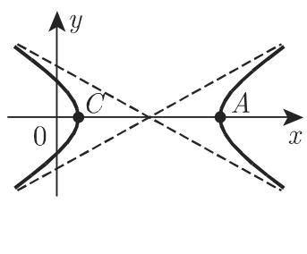
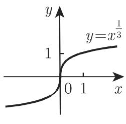
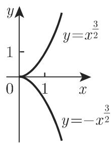
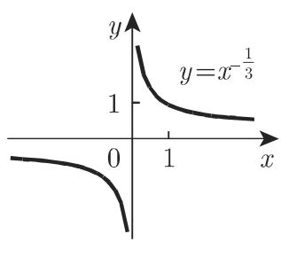
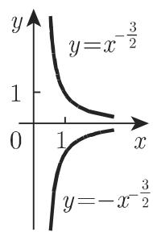

### 2.5 无理函数

#### 2.5.1 线性二项式的平方根

两个函数联立的曲线

$$
y = \pm \sqrt {a x + b} (a \neq 0)\tag{2.51}
$$

是关于 $x$ 轴对称的一条抛物线. 顶点 $A$ 为 $\left(-\frac{b}{a}, 0\right)$ , 半焦弦(参见第275页3.5.2.10) $p = \frac{a}{2}$ , 函数的定义域和曲线的形状与 $a$ 的符号有关 (图2.22)(关于抛物线更详尽的说明参见第 275 页 3.5.2.10).

  
图2.22

#### 2.5.2 二次多项式的平方根

两个函数联立的曲线

$$
y = \pm \sqrt {a x ^ {2} + b x + c} (a \neq 0, \Delta = 4 a c - b ^ {2} \neq 0),\tag{2.52}
$$

当 $a < 0$ 时是椭圆；当 $a > 0$ 时是双曲线(图2.23)，其中一条对称轴是 $x$ 轴，另一条对称轴是直线 $x = -\frac{b}{2a}$ .

顶点 $A, C$ 和 $B, D$ 的坐标为 $\left(-\frac{b \pm \sqrt{-\Delta}}{2a}, 0\right)$ 和 $\left(-\frac{b}{2a}, \pm \sqrt{\frac{\Delta}{4a}}\right)$ , 其中 $\Delta = 4ac - b^2$ .

  
(a) a<0, $\Delta<0$

  
(b) a>0, $\Delta>0$

  
(c) $a > 0, \Delta < 0$  
图2.23

函数的定义域和曲线的形状与 $a$ 和 $\Delta$ 的符号有关 (图2.23). 当 $a < 0$ 且 $\Delta > 0$ 时, 函数仅有一个虚值, 因此曲线不存在 (关于椭圆和双曲线更详尽的说明参见第267页3.5.2.8和第271页3.5.2.9).

#### 2.5.3 幂函数

下面分 $k > 0$ 和 $k < 0$ 两种情况（图2.24，图2.25）讨论幂函数

$$
y = a x ^ {k} = a x ^ {\pm m / n} \quad (m,   n \text {为互素的正整数}).\tag{2.53}
$$

此处仅考察 $a = 1$ ，因为 $a \neq 1$ 时只需把曲线 $y = x^k$ 沿 $y$ 轴方向拉伸 $|a|$ 倍，若 $a < 0$ ，把该图像沿 $x$ 轴反射即可.

  
(a)

  
(b)

  
(c)

  
(d)

  
(a)

图2.24  
  
(b)

  
图2.25  
(c)

情形 a) $k > 0, y = x^{\frac{m}{n}}$ ：曲线形状可用与 $m, n$ 有关的四个特例来说明，如图2.24．曲线过点 $(0,0)$ 和 $(1,1)$ . 若 $k > 1$ ， $x$ 轴是曲线在原点的切线(图2.24(d))，若 $k < 1$ ， $y$ 轴是曲线在原点的切线（图2.24(a),(b),(c))．当 $n$ 为偶数时，函数 $y = \pm x^{k}$ 的图像关于 $x$ 轴有两个对称的分支（图2.24(a)，(d))，当 $m$ 为偶数时，曲线关于 $y$ 轴对称（图2.24(c))．若 $m, n$ 都是奇数，曲线关于原点对称(图2.24(b))．因此曲线在原点处可能有一个顶点、一个尖点或者拐点（图2.24），但没有渐近线.

情形 b) $k < 0, y = x^{-\frac{m}{n}}$ ：曲线形状可用与 $m, n$ 有关的三个特例来说明，如图2.25．曲线为双曲型曲线，渐近线为坐标轴（图2.25）， $x = 0$ 为间断点． $|k|$ 越大，曲线趋近 $x$ 轴的速度越快，趋近 $y$ 轴的速度越慢．曲线的对称性与前面 $k > 0$ 时的相同，也与 $m, n$ 的奇偶性有关．函数没有极值．
