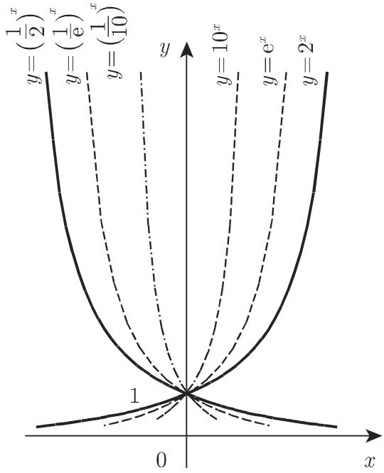
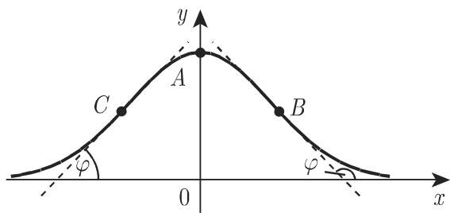
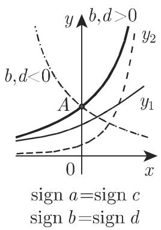
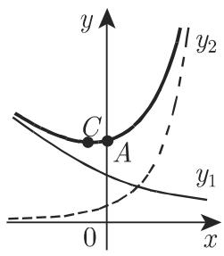
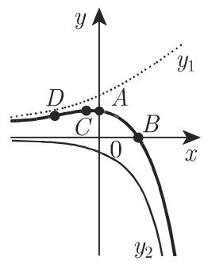
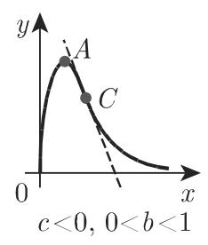
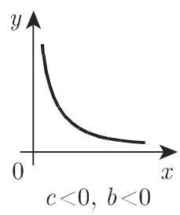

### 2.6 指数函数和对数函数

#### 2.6.1 指数函数

函数

$$
y = a ^ {x} = \mathrm{e} ^ {b x} \quad (a > 0, b = \ln a)\tag{2.54}
$$

称为指数函数, 其图像为指数曲线(图 2.26). 由 (2.54), 令 $a = \mathrm{e}$ , 得到自然指数曲线的函数

$$
y = \mathrm{e} ^ {x},\tag{2.55}
$$

该函数只取正值, 定义域为 $(- \infty, + \infty)$ . 当 $a > 1$ 即 $b > 0$ 时, 函数严格单调递增, 取值范围为 0 到 $+\infty$ . 当 $a < 1$ 即 $b < 0$ 时, 函数严格单调递减, 取值范围为 $+\infty$ 到 0. $|b|$ 越大, 函数增加或减小的速度越快. 曲线过点 $(0,1)$ , 当 $b > 0$ 时在左边渐近趋近 $x$ 轴, 当 $b < 0$ 时在右边渐近趋近 $x$ 轴, 且 $|b|$ 越大, 趋近 $x$ 轴的速度越快. 若 $a < 1$ , $y = a^{-x} = \left(\frac{1}{a}\right)^x$ 是增函数; 若 $a > 1$ , $y$ 是减函数.

  
图2.26

#### 2.6.2 对数函数

函数

$$
y = \log_ {a} x (a > 0, a \neq 1)\tag{2.56}
$$

描述了对数曲线(图 2.27); 该曲线可由指数曲线沿直线 y = x 反射得到. 由 (2.56), 令 a = e, 得到自然对数曲线的函数

$$
y = \ln x,\tag{2.57}
$$

仅当 $x > 0$ 时, 实对数函数才有定义. 若 $a > 1$ , 函数严格单调递增, 从 $-\infty$ 到 $+\infty$ 取值; 若 $a < 1$ , 函数严格单调递减, 从 $+\infty$ 到 $-\infty$ 取值, 且 $|\ln a|$ 越小, 函数增加或减小的速度越快. 曲线过点 (1, 0), 当 $a > 1$ 时, 向下渐近趋近 $y$ 轴, 当 $a < 1$ 时, 向上渐近趋近 $y$ 轴, 且 $|\ln a|$ 越大, 趋近 $y$ 轴的速度越快.

  
图2.27

#### 2.6.3 误差曲线

函数

$$
y = \mathrm{e} ^ {- (a x) ^ {2}}\tag{2.58}
$$

描述了误差曲线(高斯误差分布曲线)(图 2.28). 因为函数为偶函数, 故曲线关于 y 轴对称, 且 $|a|$ 越大, 它渐近趋近 x 轴的速度越快, 当 x = 0 时, 函数取得极大值 1, 因此曲线的极值点 A 为 $(0, 1)$ , 在 $\left(\pm\frac{1}{a\sqrt{2}}, \frac{1}{\sqrt{\mathrm{e}}}\right)$ 有拐点 B, C, 拐点处切线的斜率 $\tan\varphi = \mp a\sqrt{2/\mathrm{e}}$ .

  
图2.28

误差曲线 (2.58) 在描述观测误差的正态分布性质时有着重要应用 (参见第 1069 页 16.2.4.1 和第 1107 页 16.4.1.2,3.):

$$
y = \varphi (x) = \frac {1}{\sigma \sqrt {2 \pi}} \exp \left(- \frac {x ^ {2}}{2 \sigma^ {2}}\right).\tag{2.59}
$$

#### 2.6.4 指数和

函数

$$
y = a \mathrm{e} ^ {b x} + c \mathrm{e} ^ {d x}\tag{2.60}
$$

的特征符号关系如图2.29所示．通过把两曲线的坐标相加，即 $y_{1} = a\mathrm{e}^{bx}$ 与 $y_{2} = ce^{dx}$ 求和，得到函数的和，且该函数为连续函数．若 $a,b,c,d$ 均不等于

0, 曲线是图 2.29 中的四种形式之一. 依参数的符号不同, 图像可能会沿坐标轴反射.

  
(a)

  
(b)

  
(c)

  
图2.29  
(d)

设曲线与 $y$ 轴和 $x$ 轴的交点分别为 $A(0, a + c)$ 和 $B\left(\frac{\ln(-a / c)}{d - b}, 0\right)$ , 若函数有极值点 $C$ 和拐点 $D$ , 则它们分别在 $x = \frac{1}{d - b} \ln \left(-\frac{ab}{cd}\right)$ 和 $x = \frac{1}{d - b} \ln \left(-\frac{ab^2}{cd^2}\right)$ 处取得.

情形 a) 参数 $a$ 与 $c$ 符号相同, $b$ 与 $d$ 符号相同: 函数不变号且严格单调; 它的值从 0 变到 $+\infty$ 或 $-\infty$ , 亦或从 $+\infty$ 或 $-\infty$ 变到 0; 无拐点, 渐近线是 $x$ 轴 (图 2.29(a)).

情形 b) 参数 $a$ 与 $c$ 符号相同, $b$ 与 $d$ 符号相反: 函数不变号, 它的值或者从 $+\infty$ 变到 $+\infty$ , 且有极小值, 或者从 $-\infty$ 变到 $-\infty$ , 且有极大值, 无拐点 (图2.29(b)).

情形 c) 参数 a 与 c 符号相反, b 与 d 符号相同: 函数有极值, 且在极值之前和之后均严格单调. 函数符号改变一次, 它的值可能由 0 变为极值, 再从极值变化到 $+\infty$ 或 $-\infty$ ; 或者先从 $+\infty$ 或 $-\infty$ 变化到极值, 再趋于 0. x 轴是它的一条渐近线, 曲线的极值点为 C, 拐点为 D(图 2.29(c)).

情形 d) 参数 $a$ 与 $c$ 符号相反, $b$ 与 $d$ 符号也相反: 函数严格单调, 它的值从 $-\infty$ 增加到 $+\infty$ 或从 $+\infty$ 减少到 $-\infty$ , 拐点为 $D(\text{图 } 2.29(d))$ .

#### 2.6.5 广义误差函数

函数

$$
y = a \mathrm{e} ^ {b x + c x ^ {2}} = a \mathrm{e} ^ {- \frac {b ^ {2}}{4 c ^ {2}}} \mathrm{e} ^ {c (x + \frac {b}{2 c}) ^ {2}} \quad (c \neq 0)\tag{2.61}
$$

的图像可以看作是误差函数(2.58)的推广, 关于铅直直线 $x = -\frac{b}{2c}$ 对称, 且与 x 轴无交点, 与 y 轴的交点 D 为 $(0, a)$ (图 2.30(a), (b)).

  
(a) c > 0

  
(b) c < 0  
图2.30

曲线形状与 $a$ 和 $c$ 的符号有关, 此处仅讨论 $a > 0$ 的情况, 因为 $a < 0$ 时仅需将前一图形沿 $x$ 轴反射.

情形 a) c > 0 函数先由 +∞ 减小到极小值, 然后再增加到 +∞, 且取值恒为正. 曲线极值点 A 为 $\left(-\frac{b}{2c}, ae^{\frac{b^{2}}{4c}}\right)$ , 对应函数的极小值; 函数无拐点和渐近线 (图 2.30(a)).

情形 b) c < 0 函数的渐近线是 x 轴, 曲线极值点 A 为 $\left(-\frac{b}{2c}, ae^{-\frac{b^{2}}{4c}}\right)$ , 对应函数的极大值, 拐点 B, C 为 $\left(-\frac{b \pm \sqrt{-2c}}{2c}, ae^{\frac{-(b^{2}+2c)}{4c}}\right)$ (图 2.30(b)).

#### 2.6.6 幂函数与指数函数的乘积

此处仅在 $a > 0$ 时, 对函数

$$
y = a x ^ {b} \mathrm{e} ^ {c x} (c \neq 0)\tag{2.62}
$$

进行讨论, 因为 $a < 0$ 时, 只需将前一图形沿 $x$ 轴反射. 若 $b$ 不是整数, 仅在 $x > 0$ 时给出定义; 若 $b$ 是整数, 当 $x < 0$ 时, 曲线的形状可归为如下情况 (图2.31).

图 2.31 给出了任意参数下曲线的性状.

若 $b > 0$ ，曲线过原点，且当 $b > 1$ 时，原点处的切线为 $x$ 轴；当 $b = 1$ 时，原点处的切线为 $y = x$

当 $0 < b < 1$ 时, 原点处的切线为 $y$ 轴. 若 $b < 0$ , $y$ 轴为曲线的一条渐近线. 若 $c > 0$ , 函数不断增加且超过任何给定的值; 若 $c < 0$ , 函数渐近趋近于 0. 若 $b, c$ 异号, 函数在 $x = -\frac{b}{c}$ 处 (曲线上点 $A$ ) 有极值. 曲线在 $x = -\frac{b \pm \sqrt{b}}{c}$ 有 0 个、1 个或 2 个拐点 (参见图 2.31(c), (e), (f), (g) 中的点 $C, D$ ).

  
(a)

  
(b)

  
(c)

  
(d)

  
(e)

  
(f)

图2.31  
  
(g)

  
(h)
