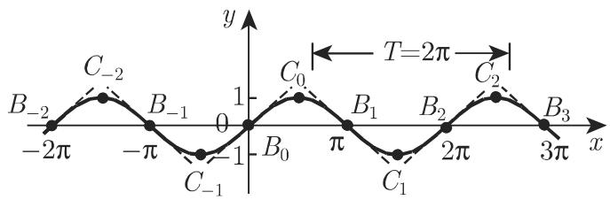
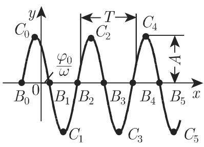
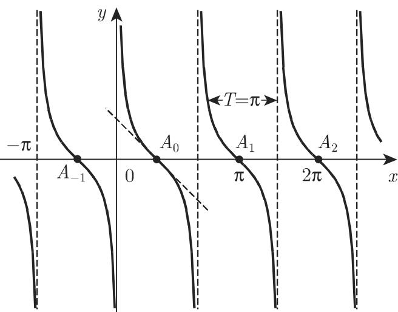
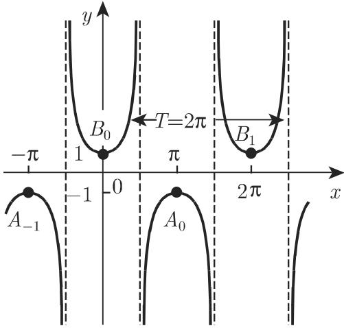
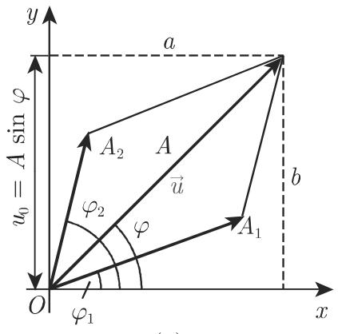
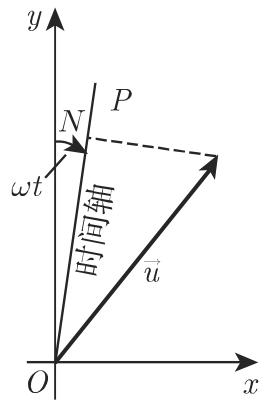
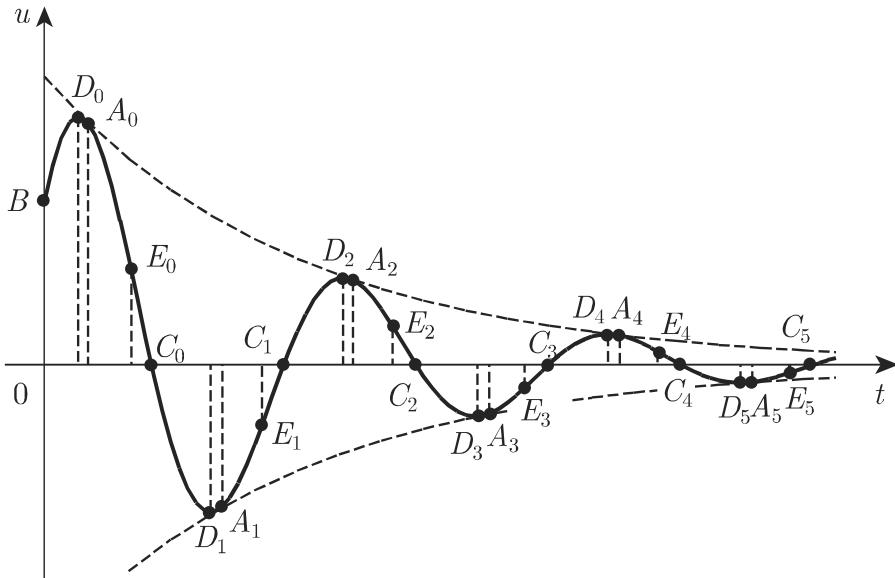

### 2.7 三角函数(角函数)

#### 2.7.1 基本概念

2.7.1.1 定义及表示

1. 定义

因为三角函数是从几何角度引入进来的, 所以它们的定义及自变量采用角度或者弧度制 (参见第 170 页 3.1.1.5).

2. 正弦

标准正弦函数

$$
y = \sin x\tag{2.63}
$$

是周期为 $T = 2\pi$ 的连续曲线 (参见图 2.32(a)).

  
(a)

  
图2.32  
(b)

标准正弦曲线与 x 轴的交点为 $B_{0}, B_{1}, B_{-1}, B_{2}, B_{-2}, \cdots$ ，其中 $B_{k} = (k\pi, 0)$ ( $k = 0, \pm1, \pm2, \cdots$ ) 为曲线的拐点，此处切线关于 x 轴的倾斜角为 $\pm\frac{\pi}{4}$ 。曲线的极值点为 $C_{0}, C_{1}, C_{-1}, C_{2}, C_{-2}, \cdots$ ，其中 $C_{k} = \left( \left( k + \frac{1}{2} \right) \pi, (-1)^{k} \right) (k = 0, \pm1, \pm2, \cdots)$ 。对任意函数值 y，都有 $-1 \leqslant y \leqslant 1$ 。

一般正弦函数

$$
y = A \sin (\omega x + \varphi_ {0})\tag{2.64}
$$

的振幅为 $\left|A\right|$ ，频率为 $\omega,\varphi_{0}$ 为相位移，见图 2.32(b).

通过比较标准正弦曲线和一般正弦曲线 (图 2.32(b)), 可以看出后者可由前者沿 $y$ 轴方向拉伸 $|A|$ 倍, 沿 $x$ 轴方向压缩 $\frac{1}{\omega}$ 倍, 再向左平移 $\frac{\varphi_0}{\omega}$ 个单位得到. 周期 $T = \frac{2\pi}{\omega}$ , 与 $x$ 轴的交点 $B_k = \left(\frac{k\pi - \varphi_0}{\omega}, 0\right) (k = 0, \pm 1, \pm 2, \dots)$ , 极值点 $C_k = \left(\frac{\left[\left(k + \frac{1}{2}\right)\pi - \varphi_0\right]}{\omega}, (-1)^k A\right) (k = 0, \pm 1, \pm 2, \dots)$ .

3. 余弦

标准余弦函数

$$
y = \cos x = \sin \left(x + \frac {\pi}{2}\right)\tag{2.65}
$$

如图 2.33 所示.

  
图2.33

曲线与 x 轴的交点 $B_{0}$ ， $B_{1}$ ， $B_{2}$ ， $\cdots$ ， $B_{k} = \left( \left( k + \frac{1}{2} \right) \pi, 0 \right) (k = 0, \pm 1, \pm 2, \cdots)$ 也为拐点，此处切线的倾斜角为 $\pm \frac{\pi}{4}$ 。极值点 $C_{0}$ ， $C_{1}$ ， $\cdots$ ， $C_{k} = (k\pi, (-1)^{k})(k = 0, \pm 1, \pm 2, \cdots)$ 。

一般余弦函数

$$
y = A \cos (\omega x + \varphi_ {0})\tag{2.66}
$$

可以变换成

$$
y = A \sin \left(\omega x + \varphi_ {0} + \frac {\pi}{2}\right),\tag{2.67}
$$

即由一般正弦函数向左平移 $\varphi = \frac{\pi}{2}$ 个单位.

4. 正切

正切函数

$y = \tan x$ (2.68)

的周期 $T = \pi$ , 渐近线为 $x = \left(k + \frac{1}{2}\right)\pi \quad (k = 0, \pm 1, \pm 2, \cdots)$ (图 2.34). 函数在区间 $\left(-\frac{\pi}{2} + k\pi, +\frac{\pi}{2} + k\pi\right) (k = 0, \pm 1, \pm 2, \cdots)$ 单调递增, 取值范围为由 $-\infty$ 到 $+\infty$ , 曲线与 $x$ 轴的交点为 $A_0, A_1, A_{-1}, A_2, A_{-2}, \cdots$ , 其中 $A_k = (k\pi, 0) (k = 0, \pm 1, \pm 2, \cdots)$ 且为曲线的拐点, 此处切线的倾斜角为 $\frac{\pi}{4}$ .

  
图2.34

5. 余切

余切函数

$$
y = \cot x = - \tan \left(x + \frac {\pi}{2}\right)\tag{2.69}
$$

的图像可由正切曲线沿 x 轴反射并向左平移 $\frac{\pi}{2}$ 个单位得到 (图 2.35)，渐近线为 $x = k\pi (k = 0, \pm1, \pm2, \cdots)$ . 函数在 $(0, \pi)$ 单调递减，取值范围为由 $+\infty$ 到 $-\infty$ ; 周期 $T = \pi$ . 曲线与 x 轴的交点为 $A_{0}, A_{1}, A_{-1}, A_{2}, A_{-2}, \cdots$ , 其中 $A_{k} = \left( \left( k + \frac{1}{2} \right) \pi, 0 \right) (k = 0, \pm1, \pm2, \cdots)$ 且为曲线的拐点，此处切线的倾斜角为 $-\frac{\pi}{4}$ .

6. 正割

正割函数

$$
y = \sec x = \frac {1}{\cos x}\tag{2.70}
$$

的周期 $T=2\pi$ ，渐近线为 $x=\left(k+\frac{1}{2}\right)\pi\quad(k=0,\pm1,\pm2,\cdots)$ ；显然 $|y|\geqslant1$ 。与函数的极大值相对应的极值点为 $A_{0},A_{1},A_{-1},\cdots$ ，其中 $A_{k}=((2k+1)\pi,-1)(k=$

  
图2.35

$0, \pm 1, \pm 2, \cdots)$ ; 与函数极小值相对应的极值点为 $B_0, B_1, B_{-1}, \cdots$ , 其中 $B_k = (2k\pi, +1)(k = 0, \pm 1, \pm 2, \cdots)$ (图 2.36).

  
图2.36

  
图2.37

7. 余割

余割函数

$$
y = \csc x = \frac {1}{\sin x}\tag{2.71}
$$

的图像可由正割函数图像向右平移 $x = \frac{\pi}{2}$ 个单位得到，渐近线为 $x = k\pi (k = 0, \pm1, \pm2, \cdots)$ 。与函数的极大值相对应的极值点为 $A_{0}, A_{1}, A_{-1}, \cdots$ ，其中 $A_{k} = \left(\frac{4k + 3}{2}\pi, -1\right) (k = 0, \pm1, \pm2, \cdots)$ ；与函数极小值相对应的极值点为 $B_{0}, B_{1}, B_{-1}, \cdots$ ，其中 $B_{k} = \left(\frac{4k + 1}{2}\pi, +1\right) (k = 0, \pm1, \pm2, \cdots)$ （图 2.37）。

2.7.1.2 函数的值域与性质

1. 角度范围 $0^{\circ} \leqslant x \leqslant 360^{\circ}$

图2.38描述了六个三角函数从 $0^{\circ}$ 到 $360^{\circ}$ 或从0到 $2\pi$ 弧度这四个象限的情况.

  
图2.38

表 2.1 回顾了这些函数的定义域和值域. 函数的符号与自变量所属的象限有关, 见表 2.2.

表 2.1 三角函数的定义域和值域

<table><tr><td>定义域</td><td>值域</td><td>定义域</td><td>值域</td></tr><tr><td rowspan="3"> $-\infty < x < \infty \left\{ \begin{array}{ll} & -1 \leqslant \sin x \leqslant 1 \\ & -1 \leqslant \cos x \leqslant 1 \end{array} \right.$ </td><td rowspan="3"></td><td> $x \neq (2k+1)\frac{\pi}{2}$ </td><td> $-\infty < \tan x < \infty$ </td></tr><tr><td> $x \neq k\pi$ </td><td> $-\infty < \cot x < \infty$ </td></tr><tr><td> $(k=0,\pm1,\pm2,\cdots)$ </td><td></td></tr></table>

表 2.2 三角函数的符号

<table><tr><td>象限</td><td>角</td><td>sin</td><td>cos</td><td>tan</td><td>cot</td><td>sec</td><td>csc</td></tr><tr><td>I</td><td> $0^{\circ} < \alpha < 90^{\circ}$ </td><td>+</td><td>+</td><td>+</td><td>+</td><td>+</td><td>+</td></tr><tr><td>II</td><td> $90^{\circ} < \alpha < 180^{\circ}$ </td><td>+</td><td>-</td><td>-</td><td>-</td><td>-</td><td>+</td></tr><tr><td>III</td><td> $180^{\circ} < \alpha < 270^{\circ}$ </td><td>-</td><td>-</td><td>+</td><td>+</td><td>-</td><td>-</td></tr><tr><td>IV</td><td> $270^{\circ} < \alpha < 360^{\circ}$ </td><td>-</td><td>+</td><td>-</td><td>-</td><td>+</td><td>-</td></tr></table>

2. 某些特殊角的三角函数值 (参见表 2.3)

表 2.3 $0^{\circ}$ , $30^{\circ}$ , $45^{\circ}$ , $60^{\circ}$ , $90^{\circ}$ 角的三角函数值

<table><tr><td>角度</td><td>弧度</td><td>sin</td><td>cos</td><td>tan</td><td>cot</td><td>sec</td><td>csc</td></tr><tr><td> $0^{\circ}$ </td><td>0</td><td>0</td><td>1</td><td>0</td><td> $\mp\infty$ </td><td>1</td><td> $\mp\infty$ </td></tr><tr><td> $30^{\circ}$ </td><td> $\frac{1}{6}\pi$ </td><td> $\frac{1}{2}$ </td><td> $\frac{\sqrt{3}}{2}$ </td><td> $\frac{\sqrt{3}}{3}$ </td><td> $\sqrt{3}$ </td><td> $\frac{2\sqrt{3}}{3}$ </td><td>2</td></tr><tr><td> $45^{\circ}$ </td><td> $\frac{1}{4}\pi$ </td><td> $\frac{\sqrt{2}}{2}$ </td><td> $\frac{\sqrt{2}}{2}$ </td><td>1</td><td>1</td><td> $\sqrt{2}$ </td><td> $\sqrt{2}$ </td></tr><tr><td> $60^{\circ}$ </td><td> $\frac{1}{3}\pi$ </td><td> $\frac{\sqrt{3}}{2}$ </td><td> $\frac{1}{2}$ </td><td> $\sqrt{3}$ </td><td> $\frac{\sqrt{3}}{3}$ </td><td>2</td><td> $\frac{2\sqrt{3}}{3}$ </td></tr><tr><td> $90^{\circ}$ </td><td> $\frac{1}{2}\pi$ </td><td>1</td><td>0</td><td> $\pm\infty$ </td><td>0</td><td> $\pm\infty$ </td><td>1</td></tr></table>

3. 任意角

因为三角函数为周期函数 (周期为 $360^{\circ}$ 或 $180^{\circ}$ ), 所以任意角 $x$ 的三角函数值可以用如下法则来确定.

角 $x > 360^{\circ}$ 或 $x > 180^{\circ}$ ：若角度大于 $360^{\circ}$ 或 $180^{\circ}$ ，可以按下面方法化简到值 $\alpha$ ，使其满足 $0 \leqslant \alpha \leqslant 360^{\circ}$ 或 $0 \leqslant \alpha \leqslant 180^{\circ}$ ( $n$ 为整数):

$$
\sin \left(3 6 0 ^ {\circ} \cdot n + \alpha\right) = \sin \alpha ;\tag{2.72}
$$

$$
\cos (3 6 0 ^ {\circ} \cdot n + \alpha) = \cos \alpha ;\tag{2.73}
$$

$$
\tan (1 8 0 ^ {\circ} \cdot n + \alpha) = \tan \alpha ;\tag{2.74}
$$

$$
\cot (1 8 0 ^ {\circ} \cdot n + \alpha) = \cot \alpha .\tag{2.75}
$$

角 $x<0^{\circ}$ ：若为负角，可以按下面公式转化为正角的三角函数计算：

$$
\sin (- \alpha) = - \sin \alpha ;\tag{2.76}
$$

$$
\cos (- \alpha) = \cos \alpha ;\tag{2.77}
$$

$$
\tan (- \alpha) = - \tan \alpha ;\tag{2.78}
$$

$$
\cot (- \alpha) = - \cot \alpha .\tag{2.79}
$$

角 $90^{\circ}<x<360^{\circ}$ ：若 $90^{\circ}<x<360^{\circ}$ ，则利用表2.4中的简化公式，角可以化成锐角 $\alpha$ 。相差 $90^{\circ}$ ， $180^{\circ}$ 或 $270^{\circ}$ 的角之间函数值的关系称为象限关系。

表 2.4 第一列和第二列给出了余角公式. 因为 $x = 90^{\circ} - \alpha$ 是角 $\alpha$ 的余角 (参见第 168 页 3.1.1.2), 故下面关系

$$
\cos \alpha = \sin x = \sin (9 0 ^ {\circ} - \alpha),\tag{2.80a}
$$

$$
\sin \alpha = \cos x = \cos (9 0 ^ {\circ} - \alpha)\tag{2.80b}
$$

称为余角公式.

表 2.4 三角函数的简化公式与象限关系

<table><tr><td>函数</td><td> $x = {90}^{ \circ } \pm \alpha$ </td><td> $x = {180}^{ \circ } \pm \alpha$ </td><td> $x = {270}^{ \circ } \pm \alpha$ </td><td> $x = {360}^{ \circ } - \alpha$ </td></tr><tr><td>sin  $x$ </td><td>+cos  $\alpha$ </td><td> $\mp \sin \alpha$ </td><td>-cos  $\alpha$ </td><td>- sin  $\alpha$ </td></tr><tr><td>cos  $x$ </td><td> $\mp \sin \alpha$ </td><td>- cos  $\alpha$ </td><td>±sin  $\alpha$ </td><td>+cos  $\alpha$ </td></tr><tr><td>tan  $x$ </td><td> $\mp \cot \alpha$ </td><td>± tan  $\alpha$ </td><td> $\mp \cot \alpha$ </td><td>- tan  $\alpha$ </td></tr><tr><td>cot  $x$ </td><td> $\mp \tan \alpha$ </td><td>± cot  $\alpha$ </td><td> $\mp \tan \alpha$ </td><td>- cot  $\alpha$ </td></tr></table>

若 $\alpha + x = 180^{\circ}$ , 则补角三角函数间的关系 (参见第 168 页 3.1.1.2)

$$
\sin \alpha = \sin x = \sin (1 8 0 ^ {\circ} - \alpha),\tag{2.81a}
$$

$$
- \cos \alpha = \cos x = \cos (1 8 0 ^ {\circ} - \alpha)\tag{2.81b}
$$

称为补角公式.

角 $0^{\circ}<x<90^{\circ}$ ：锐角 $(0^{\circ}<x<90^{\circ})$ 三角函数的值可以从表2.4中得到，当今常用计算机计算.

$$
\begin{array}{r l} \sin (- 1 0 0 0 ^ {\circ}) & = - \sin 1 0 0 0 ^ {\circ} = - \sin (3 6 0 ^ {\circ} \cdot 2 + 2 8 0 ^ {\circ}) \\ & = - \sin 2 8 0 ^ {\circ} = + \cos 1 0 ^ {\circ} = + 0. 9 8 4 8. \end{array}
$$

4. 弧度角

以弧度制即单位圆弧给出的角, 很容易用公式 (3.2) 进行转换 (参见 170 页 3.1.1.5).

#### 2.7.2 三角函数的重要公式

2.7.2.1 三角函数间的关系

$$
\sin^ {2} \alpha + \cos^ {2} \alpha = 1,\tag{2.82}
$$

$$
\sec^ {2} \alpha - \tan^ {2} \alpha = 1,\tag{2.83}
$$

$$
\csc^ {2} \alpha - \cot^ {2} \alpha = 1,\tag{2.84}
$$

$$
\sin \alpha \cdot \csc \alpha = 1,\tag{2.85}
$$

$$
\cos \alpha \cdot \sec \alpha = 1,\tag{2.86}
$$

$$
\tan \alpha \cdot \cot \alpha = 1,\tag{2.87}
$$

$$
\frac {\sin \alpha}{\cos \alpha} = \tan \alpha ,\tag{2.88}
$$

$$
\frac {\cos \alpha}{\sin \alpha} = \cot \alpha .\tag{2.89}
$$

当 $0 < \alpha < \frac{\pi}{2}$ 时, 为了便于查看, 表 2.5 总结了它们间的重要关系, 该表其他区间平方根的符号依自变量所处的象限决定.

表 2.5 当 $0 < \alpha < \frac{\pi}{2}$ 时, 同角三角函数间的关系

<table><tr><td>α</td><td>sin α</td><td>cos α</td><td>tan α</td><td>cot α</td></tr><tr><td>sin α</td><td>-</td><td> $\sqrt{1 - \cos^2 \alpha}$ </td><td> $\frac{\tan \alpha}{\sqrt{1 + \tan^2 \alpha}}$ </td><td> $\frac{1}{\sqrt{1 + \cot^2 \alpha}}$ </td></tr><tr><td>cos α</td><td> $\sqrt{1 - \sin^2 \alpha}$ </td><td>-</td><td> $\frac{1}{\sqrt{1 + \tan^2 \alpha}}$ </td><td> $\frac{\cot \alpha}{\sqrt{1 + \cot^2 \alpha}}$ </td></tr><tr><td>tan α</td><td> $\frac{\sin \alpha}{\sqrt{1 - \sin^2 \alpha}}$ </td><td> $\frac{\sqrt{1 - \cos^2 \alpha}}{\cos \alpha}$ </td><td>-</td><td> $\frac{1}{\cot \alpha}$ </td></tr><tr><td>cot α</td><td> $\frac{\sqrt{1 - \sin^2 \alpha}}{\sin \alpha}$ </td><td> $\frac{\cos \alpha}{\sqrt{1 - \cos^2 \alpha}}$ </td><td> $\frac{1}{\tan \alpha}$ </td><td>-</td></tr></table>

2.7.2.2 两角和与差的三角函数 (加法定理)

$$
\sin (\alpha \pm \beta) = \sin \alpha \cos \beta \pm \cos \alpha \sin \beta ,\tag{2.90}
$$

$$
\cos (\alpha \pm \beta) = \cos \alpha \cos \beta \mp \sin \alpha \sin \beta ,\tag{2.91}
$$

$$
\tan (\alpha \pm \beta) = \frac {\tan \alpha \pm \tan \beta}{1 \mp \tan \alpha \tan \beta},\tag{2.92}
$$

$$
\cot (\alpha \pm \beta) = \frac {\cot \alpha \cot \beta \mp 1}{\cot \beta \pm \cot \alpha},\tag{2.93}
$$

$$
\begin{array}{r l} & {\sin (\alpha + \beta + \gamma) = \sin \alpha \cos \beta \cos \gamma + \cos \alpha \sin \beta \cos \gamma} \\ & {\qquad + \cos \alpha \cos \beta \sin \gamma - \sin \alpha \sin \beta \sin \gamma ,} \end{array}\tag{2.94}
$$

$$
\cos (\alpha + \beta + \gamma) = \cos \alpha \cos \beta \cos \gamma - \sin \alpha \sin \beta \cos \gamma
$$

$$
- \sin \alpha \cos \beta \sin \gamma - \cos \alpha \sin \beta \sin \gamma .\tag{2.95}
$$

2.7.2.3 倍角的三角函数

$$
\sin 2 \alpha = 2 \sin \alpha \cos \alpha ,\tag{2.96}
$$

$$
\sin 3 \alpha = 3 \sin \alpha - 4 \sin^ {3} \alpha ,\tag{2.97}
$$

$$
\cos 2 \alpha = \cos^ {2} \alpha - \sin^ {2} \alpha ,\tag{2.98}
$$

$$
\cos 3 \alpha = 4 \cos^ {3} \alpha - 3 \cos \alpha ,\tag{2.99}
$$

$$
\sin 4 \alpha = 8 \cos^ {3} \alpha \sin \alpha - 4 \cos \alpha \sin \alpha ,\tag{2.100}
$$

$$
\cos 4 \alpha = 8 \cos^ {4} \alpha - 8 \cos^ {2} \alpha + 1,\tag{2.101}
$$

$$
\tan 2 \alpha = \frac {2 \tan \alpha}{1 - \tan^ {2} \alpha},\tag{2.102}
$$

$$
\tan 3 \alpha = \frac {3 \tan \alpha - \tan^ {3} \alpha}{1 - 3 \tan^ {2} \alpha},\tag{2.103}
$$

$$
\tan 4 \alpha = \frac {4 \tan \alpha - 4 \tan^ {3} \alpha}{1 - 6 \tan^ {2} \alpha + \tan^ {4} \alpha},\tag{2.104}
$$

$$
\cot 2 \alpha = \frac {\cot^ {2} \alpha - 1}{2 \cot \alpha},\tag{2.105}
$$

$$
\cot 3 \alpha = \frac {\cot^ {3} \alpha - 3 \cot \alpha}{3 \cot^ {2} \alpha - 1},\tag{2.106}
$$

$$
\cot 4 \alpha = \frac {\cot^ {4} \alpha - 6 \cot^ {2} \alpha + 1}{4 \cot^ {3} \alpha - 4 \cot \alpha}.\tag{2.107}
$$

当 $n$ 较大时, 为了得到 $\sin n\alpha$ 和 $\cos n\alpha$ , 要利用棣莫弗公式(参见第48页1.5.3.5). 利用二项式定理 (参见第14页1.1.6.4), 有

$$
\begin{array}{l} \cos n \alpha + \mathrm{i} \sin n \alpha \\ = \sum_ {k = 0} ^ {n} \binom {n} {k} \mathrm{i} ^ {k} \cos^ {n - k} \alpha \sin^ {k} \alpha = (\cos \alpha + \mathrm{i} \sin \alpha) ^ {n} \\ = \cos^ {n} \alpha + \mathrm{i} n \cos^ {n - 1} \alpha \sin \alpha - \binom {n} {2} \cos^ {n - 2} \alpha \sin^ {2} \alpha \\ - \mathrm{i} \binom {n} {3} \cos^ {n - 3} \alpha \sin^ {3} \alpha + \binom {n} {4} \cos^ {n - 4} \alpha \sin^ {4} \alpha + \dots , \end{array}\tag{2.108}
$$

由此得到

$$
\begin{array}{r l} & {\cos n \alpha = \cos^ {n} \alpha - \binom {n} {2} \cos^ {n - 2} \alpha \sin^ {2} \alpha + \binom {n} {4} \cos^ {n - 4} \alpha \sin^ {4} \alpha} \\ & {\qquad - \binom {n} {6} \cos^ {n - 6} \alpha \sin^ {6} \alpha + \dots ,} \\ & {\sin n \alpha = n \cos^ {n - 1} \alpha \sin \alpha - \binom {n} {3} \cos^ {n - 3} \alpha \sin^ {3} \alpha} \\ & {\qquad + \binom {n} {5} \cos^ {n - 5} \alpha \sin^ {5} \alpha - \dots .} \end{array}\tag{2.109}
$$

(2.110)

2.7.2.4 半角的三角函数

下列公式中平方根必须依据半角所处的象限确定正负号.

$$
\sin {\frac {\alpha}{2}} = \sqrt {\frac {1}{2} (1 - \cos \alpha)},\tag{2.111}
$$

$$
\cos {\frac {\alpha}{2}} = \sqrt {\frac {1}{2} (1 + \cos \alpha)},\tag{2.112}
$$

$$
\tan {\frac {\alpha}{2}} = \sqrt {\frac {1 - \cos \alpha}{1 + \cos \alpha}} = \frac {1 - \cos \alpha}{\sin \alpha} = \frac {\sin \alpha}{1 + \cos \alpha},\tag{2.113}
$$

$$
\cot {\frac {\alpha}{2}} = \sqrt {\frac {1 + \cos \alpha}{1 - \cos \alpha}} = \frac {1 + \cos \alpha}{\sin \alpha} = \frac {\sin \alpha}{1 - \cos \alpha}.\tag{2.114}
$$

2.7.2.5 两三角函数的和与差

$$
\sin \alpha + \sin \beta = 2 \sin {\frac {\alpha + \beta}{2}} \cos {\frac {\alpha - \beta}{2}},\tag{2.115}
$$

$$
\sin \alpha - \sin \beta = 2 \cos {\frac {\alpha + \beta}{2}} \sin {\frac {\alpha - \beta}{2}},\tag{2.116}
$$

$$
\cos \alpha + \cos \beta = 2 \cos \frac {\alpha + \beta}{2} \cos \frac {\alpha - \beta}{2},\tag{2.117}
$$

$$
\cos \alpha - \cos \beta = - 2 \sin {\frac {\alpha + \beta}{2}} \sin {\frac {\alpha - \beta}{2}},
$$

$$
\tan \alpha \pm \tan \beta = \frac {\sin (\alpha \pm \beta)}{\cos \alpha \cos \beta},\tag{2.119}
$$

$$
\cot \alpha \pm \cot \beta = \pm \frac {\sin (\alpha \pm \beta)}{\sin \alpha \sin \beta},\tag{2.120}
$$

$$
\tan \alpha + \cot \beta = \frac {\cos (\alpha - \beta)}{\cos \alpha \sin \beta},\tag{2.121}
$$

$$
\cot \alpha - \tan \beta = \frac {\cos (\alpha + \beta)}{\sin \alpha \cos \beta}.\tag{2.122}
$$

2.7.2.6 三角函数的积

$$
\sin \alpha \sin \beta = \frac {1}{2} [ \cos (\alpha - \beta) - \cos (\alpha + \beta) ],\tag{2.123}
$$

$$
\cos \alpha \cos \beta = \frac {1}{2} [ \cos (\alpha - \beta) + \cos (\alpha + \beta) ],\tag{2.124}
$$

$$
\sin \alpha \cos \beta = \frac {1}{2} [ \sin (\alpha - \beta) + \sin (\alpha + \beta) ],\tag{2.125}
$$

$$
\begin{array}{r} \sin \alpha \sin \beta \sin \gamma = \frac {1}{4} [ \sin (\alpha + \beta - \gamma) + \sin (\beta + \gamma - \alpha) \\ + \sin (\gamma + \alpha - \beta) - \sin (\alpha + \beta + \gamma) ], \end{array}\tag{2.126}
$$

$$
\begin{array}{r} \sin \alpha \cos \beta \cos \gamma = \frac {1}{4} [ \sin (\alpha + \beta - \gamma) - \sin (\beta + \gamma - \alpha) \\ + \sin (\gamma + \alpha - \beta) + \sin (\alpha + \beta + \gamma) ], \end{array}\tag{2.127}
$$

$$
\begin{array}{r} \sin \alpha \sin \beta \cos \gamma = \frac {1}{4} [ - \cos (\alpha + \beta - \gamma) + \cos (\beta + \gamma - \alpha) \\ + \cos (\gamma + \alpha - \beta) - \cos (\alpha + \beta + \gamma) ], \end{array}\tag{2.128}
$$

$$
\begin{array}{r} \cos \alpha \cos \beta \cos \gamma = \frac {1}{4} [ \cos (\alpha + \beta - \gamma) + \cos (\beta + \gamma - \alpha) \\ + \cos (\gamma + \alpha - \beta) + \cos (\alpha + \beta + \gamma) ]. \end{array}\tag{2.129}
$$

2.7.2.7 三角函数的幂

$$
\sin^ {2} \alpha = \frac {1}{2} (1 - \cos 2 \alpha),\tag{2.130}
$$

$$
\cos^ {2} \alpha = \frac {1}{2} (1 + \cos 2 \alpha),\tag{2.131}
$$

$$
\sin^ {3} \alpha = \frac {1}{4} (3 \sin \alpha - \sin 3 \alpha),\tag{2.132}
$$

$$
\cos^ {3} \alpha = \frac {1}{4} (\cos 3 \alpha + 3 \cos \alpha),\tag{2.133}
$$

$$
\sin^ {4} \alpha = \frac {1}{8} (\cos 4 \alpha - 4 \cos 2 \alpha + 3),\tag{2.134}
$$

$$
\cos^ {4} \alpha = \frac {1}{8} (\cos 4 \alpha + 4 \cos 2 \alpha + 3).\tag{2.135}
$$

当 $n$ 很大时, 可以利用 $\cos n\alpha$ 和 $\sin n\alpha$ 来表示 $\sin^n\alpha$ 和 $\cos^n\alpha$ (参见第 104 页 2.7.2.3).

#### 2.7.3 振动的描述

2.7.3.1 问题表述

在工程和物理中常常会遇到如下由时间决定的量

$$
u (t) = A \sin (\omega t + \varphi),\tag{2.136}
$$

也称之为正弦量, 它们对时间的依赖产生谐振荡. 如图 2.39 所示, 式 (2.136) 是一般正弦曲线.

  
图2.39

一般正弦曲线与简单正弦曲线 $y = \sin x$ 不同之处在于：

a)振幅，即曲线上的点与时间轴 $t$ 的最大距离；

b) 周期 $T = \frac{2\pi}{\omega}$ ，它对应波长 ( $\omega$ 是振动的频率，在波动理论中称为角频率或径向频率);

c) 初始角 $\varphi \neq 0$ 时的初相位或相位移.

量 $u(t)$ 也可以表示为

$$
u (t) = a \sin \omega t + b \cos \omega t,\tag{2.137}
$$

其中 $a, b$ 满足 $A = \sqrt{a^2 + b^2}$ 且 $\tan \varphi = \frac{b}{a}$ . $a, b, A$ 和 $\varphi$ 可由直角三角形的边和角表示 (图2.40).

  
图2.40

2.7.3.2 振动的叠加

振动叠加中最简单的情况是两个具有相同频率的振动叠加, 得到的仍是具有相同频率的谐振荡:

$$
A _ {1} \sin (\omega t + \varphi_ {1}) + A _ {2} \sin (\omega t + \varphi_ {2}) = A \sin (\omega t + \varphi),\tag{2.138a}
$$

其中

$$
\begin{array}{c} A = \sqrt {A _ {1} ^ {2} + A _ {2} ^ {2} + 2 A _ {1} A _ {2} \cos (\varphi_ {2} - \varphi_ {1})}, \\ \tan \varphi = \frac {A _ {1} \sin \varphi_ {1} + A _ {2} \sin \varphi_ {2}}{A _ {1} \cos \varphi_ {1} + A _ {2} \cos \varphi_ {2}}, \end{array}\tag{2.138b}
$$

此处 A 和 $\varphi$ 可由向量图 (图 2.41(a)) 来确定.

几个具有相同频率的正弦函数的线性组合也可能产生具有相同频率的一般正弦函数 (谐振荡):

$$
\sum_ {i} c _ {i} A _ {i} \sin (\omega t + \varphi_ {i}) = A \sin (\omega t + \varphi).\tag{2.138c}
$$

  
(a)  
图2.41

  
(b)

2.7.3.3 振动的向量图

一般正弦曲线 (2.136), (2.137) 可由极坐标 $\rho = A, \varphi$ 及笛卡儿坐标 $x = a$ , $y = b$ 在平面内简单表示出来 (参见第 255 页 3.5.2.1). 两个一般正弦曲线的和的形式与两向量和的形式相同 (图 2.41(a)), 类似地, 几个向量的和是几个一般正弦函数的线性组合, 这种表示称为向量图.

给定时间 $t$ , 利用图 2.41(b) 可由向量图得到 $u$ : 首先时间轴 $OP(t)$ 必须过原点且顺时针以恒角速度 $\omega$ 绕 $O$ 旋转, 当 $t = 0$ 时对应 $y$ 轴, 接着对任意时刻 $t$ , 向量 $\overrightarrow{u}$ 在时间轴上的投影 $ON$ 都等于一般正弦函数 $u = A \sin (\omega t + \varphi)$ 的绝对值. 当 $t = 0$ 时, 在 $y$ 轴上的投影 $u_0 = A \sin \varphi$ (图 2.41(b)).

2.7.3.4 振荡的阻尼

函数

$$
u (t) = A \mathrm{e} ^ {- a t} \sin (\omega t + \varphi_ {0}) \quad (a, t > 0)\tag{2.139}
$$

产生一阻尼振荡曲线(图 2.42).

随着曲线渐近地趋近 $t$ 轴, 振动沿 $t$ 轴进行. 正弦曲线介于指数曲线 $u(t) = \pm A\mathrm{e}^{-at}$ 之间, 并与之在点

$$
A _ {0}, A _ {1}, A _ {2}, \dots , A _ {k} = \left(\frac {\left(k + \frac {1}{2}\right) \pi - \varphi_ {0}}{\omega}, (- 1) ^ {k} A \exp \left(- a \frac {\left(k + \frac {1}{2}\right) \pi - \varphi_ {0}}{\omega}\right)\right)
$$

相交，与坐标轴的交点

$$
B = (0, A \sin \varphi_ {0}), \quad C _ {0}, C _ {1}, C _ {2}, \dots , C _ {k} = \left(\frac {k \pi - \varphi_ {0}}{\omega}, 0\right).
$$

当 $t_{k}=\frac{k\pi-\varphi_{0}+\alpha}{\omega}$ 时，有极值点 $D_{0}, D_{1}, D_{2}, \cdots;$ 当 $t_{k}=\frac{k\pi-\varphi_{0}+2\alpha}{\omega}$

时, 有拐点 $E_0, E_1, E_2, \cdots$ , 其中

$$
\tan \alpha = \frac {\omega}{a}.
$$

阻尼的对数衰减率 $\delta = \ln \left|\frac{y_i}{y_{i + 1}}\right| = a\frac{\pi}{\omega}$ , 其中 $y_{i}$ 和 $y_{i + 1}$ 是两个相继极值的纵坐标.

  
图2.42
