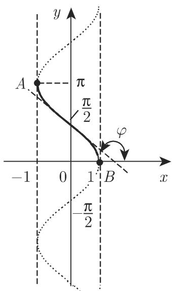
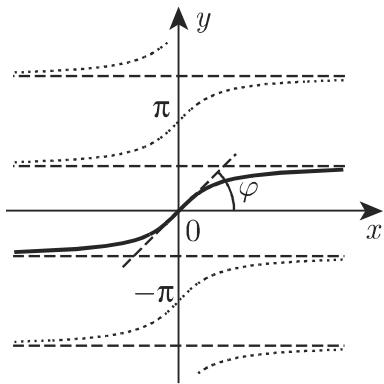

### 2.8 测圆或反三角函数

测圆函数或弧函数是三角函数的反函数。在一个明确定义中，三角函数的定义域可以分解成单调区间，在每个单调区间都有一个反函数，因此，存在无穷多个这样的区间，并在每个区间上可以定义它的反函数。为了加以区分，用指数 $k$ 表示相应的区间，显然在这些区间上每个反三角函数都单调。

#### 2.8.1 反三角函数的定义

现在针对正弦函数的反函数来说明如何定义反三角函数 (图 2.43), 反正弦函数通常记为 $\arcsin x$ . $y = \sin x$ 的定义域可以分解成单调区间 $k\pi - \frac{\pi}{2} \leqslant x \leqslant k\pi + \frac{\pi}{2}$ , $k = 0, \pm 1, \pm 2, \dots$ .

曲线 $y = \sin x$ 沿直线 $y = x$ 反射得到其反函数

$$
y = \operatorname{arc} _ {k} \sin x\tag{2.140a}
$$

曲线, 其中定义域和值域分别为

$-1 \leqslant x \leqslant +1$ 和 $k\pi - \frac{\pi}{2} \leqslant y \leqslant k\pi + \frac{\pi}{2}$ ，其中 $k = 0, \pm 1, \pm 2, \cdots$ . (2.140b) $y = \operatorname{arc}_{k} \sin x$ 亦即 $x = \sin y$ .

类似地, 可以得到其他反三角函数, 如图 2.44\~图 2.46 所示, 这些反函数的定义域和值域见表 2.6.

  
图2.44

图2.43  
  
图2.45

  
图2.46

表 2.6 反三角函数的定义域和值域

<table><tr><td>反函数</td><td>定义域</td><td>值域</td><td>具有相同意义的三角函数</td></tr><tr><td> $\left. \begin{array}{l} \arcsin \\ y = \operatorname{arc}_{k} \sin x \end{array} \right\}$ </td><td> $-1 \leqslant x \leqslant 1$ </td><td> $k\pi - \frac{\pi}{2} \leqslant y \leqslant k\pi + \frac{\pi}{2}$ </td><td> $x = \sin y$ </td></tr><tr><td> $\left. \begin{array}{l} \arccos \\ y = \operatorname{arc}_{k} \cos x \end{array} \right\}$ </td><td> $-1 \leqslant x \leqslant 1$ </td><td> $k\pi \leqslant y \leqslant (k+1)\pi$ </td><td> $x = \cos y$ </td></tr><tr><td> $\left. \begin{array}{l} \arctan \\ y = \operatorname{arc}_{k} \tan x \end{array} \right\}$ </td><td> $-\infty < x < \infty$ </td><td> $k\pi - \frac{\pi}{2} < y < k\pi + \frac{\pi}{2}$ </td><td> $x = \tan y$ </td></tr><tr><td> $\left. \begin{array}{l} \operatorname{arccot} \\ y = \operatorname{arc}_{k} \cot x \end{array} \right\}$ </td><td> $-\infty < x < \infty$ </td><td> $k\pi < y < (k+1)\pi$ </td><td> $x = \cot y$ </td></tr></table>

#### 2.8.2 约化为主值

当 $k = 0$ 时, 在弧函数的定义域中有所谓的主值, 通常用不含指标的记号表示, 如 $\arcsin x \equiv \operatorname{arc}_0 \sin x$ . 图2.47给出了反三角函数的主值. 不同反函数的值可以利用主值经如下公式计算:

$$
\operatorname{arc} _ {k} \sin x = k \pi + (- 1) ^ {k} \arcsin x;\tag{2.141}
$$

$$
\operatorname{arc} _ {k} \cos x = {\left\{ \begin{array}{l l} {{(k + 1)   \pi - \arccos x,}} & {{k \text {为奇数},}} \\ {{k \pi + \arccos x,}} & {{k \text {为偶数};}} \end{array} \right.}\tag{2.142}
$$

$$
\operatorname{arc} _ {k} \tan x = k \pi + \arctan x;\tag{2.143}
$$

$$
\operatorname{arc} _ {k} \cot x = k \pi + \operatorname{arc} \cot x.\tag{2.144}
$$

  
图2.47

■ A: $\arcsin 0 = 0$ , $\operatorname{arc}_k \sin 0 = k\pi$ .

■ B: $\operatorname{arccot}1=\frac{\pi}{4},\operatorname{arc}_{k}\cot1=\frac{\pi}{4}+k\pi.$

■ $\mathbf{C}$ : $\arccos \frac{1}{2} = \frac{\pi}{3},\mathrm{arc}_k\cos \frac{1}{2} = \left\{ \begin{array}{ll} - \frac{\pi}{3} +(k + 1)\pi , & k\text{为奇数},\\  \frac{\pi}{3} +k\pi , & k\text{为偶数}. \end{array} \right.$

注 计算器给出的是反三角函数的主值.

#### 2.8.3 主值间的关系

$$
\begin{array}{c} \arcsin x = \frac {\pi}{2} - \arccos x = \arctan \frac {x}{\sqrt {1 - x ^ {2}}} \\ = \left\{ \begin{array}{l l} - \arccos \sqrt {1 - x ^ {2}} & (- 1 \leqslant x \leqslant 0), \\ \arccos \sqrt {1 - x ^ {2}} & (0 \leqslant x \leqslant 1), \end{array} \right. \\ \arccos x = \frac {\pi}{2} - \arcsin x = \operatorname{arccot} \frac {x}{\sqrt {1 - x ^ {2}}} \end{array}\tag{2.145}
$$

$$
= \left\{ \begin{array}{l l} \pi - \arcsin \sqrt {1 - x ^ {2}} & (\pi - 1 \leqslant x \leqslant 0), \\ \arcsin \sqrt {1 - x ^ {2}} & (0 \leqslant x \leqslant 1), \end{array} \right.\tag{2.146}
$$

$$
\arctan x = \frac {\pi}{2} - \operatorname{arccot} x = \arcsin \frac {x}{\sqrt {1 + x ^ {2}}},\tag{2.147}
$$

$$
\arctan x = \left\{ \begin{array}{l l} \operatorname{arccot} \frac {1}{x} - \pi & (x <   0) \\ \operatorname{arccot} \frac {1}{x} & (x > 0) \end{array} \right. = \left\{ \begin{array}{l l} - \arccos \frac {1}{\sqrt {1 + x ^ {2}}} & (x \leqslant 0), \\ \arccos \frac {1}{\sqrt {1 + x ^ {2}}} & (x \geqslant 0), \end{array} \right.\tag{2.148}
$$

$$
\operatorname{arccot} x = \frac {\pi}{2} - \arctan x = \arccos \frac {x}{\sqrt {1 + x ^ {2}}},\tag{2.149}
$$

$$
\operatorname{arccot} x = \left\{ \begin{array}{l l} \arctan {\frac {1}{x}} + \pi & (x <   0) \\ \arctan {\frac {1}{x}} & (x > 0) \end{array} \right. = \left\{ \begin{array}{l l} \pi - \arcsin {\frac {1}{\sqrt {1 + x ^ {2}}}} & (x \leqslant 0), \\ \arcsin {\frac {1}{\sqrt {1 + x ^ {2}}}} & (x \geqslant 0). \end{array} \right.\tag{2.150}
$$

#### 2.8.4 负角公式

$$
\arcsin (- x) = - \arcsin x,\tag{2.151}
$$

$$
\arctan (- x) = - \arctan x,\tag{2.152}
$$

$$
\arccos (- x) = \pi - \arccos x,\tag{2.153}
$$

$$
\operatorname{arccot} (- x) = \pi - \operatorname{arccot} x.\tag{2.154}
$$

#### 2.8.5 arcsin x与arcsin y的和与差

(2.155a)

$$
\begin{array}{r l} & {\arcsin x + \arcsin y} \\ & {= \arcsin \left(x \sqrt {1 - y ^ {2}} + y \sqrt {1 - x ^ {2}}\right) \quad (x y \leqslant 0 \text {或} x ^ {2} + y ^ {2} \leqslant 1)} \\ & {= \pi - \arcsin \left(x \sqrt {1 - y ^ {2}} + y \sqrt {1 - x ^ {2}}\right) \quad (x > 0, y > 0, x ^ {2} + y ^ {2} > 1)} \\ & {(x <   0, y <   0, x ^ {2} + y ^ {2} > 1)} \\ & {= - \pi - \arcsin \left(x \sqrt {1 - y ^ {2}} + y \sqrt {1 - x ^ {2}}\right) \quad (x <   0, y <   0, x ^ {2} + y ^ {2} > 1)} \\ & {\arcsin x - \arcsin y} \\ & {= \arcsin \left(x \sqrt {1 - y ^ {2}} - y \sqrt {1 - x ^ {2}}\right) \quad (x y \geqslant 0 \text {或} x ^ {2} + y ^ {2} \leqslant 1)} \\ & {= \pi - \arcsin \left(x \sqrt {1 - y ^ {2}} - y \sqrt {1 - x ^ {2}}\right) \quad (x > 0, y <   0, x ^ {2} + y ^ {2} > 1)} \end{array}\tag{2.155b}
$$

(2.155c)

(2.156a)

(2.156b)

$$
= - \pi - \arcsin \left(x \sqrt {1 - y ^ {2}} - y \sqrt {1 - x ^ {2}}\right) \quad (x <   0, y > 0, x ^ {2} + y ^ {2} > 1).\tag{2.156c}
$$

#### 2.8.6 arccos x与arccos y的和与差

$$
\begin{array}{l} \arccos x + \arccos y \\ = \arccos \left(x y - \sqrt {1 - x ^ {2}} \sqrt {1 - y ^ {2}}\right) (x + y \geqslant 0) \\ = 2 \pi - \arccos \left(x y - \sqrt {1 - x ^ {2}} \sqrt {1 - y ^ {2}}\right) (x + y <   0). \end{array}\tag{2.157a}
$$

(2.157b)

$$
= - \arccos \left(x y + \sqrt {1 - x ^ {2}} \sqrt {1 - y ^ {2}}\right) \quad (x \geqslant y)\tag{2.158a}
$$

$$
= \arccos \left(x y + \sqrt {1 - x ^ {2}} \sqrt {1 - y ^ {2}}\right) (x <   y).\tag{2.158b}
$$

#### 2.8.7 arctan x与arctan y的和与差

$$
\arctan x + \arctan y = \arctan {\frac {x + y}{1 - x y}} (x y <   1)\tag{2.159a}
$$

$$
= \pi + \arctan {\frac {x + y}{1 - x y}} (x > 0, x y > 1)\tag{2.159b}
$$

$$
= - \pi + \arctan \frac {x + y}{1 - x y} (x <   0, x y > 1).\tag{2.159c}
$$

$$
\arctan x - \arctan y = \arctan \frac {x - y}{1 + x y} (x y > - 1)\tag{2.160a}
$$

$$
= \pi + \arctan {\frac {x - y}{1 + x y}} (x > 0, x y <   - 1)\tag{2.160b}
$$

$$
= - \pi + \arctan \frac {x - y}{1 + x y} (x <   0, x y <   - 1).\tag{2.160c}
$$

#### 2.8.8 arcsin x,arcos x及arctan x间的特殊关系

$$
2 \arcsin x = \arcsin \left(2 x \sqrt {1 - x ^ {2}}\right) \quad \left(| x | \leqslant \frac {1}{\sqrt {2}}\right)\tag{2.161a}
$$

$$
= \pi - \arcsin \left(2 x \sqrt {1 - x ^ {2}}\right) \quad \left(\frac {1}{\sqrt {2}} <   x \leqslant 1\right)\tag{2.161b}
$$

$$
= - \pi - \arcsin \left(2 x \sqrt {1 - x ^ {2}}\right) \quad \left(- 1 \leqslant x <   - \frac {1}{\sqrt {2}}\right)\tag{2.161c}
$$

$$
2 \arccos x = \arccos (2 x ^ {2} - 1) \quad (0 \leqslant x \leqslant 1)\tag{2.162a}
$$

$$
= 2 \pi - \arccos (2 x ^ {2} - 1) \quad (- 1 \leqslant x <   0).\tag{2.162b}
$$

$$
2 \arctan x = \arctan {\frac {2 x}{1 - x ^ {2}}} \quad (| x | <   1)\tag{2.163a}
$$

$$
= \pi + \arctan {\frac {2 x}{1 - x ^ {2}}} (x > 1)\tag{2.163b}
$$

$$
= - \pi + \arctan {\frac {2 x}{1 - x ^ {2}}} (x <   - 1).\tag{2.163c}
$$

$$
\cos (n \arccos x) = T _ {n} (x) \quad (n \geqslant 1),\tag{2.164}
$$

其中的 $n \geqslant 1$ 也可能为分数,

$$
T _ {n} (x) = \frac {(x + \sqrt {x ^ {2} - 1}) ^ {n} + (x - \sqrt {x ^ {2} - 1}) ^ {n}}{2}.\tag{2.165}
$$

对任意整数 $n, T_n(x)$ 是关于 $x$ 的多项式 (切比雪夫多项式). 关于切比雪夫多项式的性质参见第 1283 页 19.6.3.
