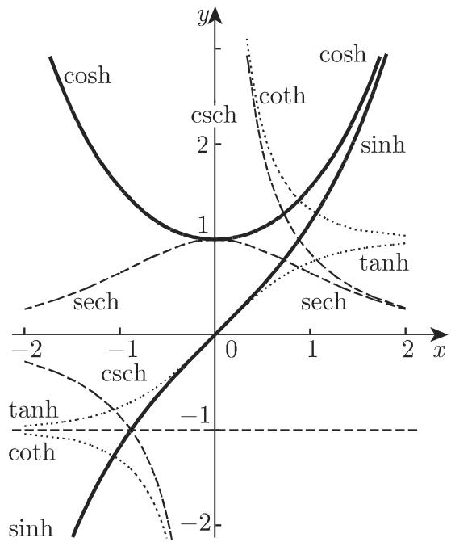
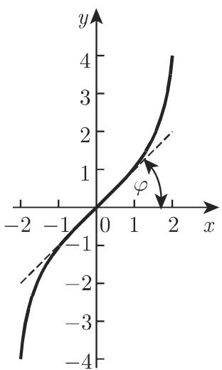
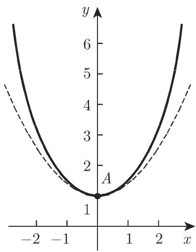

### 2.9 双曲函数

#### 2.9.1 双曲函数的定义

双曲正弦、双曲余弦、双曲正切定义如下：

$$
\sinh x = \frac {\mathrm{e} ^ {x} - \mathrm{e} ^ {- x}}{2},\tag{2.166}
$$

$$
\cosh x = \frac {\mathrm{e} ^ {x} + \mathrm{e} ^ {- x}}{2},\tag{2.167}
$$

$$
\tanh x = \frac {\mathrm{e} ^ {x} - \mathrm{e} ^ {- x}}{\mathrm{e} ^ {x} + \mathrm{e} ^ {- x}}.\tag{2.168}
$$

几何定义 (参见第 172 页 3.1.2.2) 与三角函数类似.

双曲余切、双曲正割和双曲余割定义成如上相应函数的倒数：

$$
\coth x = \frac {1}{\tanh x} = \frac {\mathrm{e} ^ {x} + \mathrm{e} ^ {- x}}{\mathrm{e} ^ {x} - \mathrm{e} ^ {- x}},\tag{2.169}
$$

$$
\operatorname{sech} x = \frac {1}{\cosh x} = \frac {2}{\mathrm{e} ^ {x} + \mathrm{e} ^ {- x}},\tag{2.170}
$$

$$
\operatorname{csch} x = \frac {1}{\sinh x} = \frac {2}{\mathrm{e} ^ {x} - \mathrm{e} ^ {- x}}.\tag{2.171}
$$

双曲函数曲线的形状如图 2.48\~图 2.52 所示.

  
图2.48

  
图2.49

  
图2.50

#### 2.9.2 双曲函数的图示

2.9.2.1 双曲正弦

$y = \sinh x$ (2.166) 是严格单调递增的奇函数, 值域为 $-\infty$ 到 $+\infty$ (图 2.49). 原点既为对称中心, 又为拐点, 且此处切线的倾斜角 $\varphi = \frac{\pi}{4}$ , 无渐近线.

2.9.2.2 双曲余弦

$y = \cosh x$ (2.167) 为偶函数, 若 $x < 0$ , 函数值从 $+\infty$ 到 1 严格单调递减, 若 $x > 0$ , 函数值从 1 到 $+\infty$ 严格单调递增 (图 2.50), 当 $x = 0$ 时, 取最小值 1 (点

$A(0,1)$ ; 无渐近线. 曲线关于 y 轴对称, 且恒位于二次抛物曲线 $y = 1 + \frac{x^{2}}{2}$ (虚线) 的上方. 因为函数表现为一条悬链曲线, 因此该曲线也称为悬链线(参见第 139 页 2.15.1).

2.9.2.3 双曲正切

$y = \tanh x$ (2.168) 为奇函数, 在 $-\infty$ 到 $+\infty$ 上, 函数从 -1 到 1 严格单调递增 (图 2.51). 原点既为对称中心, 又为拐点, 且此处切线的倾斜角 $\varphi = \frac{\pi}{4}$ , 渐近线为 $y = \pm 1$ .

  
图2.51

  
图2.52

2.9.2.4 双曲余切

$y = \coth x$ (2.169) 为奇函数, 在 $x = 0$ 处不连续 (图2.52). 当 $-\infty < x < 0$ 时, 函数从-1到 $-\infty$ 严格单调递减; 当 $0 < x < +\infty$ 时, 函数从 $+\infty$ 到1严格单调递减. 函数无拐点和极值, 渐近线为 $x = 0$ 和 $y = \pm 1$ .

#### 2.9.3 有关双曲函数的重要公式

双曲函数之间存在着与三角函数之间类似的关系, 利用双曲函数的定义可以直接证明接下来的公式成立. 另外, 由 (2.199)\~(2.206), 考虑到当自变量为复数时这些函数的定义和关系, 可以利用已知的三角函数公式计算它们.

2.9.3.1 单变量双曲函数

$$
\cosh^ {2} x - \sinh^ {2} x = 1,\tag{2.172}
$$

$$
\coth^ {2} x - \operatorname{csch} ^ {2} x = 1,\tag{2.173}
$$

$$
\operatorname{sech} ^ {2} x + \tanh ^ {2} x = 1,\tag{2.174}
$$

$$
\tanh x \cdot \coth x = 1,\tag{2.175}
$$

$$
\frac {\sinh x}{\cosh x} = \tanh x,\tag{2.176}
$$

$$
\frac {\cosh x}{\sinh x} = \coth x.\tag{2.177}
$$

2.9.3.2 某一双曲函数用具有相同自变量的另一个双曲函数的表示

相应公式见表 2.7.

表 2.7 $x > 0$ 时, 具有相同自变量的两双曲函数间的关系

<table><tr><td></td><td> $\sinh x$ </td><td> $\cosh x$ </td><td> $\tanh x$ </td><td> $\coth x$ </td></tr><tr><td> $\sinh x$ </td><td>-</td><td> $\sqrt{\cosh^2 x - 1}$ </td><td> $\frac{\tanh x}{\sqrt{1 - \tanh^2 x}}$ </td><td> $\frac{1}{\sqrt{\coth^2 x - 1}}$ </td></tr><tr><td> $\cosh x$ </td><td> $\sqrt{\sinh^2 x + 1}$ </td><td>-</td><td> $\frac{1}{\sqrt{1 - \tanh^2 x}}$ </td><td> $\frac{\coth x}{\sqrt{\coth^2 x - 1}}$ </td></tr><tr><td> $\tanh x$ </td><td> $\frac{\sinh x}{\sqrt{\sinh^2 x + 1}}$ </td><td> $\frac{\sqrt{\cosh^2 x - 1}}{\cosh x}$ </td><td>-</td><td> $\frac{1}{\coth x}$ </td></tr><tr><td> $\coth x$ </td><td> $\frac{\sqrt{\sinh^2 x + 1}}{\sinh x}$ </td><td> $\frac{\cosh x}{\sqrt{\cosh^2 x - 1}}$ </td><td> $\frac{1}{\tanh x}$ </td><td>-</td></tr></table>

2.9.3.3 负角公式

$$
\sinh (- x) = - \sinh x,\tag{2.178}
$$

$$
\tanh (- x) = - \tanh x,\tag{2.179}
$$

$$
\cosh (- x) = \cosh x,\tag{2.180}
$$

$$
\coth (- x) = - \coth x.\tag{2.181}
$$

2.9.3.4 两自变量和与差的双曲函数(加法定理)

$$
\sinh (x \pm y) = \sinh x \cosh y \pm \cosh x \sinh y,\tag{2.182}
$$

$$
\cosh (x \pm y) = \cosh x \cosh y \pm \sinh x \sinh y,\tag{2.183}
$$

$$
\tanh (x \pm y) = \frac {\tanh x \pm \tanh y}{1 \pm \tanh x \tanh y},\tag{2.184}
$$

$$
\coth (x \pm y) = \frac {1 \pm \coth x \coth y}{\coth x \pm \coth y}.\tag{2.185}
$$

2.9.3.5 倍角的双曲函数

$$
\sinh 2 x = 2 \sinh x \cosh x,\tag{2.186}
$$

$$
\cosh 2 x = \sinh^ {2} x + \cosh^ {2} x,\tag{2.187}
$$

$$
\tanh 2 x = \frac {2 \tanh x}{1 + \tanh ^ {2} x},\tag{2.188}
$$

$$
\coth 2 x = \frac {1 + \coth^ {2} x}{2 \coth x}.\tag{2.189}
$$

2.9.3.6 双曲函数的棣莫弗公式

$$
(\cosh x \pm \sinh x) ^ {n} = (\mathrm{e} ^ {\pm x}) ^ {n} = \mathrm{e} ^ {\pm n x} = \cosh n x \pm \sinh n x.\tag{2.190}
$$

2.9.3.7 半角的双曲函数

$$
\sinh {\frac {x}{2}} = \pm \sqrt {\frac {1}{2} (\cosh x - 1)},\tag{2.191}
$$

$$
\cosh {\frac {x}{2}} = \sqrt {\frac {1}{2} (\cosh x + 1)},\tag{2.192}
$$

当 $x > 0$ 时, (2.191) 中平方根的符号为正; 当 $x < 0$ 时, 符号为负.

$$
\tanh {\frac {x}{2}} = \frac {\cosh x - 1}{\sinh x} = \frac {\sinh x}{\cosh x + 1},\tag{2.193}
$$

$$
\coth {\frac {x}{2}} = \frac {\sinh x}{\cosh x - 1} = \frac {\cosh x + 1}{\sinh x}.\tag{2.194}
$$

2.9.3.8 双曲函数的和与差

$$
\sinh x \pm \sinh y = 2 \sinh {\frac {x \pm y}{2}} \cosh {\frac {x \mp y}{2}},\tag{2.195}
$$

$$
\cosh x + \cosh y = 2 \cosh {\frac {x + y}{2}} \cosh {\frac {x - y}{2}},\tag{2.196}
$$

$$
\cosh x - \cosh y = 2 \sinh \frac {x + y}{2} \sinh \frac {x - y}{2},\tag{2.197}
$$

$$
\tanh x \pm \tanh y = \frac {\sinh (x \pm y)}{\cosh x \cosh y}.\tag{2.198}
$$

2.9.3.9 复角 $z$ 的双曲函数与三角函数间的关系

$$
\sin z = - \mathrm{i} \sinh \mathrm{i} z,\tag{2.199}
$$

$$
\cos z = \cosh \mathrm{i} z,\tag{2.200}
$$

$$
\tan z = - \mathrm{i} \tanh \mathrm{i} z,\tag{2.201}
$$

$$
\cot z = \mathrm{i} \coth \mathrm{i} z,\tag{2.202}
$$

$$
\sinh z = - \mathrm{i} \sin \mathrm{i} z,\tag{2.203}
$$

$$
\cosh z = \cos \mathrm{i} z,\tag{2.204}
$$

$$
\tanh z = - \mathrm{i} \tan \mathrm{i} z,\tag{2.205}
$$

$$
\coth z = \mathrm{icot} \mathrm{i} z.\tag{2.206}
$$

通过把 $\sin \alpha$ 代换成 $i\sinh x$ , 把 $\cos \alpha$ 代换成 $\cosh x$ , 利用相应的三角函数关系, 可以得到关于 $x$ 或 $ax$ 但不能得到 $ax + b$ 的双曲函数间的关系.

■ A: $\cos^{2}\alpha + \sin^{2}\alpha = 1$ , $\cosh^{2}x + i^{2}\sinh^{2}x = 1$ 或 $\cosh^{2}x - \sinh^{2}x = 1$ .

■ B: $\sin 2\alpha = 2\sin \alpha \cos \alpha$ ，i sinh $2x = 2\mathrm{i}\sinh x\cosh x$ 或

$\sinh 2x = 2 \sinh x \cosh x.$
