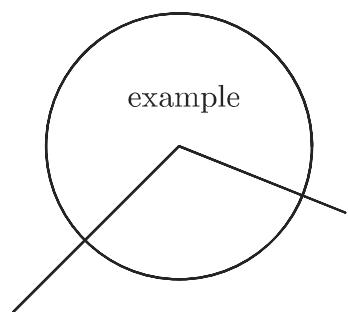
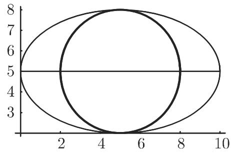
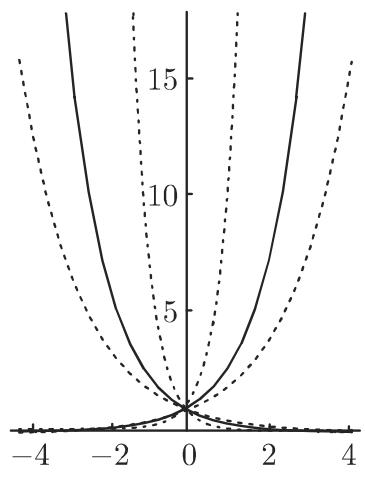
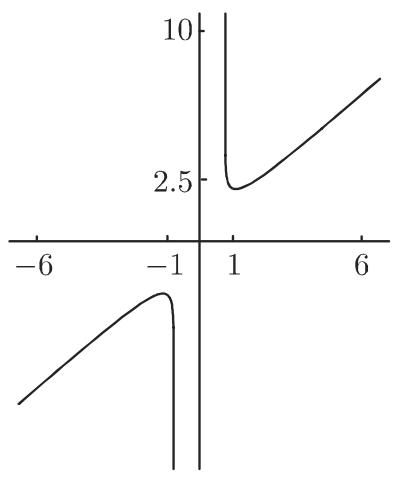
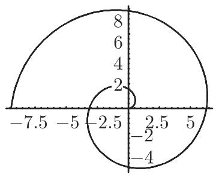
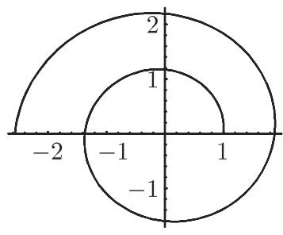
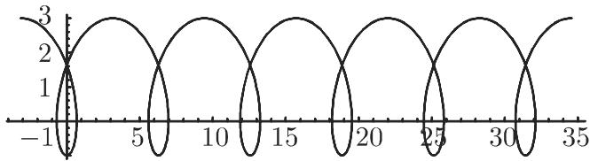
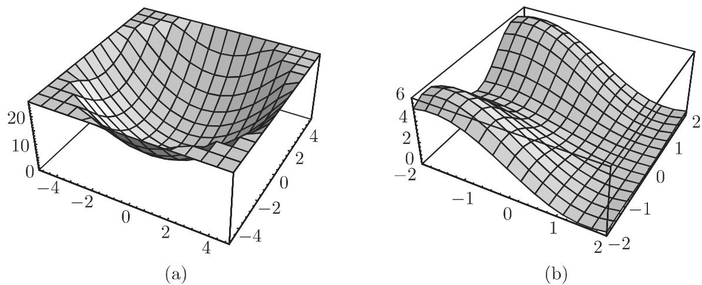
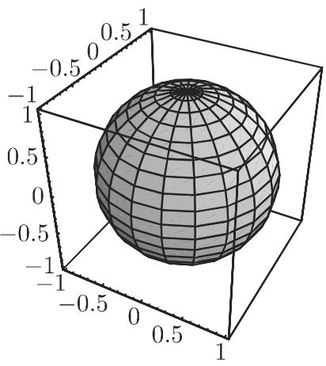

### 20.4 用Mathematica绘图

通过提供三维空间中诸如函数、空间曲线和曲面等数学关系的图形表示程序，现代计算机代数系统为结合和处理尤其是分析、向量演算和微分儿何中的公式提供了广阔可能性，并且为工程设计提供了巨大帮助．绘图是 Mathematica 的一项专长

#### 20.4.1 基本图形元素

Mathematica 由内置图形基元构建图形对象这些基元是诸如点 (Point)、线(Line) 和多边形 (Polygon) 这种对象，以及这些对象的诸如粗细度和颜色这种性质

Mathematica 对千规定绘图环境以及应该如何表示图形对象具有多种选项

使用命令 $\mathtt { G r a p h i c s } [ l i s t ]$ （其中 $l i s t$ 是图形基元的一个列表）， Mathematica调用从列出的对象生成一个图这个对象列表可以遵从有关图像显示的一列选项．

输入

$$
I n [ 1 ] := g = \text { Graphics } [ \{\text { Line } [ \{\{0, 0 \}, \{5, 5 \}, \{1 0, 3 \} \} ], \text { Circle } [ \{5, 5 \}, 4 ],\tag{20.37a}
$$

$$
\begin{array}{l} \text {Text[Style["Example","Helvetica",Bold,25],\{5,6\}]} \}, \\ \text {AspectRatio->Automatic]} \end{array}\tag{20.37b}
$$

就从以下元素构建了一个图

a) 从点 (0, 0) 出发穿过点 (5, 5) 到点 (10, 3) 画两线段组成的折线．

b) (5,5) 为圆心、 为半径画圆

c) 以粗体 Helvetica 字体写入文字内容 “Example” （文字内容的显示以参考点(5,6) 为中心）．

调用命令 Show[g], Mathematica 则显示这个图形（图 20.1)

  
20.1

可以预先指定一些选项此处的选项 AspectRatio 是为 Automatic 所设的．

Mathematica 以缺省方式制作图形的高宽比为 1: GoldenRatio （例如见第258 3.5.2.3,3.) ．它相应千沿 方向的长度与沿 方向的长度之比 1:1/1.618 =1:0.618．按这一选项该圆将变形为一个椭圆选项值 Automatic 则确保该图像不变形．

#### 20.4.2 图形基元

20.14 列举了 Mathematica 提供的二维图形对象

20.14 二维图形对象

<table><tr><td>Point[{x, y}]</td><td>位置 x,y 处的点</td></tr><tr><td>Line[{{x1,y1},{x2,y2},···}]</td><td>通过已知点的折线</td></tr><tr><td>Rectangle[{xlu,ylu},{xro,yro}]</td><td>填充具有给定的左下,右上坐标的矩形</td></tr><tr><td>Polygon[{{x1,y1},{x2,y2},···}]</td><td>填充具有给定顶点的多边形</td></tr><tr><td>Circle[{x,y},r]</td><td>以 x,y 为中心、半径为 r 的圆</td></tr><tr><td>Circle[{x,y},r,{α1,α2}]</td><td>以给定角为界限的圆弧</td></tr><tr><td>Circle[{x,y},{a,b}]</td><td>具有半轴 a 和 b 的椭圆</td></tr><tr><td>Circle[{x,y},{a,b},{α1,α2}]</td><td>椭圆弧</td></tr><tr><td>Disk[{x,y},r] Disk[{x,y},{a,b}]</td><td>填充圆或椭圆</td></tr><tr><td>Text[text,{x,y}]</td><td>以点 x,y 为中心写入文字</td></tr></table>

除这些对象外， Mathematica 还进一步提供了用千控制图像显示的基元，即图形命令它们规定应该如何表示图形对象这些命令列千表 20.15.

20.15 图形命令

<table><tr><td>PointSize[a]</td><td>描绘半径为a的一个点作为整个图像的一部分</td></tr><tr><td>AbsolutePointSize[b]</td><td>(以美制度量单位pt(0.3515mm))表示该点的绝对半径b</td></tr><tr><td>Thickness[a]</td><td>描绘相对粗细度为a的线</td></tr><tr><td>AbsoluteThickness[b]</td><td>描绘绝对粗细度为b(也以pt度量)的线</td></tr><tr><td>Dashing[{a1,a2,a3,...}]</td><td>描绘由一系列具有给定长度(按相对单位度量)的线条构成的线</td></tr><tr><td>AbsoluteDashing[{b1,b2,...}]</td><td>和前面一样但按绝对单位度量</td></tr><tr><td>GrayLevel[p]</td><td>指定灰度水平(p=0表示黑,p=1表示白)</td></tr></table>

还有规模广泛的颜色可供选择，但其定义这里不做讨论．

#### 20.4.3 图形选项

Mathematica 提供了多个图形选项它们对千整个图像的显示具有影响20.16 给出了一批最重要的命令．至千详细的解释，参见 [20.7] [20.11].

20.16 一些图形选项  
```txt
AspectRatio -> w 设置高宽比 w. Automatic, 由绝对坐标确定 w;
默认设置为 w = 1 : GoldenRatio
Axes -> True 画坐标轴
Axes -> False 不画坐标轴
Axes -> {True, False} 仅显示 x 轴
Frame -> True 显示框
GridLines -> Automatic 显示网格线
AxesLabel -> {x_symbol, y_symbol} 以给定符号表示轴
Ticks -> Automatic 自动表示刻度标记; 使用None它们将被禁止
Ticks -> {{x₁, x₂, …}, {y₁, y₂, …}} 将刻度标记置于给定的节点处
```

#### 20.4.4 图形表示的句法

20.4.4.1 构建图形对象

如果图形对象是从基元构建，那么首先应以形式

$$
\{o b j e c t _ {1}, o b j e c t _ {2}, \dots \}\tag{20.38a}
$$

给出一列对应的对象及其全部定义，其中对象本身可以是图形对象的列表．例如，设对象

$$
I n [ 1 ] := o 1 = \{\text {Circle} [ \{5, 5 \}, \{5, 3 \} ], \text {Line} [ \{\{0, 5 \}, \{1 0, 5 \} \} ] \}
$$

千是如同在图 20.1 中那样，相应千它

$$
I n [ 2 ] := o 2 = \{\text { Circle } [ \{5, 5 \}, 3 ] \}
$$

如果一个图形对象，例如 $o 2 ,$ ，是由某些图形命令规定，那么它应该按相应的命令

$$
I n [ 3 ] := o 3 = \{\text { Thickness } [ 0. 0 1 ], o 2 \}
$$

写入一个列表

这个命令对千对应花括号中的所有对象都成立，也对嵌套对象成立，但对列表中花括号以外的对象不成立．

从生成对象可以定义两个不同的图形列表：

$$
I n [ 4 ] := g 1 = \text { Graphics } [ \{o 1, o 2 \} ]; g 2 = \text { Graphics } [ \{o 1, o 3 \} ]
$$

它们仅在第二个对象处表明圆的粗细度不同调用命令

$$
\operatorname{Show} [ g 1 ] \quad \text {和} \quad \operatorname{Show} [ g 2, \text {Axes} \rightarrow \text {True} ]\tag{20.38b}
$$

给出图 20.2 中表示的图像．

  
(a)

  
(b)  
20.2

在调用图 20.2b 中的图像时，选项 Axes-> True 被激活．这将导致描绘其上带有 Mathematica 选取的标记和相应刻度的轴

20.4.4.2 函数的图形表示

Mathematica 具有供函数图形表示的特殊命令应用

$$
\mathbf {P l o t} [ \mathbf {f} [ x ], \{x, x _ {m i n}, x _ {m a x} \} ]\tag{20.39}
$$

函数 的图形被表示在 $x = x _ { m i n }$ 与 $x = x _ { m a x }$ 之间的定义域上． Mathematica过内部算法产生一个函数表，接着利用图形基元从这个表产生图形．

·如果要把函数 $x \mapsto \sin 2 x$ 的图形表示在－加与加之间的定义域上，那么输入是

$$
I n [ 1 ] := \operatorname{Plot} [ \operatorname{Sin} [ 2 x ], \{x, - 2 \mathrm{Pi}, 2 \mathrm{Pi} \} ]
$$

Mathematica 产生的图形显示在图 20.3

  
20.3

显然 Mathematica 在描绘图形时使用了在第 1357 20.4.1 中提到的某些默认图形选项因此，坐标轴是被自动绘制的，它们的刻度由相应的 的值所标记在这个例子中，可以看到默认的 AspectRatio 的影响．整个宽与整个高之比是1:0.618.

使用命令 InputForm[％]可以显示图形对象的全部图像．对千前面的例子我们有

```txt
Graphics[{{}, {}, {Directive[Opacity[1.], RGBColor[0.368417, 0.506779, 0.709798], AbsoluteThickness[1.6]], Line[{{-6.283185050723043, 2.5645654335783057*^{-7}}, ..., {6.283185050723043, -2.5645654335783057*^{-7}}}], {DisplayFunction->Identity, AspectRatio->GoldenRatio(-1), Axex->{True, True}, AxesLabel->{None, None}AxesOrigin->{0, 0}, DisplayFunction :> Identity, Frame->{{False, False}, {False, False}}, FrameLabel->{{None, None}, {None, None}}, FrameTicks->{{Automatic, Automatic}, {Automatic, Automatic}}, GridLines->{None, None}, GridLinesStyle->Directive[GrayLevel[0.5, 0.4]], Method->{"DefaultBoundaryStyle" -> Automatic," ScalingFunctions" -> None}, PlotRange->{{-2 * Pi, 2 * Pi}, {-0.9999996654606427, 0.9999993654113022}}, PlotRangeClipping->True, PlotRangePadding->{{Scaled[0.02], Scaled[0.02]}, Scaled[0.05], Scaled[0.05]}}, Ticks->{Automatic, Automatic}}]
```

因此，图形对象由一些子列表组成．第一个子列表包含图形基元 Line （稍作修改），应用它内置算法将曲线上计算出来的点用线连起来．第二个子列表包含所给图形所需的选项这些是默认选项如果要在某个位置改变图像，那么在主输入后必须

Plot 命令中进行新的设置．应用

$$
I n [ 2 ] := \operatorname{Plot} [ \operatorname{Sin} [ 2 x ], \{x, - 2 \mathrm{Pi}, 2 \mathrm{Pi} \}, \text { AspectRatio } \rightarrow 1 ]\tag{20.40}
$$

图像将按等长的 轴和 轴描绘出来．

可以一个接一个地同时给出若干选项．输入

$$
\mathbf {P l o t} [ \{f _ {1} [ x ], f _ {2} [ x ], \dots \}, \{x, x _ {m i n}, x _ {m a x} \} ]\tag{20.41}
$$

将在同一个图形中显示不同的函数．依靠命令

$$
\mathbf {S h o w} [ p l o t, o p t i o n s ]\tag{20.42}
$$

早先的图像可以由其他选项进行更新．应用

$$
\text { Show } [ \text { GraphicsArray } [ l i s t ] ]\tag{20.43}
$$

(list 代表图形对象列表）可以将图像一个接一个地从上到下摆放出来，或者将它们安排成矩阵形式

#### 20.4.5 二维曲线

作为例子这里将展示讨论函数一章中的一系列曲线及其图像（参见第 612.1).

20.4.5.1 指数函数

Mathematica 用以下输入产生儿个指数函数（参见第 92 2.6.1) 的一族曲线（图 20.4(a)):

$$
\begin{array}{l} \text {In[1]} := \mathbf {f} [ x _ {-} ] := 2 ^ {\wedge} x; \mathbf {g} [ x _ {-} ] := 1 0 ^ {\wedge} x; \\ \text {In[2]} := \mathbf {h} [ x _ {-} ] := (1 / 2) ^ {\wedge} x; \mathbf {j} [ x _ {-} ] := (1 / \mathbf {E}) ^ {\wedge} x; \mathbf {k} [ x _ {-} ] := (1 / 1 0) ^ {\wedge} x \end{array}
$$

这些是所考虑的函数的定义．无需定义函数 $\mathrm { e } ^ { x }$ 因为它已被内置千 Mathematica中在第二步将产生以下图形：

$$
\begin{array}{r l}&I n [ 3 ] := p 1 = \mathsf {P l o t} [ \{\mathsf {f} [ x ], \mathsf {h} [ x ] \}, \{x, - 4, 4 \}, P l o t S t y l e {\rightarrow} \mathsf {D a s h i n g} [ \{0. 0 1, 0. 0 2 \} ] ]\\&I n [ 4 ] := p 2 = \mathsf {P l o t} [ \{\mathsf {E x p} [ x ], \mathsf {j} [ x ] \}, \{x, - 4, 4 \} ]\\&I n [ 5 ] := p 3 = \mathsf {P l o t} [ \{\mathsf {g} [ x ], \mathsf {k} [ x ] \}, \{x, - 4, 4 \},\\&\qquad \mathsf {P l o t S t y l e {\rightarrow}} \mathsf {D a s h i n g} [ \{0. 0 0 5, 0. 0 2, 0. 0 1, 0. 0 2 \} ] ]\end{array}
$$

可以由

$$
I n [ 6 ] := \text { Show } [ \{p 1, p 2, p 3 \}, \text { PlotRange } \rightarrow \{0, 1 8 \}, \text { AspectRatio } \rightarrow 1. 2 ]
$$

得到整个图像（图 20.4(a)).



  
20.4

这里没有讨论如何在曲线上书写文字的问题．用图形基元 Text 这是可以做到的．

20.4.5.2 函数 = x + Arcothx

考虑在第 120 2.10 讨论过的函数 Arcothx 的性质，可以用以下方式描绘函= x + Arcothx 的图形：

```autohotkey
In [1] := f1 = Plot[x + ArcCoth[x], {x, 1.000000000005, 7}]  
In [2] := f2 = Plot[x + ArcCoth[x], {x, -7, -1.000000000005}]  
In [3] := Show[{f1, f2}, PlotRange → {-10, 10}, AspectRatio → 1.2, Ticks → {{{-6, -6}, {-1, -1}, {1, 1}, {6, 6}}}, {{2.5, 2.5}, {10, 10}}}, AxesOrigin → 0, 0]
```

和— 的闭域邻内选取高精度的 值，是为了对所要求的 的值域得到足够大的函数值．结果显示在图 20.4(b) 中．

20.4.5.3 贝塞尔函数（参见第 743 页， 9.1.2.6, 2.)

调用

```erlang
In [1] := bj0 = Plot[{BesselJ[0, z], BesselJ[2, z],
    BesselJ[4, z]}], {z, 0, 10}, PlotLabel->
    TraditionalForm[{BesselJ[0, z], BesselJ[2, z], BesselJ[4, z]}] (20.44a)
In [2] := bj1 = Plot[{BesselJ[1, z], BesselJ[3, z],
```

$$
\begin{array}{l}\text {BesselJ[5,z]}, \{z, 0, 1 0 \}, \text {PlotLabel} \rightarrow\\\text {TraditionalForm} [ \{\text {BesselJ[1,z], BesselJ[3,z], BesselJ[5,z]} \} ] ]\end{array}\tag{20.44b}
$$

将产生贝塞尔函数 $J _ { n } ( z )$ 关千 $n = 0 , 2 , 4$ = l, 3, 的图形，然后调用

$$
I n [ 3 ] := \text { GraphicsRow } [ \{b j 0, b j 1 \} ]
$$

则将其接连显示在图 20.5 中．

  
(a)

  
20.5  
(b)

#### 20.4.6 参数形式曲线的绘图

Mathematica 有一个特殊的图形命令，利用它可以描绘出由参数形式给出的曲线的图像这个命令是

$$
\text {ParametricPlot} \left[ \left\{f _ {x} (t), f _ {y} (t) \right\}, \left\{t, t _ {1}, t _ {2} \right\} \right]\tag{20.45}
$$

它提供了在一个图形中显示多条曲线的可能性在命令中必须给出若干曲线的一个列表．利用选项 $\mathsf { A s p e c t R a t i o \_ l u t o m a t i c } _ { \mathsf { 1 } }$ Mathematica 以其自然形式显示曲线

20.6 中的参数曲线是阿基米德螺线（参见第 136 2.14.1) 和对数螺线（参见第 137 2.14.3)．它们的图像由输入

$$
\begin{array}{c} \text {In[1]} := \text {ParametricPlot} [ \{t   \text {Cos} [ t ], t   \text {Sin} [ t ] \}, \{t, 0, 3 \text {Pi} \}, \\ \text {AspectRatio->Automatic} ] \end{array}
$$

和

$$
\begin{array}{c} \text {In[2]} := \text {ParametricPlot} [ \{\text {Exp} [ 0. 1 t ] \text {Cos} [ t ], \text {Exp} [ 0. 1 t ] \text {Sin} [ t ] \}, \{t, 0, 3 \text {Pi} \}, \\ \text {AspectRatio->Automatic} ] \end{array}
$$

绘出．

  
(a)

  
(b)  
20.6

利用

$$
\begin{array}{r l} \text { In } [ 3 ] & := \text { ParametricPlot } [ \{t - 2 \text { Sin } [ t ], 1 - 2 \text { Cos } [ t ] \}, \{t, - \text { Pi }, 1 1 \text { Pi } \}, \\ & \text { AspectRatio } \to 0. 3 ] \end{array}
$$

将产生（图 20.7) 一条次摆线（参见第 132 2.13.2).

  
20.7

#### 20.4.7 曲面和空间曲线的绘图

Mathematica 提供了表示三维图形基元的可能性

与二维情形类似，应用不同的选项可以生成三维图形可以按不同的观点和从不同的视角表示和观察这一对象．同样在三维空间中表示曲而，即二元函数的图形表示是可能的而且有可能在三维空间中表示曲线例如当它们是以参数形式给定时关千三维图形基元的详细描述见 [20.5]．对千这些表示的引入类似千二维情形

20.4.7.1 曲面的图形表示

命令 Plot3D 就其基本形式而言需要一个二元函数的定义和这两个变元的定义域：

$$
\mathbf {P l o t 3 D} [ \mathsf {f} [ x, y ], \{x, x _ {a}, x _ {e} \}, \{y, y _ {a}, y _ {e} \} ]\tag{20.46}
$$

所有选项都有默认设置

·对千函数 $z = x ^ { 2 } + y ^ { 2 }$ ，输入

$$
I n [ 1 ] := \text { Plot3D } [ x ^ {2} + y ^ {2}, \{x, - 5, 5 \}, \{y, - 5, 5 \}, \text { PlotRange } > \{0, 2 5 \} ]
$$

我们得到图 20.8(a), 而图 20.8(b) 则是由命令

$$
I n [ 2 ] := \operatorname{Plot3D} \left[ (1 - \operatorname{Sin} [ x ]) (2 - \cos [ 2 y ]), \{x, - 2, 2 \}, \{y, - 2, 2 \} \right]
$$

产生的．

对千这个抛物面，选项 PlotRange 是按所要求的 值给定的，因为这个立体是= 25 时切割的．

  
20.8

20.4.7.2 3D 图形选项

3D 图形选项的数目庞大．表 20.17 中仅列举了少数儿个，其中已知的 2D 图形选项没有包括在内．它们可以在类似的意义下被应用．选项 ViewPoint 特别重要，利用它可以选取非常不同的观察视角

20.17 3D 图形选项

<div class="mineru-algorithm" style="white-space: pre-wrap; font-family:monospace;">
Boxed 默认设置是 True; 它描绘一个环绕曲面的三维框
HiddenSurface 设置曲面的不透明度; 默认设置是 True
ViewPoint 指定空间中的点  $(x, y, z)$ ，由此处观察曲面. 默认值是  $\{1.3, -2.4, 2\}$ 
Shading 默认设置是 True; 在曲面上加阴影; False 得到白色曲面
PlotRange 对于值 All 可以选择  $\{z_{a}, z_{e}\}, \{\{x_{a}, x_{e}\}, \{y_{a}, y_{e}\}, \{z_{a}, z_{e}\}\}$ . 默认是 Automatic
</div>

20.4.7.3 参数表示的三维对象

类似千 2D 图形，也可以描绘巾参数表示给出的三维对象．利用

$$
\mathbf {P a r a m e t r i c P l o t 3 D} [ \{f _ {x} [ t, u ], f _ {y} [ t, u ], f _ {z} [ t, u ] \}, \{t, t _ {a}, t _ {e} \}, \{u, u _ {a}, u _ {e} \} ]\tag{20.47}
$$

将描绘一个由参数给出的曲面，而用

$$
\mathbf {P a r a m e t r i c P l o t 3 D} \bigl [ \bigl \{f _ {x} [ t ], f _ {y} [ t ], f _ {z} [ t ] \bigr \}, \bigl \{t, t _ {a}, t _ {e} \bigr \} \bigr ]\tag{20.48}
$$

则生成一条由参数表示的三维曲线．

·图 20.9(a) 和图 20.9(b) 是用命令

$$
\begin{array}{r l} I n [ 3 ] & := \text {ParametricPlot3D} [ \{\text {Cos} [ t ] \text {Cos} [ u ], \text {Sin} [ t ] \text {Cos} [ u ], \text {Sin} [ u ] \}, \{t, 0, 2 \text {Pi} \} \\ & \quad \{u, - \text {Pi} / 2, \text {Pi} / 2 \} ] \\ I n [ 4 ] & := \text {ParametricPlot3D} [ \{\text {Cos} [ t ], \text {Sin} [ t ], t / 4 \}, \{t, 0, 2 0 \} ] \end{array} \tag {20.49a}
$$

描绘的．

  
(a)

  
(b)  
20.9

Mathematica 提供了更多的命令，利用它们可以生成密度图和轮廓图、条形图和扇形图，也可以生成不同类型的图的组合

·用 Mathematica 可以很容易地生成洛伦茨吸引子的图像（参见第 1153 17.2.4.3).

有一系列近期的发展，其中大部分没有展示在书中．人们可以轻松地构建一个GUI（图形用户界面）来利用该程序的交互功能大部分计算是自动并行的，但是像Parallelize ParallelMap, 为用户提供了创建他／她自己的并行程序这样的功能使用如 CUDALink, OpenCLFunctionLoad 等这样的功能可以（相对千其他语言）在一个非常高的层次上编程设计极其快速的图形卡．动态交互性工具的一个非常有用的例子是 Manipulate, 它将以最简单的实例向你展示一族曲线的参数依赖性．还应该提及在云中工作或使用树蓝派计算机 (Raspberry Pi, 它已得到 Mathematica的免费使用许可）．

（程钊译）

21 表 格
