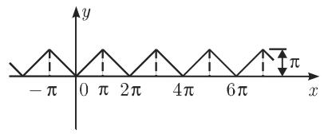
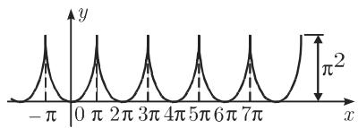
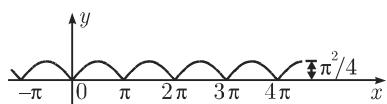
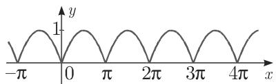
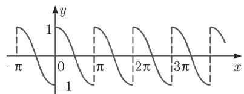
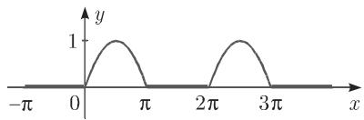

### 21.6 傅里叶级数

l. $y = x , 0 < x < 2 \pi$

$$
y = \pi - 2 \left(\frac {\sin x}{1} + \frac {\sin 2 x}{2} + \frac {\sin 3 x}{3} + \dots\right)
$$

2. $y = x , 0 \leqslant x \leqslant \pi$

$$
y = 2 \pi - x, \pi <   x \leqslant 2 \pi
$$

$$
y = \frac {\pi}{2} - \frac {4}{\pi} \left(\cos x + \frac {\cos 3 x}{3 ^ {2}} + \frac {\cos 5 x}{5 ^ {2}} + \dots\right)
$$

续表

3. $y = x , - \pi < x < \pi$

$$
y = 2 \left(\frac {\sin x}{1} - \frac {\sin 2 x}{2} + \frac {\sin 3 x}{3} - \dots\right)
$$

4. $y = x , - { \frac { \pi } { 2 } } \leqslant x \leqslant { \frac { \pi } { 2 } }$

$$
y = \pi - x, \frac {\pi}{2} \leqslant x \leqslant \frac {3 \pi}{2}
$$

$$
y = \frac {4}{\pi} \left(\sin x - \frac {\sin 3 x}{3 ^ {2}} + \frac {\sin 5 x}{5 ^ {2}} - \dots\right)
$$

5. $y = a \ , \ 0 < x < \pi$

$$
y = - a, \pi <   x <   2 \pi
$$

$$
y = \frac {4 a}{\pi} \left(\sin x + \frac {\sin 3 x}{3} + \frac {\sin 5 x}{5} + \dots\right)
$$

6. $y = 0 , 0 \leqslant x < \alpha$ 和 $\pi - \alpha < x \leqslant \pi + \alpha$ 和 $2 \pi - \alpha < x \leqslant 2 \pi$

$$
y = a, \alpha <   x <   \pi - \alpha
$$

$$
y = - a, \pi + \alpha <   x \leqslant 2 \pi - \alpha
$$

$$
\begin{array}{c} y = \frac {4 a}{\pi} \left(\cos \alpha \sin x + \frac {1}{3} \cos 3 \alpha \sin 3 x \right. \\ \left. + \frac {1}{5} \cos 5 \alpha \sin 5 x + \dots\right) \end{array}
$$

续表

7. $y = { \frac { a x } { \alpha } } , \quad - a \leqslant x \leqslant a$

$$
y = a, \quad \alpha \leqslant x \leqslant \pi - \alpha ,
$$

$$
y = \frac {a (\pi - x)}{\alpha}, \quad \pi - \alpha \leqslant x \leqslant \pi + \alpha ,
$$

$$
y = - a, \quad \pi + \alpha \leqslant x \leqslant 2 \pi - \alpha
$$

$$
\begin{array}{l} y = \frac {4}{\pi} \frac {a}{\alpha} \left(\sin \alpha \sin x + \frac {1}{3 ^ {2}} \sin 3 \alpha \sin 3 x \right. \\ \left. + \frac {1}{5 ^ {2}} \sin 5 \alpha \sin 5 x + \dots\right) \end{array}
$$

特别地，当 $\alpha { = } \frac { \pi } { 3 }$ 时， $y = { \frac { 6 { \sqrt { 3 } } a } { \pi ^ { 2 } } } \left( \sin { x } - { \frac { 1 } { 5 ^ { 2 } } } \sin { 5 x } + { \frac { 1 } { 7 ^ { 2 } } } \sin { 7 x } - { \frac { 1 } { 1 1 ^ { 2 } } } \sin { 1 1 x } + \cdot \cdot \cdot \right)$ 1

8. $y = x ^ { 2 } , \quad - \pi \leqslant x \leqslant \pi$

$$
y = \frac {\pi^ {2}}{3} - 4 \left(\frac {\cos x}{1} - \frac {\cos 2 x}{2 ^ {2}} + \frac {\cos 3 x}{3 ^ {2}} - \dots\right)
$$

9. $y = x ( \pi - x ) , \quad 0 \leqslant x \leqslant \pi$

$$
y = \frac {\pi^ {2}}{6} - \left(\frac {\cos 2 x}{1 ^ {2}} + \frac {\cos 4 x}{2 ^ {2}} + \frac {\cos 6 x}{3 ^ {2}} + \dots\right)
$$

IO. $y = x ( \pi - x ) , \quad 0 \leqslant x \leqslant \pi$

$$
y = (\pi - x) (2 \pi - x), \quad \pi \leqslant x \leqslant 2 \pi
$$

$$
y = \frac {8}{\pi} \left(\sin x + \frac {1}{3 ^ {3}} \sin 3 x + \frac {1}{5 ^ {3}} \sin 5 x + \dots\right)
$$

11. $y = \sin x$ , 0 :::;; x :::;;兀

$$
y = \frac {2}{\pi} - \frac {4}{\pi} \left(\frac {\cos 2 x}{1 \cdot 3} + \frac {\cos 4 x}{3 \cdot 5} + \frac {\cos 6 x}{5 \cdot 7} + \dots\right)
$$

续表

12. $y = \cos x , \quad 0 < x < \pi$

$$
y = \frac {4}{\pi} \left(\frac {2 \sin 2 x}{1 \cdot 3} + \frac {4 \sin 4 x}{3 \cdot 5} + \frac {6 \sin 6 x}{5 \cdot 7} + \dots\right)
$$

13. $y = \sin x , \quad 0 \leqslant x \leqslant \pi$

$$
y = 0, \quad \pi \leqslant x \leqslant 2 \pi
$$

$$
\begin{array}{c} y = \frac {1}{\pi} + \frac {1}{2} \sin x - \frac {2}{\pi} \left(\frac {\cos 2 x}{1 \cdot 3} + \frac {\cos 4 x}{3 \cdot 5} \right. \\ \left. + \frac {\cos 6 x}{5 \cdot 7} + \dots\right) \end{array}
$$

14. $y = \cos u x , \quad - \pi \leqslant x \leqslant \pi$

$$
\begin{array}{c} y = \frac {2 u \sin u \pi}{\pi} \bigg (\frac {1}{2 u ^ {2}} - \frac {\cos x}{u ^ {2} - 1} + \frac {\cos 2 x}{u ^ {2} - 4} \\ - \frac {\cos 3 x}{u ^ {2} - 9} + \dots \bigg) \end{array}
$$

(u 为任意非整数）

15. $y = \sin u x , \quad - \pi < x < \pi$

$$
y = \frac {2 \sin u \pi}{\pi} \left(\frac {\sin x}{1 - u ^ {2}} - \frac {2 \sin 2 x}{4 - u ^ {2}} + \frac {3 \sin 3 x}{9 - u ^ {2}} + \dots\right)
$$

(u 为任意非整数）

16. $y = x \cos x , \quad - \pi < x < \pi$

$$
y = - \frac {1}{2} \sin x + \frac {4 \sin 2 x}{2 ^ {2} - 1} - \frac {6 \sin 3 x}{3 ^ {2} - 1} + \frac {8 \sin 4 x}{4 ^ {2} - 1}
$$

续表

$$
1 7. \quad y = - \ln \left(2 \sin \frac {x}{2}\right), \quad 0 <   x \leqslant \pi
$$

$$
y = \cos x + \frac {1}{2} \cos 2 x + \frac {1}{3} \cos 3 x + \dots
$$

18. $y = \ln { \Big ( } 2 \cos { \frac { x } { 2 } } { \Big ) } , \quad 0 \leqslant x < \pi$

$$
y = \cos x - \frac {1}{2} \cos 2 x + \frac {1}{3} \cos 3 x - \dots
$$

19. $y = \frac { 1 } { 2 } \ln \cot \frac { x } { 2 } , \quad 0 < x < \pi$

$$
y = \cos x + \frac {1}{3} \cos 3 x + \frac {1}{5} \cos 5 x + \dots
$$
