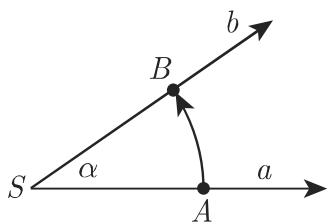
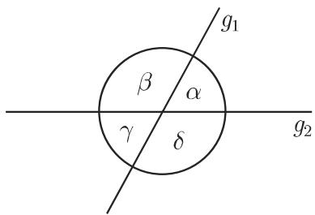

#### 3.1.1 基本概念

3.1.1.1 点、直线、射线、线段

1. 点和直线

点和直线在今天的数学中是不加定义的。它们之间的关系仅由公理确定。直线的图形可以想象成平面上一个点沿两个不同点之间的最短路径不改变方向移动所形成的一条轨迹。

一个点可以理解成两条直线的交.

2. 射线和线段

一条射线是一条直线上恰好位于给定点 O 一侧的点的集合, 包括这一点 O. 一条射线可以想象成从 O 出发的点沿直线不改变方向移动所形成的一条轨迹, 就像是一条发出的不改变方向的光束.

一条线段 $\overline{AB}$ 是位于一条直线上两个给定点 $A$ 和 $B$ 之间的点的集合, 包括点 $A$ 和 $B$ . 线段是平面上两点 $A$ 和 $B$ 之间的最短连接. 有向线段记作 $\overrightarrow{AB}$ , 其方向开始于 $A$ 终止于 $B$ .

3. 平行直线和正交直线

平行直线沿相同方向伸展; 它们没有公共点, 即它们既不相互离开也不相互接近, 没有任何交点. 两条直线 $g$ 和 $g'$ 平行记作 $g // g'$ .

正交直线在其相交处形成一个直角，即它们相互垂直.

正交与平行是两条直线的相互位置.

3.1.1.2 角

  
图3.1

1. 角的概念

一个角由在同一点 S 发出的两条射线 a 和 b 定义, 使得它们通过旋转可以彼此变换到另一条 (图 3.1). 如果 A 是射线 a 上的一点, B 在射线 b 上, 则图 3.1 所给方向的角可以用符号记作 $(a, b)$ 或 $\not\subset ASB$ , 或用希腊字母标记.

点 S 称为顶点, 射线 a 和 b 称为角的边.

在数学中, 一个角称为正的或负的取决于是逆时针旋转还是顺时针旋转. 将角 $\angle ASB$ 与角 $\angle BSA$ 进行区分是重要的. 实际上, $\angle ASB = -\angle BSA (0^{\circ} \leqslant \angle ASB \leqslant 180^{\circ})$ 或 $\angle ASB = 360^{\circ} - \angle BSA (180^{\circ} \leqslant \angle ASB \leqslant 360^{\circ})$ .

评论 在大地测量学中，旋转的正方向定义为顺时针方向 (参见第 192 页 3.2.2.1).

2. 角的名称

角依照它们的边的不同位置而具有不同的名称．表3.1给出的名称用于区间 $0^{\circ}\leqslant \alpha \leqslant 360^{\circ}$ 中的角 $\alpha$ (图3.2).

表 3.1 以度和弧度给出的角的名称

<table><tr><td>角的名称</td><td>度</td><td>弧度</td><td>角的名称</td><td>度</td><td>弧度</td></tr><tr><td>周(全)角</td><td> $\alpha = 360^{\circ}$ </td><td> $\alpha = 2\pi$ </td><td>直角</td><td> $\alpha = 90^{\circ}$ </td><td> $\alpha = \pi/2$ </td></tr><tr><td>凸角</td><td> $\alpha >180^{\circ}$ </td><td> $\pi < \alpha < 2\pi$ </td><td>锐角</td><td> $0^{\circ} < \alpha < 90^{\circ}$ </td><td> $0^{\circ} < \alpha < \pi/2$ </td></tr><tr><td>平角</td><td> $\alpha = 180^{\circ}$ </td><td> $\alpha = \pi$ </td><td>钝角</td><td> $90^{\circ} < \alpha < 180^{\circ}$ </td><td> $\pi/2 < \alpha < \pi$ </td></tr></table>

图3.2

3.1.1.3 两条相交直线间的夹角

在两条直线 $g_{1}, g_{2}$ 的交点处, 存在四个角 $\alpha, \beta, \gamma, \delta$ (图3.3). 可以区分出邻角、对顶角、余角和补角.

(1) 邻角 邻角是在两条直线的交点处具有一个公共顶点 S 的相邻的角，并且具有一条公共边；两条非公共边位于同一直线上，它们是由 S 发出的射线但方向相反，因此邻角之和等于 $180^{\circ}$ .

  
图3.3

■ 在图 3.3 中偶对 $(\alpha, \beta)$ , $(\beta, \gamma)$ , $(\gamma, \delta)$ 和 $(\alpha, \delta)$ 是邻角.

(2) 对顶角 对顶角是在两条直线的交点处相对的角, 具有同一顶点 $S$ 但没有公共边, 且相等. 它们与相同的邻角之和等于 $180^{\circ}$ .

■ 在图 3.3 中 $(\alpha, \gamma)$ 和 $(\beta, \delta)$ 是对顶角.

(3) 余角 两角之和等于 $90^{\circ}$ 的角互为余角.

(4) 补角 两角之和等于 $180^{\circ}$ 的角互为补角.

■ 在图 3.3 中角偶对 $(\alpha, \beta)$ 和 $(\gamma, \delta)$ 是补角.

3.1.1.4 截平行线所成的角偶对

用第三条直线 $g$ 截两条平行直线 $p_1, p_2$ 得到八个角 (图3.4). 除具有同一顶点 $S$ 的邻角和对顶角外, 还可以区分出具有不同顶点的交错角、同位角和相对角 (同旁内角和同旁外角).

  
图3.4

(1) 交错角和外错角 交错角具有相同大小, 它们位于截线 g 和平行线 $p_{1}, p_{2}$ 相对的两侧. 交错角的边双双指向相反的方向.

■例如，在图3.4中 $(\alpha_{1},\gamma_{2}),(\beta_{1},\delta_{2}),(\gamma_{1},\alpha_{2})$ ， $(\delta_1,\beta_2)$ 是交错角．其中前两对是外错角，后两对是内错角.

(2) 同位角 同位角具有相同大小, 它们位于截线 $g$ 和平行线 $p_1, p_2$ 相同一侧. 同位角的边双双指向同一方向.

■ 在图 3.4 中角偶对 $(\alpha_{1}, \alpha_{2}), (\beta_{1}, \beta_{2}), (\gamma_{1}, \gamma_{2})$ 和 $(\delta_{1}, \delta_{2})$ 是同位角.

(3) 相对角（同旁内角和同旁外角）相对角位于截线 $g$ 同一侧但位于平行线 $p_1, p_2$ 不同侧．它们之和等于 $180^\circ$ ．两边中的一边具有相同方向，而另一边指向相反方向.

■例如，在图3.4中角偶对 $(\alpha_{1},\delta_{2}),(\beta_{1},\gamma_{2}),(\gamma_{1},\beta_{2})$ 和 $(\delta_1,\alpha_2)$ 是相对角．其中前两对是同旁外角，后两对是同旁内角.

3.1.1.5 以度和弧度度量的角

在几何中, 角的度量基于将全角分成 360 等份或 $360^{\circ}$ (度). 这称为以度度量. 度的进一步划分不是以十进制, 而是以六十进制: $1^{\circ} = 60'$ (分), $1' = 60''$ (秒). 关于用新度度量见第 193 页 3.2.2.2 和下面的评论.

除了以度度量外也使用弧度定义一个角的大小．任意一个圆的圆心角 $\alpha$ 大小由对应的弧长与圆的半径之比给定：

$$
\alpha = \frac {l}{r}.\tag{3.1}
$$

$$
\begin{array}{l} \hline 1 \text {rad} = 5 7 ^ {\circ} 1 7 ^ {\prime} 4 4. 8 ^ {\prime \prime} = 5 7. 2 9 5 8 ^ {\circ}, \\ 1 ^ {\circ} = 0. 0 1 7 4 5 3 \text {rad}, \\ 1 ^ {\prime} = 0. 0 0 0 2 9 1 \text {rad}, \\ 1 ^ {\prime \prime} = 0. 0 0 0 0 0 5 \text {rad}. \end{array}
$$

弧度度量单位是弧度(rad)，即与弧长 l 等于半径 r 的弧对应的圆心角．在表中可以找到近似的转换值.

如果角的度量是 $\alpha^{\circ}$ 和 $\alpha \mathrm{rad}$ , 则以下换算成立:

$$
\alpha^ {\circ} = \varrho \alpha = 1 8 0 ^ {\circ} \frac {\alpha}{\pi}, \quad \alpha = \frac {\alpha^ {\circ}}{\varrho} = \frac {\pi}{1 8 0 ^ {\circ}}   \alpha^ {\circ}, \quad \text {其中} \quad \varrho = \frac {1 8 0 ^ {\circ}}{\pi}.\tag{3.2}
$$

特别地, $360^{\circ} = 2\pi$ ， $180^{\circ} = \pi$ ， $90^{\circ} = \frac{\pi}{2}$ ， $270^{\circ} = \frac{3\pi}{2}$ 等等．公式(3.2）涉及小数，下面的例子则表明如何用分和秒进行计算.

■ A: 将以度给定的角转换成弧度:

$$
5 2 ^ {\circ} 3 7 ^ {\prime} 2 3 ^ {\prime \prime} = 5 2 \cdot 0. 0 1 7 4 5 3 + 3 7 \cdot 0. 0 0 0 2 9 1 + 2 3 \cdot 0. 0 0 0 0 0 5 = 0. 9 1 8 4 4 7 \mathrm{rad}.
$$

■ B: 将以弧度给定的角转换成度

$$
5. 6 4 5 \mathrm{rad} = 3 2 3 \cdot 0. 0 1 7 4 5 3 + 2 6 \cdot 0. 0 0 0 2 9 1 + 5 \cdot 0. 0 0 0 0 0 5 = 3 2 3 ^ {\circ} 2 6 ^ {\prime} 0 5 ^ {\prime \prime}.
$$

该结果得自

$$
5. 6 4 5: 0. 0 1 7 4 5 3 = 3 2 3 + 0. 0 0 7 6 1 1,
$$

$$
0. 0 0 7 6 1 1: 0. 0 0 0 2 9 1 = 2 6 + 0. 0 0 0 0 2 5,
$$

$$
0. 0 0 0 0 2 5: 0. 0 0 0 0 0 5 = 5.
$$

如果从文中明显看出所涉及的数指的是角的弧度, 那么标记 rad 通常被省略.

评论 在大地测量学中, 一个全角被分成 400 等份, 称为新度. 这称为以新度度量. 一个直角是 100 新度 (gon), 一新度被划分成 100 新分 (mgon).

在计算器上, 标记 DEG 用于度, GRAD 用于新度, RAD 用于弧度. 关于不同度量之间的换算, 参见第 193 页表 3.5.
