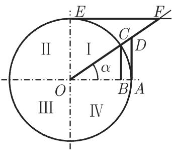

#### 3.1.2 圆函数与双曲函数的几何定义

3.1.2.1 圆函数或三角函数的定义

1. 用单位圆定义

一个角 $\alpha$ 的三角函数是就半径 $R = 1$ 的单位圆和一个直角三角形的锐角（图3.5(a),(b)）借助邻边 $b$ 、对边 $a$ 和斜边 $c$ 来定义的．在单位圆中一个角的度量由一条固定半径 $\overline{OA}$ (长度1)和一条逆时针(正向)移动的半径 $\overline{OC}$ 做成：

$$
\mathrm{正弦}: \sin \alpha = {\overline {{{B C}}}} = {\frac {a}{c}},\tag{3.3}
$$

$$
\text { 余弦 }: \cos \alpha = {\overline {{{O B}}}} = {\frac {b}{c}},\tag{3.4}
$$

$$
\text {正切}: \tan \alpha = {\overline {{{A D}}}} = {\frac {a}{b}},\tag{3.5}
$$

$$
\text {余切}: \cot \alpha = \overline {{{E F}}} = \frac {b}{a},\tag{3.6}
$$

$$
\text {正割}: \sec \alpha = \overline {{O D}} = \frac {c}{b},\tag{3.7}
$$

$$
\mathrm{余割}: \csc \alpha = {\overline {{{O F}}}} = {\frac {c}{a}}.\tag{3.8}
$$

  
(a)

  
(b)  
3.5

2. 三角函数的符号

依赖千移动的半径 0C 所在单位圆的象限（图 3.5(a) ），这些函数具有唯一定义的符号，它们可以从表 2.2（见第 101 页）中确定．

3. 由扇形面积给出的三角函数定义

函数 sina, cosa, tana定义为 R=l 的单位圆的线段 ${ \overline { { B C } } } , { \overline { { O B } } } , { \overline { { A D } } }$ （图 3.6),其中自变量是圆心角 =主 AOC．对千这个定义我们也可以使用扇形 COK的面积t, 它表示为图 3.6 中的阴影面积．使用以弧度度量的圆心角 2a, 对千 R=l们得到其面积 $t = \frac { 1 } { 2 } R ^ { 2 } 2 \alpha = \alpha$ 因此我们有如同在 (3.3)\~(3.5) 中一样的等式$\sin t = \overline { { B C } } , \cos t = \overline { { O B } } , \tan t = \overline { { A D } }$

3.1.2.2 双曲函数的定义

为了与 (3.3) (3.5) 中三角函数的定义作类比，现以方程为 $x ^ { 2 } - y ^ { 2 } = 1$ 的双曲线（仅使用图 3.7 中右边一支）的相应弧三角形面积代替方程 $x ^ { 2 } + y ^ { 2 } = 1$ 的单位圆的扇形面积用 表示 COK 的面积，即图 3.7 中的阴影面积，双曲函数的定义等式为

$$
\sinh t = \overline {{B C}},\tag{3.9}
$$

$$
\cosh t = \overline {{O B}},\tag{3.10}
$$

  
3.6

$$
\tanh t = \overline {{A D}}.\tag{3.11}
$$

  
3.7

利用积分计算面积 ，并将结果用 ${ \overline { { B C } } } , { \overline { { O B } } }$ 和 $\overline { { A D } }$ 表示，得

$$
t = \ln \left(\overline {{B C}} + \sqrt {\overline {{B C}} ^ {2} + 1}\right) = \ln \left(\overline {{O B}} + \sqrt {\overline {{O B}} ^ {2} - 1}\right) = \frac {1}{2} \ln \frac {1 + \overline {{A D}}}{1 - \overline {{A D}}},\tag{3.12}
$$

千是，从现在起，双曲函数可以用指数函数表示成

$$
\overline {{B C}} = \frac {\mathrm{e} ^ {t} - \mathrm{e} ^ {- t}}{2} = \sinh t,\tag{3.13a}
$$

$$
\overline {{O B}} = \frac {\mathrm{e} ^ {t} + \mathrm{e} ^ {- t}}{2} = \cosh t,\tag{3.13b}
$$

$$
\overline {{A D}} = \frac {\mathrm{e} ^ {t} - \mathrm{e} ^ {- t}}{\mathrm{e} ^ {t} + \mathrm{e} ^ {- t}} = \tanh t.\tag{3.13c}
$$

这些等式所表示的是双曲函数最广为人知的定义．
