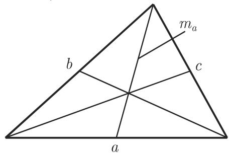
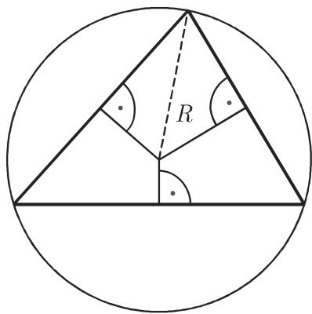
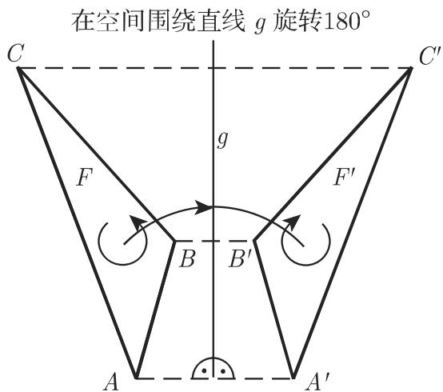
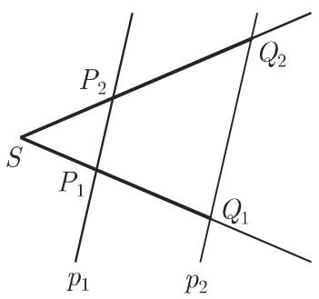

#### 3.1.3 平面三角形

3.1.3.1 有关平面三角形的命题

(1) 平面三角形的两边之和大千第三边（图 3.8):

$$
b + c > a.\tag{3.14}
$$

(2) 平面三角形的内角之和是

$$
\alpha + \beta + \gamma = 1 8 0 ^ {\circ}.\tag{3.15}
$$

(3) 一个三角形是由下列信息唯一确定的：

·三条边或

．两条边及其夹角，或

．两角及其所夹的边．

如果给定两条边及其中一边所对的角，那么它们定义两个、一个或者没有这样的三角形（参见第 191 页，表 3.4 中第三个基本问题）．

  
3.8

  
3.9

(4) 三角形的中线是连接该三角形的一个顶点和所对的边的中点的一条线．三角形的中线相交千一点是该三角形的重心（图 3.9)，从顶点算起它分它们的比为2 : 1.

(5) 三角形的角平分线是将一个内角分成两个相等部分的一条线．角平分线相交千一点

(6) 内切圆是内切千一个三角形的圆，即该三角形的全部边都是此圆的切线．它的圆心是角平分线的交点（图 3.10)．内切圆的半径称为边心距或短半径．

(7) 外接圆是围绕一个三角形，即通过该三角形的顶点所画的圆（图 3.11) ．其圆心是该三角形三条边垂直平分线的交点．

(8) 三角形的高是从顶点出发垂直千对边的垂线．三条高交千一点即垂心

(9) 等腰三角形是具有两条长度相等的边的三角形．第三边上的高、中线和垂直平分线相重合．对一个三角形来说，三条边中的任何两条边相等都足以构成等腰三角形

  
3.10

  
3.11

(10) 等边三角形的三条边相等，其内切圆圆心、外接圆圆心、重心和垂心相重合

(11) 中位线是连接一个三角形两边中点的一条直线；它平行千第三边并且具有该边一半的长度

(12) 直角三角形是具有一个直角 $( 9 0 ^ { \circ }$ 的角）的三角形（参见第 188 页图 3.31).

3.1.3.2 对称

1. 中心对称

如果将一个平面图形所在的平面围绕中心点或对称中心 旋转 $1 8 0 ^ { \circ }$ 后它恰好覆盖住自己，则该平面图形称为中心对称的（图 3.12)．由千该图形的大小和形状在这一变换过程中没有发生改变，因此它称为相合映射．同样，该平面图形的指向类或定向类仍保持不变（图 3.12)．由千有相同的指向类，所以这种图形称为直接合同的．

图形的定向是指一个图形的边界朝某个方向的旋转：正向，即逆时针方向；负向，即顺时针方向（图 3.12, 3.13).

  
3.12

  
3.13

2. 轴对称

如果将一个平而图形在空间围绕一条直线 旋转 $1 8 0 ^ { \circ }$ 后对应的点相互覆盖，则该平面图形称为轴对称的（图 3.13)．对应的点与轴 g, 即对称轴具有相同的距离．对关千直线 的轴对称来说图形的定向相反．因此这样的图形称为是间接合同的．这一变换称为对 的一个反射．由千图形的大小和形状都没有改变，所以它也称为一个间接合同映射．在这一变换下平面图形的定向类是相反的（图 3.13).

评论 对于空间图形也有类似的说法．

3. 全等三角形，全等定理

a) 全等 如果平面图形的大小和形状相符合，就称它们是全等的．通过以下三种变换：平移、旋转和反射，以及这些变换的组合，可以把全等的图形变换到相重合的位置

需要在直接全等图形与间接全等图形之间作出区分．直接全等图形可以通过平移和旋转变换到重合位置．由千间接全等图形具有一个反指向类，所以还需要一个关千一条直线的轴对称变换将它们变换到重合位置．

·轴对称图形是间接全等的．为了将它们彼此变换到另一个，全部需要三种变换．

b) 三角形全等定理 如果两个三角形在以下方面相同，那么它们就是全等的：

．三条边 (SSS) ，或

．两条边和它们之间的夹角 (SAS) ，或

·一条边和夹这条边的两个内角 (ASA)，或

．两条边和较长的一边所对的内角 (SSA).

4. 相似三角形，相似定理

如果平面图形具有相同的形状但不具有相同的大小，就称它们是相似的．对千相似的图形存在它们的点之间的一个一一映射，使得一个图形中任意一个角与另一个图形中对应的角相同一个等价的定义如下：在相似的图形中彼此对应的线段之长成比例

a) 图形的相似性 要求要么所有的对应角相等，要么所有的对应线段之比相等

b) 面积 相似平面图形的面积与相应线性元素，如边、高、对角线等等之比的平方成比例

c) 相似定理 对千三角形下列相似定理成立．如果两个三角形在以下方面相同，那么它们就是相似的：

·三边之比，

．两个内角，

．两边之比和它们所夹的内角，

．两边之比和较长的一边所对的内角．

由千在相似定理中只要求边之比相等而不是边长相等，所以相似定理比相应的全等定理要求要少．

5. 截距定理

截距定理是三角形相似定理的推论．

a) 笫一截距定理 如果从同一点 发出的两条射线被两条平行线 $p _ { 1 }$ , $p _ { 2 }$ 所截，则一条射线上的线段之比与另一条上的对应线段之比相同（图 3.14(a)):

$$
\left| \frac {\overline {{S P _ {1}}}}{\overline {{S Q _ {1}}}} \right| = \left| \frac {\overline {{S P _ {2}}}}{\overline {{S Q _ {2}}}} \right|.\tag{3.16}
$$

因此一条射线上的每一线段与另一条射线上的对应线段成比例．

b) 笫二截距定理 如果从同一点 发出的两条射线被两条平行线 Pl, P2截，则所截的平行线段与射线上的相应线段具有同样的比（图 3.14(a)):

$$
\left| \frac {\overline {{{{S P _ {1}}}}}}{\overline {{{{S Q _ {1}}}}}} \right| = \left| \frac {\overline {{{{P _ {1} P _ {2}}}}}}{\overline {{{{Q _ {1} Q _ {2}}}}}} \right| \quad \text {或} \quad \left| \frac {\overline {{{{S P _ {2}}}}}}{\overline {{{{S Q _ {2}}}}}} \right| = \left| \frac {\overline {{{{P _ {1} P _ {2}}}}}}{\overline {{{{Q _ {1} Q _ {2}}}}}} \right|.\tag{3.17}
$$

如果点 位千平行线之间，那么截距定理对千在点 相交的直线这种情形也成立（图 3.14(b)).

  
(a)

  
3.14  
(b)
