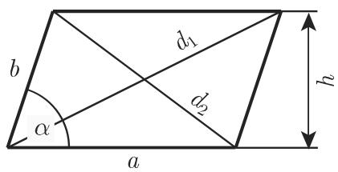
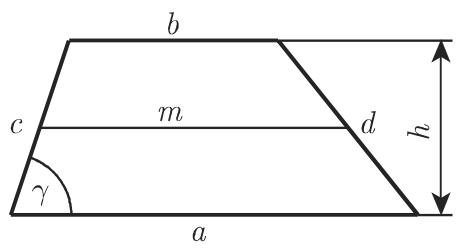
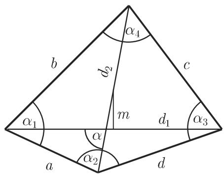
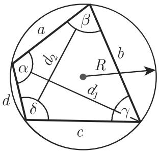

#### 3.1.4 平面四边形

3.1.4.1 平行四边形

一个四边形如果具有以下属性就称为平行四边形（图 3.15):

·相对的边具有相同的长度，

·相对的边互相平行，

·对角线互相平分，

．对角相等．

假设一个四边形的上述属性只有一个成立，或假定一对对边相等且平行，那么由此可推出所有其余的属性

对角线边和面积之间的关系如下：

$$
d _ {1} ^ {2} + d _ {2} ^ {2} = 2 (a ^ {2} + b ^ {2}),\tag{3.18}
$$

$$
h = b \sin \alpha ,\tag{3.19}
$$

$$
S = a h.\tag{3.20}
$$

3.15  
  
3.16

  
3.17

3.1.4.2 矩形和正方形

一个平行四边形如果是矩形（图 3.16) ，则它

·只具有直角，或

．具有相同长度的对角线

仅具有这些属性中的一个就够了，因为它们中的任何一个都可以从另一个推出来只需证明平行四边形的一个角是直角，则所有的角都是直角．如果一个四边形具有四个直角，则它是矩形

矩形的周长 和面积

$$
U = 2 (a + b),\tag{3.21a}
$$

$$
S = a b.\tag{3.21b}
$$

如果 $a = b$ 成立（图 3.17)，则矩形称为正方形，并有以下公式：

$$
d = a \sqrt {2} \approx 1. 4 1 4 a,\tag{3.22}
$$

$$
a = d \frac {\sqrt {2}}{2} \approx 0. 7 0 7 d,\tag{3.23}
$$

$$
S = a ^ {2} = \frac {d ^ {2}}{2}.\tag{3.24}
$$

3.1.4.3 菱形

一个菱形（图 3.18) 是一个平行四边形，其中

·所有的边具有相同长度，或

·对角线相互垂直，或

·对角线是平行四边形的角平分线．

上述属性中单独任何一个已足够；其他所有的属性都可以从它推出来对千菱形，有

$$
d _ {1} = 2 a \cos {\frac {\alpha}{2}},\tag{3.25}
$$

$$
d _ {2} = 2 a \sin {\frac {\alpha}{2}},\tag{3.26}
$$

$$
d _ {1} ^ {2} + d _ {2} ^ {2} = 4 a ^ {2}.\tag{3.27}
$$

$$
S = a h = a ^ {2} \sin \alpha = \frac {d _ {1} d _ {2}}{2}.\tag{3.28}
$$

3.1.4.4 梯形

一个四边形如果有两边平行则称为梯形（图 3.19)．平行的边称为底．以表示底， 表示高， 表示梯形的中位线（它是两非平行的边中点的连线），则有

$$
m = \frac {a + b}{2},\tag{3.29}
$$

$$
S = \frac {(a + b) h}{2} = m h,\tag{3.30}
$$

$$
h _ {S} = \frac {h (a + 2 b)}{3 (a + b)}.\tag{3.31}
$$

  
3.18

  
3.19

质心位千两平行的底 中点的连线上，与底 的距离为 $h _ { S } ( 3 . 3 1 )$ ．关千用积分计算质心坐标，见第 672 8.2.2.3,5..

对千等腰梯形有 $d = c$

$$
S = (a - c \cos \gamma) c \sin \gamma = (b + c \cos \gamma) c \sin \gamma .\tag{3.32}
$$

3.1.4.5 一般四边形

由四条直线段所围的封闭平面图形称为一般四边形．如果对角线全部位千该四边形内部则称它是凸四边形，否则称其为凹四边形．一般四边形可以被两条对角线 $d _ { 1 } , \ d _ { 2 }$ 中的每一条分成两个三角形（图 3.20)．因此，每个四边形的内角之和是$2 { \cdot } 1 8 0 ^ { \circ } = 3 6 0 ^ { \circ }$

$$
\sum_ {i = 1} ^ {4} \alpha_ {i} = 3 6 0 ^ {\circ}.\tag{3.33}
$$

连接对角线中点（图 3.20) 的线段 之长由下式给出

$$
a ^ {2} + b ^ {2} + c ^ {2} + d ^ {2} = d _ {1} ^ {2} + d _ {2} ^ {2} + 4 m ^ {2}.\tag{3.34}
$$

  
3.20

一般四边形的面积是

$$
S = \frac {1}{2} d _ {1} d _ {2} \sin \alpha .\tag{3.35}
$$

3.1.4.6 内接四边形

能被一个外接圆外接的四边形称为内接四边形（图 3.21(a)），其边是该圆的弦．一个四边形是内接四边形当且仅当它的对角之和是 $1 8 0 ^ { \circ }$

$$
\alpha + \gamma = \beta + \delta = 1 8 0 ^ {\circ}.\tag{3.36}
$$

对千内接四边形，有托勒密定理成立：

$$
a c + b d = d _ {1} d _ {2}.\tag{3.37}
$$

内接四边形的外切圆半径是

$$
R = \frac {1}{4 S} \sqrt {(a b + c d) (a c + b d) (a d + c b)}.\tag{3.38}
$$

对角线可以通过以下公式计算：

$$
d _ {1} = \sqrt {\frac {(a c + b d) (a b + c d)}{a d + b c}},\tag{3.39a}
$$

$$
d _ {2} = \sqrt {\frac {(a c + b d) (a d + b c)}{a b + c d}}.\tag{3.39b}
$$

  
(a)

  
(b)  
3.21

面积可以用四边形半周长 $s = { \frac { 1 } { 2 } } ( a + b + c + d )$ 来表示：

$$
S = \sqrt {(s - a) (s - b) (s - c) (s - d)}.\tag{3.40}
$$

如果内接四边形也是一个外切四边形，则

$$
S = \sqrt {a b c d}.\tag{3.41}
$$

3.1.4.7 外切四边形

如果一个四边形具有一个内切圆（图 3.21(b) ），则称它为一个外切四边形，并且边是该圆的切线一个四边形具有一个内切圆当且仅当对边长度之和相等，并且这个和也等千半周长 s:

$$
s = \frac {1}{2} (a + b + c + d) = a + c = b + d.\tag{3.42}
$$

外切四边形的面积是

$$
S = (a + c) r = (b + d) r,\tag{3.43}
$$

其中 是内切圆的半径
