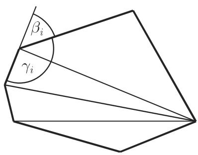
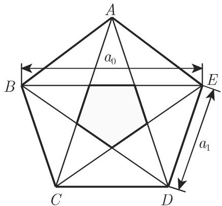

#### 3.1.5 平面上的多边形

3.1.5.1 一般多边形

由直线段作为边所围成的一个封闭平而图形可以分解成 $\cdot n - 2 \cdot$ 个三角形（图 3.22).其外角 $\beta _ { i }$ 之和，内角 $\gamma _ { i }$ 之和，以及对角线数是

$$
\sum_ {i = 1} ^ {n} \beta_ {i} = 3 6 0 ^ {\circ},\tag{3.44}
$$

$$
\sum_ {i = 1} ^ {n} \gamma_ {i} = 1 8 0 ^ {\circ} (n - 2),\tag{3.45}
$$

$$
D = \frac {n (n - 3)}{2}.\tag{3.46}
$$

3.1.5.2 正凸多边形

正凸多边形（图 3.23) 具有 条相等的边和 个相等的角．边的中垂线的交点是半径分别为 的内切圆和外接圆的中心 M. 这些多边形的边是内切圆的切线和外接圆的弦它们对千内切圆来说形成一个外切多边形或切线多边形，而就外接圆而言形成一个内接多边形分解一个正凸 边形将得到 个环绕中心等腰全等三角形．

  
3.22

  
(a)

  
(b)  
3.23

中心角

$$
\varphi_ {n} = \frac {3 6 0 ^ {\circ}}{n}.\tag{3.47}
$$

底角

$$
\alpha_ {n} = \left(1 - \frac {2}{n}\right) \cdot 9 0 ^ {\circ}.\tag{3.48}
$$

外角

$$
\beta_ {n} = \frac {3 6 0 ^ {\circ}}{n}.\tag{3.49}
$$

内角

$$
\gamma_ {n} = 1 8 0 ^ {\circ} - \beta_ {n}.\tag{3.50}
$$

外接圆半径

$$
R = \frac {a _ {n}}{2 \sin {\frac {1 8 0 ^ {\circ}}{n}}}, R ^ {2} = r ^ {2} + \frac {1}{4} a _ {n} ^ {2}.\tag{3.51}
$$

内切圆半径

$$
r = \frac {a _ {n}}{2} \cot {\frac {1 8 0 ^ {\circ}}{n}} = R \cos {\frac {1 8 0 ^ {\circ}}{n}}.\tag{3.52}
$$

边长

$$
a _ {n} = 2 \sqrt {R ^ {2} - r ^ {2}} = 2 R \sin {\frac {\varphi_ {n}}{2}} = 2 r \tan {\frac {\varphi_ {n}}{2}}.\tag{3.53}
$$

周长

$$
U = n a _ {n}.\tag{3.54}
$$

$2 n$ 边形的边长

$$
a _ {2 n} = R \sqrt {2 - 2 \sqrt {1 - \left(\frac {a _ {n}}{2 R}\right) ^ {2}}}, \quad a _ {n} = a _ {2 n} \sqrt {4 - \left(\frac {a _ {2 n} ^ {2}}{R ^ {2}}\right)}.\tag{3.55}
$$

边形的面积

$$
S _ {n} = \frac {1}{2} n a _ {n} r = n r ^ {2} \tan {\frac {\varphi_ {n}}{2}} = \frac {1}{2} n R ^ {2} \sin \varphi_ {n} = \frac {1}{4} n a _ {n} ^ {2} \cot {\frac {\varphi_ {n}}{2}}.\tag{3.56}
$$

$2 n$ 边形的面积

$$
S _ {2 n} = \frac {n R ^ {2}}{\sqrt {2}} \sqrt {1 - \sqrt {\frac {4 S _ {n} ^ {2}}{n ^ {2} R ^ {4}}}}, \quad S _ {n} = S _ {2 n} \sqrt {1 - \frac {S _ {2 n} ^ {2}}{n ^ {2} R ^ {4}}}.\tag{3.57}
$$

3.1.5.3 某些正凸多边形

已将某些正凸多边形的性质汇集在表 3.2 中．

五边形和五角星形值得特别注意，据信梅塔蓬图姆的希帕索斯（约公元前 450)通过这些多边形的性质（参见第 1.1.1.2) 认识到无理数．下面的例子对此作了讨论

·正五边形的对角线（图 3.24) 构成一个内接五角星形．它的边又围成一个正五边形在正五边形中，对角线和边之比等千边和（对角线—边）之比： $a _ { 0 } : a _ { 1 } = a _ { 1 } :$ $( a _ { 0 } - a _ { 1 } ) = a _ { 1 } : a _ { 2 }$ ，其中 $a _ { 2 } = a _ { 0 } - a _ { 1 }$

考虑越来越小的嵌套五边形并有 $a _ { 3 } = a _ { 1 } - a _ { 2 } , a _ { 4 } = a _ { 2 } - a _ { 3 } , \cdot \cdot \cdot$ ·以及 $a _ { 2 } < a _ { 1 }$ $a _ { 3 } < a _ { 2 } , a _ { 4 } < a _ { 3 } , \cdot \cdot \cdot$ ·，得到 $a _ { 0 } \colon a _ { 1 } = a _ { 1 } : a _ { 2 } = a _ { 2 } : a _ { 3 } = a _ { 3 } : a _ { 4 } = \cdot \cdot \cdot$ ·.对千 $a _ { 0 }$ 和 $a _ { 1 }$ 来说这个欧儿里得算法永远不会终止，因为 $a _ { 0 } = 1 { \cdot } a _ { 1 } + a _ { 2 } , a _ { 1 } = 1 { \cdot } a _ { 2 } + a _ { 3 }$ $a _ { 2 } = 1 { \cdot } a _ { 3 } + a _ { 4 } , \cdot \cdot \cdot$ ·，因此 $q _ { n } = 1$ ．正五边形的边 $a _ { 1 }$ 和对角线 $a _ { 0 }$ 。是不可公度的．由$a _ { 0 } { : } a _ { 1 }$ 所确定的连分数与第 页， 1.1.1.4, 3., ■ 中的黄金分割完全相同，即它导致一个无理数

表 3.2 一些正多边形的性质

<table><tr><td>正多边形</td><td>an</td><td>R</td><td>r</td><td>Sn</td></tr><tr><td rowspan="2">三边形</td><td rowspan="2">a3=R√3=2r√3</td><td>=a3/3√3=2r=2/3h,</td><td>=a3/6√3=R/2=1/3h</td><td>=a2/4√3=3R2/4√3</td></tr><tr><td>h=a3/2√3=3/2R</td><td></td><td>=3r2√3</td></tr><tr><td rowspan="3">五边形</td><td>a5=R/2√10-2√5</td><td>=a5/10√50+10√5</td><td>=a5/10√25+10√5</td><td>=a2/4√25+10√5</td></tr><tr><td>=2r√5-2√5</td><td>=r(√5-1)</td><td>=R/4(√5+1)</td><td>=5R2/8√10+2√5</td></tr><tr><td></td><td></td><td></td><td>=5r2√5-2√5</td></tr><tr><td rowspan="2">六边形</td><td>a6=2/3r√3</td><td>=2/3r√3</td><td>=R/2√3</td><td>=3a2/2√3=3R2/2√3</td></tr><tr><td></td><td></td><td></td><td>=2r2√3</td></tr><tr><td rowspan="3">八边形</td><td>a8=R√2-√2</td><td>=a8/2√4+2√2</td><td>=a8/2(√2+1)</td><td>=2a2/8(√2+1)</td></tr><tr><td>=2r(√2-1)</td><td>=r√4-2√2</td><td>=R/2√2+√2</td><td>=2R2√2</td></tr><tr><td></td><td></td><td></td><td>=8r2(√2-1)</td></tr><tr><td rowspan="3">十边形</td><td>a10=R/2(√5-1)</td><td>=a10/2(√5+1)</td><td>=a10/2√5+2√5</td><td>=5a2/2√5+2√5</td></tr><tr><td>=2r/5√25-10√5</td><td>=r/5√50-10√5</td><td>=R/4√10+2√5</td><td>=5R2/4√10-2√5</td></tr><tr><td></td><td></td><td></td><td>=2r2√25-10√5</td></tr></table>

  
3.24
