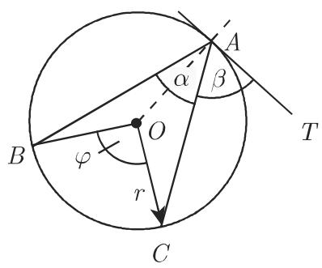
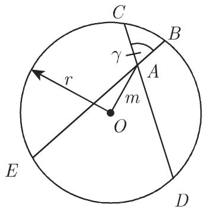
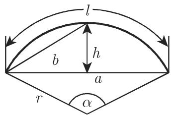
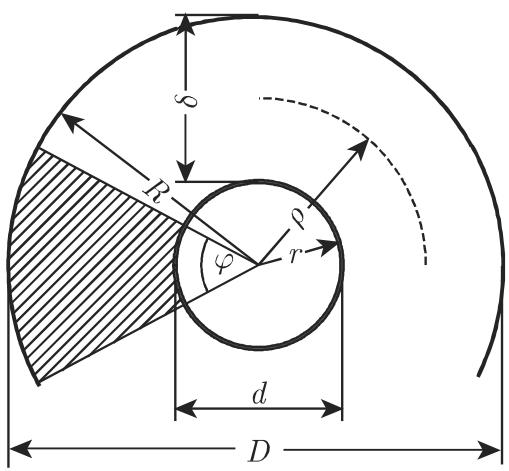

#### 3.1.6 圆和有关的图形

3.1.6.1

圆是平面上与一个给定点即圆心保持相同给定距离的点的轨迹．该距离本身，还有连接圆心与圆上任意点之间的线段称为半径．圆的圆周环绕着圆的面积．连接圆上两点的线段称为弦．穿过圆上两点的直线称为割线和圆只有一个公共点的直线称为该圆的切线

弦定理（图 3.26)

$$
\overline {{A C}} \cdot \overline {{A D}} = \overline {{A B}} \cdot \overline {{A E}} = r ^ {2} - m ^ {2}.\tag{3.58}
$$

割线定理（图 3.27)

$$
\overline {{A B}} \cdot \overline {{A E}} = \overline {{A C}} \cdot \overline {{A D}} = m ^ {2} - r ^ {2}.\tag{3.59}
$$

切割线定理（图 3.27)

$$
\overline {{A T}} ^ {2} = \overline {{A B}} \cdot \overline {{A E}} = \overline {{A C}} \cdot \overline {{A D}} = m ^ {2} - r ^ {2}.\tag{3.60}
$$

周长

$$
U = 2 \pi r \approx 6. 2 8 3 r, U = \pi d \approx 3. 1 4 2 d, U = 2 \sqrt {\pi S} \approx 3. 5 4 5 \sqrt {S}.\tag{3.61}
$$

  
3.25

  
3.26

  
3.27

面积

$$
S = \pi r ^ {2} \approx 3. 1 4 2 r ^ {2}, S = \frac {\pi d ^ {2}}{4} \approx 0. 7 8 5 d ^ {2}, S = \frac {U d}{4}.\tag{3.62}
$$

半径

$$
r = \frac {U}{2 \pi} \approx 0. 1 5 9 U.\tag{3.63}
$$

直径

$$
d = 2 r = 2 \sqrt {\frac {S}{\pi}} \approx 1. 1 2 8 \sqrt {S}.\tag{3.64}
$$

对千下列与角有关的公式见第 168 3.1.1.2 中角的定义

圆周角（图 3.25)

$$
\alpha = \frac {1}{2} \widehat {B C} = \frac {1}{2} \nless B O C = \frac {1}{2} \varphi .\tag{3.65a}
$$

泰勒斯定理的一种特殊情形（参见第 188 3.2.1)

$$
\varphi = 1 8 0 ^ {\circ}, \quad \text {即} \quad \alpha = 9 0 ^ {\circ}.\tag{3.65b}
$$

弦与切线之间的夹角（图 3.25)

$$
\beta = \frac {1}{2} \widehat {A C} = \frac {1}{2} \nless C O A.\tag{3.66}
$$

内角（图 3.26)

$$
\gamma = \frac {1}{2} (\widehat {C B} + \widehat {E D}) = \frac {1}{2} (\nless B O C + \nless E O D).\tag{3.67}
$$

外角（图 3.27)

$$
\alpha = \frac {1}{2} (\widehat {D E} - \widehat {B C}) = \frac {1}{2} (\nless E O C - \nless C O B).\tag{3.68}
$$

割线与切线之间的夹角（图 3.27)

$$
\beta = \frac {1}{2} (\widehat {T E} - \widehat {T B}) = \frac {1}{2} (\nless T O E - \nless B O T).\tag{3.69}
$$

切线角（图 3.28) 是左边弧和右边弧上的任意一点

$$
\begin{array}{r l} \alpha & = \frac {1}{2} (\widehat {B D C} - \widehat {C E B}) = \frac {1}{2} (\not \prec B O C - \not \prec C O B) \\ & = \frac {1}{2} (3 6 0 ^ {\circ} - \not \prec C O B - \not \prec C O B) = 1 8 0 ^ {\circ} - \not \prec C O B. \end{array}\tag{3.70}
$$

3.1.6.2 圆弓形和圆扇形

定义量 半径 和圆心角 （图 3.29)．要确定的量是：

弦

$$
a = 2 \sqrt {2 h r - h ^ {2}} = 2 r \sin {\frac {\alpha}{2}}.\tag{3.71}
$$

圆心角

$$
\alpha = 2 \arcsin {\frac {a}{2 r}} (\alpha \text {以度度量}).\tag{3.72}
$$

弓形的高

$$
h = r - \sqrt {r ^ {2} - \frac {a ^ {2}}{4}} = r \left(1 - \cos {\frac {\alpha}{2}}\right) = \frac {a}{2} \tan {\frac {\alpha}{4}}.\tag{3.73}
$$

弧长

$$
l = \frac {2 \pi r \alpha}{3 6 0} \approx 0. 0 1 7 4 5 r \alpha \quad (\alpha \text {以弧度度量})\tag{3.74a}
$$

$$
l \approx {\frac {8 b - a}{3}} \quad {\text {或}} \quad l \approx {\sqrt {a ^ {2} + {\frac {1 6}{3}} h ^ {2}}}.\tag{3.74b}
$$

  
3.28

  
3.29

  
3.30

扇形面积

$$
S = \frac {\pi r ^ {2} \alpha}{3 6 0} \approx 0. 0 0 8 7 3 r ^ {2} \alpha .\tag{3.75}
$$

弓形面积

$$
S = \frac {r ^ {2}}{2} \left(\frac {\pi \alpha}{1 8 0} - \sin \alpha\right) = \frac {1}{2} [ l r - a (r - h) ], \quad S \approx \frac {h}{1 5} (6 a + 8 b).\tag{3.76}
$$

3.1.6.3 圆环

圆环的定义量 外环半径 、内环半径 和圆心角 $\varphi$ （图 3.30).

外环直径

$$
D = 2 R.\tag{3.77}
$$

内环直径

$$
d = 2 r.\tag{3.78}
$$

平均半径

$$
\rho = \frac {R + r}{2}.\tag{3.79}
$$

圆环的宽度

$$
\delta = R - r.\tag{3.80}
$$

圆环面积

$$
S = \pi (R ^ {2} - r ^ {2}) = \frac {\pi}{4} (D ^ {2} - d ^ {2}) = 2 \pi \rho \delta .\tag{3.81}
$$

对应圆心角 $\varphi$ 的圆环面积（图 3.30 中的阴影面积）

$$
S _ {\varphi} = \frac {\varphi \pi}{3 6 0} \left(R ^ {2} - r ^ {2}\right) = \frac {\varphi \pi}{1 4 4 0} \left(D ^ {2} - d ^ {2}\right) = \frac {\varphi \pi}{1 8 0} \rho \delta (\varphi \mathrm{以弧度度量}).\tag{3.82}
$$
