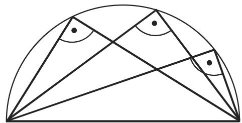
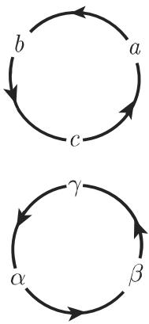
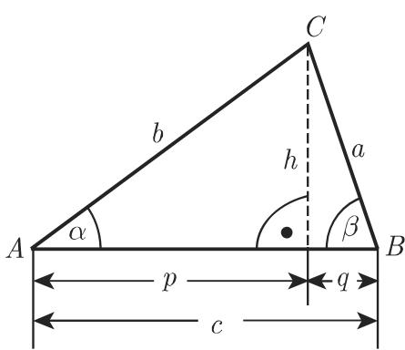
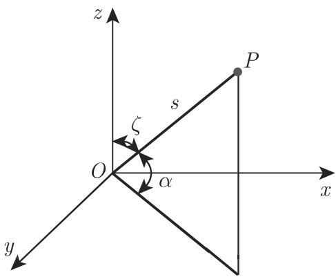
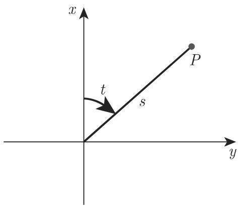
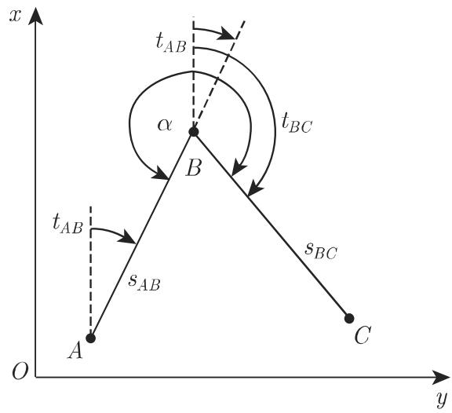
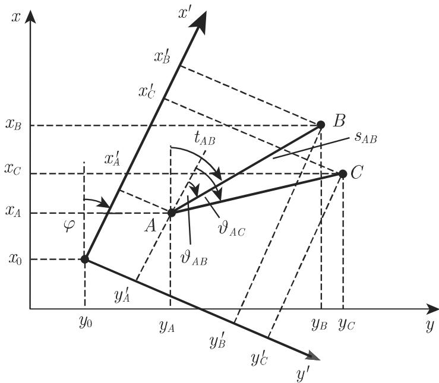

### 3.2 平面三角学

#### 3.2.1 三角形

3.2.1.1 平面直角三角形中的计算

1. 基本公式

记号（图 3.31):

为斜边； a, 为其他两边或两直角边； $\alpha$ 和 $\beta$ 为边 $a$ 分别所对应的角；为高 $p , q$ 为斜边上的线段 $S$ 为面积

内角之和

$$
\alpha + \beta + \gamma = 1 8 0 ^ {\circ}, \quad \gamma = 9 0 ^ {\circ},\tag{3.83}
$$

边的计算

$$
\begin{array}{c} {a = c \sin \alpha = c \cos \beta} \\ {= b \tan \alpha = b \cot \beta ,} \end{array}\tag{3.84}
$$

毕达哥拉斯（勾股）定理

$$
a ^ {2} + b ^ {2} = c ^ {2}.\tag{3.85}
$$

泰勒斯定理 半圆中以直径为底的所有内接三角形的顶角是直角，即半圆中直径上的所有圆周角是直角（参见图 3.32 和第 185 (3.65b)).

  
3.31

  
3.32

欧几里得定理

$$
h ^ {2} = p q, \quad a ^ {2} = p c, \quad b ^ {2} = q c.\tag{3.86}
$$

面积

$$
S = \frac {a b}{2} = \frac {a ^ {2}}{2} \tan \beta = \frac {c ^ {2}}{4} \sin 2 \beta .\tag{3.87}
$$

2. 平面直角三角形边和角的计算

在一个直角三角形中有六个定义量（三个角 $\alpha , \beta , \gamma$ 和它们所对的边 a, b, ，当然，它们不全都独立），一个角（图 3.31 中的角刃已知为 $9 0 ^ { \circ }$

一个平面三角形可以由三个定义量确定，但它们不能任意给定（参见第 1733.1.3.1)．因此在直角三角形的情形中，只能再给定两个量．剩下的三个量可以由3.3 以及 (3.15) (3.83) 确定

3.3 平面直角三角形的定义量

<table><tr><td>已知</td><td></td><td>其他量的计算</td><td></td></tr><tr><td>例如 a,α</td><td>β=90°-α</td><td>b=a cot α</td><td>c=a/sin α</td></tr><tr><td>例如 b,α</td><td>β=90°-α</td><td>a=b tan α</td><td>c=b/cos α</td></tr><tr><td>例如 c,α</td><td>β=90°-α</td><td>a=c sin α</td><td>b=c cos α</td></tr><tr><td>例如 a,b</td><td>a/b=tan α</td><td>c=a/sin α</td><td>β=90°-α</td></tr></table>

3.2.1.2 一般（斜）平面三角形中的计算

1. 基本公式

记号（图 3.33): a, b, 为边； a,(3，心为它们所对的角； 为面积； 为外接圆

半径； 为内切圆半径； $s = { \frac { a + b + c } { 2 } }$ 为半周长．

轮换 由千斜三角形不具有特殊的边或角，所以从每个包含边和角的公式出发，有可能按照图 3.34 通过边和角的轮换得到另外两个公式

  
3.33

  
3.34

  
3.35

·从 ${ \frac { a } { b } } = { \frac { \sin \alpha } { \sin \beta } }$ （正弦定律）出发，可以通过轮换得 ${ \frac { b } { c } } = { \frac { \sin \beta } { \sin \gamma } } , { \frac { c } { a } } = { \frac { \sin \gamma } { \sin \alpha } }$ 正弦定律

$$
{\frac {a}{\sin \alpha}} = {\frac {b}{\sin \beta}} = {\frac {c}{\sin \gamma}} = 2 R.\tag{3.88}
$$

投影法则（图 3.35)

$$
c = a \cos \beta + b \cos \alpha .\tag{3.89}
$$

余弦定律或一般三角形的毕达哥拉斯定理

$$
c ^ {2} = a ^ {2} + b ^ {2} - 2 a b \cos \gamma .\tag{3.90}
$$

莫尔韦德等式

$$
(a + b) \sin {\frac {\gamma}{2}} = c \cos \left(\frac {\alpha - \beta}{2}\right),\tag{3.91a}
$$

$$
(a - b) \cos \frac {\gamma}{2} = c \sin \left(\frac {\alpha - \beta}{2}\right).\tag{3.91b}
$$

正切定律

$$
{\frac {a + b}{a - b}} = {\frac {\tan {\frac {\alpha + \beta}{2}}}{\tan {\frac {\alpha - \beta}{2}}}}.\tag{3.92}
$$

半角公式

$$
\tan {\frac {\alpha}{2}} = \sqrt {\frac {(s - b) (s - c)}{s (s - a)}}.\tag{3.93}
$$

正切公式

$$
\tan \alpha = \frac {a \sin \beta}{c - a \cos \beta} = \frac {a \sin \gamma}{b - a \cos \gamma}.\tag{3.94}
$$

附加关系

$$
\sin {\frac {\alpha}{2}} = \sqrt {\frac {(s - b) (s - c)}{b c}},\tag{3.95a}
$$

$$
\cos {\frac {\alpha}{2}} = \sqrt {\frac {s (s - a)}{b c}}.\tag{3.95b}
$$

对应的高

$$
h _ {a} = b \sin \gamma = c \sin \beta .\tag{3.96}
$$

的中线

$$
m _ {a} = \frac {1}{2} \sqrt {b ^ {2} + c ^ {2} + 2 b c \cos \alpha}.\tag{3.97}
$$

角 $_ \alpha$ 的平分线

$$
l _ {\alpha} = \frac {2 b c \cos \frac {\alpha}{2}}{b + c}.\tag{3.98}
$$

外接圆半径

$$
R = \frac {a}{2 \sin \alpha} = \frac {b}{2 \sin \beta} = \frac {c}{2 \sin \gamma}.\tag{3.99}
$$

内切圆半径

$$
r = \sqrt {\frac {(s - a) (s - b) (s - c)}{s}} = s \tan {\frac {\alpha}{2}} \tan {\frac {\beta}{2}} \tan {\frac {\gamma}{2}}\tag{3.100}
$$

$$
= 4 R \sin {\frac {\alpha}{2}} \sin {\frac {\beta}{2}} \sin {\frac {\gamma}{2}}.\tag{3.101}
$$

面积

$$
S = \frac {1}{2} a b \sin \gamma = 2 R ^ {2} \sin \alpha \sin \beta \sin \gamma = r s = \sqrt {s (s - a) (s - b) (s - c)}.\tag{3.102}
$$

公式 $S = { \sqrt { s ( s - a ) ( s - b ) ( s - c ) } }$ 称为海伦公式．

2. 一般三角形中边、角和面积的计算

根据全等定理（参见第 175 3.1.3.2)，一个三角形由三个独立的量确定．其中必须至少有一边

由此推出四个所谓的基本问题．如果从六个定义量（三个角 $\alpha , \beta , \gamma$ 和它们所对的边 $a , b , c )$ 出发给定三个独立的量，那么我们就能用表 3.4 中的等式计算剩下的三个量．

3.4 一般三角形的定义量，基本问题

<table><tr><td colspan="2">已知量</td><td>用于计算其他量的公式</td></tr><tr><td>(1)</td><td>1边及2角 $(a,\alpha,\beta)$ </td><td> $\gamma = 180^{\circ} - \alpha - \beta, \quad b = \frac{a\sin\beta}{\sin\alpha},$  $c = \frac{a\sin\gamma}{\sin\alpha}, \quad S = \frac{1}{2} a b\sin\gamma.$ </td></tr><tr><td>(2)</td><td>2边及其夹角 $(a,b,\gamma)$ </td><td> $\tan\frac{\alpha-\beta}{2} = \frac{a-b}{a+b}\cot\frac{\gamma}{2}, \frac{\alpha+\beta}{2} = 90^{\circ} - \frac{1}{2}\gamma;$  $\alpha$ 和 $\beta$ 来自 $\alpha + \beta$ 和 $\alpha - \beta,$  $c = \frac{a\sin\gamma}{\sin\alpha}, \quad S = \frac{1}{2} a b\sin\gamma.$ </td></tr><tr><td>(3)</td><td>2边及其中一边的对角 $(a,b,\alpha)$ </td><td>如果 $a \geqslant b$ 成立,则有 $\beta < 90^{\circ}$ 并且是唯一确定的.如果 $a < b$ 成立,则出现下列情形:1对于 $b\sin\alpha < a$ 来说, $\beta$ 有两个值 $(\beta_{2} = 180^{\circ} - \beta_{1})$ 2对于 $b\sin\alpha = a$ 来说, $\beta$ 恰有一个值 $(90^{\circ}).$ 3对于 $b\sin\alpha > a$ 来说,不存在这样的三角形. $\gamma = 180^{\circ} - (\alpha + \beta), \quad c = \frac{a\sin\gamma}{\sin\alpha}, \quad S = \frac{1}{2} a b\sin\gamma.$ </td></tr><tr><td>(4)</td><td>3边 $(a,b,c)$ </td><td> $r = \sqrt{\frac{(s-a)(s-b)(s-c)}{s}},$  $\tan\frac{\alpha}{2} = \frac{r}{s-a}, \tan\frac{\beta}{2} = \frac{r}{s-b}, \tan\frac{\gamma}{2} = \frac{r}{s-c},$  $S = rs = \sqrt{s(s-a)(s-b)(s-c)}.$ </td></tr></table>

与球面三角学（参见第 229 页表 3.9 中第二基本问题）形成对照，在一个平面三角形中任何一边都无法只从角得到

#### 3.2.2 大地测量学应用

3.2.2.1 测地坐标

在儿何学中通常使用右手坐标系来确定平面或空间中的点（图 3.170)．与之相反，在大地测量学中使用的是左手坐标系

1. 测地直角坐标

在平面左手坐标系（图 3.37) 中，表示横坐标的 轴是朝上的，而表示纵坐标轴则朝向右一个点 具有坐标 $y _ { P } , x _ { P } . \ x$ 轴的定向是出千实际的考虑．在测量长距离时，大都使用佐德纳或高斯—克吕格坐标系（参见第 216 3.4.1.2),正向是格网北向 $y$ 轴朝右指向东与通常几何学中的做法相反，象限是按顺时针方

向列出来的（图 3.37, 3.38).

如果除平面上一个点的位置外还要考虑它的高度，那么我们可以使用三维左手直角坐标系 $( y , x , z )$ ，其中 轴指向天顶（图 3.36).

  
3.36

  
3.37

  
3.38

2. 测地极坐标

在大地测量学的左手平面极坐标系中（图 3.38)，一个点 是由横坐标轴和线之间的方向（方位）角 $t ,$ 以及线段 在点和原点（称为极点）之间的长度给定的．在大地测量学中角的正向是顺时针方向

为了确定高度，可以使用天顶角(或仰角也就是倾斜角 邓显示的是在一个三维直角左手坐标系（参见第 280 3.5.3.1,2. 左手和右手坐标系）中，天顶与线段 之间的天顶角，线段 与其在 $y , x$ 平面上垂直投影之间的倾斜角的度量．

3. 比例尺

在制图学中，比例因子 是坐标系 $K _ { 1 }$ 中的线段 $s _ { K _ { 1 } }$ 关于另一坐标系 $K _ { 2 }$ 中的对应线段 $s _ { K _ { 2 } }$ 之比．

(1) 线段的换算 是模数或尺度， 是自然指标， 是地图指标，则有

$$
M = 1: m = s _ {K}: s _ {N}.\tag{3.103a}
$$

对千具有不同模数 m1, m2 的两个线段 $s _ { K _ { 1 } } , s _ { K _ { 2 } }$ 有

$$
s _ {K _ {1}}: s _ {K _ {2}} = m _ {2}: m _ {1}.\tag{3.103b}
$$

(2) 面积的换算 如果面积按照公式 $F _ { K } = a _ { K } b _ { K } , F _ { N } = a _ { N } b _ { N }$ 计算，则有

$$
F _ {N} = F _ {K} m ^ {2}.\tag{3.104a}
$$

对千具有不同模数 m1, m2 的两个面积 $F _ { K _ { 1 } } , F _ { K _ { 2 } }$ 有

$$
F _ {K _ {1}}: F _ {K _ {2}} = m _ {2} ^ {2}: m _ {1} ^ {2}.\tag{3.104b}
$$

3.2.2.2 大地测量学中的角

1. 新度

不同千数学（参见第 170 3.1.1.5)，在大地测量学中用来度量角的单位是新度在这里，周角或全角对应千 400 新度度与新度之间可以用表 3.5 中的公式进行转换

3.5 度与新度之间的换算

<table><tr><td colspan="2">1 全角 =360°=2π rad=400 gon</td></tr><tr><td colspan="2">1 直角 =90° = $\frac{\pi}{2}$  rad=100 gon</td></tr><tr><td colspan="2">1gon = $\frac{\pi}{200}$  rad=1000 mgon</td></tr></table>

2. 方位角

在一点 处的方位角 给出了一条有向线段相对千一条穿过点 平行千轴的直线的方向（见图 3.39 中的点 和方位角 $t _ { A B } )$ ．由千在大地测量学中角是按顺时针方向度量的（图 3.37，图 3.38)，因此，象限是以和平而三角中右手笛卡儿坐标系相反的顺序列出的（表 3.6)．平面三角中的公式仍然成立而无须改变．

3.6 通过径直输入 arctan 的正确符号所得的方位角

<table><tr><td>象限</td><td>I</td><td>II</td><td>III</td><td>IV</td></tr><tr><td>计算器中的显示</td><td>+</td><td>-</td><td>-</td><td>+</td></tr><tr><td> $\frac{\Delta y}{\Delta x}$ </td><td>tan&gt;0</td><td>tan&lt;0</td><td>tan&gt;0</td><td>tan&lt;0</td></tr><tr><td>方位角t</td><td> $t_0$  gon</td><td> $t_0 + 200$  gon</td><td> $t_0 + 200$  gon</td><td> $t_0 + 400$  gon</td></tr></table>

3. 坐标变换

(1) 从直角坐标计算极坐标 对千一个直角坐标系（图 3.39) 中的两点 $A ( y _ { A }$ $x _ { A } )$ 和 $B ( y _ { B } , x _ { B } )$ 以及从 的有向线段 $s A B$ 和方位角 $t _ { A B } , t _ { B A }$ ，以下公式

成立：

$$
\frac {y _ {B} - y _ {A}}{x _ {B} - x _ {A}} = \frac {\Delta y _ {A B}}{\Delta x _ {A B}},\tag{3.105a}
$$

$$
s _ {A B} = \sqrt {\Delta y _ {A B} ^ {2} + \Delta x _ {A B} ^ {2}},\tag{3.105b}
$$

$$
\tan t _ {A B} = \frac {\Delta y _ {A B}}{\Delta x _ {A B}},\tag{3.105c}
$$

$$
t _ {B A} = t _ {A B} \pm 2 0 0 \mathrm{gon}.\tag{3.105d}
$$

的象限依赖千 $\Delta y _ { A B }$ 和 $\Delta x _ { A B }$ 的符号．如果使用计算器以 $\Delta y$ 和 $\Delta x$ 的正确符号输入 $\frac { \Delta y } { \Delta x }$ ，那么按下 arctan 键我们就得到一个角 $t _ { 0 }$ ，在表 3.6 中还根据对应象限给出了增加的新度值．

(2) 从距离和角计算直角坐标 在一个直角坐标系中，一个点 的坐标是通过在本地极坐标系中的测量来确定的（图 3.40).

  
3.39

  
3.40

已知： $y _ { A } , x _ { A } ; y _ { B } , x _ { B }$ ．所测： $\alpha , s _ { B C }$ ．所求： $y c , x c$ 解

$$
\tan t _ {A B} = \frac {\Delta y _ {A B}}{\Delta x _ {A B}},\tag{3.106a}
$$

$$
t _ {B C} = t _ {A B} + \alpha \pm 2 0 0 \mathrm{gon},\tag{3.106b}
$$

$$
y _ {C} = y _ {B} + s _ {B C} \sin t _ {B C},\tag{3.106c}
$$

$$
x _ {C} = x _ {B} + s _ {B C} \cos t _ {B C}.\tag{3.106d}
$$

如果还测量了 $s A B$ ，那么本地测量的距离与从坐标计算出的距离之间的差别可以通过乘以比例因子 $\mathbf { \nabla } \cdot q$ 来考虑，其中 $q$ 一定非常接近千 1:

$$
q = \frac {\mathrm{计算出的距离}}{\mathrm{测量出的距离}} = \frac {\sqrt {\Delta y _ {A B} ^ {2} + \Delta x _ {A B} ^ {2}}}{s _ {A B}},\tag{3.107a}
$$

$$
y _ {C} = y _ {B} + s _ {B C} q \sin t _ {B C},\tag{3.107b}
$$

$$
x _ {C} = x _ {B} + s _ {B C} q \cos t _ {B C}.\tag{3.107c}
$$

(3) 两直角坐标系之间的坐标变换 为了在一张国家地图上定位一个给定点，需要将本地坐标系 $y ^ { \prime } , x ^ { \prime }$ 变换成地图坐标系 $y , x \cdot$ （图 3.41) ．将坐标系 $y ^ { \prime } , x ^ { \prime }$ 旋转一个角度 $\cdot \varphi ,$ 成为 $y , x$ 并平移 $y _ { 0 } , x _ { 0 }$ . 表示坐标系 $y ^ { \prime } , x ^ { \prime }$ 中的方位角．在两个坐标系中给出 的坐标并在 $x ^ { \prime } , y ^ { \prime }$ 坐标系中给出点 的坐标．变换由下列关系给出：

$$
s _ {A B} = \sqrt {\Delta y _ {A B} ^ {2} + \Delta x _ {A B} ^ {2}},\tag{3.108a}
$$

$$
s _ {A B} ^ {\prime} = \sqrt {\Delta y _ {A B} ^ {\prime 2} + \Delta x _ {A B} ^ {\prime 2}},\tag{3.108b}
$$

$$
q = \frac {s _ {A B}}{s _ {A B} ^ {\prime}},\tag{3.108c}
$$

$$
\varphi = t _ {A B} - \vartheta_ {A B},\tag{3.108d}
$$

$$
\tan t _ {A B} = \frac {\Delta y _ {A B}}{\Delta x _ {A B}},\tag{3.108e}
$$

$$
\tan \vartheta_ {A B} = \frac {\Delta y _ {A B} ^ {\prime}}{\Delta x _ {A B} ^ {\prime}},\tag{3.108f}
$$

$$
y _ {0} = y _ {A} - q x _ {A} \sin \varphi - q y _ {A} \cos \varphi ,\tag{3.108g}
$$

$$
x _ {0} = x _ {A} + q y _ {A} \sin \varphi - q x _ {A} \cos \varphi ,\tag{3.108h}
$$

$$
y _ {C} = y _ {A} + q \sin \varphi (x _ {C} ^ {\prime} - x _ {A} ^ {\prime}) + q \cos \varphi (y _ {C} ^ {\prime} - y _ {A} ^ {\prime}),\tag{3.108i}
$$

$$
x _ {C} = x _ {A} + q \cos \varphi (x _ {C} ^ {\prime} - x _ {A} ^ {\prime}) - q \sin \varphi (y _ {C} ^ {\prime} - y _ {A} ^ {\prime}).\tag{3.108j}
$$

评论 下面两个公式可用作检验．

$$
y _ {C} = y _ {A} + q s _ {A C} ^ {\prime} \sin (\varphi + \vartheta_ {A C}),\tag{3.108k}
$$

$$
x _ {C} = x _ {A} + q s _ {A C} ^ {\prime} \cos (\varphi + \vartheta_ {A C}).\tag{3.1081}
$$

如果线段 $A B$ 在 $x ^ { \prime }$ 轴上，那么这些公式就简化为

$$
a = \frac {\Delta y _ {A B}}{y _ {B} ^ {\prime}} = q \sin \varphi ,\tag{3.109a}
$$

$$
b = \frac {\Delta x _ {A B}}{x _ {B} ^ {\prime}} = q \cos \varphi ,\tag{3.109b}
$$

$$
y _ {C} = y _ {A} + a x _ {C} ^ {\prime} + b y _ {C} ^ {\prime},\tag{3.109c}
$$

$$
x _ {C} = x _ {A} + b x _ {C} ^ {\prime} - a y _ {C} ^ {\prime},\tag{3.109d}
$$

$$
y _ {C} ^ {\prime} = \Delta y _ {A C} b - \Delta x _ {A C} a,\tag{3.109e}
$$

$$
x _ {C} ^ {\prime} = \Delta x _ {A C} b + \Delta y _ {A C} a.\tag{3.109f}
$$

  
3.41

3.2.2.3 测量中的应用

在大地测量学中，确定由三角测量定位的一点 的坐标是一种经常出现的测量任务．其解决方法是交会法、后方交会法、弧交会法、自由设站法和导线测量最后两种方法在此不做讨论

1. 交会法

(1) 经由两条定向直线的交会法或三角测量的笫一基本问题 通过两个已知点B, 借助三角形AB网确定点 （图 3.42).

  
3.42

已知： $y _ { A } , x _ { A } ; y _ { B } , x _ { B }$ ．所测： $\alpha , \beta ,$ ，如果可能的话还有？或 $\gamma = 2 0 0 \ \mathrm { g o n } { - \alpha - \beta }$ 所求： $y _ { N } , x _ { N }$

解

$$
\tan t _ {A B} = \frac {\Delta y _ {A B}}{\Delta x _ {A B}},\tag{3.110a}
$$

$$
s _ {A B} = \sqrt {\Delta y _ {A B} ^ {2} + \Delta x _ {A B} ^ {2}} = | \Delta y _ {A B} \sin t _ {A B} | + | \Delta x _ {A B} \cos t _ {A B} |,\tag{3.110b}
$$

$$
s _ {B N} = s _ {A B} \frac {\sin \alpha}{\sin \gamma} = s _ {A B} \frac {\sin \alpha}{\sin (\alpha + \beta)},\tag{3.110c}
$$

$$
s _ {A N} = s _ {A B} \frac {\sin \beta}{\sin \gamma} = s _ {A B} \frac {\sin \beta}{\sin (\alpha + \beta)},\tag{3.110d}
$$

$$
t _ {A N} = t _ {A B} - \alpha ,\tag{3.110e}
$$

$$
t _ {B N} = t _ {B A} + \beta = t _ {A B} + \beta \pm 2 0 0 \mathrm{gon},\tag{3.110f}
$$

$$
y _ {N} = y _ {A} + s _ {A N} \sin t _ {A N} = y _ {B} + s _ {B N} \sin t _ {B N},\tag{3.110g}
$$

$$
y _ {N} = x _ {A} + s _ {A N} \cos t _ {A N} = x _ {B} + s _ {B N} \cos t _ {B N}.\tag{3.110h}
$$

(2) 涉及不可见 的交会问题 如果从 处不能看见点 $B ,$ ，那么方位角 $t _ { A N }$ 和$t _ { B N }$ 则是通过关千其他坐标已知的可见点 的参考方向来确定的（图 3.43).

  
3.43

已知： $y _ { A } , x _ { A } ; y _ { B } , x _ { B } ; y _ { D } , x _ { D } ; y _ { E }$ ,XE.

所测： 15, $\varepsilon _ { i }$ ，如果可能的话，还有 $\gamma$ ·

所求： $y _ { N } , x _ { N }$

化为第一基本问题，根据 (3.110a) 计算 $\tan t _ { A B }$ ,

$$
\tan t _ {A D} = \frac {\Delta y _ {A D}}{\Delta x _ {A D}},\tag{3.111a}
$$

$$
\tan t _ {B E} = \frac {\Delta y _ {E B}}{\Delta x _ {E B}},\tag{3.111b}
$$

$$
t _ {A N} = t _ {A D} + \delta ,\tag{3.111c}
$$

$$
t _ {B N} = t _ {B E} + \varepsilon ,\tag{3.111d}
$$

$$
\alpha = t _ {A B} - t _ {A N},\tag{3.111e}
$$

$$
\beta = t _ {B N} - t _ {B A},\tag{3.111f}
$$

$$
\tan t _ {A N} = \frac {\Delta y _ {N A}}{\Delta x _ {N A}},\tag{3.111g}
$$

$$
\tan t _ {B N} = \frac {\Delta y _ {N B}}{\Delta x _ {N B}},\tag{3.111h}
$$

$$
x _ {N} = \frac {\Delta y _ {B A} + x _ {A} \tan t _ {A N} - x _ {B} \tan t _ {B N}}{\tan t _ {A N} - \tan t _ {B N}},\tag{3.111i}
$$

$$
y _ {N} = y _ {B} + (x _ {N} - x _ {B}) \tan t _ {B N}.\tag{3.111j}
$$

2. 后方交会法

(1) 后方交会法的斯涅耳问题 或通过三个已知点 A,B,C 确定点 $N ;$ ；也称为三角测量的笫二基本问题（图 3.44):

  
3.44

已知： $y _ { A } , x _ { A } ; y _ { B } , x _ { B } ; y _ { C } , x _ { C }$

所测： 处 $\delta _ { 1 } , \delta _ { 2 }$ 所求： $y _ { N } , x _ { N }$

解

$$
\tan t _ {A C} = \frac {\Delta y _ {A C}}{\Delta x _ {A C}},\tag{3.112a}
$$

$$
\tan t _ {B C} = \frac {\Delta y _ {B C}}{\Delta x _ {B C}},\tag{3.112b}
$$

$$
a = \frac {\Delta y _ {A C}}{\sin t _ {A C}} = \frac {\Delta x _ {A C}}{\cos t _ {A C}},\tag{3.112c}
$$

$$
b = \frac {\Delta y _ {B C}}{\sin t _ {B C}} = \frac {\Delta x _ {B C}}{\cos t _ {B C}},\tag{3.112d}
$$

$$
\gamma = t _ {C A} - t _ {C B} = t _ {A C} - t _ {B C},\tag{3.112e}
$$

$$
\frac {\varphi + \psi}{2} = 1 8 0 ^ {\circ} - \frac {\gamma + \delta_ {1} + \delta_ {2}}{2},\tag{3.112f}
$$

等式 (3.112£) 是确定 $\scriptstyle . { \varphi }$ 和 $\psi$ 的第一个条件．从第 106 (2.115) (2.116) ，我们得到第二个条件：

$$
\frac {\sin \varphi + \sin \psi}{\sin \varphi - \sin \psi} = \tan \frac {\varphi + \psi}{2} \cdot \cot \frac {\varphi - \psi}{2}.\tag{3.112g}
$$

利用正弦定律 (3.88) 推出

$$
\frac {\sin \varphi}{\sin \delta_ {1}} = \frac {s _ {C N}}{a}, \quad \frac {\sin \psi}{\sin \delta_ {2}} = \frac {s _ {C N}}{b},\tag{3.112h}
$$

代入 (3.112g)

$$
\tan {\frac {\varphi - \psi}{2}} = \tan {\frac {\varphi + \psi}{2}} \cdot \frac {\sin \varphi - \sin \psi}{\sin \varphi + \sin \psi} = \tan {\frac {\varphi + \psi}{2}} \cdot \frac {b \sin \delta_ {1} - a \sin \delta_ {2}}{b \sin \delta_ {1} + a \sin \delta_ {2}}.\tag{3.112i}
$$

(3.112i) 我们得到 ${ \frac { \varphi - \psi } { 2 } }$ ，连同 (3.112£) 可解出

$$
\varphi = \frac {\varphi + \psi}{2} + \frac {\varphi - \psi}{2}, \quad \psi = \frac {\varphi + \psi}{2} - \frac {\varphi - \psi}{2}.\tag{3.112j}
$$

由此我们可以确定下列线段和点：

$$
s _ {A N} = \frac {a}{\sin \delta_ {1}} \sin (\delta_ {1} + \varphi),\tag{3.112k}
$$

$$
s _ {B N} = \frac {b}{\sin \delta_ {2}} \sin (\delta_ {2} + \psi),\tag{3.112l}
$$

$$
s _ {C N} = \frac {a}{\sin \delta_ {1}} \sin \varphi = \frac {b}{\sin \delta_ {2}} \sin \psi ,\tag{3.112m}
$$

$$
x _ {N} = x _ {A} + s _ {A N} \cos t _ {A N} = x _ {B} + s _ {B N} \cos t _ {B N},\tag{3.112n}
$$

$$
y _ {N} = y _ {A} + s _ {A N} \sin t _ {A N} = y _ {B} + s _ {B N} \sin t _ {B N}.\tag{3.112o}
$$

(2) 卡西尼后方交会法

已知： $y _ { A } , x _ { A } ; y _ { B } , x _ { B } ; y _ { C } , x _ { C }$

所测： 处 $\delta _ { 1 } , \delta _ { 2 }$ ．所求： $y _ { N } , x _ { N }$

这一方法要用到两个参考点 $Q ,$ ，它们在穿过 $A , C , P$ 和 $B , C , Q$ 的参考圆上，因此两者都位千包含 的直线上（图 3.45)．圆 $H _ { 1 }$ 和 $H _ { 2 }$ 的中心分别是 $\overline { { A C } }$ 和 $\overline { { B C } }$ 的中垂线与线段 PC $Q C$ 的交点在 处所测的 $\delta _ { 1 } , \delta _ { 2 }$ 也作为圆周角出现在P和 $Q$ 处

  
3.45

解

$$
y _ {P} = y _ {A} + (x _ {C} - x _ {A}) \cot \delta_ {1},\tag{3.113a}
$$

$$
x _ {P} = x _ {A} + (y _ {C} - y _ {A}) \cot \delta_ {1},\tag{3.113b}
$$

$$
y _ {Q} = y _ {B} + (x _ {B} - x _ {C}) \cot \delta_ {2},\tag{3.113c}
$$

$$
x _ {Q} = x _ {B} + (y _ {B} - y _ {C}) \cot \delta_ {2},\tag{3.113d}
$$

$$
\cot t _ {P Q} = \frac {\Delta y _ {P Q}}{\Delta x _ {P Q}},\tag{3.113e}
$$

$$
x _ {N} = x _ {P} + \frac {y _ {C} - y _ {P} + (x _ {C} - x _ {P}) \cot t _ {P Q}}{\tan t _ {P Q} + \cot t _ {P Q}},\tag{3.113f}
$$

$$
y _ {N} = y _ {P} + (x _ {N} - x _ {P}) \tan t _ {P Q} \quad (\tan t _ {P Q} <   \cot t _ {P Q}),\tag{3.113g}
$$

$$
y _ {N} = y _ {C} - (x _ {N} - x _ {C}) \cot t _ {P Q} (\cot t _ {P Q} <   \tan t _ {P Q}),\tag{3.113h}
$$

危险圆 在选取点时要保证它们不位千一个圆上，因为那时将不存在解；我们这里谈论的就是所谓的危险圆．点越靠近危险圆该方法的精确性就越低．

3. 弧交会法

应用这一方法要确定一个所谓的新点 N, 它是环绕具有已知坐标和所测半径$s _ { A N } , \ s _ { B N }$ 的两点 的两条弧之交点（图 3.46)．计算未知线段长度 $s A B$ 则从三角形ABN目前已知的三边即可计算角．

第二种解法（这里不作讨论）开始千将一般三角形分解为两个直角三角形．已知： $y _ { A } , x _ { A } : y _ { B } , x _ { B }$ ．所测： $ { \boldsymbol { s } } _ { A N } ;  { \boldsymbol { s } } _ { B N }$ ．所求： $s _ { A B } , y _ { N } , x _ { N }$ 解

  
3.46

$$
s _ {A B} = \sqrt {\Delta y _ {A B} ^ {2} + \Delta x _ {A B} ^ {2}},\tag{3.114a}
$$

$$
\tan t _ {A B} = \frac {\Delta y _ {A B}}{\Delta x _ {A B}},\tag{3.114b}
$$

$$
t _ {B A} = t _ {A B} + 2 0 0 \mathrm{gon},\tag{3.114c}
$$

$$
\cos \alpha = \frac {s _ {A N} ^ {2} + s _ {A B} ^ {2} - s _ {B N} ^ {2}}{2 s _ {A N} s _ {A B}},\tag{3.114d}
$$

$$
\cos \beta = \frac {s _ {B N} ^ {2} + s _ {A B} ^ {2} - s _ {A N} ^ {2}}{2 s _ {B N} s _ {A B}},\tag{3.114e}
$$

$$
t _ {A N} = t _ {A B} - \alpha ,\tag{3.114f}
$$

$$
t _ {B N} = t _ {B A} - \beta ,\tag{3.114g}
$$

$$
y _ {N} = y _ {A} + s _ {A N} \sin t _ {A N},\tag{3.114h}
$$

$$
x _ {N} = x _ {A} + s _ {A N} \cos t _ {A N},\tag{3.114i}
$$

$$
y _ {N} = y _ {B} + s _ {B N} \sin t _ {B N},\tag{3.114j}
$$

$$
x _ {N} = x _ {B} + s _ {B N} \cos t _ {B N}.\tag{3.114k}
$$
