### 3.3 立体几何学

#### 3.3.1 空间中的直线与平面

(1) 两条直线 同一平面中的两条直线要么有一个交点要么没有交点．在第二种情形它们是平行的．如果两条直线不包含在任何平面中，则它们是相错直线两条相错直线之间的夹角用过同一点平行千它们的两条直线之间的夹角来定义（图 3.47)．两条相错直线之间的距离用与它们都垂直的线段来定义（总是存在唯一一条横截线与两条相错直线垂直并与它们相交）．

(2) 两个平面 两平面彼此相交千一条直线或没有任何公共点．在第二种情形中它们是平行的．如果两个平面垂直千同一直线或者如果这两个平面其中之一平行千另一平面中的两条相交直线则这两平面平行

(3) 直线与平面 一条直线可与一个平面关联，它与该平面可以有一个公共点或没有任何公共点在后一情形它平行千该平面一条直线与一个平面之间的夹角用该直线与它在此平面上的正交投影之间的夹角来度量（图 3.48) 如果此投影只是一个点即如果该直线垂直千平面中的两条相交直线则它与此平面垂直或正交．

  
3.47

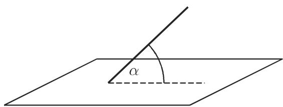  
3.48

#### 3.3.2 棱角、隅角、立体角

(1) 棱角或二面角是从同一条直线出发的两个半平面形成的图形（图 3.49)．在日常用语中，棱这个字是指两个半平面的交线．我们用平面棱角ABC 来度量二面角，它是位千两个半平面并在点 与交线DE垂直的两条半直线之间的夹角

(2) 隅角或多面角 OABCDE（图 3.50) 是由若干平面，即侧面形成的图形，它们过一个公共点即顶点 $O ,$ 并分别交千直线 OA,OB, ···.

  
3.49

  
图 3.50

界定同一侧面的两条直线形成一个平面角，而相邻的面则形成一个二面角．

如果两个多面体可以重叠，则它们彼此相等，即它们是全等的．此时对应的元素，即棱和顶点处的平面角一定重合．如果两个多而体在顶点处对应的元素相等，但它们具有相反的顺序则两个隅角不能重叠此时称它们为对称隅角，因为如图 3.51显示的那样，可以将它们放在彼此对称的位置

凸多面角完全位千它的每个面的一侧．

对每个凸多面体来说，平面角之和 $A O B + B O C + \cdots + E O A$ （图 3.50)于 $3 6 0 ^ { \circ }$

(3) 两个三面角如果有下列元素重合就是全等的：

．两个面和对应的二面角，

·一个面和属千它的两个二面角，

·按相同顺序排列的三个对应的面，

·按相同顺序排列的三个对应的二面角

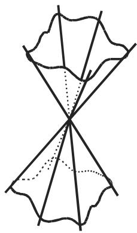  
3.51

  
3.52

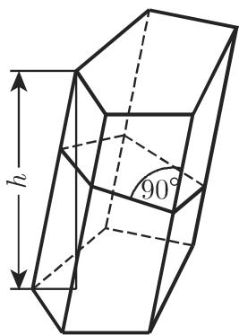  
3.53

(4) 立体角 从同一点出发（并与一条封闭曲线相截）的一束射线形成空间中的一个立体角（图 3.52)．它被记作 并由等式

$$
\varOmega = \frac {S}{r ^ {2}}\tag{3.115a}
$$

计算，这里 是指由立体角从一个半径为 r, 中心位千该立体角顶点的球切下来的一片球面．立体角的单位是球面度(sr):

$$
1 \mathrm{sr} = \frac {1 \mathrm{m} ^ {2}}{1 \mathrm{m} ^ {2}},\tag{3.115b}
$$

即一个 lsr 的立体角从单位球 $( \ r = 1 \mathrm { { m } ) }$ 切下来 $1 \mathrm { m } ^ { 2 }$ 面积的球面．

■ A: 全立体角是 $\varOmega = 4 \pi r ^ { 2 } / r ^ { 2 } = 4 \pi$

：一个具有顶角 $\alpha = 1 2 0 ^ { \circ }$ 的锥面定义（确定）了一个立体角

$$
\Omega = 2 \pi r ^ {2} \frac {1 - \cos {\frac {\alpha}{2}}}{r ^ {2}} = \pi ,
$$

其中用到了球冠 (3.163) 的公式．

#### 3.3.3 多面体

在这一节中我们将使用以下记号： 为体积， 为表面积， 为侧面积，高， $A _ { G }$ 为底面积．

(1) 多面体是由平面多边形所界的立体

(2) 棱柱（图 3.53) 是具有两个全等的底并且以平行四边形作为侧面的多面体，正棱柱是以正多边形作为底的直棱柱．对千棱柱成立以下公式：

$$
V = A _ {G} h,\tag{3.116}
$$

$$
M = p l,\tag{3.117}
$$

$$
S = M + 2 A _ {G},\tag{3.118}
$$

这里 $p$ 是与棱垂直的横截面周长， 是棱长． 如果棱仍彼此平行，但底不平行，则侧面是梯形．如果三角棱柱的底彼此不平行，则它的体积可以用下列公式计算（图 3.54):

$$
V = \frac {(a + b + c) Q}{3},\tag{3.119}
$$

其中 $Q$ 是垂直的横截面而积， $^ { a , }$ 是平行的棱之长．如果棱柱的底不平行，则其体积是

$$
V = l Q,\tag{3.120}
$$

其中 是连接两底重心的线段 $\overline { { B C } }$ 之长，而 则是与该线垂直的横截面面积．

(3) 平行六面体 是以平行四边形作为底的棱柱（图 3.55)，即它被六个平行四边形所界．在平行六面体中，全部四条空间对角线彼此交千同一点即它们的中点

  
3.54

  
3.55

  
3.56

(4) 长方体是以矩形为底的直角平行六面体在长方体中（图 3.56) ，空间对角线的长相等．如果 a, 是长方体的棱长， 是对角线长，则有

$$
d ^ {2} = a ^ {2} + b ^ {2} + c ^ {2},\tag{3.121}
$$

$$
V = a b c,\tag{3.122}
$$

$$
S = 2 (a b + b c + c a).\tag{3.123}
$$

(5) 立方体（或正六面体） 是具有相等棱长的长方体： $a = b = c , $

$$
d ^ {2} = 3 a ^ {2},\tag{3.124}
$$

$$
V = a ^ {3},\tag{3.125}
$$

$$
S = 6 a ^ {2}.\tag{3.126}
$$

(6) 棱锥（图 3.57) 是底为多边形，侧面为具有公共点即顶点的三角形的多面体如果从顶点到底 $A _ { G }$ 垂足位千底的中点则称它为直棱锥．如果直棱锥的底是一个正多边形（图 3.58) 并且当底是 边形时有 个侧面，则称它为正棱锥．棱锥连同底一起有 (n+1) 个面．对千其体积有公式

$$
V = \frac {A _ {G} h}{3}\tag{3.127}
$$

成立．关千正棱锥的侧面积有公式

$$
M = \frac {1}{2} p h _ {s}\tag{3.128}
$$

成立，其中 表示底的周长， $h _ { s }$ 表示一个侧面的高．

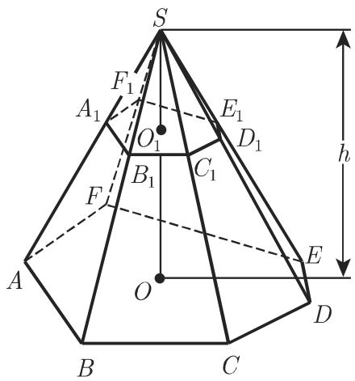  
3.57

  
3.58

  
3.59

(7) 平截头棱锥体或截棱锥 是顶被一个平行千底的平面截去的棱锥（图 3.57,3.59). 用 $\overline { { S O } }$ 示棱锥的高即从顶到底的垂线则有

$$
\frac {\overline {{S A}} _ {1}}{\overline {{A _ {1} A}}} = \frac {\overline {{S B}} _ {1}}{\overline {{B _ {1} B}}} = \frac {\overline {{S C}} _ {1}}{\overline {{C _ {1} C}}} = \ldots = \frac {\overline {{S O}} _ {1}}{\overline {{O _ {1} O}}},\tag{3.129}
$$

$$
\frac {\text {面积} A B C D E F}{\text {面积} A _ {1} B _ {1} C _ {1} D _ {1} E _ {1} F _ {1}} = \left(\frac {\overline {{S O}}}{\overline {{S O}} _ {1}}\right) ^ {2}\tag{3.130}
$$

成 $\underline { { \vec { \mathbf { \Pi } } } }$ ．如果 $A _ { D }$ 和 $A _ { G }$ 分别是上底和下底， $h$ 是截棱锥的高，即两底之间的距离，而$a _ { D }$ 和 $a _ { G }$ 是这两底对应的边，则有

$$
V = \frac {1}{3} h \left[ A _ {G} + A _ {D} + \sqrt {A _ {G} A _ {D}} \right] = \frac {1}{3} h A _ {G} \left[ 1 + \frac {a _ {D}}{a _ {G}} + \left(\frac {a _ {D}}{a _ {G}}\right) ^ {2} \right].\tag{3.131}
$$

正截棱锥的侧面积是

$$
M = \frac {p _ {D} + p _ {G}}{2} h _ {s},\tag{3.132}
$$

其中 $p _ { D }$ 和 $p _ { G }$ 是底的周长， $h _ { s }$ 儿是侧面的高

(8) 四面体是一个三角棱锥（图 3.60)．使用记号

$$
\overline {{O A}} = a, \quad \overline {{O B}} = b, \quad \overline {{O C}} = c, \quad \overline {{C A}} = q, \quad \overline {{B C}} = p, \quad \overline {{A B}} = r,
$$

则下列公式成立

$$
V ^ {2} = \frac {1}{2 8 8} \left| \begin{array}{c c c c c} 0 & r ^ {2} & q ^ {2} & a ^ {2} & 1 \\ r ^ {2} & 0 & p ^ {2} & b ^ {2} & 1 \\ q ^ {2} & p ^ {2} & 0 & c ^ {2} & 1 \\ a ^ {2} & b ^ {2} & c ^ {2} & 0 & 1 \\ 1 & 1 & 1 & 1 & 0 \end{array} \right|.\tag{3.133}
$$

  
3.60

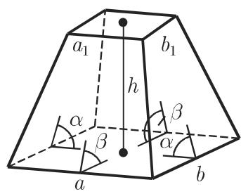  
3.61

  
3.62

(9) 方尖形 是所有侧面都是不规则四边形的多面体．在图 3.61 的特殊情形中，两平行的底是矩形，相对的棱与底成相同的倾角，但它们没有公共点．如果 $a , b$ 和$a _ { 1 } , b _ { 1 }$ 是该方尖形两个底的边 是它的高，则有

$$
V = \frac {h}{6} \left[ (2 a + a _ {1}) b + (2 a _ {1} + a) b _ {1} \right] = \frac {h}{6} \left[ a b + (a + a _ {1}) (b + b _ {1}) + a _ {1} b _ {1} \right].\tag{3.134}
$$

(10) 是底为矩形的一个多面体，其侧面是两个相对的等腰三角形和两个相对的等腰梯形（图 3.62)．关千它的体积有公式

$$
V = \frac {1}{6} (2 a + a _ {1}) b h.\tag{3.135}
$$

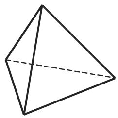  
(a)

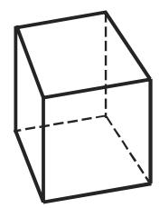  
(b)

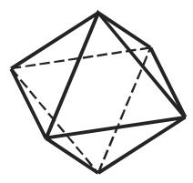  
(c)  
3.63

  
(d)

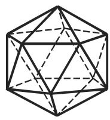  
(e)

(11) 正多面体 具有全等的正多边形作为界面并具有全等的正则隅角．图 3.63中表示的是五种可能的正多面体；表 3.7 显示的是相应数据．

(12) 欧拉关于多面体的定理 如果 是一个凸多而体的顶点数， 是面数，是棱数，则

$$
e - k + f = 2.\tag{3.136}
$$

例子由表 3.7 给出．

3.7 棱长为 的正多面体的有关数据

<table><tr><td>名称</td><td>面的数目和形状</td><td>棱数</td><td>顶点数</td><td>表面积  $\frac{S}{a^2}$ </td><td>体积  $\frac{V}{a^3}$ </td></tr><tr><td>正四面体</td><td>4个正三角形</td><td>6</td><td>4</td><td> $\sqrt{3}=1.7321$ </td><td> $\frac{\sqrt{2}}{12}=0.1179$ </td></tr><tr><td>立方体</td><td>6个正方形</td><td>12</td><td>8</td><td>6=6.0</td><td>1=1.0</td></tr><tr><td>正八面体</td><td>8个正三角形</td><td>12</td><td>6</td><td> $2\sqrt{3}=3.4641$ </td><td> $\frac{\sqrt{2}}{3}=0.4714$ </td></tr><tr><td>正十二面体</td><td>12个正五边形</td><td>30</td><td>20</td><td> $3\sqrt{5(5+2\sqrt{5})}=20.6457$ </td><td> $\frac{15+7\sqrt{5}}{4}=7.6631$ </td></tr><tr><td>正二十面体</td><td>20个正三角形</td><td>30</td><td>12</td><td> $5\sqrt{3}=8.6603$ </td><td> $\frac{5(3+\sqrt{5})}{12}=2.1817$ </td></tr></table>

#### 3.3.4 由曲面所界的立体

在这一节中我们将使用以下记号： 为体积， 为表面积， 为侧面积，高， $A _ { G }$ 为底面积

(1) 柱面可以通过一条直线即母线沿一条曲线即所谓准线平移得到（图 3.64).

(2) 柱体 是由具有一条封闭准线的柱面和该柱面从两个平行平面截出的两个平行的底所界的立体．对千每个底的周长为 $p ,$ ，垂直千母线的横截面周长为 ，面积为 $Q ,$ ，母线长为 的任意柱体（图 3.65)，以下公式成立：

$$
V = A _ {G} h = Q l,\tag{3.137}
$$

$$
M = p h = s l.\tag{3.138}
$$

(3) 直圆柱 以圆作为底并且其母线垂直千圆面（图 3.66)．设底半径为 ，则有

$$
V = \pi R ^ {2} h,\tag{3.139}
$$

$$
M = 2 \pi R h,\tag{3.140}
$$

$$
S = 2 \pi R (R + h).\tag{3.141}
$$

(4) 斜截圆柱（图 3.67)

$$
V = \pi R ^ {2} \frac {h _ {1} + h _ {2}}{2},\tag{3.142}
$$

$$
\begin{array}{c} M = \pi R \left(h _ {1} + h _ {2}\right), \\ S = \pi R \left[ h _ {1} + h _ {2} + R + \sqrt {R ^ {2} + \left(\frac {h _ {2} - h _ {1}}{2}\right) ^ {2}} \right]. \end{array}\tag{3.143}
$$

(3.144)

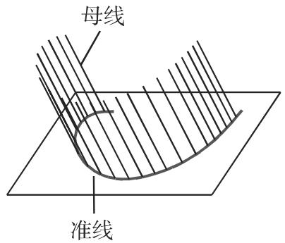  
3.64

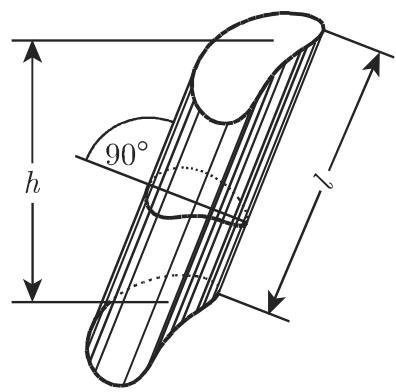  
3.65

  
3.66

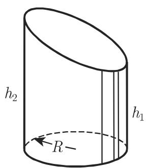  
3.67

(5) 柱段应用图 3.68 的记号，设 $\alpha = \varphi / 2$ 并以弧度记则有

$$
\begin{array}{r l} & V = \frac {h}{3 b} \left[ a (3 R ^ {2} - a ^ {2}) + 3 R ^ {2} (b - R) \alpha \right] \\ & \quad = \frac {h R ^ {3}}{b} \left(\sin \alpha - \frac {\sin^ {3} \alpha}{3} - \alpha \cos \alpha\right), \\ & M = \frac {2 R h}{b} \left[ (b - R) \alpha + a \right], \end{array}\tag{3.145}
$$

(3.146)

其中当 $b > R , \varphi > \pi$ 时公式仍成立．

  
3.68

  
3.69

(6) 空心圆柱 应用记号 表示外半径， 表示内半径 $\delta { = } R - r$ 表示两半径之差， $\rho = \frac { R + r } { 2 }$ 表示两半径的平均值（图 3.69)，则有

$$
V = \pi h (R ^ {2} - r ^ {2}) = \pi h \delta (2 R - \delta) = \pi h \delta (2 r + \delta) = 2 \pi h \delta \varrho .\tag{3.147}
$$

(7) 锥面 是由一条直线即母线沿一条曲线即准线移动使得该直线总是通过一个定点即顶点而产生的（图 3.70).

(8) 锥（图 3.71) 是由具有一条封闭准线的锥面和该锥面从一个平面截出的底所界的立体对千任意一个锥，则有

$$
V = \frac {h A _ {G}}{3}.\tag{3.148}
$$

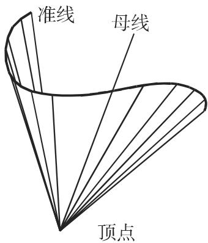  
3.70

  
3.71

(9) 直圆锥 以圆作为底而其顶点在该圆上方正对着圆心（图 3.72)．以 表示母线长， 表示底圆半径，则有

$$
V = \frac {1}{3} \pi R ^ {2} h,\tag{3.149}
$$

$$
M = \pi R l = \pi R \sqrt {R ^ {2} + h ^ {2}},\tag{3.150}
$$

$$
S = \pi R (R + l).\tag{3.151}
$$

(10) 直锥台或截锥（图 3.73)

$$
l = \sqrt {h ^ {2} + (R - r) ^ {2}},\tag{3.152}
$$

$$
M = \pi l (R + r),\tag{3.153}
$$

$$
V = \frac {\pi h}{3} \left(R ^ {2} + r ^ {2} + R r\right),\tag{3.154}
$$

$$
H = h + \frac {h r}{R - r}.\tag{3.155}
$$

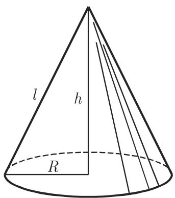  
3.72

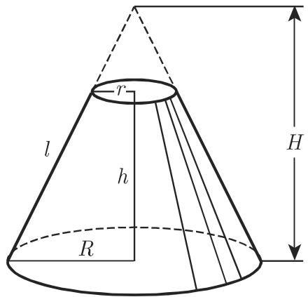  
3.73

(11) 圆锥截面 参见第 277 3.5.2.11.

(12) 球（图 3.74) 具有半径 和直径 $D = 2 R .$ 其与任一平面的截线都是圆．过球心的平面产生的截线是半径为 的大圆（参见第 213 3.4.1.1)．如果球面上的两个点不是同一条直径的端点那么只能有一个大圆适合通过它们．球面上两点在球面上的最短连线是它们之间的大圆弧（参见第 213 3.4.1.1).

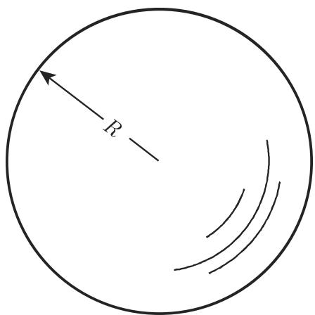  
3.74

涉及球的表面积和体积的公式如下：

$$
S = 4 \pi R ^ {2} \approx 1 2. 5 7 R ^ {2},\tag{3.156a}
$$

$$
S = \pi D ^ {2} \approx 3. 1 4 2 D ^ {2},\tag{3.156b}
$$

$$
S = \sqrt [ 3 ]{3 6 \pi V ^ {2}} \approx 4. 8 3 6 \sqrt [ 3 ]{V ^ {2}},\tag{3.156c}
$$

$$
V = \frac {4}{3} \pi R ^ {3} \approx 4. 1 8 9 R ^ {3},\tag{3.157a}
$$

$$
V = \frac {\pi D ^ {3}}{6} \approx 0. 5 2 3 6 D ^ {3},\tag{3.157b}
$$

$$
V = \frac {1}{6} \sqrt {\frac {S ^ {3}}{\pi}} \approx 0. 0 9 4 0 3 \sqrt {S ^ {3}},\tag{3.157c}
$$

$$
R = \frac {1}{2} \sqrt {\frac {S}{\pi}} \approx 0. 2 8 2 1 \sqrt {S},\tag{3.158a}
$$

$$
R = \sqrt [ 3 ]{\frac {3 V}{4 \pi}} \approx 0. 6 2 0 4 \sqrt [ 3 ]{V}.\tag{3.158b}
$$

(13) 球心角体（图 3.75)

$$
S = \pi R (2 h + a),\tag{3.159}
$$

$$
V = \frac {2 \pi R ^ {2} h}{3}.\tag{3.160}
$$

(14) 球冠（图 3.76)

$$
a ^ {2} = h (2 R - h),\tag{3.161}
$$

$$
V = \frac {1}{6} \pi h (3 a ^ {2} + h ^ {2}) = \frac {1}{3} \pi h ^ {2} (3 R - h),\tag{3.162}
$$

$$
M = 2 \pi R h = \pi \left(a ^ {2} + h ^ {2}\right),\tag{3.163}
$$

$$
S = \pi (2 R h + a ^ {2}) = \pi (h ^ {2} + 2 a ^ {2}).\tag{3.164}
$$

  
3.75

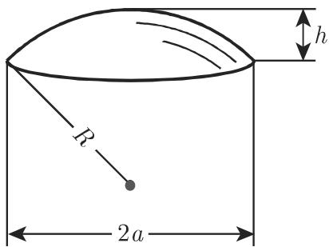  
3.76

(15) 球层（图 3.77)

$$
R ^ {2} = a ^ {2} + \left(\frac {a ^ {2} - b ^ {2} - h ^ {2}}{2 h}\right) ^ {2},\tag{3.165}
$$

$$
V = \frac {1}{6} \pi h \left(3 a ^ {2} + 3 b ^ {2} + h ^ {2}\right),\tag{3.166}
$$

$$
M = 2 \pi R h,\tag{3.167}
$$

$$
S = \pi (2 R h + a ^ {2} + b ^ {2}).\tag{3.168}
$$

如果 $V _ { 1 }$ 是内接千球层的截锥（图 3.78) 的体积， 是它的母线长，则有

$$
V - V _ {1} = \frac {1}{6} \pi h l ^ {2}.\tag{3.169}
$$

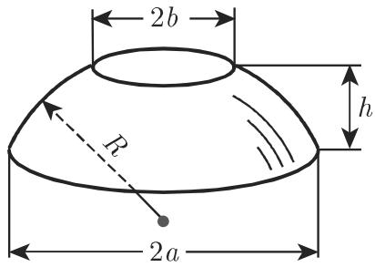  
3.77

  
3.78

(16) 环面（图 3.79) 是一个圆绕位千它所在平面且不与该圆相交的一个轴旋转产生的立体

$$
S = 4 \pi^ {2} R r \approx 3 9. 4 8 R r,\tag{3.170a}
$$

$$
S = \pi^ {2} D d \approx 9. 8 7 0 D d,\tag{3.170b}
$$

$$
V = 2 \pi^ {2} R r ^ {2} \approx 1 9. 7 4 R r ^ {2},\tag{3.171a}
$$

$$
V = \frac {1}{4} \pi^ {2} D d ^ {2} \approx 2. 4 6 7 D d ^ {2}.\tag{3.171b}
$$

(17) 桶状体（图 3.80) 由母曲线旋转产生；圆桶状体是由圆弧旋转形成的，抛物桶状体是由抛物线段旋转形成的．对千圆桶状体有下列近似公式成立：

$$
V \approx 0. 2 6 2 h \left(2 D ^ {2} + d ^ {2}\right)\tag{3.172a}
$$

或

$$
V \approx 0. 0 8 7 3 h (2 D + d) ^ {2},\tag{3.172b}
$$

而对千抛物桶状体，则有

$$
V = \frac {\pi h}{1 5} \left(2 D ^ {2} + D d + \frac {3}{4} d ^ {2}\right) \approx 0. 0 5 2 3 6 h \left(8 D ^ {2} + 4 D d + 3 d ^ {2}\right).\tag{3.173}
$$

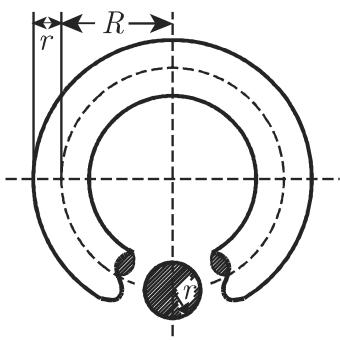  
3.79

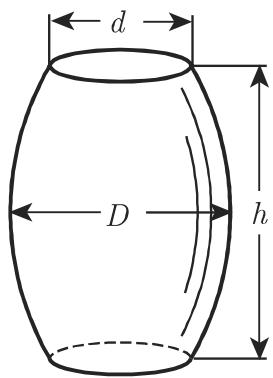  
3.80  
3.4 球面三角学

由千大地测量跨越很长的距离，所以必须要考虑地球的球形这一因素．千是球面儿何学就成为必需特别是，人们需要球面三角形（即位千球面上的三角形）的公式．古希腊人也认识到了这一点所以除平面三角学外还发展了球面三角学，现在人们公认球面儿何学的创始人是希帕科斯（约公元前 150 年）．
