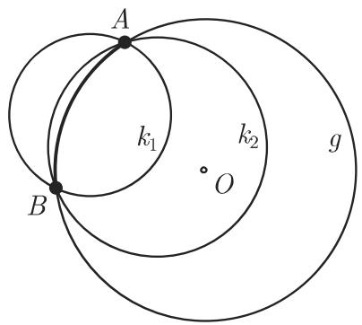
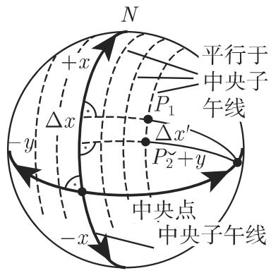
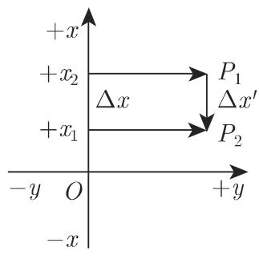
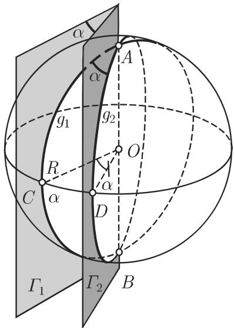
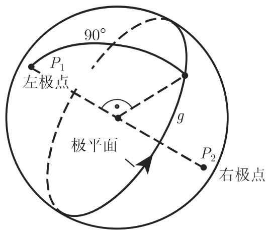
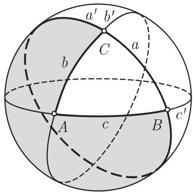
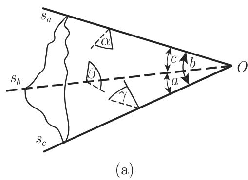
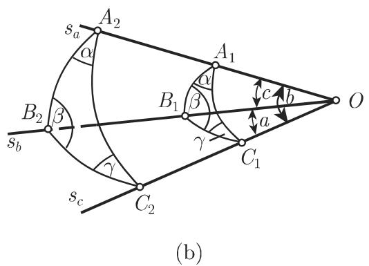

#### 3.4.1 球面几何学的基本概念

3.4.1.1 球面上的曲线、弧和角

1. 球面曲线、大圆和小圆

球面上的曲线称为球面曲线重要的球面曲线有大圆和小圆它们是穿过球的平面即所谓的截割平面截出的相交圆（图 3.81).

如果半径为 的球被与球心 距离为 的平面 所截，则相交圆的半径满足

$$
r = \sqrt {R ^ {2} - h ^ {2}} \quad (0 \leqslant h \leqslant R).\tag{3.174}
$$

当 $h = 0$ 时，截割平面穿过球心， 取最大可能的值在这一情形，平而 中的相交称为大圆．任何其他的相交圆都有 $0 < h < R$ 称为小圆，例如图 3.81 中的圆．当 $h = R$ 时平面 和球只有一个公共点．这时它称为切平面

  
3.81

·在地球上，赤道和子午线及其相对子午线 它们是子午线关千地球自转轴的反射 表示大圆平行的纬线是小圆（参见第 215 3.4.1.2,1.).

2. 球面距离

通过球面上不是相对点（即它们不是同一直径的端点）的两点 ，可以画出无穷多个小圆但仅有一个大圆（和大圆 $g$ 所在平面）．考虑通过 的两个小圆 $\boldsymbol { k } _ { 1 } , \boldsymbol { k } _ { 2 }$ 并将它们旋转入通过 的大圆平面中（图 3.82)．大圆具有最大的半径，从而有最小的曲率因此大圆较短的弧就是 之间的最短连线．它也是球面上 A,B 两点之间的最短连线称为球面距离．

3. 测地线

测地线是曲面上两点之间的最短连线（参见第 359 3.6.3.6).

·平面上的直线球面上的大圆都是测地线（也见第 215 3.4.1.2,1.).

4. 球面距离的度量

两点的球面距离可以表示成长度也可以表示成角度（图 3.83).

  
3.82

  
3.83

(1) 作为角度的球面距离 是在球心 处所测的半径 $\overline { { O A } }$ 和 $\overline { { O B } }$ 之间的角．这个角唯一确定了该球面距离，以下将用小写拉丁字母表示它．这一记号可以用在球心处或大圆弧上．

(2) 作为长度的球面距离 之间大圆弧的长．我们用 $\widehat { A B }$ （弧 AB)来标记．

(3) 角度与长度之间的换算 可以用以下公式来做：

$$
\widehat {A B} = R \operatorname{arc} e = R \frac {e}{\varrho},\tag{3.175a}
$$

$$
e = \widehat {A B} \frac {\varrho}{R}.\tag{3.175b}
$$

这里 $e$ 表示用度给出的角， arc 表示用弧度给出的角（参见第 170 3.1.1.5度）．换算因子 $\dot { \varrho }$ 等千

$$
\varrho = 1 \mathrm{rad} = \frac {1 8 0 ^ {\circ}}{\pi} = 5 7. 2 9 5 8 ^ {\circ} = 3 4 3 8 ^ {\prime} = 2 0 6 2 6 5 ^ {\prime \prime}.\tag{3.175c}
$$

距离作为长度和角度来确定是等价的，但在球面三角学中球面距离大多数情况下是以角度给出的．

■ A: 对千地球表面的球而计算通常考虑和克拉索夫斯基 (Krassowski) 双轴参考椭球同样体积的一个球．该地球半径是 $R = 6 3 7 1 . 1 1 0 \ \mathrm { k m }$ 因此有 $1 ^ { \circ } \overset { \wedge } { = } 1 1 1 . 2 \ \mathrm { k m }$ 7$1 ^ { \prime } = 1 8 5 3 . 3 ~ \mathrm { m } = 1$ 旧海里．今天 $\mathrm { 1 ~ n ~ m i l e = 1 8 5 2 ~ m }$

：德累斯顿与圣彼得堡之间的球面距离是 $\widehat { A B } = 1 4 3 3 ~ \mathrm { k m }$ 或

$$
e = \frac {1 4 3 3 \mathrm{km}}{6 3 7 1 \mathrm{km}} 5 7. 3 ^ {\circ} = 1 2. 8 9 ^ {\circ} = 1 2 ^ {\circ} 5 3 ^ {\prime}.
$$

5. 交叉角、航向角、方位角

两条球面曲线之间的交叉角是在交点 $P _ { 1 }$ 处它们的切线之间的夹角．如果其中之一是子午线那么与从 $P _ { 1 }$ 点起朝北的曲线段形成的交叉角 在导航中称为航向角为了区别偏向东的曲线和偏向西的曲线按照图 3.84(a), (b) 指派给航向角一个符号，并将其限制在区间 $- 9 0 ^ { \circ } < \alpha \leqslant 9 0 ^ { \circ }$ 内．因此航向角是一个有向角，即它具有符号．就其含义来说，它与曲线的定向无关

如图 3.84(c) $P _ { 1 }$ 到 $P _ { 2 }$ 的曲线的定向可以用方位角 来描述：它是通过$P _ { 1 }$ 的子午线的北半部分与从 $P _ { 1 }$ 到 $P _ { 2 }$ 的曲线之间的交叉角方位角被限制在区间$0 ^ { \circ } \leqslant \delta < 3 6 0 ^ { \circ }$ 内．

  
3.84

评论 在导航中位置坐标通常以六十进度数给出；球面距离，航向角和方位角则以十进度数给出．

3.4.1.2 特殊坐标系

1. 地理坐标

为了确定地球表面的点 P, 需要使用地理坐标（图 3.85)，即具有地球半径的球面坐标地理经度入和地理纬度 $\varphi$

为了确定经度度数，人们将地球表面用从北极到南极的半大圆即所谓子午线进行划分零子午线通过格林尼治天文台．由此出发人们借助 180 条子午线算出东经同样借助 180 条子午线算出西经．在赤道它们彼此相距 111 km. 在给出东经时采用正值，西经则用负值给出．因此 $- 1 8 0 ^ { \circ } \leqslant \lambda \leqslant 1 8 0 ^ { \circ }$

  
3.85

为了确定纬度，人们将地球表面用平行千赤道的小圆进行划分．从赤道开始向北算出 90 个纬度，即北向纬度差，同样算出 90 个南纬度．北纬取正值，南纬取负

值因此— $- 9 0 ^ { \circ } \leqslant \varphi \leqslant 9 0 ^ { \circ }$

2. 佐德纳坐标

在大范围测量中直角佐德纳 (Soldner) 坐标和高斯—克吕格坐标是重要的．为了将弯曲的地球表面部分映射到平面中的直角坐标系，在纵坐标方向保持距离，按照佐德纳的做法，需要将 轴放置在一条子午线（称为中央子午线）上，原点置千测量好的中央点（图 3.86(a)）．点 的纵坐标 和过 点的球面正交曲线（大圆）在中央子午线上的垂足之间的弧段．点 的横坐标 和过中央点的主纬线之间的圆弧段，其中该圆位千与中央子午线平行的一个平面内（图 3.86(b)).

  
(a)

  
(b)  
3.86

如果将球面横坐标和纵坐标转换成平面坐标系，那么线段 $\Delta x$ 将被拉伸并且方向发生改变．在横坐标方向上的伸长系数

$$
a = \frac {\Delta x}{\Delta x ^ {\prime}} = 1 + \frac {y ^ {2}}{2 R ^ {2}}, \quad R = 6 3 7 1 \mathrm{km}.\tag{3.176}
$$

为了调节拉伸，坐标系在中央子午线两侧的延伸不能超过 64 km. $y =$ 64 km km 长的线段具有 0.05 的伸长量．

3. 高斯—克吕格坐标

为了将弯曲的地球表面部分保角（保形）映射到平面上，在高斯－克吕格坐标系中首先要划分出子午线带．对德国来说这些中央子午线在东经 $6 ^ { \circ }$ $9 ^ { \circ }$ $1 2 ^ { \circ }$ 和 $1 5 ^ { \circ }$ （图 3.87(a)）．每个子午线带坐标系的原点位千中央子午线和赤道的交点处．在南北方向要考虑全部范围在东西方向则限制在两侧 1°40' 宽的带内．在德国它大约相当千土100 km. 重叠部分是 $2 0 ^ { \prime }$ ，这里近似千 20 km.

横坐标方向上的伸长系数（图 3.87(b) ）与在佐德纳坐标系 (3.176) 中一样．为保持保角映射，需要将 的量加到纵坐标：

$$
b = \frac {y ^ {3}}{6 R ^ {2}}.\tag{3.177}
$$

  
(a)

  
3.87

3.4.1.3 球面新月形或二角形

假设有两个平面 $T _ { 1 }$ 和 $T _ { 2 }$ 过球的直径的端点 并围成一个角 $\alpha$ （图 3.88)，由此确定两个大圆 $g _ { 1 }$ 和 $g _ { 2 }$ . 球面被两个大圆一半所界的部分称为球面新月形或球面二角形．球面二角形的两边由大圆上 之间的球面距离定义，两者都是 $1 8 0 ^ { \circ }$

  
3.88

二角形的角定义为大圆 g1 $g _ { 1 }$ $g _ { 2 }$ 在点 处切线之间的夹角．它们与平面$\varGamma _ { 1 }$ 和 $\varGamma _ { 2 }$ 间所谓的二面角 $\alpha$ 相同如果 之间两个大圆弧的平分点则角 $\alpha$ 可以表示成 $C$ 之间的球面距离．球面二角形的面积 $A _ { b }$ 随着记变到 $3 6 0 ^ { \circ }$ 而与球的表面积成正比．因此这个面积是

$$
A _ {b} = \frac {4 \pi R ^ {2} \alpha}{3 6 0 ^ {\circ}} = \frac {2 R ^ {2} \alpha}{\varrho} = 2 R ^ {2} \operatorname{arc} \alpha ,\tag{3.178}
$$

这里 $\varrho$ 是如 (3.175c) 中的换算因子．

3.4.1.4 球面三角形

考虑球面上不在同一大圆上的三点 A,B c. 将它们用大圆弧两两相连则得

到一个球面三角形 ABC（图 3.89).

该三角形的边定义为点之间的球面距离，即它们表示半径 ${ \overline { { O A } } } , { \overline { { O B } } }$ 和 $\overline { { O C } }$ 之间在球心处的夹角．将它们记作 $a , b$ 和 $c ,$ 并在以下用角的度量给出，而不管它们表示为球心处的夹角还是球面上的大圆弧球面三角形的三个角是三个大圆平面两两之间的夹角，记作a,(3 'Y.

球面三角形的顶点边和角的记号顺序遵从与平面三角形一样的模式．一个球面三角形如果至少有一个边等千 $9 0 ^ { \circ }$ ，则称为直边三角形．也存在着与平面直角三角形类似的球面直角三角形

3.4.1.5 极三角形

1. 极点和极平面

球直径的端点 $P _ { 1 }$ 和 $P _ { 2 }$ 称为极点，与该直径垂直的大圆 $g$ 所在平面称为极平面（图 3.90)．极点与大圆 上任一点之间的球面距离都是 $9 0 ^ { \circ }$ . 极平面的方向是任意定义的：沿选取方向横穿极平面，左侧为左极点右侧为右极点．

  
3.89

  
3.90

2. 极三角形

一个已知球面三角形ABC的极三角形 $A ^ { \prime } B ^ { \prime } C ^ { \prime }$ 是这样一个球面三角形，使得对其边（所在的大圆）而言原来三角形的顶点是极点（图 3.91)．对千每个球面三角AB＠邵存在一个极三角形 $A ^ { \prime } B ^ { \prime } C ^ { \prime }$ ．如果三角形 $A ^ { \prime } B ^ { \prime } C ^ { \prime }$ 是球面三角形ABC极三角形，那么三角形ABO也是三角形 $A ^ { \prime } B ^ { \prime } C ^ { \prime }$ 的极三角形．球面三角形的角与其极三角形相应的边是互补的角，而球面三角形的边与其极三角形相应的角也是互补的角．

$$
a ^ {\prime} = 1 8 0 ^ {\circ} - \alpha , b ^ {\prime} = 1 8 0 ^ {\circ} - \beta , c ^ {\prime} = 1 8 0 ^ {\circ} - \gamma ,\tag{3.179a}
$$

$$
\alpha^ {\prime} = 1 8 0 ^ {\circ} - a, \quad \beta^ {\prime} = 1 8 0 ^ {\circ} - b, \quad \gamma^ {\prime} = 1 8 0 ^ {\circ} - c.\tag{3.179b}
$$

  
3.91

3.4.1.6 欧拉三角形与非欧拉三角形

一个球面三角形的顶点 A,B,C 将每个大圆分成两个（通常是不同的）部分．因此存在着若干具有相同顶点的不同三角形，例如，图 3.92(a) 中具有边 $a ^ { \prime } , b , c$ 和阴影面的三角形．根据欧拉定义应该总是选取小千 $1 8 0 ^ { \circ }$ 的弧作为球面三角形的边这对应千作为顶点之间球面距离的边的定义．在这种情况下，所有边和角都小于 $1 8 0 ^ { \circ }$ 的球面三角形称为欧拉三角形，否则称为非欧拉三角形．图 3.92(b) 中显示的是一个欧拉三角形和一个非欧拉三角形．

  
(a)

  
(b)  
3.92

3.4.1.7 三面角

这是由从顶点 出发的三条棱 $s _ { a } , s _ { b } , s _ { c }$ 形成的三面立体（图 3.93(a)）．角 a,b, 定义为该三面角的边它们中的每一个被两条棱所围．两条棱之间的区域称为该三面角的面三面角的角a,(3和？是面之间的夹角．如果三面角的顶点在球心 0,则它在球面上截出一个球面三角形（图 3.93(b)）．该球面三角形以及相应的三面角的边和角是一致的因此对一个三面角得到的每个定理对千相应的球面三角形都成立，反之亦然

  
3.93
