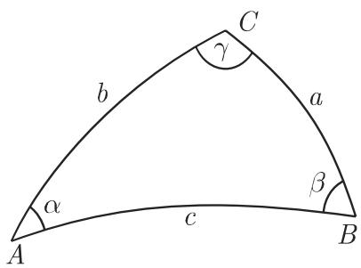
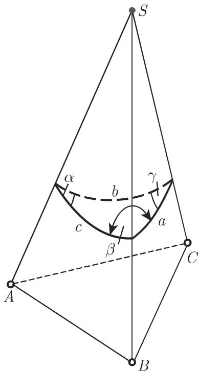
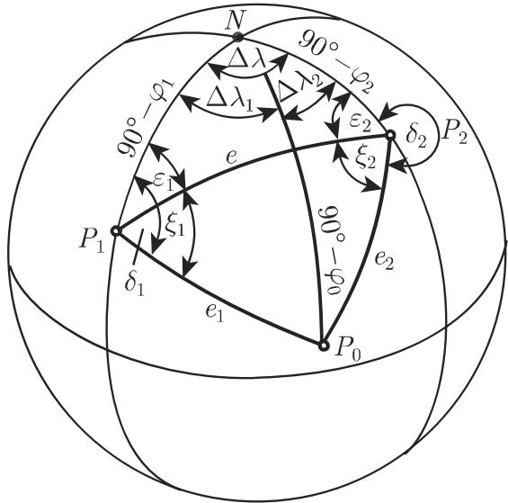
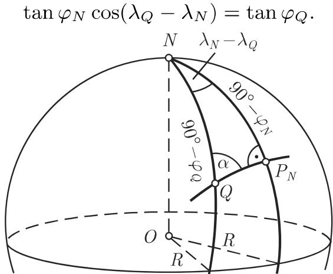
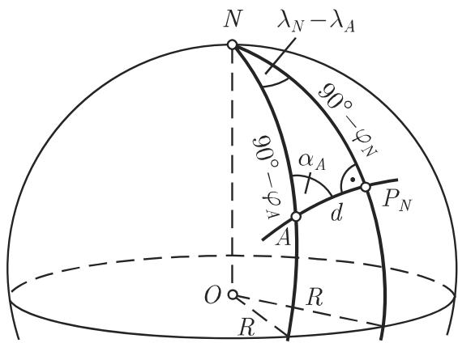
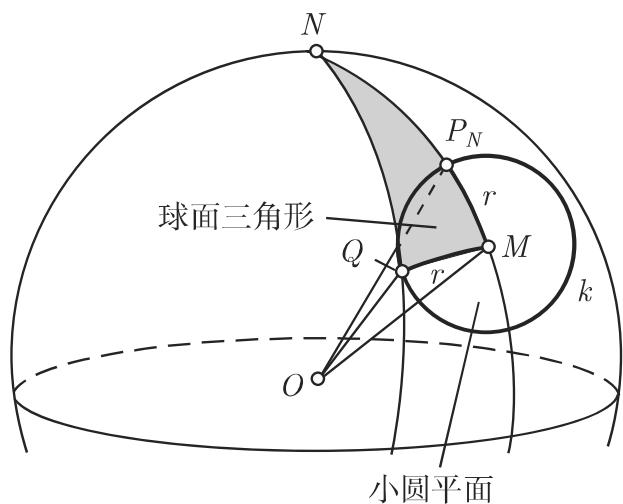
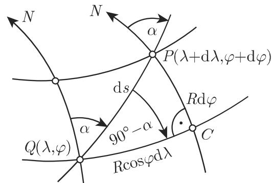

#### 3.4.3 球面三角形的计算

3.4.3.1 基本问题、精度评估

这里所谓的基本问题是指球面三角形计算中最常出现的各种情形．对千锐角球面三角形来说，有好儿种方法去求解每个基本问题，这取决千计算是否仅基千公式(3.187a) (3.191b) ，或者还基千公式 (3.192a) (3.201) ，以及只求该三角形的一个量还是多个量．

包含正切函数的公式在数值上可以得到更精确的结果，尤其是相比千该数值接近千 $9 0 ^ { \circ }$ 时用正弦函数确定它和该数值接近千 $0 ^ { \circ }$ 或 $1 8 0 ^ { \circ }$ 时用余弦函数确定它．对千欧拉三角形来说，用正弦定律计算的量有两个值，因为正弦函数在两个第一象限中都取正，而从其他函数得到的结果是唯一的

3.4.3.2 直角球面三角形

1. 专门公式

在直角球面三角形中至少有一个角是 $9 0 ^ { \circ }$ . 边和角的记法类似千平面直角三角形如果像图 3.96 那样社是一个直角，则边 称为斜边 $a$ 称为直角边叶昭称为侧角．对千 $\gamma = 9 0 ^ { \circ }$ 从等式 (3.187d) (3.191b) 推出：

$$
\sin a = \sin \alpha \sin c,\tag{3.202a}
$$

$$
\sin b = \sin \beta \sin c,\tag{3.202b}
$$

$$
\cos c = \cos a \cos b,\tag{3.202c}
$$

$$
\cos c = \cot \alpha \cot \beta ,\tag{3.202d}
$$

$$
\tan a = \cos \beta \tan c,\tag{3.202e}
$$

$$
\tan b = \cos \alpha \tan c,\tag{3.202f}
$$

$$
\tan b = \sin a \tan \beta ,\tag{3.202g}
$$

$$
\tan a = \sin b \tan \alpha ,\tag{3.202h}
$$

  
3.96

(3.202i)

(3.202j)

如果在一些问题中给定了其他的边或角，例如量 $b , \gamma , \alpha$ 而不是 $\alpha , \beta , \gamma ,$ ，则可以通过这些量的轮换得到必需的等式．对千直角球而三角形中的计算，通常从三个已知量 $( \gamma = 9 0 ^ { \circ }$ 和两个其他的量）开始．表 3.8 表示存在着的六个基本问题．

3.8 确定球面直角三角形中的量

<table><tr><td>基本问题</td><td>已知的确定量</td><td>确定其余的量所需公式的编号</td></tr><tr><td>(1)</td><td>斜边和一直角边 c, a</td><td>α (3.202a), β (3.202e), b (3.202c)</td></tr><tr><td>(2)</td><td>两直角边 a, b</td><td>α (3.202h), β (3.202g), c (3.202c)</td></tr><tr><td>(3)</td><td>斜边和一个角 c, α</td><td>a (3.202a), b (3.202f), β (3.202d)</td></tr><tr><td>(4)</td><td>一直角边和其上的角 a, β</td><td>c (3.202e), b (3.202j), α (3.202i)</td></tr><tr><td>(5)</td><td>一直角边和其所对的角 a, α</td><td>b (3.202h), c (3.202a), β (3.202i)</td></tr><tr><td>(6)</td><td>两个角 α, β</td><td>a (3.202i), b (3.202j), c (3.202d)</td></tr></table>

2. 纳皮尔法则

等式 (3.202a) (3.202j) 可以概括成纳皮尔法则．如果一个直角球面三角形的五个确定的量（不算直角）按它们在三角形中同样的顺序沿一个圆排列，并将直角边替换为它们的余角 $9 0 ^ { \circ } - a , 9 0 ^ { \circ } - b ($ （图 97)，则以下事实成立：

(1) 每个确定的量的余弦等千其相邻的量的余切值之积．

(2) 每个确定的量的余弦等千其不相邻的量的正弦值之积．

  
3.97

■ A: $\cos \alpha = \cot ( 9 0 ^ { \circ } - b ) \cot c = { \frac { \tan b } { \tan c } }$ 见 (3.202f)).

■ B: $\cos ( 9 0 ^ { \circ } - a ) = \sin$ c sin a = sin （见（3.202a)).

：将球的经纬线绘制在沿中央子午线与球相切的圆柱体上．该子午线与赤道构成了高斯—克吕格坐标系的坐标轴（图 3.98(a),(b)).

  
(a)

  
(b)  
3.98

球面上的一点 将对应千平面上的点 $P ^ { \prime }$ ．通过点 垂直千中央子午线的大圆 映射成垂直千 轴的一条直线 $g ^ { \prime }$ ，而过 点平行千给定子午线的小圆成为平行千 $x$ 轴的直线 $k ^ { \prime }$ （格网子午线）．通过 $P$ 点的子午线 的像不是直线而是一条曲线 $m ^ { \prime }$ （真实子午线）． $P ^ { \prime }$ ＇处 $m ^ { \prime }$ 的切线向上的方向给出地理北向， $k ^ { \prime }$ 向上的方向给出坐标系北向两个北向之间的夹角开 $\gamma .$ 为子午线收敛角．

在 $c = 9 0 ^ { \circ } - \varphi , b = \eta$ 的直角球面三角形 $Q P N ^ { \mathrm { { r } } }$ 中，可以从 $\alpha = 9 0 ^ { \circ } - \gamma$ 得到 $\dot { \gamma }$ .纳皮尔法则给出 $\cos \alpha = { \frac { \tan b } { \tan c } }$ 或 $\cos ( 9 0 ^ { \circ } - \gamma ) = { \frac { \tan \eta } { \tan ( 9 0 ^ { \circ } - \varphi ) } } , \sin \gamma = \tan \eta \tan \varphi .$ 因为计砌非常小，故可以认为 $\sin \gamma \approx \gamma , \tan \eta \approx \eta ;$ 千是 $\gamma = \eta \tan \varphi$ 成立．对千很小的距离 $\dot { \eta }$ 这个圆柱体图的长度偏差也非常小，因此可以替换 $\eta = \frac { y } { R }$ ，其中y是$P$ 的纵坐标．由此得 $\gamma = \left( \frac { y } { R } \right) \tan \varphi$ . 对千 $\varphi = 5 0 ^ { \circ } , y = 1 0 0$ 千米，得出子午线收敛角 $\gamma = 0 . 0 1 8 7 0 6$ 或将认从弧度转换成角度，得 $\gamma = 1 ^ { \circ } 0 4 ^ { \prime } 1 9 ^ { \prime \prime }$

3.4.3.3 斜球面三角形

对千三个已知量，要区分出六个基本问题，正如在直角球面三角形时所做的那样角的记号是 $\alpha , \beta , \gamma$ 勹，所对的边是 a, b, （图 3.99).

3.9～表 3.12 对应该用哪些公式来确定六个基本问题情形中的量进行了汇总问题 $3 \sim$ 问题 也可以通过将一般三角形分解为两个直角三角形来解为此对千问题 和问题 （图 3.100, 3.101) 可以使用从 AC 点处的球面垂线，而对千问题 和问题 （图 3.102) 则使用从 AB 点的垂线．

  
3.99

3.9 斜球面三角形的第一和第二基本问题

<table><tr><td>第一基本问题已知:3边a,b,c</td><td>第二基本问题已知:3角α,β,γ</td><td>WWW</td></tr><tr><td>条件:0°&lt;a+b+c&lt;360°,a+b&gt;c,a+c&gt;b,b+c&gt;a</td><td colspan="2">条件:180°&lt;α+β+γ&lt;540°,α+β&lt;180°+γ,α+γ&lt;180°+β,β+γ&lt;180°+α</td></tr><tr><td>解1:求α.cosα=cosa-cosbcocsinb sinc</td><td colspan="2">解1:求a.cosα=cosα+cosβcosγ或cot a/2=√cos(σ-β)cos(σ-γ),σ=α+β+γ.</td></tr><tr><td>解2:求α,β,γ.k=√sin(s-a)sin(s-b)sin(s-c)/sin s,tan α/2 = k/sin(s-a),tan β/2 = k/sin(s-b),tan γ/2 = k/sin(s-c).检验:(s-a)+(s-b)+(s-c)=s,tan α/2 tan β/2 tan γ/2 sin s=k</td><td colspan="2">解2:求a,b,c.k&#x27; = √cos(σ-α)cos(σ-β)cos(σ-γ)-cos σ cot a/2 = k&#x27;/cos(σ-α), cot b/2 = k&#x27;/cos(σ-β), cot c/2 = k&#x27;/cos(σ-γ).检验:(σ-α)+(σ-β)+(σ-γ)=σ,cot a/2 cot b/2 cot c/2 (-cos σ) = k&#x27;</td></tr></table>

  
3.100

  
3.101

  
3.102

3.10 斜球面三角形的第三基本问题

<table><tr><td colspan="2">第三基本问题已知:2边及其夹角,例如,a,b,γ</td></tr><tr><td colspan="2">条件:无</td></tr><tr><td>解1:求c,或c和α.</td><td></td></tr><tr><td>cos c = cos a cos b + sin a sin b cos γ,</td><td>tan α - β/2 = sin (a - b/2) / sin (a + b/2) cot γ/2</td></tr><tr><td>sin α = sin a sin γ/sin c.</td><td>(-90° &lt; α - β/2 &lt; 90°)</td></tr><tr><td>α可以位于象限I或II.</td><td></td></tr><tr><td>我们应用定理:</td><td>α = α + β/2 + α - β/2,β = α + β/2 - α - β/2.</td></tr><tr><td>较大的角所对的</td><td></td></tr><tr><td>边较大,或</td><td>解4:求α,β,c.</td></tr><tr><td>检验计算:</td><td></td></tr><tr><td>cos a - cos b cos c ≥ 0 → α在象限I.</td><td>tan α + β/2 = cos (a - b/2) / cos (γ/2) / cos (a + b/2) / sin (γ/2) = Z/N,</td></tr><tr><td>α在象限II.</td><td></td></tr><tr><td>解2:求α,或α和c.</td><td></td></tr><tr><td>tan u = tan a cos γ</td><td>tan α - β/2 = sin (a - b/2) / sin (γ/2) / sin (γ/2) = Z&#x27; / N&#x27;</td></tr><tr><td>tan α = tan γ sin u/sin(b - u)</td><td>(-90° &lt; α + β/2 &lt; 90°)</td></tr><tr><td>tan c = tan(b - u)/cos α.</td><td></td></tr><tr><td>解3:求α和(或)β.</td><td>α = α + β/2 + α - β/2,β = α + β/2 - α - β/2,</td></tr><tr><td>tan α + β/2 = cos (a - b/2) / cos (a + b/2) cot γ/2</td><td>cos (c/2) = Z/2 / sin (α + β/2),sin (c/2) = Z&#x27; / sin (α - β/2).</td></tr><tr><td colspan="2">检验:关于c的双重计算</td></tr></table>

在表 3.9 至表 3.12 的表头中，已知边和已知角分别用 表示例如 SWS的意思是：两边及其夹角是已知的．

四面体一个四面体具有底 ABC 和顶点 （图 3.103)．面ABS BCS 相互交成角 $\beta = 7 4 ^ { \circ } 1 8 ^ { \prime }$ BCS GAS 交成角 $\gamma = 6 3 ^ { \circ } \ 4 0 ^ { \prime }$ GAS ABS 交成角 $\alpha =$

$8 0 ^ { \circ } 0 0 ^ { \prime }$ ．问AS, OCS每两个棱之间的夹角有多大？

从围绕该棱锥顶点 的一个球面，三面角（图 3.103) 截出一个边为 $a , b ,$ 的球而三角形

侧面之间的夹角就是球面三角形的三个角，所求棱之间的夹角是球面三角形的边确定角 a, b, 对应千第二基本问题．由表 3.9 中的解

$$
\sigma = 1 0 8 ^ {\circ} 5 9 ^ {\prime}, \quad \sigma - \alpha = 2 8 ^ {\circ} 5 9 ^ {\prime}, \quad \sigma - \beta = 3 4 ^ {\circ} 4 1 ^ {\prime}, \quad \sigma - \gamma = 4 5 ^ {\circ} 1 9 ^ {\prime},
$$

$$
k ^ {\prime} = 1. 2 4 6 9 8 3, \quad \cot \left(\frac {a}{2}\right) = 1. 4 2 5 5 1 4, \quad \cot \left(\frac {b}{2}\right) = 1. 5 1 6 4 4 0,
$$

$$
\cot \left(\frac {c}{2}\right) = 1. 7 7 3 3 2 8.
$$

3.11 斜球面三角形的第四基本问题

<div class="mineru-algorithm" style="white-space: pre-wrap; font-family:monospace;">
第四基本问题
已知: 一边和两个邻角, 例如, $\alpha, \beta, c$ WSW

条件: 无

解 1: 求 $\gamma$ 或 $\gamma$ 和 $a$.
$\cos \gamma = -\cos \alpha \cos \beta + \sin \alpha \sin \beta \cos c$,
$\sin a = \frac{\sin c \sin \alpha}{\sin \gamma}$.

$a$ 可以位于象限 I 或 II.

我们应用定理: 较大的边所对的
角也较大, 或
检验计算:
$\cos \alpha + \cos \beta \cos \gamma \geqslant 0 \rightarrow \alpha$ 在象限 I.
$\alpha$ 在象限 II.

解 2: 求 $a$ 或 $a$ 和 $\gamma$.

$\cot \mu = \tan \alpha \cos c, \tan a = \frac{\tan c \cos \mu}{\cos (\beta - \mu)}$,

$\tan \gamma = \frac{\cot (\beta - \mu)}{\cos a}$.

解 3: 求 $a$ 和 (或) $b$.

$\tan \frac{a + b}{2} = \frac{\cos \frac{\alpha - \beta}{2}}{\cos \frac{\alpha + \beta}{2}} \tan \frac{c}{2}$,

$\tan \frac{a - b}{2} = \frac{\sin \frac{\alpha - \beta}{2}}{\sin \frac{\alpha + \beta}{2}} \tan \frac{c}{2}$

检验: 关于 $\gamma$ 的双重计算
</div>

3.12 斜球面三角形的第五和第六基本问题  
```txt
第五基本问题 SSW
已知：2 边和其中之一
所对的角，例如，a, b, α

第六基本问题 WWS
已知：2 角和其中之一
所对的边，例如，a, α, β

条件：见分情况讨论。

条件：见分情况讨论。

解：所求为任何缺失的量。

解：所求为任何缺失的量。

sin β = sin b sin α / sin a 可能有 2 个值 β₁, β₂.

sin b = sin a sin β / sin α 可能有 2 个值 b₁, b₂.

设 β₁ 是锐角而 β₂ = 180° - β₁ 是钝角.

设 b₁ 是锐角而 b₂ = 180° - b₁ 是钝角

分情况讨论：

1. sin b sin α / sin a > 1 0 个解.

1. sin a sin β / sin α > 1 0 个解.

2. sin b sin α / sin a = 1 1 个解 β = 90°.

2. sin a sin β / sin α = 1 1 个解 b = 90°.

3. sin b sin α / sin a < 1:

3.1. sin a > sin b:

3.1.1. b < 90° 1 个解 β₁.

3.1.2. b > 90° 1 个解 β₂.

3.1.2. sin a < sin b:

3.2. sin a < sin b:

3.2.1. a < 90°, α < 90° } 2 个解
a > 90°, α > 90° } β₁, β₂.

3.2.2. a < 90°, α > 90° } 0 个解.

3.2.2. a < 90°, α > 90° } a > 90°, α < 90° } 0 个解.

用一个角或用两个角 β 做进一步计算：

用一条边或用两条边 b 做进一步计算：
```

<table><tr><td>方法1</td><td colspan="2">方法2</td></tr><tr><td> $\tan u = \tan b \cos \alpha,$   $\tan v = \tan a \cos \beta,$   $c = u + v,$   $\cot \varphi = \cos b \tan \alpha,$   $\cot \psi = \cos a \tan \beta,$   $\gamma = \varphi + \psi$ </td><td> $\tan \frac{c}{2} = \tan \frac{a + b}{2} \frac{\cos \frac{\alpha + \beta}{2}}{\cos \frac{\alpha - \beta}{2}},$   $= \tan \frac{a - b}{2} \frac{\sin \frac{\alpha + \beta}{2}}{\sin \frac{\alpha - \beta}{2}}$ </td><td> $\tan \frac{\gamma}{2} = \cot \frac{\alpha + \beta}{2} \frac{\cos \frac{a - b}{2}}{\sin \frac{a + b}{2}},$   $= \cot \frac{\alpha - \beta}{2} \frac{\sin \frac{a - b}{2}}{\sin \frac{a + b}{2}}$ </td></tr><tr><td></td><td colspan="2">检验:关于 $\frac{c}{2}$ 和 $\frac{\gamma}{2}$ 的双重计算</td></tr></table>

  
3.103

无线电定向 在无线电定向的例子中，两个固定站点 $P _ { 1 } ( \lambda _ { 1 } , \varphi _ { 1 } )$ 和 $P _ { 2 } ( \lambda _ { 2 } , \varphi _ { 2 } )$ 接收一条船通过无线电波发射的方位角 $\delta _ { 1 }$ 和 $| \delta _ { 2 }$ （图 3.104)．这项任务就是要确定船的位置 $P _ { 0 }$ 的地理坐标．该问题在航海学中以岸对船定向著称，是球上的一种交会问题，解法上与平面中的交会问题类似（参见第 196 3.2.2.3).

  
3.104

(1) 三角形 $P _ { 1 } P _ { 2 } N$ 中的计算 在三角形 $P _ { 1 } P _ { 2 } N$ 中边 $P _ { 1 } N = 9 0 ^ { \circ } - \varphi _ { 1 } , P _ { 2 } N =$ $9 0 ^ { \circ } - \varphi _ { 2 }$ 和角主 $P _ { 1 } N P _ { 2 } { = } \lambda _ { 2 } { - } \lambda _ { 1 } { = } \Delta \lambda$ 已知．角 $\varepsilon _ { 1 } , \varepsilon _ { 2 }$ 和线段的 $P _ { 1 } P _ { 2 } = e$ 的计算对应千第三基本问题．

(2) 三角形 $P _ { \mathrm { 1 } } P _ { \mathrm { 2 } } P _ { \mathrm { 0 } }$ 。中的计算因为 $\xi _ { 1 } = \delta _ { 1 } - \varepsilon _ { 1 } , \xi _ { 2 } = 3 6 0 ^ { \circ } - ( \delta _ { 2 } + \varepsilon _ { 2 } )$ ，所以边 $e$ 及它上面的角 $\xi _ { 1 }$ 和 $\xi _ { 2 }$ 在 $P _ { 1 } P _ { 0 } P _ { 2 }$ 中是已知的．边 $e _ { 1 }$ 和 $e _ { 2 }$ 的计算，对应千第四基本问题，解 3. 点 $P _ { 0 }$ 的坐标可以从方位角和它到 $P _ { 1 }$ 或 $P _ { 2 }$ 的距离计算出来．

(3) 三角形 $N P _ { 1 } P _ { 0 }$ 。中的计算 在三角形 $N P _ { 1 } P _ { 0 }$ 中有已知的两条边 $\begin{array} { r l } { N P _ { 1 } } & { { } = } \end{array}$ $9 0 ^ { \circ } ~ - ~ \varphi _ { 1 }$ $P _ { 1 } P _ { 0 } = e _ { 1 }$ 及夹 $\delta _ { 1 }$ 釭边 $N P _ { 0 } = 9 0 ^ { \circ } - \varphi _ { 0 }$ 和角 $\Delta \lambda _ { 1 }$ 按照第三基本问题，解 计算为了检验，可以在三角形 $N P _ { 0 } P _ { 2 }$ 中再次计算 $N P _ { 0 } = 9 0 ^ { \circ } \ - \ \varphi _ { 0 }$ '有 $\Delta \lambda _ { 2 }$ ．千是， $P _ { 0 }$ 的经度 $\lambda _ { 0 } = \lambda _ { 1 } + \Delta \lambda _ { 1 } = \lambda _ { 2 } - \Delta \lambda _ { 2 }$ 和纬度 $\varphi _ { 0 }$ 就知道了．

3.4.3.4 球面曲线

球面三角学在航海中有非常重要的应用．一个基本问题是确定航向角，它给出最优的航线其他的应用领域是大地勘测以及机器人运动设计．

1. 大圆航线

(1) 概念球表面的测地线 它是曲线，是连接 两点的最短路被称为大圆航线或大圆（参见第 213 3.4.1.1, 3.).

(2) 大圆航线的方程沿大圆航线 除子午线和赤道外 运动需要航向角的连续变化．这些具有与位置有关的航向角 $\alpha$ 的大圆航线可以通过它们最接近北极的点 $P _ { N } ( \lambda _ { N } , \varphi _ { N } )$ 唯一给出，其中 $\varphi _ { N } > 0 ^ { \circ }$ . 大圆航线在最接近北极的点具有航向角 $\alpha _ { N } = 9 0 ^ { \circ }$ . 根据图 3.105 利用纳皮尔法则（参见第 227 3.4.3.2, 2. ），可以给出通过 $P _ { N }$ 和运行点 $Q ( \lambda _ { Q } , \varphi _ { Q } )$ （它与 $P _ { N }$ 的相对位置是任意的）的大圆航线方程，为

  
3.105

(3.203)

最接近北极的点 在点 $A ( \lambda _ { A } , \varphi _ { A } ) ~ ( \varphi _ { A } \neq 9 0 ^ { \circ } )$ 处具有航向角 $\alpha _ { A } ( \alpha _ { A } \neq 0 ^ { \circ } )$ 的大圆航线最接近北极的点 $P _ { N } ( \lambda _ { N } , \varphi _ { N } )$ 的坐标，可以根据图 3.106 考虑 $P _ { N }$ 的相对位置和 $\mathtt { J } _ { \alpha _ { A } }$ 的符号利用纳皮尔法则来计算：

$$
\varphi_ {N} = \arccos (\sin | \alpha_ {A} | \cos \varphi_ {A})\tag{3.204a}
$$

和

$$
\lambda_ {N} = \lambda_ {A} + \mathrm{sign} (\alpha_ {A}) \left| \arccos \frac {\tan \varphi_ {A}}{\tan \varphi_ {N}} \right|.\tag{3.204b}
$$

  
3.106

评论 如果计算出来的地理距离入不在－ $. 1 8 0 ^ { \circ } < \lambda \ \leqslant \ 1 8 0 ^ { \circ }$ 内，则对千 $\lambda \neq$ $\pm \boldsymbol { k } \cdot 1 8 0 ^ { \circ } \ : \ : ( \boldsymbol { k } \in \mathbb { N } )$ 简化的地理距离 $\lambda _ { \mathrm { { r e d } } }$ 是

$$
\lambda_ {\mathrm{red}} = 2 \arctan \left(\tan \frac {\lambda}{2}\right).\tag{3.205}
$$

这称为角在定义域内的简化．

与赤道的交点大圆航线与赤道的交点 $P _ { \mathrm { E } _ { 1 } } ( \lambda _ { \mathrm { E } _ { 1 } } , 0 ^ { \circ } )$ 和 $P _ { \mathrm { E _ { 2 } } } ( \lambda _ { \mathrm { E _ { 2 } } } , 0 ^ { \circ } )$ 可以由(3.203) 计算，因为 $\tan \varphi _ { \mathrm { N } } \cos ( \lambda _ { \mathrm { E } } , - \lambda _ { N } ) = 0 ( \nu = 1 , 2 )$ 必须满足：

$$
\lambda_ {\mathrm{E} _ {\nu}} = \lambda_ {N} \mp 9 0 ^ {\circ} (\nu = 1, 2).\tag{3.206}
$$

评论 在某些情形中需要根据 (3.205) 来做角的简化

(3) 弧长 如果大圆航线通过点 $A ( \lambda _ { A } , \varphi _ { A } )$ 和 $B ( \lambda _ { B } , \varphi _ { B } )$ ，则由边的余弦定律得出球面距离 或两点之间的弧长：

$$
d = \arccos [ \sin \varphi_ {A} \sin \varphi_ {B} + \cos \varphi_ {A} \cos \varphi_ {B} \cos (\lambda_ {B} - \lambda_ {A}) ].\tag{3.207a}
$$

要是考虑地球半径 ，则这个圆心角可以换算成长度：

$$
d = \arccos [ \sin \varphi_ {A} \sin \varphi_ {B} + \cos \varphi_ {A} \cos \varphi_ {B} \cos (\lambda_ {B} - \lambda_ {A}) ] \cdot \frac {\pi R}{1 8 0 ^ {\circ}}.\tag{3.207b}
$$

(4) 航向角 使用边的正弦定律和余弦定律计算 $\mathrm { s i n } \alpha A$ 和 $\mathrm { c o s } \alpha _ { A }$ , 相除后给出航向角 $\alpha _ { A }$ 的最终结果：

$$
\alpha_ {A} = \arctan {\frac {\cos \varphi_ {A} \cos \varphi_ {B} \sin (\lambda_ {B} - \lambda_ {A})}{\sin \varphi_ {B} - \sin \varphi_ {A} \cos d}}.\tag{3.208}
$$

评论 利用公式 (3.207a), (3.208), (3.204a) (3.204b) ，对千由两点给出的大圆航线可以计算出最接近北极的点 $P _ { N }$ 的坐标．

(5) 与平行圆的交点 关千大圆航线与平行圆 $\varphi = \varphi _ { X }$ 的交点 $X _ { 1 } ( \lambda _ { X _ { 1 } } , \varphi _ { X } )$ 和$X _ { 2 } ( \lambda _ { X _ { 2 } } , \varphi _ { X } )$ ，我们从 (3.203)

$$
\lambda_ {X _ {\nu}} = \lambda_ {\mathrm{N}} \mp \arccos \frac {\tan \varphi_ {X}}{\tan \varphi_ {N}} (\nu = 1, 2).\tag{3.209}
$$

从对两个交角 $\alpha { _ { X _ { 1 } } }$ 和 $\alpha { X _ { 2 } }$ （在那里具有最接近北极的点 $P _ { N } ( \lambda _ { N } , \varphi _ { N } )$ 的大圆航线与平行圆 $\varphi = \varphi _ { X }$ 相交）所用的纳皮尔法则，得

$$
\left| \alpha_ {X _ {\nu}} \right| = \arcsin \frac {\cos \varphi_ {N}}{\cos \varphi_ {X}} \quad (\nu = 1, 2).\tag{3.210}
$$

对千最小的航向角 $\left| \alpha _ { \mathrm { m i n } } \right|$ 来说，反正弦函数的自变量一定是关千变量 $\varphi _ { X }$ 的极值由此得到： $\sin \varphi _ { X } = 0 \Rightarrow \varphi _ { X } = 0$ , 即航向角的绝对值在与赤道交点处最小：

$$
| \alpha_ {X _ {\mathrm{min}}} | = 9 0 ^ {\circ} - \varphi_ {N}.\tag{3.211}
$$

评论 (3.209) 的解仅当 $\vert \varphi _ { X } \vert \leqslant \varphi _ { N }$ 时存在．

评论 在某些情形中需要根据 (3.205) 进行角的简化．

(6) 与子午线的交点 根据 (3.203)，大圆航线与子午 $\lambda = \lambda _ { Y }$ 的交点 $Y ( \lambda _ { Y } , \varphi _ { Y } )$ 由下式给出

$$
\varphi_ {Y} = \arctan [ \tan \varphi_ {N} \cos (\lambda_ {Y} - \lambda_ {N}) ].\tag{3.212}
$$

2. 小圆

(1) 概念 这里，需要比在第 213 3.4.1.1 中更加精确的球面上小圆的定义：小圆是球面上与固定点 $M ( \lambda _ { M } , \varphi _ { M } )$ 的球面距离为 $r ( r < 9 0 ^ { \circ } )$ 的点的轨迹（图 3.107) ．用 表示小圆的球面中心 $\therefore r$ 称为小圆的球面半径

  
3.107

小圆平面是高为 的球冠的底（参见第 207 3.3.4)．球面中心 位千小圆平面上的小圆圆心上方在这个平面上小圆的平面半径是兀 $r _ { 0 } ($ （图 3.108)．因此，平行圆是具有 $\varphi _ { M } = \pm ~ 9 0 ^ { \circ }$ 的特殊小圆．

·当 $r \to 9 0 ^ { \circ }$ 时小圆趋向千大圆航线

(2) 小圆的方程 作为定义参数，要么使用 ，要么使用最接近北极的小圆上的点 $P _ { N } ( \lambda _ { N } , \varphi _ { N } )$ 和 r. 如果小圆上的运行点是 $Q ( \lambda , \varphi )$ ' 那么根据图 3.107利用关千边的余弦定律我们可以得到小圆的方程：

$$
\cos r = \sin \varphi \sin \varphi_ {M} + \cos \varphi \cos \varphi_ {M} \cos (\lambda - \lambda_ {M}).\tag{3.213a}
$$

因为 $\varphi _ { M } = \varphi _ { N } - r$ 且 $\lambda _ { M } = \lambda _ { N }$ 由此得

$$
\cos r = \sin \varphi \sin (\varphi_ {N} - r) + \cos \varphi \cos (\varphi_ {N} - r) \cos (\lambda - \lambda_ {N}).\tag{3.213b}
$$

  
3.108

■ A: 当 $\varphi _ { M } = 9 0 ^ { \circ }$ 时，因为 $\cos r = \sin \varphi \Rightarrow \sin ( 9 0 ^ { \circ } - r ) = \sin \varphi \Rightarrow \varphi$ =常数，所以由 (3.213a) 得到平行圆

■ B: $r \to 9 0 ^ { \circ }$ 时，由 (3.213b) 推出大圆航线．

(3) 弧长 小圆 上两点 $A ( \lambda _ { A } , \varphi _ { A } )$ 和 $B ( \lambda _ { B } , \varphi _ { B } )$ 之间的弧长 可以根据3.108 由等式 ${ \frac { s } { \sigma } } = { \frac { 2 \pi r _ { 0 } } { 3 6 0 ^ { \circ } } } , \cos d = \cos ^ { 2 } r + \sin ^ { 2 } r \cos \sigma$ 和 $r _ { 0 } = R \sin r$ 计算：

$$
s = \sin r \arccos {\frac {\cos d - \cos^ {2} r}{\sin^ {2} r}} \cdot \frac {\pi R}{1 8 0 ^ {\circ}}.\tag{3.214}
$$

·当 $r \to 9 0 ^ { \circ }$ 时小圆成为大圆航线从 (3.214) (3.207b) 推出 $s = d .$

(4) 航向角 根据图 3.109，通过 $A ( \lambda _ { A } , \varphi _ { A } )$ 和 $M ( \lambda _ { M } , \varphi _ { M } )$ 的大圆航线与半径的小圆垂直相交．对千大圆航线的航向角 $\alpha _ { \mathrm { O r t h } }$ 来说，据 (3.208)

$$
\alpha_ {\mathrm{Orth}} = \arctan \frac {\cos \varphi_ {A} \cos \varphi_ {M} \sin (\lambda_ {M} - \lambda_ {A})}{\sin \varphi_ {M} - \sin \varphi_ {A} \cos r},\tag{3.215a}
$$

因此我们得到所求的小圆在点 处的航向角 $\alpha _ { A }$

$$
\alpha_ {A} = \left(\left| \alpha_ {\mathrm{Orth}} \right| - 9 0 ^ {\circ}\right) \mathrm{sign} (\alpha_ {\mathrm{Orth}}).\tag{3.215b}
$$

(5) 与平行圆的交点 关千小圆与平行圆 $\varphi = \varphi _ { X }$ 交点 $X _ { 1 } ( \lambda _ { X _ { 1 } } , \varphi _ { X } )$ 和 $X _ { 2 }$ $\left( \lambda _ { X _ { 2 } } , \varphi _ { X } \right)$ 的地理经度，我们从 (3.213a) 推得

$$
\lambda_ {X _ {\nu}} = \lambda_ {M} \mp \arccos \frac {\cos r - \sin \varphi_ {X} \sin \varphi_ {M}}{\cos \varphi_ {X} \cos \varphi_ {M}} (\nu = 1, 2).\tag{3.216}
$$

评论 在某些情形中需要根据 (3.205) 进行角的简化．

  
3.109

(6) 切点在切点九 $T _ { 1 } ( \lambda _ { T _ { 1 } } , \varphi _ { T } )$ 和 $T _ { 2 } ( \lambda _ { T _ { 2 } } , \varphi _ { T } )$ 处，小圆与两条子午线即切向子午线相接触（图 3.110)．因为对它们而言，（3.216) 中反余弦函数的自变量一定是关千变量 $\varphi _ { X }$ 的极值，所以有

$$
\varphi_ {T} = \arcsin \frac {\sin \varphi_ {M}}{\cos r},\tag{3.217a}
$$

$$
\lambda_ {T _ {\nu}} = \lambda_ {M} \mp \arccos \frac {\cos r - \sin \varphi_ {X} \sin \varphi_ {M}}{\cos \varphi_ {X} \cos \varphi_ {M}} (\nu = 1, 2).\tag{3.217b}
$$

  
3.110

评论 在某些情形中需要根据 (3.205) 进行角的简化

(7) 与子午线的交点 小圆与子午线 $\lambda = \lambda _ { Y }$ 的交点 $Y _ { 1 } ( \lambda _ { Y } , \varphi _ { Y _ { 1 } } )$ 和 $Y _ { 2 } ( \lambda _ { Y }$ $\varphi _ { Y _ { 2 } } )$ 的地理纬度可以根据 (3.213a) 利用等式

$$
\varphi_ {Y _ {\nu}} = \arcsin \frac {- A C \pm B \sqrt {A ^ {2} + B ^ {2} - C ^ {2}}}{A ^ {2} + B ^ {2}} \qquad (\nu = 1, 2),\tag{3.218a}
$$

来计算，其中用到了以下记号：

$$
A = \sin \varphi_ {M}, \qquad B = \cos \varphi_ {M} \cos (\lambda_ {Y} - \lambda_ {M}), \qquad C = - \cos r.\tag{3.218b}
$$

一般来说，对千 $A ^ { 2 } + B ^ { 2 } > C ^ { 2 }$ ，存在两个不同的解，而如果极点在小圆上，则会丢掉一个

如果 $A ^ { 2 } + B ^ { 2 } = C ^ { 2 }$ 成立并且没有极点在小圆上，则子午线在具有地理纬度$\varphi _ { Y _ { 1 } } = \varphi _ { Y _ { 2 } } = \varphi _ { T }$ 的切点处与小圆相切．

3. 斜航线

(1) 概念 以相同航向角与所有子午线相交的一条球面曲线称为斜航线或球 $\bar { . }$ 螺旋线．因此纬线 $( \alpha = 9 0 ^ { \circ } )$ 和子午线 $( \alpha = 0 ^ { \circ } )$ 是特殊的斜航线

(2) 斜航线的方程 3.111 显示的是以航向角 通过运行点 $Q ( \lambda , \varphi )$ 和无限接近的点 $P ( \lambda + \mathrm { d } \lambda , \varphi + \mathrm { d } \varphi )$ 的斜航线．直角球面三角形 $Q C P$ 因为很小所以可以看成平而三角形千是有

$$
\tan \alpha = \frac {R \cos \varphi \mathrm{d} \lambda}{R \mathrm{d} \varphi} \Rightarrow \mathrm{d} \lambda = \frac {\tan \alpha \mathrm{d} \varphi}{\cos \varphi}.\tag{3.219a}
$$

  
3.111

考虑到斜航线必须通过点 $A ( \lambda _ { A } , \varphi _ { A } )$ ，因此利用积分推出斜航线的方程：

$$
\lambda - \lambda_ {A} = \tan \alpha \ln \frac {\tan \left(4 5 ^ {\circ} + \frac {\varphi}{2}\right)}{\tan \left(4 5 ^ {\circ} + \frac {\varphi_ {A}}{2}\right)} \cdot \frac {1 8 0 ^ {\circ}}{\pi} (\alpha \neq 9 0 ^ {\circ}).\tag{3.219b}
$$

特别当 是斜航线与赤道的交点 $P _ { \mathrm { { E } } } ( \lambda _ { \mathrm { { E } } } , 0 ^ { \circ } )$ 时，则有

$$
\lambda - \lambda_ {\mathrm{E}} = \tan \alpha \ln \tan \left(4 5 ^ {\circ} + \frac {\varphi}{2}\right) \cdot \frac {1 8 0 ^ {\circ}}{\pi} (\alpha \neq 9 0 ^ {\circ}).\tag{3.219c}
$$

评论 可以利用 (3.224) 计算 $\lambda _ { \mathrm { E } }$

(3) 弧长 从图 3.111 我们可以看出微分关系

$$
\cos \alpha = \frac {R \mathrm{d} \varphi}{\mathrm{d} s} \Rightarrow \mathrm{d} s = \frac {R \mathrm{d} \varphi}{\cos \alpha}.\tag{3.220a}
$$

关千 $\varphi$ 积分，得端点为 $A ( \lambda _ { A } , \varphi _ { A } )$ 和 $B ( \lambda _ { B } , \varphi _ { B } )$ 的弧段的弧长 s:

$$
s = \frac {\left| \varphi_ {B} - \varphi_ {A} \right|}{\cos \alpha} \cdot \frac {\pi R}{1 8 0 ^ {\circ}} \quad (\alpha \neq 9 0 ^ {\circ}).\tag{3.220b}
$$

如果 是起点 是终点则从给定的值 A,a 出发可以根据 (3.220b)步地先计算出 $\varphi _ { B }$ , 然后再根据 (3.219b) 计算出 $\lambda _ { B }$

近似公式 根据图 3.111, $Q = A$ 和 $P = B$ ，我们利用地理纬度的算术平均值以及 (3.221a) (3.221b) 可以得到弧长 的近似值：

$$
\sin \alpha = \frac {\cos \frac {\varphi_ {A} + \varphi_ {B}}{2} (\lambda_ {B} - \lambda_ {A})}{l} \cdot \frac {\pi R}{1 8 0 ^ {\circ}}.\tag{3.221a}
$$

$$
l = \frac {\cos \frac {\varphi_ {A} + \varphi_ {B}}{2}}{\sin \alpha} (\lambda_ {B} - \lambda_ {A}) \cdot \frac {\pi R}{1 8 0 ^ {\circ}}.\tag{3.221b}
$$

(4) 航向角 根据 (3.219b) (3.219c) ，对千通过点 $A ( \lambda _ { A } , \varphi _ { A } )$ 和 $B ( \lambda _ { B } , \varphi _ { B } )$ 或者通过点 $A ( \lambda _ { A } , \varphi _ { A } )$ ）和它与赤道交点 $P _ { \mathrm { { E } } } ( \lambda _ { \mathrm { { E } } } , 0 ^ { \circ } )$ 的斜航线的航向角 $\alpha ,$ 下列公式成立：

$$
\begin{array}{r l} & {\alpha = \arctan \frac {(\lambda_ {B} - \lambda_ {A})}{\ln \frac {\tan (4 5 ^ {\circ} + \frac {\varphi_ {B}}{2})}{\tan (4 5 ^ {\circ} + \frac {\varphi_ {A}}{2})}} \cdot \frac {\pi}{1 8 0 ^ {\circ}},} \\ & {\alpha = \arctan \frac {(\lambda_ {A} - \lambda_ {\mathrm{E}})}{\ln \tan (4 5 ^ {\circ} + \frac {\varphi_ {A}}{2})} \cdot \frac {\pi}{1 8 0 ^ {\circ}}.} \end{array}\tag{3.222a}
$$

(3.222b)

(5) 与平行圆的交点 假设斜航线以航向角忒通过点 $A ( \lambda _ { A } , \varphi _ { A } )$ ．斜航线与平行圆 $\varphi = \varphi _ { X }$ 交点 $X ( \lambda _ { X } , \varphi _ { X } )$ 由（3.219b) 计算：

$$
\lambda_ {X} = \lambda_ {A} + \tan \alpha \cdot \ln \frac {\tan \left(4 5 ^ {\circ} + \frac {\varphi_ {X}}{2}\right)}{\tan \left(4 5 ^ {\circ} + \frac {\varphi_ {A}}{2}\right)} \cdot \frac {1 8 0 ^ {\circ}}{\pi} (\alpha \neq 9 0 ^ {\circ}).\tag{3.223}
$$

利用 (3.223) 计算与赤道的交点 $P _ { \mathrm { { E } } } ( \lambda _ { \mathrm { { E } } } , 0 ^ { \circ } )$ 得

$$
\lambda_ {\mathrm{E}} = \lambda_ {A} - \tan \alpha \cdot \ln \tan \left(4 5 ^ {\circ} + \frac {\varphi_ {A}}{2}\right) \cdot \frac {1 8 0 ^ {\circ}}{\pi} (\alpha \neq 9 0 ^ {\circ}).\tag{3.224}
$$

评论 在某些情形中需要根据 (3.205) 进行角的简化．

(6) 与子午线的交点斜航线 除平行圆和子午线外 以螺旋形环绕极点（图 3.112)．以航向角 通过点 $A ( \lambda _ { A } , \varphi _ { A } )$ 的斜航线与子午线 $\lambda = \lambda _ { Y }$ 的无穷多交点 $Y _ { \nu } ( \lambda _ { Y } , \varphi _ { Y _ { \nu } } ) ( \nu \in \mathbb { Z } )$ 可以由（3.219b) 计算出来：

$$
\begin{array}{r l} & {\varphi_ {Y _ {\nu}} = 2 \arctan \left\{\exp \left[ \frac {\lambda_ {Y} - \lambda_ {A} + \nu \cdot 3 6 0 ^ {\circ}}{\tan \alpha} \cdot \frac {\pi}{1 8 0 ^ {\circ}} \right] \right.} \\ & {\qquad \cdot \tan \left(4 5 ^ {\circ} + \frac {\varphi_ {A}}{2}\right) \Bigg \} - 9 0 ^ {\circ} (\nu \in \mathbb {Z}).} \end{array}\tag{3.225}
$$

  
3.112

如果 是斜航线的赤道交点 $P _ { \mathrm { { E } } } ( \lambda _ { \mathrm { { E } } } , 0 ^ { \circ } )$ ，则简单地有

$$
\varphi_ {Y _ {\nu}} = 2 \arctan \exp \left[ \frac {\lambda_ {Y} - \lambda_ {\mathrm{E}} + \nu \cdot 3 6 0 ^ {\circ}}{\tan \alpha} \cdot \frac {\pi}{1 8 0 ^ {\circ}} \right] - 9 0 ^ {\circ} (\nu \in \mathbb {Z}).\tag{3.226}
$$

4. 球面曲线的交点

(1) 两条大圆航线的交点 假设所考虑的大圆航线具有最接近北极的点$P _ { \mathrm { N _ { 1 } } } ( \lambda _ { N _ { 1 } } , \varphi _ { N _ { 1 } } )$ 和 $P _ { N _ { 2 } } ( \lambda _ { N _ { 2 } } , \varphi _ { N _ { 2 } } )$ ，其中 $P _ { N _ { 1 } } \neq P _ { N _ { 2 } }$ 成立．在两个大圆航线方程中代入交点 $S ( \lambda _ { S } , \varphi _ { S } )$ 给出方程组：

$$
\tan \varphi_ {N _ {1}} \cos (\lambda_ {S} - \lambda_ {N _ {1}}) = \tan \varphi_ {S},\tag{3.227a}
$$

$$
\tan \varphi_ {N _ {2}} \cos (\lambda_ {S} - \lambda_ {N _ {2}}) = \tan \varphi_ {S}.\tag{3.227b}
$$

消去 $\varphi _ { S }$ 并利用余弦函数的加法定律得

$$
\tan \lambda_ {S} = - \frac {\tan \varphi_ {N _ {1}} \cos \lambda_ {N _ {1}} - \tan \varphi_ {N _ {2}} \cos \lambda_ {N _ {2}}}{\tan \varphi_ {N _ {1}} \sin \lambda_ {N _ {1}} - \tan \varphi_ {N _ {2}} \sin \lambda_ {N _ {2}}}.\tag{3.228}
$$

方程 (3.228) 在地理经度的取值范围 $- 1 8 0 ^ { \circ } < \lambda \leqslant 1 8 0 ^ { \circ }$ 内有两个解 $\lambda _ { S _ { 1 } }$ 和入 $S _ { 2 }$ ．相应的地理纬度可以从 (3.227a) 得到

$$
\varphi_ {S _ {\nu}} = \arctan [ \tan \varphi_ {\mathrm{N} _ {1}} \cos (\lambda_ {S _ {\nu}} - \lambda_ {N _ {1}}) ] \quad (\nu = 1, 2).\tag{3.229}
$$

交点 $S _ { 1 }$ 和 $S _ { 2 }$ 是对径点，即它们彼此是关千球心的镜像．

(2) 两条斜航线的交点 假设所考虑的斜航线具有赤道交点 $P _ { \mathrm { E } _ { 1 } } ( \lambda _ { \mathrm { E } _ { 1 } } , 0 ^ { \circ } )$ 和$P _ { \mathrm { E } _ { 2 } } ( \lambda _ { \mathrm { E } _ { 2 } } , 0 ^ { \circ } )$ 以及航向角 $\alpha _ { 1 }$ 和 $\alpha _ { 2 } ( \alpha _ { 1 } \neq \alpha _ { 2 } )$ ) ·在两个斜航线方程中代入交点 $S ( \lambda _ { S }$ $\varphi _ { S } )$ 给出方程组：

$$
\lambda_ {S} - \lambda_ {\mathrm{E} _ {1}} = \tan \alpha_ {1} \cdot \ln \tan \left(4 5 ^ {\circ} + \frac {\varphi_ {S}}{2}\right) \cdot \frac {1 8 0 ^ {\circ}}{\pi} (\alpha_ {1} \neq 9 0 ^ {\circ}),\tag{3.230a}
$$

$$
\lambda_ {S} - \lambda_ {\mathrm{E} _ {2}} = \tan \alpha_ {2} \cdot \ln \tan \left(4 5 ^ {\circ} + \frac {\varphi_ {S}}{2}\right) \cdot \frac {1 8 0 ^ {\circ}}{\pi} \quad (\alpha_ {2} \neq 9 0 ^ {\circ}).\tag{3.230b}
$$

消去 $\lambda _ { S }$ 并表 ${ \overline { { \pi } } } \varphi _ { S }$ 给出具有无穷多解的一个方程：

$$
\varphi_ {S _ {\nu}} = 2 \arctan \exp \left[ \frac {\lambda_ {\mathrm{E} _ {1}} - \lambda_ {\mathrm{E} _ {2}} + \nu \cdot 3 6 0 ^ {\circ}}{\tan \alpha_ {2} - \tan \alpha_ {1}} \cdot \frac {\pi}{1 8 0 ^ {\circ}} \right] - 9 0 ^ {\circ} (\nu \in \mathbb {Z}).\tag{3.231}
$$

相应的地理经度 $\lambda _ { S _ { \nu } }$ 可以通过在 (3.230a) 中代入 $\varphi _ { S _ { \nu } }$ 求得

$$
\lambda_ {S _ {\nu}} = \lambda_ {\mathrm{E} _ {1}} + \tan \alpha_ {1} \ln \tan \left(4 5 ^ {\circ} + \frac {\varphi_ {S _ {\nu}}}{2}\right) \cdot \frac {1 8 0 ^ {\circ}}{\pi} (\alpha_ {1} \neq 9 0 ^ {\circ}) (\nu \in \mathbb {Z}).\tag{3.232}
$$

评论 在某些情形中需要根据 (3.205) 进行角的简化．
