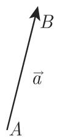
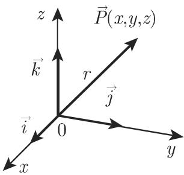
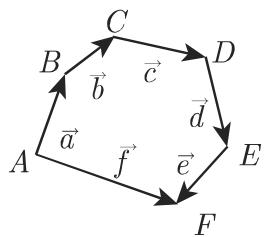
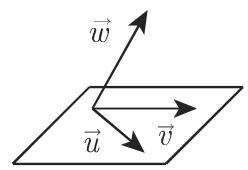
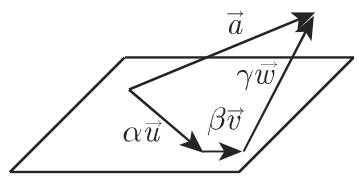
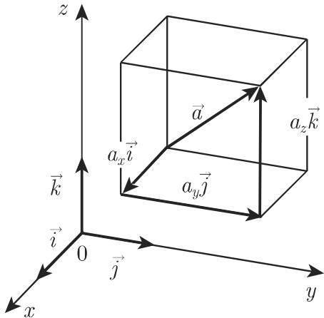
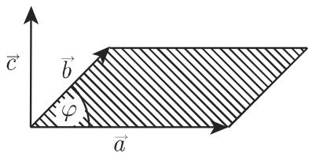

#### 3.5.1 向量代数

3.5.1.1 向量的定义

1. 标量和向量

取值为实数的量称为标量．例如，质量、温度、能量和功都是标量（关千标量不变量，参见第 247 3.5.1.5, 3. ，第 287 3.5.3.4, 3. 和第 385 4.3.5.2, (2)).

空间中可以用大小和方向完全描述的量称为向量例如力、速度、加速度、角速度角加速度以及电场和磁场强度都是向量．我们用空间中的有向线段表示向量

在本书中三维欧儿里得空间中的向量记作 ${ \vec { a } } ,$ ，在矩阵论中记作 $\underline { { \mathbf { \Pi } } } \mathbf { a } .$

2. 极向量和轴向量

极向量表示具有大小和空间方向的量，如速度和加速度；轴向量表示具有大小，空间方向和旋转方向的量，如角速度和角加速度．在图示上它们用极箭头和轴箭头来区别（图 3.113)．但在数学讨论中对它们并不加以区别．

3. 模和空间中的方向

向量 或 $\underline { { \pmb a } }$ 作为起点 和终点 之间的线段，其量的描述是模 $| \vec { a } |$ ，即该线段的长度以及空间中的方向它由一组角给出．

4. 向量的相等

两个向量 $\vec { a }$ 和 $\vec { b }$ 如果模相等且方向相同，则称它们是相等的．

反向的相等向量具有相同的模，但方向相反：

$$
\overrightarrow {A B} = \vec {a}, \quad \overrightarrow {B A} = - \vec {a} \quad \text {但是} \quad | \overrightarrow {A B} | = | \overrightarrow {B A} |.\tag{3.233}
$$

在这一情形，轴向量具有相反和相同的旋转方向

．自由向量、固定向量、滑动向量

自由向量被认为是相同的，即它在做平行移动时不改变模和方向，因此它的起点可以是空间中的任意一点．如果一个向量的性质与一个确定的起点相关联，则它被称为约束向量或固定向量滑动向量只能沿它所在的直线移动．

6. 特殊向量

a)单位向量 $\vec { a } ^ { 0 } = \vec { e }$ 是长度或模等千 的向量．利用它，向量 $\vec { a }$ 可以表示为该向量的模与该向量同方向的单位向量之积：

$$
\vec {a} = \vec {e} | \vec {a} |.\tag{3.234}
$$

单位向量 $\vec { i } , \vec { j } , \vec { k }$ ［或 $\vec { e } _ { i } , \vec { e } _ { j } , \vec { e } _ { k }$ （图 3.114) 常用来表示三个坐标轴的坐标值增加方向．在图 3.114 中由三个单位向量所给的方向构成了一个正交三元组这些单位向量定义了一个直角坐标系，因为它们的标量积满足：

$$
\vec {e} _ {i} \vec {e} _ {j} = \vec {e} _ {i} \vec {e} _ {k} = \vec {e} _ {j} \vec {e} _ {k} = 0,\tag{3.235}
$$

而且还有

$$
\vec {e} _ {i} \vec {e} _ {i} = \vec {e} _ {j} \vec {e} _ {j} = \vec {e} _ {k} \vec {e} _ {k} = 1\tag{3.236}
$$

成立，即它是一个规范正交坐标系．

  
(a)

  
(b)  
3.113

  
3.114

b) 零向量 $\vec { \bf 0 }$ 是模等千 的向量，即它的起点和终点重合，而其方向是不加定义的．

c) 向径 $\vec { r }$ 或点 的位置向量是起点在原点终点在 的向量 $\overrightarrow { O P }$ 图 3.114).在这一情形，原点也称作极或极点点 是由向径唯一定义的．

d) 共线向量是与同一直线平行的向景．

e) 共面向量是平行千同一平面的向量．它们满足等式 (3.260).

3.5.1.2 向量的计算法则

1. 向量的和

a) 两个向量 $\overrightarrow { A B } = \overrightarrow { a }$ 与 $\overrightarrow { A D } = \overrightarrow { b }$ 的和也可以表示成平行四边形 ABCD 的对角线即图 3.115(b) 中的向量 ${ \overrightarrow { A C } } = { \overrightarrow { c } } .$ 两个向量之和最重要的性质是交换律和三角不等式：

$$
\vec {a} + \vec {b} = \vec {b} + \vec {a}, \quad | \vec {a} + \vec {b} | \leqslant | \vec {a} | + | \vec {b} |.\tag{3.237a}
$$

  
(a)

  
(b)  
3.115

b) 若干个向量a, $\vec { b } , \vec { c } , \cdots , \vec { e }$ 之和是向量 ${ \vec { f } } = { \overrightarrow { A F } }$ 如图 3.115(a) ，它将从 $\vec { a }$ 到 $\vec { e }$ 的向量形成的折线封闭对千 个向量 $\Vec { a } _ { i } ( i = 1 , 2 , \cdot \cdot \cdot , n )$ 成立有

$$
\sum_ {i = 1} ^ {n} \vec {a} _ {i} = \vec {f}.\tag{3.237b}
$$

若干个向量之和的重要性质是加法的交换律和结合律．对千三个向量成立有

$$
\vec {a} + \vec {b} + \vec {c} = \vec {c} + \vec {b} + \vec {a}, (\vec {a} + \vec {b}) + \vec {c} = \vec {a} + (\vec {b} + \vec {c}).\tag{3.237c}
$$

c) 两个向量的差 $\vec { a } - \vec { b }$ 可以看成是向量 和 $- \vec { b }$ 的和，即

$$
\vec {a} - \vec {b} = \vec {a} + (- \vec {b}) = \vec {d}.\tag{3.237d}
$$

它是平行四边形（图 3.115(b)）的另一条对角线．两个向量之差的最重要性质是

$$
\vec {a} - \vec {a} = \vec {0} \quad (\text {零向量}), \quad | \vec {a} - \vec {b} | \geqslant | | \vec {a} | - | \vec {b} | |.\tag{3.237e}
$$

2. 向量与标量的乘法线性组合

乘积 $\alpha \vec { a }$ 和 $\vec { a } \alpha$ 彼此相等并且平行（共线）千 a. 这个乘积向量的长等千 $| \alpha | | \vec { a } |$ 对千 $\alpha > 0$ ，积向量与 $\vec { a }$ 具有相同的方向；对千 $\cdot _ { \alpha } < 0$ ，它具有相反的方向向量与标量之积最重要的性质是

$$
\alpha \vec {a} = \vec {a} \alpha , \quad \alpha \beta \vec {a} = \beta \alpha \vec {a}, \quad (\alpha + \beta) \vec {a} = \alpha \vec {a} + \beta \vec {a}, \quad \alpha (\vec {a} + \vec {b}) = \alpha \vec {a} + \alpha \vec {b}.\tag{3.238a}
$$

向量 $\vec { a } , \vec { b } , \vec { c } , \cdots , \vec { d }$ 与标量 ${ \alpha , \beta , \cdots , \delta }$ 的线性组合是向量

$$
\vec {k} = \alpha \vec {a} + \beta \vec {b} + \dots + \delta \vec {d}.\tag{3.238b}
$$

3. 向量的分解

在三维空间中每个向量 可以唯一地分解为三个向量之和，它们平行千三个给定的非共面向量 $\vec { u } , \vec { v } , \vec { w } ($ （图 3.116(a), (b)):

$$
\vec {a} = \alpha \vec {u} + \beta \vec {v} + \gamma \vec {w}.\tag{3.239a}
$$

au, $\beta \vec { v }$ 和 $\gamma w$ 称为这一分解的分量，标量因子 $\alpha _ { \mathrm { { i } } }$ $\beta$ 和 $| \gamma \rrangle$ 称为系数．当所有向量都平行千一个平面时，可以写成

$$
\vec {a} = \alpha \vec {u} + \beta \vec {v},\tag{3.239b}
$$

这里 $\vec { u }$ 和叮是平行千同一平面的两个非共线向量（图 3.116(c), (d)).

  
(a)

  
(b)

  
3.116  
(c)

  
(d)

3.5.1.3 向量的坐标

1. 笛卡儿坐标

根据 (3.239a) ，每个向 $\overrightarrow { A B } = \vec { a }$ 可以唯一分解成平行千坐标系的基向量； $\vec { i } ,$ ；玉或 $\vec { e } _ { i } , \vec { e } _ { j } , \vec { e } _ { k }$ 的向量之和：

$$
\vec {a} = a _ {x} \vec {i} + a _ {y} \vec {j} + a _ {z} \vec {k} = a _ {x} \vec {e} _ {i} + a _ {y} \vec {e} _ {j} + a _ {z} \vec {e} _ {k},\tag{3.240a}
$$

其中标量 $a _ { x } , a _ { y } , a _ { z }$ 是向量 $\vec { a }$ 在基向量为 $\vec { e } _ { i } , \vec { e } _ { j } , \vec { e } _ { k }$ 的坐标系中的笛卡儿坐标．也写成

$$
\vec {a} = \left\{a _ {x}, a _ {y}, a _ {z} \right\} \text {或} \vec {a} \left(a _ {x}, a _ {y}, a _ {z}\right).\tag{3.240b}
$$

由单位向量定义的三个方向构成一个正交方向三元组向量的分量是该向量在坐标轴上的投影（图 3.117).

若干个向量的线性组合的坐标等同千这些向量的坐标的线性组合，因此向量方(3.238b) 对应千下面的坐标方程：

$$
\begin{array}{l} k _ {x} = \alpha a _ {x} + \beta b _ {x} + \dots + \delta d _ {x}, \\ k _ {y} = \alpha a _ {y} + \beta b _ {y} + \dots + \delta d _ {y}, \\ k _ {z} = \alpha a _ {z} + \beta b _ {z} + \ldots + \delta d _ {z}. \end{array}\tag{3.241}
$$

对千两个向量的和与差

$$
\vec {c} = \vec {a} \pm \vec {b}\tag{3.242a}
$$

的坐标，有等式

$$
c _ {x} = a _ {x} \pm b _ {x}, c _ {y} = a _ {y} \pm b _ {y}, c _ {z} = a _ {z} \pm a _ {z}\tag{3.242b}
$$

成立点 $P ( x , y , z )$ 的向径 $\vec { r }$ 具有该点的笛卡儿坐标：

$$
r _ {x} = x, \quad r _ {y} = y, \quad r _ {z} = z; \quad \vec {r} = x \vec {i} + y \vec {j} + z \vec {k}.\tag{3.243}
$$

  
3.117

2. 仿射坐标

仿射是笛卡儿坐标的一般化，它基千三个线性无关但不必正交的向量，即不共面的基向量 $\vec { e } _ { 1 } , \vec { e } _ { 2 } , \vec { e } _ { 3 }$ 马组成的坐标系系数是 $a ^ { 1 } , a ^ { 2 } , a ^ { 3 }$ ，这里的上标不是指数类似(3.240a, b) ，对千 $\vec { a }$ 成立有

$$
\vec {a} = a ^ {1} \vec {e} _ {1} + a ^ {2} \vec {e} _ {2} + a ^ {3} \vec {e} _ {3}\tag{3.244a}
$$

或

$$
\vec {a} = \left\{a ^ {1}, a ^ {2}, a ^ {3} \right\} \quad \text {或} \quad \vec {a} \left(a ^ {1}, a ^ {2}, a ^ {3}\right)  .\tag{3.244b}
$$

当标量 $a ^ { 1 } , a ^ { 2 } , a ^ { 3 }$ 是一个向量的反变坐标（参见第 253 3.5.1.8) 时，这种记法特别适合对千 ${ \vec { e } } _ { 1 } = { \vec { i } } , { \vec { e } } _ { 2 } = { \vec { j } } , { \vec { e } } _ { 3 } = { \vec { k } } .$ 公式 (3.244a, b) 变成 (3.240a, b) ．对千向量的线性组合 (3.238b) 类似千 (3.241) 的坐标方程成立，对千两个向最的和与差也一(3.242a, b):

$$
\begin{array}{r l} & k ^ {1} = \alpha a ^ {1} + \beta b ^ {1} + \dots + \delta d ^ {1}, \\ & k ^ {2} = \alpha a ^ {2} + \beta b ^ {2} + \dots + \delta d ^ {2}, \\ & k ^ {3} = \alpha a ^ {3} + \beta b ^ {3} + \dots + \delta d ^ {3}; \\ & c ^ {1} = a ^ {1} \pm b ^ {1}, \quad c ^ {2} = a ^ {2} \pm b ^ {2}, \quad c ^ {3} = a ^ {3} \pm b ^ {3}. \end{array}\tag{3.245}
$$

(3.246)

3.5.1.4 方向系数

向量 沿向量 $\vec { b }$ 的方向系数是标量积：

$$
a _ {b} = \vec {a} \vec {b} ^ {0} = | \vec {a} | \cos \varphi ,\tag{3.247}
$$

其中 $\vec { b } ^ { 0 } = \frac { b } { | \vec { b } | }$ 是 $\vec { b }$ 方向上的单位向量， $\varphi$ 是 $\vec { a }$ 和 $\vec { b }$ 之间的夹角．

方向系数代表 $\vec { a }$ 在 $\vec { b }$ 上的投影．

·在笛卡儿坐标系中，向量 $\vec { a }$ x,y, 轴的方向系数是坐标 $a _ { x }$ ， $a _ { y }$ , $a _ { z }$ . 这一断言在非正交坐标系中通常不成立．

3.5.1.5 标量积与向量积

1. 标量积

两个向量 $\vec { a }$ 和 $\vec { b }$ 的标量积或点积定义为等式

$$
\vec {a} \cdot \vec {b} = \vec {a} \vec {b} = (\vec {a} \vec {b}) = | \vec {a} | | \vec {b} | \cos \varphi ,\tag{3.248}
$$

其中 $\varphi$ 是考虑 $\vec { a }$ 和 $\vec { b }$ 具有共同的出发点时它们之间的夹角（图 3.118)．标量积的值是标量．

2. 向量积

两个向量 $\vec { a }$ 和 $\vec { b }$ 的向量积或叉积是一个向量 $\vec { c }$ 使得它垂直千向量 $\vec { a }$ 和 ${ \vec { b } } ,$ ，并且向量按照 ${ \vec { a } } ,$ $\vec { b }$ 和 $\vec { c }$ 的顺序形成右手系（图 3.119) ：如果向量具有相同的起点则从$\vec { c }$ 的终点看 $\vec { a }$ 和 $\vec { b }$ 的平面 $\vec { a }$ 最快是以逆时针旋转到 $\vec { b }$ 的方向．向量 $\vec { a } , \vec { b }$ 和 $\vec { c }$ 具有和右手的拇指，食指和中指同样的布局．因此这称为右手法则．向量积 (3.249a)有模 (3.249b).

$$
\vec {a} \times \vec {b} = | \vec {a} \vec {b} | = \vec {c},\tag{3.249a}
$$

$$
| \vec {c} | = | \vec {a} | | \vec {b} | \sin \varphi ,\tag{3.249b}
$$

其中 $\varphi$ 是 $\vec { a }$ 和 $\vec { b }$ 之间的夹角． $\vec { c }$ 的长度在数值上等千由向量 $\vec { a }$ 和 $\vec { b }$ 定义的平行四边形的面积

  
3.118

  
3.119

3. 向量的乘积的性质

a) 标量积是可交换的：

$$
\vec {a} \vec {b} = \vec {b} \vec {a}.\tag{3.250}
$$

b) 向量积是反交换的（交换因子后改变符号）：

$$
\vec {a} \times \vec {b} = - (\vec {b} \times \vec {a}).\tag{3.251}
$$

c) 与一个标量相乘满足结合律：

$$
\alpha (\vec {a} \vec {b}) = (\alpha \vec {a}) \vec {b},\tag{3.252a}
$$

$$
\alpha (\vec {a} \times \vec {b}) = (\alpha \vec {a}) \times \vec {b}.\tag{3.252b}
$$

d) 结合律对千二重标量积和二重向量积不成立：

$$
\vec {a} (\vec {b} \vec {c}) \neq (\vec {a} \vec {b}) \vec {c},\tag{3.253a}
$$

$$
\vec {a} \times (\vec {b} \times \vec {c}) \neq (\vec {a} \times \vec {b}) \times \vec {c}.\tag{3.253b}
$$

e) 分配律成立：

$$
\vec {a} (\vec {b} + \vec {c}) = \vec {a} \vec {b} + \vec {a} \vec {c},\tag{3.254a}
$$

$$
\vec {a} \times (\vec {b} + \vec {c}) = \vec {a} \times \vec {b} + \vec {a} \times \vec {c} \text {和} (\vec {b} + \vec {c}) \times \vec {a} = \vec {b} \times \vec {a} + \vec {c} \times \vec {a}.\tag{3.254b}
$$

f) 两个向量的正交性 如果等式

$$
\vec {a} \vec {b} = 0\tag{3.255}
$$

成立，并且 $\vec { a }$ 和 $\vec { b }$ 都不是零向量，则两个向量互相垂直（ $( \vec { a } \bot \vec { b } )$

g) 两个向量的共线性 如果等式

$$
\vec {a} \times \vec {b} = \vec {0}\tag{3.256}
$$

成立，并且 $\vec { a }$ 和 $\vec { b }$ 都不是零向量，则两个向量是共线的 $( \vec { a } \vert \vert \vec { b } )$

h) 相同向量的乘法

$$
\vec {a} \vec {a} = \vec {a} ^ {2} = a ^ {2}, \quad \vec {a} \times \vec {a} = \vec {0}.\tag{3.257}
$$

i)向量的线性组合可以用和标量多项式相同的方法相乘（因为分配律成立），对千向量积来说，只有一点必须加以注意如果交换因子则也要改变符号

$$
\begin{array}{l} \text {■ A: (3a+5b-2c)(a-2b-4c) = 3a^2 + 5b\vec {a} -2c\vec {a} -6ab- 10b^2 + 4c\vec {b} -12ac-} \\ 2 0 \vec {b} \vec {c} + 8 \vec {c} ^ {2} = 3 \vec {a} ^ {2} - 1 0 \vec {b} ^ {2} + 8 \vec {c} ^ {2} - \vec {a} \vec {b} - 1 4 \vec {a} \vec {c} - 1 6 \vec {b} \vec {c}. \end{array}
$$

■ ${ \bf 1 } \ { \bf B } \colon ( 3 \vec { a } + 5 \vec { b } - 2 \vec { c } ) \times ( \vec { a } - 2 \vec { b } - 4 \vec { c } ) = 3 \vec { a } \times \vec { a } + 5 \vec { b } \times \vec { a } - 2 \vec { c } \times \vec { a } - 6 \vec { a } \times \vec { b } - 1 0 \vec { b } \times \vec { b } + 4 \vec { c } \times \vec { b } - \vec { a } \times \vec { b } \times \vec { b } = 0 .$ $1 2 \vec { a } \times \vec { c } - 2 0 \vec { b } \times \vec { c } + 8 \vec { c } \times \vec { c } = 0 - 5 \vec { a } \times \vec { b } + 2 \vec { a } \times \vec { c } - 6 \vec { a } \times \vec { b } + 0 - 4 \vec { b } \times \vec { c } - 1 2 \vec { a } \times \vec { c } - 2 0 \vec { b } \times \vec { c } + 0 = 5 \vec { a } \times \vec { b } + \vec { c }$ $- 1 1 { \vec { a } } \times { \vec { b } } - 1 0 { \vec { a } } \times { \vec { c } } - 2 4 { \vec { b } } \times { \vec { c } } = 1 1 { \vec { b } } \times { \vec { a } } + 1 0 { \vec { c } } \times { \vec { a } } + 2 4 { \vec { c } } \times { \vec { b } } .$

j) 标量不变量是在坐标系的平移和旋转下其值不发生改变的标量．两个向量的标量积是一个标量不变量

■ A: 向量 $\vec { a } = \{ a _ { 1 } , a _ { 2 } , a _ { 3 } \}$ 的坐标不是标量不变量，因为在不同的坐标系下它们具有不同的值

■ $\mathbf { B } \mathbf { : }$ 向量 $\vec { a }$ 的模是一个标量不变量，因为它在不同的坐标系下具有相同的值．

■ C: 因为两个向量的标量积是一个标量不变量，所以一个向量与其自身的标量积也是一个标量不变量， $\vec { a } \vec { a } = | \vec { a } | ^ { 2 } \cos \varphi = | \vec { a } | ^ { 2 }$ ，因为 $\varphi = 0$

3.5.1.6 向量乘积的组合

1. 二重向量积

二重向量积 $\vec { a } \times ( \vec { b } \times \vec { c } )$ 的结果是与 $\vec { b }$ 和 $\vec { c }$ 共面的一个向量：

$$
\vec {a} \times (\vec {b} \times \vec {c}) = \vec {b} (\vec {a} \vec {c}) - \vec {c} (\vec {a} \vec {b}).\tag{3.258}
$$

2. 混合积

混合积 $( \vec { a } \times \vec { b } ) \vec { c }$ 也称三重积，其结果是一个标量，它的绝对值在数值上等千由这三个向量定义的平行六面体的体积；如果 $\vec { a } , \vec { b }$ 和 $\vec { c }$ 构成右手系则结果取正，否则取负括号和叉乘号可以省略：

$$
(\vec {a} \times \vec {b}) \vec {c} = \vec {a} (\vec {b} \times \vec {c}) = \vec {a} \vec {b} \vec {c} = \vec {b} \vec {c} \vec {a} = \vec {c} \vec {a} \vec {b} = - \vec {a} \vec {c} \vec {b} = - \vec {b} \vec {a} \vec {c} = - \vec {c} \vec {b} \vec {a}.\tag{3.259}
$$

交换任何两项的结果将变号；将全部三项轮换不影响结果．

对千共面向量，即如果 $\vec { a }$ 平行千由 $\vec { b }$ 和 $\vec { c }$ 定义的平面，则有

$$
\vec {a} (\vec {b} \times \vec {c}) = 0.\tag{3.260}
$$

3. 多重乘积的公式

a) 拉格朗日恒等式

$$
(\vec {a} \times \vec {b}) (\vec {c} \times \vec {d}) = (\vec {a} \vec {c}) (\vec {b} \vec {d}) - (\vec {b} \vec {c}) (\vec {a} \vec {d}),\tag{3.261}
$$

$$
\mathrm{b)} \vec {a} \vec {b} \vec {c} \cdot \vec {e} \vec {f} \vec {g} = \left| \begin{array}{l l l} \vec {a} \vec {e} & \vec {a} \vec {f} & \vec {a} \vec {g} \\ \vec {b} \vec {e} & \vec {b} \vec {f} & \vec {b} \vec {g} \\ \vec {c} \vec {e} & \vec {c} \vec {f} & \vec {c} \vec {g} \end{array} \right|.\tag{3.262}
$$

4. 用笛卡儿坐标表示的乘积公式

如果将向量 $\vec { a } , \vec { b } , \vec { c }$ 表示成坐标形式

$$
\vec {a} = \left\{a _ {x}, a _ {y}, a _ {z} \right\}, \quad \vec {b} = \left\{b _ {x}, b _ {y}, b _ {z} \right\}, \quad \vec {c} = \left\{c _ {x}, c _ {y}, c _ {z} \right\},\tag{3.263}
$$

则可以用下面的公式计算乘积：

(1) 标量积

$$
\vec {a} \vec {b} = a _ {x} b _ {x} + a _ {y} b _ {y} + a _ {z} b _ {z}.\tag{3.264}
$$

(2) 向量积

$$
\begin{array}{r l} & {\vec {a} \times \vec {b} = (a _ {y} b _ {z} - a _ {z} b _ {y}) \vec {i} + (a _ {z} b _ {x} - a _ {x} b _ {z}) \vec {j} + (a _ {x} b _ {y} - a _ {y} b _ {x}) \vec {k}} \\ & {\qquad = \left| \begin{array}{c c c} \vec {i} & \vec {j} & \vec {k} \\ a _ {x} & a _ {y} & a _ {z} \\ b _ {x} & b _ {y} & b _ {z} \end{array} \right|.} \end{array}\tag{3.265}
$$

(3) 混合积

$$
\vec {a} \vec {b} \vec {c} = \left| \begin{array}{c c c} a _ {x} & a _ {y} & a _ {z} \\ b _ {x} & b _ {y} & b _ {z} \\ c _ {x} & c _ {y} & c _ {z} \end{array} \right|.\tag{3.266}
$$

5. 用仿射坐标表示的乘积公式

(1) 度量系数与互反向量组 如果在 $\vec { e } _ { 1 } , \vec { e } _ { 2 } , \vec { e } _ { 3 }$ 系中给定两个向量 $\vec { a }$ 和 $\vec { b }$ 的仿射坐标，即

$$
\vec {a} = a ^ {1} \vec {e} _ {1} + a ^ {2} \vec {e} _ {2} + a ^ {3} \vec {e} _ {3}, \quad \vec {b} = b ^ {1} \vec {e} _ {1} + b ^ {2} \vec {e} _ {2} + b ^ {3} \vec {e} _ {3},\tag{3.267}
$$

而需要计算标量积

$$
\begin{array}{r} \vec {a} \vec {b} = a ^ {1} b ^ {1} \vec {e} _ {1} \vec {e} _ {1} + a ^ {2} b ^ {2} \vec {e} _ {2} \vec {e} _ {2} + a ^ {3} b ^ {3} \vec {e} _ {3} \vec {e} _ {3} + (a ^ {1} b ^ {2} + a ^ {2} b ^ {1}) \vec {e} _ {1} \vec {e} _ {2} \\ + (a ^ {2} b ^ {3} + a ^ {3} b ^ {2}) \vec {e} _ {2} \vec {e} _ {3} + (a ^ {3} b ^ {1} + a ^ {1} b ^ {3}) \vec {e} _ {3} \vec {e} _ {1} \end{array}\tag{3.268}
$$

或向量积

$$
\vec {a} \times \vec {b} = (a ^ {2} b ^ {3} - a ^ {3} b ^ {2}) \vec {e} _ {2} \times \vec {e} _ {3} + (a ^ {3} b ^ {1} - a ^ {1} b ^ {3}) \vec {e} _ {3} \times \vec {e} _ {1} + (a ^ {1} b ^ {2} - a ^ {2} b ^ {1}) \vec {e} _ {1} \times \vec {e} _ {2},\tag{3.269a}
$$

后者用到等式

$$
\vec {e} _ {1} \times \vec {e} _ {1} = \vec {e} _ {2} \times \vec {e} _ {2} = \vec {e} _ {3} \times \vec {e} _ {3} = \vec {0},\tag{3.269b}
$$

那么就必须要知道坐标向量的两两乘积．对千标量积而言这些是六个度量系数：

$$
\begin{array}{r l} & g _ {1 1} = \vec {e} _ {1} \vec {e} _ {1}, \quad g _ {2 2} = \vec {e} _ {2} \vec {e} _ {2}, \quad g _ {3 3} = \vec {e} _ {3} \vec {e} _ {3}, \\ & g _ {1 2} = \vec {e} _ {1} \vec {e} _ {2} = \vec {e} _ {2} \vec {e} _ {1}, \quad g _ {2 3} = \vec {e} _ {2} \vec {e} _ {3} = \vec {e} _ {3} \vec {e} _ {2}, \quad g _ {3 1} = \vec {e} _ {3} \vec {e} _ {1} = \vec {e} _ {1} \vec {e} _ {3}, \end{array}\tag{3.270}
$$

而对向量积来说是三个向量

$$
\vec {e} ^ {1} = \varOmega (\vec {e} _ {2} \times \vec {e} _ {3}), \quad \vec {e} ^ {2} = \varOmega (\vec {e} _ {3} \times \vec {e} _ {1}), \quad \vec {e} ^ {3} = \varOmega (\vec {e} _ {1} \times \vec {e} _ {2}),\tag{3.271a}
$$

它们是关千 $\vec { e } _ { 1 } , \vec { e } _ { 2 } , \vec { e } _ { 3 }$ 的三个互反向量，其中系数

$$
\varOmega = \frac {1}{\vec {e} _ {1} \vec {e} _ {2} \vec {e} _ {3}},\tag{3.271b}
$$

是坐标向量混合积的倒数．这个记号在下面的讨论中仅用来作简写．借助关千基向量的乘法表 3.13 和表 3.14 容易算出这些系数

3.13 基向量的标量积

<table><tr><td></td><td> $\vec{e}_{1}$ </td><td> $\vec{e}_{2}$ </td><td> $\vec{e}_{3}$ </td></tr><tr><td> $\vec{e}_{1}$ </td><td> $g_{11}$ </td><td> $g_{12}$ </td><td> $g_{13}$ </td></tr><tr><td> $\vec{e}_{2}$ </td><td> $g_{21}$ </td><td> $g_{22}$ </td><td> $g_{23}$ </td></tr><tr><td> $\vec{e}_{3}$ </td><td> $g_{31}$ </td><td> $g_{32}$ </td><td> $g_{33}$ </td></tr></table>

$$
(g _ {k i} = g _ {i k})
$$

3.14 基向量的向量积

<table><tr><td></td><td> $\vec{e}_{1}$ </td><td> $\vec{e}_{2}$ </td><td> $\vec{e}_{3}$ </td></tr><tr><td rowspan="3">被乘数</td><td> $\vec{e}_{1}$ </td><td>0</td><td> $\frac{\vec{e}^{3}}{\Omega}$ </td></tr><tr><td> $\vec{e}_{2}$ </td><td> $-\frac{\vec{e}^{3}}{\Omega}$ </td><td>0</td></tr><tr><td> $\vec{e}_{3}$ </td><td> $\frac{\vec{e}^{2}}{\Omega}$ </td><td> $-\frac{\vec{e}^{1}}{\Omega}$ </td></tr></table>

(2) 对千笛卡儿坐标的应用 笛卡儿坐标是仿射坐标的特殊情形．由表 3.153.16 对千基向量

$$
\vec {e} _ {1} = \vec {i}, \quad \vec {e} _ {2} = \vec {j}, \quad \vec {e} _ {3} = \vec {k}\tag{3.272a}
$$

得度量系数

$$
g _ {1 1} = g _ {2 2} = g _ {3 3} = 1, \quad g _ {1 2} = g _ {2 3} = g _ {3 1} = 0, \quad \varOmega = \frac {1}{\vec {i} \vec {j} \vec {k}} = 1\tag{3.272b}
$$

和互反基向量

$$
\vec {e} ^ {1} = \vec {i}, \quad \vec {e} ^ {2} = \vec {j}, \quad \vec {e} ^ {3} = \vec {k}.\tag{3.272c}
$$

因此该坐标系的基向量与互反向量一致，换旬话说，在笛卡儿坐标系中基向量组就是它自己的互反组

3.15 互反基向量的标量积

<table><tr><td></td><td> $\vec{i}$ </td><td> $\vec{j}$ </td><td> $\vec{k}$ </td></tr><tr><td> $\vec{i}$ </td><td>1</td><td>0</td><td>0</td></tr><tr><td> $\vec{j}$ </td><td>0</td><td>1</td><td>0</td></tr><tr><td> $\vec{k}$ </td><td>0</td><td>0</td><td>1</td></tr></table>

3.16 互反基向量的向量积

<table><tr><td rowspan="2"></td><td colspan="3">乘数</td></tr><tr><td> $\vec{i}$ </td><td> $\vec{j}$ </td><td> $\vec{k}$ </td></tr><tr><td> $\vec{i}$ </td><td>0</td><td> $\vec{k}$ </td><td> $-\vec{j}$ </td></tr><tr><td> $\vec{j}$ </td><td> $-\vec{k}$ </td><td>0</td><td> $\vec{i}$ </td></tr><tr><td> $\vec{k}$ </td><td> $\vec{j}$ </td><td> $-\vec{i}$ </td><td>0</td></tr></table>

(3) 由坐标给出的向量的标量积

$$
\vec {a} \vec {b} = \sum_ {m = 1} ^ {3} \sum_ {n = 1} ^ {3} g _ {m n} a ^ {m} b ^ {n} = g _ {\alpha \beta} a ^ {\alpha} b ^ {\beta}.\tag{3.273}
$$

对千笛卡儿坐标，（3.273) (3.264) 相符．

(3.273) 中的第二个等号后，用到了一种常在张量计算中表示求和的简记法（参见第 376 页， 4.3.1, 2.）：只写出通项以取代完整求和因此应该对指标重复进行求和计算，即对每次出现的上下标进行求和计算．有时用希腊字母表示求和指标；这里它们的值从 取到 3. 因此有

$$
\begin{array}{c} g _ {\alpha \beta} a ^ {\alpha} b ^ {\beta} = g _ {1 1} a ^ {1} b ^ {1} + g _ {1 2} a ^ {1} b ^ {2} + g _ {1 3} a ^ {1} b ^ {3} + g _ {2 1} a ^ {2} b ^ {1} + g _ {2 2} a ^ {2} b ^ {2} + g _ {2 3} a ^ {2} b ^ {3} \\ + g _ {3 1} a ^ {3} b ^ {1} + g _ {3 2} a ^ {3} b ^ {2} + g _ {3 3} a ^ {3} b ^ {3}. \end{array} \tag {3.}\tag{3.274}
$$

(4) 由坐标给出的向量的向量积 根据 (3.269a)

$$
\begin{array}{r l} & {\vec {a} \times \vec {b} = \vec {e} _ {1} \vec {e} _ {2} \vec {e} _ {3} \left| \begin{array}{c c c} {\vec {e} ^ {1}} & {\vec {e} ^ {2}} & {\vec {e} ^ {3}} \\ {a ^ {1}} & {a ^ {2}} & {a ^ {3}} \\ {b ^ {1}} & {b ^ {2}} & {b ^ {3}} \end{array} \right| = \vec {e} _ {1} \vec {e} _ {2} \vec {e} _ {3} [ (a ^ {2} b ^ {3} - a ^ {3} b ^ {2}) \vec {e} ^ {1}} \\ & {\quad + (a ^ {3} b ^ {1} - a ^ {1} b ^ {3}) \vec {e} ^ {2} + (a ^ {1} b ^ {2} - a ^ {2} b ^ {1}) \vec {e} ^ {3} ].} \end{array}\tag{3.275}
$$

对千笛卡儿坐标 (3.275) (3.265) 相符

(5) 由坐标给出的向量的混合积 根据 (3.269a)

$$
\vec {a} \vec {b} \vec {c} = \vec {e} _ {1} \vec {e} _ {2} \vec {e} _ {3} \left| \begin{array}{c c c} a ^ {1} & a ^ {2} & a ^ {3} \\ b ^ {1} & b ^ {2} & b ^ {3} \\ c ^ {1} & c ^ {2} & c ^ {3} \end{array} \right|.\tag{3.276}
$$

对千笛卡儿坐标，（3.276) (3.266) 相符

3.5.1.7 向量方程

3.17 概括了最简单的向量方程．表中 $\vec { a } , \vec { b } , \vec { c }$ 它是已知向量， $\vec { x }$ 是未知向量， $\alpha ,$ $\beta$ 3'r 是已知标量， $x , y , z$ 则是要计算的未知标量．

3.17 向量方程

<table><tr><td>方程</td><td>解</td></tr><tr><td>(1)  $\vec{x} + \vec{a} = \vec{b}$ </td><td> $\vec{x} = \vec{b} - \vec{a}$ </td></tr><tr><td>(2)  $\alpha \vec{x} = \vec{a}$ </td><td> $\vec{x} = \frac{\vec{a}}{\alpha}$ </td></tr><tr><td>(3)  $\vec{x} \vec{a} = \alpha$ </td><td>这是一个不定方程;考虑具有相同起点,满足这一方程的所有向量  $\vec{x}$ ,则它们的终点形成一个垂直于向量  $\vec{a}$  的平面.方程 (3) 称为这个平面的向量方程</td></tr><tr><td>(4)  $\vec{x} \times \vec{a} = \vec{b} (\vec{b} \perp \vec{a})$ </td><td>这是一个不定方程;考虑具有相同起点,满足这一方程的所有向量  $\vec{x}$ ,则它们的终点形成一条平行于向量  $\vec{a}$  的直线.方程 (4) 称为这条直线的向量方程</td></tr></table>

续表

$$
\left\{ \begin{array}{l l} \vec {x} \vec {a} = \alpha \\ \vec {x} \times \vec {a} = \vec {b} (\vec {b} \perp \vec {a}) \end{array} \right. \quad \vec {x} = \frac {\alpha \vec {a} + \vec {a} \times \vec {b}}{a ^ {2}} (a = | \vec {a} |)
$$

$$
\left\{ \begin{array}{l l} \vec {x} \vec {a} = \alpha \\ \vec {x} \vec {b} = \beta \\ \vec {x} \vec {c} = \gamma \end{array} \right. \qquad \qquad \vec {x} = \frac {\alpha (\vec {b} \times \vec {c}) + \beta (\vec {c} \times \vec {a}) + \gamma (\vec {a} \times \vec {b})}{\vec {a} \vec {b} \vec {c}} = \alpha \tilde {\vec {a}} + \beta \tilde {\vec {b}} + \gamma \tilde {\vec {c}},
$$

其中 $\tilde { \vec { a } } , \tilde { \vec { b } } ,$ 是 $\vec { a } , \vec { b } , \vec { c }$ 的互反向量（参见第 249 3.5.1.6,1.)

$$
(7) \vec {d} = x \vec {a} + y \vec {b} + z \vec {c} \qquad x = \frac {\vec {d} \vec {b} \vec {c}}{\vec {a} \vec {b} \vec {c}}, \quad y = \frac {\vec {a} \vec {d} \vec {c}}{\vec {a} \vec {b} \vec {c}}, \quad z = \frac {\vec {a} \vec {b} \vec {d}}{\vec {a} \vec {b} \vec {c}}
$$

$$
\begin{array}{r l} {(8) \vec {d} = x (\vec {b} \times \vec {c}) + y (\vec {c} \times \vec {a}) x = \frac {\vec {d} \vec {a}}{\vec {a} \vec {b} \vec {c}},} & {y = \frac {\vec {d} \vec {b}}{\vec {a} \vec {b} \vec {c}}, z = \frac {\vec {d} \vec {c}}{\vec {a} \vec {b} \vec {c}}} \\ & {+ z (\vec {a} \times \vec {b})} \end{array}
$$

注： $\vec { x }$ 是未知向戳； $\vec { a } , \vec { b } , \vec { c } , \vec { d }$ 是已知向量； $x , y ,$ z 是未知标量； $\alpha , \beta , \gamma$ 勹是已知标量

3.5.1.8 向量的共变坐标和反变坐标

1. 定义

向量 $\vec { a }$ 在以 $\vec { e } _ { 1 } , \vec { e } _ { 2 } , \vec { e } _ { 3 }$ 为基向量的坐标系中由公式

$$
\vec {a} = a ^ {1} \vec {e} _ {1} + a ^ {2} \vec {e} _ {2} + a ^ {3} \vec {e} _ {3} = a ^ {\alpha} \vec {e} _ {\alpha}\tag{3.277}
$$

定义的仿射坐标 $a ^ { 1 } , a ^ { 2 } , a ^ { 3 }$ 也称为该向量的反变坐标．共变坐标是关千基向量 $\vec { e } ^ { 1 }$ $\vec { e } ^ { 2 } , \vec { e } ^ { 3 }$ ，即关千 $\vec { e } _ { 1 } , \vec { e } _ { 2 } , \vec { e } _ { 3 }$ 的互反基向最的分解式中的系数．利用向量 $\vec { a }$ 的共变坐标 $a _ { 1 } , a _ { 2 } , a _ { 3 }$ 得

$$
\vec {a} = a _ {1} \vec {e} ^ {1} + a _ {2} \vec {e} ^ {2} + a _ {3} \vec {e} ^ {3} = a _ {\alpha} \vec {e} ^ {\alpha}.\tag{3.278}
$$

在笛卡儿坐标系中，向量的共变坐标和反变坐标是一致的．

2. 利用标量积表示坐标

向量 $\vec { a }$ 的共变坐标等千该向量与坐标系对应基向量的标量积：

$$
a _ {1} = \vec {a} \vec {e} _ {1}, a _ {2} = \vec {a} \vec {e} _ {2}, a _ {3} = \vec {a} \vec {e} _ {3}.\tag{3.279}
$$

向量 $\vec { a }$ 的反变坐标等千该向量与对应的互反基向量的标量积：

$$
a ^ {1} = \vec {a} \vec {e} ^ {1}, a ^ {2} = \vec {a} \vec {e} ^ {2}, a ^ {3} = \vec {a} \vec {e} ^ {3}.\tag{3.280}
$$

在笛卡儿坐标系中 (3.279) (3.280) 是一致的：

$$
a _ {x} = \vec {a} \vec {i}, \quad a _ {y} = \vec {a} \vec {j}, \quad a _ {z} = \vec {a} \vec {k}.\tag{3.281}
$$

3. 借助坐标表示标量积

用两个向量的反变坐标确定它们的标量积得到公式 (3.273)．对千共变坐标，相应的公式为

$$
\vec {a} \vec {b} = g ^ {\alpha \beta} a _ {\alpha} b _ {\beta},\tag{3.282}
$$

其中 $g ^ { m n } = \vec { e } ^ { m } \vec { e } ^ { n }$ 互反向量系中的度量系数．它们与系数 $g _ { m n }$ 的关系是

$$
g ^ {m n} = \frac {(- 1) ^ {m + n} A ^ {m n}}{\left| \begin{array}{c c c} g _ {1 1} & g _ {1 2} & g _ {1 3} \\ g _ {2 1} & g _ {2 2} & g _ {2 3} \\ g _ {3 1} & g _ {3 2} & g _ {3 3} \end{array} \right|},\tag{3.283}
$$

其中 $A ^ { m n }$ 是分母的行列式划掉元素 $g _ { m n }$ 所在的行和列后得到的子式．

如果向量 $\vec { a }$ 由共变坐标给定，向量 $\vec { b }$ 由反变坐标给定，则它们的标量积是

$$
\vec {a} \vec {b} = a ^ {1} b _ {1} + a ^ {2} b _ {2} + a ^ {3} b _ {3} = a ^ {\alpha} b _ {\alpha}.\tag{3.284}
$$

类似地有

$$
\vec {a} \vec {b} = a _ {\alpha} b ^ {\alpha}.\tag{3.285}
$$

3.5.1.9 向量代数的几何应用

3.18 显示的是向量代数的一些儿何应用．解析儿何的其他应用，如平面和直线的向量方程在第 252 3.5.1.7 和第 293 3.5.3.10 中讨论

3.18 向量代数的几何应用

<table><tr><td>确定</td><td>向量公式</td><td>用笛卡儿坐标表示的公式</td></tr><tr><td>向量 $\vec{a}$ 的长度</td><td> $a = \sqrt{\vec{a}^{2}}$ </td><td> $a = \sqrt{a_{x}^{2} + a_{y}^{2} + a_{z}^{2}}$ </td></tr><tr><td>由向量 $\vec{a}$ 和 $\vec{b}$ 确定的平行四边形的面积</td><td> $S = \left| \vec{a} \times \vec{b} \right|$ </td><td> $S = \sqrt{\left| \begin{array}{cc} a_{y} & a_{z} \\ b_{y} & b_{z} \end{array} \right|^{2} + \left| \begin{array}{cc} a_{z} & a_{x} \\ b_{z} & b_{x} \end{array} \right|^{2} + \left| \begin{array}{cc} a_{x} & a_{y} \\ b_{x} & b_{y} \end{array} \right|^{2}}$ </td></tr><tr><td>由向量 $\vec{a},\vec{b},\vec{c}$ 确定的平行六面体的体积</td><td> $V = \left| \vec{a}\vec{b}\vec{c} \right|$ </td><td> $V = \left| \begin{array}{ccc} a_{x} & a_{y} & a_{z} \\ b_{x} & b_{y} & b_{z} \\ c_{x} & c_{y} & c_{z} \end{array} \right|$ </td></tr><tr><td>向量 $\vec{a}$ 和 $\vec{b}$ 之间的夹角</td><td> $\cos \varphi = \frac{\vec{a}\vec{b}}{\sqrt{\vec{a}^{2}\vec{b}^{2}}}$ </td><td> $\cos \varphi = \frac{a_{x}b_{x} + a_{y}b_{y} + a_{z}b_{z}}{\sqrt{a_{x}^{2} + a_{y}^{2} + a_{z}^{2}}\sqrt{b_{x}^{2} + b_{y}^{2} + b_{z}^{2}}}$ </td></tr></table>
