#### 3.5.3 空间解析几何

3.5.3.1 基本概念

1. 坐标与坐标系

空间中的每个点 可以由一个坐标系来确定．坐标线的方向由单位向量的方向给定．图 3.170(a) 所表示的是笛卡儿坐标系中的关系需要区分直角坐标系和斜坐标系，其中单位向量相互垂直或者相互倾斜另一个重要的区别是，它属千右手坐标系还是左手坐标系．

最常用的空间坐标系是笛卡儿坐标系、球坐标系和柱坐标系．

  
(a)

  
(b)  
3.170

2. 右手系和左手系

右手系和左手系或右手坐标系和左手坐标系的区分依赖千正坐标方向的先后次序例如，右手系有三个不共面的单位向量，依下标的字母顺序是 $\vec { e } _ { i } , \vec { e } _ { j } , \vec { e } _ { k }$ ．当一个观察者面向 $\vec { e _ { i } }$ ， $\vec { e _ { j } }$ 平面同时朝 $\vec { e } _ { k }$ 的方向看时，能够沿最小的角，即顺时针旋转$\vec { e _ { i } }$ 到 $\vec { e _ { j } }$ ；从 $\vec { e } _ { k }$ 的尖头朝 $\vec { e } _ { i } , \vec { e } _ { j }$ 平面看，他能将 $\vec { e _ { i } }$ 反时针旋转到 $\vec { e _ { j } }$ 左手系在这两种情形中需要相反的旋转旋转的字母顺序已经用符号表示在图 3.34 中，其中记号a, b, 要替换成下标 i, j, k.

右手系和左手系，可以通过交换两个单位向量互相变换到对方．交换两个单位向量将改变其定向：右手系成为左手系，反之，左手系成为右手系．

交换向量的一种非常重要的方法是轮换，其中定向保持不变．如图 3.34 所示，通过轮换交换右手系的向量得到反时针方向的一个旋转，即按图式 $( i \xrightarrow { } j \xrightarrow { } k \xrightarrow { } i$ $j \to k \to i \to j , k \to i \to j \to k )$ ．在左手系中通过轮换交换向量得到一个顺时针旋转，即按图式 $( i  k  j  i , k  j  i  k , j  i  k  j )$

一个右手系是不可能叠合在左手系上的

右手系关千原点的反射是左手系（参见第 385 4.3.5.1, 2.)

A: 具有坐标轴 $x , y , z$ 的笛卡儿坐标系是一个右手系（图 3.170(a)).

B: 具有坐标轴 $x , z , y$ 的笛卡儿坐标系是一个左手系（图 3.170(b)).

■ C: 交换向量 $\vec { e _ { j } }$ 和社， $\vec { e } _ { k }$ 我们将从右手系已， $\vec { e } _ { i } , \vec { e } _ { j } , \vec { e } _ { k }$ 到左手系已， $\vec { e } _ { i } , \vec { e } _ { k } , \vec { e } _ { j }$

D: 通过轮换，从右手系 $\vec { e } _ { i } , \vec { e } _ { j } , \vec { e } _ { k }$ 到右手系乌， $\vec { e _ { j } } , \vec { e _ { k } } , \vec { e _ { i } }$ ，由此我们又得到一个右手系 $\vec { e } _ { k } , \vec { e } _ { i } , \vec { e } _ { j }$

3. 笛卡儿坐标

的笛卡儿坐标是带有给定符号并按指定度量单位度量的它到三个相互垂直平面的距离．它们表示点 的向径 （参见第 243 3.5.1.1, 6.) 在三个相互垂直的坐标轴上的投影（图 3.170)．三个平面的交点 也是三个轴的交点称为原点坐标 x, 称为横坐标、纵坐标和竖坐标．书写形式 $P ( a , b , c )$ 指的是点有坐标 $x = a , y = b , z = c$ . 坐标的符号由点 所位千的卦限来决定（图 3.171,3.21).

3.21 卦限中的坐标符号

<table><tr><td>卦限</td><td>I</td><td>II</td><td>III</td><td>IV</td><td>V</td><td>VI</td><td>VII</td><td>VIII</td></tr><tr><td>x</td><td>+</td><td>-</td><td>-</td><td>+</td><td>+</td><td>-</td><td>-</td><td>+</td></tr><tr><td>y</td><td>+</td><td>+</td><td>-</td><td>-</td><td>+</td><td>+</td><td>-</td><td>-</td></tr><tr><td>z</td><td>+</td><td>+</td><td>+</td><td>+</td><td>-</td><td>-</td><td>-</td><td>-</td></tr></table>

在右手笛卡儿坐标系（图 3.170(a)) 中对千按次序已 $\vec { e } _ { i } , \vec { e } _ { j } , \vec { e } _ { k }$ 给定的正交单位向量，等式

$$
\vec {e} _ {i} \times \vec {e} _ {j} = \vec {e} _ {k}, \quad \vec {e} _ {j} \times \vec {e} _ {k} = \vec {e} _ {i}, \quad \vec {e} _ {k} \times \vec {e} _ {i} = \vec {e} _ {j}\tag{3.355a}
$$

成立，即右手法则成立（参见第 247 3.5.1.5)．对单位向量轮换，这三个公式可以相互变换成另一个

在左手笛卡儿坐标系（图 3.170(b)）中，等式

$$
\vec {e} _ {i} \times \vec {e} _ {j} = - \vec {e} _ {k}, \quad \vec {e} _ {j} \times \vec {e} _ {k} = - \vec {e} _ {i}, \quad \vec {e} _ {k} \times \vec {e} _ {i} = - \vec {e} _ {j}\tag{3.355b}
$$

成立向量积的负号产生自单位向量的左手次序（图 3.l70(b)），即来自它们的顺时针排列

  
3.171

注意在两种情形中等式

$$
\vec {e} _ {i} \times \vec {e} _ {i} = \vec {e} _ {j} \times \vec {e} _ {j} = \vec {e} _ {k} \times \vec {e} _ {k} = \vec {0}\tag{3.355c}
$$

都成立通常我们使用右手坐标系公式则不依赖千这种选择在大地测量学中常使用左手坐标系（参见第 191 3.2.2.1)

4. 坐标曲面与坐标曲线

坐标曲面具有一个常坐标．在笛卡儿坐标系中它们是平行千其他两坐标轴所在平面的平面通过三个坐标曲面 $x = 0 , y = 0$ 和 $z = 0 ,$ ，三维空间被分成八个卦限（图 3.171)．坐标线或坐标曲线是具有一个变动坐标而其他坐标是常数的曲线．在笛卡儿坐标系中它们是平行千坐标轴的直线．坐标曲面相互交千坐标线．

3.5.3.2 空间坐标系

1. 曲线三维坐标系

如果给定三个曲面族使得空间中任意一点恰有三族曲面中各一个曲面通过它，则产生一个曲线三维坐标系一个点的位置将由通过它的曲面的参数值给出．最常使用的曲线坐标系是柱坐标系和球坐标系．

2. 柱坐标系（图 3.172)

包含：

．点 x,y 平面上投影的极坐标 ${ \bf \dot { \rho } } _ { \bf \dot { \rho } }$ 和 $\mathsf { I } _ { \varphi }$ 以及

．点 的竖坐标 z.

柱坐标系的坐标曲面是：

．具有半径 $_ { \cdot \rho }$ ＝常数，且以 轴为轴的圆柱面，

·从 轴出发的半平面 $\varphi =$ 常数，以及

．垂直千 $z$ 轴的平面 z= 常数

这些坐标曲面的交线是坐标曲线

笛卡儿坐标系与柱坐标系之间的变换公式（也见表 3.22)

$$
x = \varrho \cos \varphi , y = \varrho \sin \varphi , z = z;\tag{3.356a}
$$

$$
\varrho = \sqrt {x ^ {2} + y ^ {2}}, \quad \varphi = \arctan {\frac {y}{x}} = \arcsin {\frac {y}{\varrho}}, \quad x > 0.\tag{3.356b}
$$

关千 $\varphi$ 需要区分的情形，见 (3.290c).

3. 球坐标系（图 3.173)

包含：

．点 的向径 $\vec { r }$ 的长 $r$

• 轴与向径 $\vec { r }$ 之间的夹角 $\theta _ { ; }$ 以及

• $x$ 轴与 $\vec { r }$ x,y 平面上投影之间的夹角 $\varphi$ .

  
3.172

  
3.173

这里的正方向（图 3.173) 对 $\vec { r }$ 来说是从原点到点 $P ,$ 对千 是从 $z$ 轴到 ${ \vec { r } } ,$ 对千 $\varphi$ 是从 $x$ 轴到 $\vec { r }$ 在 $x , y$ 平面上投影．空间中任何一点都可以用值 $0 \leqslant r < + \infty$ 7$0 \leqslant \theta \leqslant$ 兀和 $0 \leqslant \varphi \leqslant 2 \pi$ 来描述

球坐标系的坐标曲面是：

．以原点 为球心，半径 ＝常数的球面，

$\theta =$ 常数，顶点在原点以 $z$ 轴为轴的圆锥面以及

·从 轴出发的半平面 $\varphi =$ 常数

这些坐标曲面的交线是坐标曲线

4. 笛卡儿坐标、柱坐标和球坐标之间的关系

·笛卡儿坐标与球坐标之间的变换公式（也见表 3.22)

$$
x = r \sin \vartheta \cos \varphi , y = r \sin \vartheta \sin \varphi , z = r \cos \vartheta ,\tag{3.357a}
$$

$$
r = \sqrt {x ^ {2} + y ^ {2} + z ^ {2}}, \quad \vartheta = \arctan {\frac {\sqrt {x ^ {2} + y ^ {2}}}{z}}, \quad \varphi = \arctan {\frac {y}{x}}.\tag{3.357b}
$$

关千 $\varphi$ 需要区分的情形，见 (3.290c).

3.22 笛卡儿坐标、柱坐标和球坐标之间的关系

<table><tr><td>笛卡儿坐标</td><td>柱坐标</td><td>球坐标</td></tr><tr><td>x =</td><td>=  $\varrho \cos \varphi$ </td><td>= r sin  $\vartheta \cos \varphi$ </td></tr><tr><td>y =</td><td>=  $\varrho \sin \varphi$ </td><td>= r sin  $\vartheta \sin \varphi$ </td></tr><tr><td>z =</td><td>= z</td><td>= r cos  $\vartheta$ </td></tr><tr><td> $\sqrt{x^2 + y^2}$ </td><td>=  $\varrho$ </td><td>= r sin  $\vartheta$ </td></tr><tr><td> $\arctan \frac{y}{x}$ </td><td>=  $\varphi$ </td><td>=  $\varphi$ </td></tr><tr><td>= z</td><td>= z</td><td>= r cos  $\vartheta$ </td></tr><tr><td> $\sqrt{x^2 + y^2 + z^2}$ </td><td>=  $\sqrt{\varrho^2 + z^2}$ </td><td>= r</td></tr><tr><td> $\arctan \frac{\sqrt{x^2 + y^2}}{z}$ </td><td>=  $\arctan \frac{\varrho}{z}$ </td><td>=  $\vartheta$ </td></tr><tr><td> $\arctan \frac{y}{x}$ </td><td>=  $\varphi$ </td><td>=  $\varphi$ </td></tr></table>

5. 空间中的方向

空间中的一个方向可以用单位向量 $\vec { t } ^ { 0 }$ 来确定（参见第 243 3.5.1.1, 6. ），它的坐标是方向余弦，即该向量与坐标轴正向夹角 $\alpha _ { 0 } , \beta _ { 0 } , \gamma _ { 0 }$ 的余弦（图 3.174)

$$
l = \cos \alpha_ {0}, \quad m = \cos \beta_ {0}, \quad n = \cos \gamma_ {0}, \quad l ^ {2} + m ^ {2} + n ^ {2} = 1.\tag{3.358a}
$$

由方向余弦 $l _ { 1 } , m _ { 1 } , n _ { 1 }$ 和 $l _ { 2 } , m _ { 2 } , n _ { 2 }$ 给定的两个方向之间的夹角 $\varphi$ 可以用下面的公式计算：

$$
\cos \varphi = l _ {1} l _ {2} + m _ {1} m _ {2} + n _ {1} n _ {2}.\tag{3.358b}
$$

如果

$$
l _ {1} l _ {2} + m _ {1} m _ {2} + n _ {1} n _ {2} = 0,\tag{3.358c}
$$

则两个方向相互垂直

3.5.3.3 正交坐标变换

1. 平移

如果原来的坐标是 x, y, z, a, b, 表示新坐标系的原点在旧坐标系中的坐标（图 3.175)，则新坐标 $x ^ { \prime } , y ^ { \prime } , z ^ { \prime }$ 满足关系

$$
x = x ^ {\prime} + a, \quad y = y ^ {\prime} + b, \quad z = z ^ {\prime} + c. \quad x ^ {\prime} = x - a, \quad y ^ {\prime} = y - b, \quad z ^ {\prime} = z - c.\tag{3.359}
$$

2. 坐标系的旋转

旋转后原坐标 $x , y , z$ 与新坐标 $x ^ { \prime } , y ^ { \prime } , z ^ { \prime }$ 之间的关系由

$$
\underline {{\boldsymbol {x}}} ^ {\prime} = \left( \begin{array}{l} x ^ {\prime} \\ y ^ {\prime} \\ z ^ {\prime} \end{array} \right) = D \left( \begin{array}{l} x \\ y \\ z \end{array} \right) = D \underline {{\boldsymbol {x}}}.\tag{3.360a}
$$

  
3.174

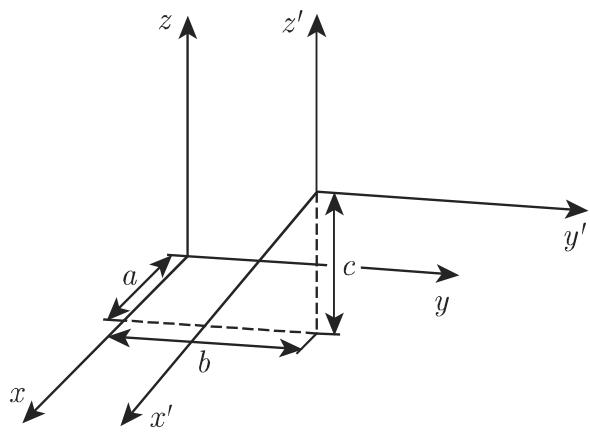  
3.175

给出， 称为坐标系的旋转矩阵．特殊的旋转矩阵

$$
\boldsymbol {D} _ {x} (\alpha) = \left( \begin{array}{c c c} 1 & 0 & 0 \\ 0 & \cos \alpha & \sin \alpha \\ 0 & - \sin \alpha & \cos \alpha \end{array} \right)\tag{3.360b}
$$

刻画的是 x, y,z 坐标系绕 轴旋转 $\dot { \alpha }$ 角．类似地， x, $y .$ ,z 坐标系绕 $y$ 轴旋转 $\displaystyle { \beta }$ 角或轴旋转 $\gamma$ 角可以用下面的旋转矩阵来刻画：

$$
\boldsymbol {D} _ {y} (\beta) = \left( \begin{array}{c c c} \cos \beta & 0 & - \sin \beta \\ 0 & 1 & 0 \\ \sin \beta & 0 & \cos \beta \end{array} \right),\tag{3.360c}
$$

$$
\boldsymbol {D} _ {z} (\gamma) = \left( \begin{array}{c c c} \cos \gamma & \sin \gamma & 0 \\ - \sin \gamma & \cos \gamma & 0 \\ 0 & 0 & 1 \end{array} \right).\tag{3.360d}
$$

评论 x,y,z 坐标系绕通过原点的任意轴旋转可以借助方向余弦（参见 3.5.3.4),卡当角（参见 3.5.3.5) 或欧拉角（参见 3.5.3.6) 来刻画，

．对象的旋转

在儿何中区分了两种类型的变换（也见第 307 页， 3.5.4):

a) 坐标变换（变换坐标系）；

b) 儿何变换（在一个固定坐标系中改变儿何对象的位置）．

因此，在绕通过原点的一个任意轴旋转中可以区分出下而两种：

a) 坐标系的旋转（见 (3.360a)\~(3.360d));

b) 一个对象在一个固定坐标系中的旋转．在这一情形有

$$
\underline {{x}} _ {P} ^ {\prime} = R \underline {{x}} _ {P},\tag{3.361a}
$$

$$
\boldsymbol {R} = \boldsymbol {D} ^ {- 1} = \boldsymbol {D} ^ {\mathrm{T}}.\tag{3.361b}
$$

这里，公式 (3.361a), (3.361b) 刻画的是该对象初始位置的坐标 $x _ { P } , y _ { P } , z _ { P }$ 与它在旋转后的坐标 $x _ { P } ^ { \prime } , y _ { P } ^ { \prime } , z _ { P } ^ { \prime }$ 之间的关系． 称为对象的旋转矩阵．

评论 (1) 对围绕通过原点的一个任意轴旋转，我们将利用四元数作出适当的描述（参见第 397 4.4.2.5).

(2) 我们将在第 312 页的例子中讨论围绕不通过原点的一个任意轴旋转的问题．

3.5.3.4 带有方向余弦的旋转

1. 坐标轴的旋转

如果给定新坐标轴的方向余弦（如表 3.23，也见图 3.176)，则对千新、旧坐标有

$$
\begin{array}{r l} & x ^ {\prime} = l _ {1} x + m _ {1} y + n _ {1} z, \\ & y ^ {\prime} = l _ {2} x + m _ {2} y + n _ {2} z, \\ & z ^ {\prime} = l _ {3} x + m _ {3} y + n _ {3} z; \\ & x = l _ {1} x ^ {\prime} + l _ {2} y ^ {\prime} + l _ {3} z ^ {\prime}, \\ & y = m _ {1} x ^ {\prime} + m _ {2} y ^ {\prime} + m _ {3} z ^ {\prime}, \\ & z = n _ {1} x ^ {\prime} + n _ {2} y ^ {\prime} + n _ {3} z ^ {\prime}. \end{array}\tag{3.362a}
$$

(3.362b)

变换 (3.362a) 的系数矩阵称为旋转矩阵D, 变换行列式 $\varcorner$ 为

$$
\boldsymbol {D} = \left( \begin{array}{c c c} l _ {1} & l _ {2} & l _ {3} \\ m _ {1} & m _ {2} & m _ {3} \\ n _ {1} & n _ {2} & n _ {3} \end{array} \right),\tag{3.362c}
$$

$$
\det \pmb {D} = \varDelta = \left| \begin{array}{c c c} l _ {1} & l _ {2} & l _ {3} \\ m _ {1} & m _ {2} & m _ {3} \\ n _ {1} & n _ {2} & n _ {3} \end{array} \right|.\tag{3.362d}
$$

下列关系成立：

$$
\left( \begin{array}{l} {x ^ {\prime}} \\ {y ^ {\prime}} \\ {z ^ {\prime}} \end{array} \right) = D \left( \begin{array}{l} {x} \\ {y} \\ {z} \end{array} \right) \qquad \text {或} \qquad \left( \begin{array}{l} {x} \\ {y} \\ {z} \end{array} \right) = D ^ {- 1} \left( \begin{array}{l} {x ^ {\prime}} \\ {y ^ {\prime}} \\ {z ^ {\prime}} \end{array} \right).\tag{3.362e}
$$

3.23 坐标变换下的方向余弦记号

<table><tr><td rowspan="2">旧坐标轴</td><td colspan="3">新坐标轴的方向余弦</td></tr><tr><td> $x'$ </td><td> $y'$ </td><td> $z'$ </td></tr><tr><td>x</td><td> $l_1$ </td><td> $l_2$ </td><td> $l_3$ </td></tr><tr><td>y</td><td> $m_1$ </td><td> $m_2$ </td><td> $m_3$ </td></tr><tr><td>z</td><td> $n_1$ </td><td> $n_2$ </td><td> $n_3$ </td></tr></table>

2. 变换行列式的性质

a) $\varDelta = \pm 1$ ，如果像原来一样，变换后仍是左手系或右手系，则取正号；如果改变定向，则取负号．

b) 行或列的元素平方之和总等千 1.

c) 两个不同的行或列的对应元素乘积之和等千 （参见第 368 4.1.4, 9.).

d) 每个元素可以写成 $\varDelta = \pm 1$ 和它的代数余子式之积（参见第 373 4.2.1).

3. 标量不变量

在平移和旋转过程中保持其值的标量称为标量不变量．两个向量的标量积是一个标量不变量（参见第 247 3.5.1.5, 3.).

A: 向量 $\vec { a } = \{ a _ { 1 } , a _ { 2 } , a _ { 3 } \}$ 的分量不是标量不变量，因为其值在平移和旋转中发生了改变

B: 向量 $\vec { a } = \{ a _ { 1 } , a _ { 2 } , a _ { 3 } \}$ 的长，即量 $\sqrt { a _ { 1 } ^ { 2 } + a _ { 2 } ^ { 2 } + a _ { 3 } ^ { 2 } }$ 是一个标量不变量．

■ C: 向量与其自身的标量积是一个标量不变量：

$$
\vec {a} \vec {a} = \vec {a} ^ {2} = | \vec {a} | ^ {2} \cos \varphi = | \vec {a} ^ {2} |,
$$

因为 $\varphi = 0$

3.5.3.5 卡丹角

1. 卡丹角 (Cardan) 的定义

每个围绕通过原点的一个任意轴的坐标系旋转，可以用三个相继的围绕坐标轴的旋转来刻画．如果旋转按下面的次序进行（图 3.176)，则旋转角 $\alpha , ~ \beta , ~ \gamma$ 计称为卡丹角：

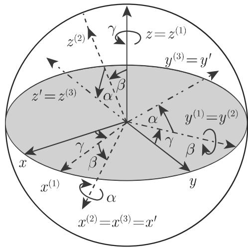  
3.176

(1) 第一次是围绕 轴旋转一个角 $\gamma ,$ ，其结果是 $x ^ { ( 1 ) } , y ^ { ( 1 ) } , z ^ { ( 1 ) }$ 坐标系并且有$z ^ { ( 1 ) } = z$

(2) 第二次是围绕 轴在第一次旋转后的像旋转，即围绕 $y ^ { ( 1 ) }$ 轴旋转一个角 $\beta .$ 其结果是 $x ^ { ( 2 ) } , y ^ { ( 2 ) } , z ^ { ( 2 ) }$ 坐标系并且有 $y ^ { ( 2 ) } = y ^ { ( 1 ) }$

(3) 第三次是围绕 轴在第二次旋转后的像旋转，即围绕 $x ^ { ( 2 ) }$ 轴旋转一个角a.其结果是最终要求的 $x ^ { \prime } , y ^ { \prime } , z ^ { \prime }$ 坐标系， $x ^ { \prime } = x ^ { ( 3 ) } = x ^ { ( 2 ) } , y ^ { \prime } = y ^ { ( 3 ) } , z ^ { \prime } = z ^ { ( 3 ) }$

评论 文献中给出的卡丹角的定义并不完全相同

2. 旋转矩阵 $D _ { \mathrm { C } }$ 的计算

由给定的旋转次序 (3.360a)rv(3.360d) 推得旋转矩阵 $D = D _ { \mathrm { { C } } }$ 为

$$
\boldsymbol {D} _ {\mathrm{C}} = \boldsymbol {D} _ {x} (\alpha) \boldsymbol {D} _ {y} (\beta) \boldsymbol {D} _ {z} (\gamma).\tag{3.363a}
$$

根据法尔克 (Falk) 图式（也参见第 366 页图 4.1, 4.2)

$$
\begin{array}{c c} & D _ {z} (\gamma) \\ \hline D _ {y} (\beta) & D _ {y} (\beta) D _ {z} (\gamma) \\ \hline D _ {x} (\alpha) & D _ {\mathrm{C}} \end{array}\tag{3.363b}
$$

即

$$
\begin{array}{r} D _ {\mathrm{C}} = \left( \begin{array}{c c c} \cos \beta \cos \gamma & \cos \beta \sin \gamma & - \sin \beta \\ - \cos \alpha \sin \gamma + \sin \alpha \cos \gamma \sin \beta & \cos \alpha \cos \gamma + \sin \alpha \sin \beta \sin \gamma & \sin \alpha \cos \beta \\ \sin \alpha \sin \gamma + \cos \alpha \cos \gamma \sin \beta & \cos \alpha \sin \beta \sin \gamma - \sin \alpha \cos \gamma & \cos \alpha \cos \beta \end{array} \right) \end{array}\tag{3.363c}
$$

3. 方向余弦作为卡丹角的函数

因为旋转矩阵 （参见第 286 (3.362c)）和 $D _ { \mathrm { { C } } } ~ ( { \mathrm { ~ \AE ~ } } ( 3 . 3 6 3 \mathrm { { c } ) } )$ 相一致，所以方向余弦可以表示成卡丹角的函数：

$$
\begin{array}{l l l} {l _ {1} = c _ {2} c _ {3},} & {m _ {1} = c _ {2} s _ {3},} & {n _ {1} = s _ {2};} \\ {l _ {2} = - c _ {1} s _ {3} + s _ {1} c _ {3} s _ {2},} & {m _ {2} = c _ {1} c _ {3} + s _ {1} s _ {2} s _ {3},} & {n _ {2} = s _ {1} c _ {2};} \\ {l _ {3} = s _ {1} s _ {3} + c _ {1} c _ {3} s _ {2},} & {m _ {3} = c _ {1} s _ {2} s _ {3} - s _ {1} c _ {3},} & {n _ {3} = c _ {1} c _ {3},} \end{array}\tag{3.364a}
$$

其中

$$
\begin{array}{r l} & c _ {1} = \cos \alpha , \quad c _ {2} = \cos \beta , \quad c _ {3} = \cos \gamma , \\ & s _ {1} = \sin \alpha , \quad s _ {2} = \sin \beta , \quad s _ {3} = \sin \gamma . \end{array}\tag{3.364b}
$$

3.5.3.6 欧拉角

1. 欧拉角的定义

新坐标系相对千旧坐标系的位置，可以由欧拉引入的三个角唯一确定（图 3.177).

a) 章动角 $\pmb \theta$ 是z轴与 $z ^ { \prime }$ 轴正向之间的夹角，并有 $0 \leqslant \theta < \pi$

b) 进动角 $\psi$ 轴正向与 $x , y$ 平面和对 $x ^ { \prime } , y ^ { \prime }$ 平面的交线 之间的夹角．的正向的选取依赖千 轴， $z ^ { \prime }$ ＇轴和 是否形成一个与坐标轴具有相同定向的三元组（参见第 246 页， 3.5.1.3, 2. ）． $\psi$ 心是按从 轴到 $y$ 轴的方向度量的并有 $0 \leqslant \psi$ $< \ \pi$

c) 旋转角 $\varphi$ 是 $x ^ { \prime }$ 轴正向与交线 之间的夹角＇并有 $0 \leqslant \varphi < 2 \pi$

评论 在文献中对千欧拉角也使用其他的定义．

  
3.177

2. 旋转矩阵 $D _ { \mathrm { E } }$ 的计算

从坐标系 $x , y , z$ 过渡到坐标系 $x ^ { \prime } , y ^ { \prime } , z ^ { \prime }$ （图 3.177) 可以通过以下考虑的三个旋转 (3.360a)rv(3.360d) 给出：

(1) 第一次是围绕 轴旋转角 $\psi$ ，结果是坐标系 $x ^ { ( 1 ) } , y ^ { ( 1 ) } , z ^ { ( 1 ) }$ ，其中 $z ^ { ( 1 ) } = z \colon$

$$
\left( \begin{array}{c} {x ^ {(1)}} \\ {y ^ {(1)}} \\ {z ^ {(1)}} \end{array} \right) = \left( \begin{array}{c c c} {\cos \psi} & {\sin \psi} & {0} \\ {- \sin \psi} & {\cos \psi} & {0} \\ {0} & {0} & {1} \end{array} \right) \left( \begin{array}{c} {x} \\ {y} \\ {z} \end{array} \right), \text {即} \underline {{\boldsymbol {x}}} ^ {(1)} = \boldsymbol {D} _ {z} (\psi) \underline {{\boldsymbol {x}}}.\tag{3.365a}
$$

轴 $x ^ { ( 1 ) }$ 与交线 重合

(2) 第二次是围绕 $x ^ { ( 1 ) }$ 轴旋转角 $\theta ,$ 结果是坐标系 $x ^ { ( 2 ) } , y ^ { ( 2 ) } , z ^ { ( 2 ) }$ ，其中 $x ^ { ( 2 ) } =$ $x ^ { ( 1 ) }$

$$
\left( \begin{array}{c} {{{x ^ {(2)}}}} \\ {{{y ^ {(2)}}}} \\ {{{z ^ {(2)}}}} \end{array} \right) = \left( \begin{array}{c c c} {{{1}}} & {{{0}}} & {{{0}}} \\ {{{0}}} & {{{\cos \vartheta}}} & {{{\sin \vartheta}}} \\ {{{0}}} & {{{- \sin \vartheta}}} & {{{\cos \vartheta}}} \end{array} \right) \left( \begin{array}{c} {{{x ^ {(1)}}}} \\ {{{y ^ {(1)}}}} \\ {{{z ^ {(1)}}}} \end{array} \right), \text {即} \underline {{{{\pmb x}}}} ^ {(2)} = \pmb D _ {x} (\vartheta) \underline {{{{\pmb x}}}} ^ {(1)}\tag{3.365b}
$$

(3) 第三次是围绕 $z ^ { ( 2 ) }$ 轴旋转角 $\varphi ,$ 结果是最终的坐标系 $x ^ { \prime } , y ^ { \prime } , z ^ { \prime } ,$ 其中 $z ^ { \prime } =$ $z ^ { ( 2 ) }$

$$
\left( \begin{array}{c} {x ^ {\prime}} \\ {y ^ {\prime}} \\ {z ^ {\prime}} \end{array} \right) = \left( \begin{array}{c c c} {\cos \varphi} & {\sin \varphi} & {0} \\ {- \sin \varphi} & {\cos \varphi} & {0} \\ {0} & {0} & {1} \end{array} \right) \left( \begin{array}{c} {x ^ {(2)}} \\ {y ^ {(2)}} \\ {z ^ {(2)}} \end{array} \right), \text {即} \underline {{{{\boldsymbol {x}}}}} ^ {\prime} = D _ {z} (\varphi) \underline {{{{\boldsymbol {x}}}}} ^ {(2)}.\tag{3.365c}
$$

它们一起对千 (3.360a) 中的 $D = D _ { \mathrm { E } }$ 成立有

$$
\boldsymbol {D} _ {\mathrm{E}} = \boldsymbol {D} _ {z} (\varphi) \boldsymbol {D} _ {x} (\vartheta) \boldsymbol {D} _ {z} (\psi).\tag{3.366a}
$$

类似千旋转矩阵 $D _ { \mathrm { { C } } }$ 的计算，应用法尔克图式，这里的形式为

$$
\begin{array}{c c} & D _ {z} (\psi) \\ \hline D _ {x} (\vartheta) & D _ {x} (\vartheta) D _ {z} (\psi) \\ \hline D _ {z} (\varphi) & D _ {z} (\varphi) D _ {x} (\vartheta) D _ {z} (\psi) = D _ {\mathrm{E}} \end{array}\tag{3.366b}
$$

得

$$
\boldsymbol {D} _ {\mathrm{E}} = \left( \begin{array}{c c c} \cos \varphi \cos \psi - \sin \varphi \cos \vartheta \sin \psi & \cos \varphi \sin \psi + \sin \varphi \cos \vartheta \cos \psi & \sin \varphi \sin \vartheta \\ - \sin \varphi \cos \psi - \cos \varphi \cos \vartheta \sin \psi & - \sin \varphi \sin \psi + \cos \varphi \cos \vartheta \cos \psi & \cos \varphi \sin \vartheta \\ \sin \vartheta \sin \psi & - \sin \vartheta \cos \psi & \cos \vartheta \end{array} \right)\tag{3.366c}
$$

3. 方向余弦作为欧拉角的函数

因为旋转矩阵 （参见第 286 (3.362c)）和 $D _ { \mathrm { E } }$ （见（3.366c)）等同所以对千方向余弦作为欧拉角的函数下列公式成立：

$$
\begin{array}{l l l} {l _ {1} = c _ {2} c _ {3} - c _ {1} s _ {2} s _ {3},} & {m _ {1} = s _ {2} c _ {3} + c _ {1} c _ {2} s _ {3},} & {n _ {1} = s _ {1} s _ {3};} \\ {l _ {2} = - c _ {2} s _ {3} - c _ {1} s _ {2} c _ {3},} & {m _ {2} = - s _ {2} s _ {3} + c _ {1} c _ {2} c _ {3},} & {n _ {2} = s _ {1} c _ {3};} \\ {l _ {3} = s _ {1} s _ {2},} & {m _ {3} = - s _ {1} c _ {2},} & {n _ {3} = c _ {1},} \end{array}\tag{3.367a}
$$

其中

$$
\begin{array}{r l} & c _ {1} = \cos \vartheta , \quad c _ {2} = \cos \psi , \quad c _ {3} = \cos \varphi , \\ & s _ {1} = \sin \vartheta , \quad s _ {2} = \sin \psi , \quad s _ {3} = \sin \varphi . \end{array}\tag{3.367b}
$$

3.5.3.7 空间中的特殊量

1. 质心坐标

个具有质量为 $m _ { i }$ 的质点 $P _ { i } ( x _ { i } , y _ { i } , z _ { i } )$ 系的质心（常常被不正确地称为重心）坐标由下列公式计算，其中求和指标从 变到 n:

$$
\bar {x} = \frac {\sum m _ {i} x _ {i}}{\sum m _ {i}}, \quad \bar {y} = \frac {\sum m _ {i} y _ {i}}{\sum m _ {i}}, \quad \bar {z} = \frac {\sum m _ {i} z _ {i}}{\sum m _ {i}}.\tag{3.368}
$$

2. 线段的分割

以给定的比

$$
\frac {\overline {{P _ {1} P}}}{\overline {{P P}} _ {2}} = \frac {m}{n} = \lambda\tag{3.369a}
$$

分 $P _ { 1 } ( x _ { 1 } , y _ { 1 } , z _ { 1 } )$ 和 $P _ { 2 } ( x _ { 2 } , y _ { 2 } , z _ { 2 } )$ 之间线段的点 $P ( x , y , z )$ 的坐标由下面的公式给出

$$
x = \frac {n x _ {1} + m x _ {2}}{n + m} = \frac {x _ {1} + \lambda x _ {2}}{1 + \lambda},\tag{3.369b}
$$

$$
y = \frac {n y _ {1} + m y _ {2}}{n + m} = \frac {y _ {1} + \lambda y _ {2}}{1 + \lambda},\tag{3.369c}
$$

$$
z = \frac {n z _ {1} + m z _ {2}}{n + m} = \frac {z _ {1} + \lambda z _ {2}}{1 + \lambda}.\tag{3.369d}
$$

该线段的中点坐标为

$$
x _ {m} = \frac {x _ {1} + x _ {2}}{2}, y _ {m} = \frac {y _ {1} + y _ {2}}{2}, z _ {m} = \frac {z _ {1} + z _ {2}}{2}.\tag{3.369e}
$$

3. 两点之间的距离

3.178 中两点 $P _ { 1 } ( x _ { 1 } , y _ { 1 } , z _ { 1 } )$ ）和 $P _ { 2 } ( x _ { 2 } , y _ { 2 } , z _ { 2 } )$ 之间的距离是

$$
d = \sqrt {\left(x _ {2} - x _ {1}\right) ^ {2} + \left(y _ {2} - y _ {1}\right) ^ {2} + \left(z _ {2} - z _ {1}\right) ^ {2}}.\tag{3.370a}
$$

这两点之间线段的方向余弦可以用下面的公式计算：

$$
\cos \alpha = \frac {x _ {2} - x _ {1}}{d}, \quad \cos \beta = \frac {y _ {2} - y _ {1}}{d}, \quad \cos \gamma = \frac {z _ {2} - z _ {1}}{d}.\tag{3.370b}
$$

4. 四点系

四个点 $P ( x , y , z ) , P _ { 1 } ( x _ { 1 } , y _ { 1 } , z _ { 1 } ) , P _ { 2 } ( x _ { 2 } , y _ { 2 } , z _ { 2 } )$ 和 $P _ { 3 } ( x _ { 3 } , \ y _ { 3 } , \ z _ { 3 } )$ 可以形成一个四面体（图 3.179) 或共面．四面体的体积可以用下面的公式计算：

$$
V = \frac {1}{6} \left| \begin{array}{c c c c} x & y & z & 1 \\ x _ {1} & y _ {1} & z _ {1} & 1 \\ x _ {2} & y _ {2} & z _ {2} & 1 \\ x _ {3} & y _ {3} & z _ {3} & 1 \end{array} \right| = \frac {1}{6} \left| \begin{array}{c c c} x - x _ {1} & y - y _ {1} & z - z _ {1} \\ x - x _ {2} & y - y _ {2} & z - z _ {2} \\ x - x _ {3} & y - y _ {3} & z - z _ {3} \end{array} \right|,\tag{3.371}
$$

其中，如果三个向量 $\overrightarrow { P P } _ { 1 } , \overrightarrow { P P } _ { 2 } , \overrightarrow { P P } _ { 3 }$ 的方向与坐标轴相同（参见第 246 3.5.1.3,2.），则它具有正值 $V > 0$ 否则它是负的．

四点共面当且仅当有

$$
\left| \begin{array}{c c c c} x & y & z & 1 \\ x _ {1} & y _ {1} & z _ {1} & 1 \\ x _ {2} & y _ {2} & z _ {2} & 1 \\ x _ {3} & y _ {3} & z _ {3} & 1 \end{array} \right| = 0.\tag{3.372}
$$

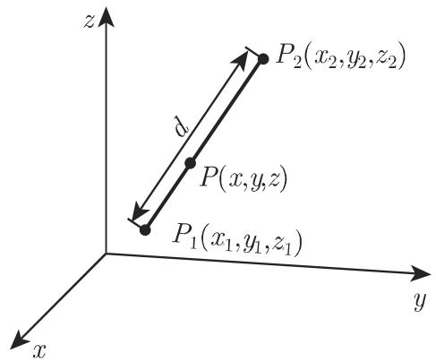  
3.178

  
3.179

3.5.3.8 曲面的方程

方程

$$
F (x, y, z) = 0\tag{3.373}
$$

常常对应千一个曲面并有性质它的每个点的坐标满足上述方程反之，坐标满足上述方程的点都是该曲面上的点方程 (3.373) 称为该曲面的方程．如果空间中没有任何实点满足方程 (3.373)，则不存在实曲面．

1. 柱面的方程（参见第 207 3.3.4, (1))

柱面方程母线平行千 轴的柱面方程不含有 坐标： $F ( y , z ) = 0$ 类似地，母线平行千 轴或 轴的柱面方程不含有 坐标或 坐标：分别为 $F ( x , z ) = 0$ 或$F ( x , y ) = 0$ 方程 $F ( x , y ) = 0$ 刻画了柱面与 x,y 平面的交线如果给定柱面母线的方向余弦或比例量 l,m,n，则该柱面方程具有形式

$$
F (n x - l z, n y - m z) = 0.\tag{3.374}
$$

2. 旋转对称曲面的方程

旋转对称曲面是通过在 x, 平面上给定的一条曲线 $z = f ( x )$ 轴旋转产生的曲面（图 3.180)，具有形式

$$
z = f \left(\sqrt {x ^ {2} + y ^ {2}}\right).\tag{3.375}
$$

其他变量情形的旋转对称曲面的方程也可以类似地得到．

·顶点在原点的锥面（参见第 209 3.3.4, (7) ）方程具有形式 $F ( x , y , z ) = 0 { \mathrm { , } }$ ，其中是坐标的齐次函数（参见第 158 2.18.2.5, 4.），如

$$
F (x, y, z) = z - \sqrt {x ^ {2} + y ^ {2}} = 0
$$

具有齐性次数 1, $F ( \lambda x , \lambda y , \lambda z ) = \lambda F ( x , y , z )$

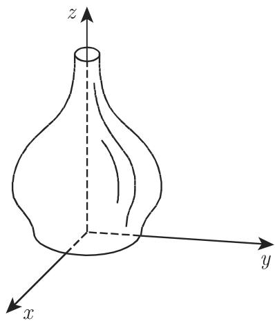  
3.180

3.5.3.9 空间曲线的方程

一条空间曲线可以由三个参数方程

$$
x = \varphi_ {1} (t), y = \varphi_ {2} (t), z = \varphi_ {3} (t)\tag{3.376}
$$

来定义．

对千参数 的每个值（它不必具有几何意义），都对应曲线的一个点．

定义空间曲线的另一种方法是用两个方程

$$
F _ {1} (x, y, z) = 0, \quad F _ {2} (x, y, z) = 0\tag{3.377}
$$

来确定两者都定义了一个曲面空间曲线包含的是所有坐标满足两个方程的点即空间曲线是两个给定曲面的交线．一般来说，对千任意的入，形如

$$
F _ {1} + \lambda F _ {2} = 0\tag{3.378}
$$

的每个方程都定义了通过所考虑的曲线的一个曲面，因此，它可以替换 (3.377)的任何一个方程

3.5.3.10 空间中的直线和平面

1. 平面方程

每个坐标线性方程都定义了一个平面反之，每个平面都具有一个一次方程

(1) 平面的一般方程

a) 坐标形式

$$
A x + B y + C z + D = 0;\tag{3.379a}
$$

b) 向量形式

$$
\vec {r} \vec {N} + D = 0,\tag{3.379b}
$$

其中向量 $\overrightarrow { N } ( A , B , C )$ 垂直千平面在图 3.181 中显示了截距 a, c. 向量 $\xrightarrow [ N ] { }$ 称为平面的法向量其方向余弦是

$$
\cos \alpha = \frac {A}{\sqrt {A ^ {2} + B ^ {2} + C ^ {2}}}, \cos \beta = \frac {B}{\sqrt {A ^ {2} + B ^ {2} + C ^ {2}}}, \cos \gamma = \frac {C}{\sqrt {A ^ {2} + B ^ {2} + C ^ {2}}}.\tag{3.379c}
$$

如果 $D = 0$ 成立，则平面通过原点；当 $A = 0 .$ ，或 $B = 0$ 或 $C = 0$ 时，平面分别平行千 轴或 轴．如果 $A = B = 0$ ，或 $A = C = 0 .$ ，或 $B = C = 0$ , 则平面分别平行千 $x , y$ 平面， $x , z$ 平面或 $y , z$ 平面

(2) 平面方程的黑赛法式

a) 坐标形式

$$
x \cos \alpha + y \cos \beta + z \cos \gamma - p = 0;\tag{3.380a}
$$

b) 向量形式

$$
\vec {r} \overrightarrow {N} ^ {0} - p = 0,\tag{3.380b}
$$

其中 $\overrightarrow { N } ^ { 0 }$ 是平面的单位法向量， 是原点到平面的距离黑塞法式可以由平面的一般方程 (3.379a) 通过乘以正规化因子

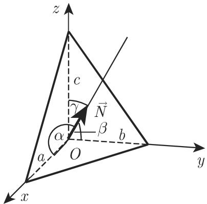  
3.181

$$
\pm \mu = \frac {1}{N} = \frac {1}{\sqrt {A ^ {2} + B ^ {2} + C ^ {2}}}, \quad \text {其中} N = | \vec {N} |
$$

得到这里 $\mathbf { \nabla } \cdot \mu$ 的符号应取成与 的符号相反．

(3.380c)

(3) 平面方程的截距式 线段 $a , b , c$ 是平面截坐标轴所得（图 3.181)，根据它们在坐标轴上的位置考虑其符号，则有

$$
{\frac {x}{a}} + {\frac {y}{b}} + {\frac {z}{c}} = 1.\tag{3.381}
$$

(4) 通过三点的平面方程

如果点是 $P _ { 1 } ( x _ { 1 } , y _ { 1 } , z _ { 1 } ) , P _ { 2 } ( x _ { 2 } , y _ { 2 } , z _ { 2 } )$ ）和 $P _ { 3 } ( x _ { 3 } , y _ { 3 } , z _ { 3 } )$ ，则有

a) 坐标形式

$$
\left| \begin{array}{c c c} x - x _ {1} & y - y _ {1} & z - z _ {1} \\ x _ {2} - x _ {1} & y _ {2} - y _ {1} & z _ {2} - z _ {1} \\ x _ {3} - x _ {1} & y _ {3} - y _ {1} & z _ {3} - z _ {1} \end{array} \right| = 0,\tag{3.382a}
$$

b) 向量形式 $\left( { \vec { r } } - { \vec { r } } _ { 1 } \right) \left( { \vec { r } } _ { 2 } - { \vec { r } } _ { 1 } \right) \left( { \vec { r } } _ { 3 } - { \vec { r } } _ { 1 } \right) = 0 .$

(3.382b)

(5) 通过两点且平行千一条直线的平面方程 通过两点 $P _ { 1 } ( x _ { 1 } , y _ { 1 } , z _ { 1 } ) , P _ { 2 } ( x _ { 2 }$ $y _ { 2 } , z _ { 2 } )$ ）并且平行千具有方向向量 $\vec { R } ( l , m , n )$ 的直线的平面方程为

a) 坐标形式

$$
\left| \begin{array}{c c c} x - x _ {1} & y - y _ {1} & z - z _ {1} \\ x _ {2} - x _ {1} & y _ {2} - y _ {1} & z _ {2} - z _ {1} \\ l & m & n \end{array} \right| = 0;\tag{3.383a}
$$

b) 向量形式＊ $\left( \vec { r } - \vec { r _ { 1 } } \right) \left( \vec { r _ { 2 } } - \vec { r _ { 1 } } \right) \vec { R } = 0$

(3.383b)

(6) 通过一点且平行千两条直线的平面方程 如果直线的方向向量 $\vec { R } _ { 1 } ( l _ { 1 }$ $m _ { 1 } , n _ { 1 } )$ 和 $\vec { R } _ { 2 } ( l _ { 2 } , m _ { 2 } , n _ { 2 } )$ ，则有

a) 坐标形式

$$
\left| \begin{array}{c c c} x - x _ {1} & y - y _ {1} & z - z _ {1} \\ l _ {1} & m _ {1} & n _ {1} \\ l _ {2} & m _ {2} & n _ {2} \end{array} \right| = 0;\tag{3.384a}
$$

b) 向量形式＊

$$
\left(\vec {r} - \vec {r} _ {1}\right) \vec {R} _ {1} \vec {R} _ {2} = 0.\tag{3.384b}
$$

(7) 通过一点且垂直千一条直线的平面方程 如果点是 $P _ { 1 } ( x _ { 1 } , y _ { 1 } , z _ { 1 } )$ ，直线的方向向量是 $\vec { N } ( A , B , C )$ ，则有

a) 坐标形式

$$
A (x - x _ {1}) + B (y - y _ {1}) + C (z - z _ {1}) = 0;\tag{3.385a}
$$

b) 向量形式

$$
\left(\vec {r} - \vec {r _ {1}}\right) \vec {N} = 0.\tag{3.385b}
$$

(8) 点到平面的距离 在平面方程的黑赛法式 (3.380a)

$$
x \cos \alpha + y \cos \beta + z \cos \gamma - p = 0\tag{3.386a}
$$

中代入点 $P ( a , b , c )$ 的坐标，结果为带符号的距离

$$
\delta = a \cos \alpha + b \cos \beta + c \cos \delta - p,\tag{3.386b}
$$

如果 和原点在平面的两侧，则 $\delta > 0$ ，在相反的情形 $\delta < 0$

(9) 通过两平面交线的平面方程 通过由方程 $A _ { 1 } x + B _ { 1 } y + C _ { 1 } z + D _ { 1 } = 0$ 和$A _ { 2 } x + B _ { 2 } y + C _ { 2 } z + D _ { 2 } = 0$ 给定的两平面的交线的平面方程是

a) 坐标形式

$$
A _ {1} x + B _ {1} y + C _ {1} z + D _ {1} + \lambda (A _ {2} x + B _ {2} y + C _ {2} z + D _ {2}) = 0.\tag{3.387a}
$$

b) 向量形式

$$
\vec {r} \vec {N _ {1}} + D _ {1} + \lambda (\vec {r} \vec {N _ {2}} + D _ {2}) = 0.\tag{3.387b}
$$

＊关于三个向量的混合积见第 249 3.5.1.6, 2.

关千两个向量的标量积见第 247 3.5.1.5, 1.；按仿射坐标给出的标量积见第 2503.5.1.6, 5. ；关千平面的向量方程见第 252 3.5.1.7.

这里入是一个实参数，因此 (3.387a) (3.387b) 定义了一个平面束．图 3.182 显示的是三个平面的情形如果在 (3.387a) (3.387b) 中入取－oo 和＋oo 之间的所有值，则将得到平而束中的全部平而 $\left( A _ { 2 } x + B _ { 2 } y + C _ { 2 } z + D _ { 2 } = 0 \right.$ 除外）．如果给定的两平面方程由法式表示，则对千 $\lambda { = } \pm 1$ 将得到平分这两个平面夹角的平面方程．

  
3.182

2. 空间中的两个和多个平面

(1) 两平面之间的夹角，一般情形 由方程 $A _ { 1 } x + B _ { 1 } y + C _ { 1 } z + D _ { 1 } = 0$ 和$A _ { 2 } x + B _ { 2 } y + C _ { 2 } z + D _ { 2 } = 0$ 给定的两平面之间的夹角 $\varphi$ 叮以用下面的公式计算：

$$
\cos \varphi = \frac {A _ {1} A _ {2} + B _ {1} B _ {2} + C _ {1} C _ {2}}{\sqrt {(A _ {1} ^ {2} + B _ {1} ^ {2} + C _ {1} ^ {2}) (A _ {2} ^ {2} + B _ {2} ^ {2} + C _ {2} ^ {2})}}.\tag{3.388a}
$$

如果两平面巾向量方程 $\vec { r } \vec { N } _ { 1 } + D _ { 1 } = 0$ 和 $\vec { r } \vec { N } _ { 2 } + D _ { 2 } = 0$ 给出，则

$$
\cos \varphi = {\frac {{\vec {N}} _ {1}   {\vec {N}} _ {2}}{{N}} _ {1} N _ {2}}, \quad {\text {其中}} \quad N _ {1} = | {\vec {N}} _ {1} |   {\text {而}}   N _ {2} = | {\vec {N}} _ {2} |  .\tag{3.388b}
$$

(2) 三个平面的交点 三个给定的平面 $A _ { 1 } x + B _ { 1 } y + C _ { 1 } z + D _ { 1 } = 0 , A _ { 2 } x +$ $B _ { 2 } y + C _ { 2 } z + D _ { 2 } = 0$ 和 $A _ { 3 } x + B _ { 3 } y + C _ { 3 } z + D _ { 3 } = 0$ 的交点坐标由公式

$$
\bar {x} = \frac {- \varDelta_ {x}}{\varDelta}, \quad \bar {y} = \frac {- \varDelta_ {y}}{\varDelta}, \quad \bar {z} = \frac {- \varDelta_ {z}}{\varDelta}\tag{3.389a}
$$

计算，其中

$$
\Delta = \left| \begin{array}{c c c} A _ {1} & B _ {1} & C _ {1} \\ A _ {2} & B _ {2} & C _ {2} \\ A _ {3} & B _ {3} & C _ {3} \end{array} \right|, \quad \Delta_ {x} = \left| \begin{array}{c c c} D _ {1} & B _ {1} & C _ {1} \\ D _ {2} & B _ {2} & C _ {2} \\ D _ {3} & B _ {3} & C _ {3} \end{array} \right|,
$$

$$
\Delta_ {y} = \left| \begin{array}{c c c} A _ {1} & D _ {1} & C _ {1} \\ A _ {2} & D _ {2} & C _ {2} \\ A _ {3} & D _ {3} & C _ {3} \end{array} \right|, \quad \Delta_ {z} = \left| \begin{array}{c c c} A _ {1} & B _ {1} & D _ {1} \\ A _ {2} & B _ {2} & D _ {2} \\ A _ {3} & B _ {3} & D _ {3} \end{array} \right|.\tag{3.389b}
$$

如果有 $\varDelta \neq 0$ ，则三个平面交千一点．如果有 $\varDelta = 0$ 并且至少有一个二阶非零子式则平面平行千一条直线如果每个二阶子式都等千 $0 ,$ ，则平面通过一条直线

3. 两平面平行和垂直的条件

a) 平行的条件如果有

$$
\frac {A _ {1}}{A _ {2}} = \frac {B _ {1}}{B _ {2}} = \frac {C _ {1}}{C _ {2}} \quad \text {或} \quad \vec {N} _ {1} \times \vec {N} _ {2} = \vec {0}\tag{3.390}
$$

成立，则两平面平行

b) 垂直的条件如果有

$$
A _ {1} A _ {2} + B _ {1} B _ {2} + C _ {1} C _ {2} = 0 \quad \text {或} \quad \vec {N} _ {1} \vec {N} _ {2} = 0\tag{3.391}
$$

成立，则两平面互相垂直

4. 四个平面的交点

四个平面 $A _ { 1 } x + B _ { 1 } y + C _ { 1 } z + D _ { 1 } = 0 , A _ { 2 } x + B _ { 2 } y + C _ { 2 } z + D _ { 2 } = 0 , A _ { 3 } x +$ $B _ { 3 } y + C _ { 3 } z + D _ { 3 } = 0$ 和 $A _ { 4 } x + B _ { 4 } y + C _ { 4 } z + D _ { 4 } = 0$ 具有一个公共点仅当行列式

$$
\delta = \left| \begin{array}{c c c c} A _ {1} & B _ {1} & C _ {1} & D _ {1} \\ A _ {2} & B _ {2} & C _ {2} & D _ {2} \\ A _ {3} & B _ {3} & C _ {3} & D _ {3} \\ A _ {4} & B _ {4} & C _ {4} & D _ {4} \end{array} \right| = 0\tag{3.392}
$$

成立在此情形该公共点由三个方程确定，第四个方程是多余的，它可以由其他方程导出．

5. 两平行平面之间的距离

如果由方程

$$
A x + B y + C z + D _ {1} = 0 \quad {\text {和}} \quad A x + B y + C z + D _ {2} = 0\tag{3.393}
$$

给出的两平面平行，则它们之间的距离是

$$
d = \frac {\left| D _ {1} - D _ {2} \right|}{\sqrt {A ^ {2} + B ^ {2} + C ^ {2}}}.\tag{3.394}
$$

3.5.3.11 空间中的直线

1. 直线的方程

(1) 空间直线的方程，一般情形 因为空间中的直线可以定义为两个平面的交线所以它可以表示为两个线性方程形成的方程组．

a) 坐标形式

$$
A _ {1} x + B _ {1} y + C _ {1} z + D _ {1} = 0, \quad A _ {2} x + B _ {2} y + C _ {2} z + D _ {2} = 0.\tag{3.395a}
$$

b) 向量形式

$$
\vec {r} \vec {N} _ {1} + D _ {1} = 0, \quad \vec {r} \vec {N} _ {2} + D _ {2} = 0.\tag{3.395b}
$$

(2) 两投影平面中的直线方程 两个方程

$$
y = k x + a, \quad z = h x + b\tag{3.396}
$$

每一个都定义了一个平面，它们过该直线并分别垂直千 x, 平面和 $x , \ z$ 平面（图 3.183)．它们称为投影平面．这一表示不能用千平行千 $y , \ z$ 平面的直线，因此在这种情形就要考虑其他坐标面的投影

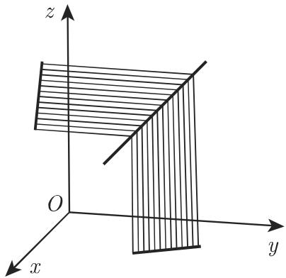  
3.183

(3) 通过一点平行千一个方向向量的直线方程 通过一点 $P _ { 1 } ( x _ { 1 } , \ y _ { 1 } , \ z _ { 1 } )$ 平行千一个方向向量 $\vec { R } ( l , m , n )$ （图 3.184) 的直线方程（或方程组）具有形式：

a) 坐标表示和向量形式

$$
{\frac {x - x _ {1}}{l}} = {\frac {y - y _ {1}}{m}} = {\frac {z - z _ {1}}{n}},\tag{3.397a}
$$

$$
(\vec {r} - \vec {r} _ {1}) \times \vec {R} = \vec {0};\tag{3.397b}
$$

b) 参数形式和向量形式

$$
x = x _ {1} + l t, \quad y = y _ {1} + m t, \quad z = z _ {1} + n t,\tag{3.397c}
$$

$$
\vec {r} = \vec {r} _ {1} + \vec {R} t,\tag{3.397d}
$$

其中数 $x _ { 1 } , y _ { 1 } , z _ { 1 }$ 满足 (3.395a) 中的方程从 (3.395a) 推出 (3.397a) 的表示需求出

$$
l = \left| \begin{array}{c c} B _ {1} & C _ {1} \\ B _ {2} & C _ {2} \end{array} \right|, m = \left| \begin{array}{c c} C _ {1} & A _ {1} \\ C _ {2} & A _ {2} \end{array} \right|, n = \left| \begin{array}{c c} A _ {1} & B _ {1} \\ A _ {2} & B _ {2} \end{array} \right|,\tag{3.398a}
$$

或按向量形式

$$
\vec {R} = \vec {N _ {1}} \times \vec {N _ {2}}.\tag{3.398b}
$$

(4) 通过两点的直线方程 通过两点 $P _ { 1 } ( x _ { 1 } , y _ { 1 } , z _ { 1 } )$ ）和 $P _ { 2 } ( x _ { 2 } , y _ { 2 } , z _ { 2 } )$ 的直线方程（图 3.185)

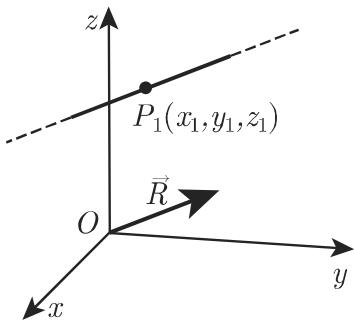  
3.184

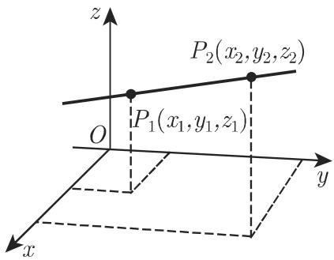  
3.185

坐标形式和向量形式＊

$$
{\frac {x - x _ {1}}{x _ {2} - x _ {1}}} = {\frac {y - y _ {1}}{y _ {2} - y _ {1}}} = {\frac {z - z _ {1}}{z _ {2} - z _ {1}}},\tag{3.399a}
$$

$$
\mathrm{b)} \quad (\vec {r} - \vec {r _ {1}}) \times (\vec {r} - \vec {r _ {2}}) = \vec {0}.\tag{3.399b}
$$

如果 $x _ { 1 } ~ = ~ x _ { 2 }$ 则方程的坐标形式为 $x = x _ { 2 } , \frac { y - y _ { 1 } } { y _ { 2 } - y _ { 1 } } = \frac { z - z _ { 1 } } { z _ { 2 } - z _ { 1 } }$ . 如果有$x _ { 1 } = x _ { 2 } , y _ { 1 } = y _ { 2 }$ 都成立，则方程的坐标形式为 $x = x _ { 2 } , y = y _ { 2 }$

(5) 过一点且垂直千一个平面的直线方程 过点 $P _ { 1 } ( x _ { 1 } , \ y _ { 1 } , \ z _ { 1 } )$ 并垂直千由方程 $A _ { 1 } x + B _ { 1 } y + C _ { 1 } z + D _ { 1 } = 0$ 或 $\vec { r } \vec { N } + D = 0$ （图 3.186) 给定的一个平面的直线方程的

坐标形式和向量形式

$$
\mathrm{a)} \frac {x - x _ {1}}{A} = \frac {y - y _ {1}}{B} = \frac {z - z _ {1}}{C};\tag{3.400a}
$$

b) $( { \vec { r } } - { \vec { r } } _ { 1 } ) \times { \vec { N } } = { \vec { 0 } } .$

(3.400b)

如果有 $A = 0$ 成立，则坐标形式的方程与前面的情形有类似的形式

  
3.186

2. 点到直线距离的坐标形式

点 $M ( a , b , c )$ 到由方程 (3.397a) 给出的直线的距离 满足：

$$
d ^ {2} = \frac {\left[ (a - x _ {1}) m - (b - y _ {1}) l \right] ^ {2} + \left[ (b - y _ {1}) n - (c - z _ {1}) m \right] ^ {2} + \left[ (c - z _ {1}) l - (a - x _ {1}) n \right] ^ {2}}{l ^ {2} + m ^ {2} + n ^ {2}}\tag{3.401}
$$

3. 由坐标形式给出的两直线之间的最短距离

如果两直线是由方程 (3.397a) 给出，则它们的距离是

$$
d = \frac {\pm \left| \begin{array}{c c c} x _ {1} - x _ {2} & y _ {1} - y _ {2} & z _ {1} - z _ {2} \\ l _ {1} & m _ {1} & n _ {1} \\ l _ {2} & m _ {2} & n _ {2} \end{array} \right|}{\sqrt {\left| \begin{array}{c c} l _ {1} & m _ {1} \\ l _ {2} & m _ {2} \end{array} \right| ^ {2} + \left| \begin{array}{c c} m _ {1} & n _ {1} \\ m _ {2} & n _ {2} \end{array} \right| ^ {2} + \left| \begin{array}{c c} n _ {1} & l _ {1} \\ n _ {2} & l _ {2} \end{array} \right| ^ {2}}}.\tag{3.402}
$$

如果分子中的行列式等千 ，则两直线相交．

3.5.3.12 空间中直线与平面的交点和夹角

1. 直线与平面的交点

(1) 坐标形式的直线方程 由方程 $A x + B y + C z + D = 0$ 给定的平面与由${ \frac { x - x _ { 1 } } { l } } = { \frac { y - y _ { 1 } } { m } } = { \frac { z - z _ { 1 } } { n } }$ 给定的直线的交点坐标是

$$
\bar {x} = x _ {1} - l \rho , \quad \bar {y} = y _ {1} - m \rho , \quad \bar {z} = z _ {1} - n \rho ,\tag{3.403a}
$$

其中

$$
\rho = \frac {A x _ {1} + B y _ {1} + C z _ {1} + D}{A l + B m + C n}.\tag{3.403b}
$$

如果 $A l + B m + C n = 0$ 成立，则直线平行千平面．如果 $A x _ { 1 } + B y _ { 1 } + C z _ { 1 } + D$ $= 0$ 也成立，则直线位千平面内．

(2) 两投影平面中的直线方程 由方程 $A x + B y + C z + D = 0$ 给定的平面与由 $y = k x + a$ 和 $z = h x + b$ 给定的直线的交点具有坐标

$$
\bar {x} = - \frac {B a + C b + D}{A + B k + C h}, \quad \bar {y} = k \bar {x} + a, \quad \bar {z} = h \bar {x} + b.\tag{3.404}
$$

如果 $A + B k + C h = 0$ 成立，则直线平行千平面．如果 $B a + C b + D = 0$ 也成立，则直线位千平面内．

(3) 两直线的交点如果两条直线由 $y \ = \ k _ { 1 } x + a _ { 1 } , \ z \ = \ h _ { 1 } x \ + \ b _ { 1 }$ 和 $y \ : =$ $k _ { 2 } x + a _ { 2 } , z = h _ { 2 } x + b _ { 2 }$ 给定，则其交点（若存在的话）坐标为

$$
\bar {x} = \frac {a _ {2} - a _ {1}}{k _ {1} - k _ {2}} = \frac {b _ {2} - b _ {1}}{h _ {1} - h _ {2}}, \quad \bar {y} = \frac {k _ {1} a _ {2} - k _ {2} a _ {1}}{k _ {1} - k _ {2}}, \quad \bar {z} = \frac {h _ {1} b _ {2} - h _ {2} b _ {1}}{h _ {1} - h _ {2}},\tag{3.405a}
$$

仅当

$$
(a _ {1} - a _ {2}) (h _ {1} - h _ {2}) = (b _ {1} - b _ {2}) (k _ {1} - k _ {2})\tag{3.405b}
$$

时交点存在，否则两直线不相交．

2. 平面和直线之间的夹角

(1) 两条直线之间的夹角

a) 一般情形 如果直线由方程 ${ \frac { x - x _ { 1 } } { l _ { 1 } } } \ = \ { \frac { y - y _ { 1 } } { m _ { 1 } } } \ = \ { \frac { z - z _ { 1 } } { n _ { 1 } } }$ 和 ${ \frac { x - x _ { 2 } } { l _ { 2 } } } \ =$ $\frac { y - y _ { 2 } } { m _ { 2 } } = \frac { z - z _ { 2 } } { n _ { 2 } }$ 或以向量形式 $( { \vec { r } } - { \vec { r } } _ { 1 } ) \times { \vec { R } } _ { 1 } = { \vec { 0 } }$ 和 $( \vec { r } - \vec { r } _ { 2 } ) \times \vec { R } _ { 2 } = \vec { 0 }$ 给出，则关千它们之间的夹角有

$$
\cos \varphi = \frac {l _ {1} l _ {2} + m _ {1} m _ {2} + n _ {1} n _ {2}}{\sqrt {(l _ {1} ^ {2} + m _ {1} ^ {2} + n _ {1} ^ {2}) (l _ {2} ^ {2} + m _ {2} ^ {2} + n _ {2} ^ {2})}}\tag{3.406a}
$$

或

$$
\cos \varphi = {\frac {{\vec {R}} _ {1} {\vec {R}} _ {2}}{{R} _ {1} R _ {2}}} \text {其中} R _ {1} = | {\vec {R}} _ {1} | \text {且} R _ {2} = | {\vec {R}} _ {2} |.\tag{3.406b}
$$

b) 平行的条件 如果有

$$
\frac {l _ {1}}{l _ {2}} = \frac {m _ {1}}{m _ {2}} = \frac {n _ {1}}{n _ {2}} \text {或} \vec {R _ {1}} \times \vec {R _ {2}} = \vec {0},\tag{3.407}
$$

则两条直线平行．

c) 垂直的条件 如果有

$$
l _ {1} l _ {2} + m _ {1} m _ {2} + n _ {1} n _ {2} = 0 \quad \text {或} \quad \vec {R _ {1}} \vec {R _ {2}} = 0,\tag{3.408}
$$

则两条直线互相垂直

(2) 直线与平面之间的夹角

a) 如果直线和平而由方程 ${ \frac { x - x _ { 1 } } { l } } = { \frac { y - y _ { 1 } } { m } } = { \frac { z - z _ { 1 } } { n } }$ 和 $A x + B y + C z + D =$ 或以向量形式 $( \vec { r } - \vec { r } _ { 1 } ) \times \vec { R } = \vec { 0 }$ 和 $\vec { r } \vec { N } + D = 0$ 给出，则它们之间的夹角 $\varphi$ 可由下面的公式得到

$$
\sin \varphi = \frac {A l + B m + C n}{\sqrt {(A ^ {2} + B ^ {2} + C ^ {2}) (l ^ {2} + m ^ {2} + n ^ {2})}}\tag{3.409a}
$$

或

$$
\sin \varphi = {\frac {{\vec {R}}   {\vec {N}}}{{\cal R} N}}    {\text {其中}}    R = | {\vec {R}} |    \text {且}    N = | {\vec {N}} |.\tag{3.409b}
$$

b) 平行的条件 如果有

$$
A l + B m + C n = 0 \quad {\text {或}} \quad {\vec {R}} {\vec {N}} = 0,\tag{3.410}
$$

则直线与平面平行

c) 垂直的条件 如果有

$$
\frac {A}{l} = \frac {B}{m} = \frac {C}{n} \quad \text {或} \quad \vec {R} \times \vec {N} = \vec {0},\tag{3.411}
$$

则直线与平面垂直

3.5.3.13 二次曲面，标准方程

1. 有心曲面

下面的方程，也称为二次曲面方程的标准形式可以从二次曲面的一般方程通过将中心放置在原点导出（参见第 306 3.5.3.14)．这里中心是通过它的弦的中点．坐标轴是曲面的对称轴因此坐标面也是对称平面

2. 椭球面

设半轴是 $a , b , c$ （图 3.187)，则椭球面的方程为

$$
\frac {x ^ {2}}{a ^ {2}} + \frac {y ^ {2}}{b ^ {2}} + \frac {z ^ {2}}{c ^ {2}} = 1.\tag{3.412}
$$

需要区分下列特殊情况：

a) 压缩的旋转椭球面（透镜形式） $a = b > c$ （图 3.188).

b) 拉伸的旋转椭球面（詈茄形式） $a = b < c$ ( 3.189).

c) 球面 $a = b = c , $ 因此 $x ^ { 2 } + y ^ { 2 } + z ^ { 2 } = a ^ { 2 }$ 成立

旋转椭球面的两种形式通过 x, 平面上具有轴 的一个椭圆绕 轴旋转而成如果将一个圆绕任何轴旋转则得到一个球面如果一个平面通过一个椭球面则所截图形是一个椭圆；在特殊情形它是一个圆椭球的体积是

$$
V = \frac {4 \pi a b c}{3}.\tag{3.413}
$$

  
3.187

  
3.188

3. 双曲而

a) 单叶双曲面（图 3.190) 为实半轴， 为虚半轴，则方程是（关千母线见第 303 页）

$$
\frac {x ^ {2}}{a ^ {2}} + \frac {y ^ {2}}{b ^ {2}} - \frac {z ^ {2}}{c ^ {2}} = 1\tag{3.414}
$$

b) 双叶双曲面（图 3.191) 为实半轴， a, 为虚半轴，则方程是

$$
{\frac {x ^ {2}}{a ^ {2}}} + {\frac {y ^ {2}}{b ^ {2}}} - {\frac {z ^ {2}}{c ^ {2}}} = - 1.\tag{3.415}
$$

在双曲面的两种情形中，用平行千 轴的平面去截它将得到双曲线．在单叶双曲面的情形，截痕也可以是两条相交直线在两种情形中平行千 $x , \ y$ 面的截痕是椭圆

当 $a = b$ 时，双曲面可以表示成具有半轴 的双曲线绕轴 $2 c$ 所得的旋转曲面．在单叶双曲面的情形这是虚的，而在双叶双曲面的情形这是实的．

  
3.189

  
3.190

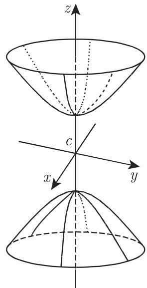  
3.191

4. 锥面（图 3.192)

如果顶点在原点则方程是

$$
\frac {x ^ {2}}{a ^ {2}} + \frac {y ^ {2}}{b ^ {2}} - \frac {z ^ {2}}{c ^ {2}} = 0.\tag{3.416}
$$

作为准线可以考虑具有半轴 的椭圆，它所在的平面在距离原点 处垂直千 轴．这样表示的锥面可以看成是曲面

$$
\frac {x ^ {2}}{a ^ {2}} + \frac {y ^ {2}}{b ^ {2}} - \frac {z ^ {2}}{c ^ {2}} = \pm 1\tag{3.417}
$$

的渐近锥面它的母线在无穷远处无限趋近千两个双曲面（图 3.193)．当 $a = b$ 时存在一个直圆锥（参见第 209 3.3.4, (9)).

5. 抛物面

因为抛物面没有中心，所以在下节中假设顶点在原点， $z$ 轴是其对称轴， $x , z$ 平面和 $y ,$ 平面是对称平面

a) 椭圆抛物面（图 3.194)

$$
z = \frac {x ^ {2}}{a ^ {2}} + \frac {y ^ {2}}{b ^ {2}}.\tag{3.418}
$$

平行千 $z$ 轴的平面截出的图形是抛物线那些平行千 x, 平面的平面截出的是椭圆

  
3.192

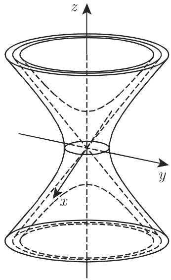  
3.193

垂直千 $z$ 轴的平面在距离原点 处截抛物面所得立体的体积为（图 3.194)

$$
V = \frac {1}{2} \pi \overline {{a}} \overline {{b}} h,\tag{3.419}
$$

参数 $\overline { { a } } = a \sqrt { h }$ 和 $\bar { b } = b \sqrt { h }$ 是在高 处所截椭圆的半轴．千是，（3.419) 所得是具有相同底面和高度的椭圆柱面的体积的一半．

b) 旋转抛物面 $a = b$ 时我们得到一个旋转抛物面它可以由 $x , z$ 平面上的抛物线 $z = { \frac { x ^ { 2 } } { a ^ { 2 } } }$ 绕 轴旋转产生

c) 双曲抛物面（图 3.195)

$$
z = \frac {x ^ {2}}{a ^ {2}} - \frac {y ^ {2}}{b ^ {2}}.\tag{3.420}
$$

平行千 $y , z$ 平面或 x, 平面的截痕是抛物线；平行千 x,y 平面的截痕是双曲线或两条相交直线

  
3.194

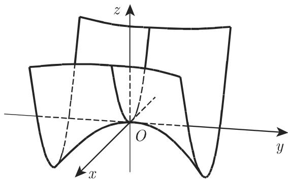  
3.195

6. 直纹曲面

直纹曲面的直母线完全位千该曲面上．例子有锥面和柱面的母线．

a) 单叶双曲面（图 3.196)

$$
\frac {x ^ {2}}{a ^ {2}} + \frac {y ^ {2}}{b ^ {2}} - \frac {z ^ {2}}{c ^ {2}} = 1.\tag{3.421}
$$

单叶双曲面具有两族直母线方程为

$$
{\frac {x}{a}} + {\frac {z}{c}} = u \left(1 + {\frac {y}{b}}\right), \quad u \left({\frac {x}{a}} - {\frac {z}{c}}\right) = 1 - {\frac {y}{b}};\tag{3.422a}
$$

$$
{\frac {x}{a}} + {\frac {z}{c}} = v \left(1 - {\frac {y}{b}}\right), v \left({\frac {x}{a}} - {\frac {z}{c}}\right) = 1 + {\frac {y}{b}},\tag{3.422b}
$$

其中 是任意量．

b) 双曲抛物面（图 3.197)

$$
z = \frac {x ^ {2}}{a ^ {2}} - \frac {y ^ {2}}{b ^ {2}}.\tag{3.423}
$$

双曲抛物而也具有两族直母线，方程为

$$
{\frac {x}{a}} + {\frac {y}{b}} = u, \quad u \left({\frac {x}{a}} - {\frac {y}{b}}\right) = z;\tag{3.424a}
$$

$$
{\frac {x}{a}} - {\frac {y}{b}} = v, \quad v \left({\frac {x}{a}} + {\frac {y}{b}}\right) = z.\tag{3.424b}
$$

也取任意的值．在两种情形中，通过曲面的每个点有两条直线分别来自两个族．图 3.196 和图 3.197 表示的只是一族直线

  
3.196

  
3.197

7. 柱面

a) 椭圆柱面（图 3.198)

$$
\frac {x ^ {2}}{a ^ {2}} + \frac {y ^ {2}}{b ^ {2}} = 1.\tag{3.425}
$$

b) 双曲柱面（图 3.199)

$$
\frac {x ^ {2}}{a ^ {2}} - \frac {y ^ {2}}{b ^ {2}} = 1.\tag{3.426}
$$

c) 抛物柱面（图 3.200)

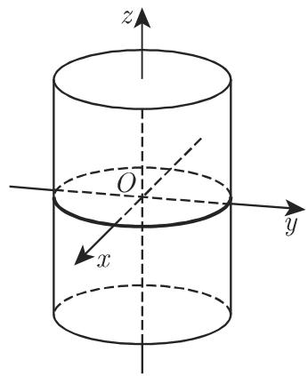  
3.198

$$
y ^ {2} = 2 p x.\tag{3.427}
$$

  
3.199

  
3.200

3.5.3.14 二次曲面，一般理论

1. 二次曲面的一般方程

$$
\begin{array}{l} {a _ {1 1} x ^ {2} + a _ {2 2} y ^ {2} + a _ {3 3} z ^ {2} + 2 a _ {1 2} x y + 2 a _ {2 3} y z + 2 a _ {3 1} z x + 2 a _ {1 4} x} \\ {+ 2 a _ {2 4} y + 2 a _ {3 4} z + a _ {4 4} = 0.} \end{array}\tag{3.428}
$$

．从其方程判断二次曲面的类型

二次曲面的类型可以从其方程出发利用其不变量Ll, 8, 的符号来确定（表 3.24 和表 3.25)．在这里我们可以看到这些曲面方程的名称及其标准形式，每个方程都可以变换成标准形式．除了虚锥面的顶点以及两个虚平面的交线外，从所谓虚曲面的方程不能确定任何实点的坐标．

3.24 二次曲面的类型 $( \delta \neq 0 ,$ 有心曲面）

<table><tr><td></td><td> $S \cdot \delta > 0, T > 0$ </td><td> $S \cdot \delta$ 和 $T$ 都不大于0</td></tr><tr><td rowspan="2"> $\Delta < 0$ </td><td>椭球面</td><td>双叶双曲面</td></tr><tr><td> $\frac{x^{2}}{a^{2}} + \frac{y^{2}}{b^{2}} + \frac{z^{2}}{c^{2}} = 1$ </td><td> $\frac{x^{2}}{a^{2}} + \frac{y^{2}}{b^{2}} - \frac{z^{2}}{c^{2}} = -1$ </td></tr><tr><td rowspan="2"> $\Delta > 0$ </td><td>虚椭球面</td><td>单叶双曲面</td></tr><tr><td> $\frac{x^{2}}{a^{2}} + \frac{y^{2}}{b^{2}} + \frac{z^{2}}{c^{2}} = -1$ </td><td> $\frac{x^{2}}{a^{2}} + \frac{y^{2}}{b^{2}} - \frac{z^{2}}{c^{2}} = 1$ </td></tr><tr><td rowspan="2"> $\Delta = 0$ </td><td>虚锥面(具有实顶点)</td><td>锥面</td></tr><tr><td> $\frac{x^{2}}{a^{2}} + \frac{y^{2}}{b^{2}} + \frac{z^{2}}{c^{2}} = 0$ </td><td> $\frac{x^{2}}{a^{2}} + \frac{y^{2}}{b^{2}} - \frac{z^{2}}{c^{2}} = 0$ </td></tr></table>

3. 二次曲面的不变量

替换 $a _ { i k } = a _ { k i }$ ，则有

$$
\Delta = \left| \begin{array}{c c c c} a _ {1 1} & a _ {1 2} & a _ {1 3} & a _ {1 4} \\ a _ {2 1} & a _ {2 2} & a _ {2 3} & a _ {2 4} \\ a _ {3 1} & a _ {3 2} & a _ {3 3} & a _ {3 4} \\ a _ {4 1} & a _ {4 2} & a _ {4 3} & a _ {4 4} \end{array} \right|,\tag{3.429a}
$$

$$
\delta = \left| \begin{array}{c c c} a _ {1 1} & a _ {1 2} & a _ {1 3} \\ a _ {2 1} & a _ {2 2} & a _ {2 3} \\ a _ {3 1} & a _ {3 2} & a _ {3 3} \end{array} \right|,\tag{3.429b}
$$

$$
S = a _ {1 1} + a _ {2 2} + a _ {3 3},\tag{3.429c}
$$

$$
T = a _ {2 2} a _ {3 3} + a _ {3 3} a _ {1 1} + a _ {1 1} a _ {2 2} - a _ {2 3} ^ {2} - a _ {3 1} ^ {2} - a _ {1 2} ^ {2}.\tag{3.429d}
$$

这些不变量在坐标系的平移或旋转过程中不变．

3.25 二次曲面的类型 $( \delta = 0 ;$ 抛物面，柱面和两个平面）

<table><tr><td></td><td colspan="4"> $\Delta < 0$ (这里 $T > 0$ )</td><td colspan="4"> $\Delta > 0$ (这里 $T < 0$ )</td></tr><tr><td rowspan="2"> $\Delta \neq 0$ </td><td colspan="4">椭圆抛物面</td><td colspan="4">双曲抛物面</td></tr><tr><td colspan="4"> $\frac{x^{2}}{a^{2}} + \frac{y^{2}}{b^{2}} = \pm z$ </td><td colspan="4"> $\frac{x^{2}}{a^{2}} - \frac{y^{2}}{b^{2}} = \pm z$ </td></tr><tr><td rowspan="2"> $\Delta = 0$ </td><td colspan="8">以二次曲线作为准线的柱面有下列不同类型:如果该曲面没有退化为两个实平面,虚平面或重合平面,则当 $T > 0$ 时为虚椭圆柱面,当 $T < 0$ 时为双曲柱面,当 $T = 0$ 时为抛物柱面.退化的条件是</td></tr><tr><td colspan="8"> $\begin{vmatrix} a_{11} & a_{12} & a_{14} \\ a_{21} & a_{22} & a_{24} \\ a_{41} & a_{42} & a_{44} \end{vmatrix} + \begin{vmatrix} a_{11} & a_{13} & a_{14} \\ a_{31} & a_{33} & a_{34} \\ a_{41} & a_{43} & a_{44} \end{vmatrix} + \begin{vmatrix} a_{22} & a_{23} & a_{24} \\ a_{32} & a_{33} & a_{34} \\ a_{42} & a_{43} & a_{44} \end{vmatrix} = 0$ </td></tr></table>
