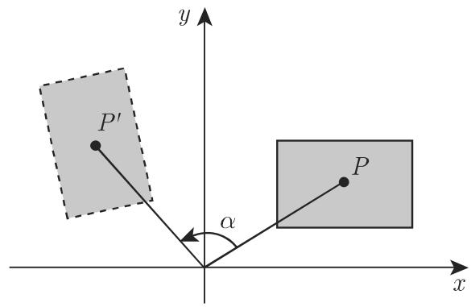
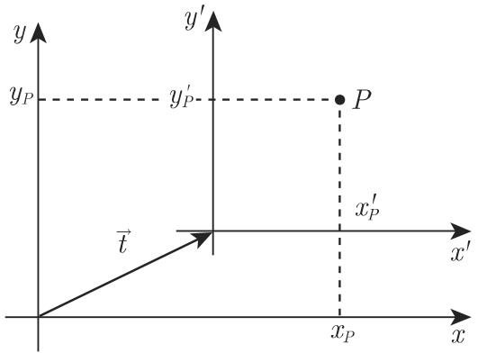
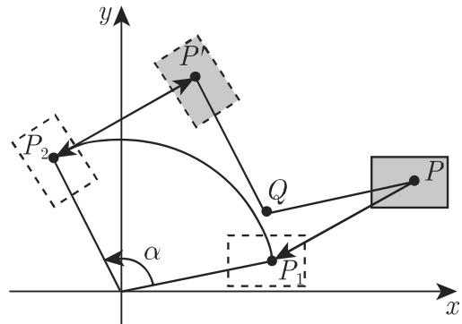
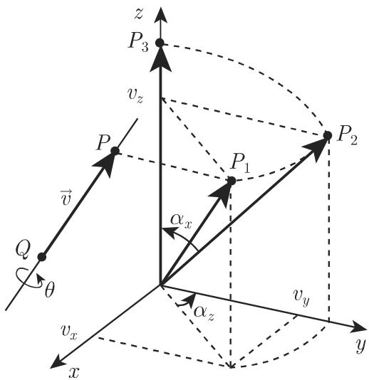
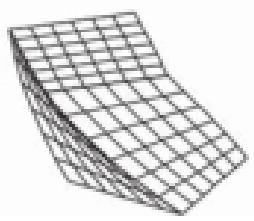
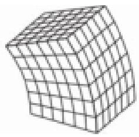
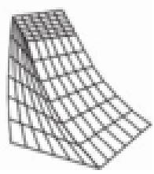

#### 3.5.4 几何变换和坐标变换

1. 变换

变换刻画的是平面上或空间中对象的位置或形式的改变．有两种考虑，它们相互间有密切的联系 [3.22]．第一种情形是在固定坐标系中对点或对象进行变换．这称为几何变换（参见第 308 3.5.4.1, 314 3.5.4.5, 1.).

第二种情形中则是对象保持不变，而对与对象关联的坐标系进行变换经过这种坐标变换后（参见第 311 3.5.4.3, 315 3.5.4.5, 2. ），发生改变的不是对象而是其坐标表示在解题时其中的一个可能比另一个更适合

2. 应用领域

·在其本身的对象坐标系中刻画建筑构件．

．相互关联的零件的运动描述（例如，机器人）．

．再现三维对象的二维投影

·在计算机图形学或计算机动画中刻画运动和变形．

3.5.4.1 几何 2D 变换

1. 平移

由笛卡儿坐标 $x P , y P$ 给定的点 轴的正向上平移 $t _ { x } .$ ，在 $y$ 轴的正向上平移 $t _ { y }$ （图 3.201)，则变换后的点 $P ^ { \prime } ( x _ { P } ^ { \prime } , y _ { P } ^ { \prime } )$ ）的新坐标为

$$
x _ {P} ^ {\prime} = x _ {P} + t _ {x}, \quad y _ {P} ^ {\prime} = y _ {P} + t _ {y}.\tag{3.430}
$$

如果坐标由列向量刻画，则新坐标的变换公式和逆变换公式为

$$
\binom{x _ {P} ^ {\prime}}{y _ {P} ^ {\prime}} = \binom{x _ {P}}{y _ {P}} + \binom{t _ {x}}{t _ {y}},\tag{3.431a}
$$

$$
\left( \begin{array}{l} x _ {P} \\ y _ {P} \end{array} \right) = \left( \begin{array}{l} x _ {P} ^ {\prime} \\ y _ {P} ^ {\prime} \end{array} \right) - \left( \begin{array}{l} t _ {x} \\ t _ {y} \end{array} \right).\tag{3.431b}
$$

2. 围绕原点的旋转

在旋转时对象围绕原点旋转 角．如果 $\alpha > 0$ 则旋转为逆时针方向（图 3.202).点 $P ( x _ { P } , y _ { P } )$ 的坐标映射由下面的关系刻画

$$
x _ {P} ^ {\prime} = x _ {P} \cdot \cos \alpha - y _ {P} \cdot \sin \alpha , y _ {P} ^ {\prime} = x _ {P} \cdot \sin \alpha + y _ {P} \cdot \cos \alpha .\tag{3.432}
$$

  
3.201

  
3.202

(3.432) 的矩阵形式为

$$
\binom{x _ {P} ^ {\prime}}{y _ {P} ^ {\prime}} = \left( \begin{array}{c c} \cos \alpha & - \sin \alpha \\ \sin \alpha & \cos \alpha \end{array} \right) \binom{x _ {P}}{y _ {P}}.\tag{3.433a}
$$

这一变换的逆对应千旋转—Q角：

$$
\binom{x _ {P}}{y _ {P}} = \left( \begin{array}{c c} \cos (- \alpha) & - \sin (- \alpha) \\ \sin (- \alpha) & \cos (- \alpha) \end{array} \right) \binom{x _ {P} ^ {\prime}}{y _ {P} ^ {\prime}} = \left( \begin{array}{c c} \cos \alpha & \sin \alpha \\ - \sin \alpha & \cos \alpha \end{array} \right) \binom{x _ {P} ^ {\prime}}{y _ {P} ^ {\prime}}.\tag{3.433b}
$$

3. 关千原点的缩放变换

在缩放变换时坐标分别乘以 $s _ { x }$ 和 $s _ { y }$ （图 3.203) ．点 $P ( x _ { P } , y _ { P } )$ 的变换由

$$
x _ {P} ^ {\prime} = s _ {x} \cdot x _ {P}, y _ {P} ^ {\prime} = s _ {y} \cdot y _ {P}\tag{3.434}
$$

给出这一变换的矩阵形式及其逆为

$$
\binom{x _ {P} ^ {\prime}}{y _ {P} ^ {\prime}} = \left( \begin{array}{c c} s _ {x} & 0 \\ 0 & s _ {y} \end{array} \right) \binom{x _ {P}}{y _ {P}},\tag{3.435a}
$$

$$
\left( \begin{array}{c} x _ {P} \\ y _ {P} \end{array} \right) = \left( \begin{array}{c c} 1 / s _ {x} & 0 \\ 0 & 1 / s _ {y} \end{array} \right) \binom{x _ {P} ^ {\prime}}{y _ {P} ^ {\prime}}.\tag{3.435b}
$$

缩放变换导致变换对象大小的改变一个正的乘数 $s _ { x } < 1$ 的结果是该对象在方向上收缩．反之，因子 $s _ { x } \ > \ 1$ 的结果是扩张负因子 $s _ { x } < 0$ 的结果是关千 $y$ 轴的反射相应的陈述对千 $s _ { y }$ 也成立

特殊情形的缩放变换：

．关千 轴的反射： $s _ { x } = 1 , s _ { y } = - 1$

·关千 轴的反射： $s _ { x } = - 1 , s _ { y } = 1$

·关千原点的反射： $s _ { x } = s _ { y } = - 1$

4. 剪切变换

在剪切变换时每个坐标的值的改变与另一个坐标成比例．这一变换的公式为

$$
x _ {P} ^ {\prime} = x _ {P} + a _ {x} \cdot y _ {P}, y _ {P} ^ {\prime} = y _ {P} + a _ {y} \cdot x _ {P}.\tag{3.436}
$$

这一变换的矩阵形式（符号 $m = 1 - a _ { x } a _ { y } )$ 见下：

$$
\binom{x _ {P} ^ {\prime}}{y _ {P} ^ {\prime}} = \left( \begin{array}{c c} 1 & a _ {x} \\ a _ {y} & 1 \end{array} \right) \binom{x _ {P}}{y _ {P}},\tag{3.437a}
$$

$$
\binom{x _ {P}}{y _ {\mathrm{P}}} = \left( \begin{array}{c c} 1 / m & - a _ {x} / m \\ - a _ {y} / m & 1 / m \end{array} \right) \binom{x _ {P} ^ {\prime}}{y _ {P} ^ {\prime}}.\tag{3.437b}
$$

3.204 显示的是剪切变换的一个例子．

5. 变换的性质

上面引入的变换是仿射变换，即变换点 $P ^ { \prime }$ 的 $( x ^ { \prime } , y ^ { \prime } )$ 坐标可以用 原来坐标$( x , y )$ 的线性方程组表示．

评论 这些变换保持共线性和平行性，即直线变换成直线平行线的像是平行线．而且平移、旋转和反射是保距和保角映射．

  
3.203

  
3.204

3.5.4.2 齐次坐标、矩阵表示

尽管旋转变换、缩放变换和剪切变换中的坐标改变能够用乘以 $2 \times 2$ 型矩阵(3.433a), (3.435a) (3.437a) 来刻画但平移并不具有这种表示为了能够以同样的方式处理所有这些变换，我们将引入齐次坐标．平面上的每个点将得到一个附加的坐标 $w \ne 0$ ．点 $P ( x , y )$ 将具有坐标（ $( x ^ { h } , y ^ { h } , w )$ ，其中

$$
x = \frac {x ^ {h}}{w}, \quad y = \frac {y ^ {h}}{w}.\tag{3.438}
$$

在以下将固定 $w = 1$ . 因此点 $P ( x , y )$ 具有坐标 $( x , y , 1 )$ ．千是基本变换可以用下面形式的 $3 { \times } 3$ 型矩阵给出：

$$
\left( \begin{array}{c} {x _ {P} ^ {\prime}} \\ {y _ {P} ^ {\prime}} \\ {1} \end{array} \right) = \left( \begin{array}{c c c} {m _ {1 1}} & {m _ {1 2}} & {m _ {1 3}} \\ {m _ {2 1}} & {m _ {2 2}} & {m _ {2 3}} \\ {0} & {0} & {1} \end{array} \right) \left( \begin{array}{c} {x _ {P}} \\ {y _ {P}} \\ {1} \end{array} \right), \quad \text {即} \underline {{x}} _ {P} ^ {\prime} = M \underline {{x}} _ {P} \text {成立}.\tag{3.439}
$$

平移矩阵、旋转矩阵、缩放矩阵和剪切矩阵为

$$
\begin{array}{r l} {{T (t _ {x}, t _ {y}) =}} & {{\left( \begin{array}{c c c} {{1}} & {{0}} & {{t _ {x}}} \\ {{0}} & {{1}} & {{t _ {y}}} \\ {{0}} & {{0}} & {{1}} \end{array} \right) \quad ,}} \\ & {{\text {平移矩阵}}} \end{array}\tag{3.440}
$$

$$
\boldsymbol {R} (\alpha) = \left( \begin{array}{c c c} \cos \alpha & - \sin \alpha & 0 \\ \sin \alpha & \cos \alpha & 0 \\ 0 & 0 & 1 \end{array} \right)    ,\tag{3.441}
$$

旋转矩阵

$$
\begin{array}{r l} {{S (s _ {x}, s _ {y}) =}} & {{\left( \begin{array}{c c c} {{s _ {x}}} & {{0}} & {{0}} \\ {{0}} & {{s _ {y}}} & {{0}} \\ {{0}} & {{0}} & {{1}} \end{array} \right) ,}} \\ & {{\text {缩放矩阵}}} \end{array}\tag{3.442}
$$

$$
\boldsymbol {V} \left(a _ {x}, a _ {y}\right) = \left( \begin{array}{c c c} 1 & a _ {x} & 0 \\ a _ {y} & 1 & 0 \\ 0 & 0 & 1 \end{array} \right). \text {剪切矩阵}\tag{3.443}
$$

3.5.4.3 坐标变换

在儿何变换中，关千对象的变换是在固定坐标系中进行的．而坐标变换给出的是固定对象在两个不同坐标系中坐标表示之间的关系．

两种类型变换之间的关系显示在图 3.205 中．如果借助向量 $\vec { t }$ 『将坐标系移位则点 $P ( x _ { P } , y _ { P } )$ 的坐标成为 $x _ { P } ^ { \prime } = x _ { P } - t _ { x } , y _ { P } ^ { \prime } = y _ { P } - t _ { y }$ . 坐标系沿向量 $\vec { t }$ 平移的结果与点 沿向量— $- \vec { t }$ 平移的结果相同

同样的结果对千旋转和缩放也成立．因此，坐标系的变换等价千对象的逆变换．

  
(a)

  
(b)  
3.205

由平移、旋转或缩放导致的坐标变换可以由 $3 { \times } 3$ 变换矩阵 $\overline { { \boldsymbol { T } } } , \overline { { \boldsymbol { R } } }$ 和 $\overline { S }$ 给出．注意随后的儿何变换矩阵 (3.440)\~(3.442):

$$
\overline {{\boldsymbol {T}}} (t _ {x}, t _ {y}) = \boldsymbol {T} (- t _ {x}, - t _ {y}) = \boldsymbol {T} ^ {- 1} (t _ {x}, t _ {y}),\tag{3.444}
$$

$$
\overline {{\boldsymbol {R}}} (\alpha) = \boldsymbol {R} (- \alpha) = \boldsymbol {R} ^ {- 1} (\alpha),\tag{3.445}
$$

$$
\overline {{S}} (s _ {x}, s _ {y}) = S \left(\frac {1}{s _ {x}}, \frac {1}{s _ {y}}\right) = S ^ {- 1} (s _ {x}, s _ {y}).\tag{3.446}
$$

这样，所有的基本变换都可以用一个 $3 { \times } 3$ 变换矩阵 $\overline { { M } }$ 来刻画：

$$
\left( \begin{array}{c} {x _ {P} ^ {\prime}} \\ {y _ {P} ^ {\prime}} \\ {1} \end{array} \right) = \left( \begin{array}{c c c} {\overline {{{m}}} _ {1 1}} & {\overline {{{m}}} _ {1 2}} & {\overline {{{m}}} _ {1 3}} \\ {\overline {{{m}}} _ {2 1}} & {\overline {{{m}}} _ {2 2}} & {\overline {{{m}}} _ {2 3}} \\ {0} & {0} & {1} \end{array} \right) \left( \begin{array}{c} {x _ {P}} \\ {y _ {P}} \\ {1} \end{array} \right), \quad \text {即} \quad \underline {{x}} _ {P} ^ {\prime} = \overline {{M}} \underline {{x}} _ {P}.\tag{3.447}
$$

3.5.4.4 变换的复合

复杂的儿何变换可以通过不同基本变换的组合来实现．设有矩阵 $M _ { 1 } , M _ { 2 } , \cdots$ $M _ { n }$ 给出的一列变换连续执行这些变换经 步将点 $P ( x , y )$ 转换为 $P ^ { \prime }$ ．由这一系列映射导致的变换矩阵 一是这些矩阵的乘积：

$$
\boldsymbol {M} = \boldsymbol {M} _ {n} \cdot \boldsymbol {M} _ {n - 1} \cdot \dots \cdot \boldsymbol {M} _ {2} \cdot \boldsymbol {M} _ {1}.\tag{3.448}
$$

类似地相反的变换

$$
M ^ {- 1} = M _ {1} ^ {- 1} \cdot M _ {2} ^ {- 1} \cdot \dots \cdot M _ {n - 1} ^ {- 1} \cdot M _ {n} ^ {- 1}.\tag{3.449}
$$

千是，作为对一个点进行 次一系列基本变换的替代可以给出一个复合变换的矩阵直接应用千它．

每个仿射变换可以作为一连串平移、旋转和缩放的复合给出，甚至剪切也可以作为一次旋转 $\scriptstyle R ( \alpha )$ ，一次缩放 $S ( s _ { x } , s _ { y } )$ ，再一次旋转 $\pmb { R } ( \beta )$ 的相继应用给出．参数可以这样来确定使得 $V ( a , b ) = \pmb { R } ( \beta ) \pmb { \cdot S } ( s _ { x } , s _ { y } ) \cdot \pmb { R } ( \alpha )$ 成立

·计算围绕任意一点 $Q ( x _ { q } , y _ { q } )$ 旋转角 的变换矩阵：该复合变换是以下基本变换复合的结果：

(1) 移到原点： $M _ { 1 } = T ( - x _ { q } , - y _ { q } )$

(2) 围绕原点旋转 $M _ { \mathrm { { 2 } } } = R ( \alpha )$

(3) 将原点平移回 Q: $M _ { 3 } { = } M _ { 1 } ^ { - 1 } = { \cal T } ( x _ { q } , y _ { q } )$

这些变换的单个步骤序列见图 3.206. 经由 $P _ { 1 }$ 和 $P _ { 2 }$ , 被变换到 $P ^ { \prime }$

$$
\begin{array}{l} \boldsymbol {M} = \boldsymbol {M} _ {3} \cdot \boldsymbol {M} _ {2} \cdot \boldsymbol {M} _ {1} = \boldsymbol {T} (x _ {q}, y _ {q}) \cdot \boldsymbol {R} (\alpha) \cdot \boldsymbol {T} (- x _ {q}, - y _ {q}) \\ = \left( \begin{array}{c c c} 1 & 0 & x _ {q} \\ 0 & 1 & y _ {q} \\ 0 & 0 & 1 \end{array} \right) \left( \begin{array}{c c c} \cos \alpha & - \sin \alpha & 0 \\ \sin \alpha & \cos \alpha & 0 \\ 0 & 0 & 1 \end{array} \right) \left( \begin{array}{c c c} 1 & 0 & - x _ {q} \\ 0 & 1 & - y _ {q} \\ 0 & 0 & 1 \end{array} \right) \\ = \left( \begin{array}{c c c} \cos \alpha & - \sin \alpha & x _ {q} (1 - \cos \alpha) + y _ {q} \sin \alpha \\ \sin \alpha & \cos \alpha & y _ {q} (1 - \cos \alpha) - x _ {q} \sin \alpha \\ 0 & 0 & 1 \end{array} \right). \end{array}
$$

  
3.206

·关千由方程 $y = m x + n$ 给出的一条直线的反射：

(1) 将该直线平移通过原点： $M _ { 1 } = \pmb { T } ( 0 , - n )$

(2) 顺时针旋转该直线直到它与 轴重合： $M _ { 2 } { = } R ( - \alpha )$ ，并有 $\tan \alpha = m$

(3) 关千 轴的反射： $M _ { 3 } = S ( 1 , - 1 )$

(4) 往回旋转 $\alpha : M _ { 4 } = M _ { 2 } ^ { - 1 } = { \pmb R } ( \alpha )$

(5) 将该直线平移回原来的位置： $M _ { 5 } = M _ { 1 } ^ { - 1 } = { \cal T } ( 0 , n )$

$$
\begin{array}{l} \boldsymbol {M} = \boldsymbol {T} (0, n) \cdot \boldsymbol {R} (\alpha) \cdot \boldsymbol {S} (1, - 1) \cdot \boldsymbol {R} (- \alpha) \cdot \boldsymbol {T} (0, - n) \\ = \left( \begin{array}{c c c} 1 & 0 & 0 \\ 0 & 1 & n \\ 0 & 0 & 1 \end{array} \right) \left( \begin{array}{c c c} \cos \alpha & - \sin \alpha & 0 \\ \sin \alpha & \cos \alpha & 0 \\ 0 & 0 & 1 \end{array} \right) \left( \begin{array}{c c c} 1 & 0 & 0 \\ 0 & - 1 & 0 \\ 0 & 0 & 1 \end{array} \right) \\ \left( \begin{array}{c c c} \cos \alpha & \sin \alpha & 0 \\ - \sin \alpha & \cos \alpha & 0 \\ 0 & 0 & 1 \end{array} \right) \left( \begin{array}{c c c} 1 & 0 & 0 \\ 0 & 1 & - n \\ 0 & 0 & 1 \end{array} \right). \end{array}
$$

利用著名的三角关系 $\sin \alpha = m / \sqrt { m ^ { 2 } + 1 }$ 和 $\cos \alpha = 1 / \sqrt { m ^ { 2 } + 1 }$ 得变换矩阵

$$
M = \left( \begin{array}{c c c} {\frac {1 - m ^ {2}}{m ^ {2} + 1}} & {\frac {2 m}{m ^ {2} + 1}} & {\frac {- 2 m n}{m ^ {2} + 1}} \\ {\frac {2 m}{m ^ {2} + 1}} & {\frac {m ^ {2} - 1}{m ^ {2} + 1}} & {\frac {2 n}{m ^ {2} + 1}} \\ {0} & {0} & {1} \end{array} \right).
$$

·所裁边长为 的矩形到宽为 且高为 的窗口中相似矩形的完全中心变换（图 3.207) ．基本变换序列：

(1) $P ( x _ { P } , y _ { P } )$ 移到原点： $M _ { 1 } { = } T ( - x _ { P } , - y _ { P } )$

(2) 顺时针旋转角 $\alpha : M _ { 2 } { = } R ( - \alpha )$

(3) 按因子 $s = s _ { x } = s _ { y } = \operatorname* { m i n } \Bigl ( \frac { c } { a } , \frac { d } { b } \Bigr ) \colon M _ { 3 } = S ( s , s ) .$

(4) 将原点移到窗口中心 $M _ { 4 } = \pmb { T } \left( \frac { c } { 2 } , \frac { d } { 2 } \right)$

$$
\begin{array}{r l} & {\boldsymbol {M} = \boldsymbol {T} \left(\frac {c}{2}, \frac {d}{2}\right) \cdot \boldsymbol {S} (s, s) \cdot \boldsymbol {R} (- \alpha) \cdot \boldsymbol {T} (- x _ {P}, - y _ {P})} \\ & {\quad = \left( \begin{array}{l l l} 1 & 0 & c / 2 \\ 0 & 1 & d / 2 \\ 0 & 0 & 1 \end{array} \right) \left( \begin{array}{l l l} s & 0 & 0 \\ 0 & s & 0 \\ 0 & 0 & 1 \end{array} \right) \left( \begin{array}{l l l} \cos \alpha & \sin \alpha & 0 \\ - \sin \alpha & \cos \alpha & 0 \\ 0 & 0 & 1 \end{array} \right) \left( \begin{array}{l l l} 1 & 0 & - x _ {P} \\ 0 & 1 & - y _ {P} \\ 0 & 0 & 1 \end{array} \right)} \\ & {\quad = \left( \begin{array}{l l l} s \cos \alpha & s \sin \alpha & \frac {c}{2} - s (x _ {P} \cos \alpha + y _ {P} \sin \alpha) \\ - s \sin \alpha & s \cos \alpha & \frac {d}{2} - s (y _ {P} \cos \alpha - x _ {P} \sin \alpha) \\ 0 & 0 & 1 \end{array} \right).} \end{array}
$$

  
3.207

3.5.4.5 3D 变换

三维空间中儿何变换和坐标变换的数学刻画基千已在 3.5.4.1\~3.5.4.4 讨论过的二维情形同样的思想三维空间的仿射变换是如下基本变换的复合：平移、围绕一个坐标轴的旋转和关千原点的缩放．利用齐次坐标这些变换可以用 $4 \times 4$ 变换矩阵给出正如在二维情形一样，复合变换可以用矩阵乘法来实现

1. 儿何变换

点 $P ( x _ { P } , y _ { P } , z _ { P } )$ 的变换按以下规则进行：

$$
\left( \begin{array}{c} {x _ {P} ^ {\prime}} \\ {y _ {P} ^ {\prime}} \\ {z _ {P} ^ {\prime}} \\ {1} \end{array} \right) = \left( \begin{array}{c c c c} {m _ {1 1}} & {m _ {1 2}} & {m _ {1 3}} & {m _ {1 4}} \\ {m _ {2 1}} & {m _ {2 2}} & {m _ {2 3}} & {m _ {2 4}} \\ {m _ {3 1}} & {m _ {3 2}} & {m _ {3 3}} & {m _ {3 4}} \\ {0} & {0} & {0} & {1} \end{array} \right) \left( \begin{array}{c} {x _ {P}} \\ {y _ {P}} \\ {z _ {P}} \\ {1} \end{array} \right), \quad \text {即} \quad \underline {{{{\boldsymbol x}}}} _ {P} ^ {\prime} = M \underline {{{{\boldsymbol x}}}} _ {P}.\tag{3.450}
$$

基本变换的变换矩阵是

$$
\boldsymbol {T} (t _ {x}, t _ {y}, t _ {z}) = \left( \begin{array}{c c c c} 1 & 0 & 0 & t _ {x} \\ 0 & 1 & 0 & t _ {y} \\ 0 & 0 & 1 & t _ {z} \\ 0 & 0 & 0 & 1 \end{array} \right),\tag{3.451}
$$

平移

$$
\boldsymbol {S} (s _ {x}, s _ {y}, s _ {z}) = \left( \begin{array}{c c c c} s _ {x} & 0 & 0 & 0 \\ 0 & s _ {y} & 0 & 0 \\ 0 & 0 & s _ {z} & 0 \\ 0 & 0 & 0 & 1 \end{array} \right)    ,\tag{3.452}
$$

关千原点的缩放

$$
\boldsymbol {R} _ {x} (\alpha) = \left( \begin{array}{c c c c} 1 & 0 & 0 & 0 \\ 0 & \cos \alpha & - \sin \alpha & 0 \\ 0 & \sin \alpha & \cos \alpha & 0 \\ 0 & 0 & 0 & 1 \end{array} \right),\tag{3.453}
$$

围绕 轴的旋转

$$
\boldsymbol {R} _ {y} (\alpha) = \left( \begin{array}{c c c c} \cos \alpha & 0 & \sin \alpha & 0 \\ 0 & 1 & 0 & 0 \\ - \sin \alpha & 0 & \cos \alpha & 0 \\ 0 & 0 & 0 & 1 \end{array} \right),\tag{3.454}
$$

围绕 轴的旋转

$$
\boldsymbol {R} _ {z} (\alpha) = \left( \begin{array}{c c c c} \cos \alpha & - \sin \alpha & 0 & 0 \\ \sin \alpha & \cos \alpha & 0 & 0 \\ 0 & 0 & 1 & 0 \\ 0 & 0 & 0 & 1 \end{array} \right),\tag{3.455}
$$

围绕 轴的旋转

$$
\begin{array}{r l} \boldsymbol {V} _ {x y} (a _ {x}, a _ {y}) = & \left( \begin{array}{l l l l} 1 & 0 & a _ {x} & 0 \\ 0 & 1 & a _ {y} & 0 \\ 0 & 0 & 1 & 0 \\ 0 & 0 & 0 & 1 \end{array} \right). \end{array}\tag{3.456}
$$

平行千 $x , y$ 平面的剪切

对千正的 ${ \dot { \alpha } } ,$ 旋转从坐标轴正向朝原点看是逆时针的．对千逆变换有下面的关系成立：

$$
\pmb {T} ^ {- 1} (t _ {x}, t _ {y}, t _ {z}) = \pmb {T} (- t _ {x}, - t _ {y}, - t _ {z}), \quad \pmb {S} ^ {- 1} (s _ {x}, s _ {y}, s _ {z}) = \pmb {S} \left(\frac {1}{s _ {x}}, \frac {1}{s _ {y}}, \frac {1}{s _ {z}}\right)\tag{3.457}
$$

$$
\boldsymbol {R} _ {x} ^ {- 1} (\alpha) = \boldsymbol {R} _ {x} (- \alpha), \quad \boldsymbol {R} _ {y} ^ {- 1} (\alpha) = \boldsymbol {R} _ {y} (- \alpha), \quad \boldsymbol {R} _ {z} ^ {- 1} (\alpha) = \boldsymbol {R} _ {z} (- \alpha).\tag{3.458}
$$

2. 坐标变换

类似千二维的情形，坐标系的变换对千点的坐标表示来说具有和逆几何变换（参见第 311 3.5.4.3) 相同的效果．因此变换矩阵是

$$
\overline {{T}} (t _ {x}, t _ {y}, t _ {z}) = T (- t _ {x}, - t _ {y}, - t _ {z}) = T ^ {- 1} (t _ {x}, t _ {y}, t _ {z}),\tag{3.459}
$$

$$
\overline {{\boldsymbol {R}}} _ {x} (\alpha_ {x}) = \boldsymbol {R} _ {x} (- \alpha_ {x}) = \boldsymbol {R} _ {x} ^ {- 1} (\alpha_ {x}),\tag{3.460}
$$

$$
\overline {{\boldsymbol {R}}} _ {y} (\alpha_ {y}) = \boldsymbol {R} _ {y} (- \alpha_ {y}) = \boldsymbol {R} _ {y} ^ {- 1} (\alpha_ {y}),\tag{3.461}
$$

$$
\overline {{\boldsymbol {R}}} _ {z} (\alpha_ {z}) = \boldsymbol {R} _ {z} (- \alpha_ {z}) = \boldsymbol {R} _ {z} ^ {- 1} (\alpha_ {z}),\tag{3.462}
$$

$$
\overline {{{S}}} \left(s _ {x}, s _ {y}, s _ {z}\right) = S \left(\frac {1}{s _ {x}}, \frac {1}{s _ {y}}, \frac {1}{s _ {z}}\right) = S ^ {- 1} \left(s _ {x}, s _ {y}, s _ {z}\right).\tag{3.463}
$$

在实际应用中常会发生从一个右手笛卡儿坐标系到另一个笛卡儿坐标系一个特定的变换被取代的情况．最初的一个常被称为世界坐标系，而另一个则被称为局部或对象坐标系．如果在世界坐标系中给出局部坐标系的原点 $U ( x _ { u } , y _ { u } , z _ { u } )$ 和单位向量 ${ \vec { e } } _ { i } = \{ l _ { 1 } , m _ { 1 } , n _ { 1 } \} , { \vec { e } } _ { j } = \{ l _ { 2 } , m _ { 2 } , n _ { 2 } \} , { \vec { e } } _ { k } = \{ l _ { 3 } , m _ { 3 } , n _ { 3 } \}$ ｝，则从世界坐标系到局部坐标系的变换及其逆由矩阵

$$
\overline {{M}} = \left( \begin{array}{c c c c} {l _ {1}} & {m _ {1}} & {n _ {1}} & {- l _ {1} x _ {u} - m _ {1} y _ {u} - n _ {1} z _ {u}} \\ {l _ {2}} & {m _ {2}} & {n _ {2}} & {- l _ {2} x _ {u} - m _ {2} y _ {u} - n _ {2} z _ {u}} \\ {l _ {3}} & {m _ {3}} & {n _ {3}} & {- l _ {3} x _ {u} - m _ {3} y _ {u} - n _ {3} z _ {u}} \\ {0} & {0} & {0} & {1} \end{array} \right),\tag{3.464}
$$

$$
\overline {{M}} ^ {- 1} = \left( \begin{array}{c c c c} l _ {1} & l _ {2} & l _ {3} & x _ {u} \\ m _ {1} & m _ {2} & m _ {3} & y _ {u} \\ n _ {1} & n _ {2} & n _ {3} & z _ {u} \\ 0 & 0 & 0 & 1 \end{array} \right)\tag{3.465}
$$

给出．

如果点 在世界坐标系中具有坐标 $\left( x _ { P } , y _ { P } , z _ { P } \right)$ 而在局部坐标系中的坐标是$( x _ { P } ^ { \prime } , y _ { P } ^ { \prime } , z _ { P } ^ { \prime } )$ ），则下列等式成立：

$$
\underline {{\boldsymbol {x}}} _ {P} ^ {\prime} = \overline {{M}} \underline {{\boldsymbol {x}}} _ {P},\tag{3.466}
$$

$$
\underline {{\boldsymbol {x}}} _ {P} = \overline {{M}} ^ {- 1} \underline {{\boldsymbol {x}}} _ {P} ^ {\prime}.\tag{3.467}
$$

如果 $\overline { { \boldsymbol { M } } } _ { 1 }$ 和 $\overline { { M } } _ { 2 }$ 表示从世界坐标系到两个局部坐标系的变换矩阵，则两个局部坐标系之间的变换由矩阵

$$
\overline {{{{M}}}} = \overline {{{{M}}}} _ {1} \cdot \overline {{{{M}}}} _ {2} ^ {- 1} \quad \text {和} \quad \overline {{{{M}}}} ^ {- 1} = \overline {{{{M}}}} _ {2} \cdot \overline {{{{M}}}} _ {1} ^ {- 1}\tag{3.468}
$$

给出

·确定围绕通过点 $P ( x _ { P } , \ y _ { P } , \ z _ { P } )$ 和 $Q ( x _ { q } , \ y _ { q } , \ z _ { q } )$ 具有方向向量 $\vec { v } = \{ v _ { x } , v _ { y }$ $v _ { z } \} = \{ x _ { P } - x _ { q } , y _ { P } - y _ { q } , z _ { P } - z _ { q } \}$ 的直线旋转 角的旋转矩阵易选取 $Q$ 使它们之间的距离为一个单位，因此 $\vec { v }$ 是一个单位向量．首先将该直线变换成坐标系轴接下来，围绕 轴旋转 角最后将直线变换回原来的直线．图 3.208 显示将特定直线变换成 轴是如何进行的．它包括以下步骤

(1) $Q$ 平移到原点： $M _ { 1 } = T ( - x _ { q } , - y _ { q } , - z _ { q } )$

(2) 围绕 轴旋转使得旋转轴被映射到 $y , z$ 平面 $M _ { 2 } = R _ { z } ( \alpha _ { z } )$ ，并有 $\cos \alpha _ { z } =$ $v _ { y } \left/ \sqrt { v _ { x } ^ { 2 } + v _ { y } ^ { 2 } }\right.$ sin $\alpha _ { z } = v _ { x } \bigg / \sqrt { v _ { x } ^ { 2 } + v _ { y } ^ { 2 } }$

点 $P _ { 2 }$ 具有坐标 $( 0 , \sqrt { v _ { x } ^ { 2 } + v _ { z } ^ { 2 } } , v _ { z } )$

(3) 围绕 轴旋转 $\alpha _ { x }$ 角直到方向向量 $\vec { v }$ 的像在 轴上： $M _ { 3 } = R _ { x } ( \alpha _ { x } )$ ，其中$\cos \alpha _ { x } = v _ { z } / | \vec { v } |$ 和 $\sin \alpha _ { x } = \sqrt { v _ { x } ^ { 2 } + v _ { y } ^ { 2 } } \Big / | \vec { v } |$ 点 $P _ { 3 }$ 具有坐标 $( 0 , 0 , | \vec { v } | )$

  
3.208

设 $m = \sqrt { v _ { x } ^ { 2 } + v _ { y } ^ { 2 } }$ 且 $| \vec { v } | = 1$ ，方向向量到 轴的变换矩阵是

$$
\begin{array}{l} \boldsymbol {M} _ {A} = \boldsymbol {R} _ {x} (\alpha_ {x}) \cdot \boldsymbol {R} _ {z} (\alpha_ {z}) \cdot \boldsymbol {T} (- x _ {q}, - y _ {q}, - z _ {q}) \\ = \left( \begin{array}{c c c c} 1 & 0 & 0 & 0 \\ 0 & v _ {z} & - m & 0 \\ 0 & m & v _ {z} & 0 \\ 0 & 0 & 0 & 1 \end{array} \right) \left( \begin{array}{c c c c} \frac {v _ {y}}{m} & \frac {- v _ {x}}{m} & 0 & 0 \\ \frac {v _ {x}}{m} & \frac {v _ {y}}{m} & 0 & 0 \\ 0 & 0 & 1 & 0 \\ 0 & 0 & 0 & 1 \end{array} \right) \left( \begin{array}{c c c c} 1 & 0 & 0 & - x _ {q} \\ 0 & 1 & 0 & - y _ {q} \\ 0 & 0 & 1 & - z _ {q} \\ 0 & 0 & 0 & 1 \end{array} \right), \end{array}
$$

$$
M _ {A} = \left( \begin{array}{c c c c} \frac {v _ {y}}{m} & \frac {- v _ {x}}{m} & 0 & \frac {v _ {x} y _ {q} - v _ {y} x _ {q}}{m} \\ \frac {v _ {x} v _ {z}}{m} & \frac {v _ {y} v _ {z}}{m} & - m & m z _ {q} - \frac {v _ {x} v _ {z} x _ {q} + v _ {y} v _ {z} y _ {q}}{m} \\ v _ {x} & v _ {y} & v _ {z} & - v _ {x} x _ {q} - v _ {y} y _ {q} - v _ {z} z _ {q} \\ 0 & 0 & 0 & 1 \end{array} \right),
$$

$$
M _ {A} ^ {- 1} = \left( \begin{array}{c c c c} \frac {v _ {y}}{m} & \frac {v _ {x} v _ {z}}{m} & v _ {x} & x _ {q} \\ \frac {- v _ {x}}{m} & \frac {v _ {y} v _ {z}}{m} & v _ {y} & y _ {q} \\ 0 & - m & v _ {z} & z _ {q} \\ 0 & 0 & 0 & 1 \end{array} \right).
$$

将 $M _ { A }$ 和 $M _ { A } ^ { - 1 }$ 与矩阵 (3.465) 和（3.464) 比较表明，空间直线到 轴的变换等同千从世界坐标系到原点为 $Q$ 轴方向是 $\vec { v }$ 的局部坐标系的坐标变换．在局部坐标系中旋转围绕 轴进行．全部旋转的变换矩阵由矩阵 (3.455) 给出

$$
\begin{array}{r l} & M = M _ {A} ^ {- 1} \cdot R _ {z} (\theta) \cdot M _ {A} \\ & = \left( \begin{array}{c c c c} \frac {v _ {y}}{m} & \frac {v _ {x} v _ {z}}{m} & v _ {x} & x _ {q} \\ \frac {- v _ {x}}{m} & \frac {v _ {y} v _ {z}}{m} & v _ {y} & y _ {q} \\ 0 & - m & v _ {z} & z _ {q} \\ 0 & 0 & 0 & 1 \end{array} \right) \left( \begin{array}{c c c c} \cos \theta & - \sin \theta & 0 & 0 \\ \sin \theta & \cos \theta & 0 & 0 \\ 0 & 0 & 1 & 0 \\ 0 & 0 & 0 & 1 \end{array} \right) \\ & \left( \begin{array}{c c c c} \frac {v _ {y}}{m} & \frac {- v _ {x}}{m} & 0 & \frac {v _ {x} y _ {q} - v _ {y} x _ {q}}{m} \\ \frac {v _ {x} v _ {z}}{m} & \frac {v _ {y} v _ {z}}{m} & - m & m z _ {q} - \frac {v _ {x} v _ {z} x _ {q} + v _ {y} v _ {z} y _ {q}}{m} \\ v _ {x} & v _ {y} & v _ {z} & - v _ {x} x _ {q} - v _ {y} y _ {q} - v _ {z} z _ {q} \\ 0 & 0 & 0 & 1 \end{array} \right). \end{array}
$$

在第 386 4.4 中我们将利用四元数的性质给出另一种方法来刻画旋转矩阵

3.5.4.6 形变变换

在第 314 3.5.4.5 讨论的仿射变换改变了对象的位置并产生了沿给定方向的拉伸或压缩如果变换矩阵 ${ \cal M } = \left( m _ { i j } \right)$ ）的元素像到目前为止那样不是常数，但它们是位置的函数，那么这将导致广义的改变结构的变换类．矩阵的元素现在具有形式：

$$
m _ {i j} = m _ {i j} (x, y, z).\tag{3.469}
$$

1. 收缩

这一变换是缩放的推广．在沿 轴方向收缩时缩放参数 $s _ { x } , s _ { y }$ 是 $z$ 的函数．变换矩阵为

$$
\boldsymbol {S} (s _ {x} (z), s _ {y} (z), 1) = \left( \begin{array}{c c c c} s _ {x} (z) & 0 & 0 & 0 \\ 0 & s _ {y} (z) & 0 & 0 \\ 0 & 0 & 1 & 0 \\ 0 & 0 & 0 & 1 \end{array} \right).\tag{3.470}
$$

函数 $s _ { x } ( z )$ 和 $s _ { y } ( z )$ 定义了收缩外观．如果 $s _ { x } ( z ) > 1$ , 则变换对象沿 轴被拉伸，如果 $s _ { x } ( z ) < 1$ , 则对象被压缩．图 3.209(b) 显示的是图 3.209(a) 中的单位立方体经函数 $s _ { x } ( z ) = s _ { y } ( z ) = 1 / ( 1 - z ^ { 2 } )$ 变换的结果

2. 围绕 轴的扭曲

这一变换是围绕 轴的旋转的推广．旋转角沿 轴发生改变．变换矩阵为

$$
\boldsymbol {R} _ {z} (\alpha (z)) = \left( \begin{array}{c c c c} \cos \alpha (z) & - \sin \alpha (z) & 0 & 0 \\ \sin \alpha (z) & \cos \alpha (z) & 0 & 0 \\ 0 & 0 & 1 & 0 \\ 0 & 0 & 0 & 1 \end{array} \right)  .\tag{3.471}
$$

函数a(z) 定义的是沿 轴的旋转角．图 3.209(c) 显示的是单位立方体旋转 $\alpha ( z ) =$ $\frac { \pi } { 4 } z$ 角．

3. 围绕 轴的弯曲

弯曲时旋转角沿与旋转轴垂直的方向改变．变换矩阵具有下面的形式：

$$
\boldsymbol {R} _ {x} (\alpha (z)) = \left( \begin{array}{c c c c} 1 & 0 & 0 & 0 \\ 0 & \cos \alpha (z) & - \sin \alpha (z) & 0 \\ 0 & \sin \alpha (z) & \cos \alpha (z) & 0 \\ 0 & 0 & 0 & 1 \end{array} \right).\tag{3.472}
$$

3.209(d) 显示的是单位立方体以 $\alpha ( z ) = \frac { \pi } { 8 } z$ 角弯曲

像仿射变换一样，这些形变可以进行系列应用．图 3.209(e) 中的对象是单位立方体先收缩后扭曲的结果

  
(a)

  
(b)

  
(c)  
3.209

  
(d)

  
(e)
