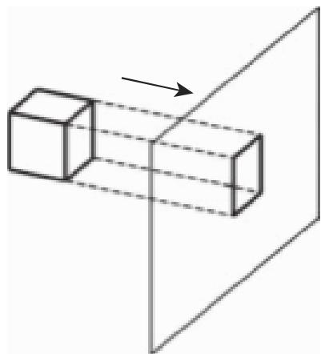
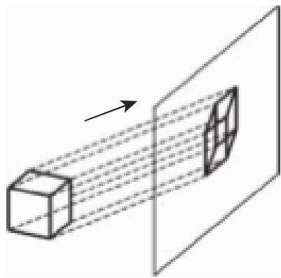
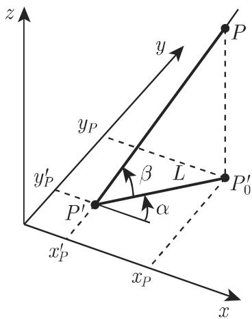
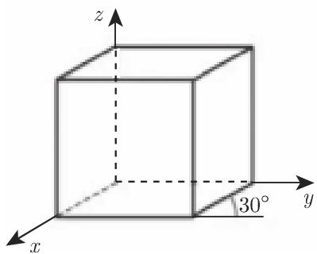
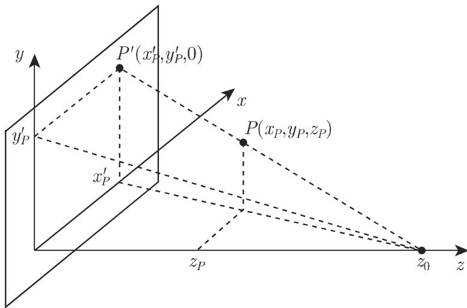

#### 3.5.5 平面投影

有若干种方法使得三维对象在二维媒介中可视化 [3.22]．其中最重要的是平面投影．一个平面投影是一个映射，其中三维空间中的点被指派到平面上的点一个像点作为该平面与连接观察者和空间点之射线的交点给出．该平面称为投影平面或画面，射线称为投影线，其方向则为投影方向

3.5.5.1 投影的分类

1. 中心投影

中心投影也称透视投影，其中投影线是从一个公共中心点发出的（图 3.210)．距离透视中心 较远的物体比接近该中心的物体所成的像较小．不与投影平面平行的平行线不再平行，而是相交千所谓的没影点．对千观看者来说透视投影给出了该物体的实际印象但是在这一映射中长度和角度之间的关系不再有了．

2. 平行投影

在平行投影时投影线相互平行（图 3.211)．不平行千投影平面的线段变短，而角通常被扭曲

  
3.210

  
3.211

(I) 正交平行投影 如果投影线的方向垂直千画面则平行投影是正交投影．如果还有画面垂直千其中一个坐标轴，则它是一个正投影或主投影，这在工业设计中是众所周知的．

如果投影方向不垂直千任何坐标轴，则该正交投影称为轴测投影．

(2) 斜平行投影 如果投影线的方向不平行千画面的法向量，则一个平行投影是斜投影（图 3.212)．斜投影的特殊情形是斜等轴测投影和斜角立体投影．

有时平行投影保持尺寸的比例，但它们似乎并不比透视表示更真实．

  
3.212

3.5.5.2 局部或投影坐标系

在世界坐标系中定义投影平面的方向和投影结果的坐标是不合理的应用图像坐标系似乎是有用的，其 x,y 平面等同千投影平面．这一图像坐标系表示的是从一个直视投影平面的观看者角度来看的投影．

设投影平面由参考点 $R ( x _ { r } , y _ { r } , z _ { r } )$ 和一个单位法向量 $\vec { n } = \{ n _ { x } , n _ { y } , n _ { z } \}$ 给定．则图像坐标系按下列方式定义．将原点置千 $R ( x _ { r } , y _ { r } , z _ { r } )$ . 在单位坐标向 $\overrightarrow { e } _ { i } , \overrightarrow { e } _ { j } ^ { \prime }$ 和 $\vec { e } _ { k } ^ { \prime }$ 中首先固定 $\vec { e } _ { k } = \vec { n }$ 在画面中固定坐标向量 $\vec { e _ { i } }$ 和 $\vec { e _ { j } }$ 需要额外的信息．在世界坐标系中选取一个“朝上的＇向最 ${ \vec { u } } ,$ ，它在画面上的投影定义垂直方向，即图像坐标系的 $y ^ { \prime }$ 方向． $\vec { u }$ 和 $\vec { n }$ 的正规化向量积定义向量忒 $\vec { e _ { i } }$ 概括如下：

$$
\vec {e} _ {k} ^ {\prime} = \vec {n}, \quad \vec {e} _ {i} ^ {\prime} = \frac {\vec {u} \times \vec {n}}{\| \vec {u} \times \vec {n} \|}, \quad \vec {e} _ {j} ^ {\prime} = \vec {e} _ {k} ^ {\prime} \times \vec {e} _ {i} ^ {\prime}.\tag{3.473}
$$

从世界坐标系到图像坐标系的映射的变换矩阵及其逆是通过在 (3.464) (3.465)中代入点 $R ( x _ { r } , y _ { r } , z _ { r } )$ 和向量 $\overrightarrow { e } _ { i } , \overrightarrow { e } _ { j } ^ { \prime }$ 和 $\vec { e } _ { k } ^ { \prime }$ 的相应坐标给出的．

3.5.5.3 主投影

这种投影垂直千与其中一个坐标轴垂直的平面．依赖千投影的方向和观看画面的方向，在投影平面上形成了平面图，俯视图或一个侧视图

一点 $P ( x _ { P } , y _ { P } , z _ { P } )$ 到平行千 $x , y$ 平面且方程为 $z = z _ { 0 }$ 的投影平面的正交投影之矩阵形式是

$$
\left( \begin{array}{c} x _ {P} ^ {\prime} \\ y _ {P} ^ {\prime} \\ z _ {P} ^ {\prime} \\ 1 \end{array} \right) = \left( \begin{array}{c c c c} 1 & 0 & 0 & 0 \\ 0 & 1 & 0 & 0 \\ 0 & 0 & 0 & z _ {0} \\ 0 & 0 & 0 & 1 \end{array} \right) \left( \begin{array}{c} x _ {P} \\ y _ {P} \\ z _ {P} \\ 1 \end{array} \right).\tag{3.474}
$$

通常选择 $z _ { 0 } = 0$ 的投影平面到坐标面的投影矩阵是

$$
\boldsymbol {P} _ {x} = \left( \begin{array}{c c c c} 0 & 0 & 0 & 0 \\ 0 & 1 & 0 & 0 \\ 0 & 0 & 1 & 0 \\ 0 & 0 & 0 & 1 \end{array} \right), \quad \boldsymbol {P} _ {y} = \left( \begin{array}{c c c c} 1 & 0 & 0 & 0 \\ 0 & 0 & 0 & 0 \\ 0 & 0 & 1 & 0 \\ 0 & 0 & 0 & 1 \end{array} \right), \quad \boldsymbol {P} _ {z} = \left( \begin{array}{c c c c} 1 & 0 & 0 & 0 \\ 0 & 1 & 0 & 0 \\ 0 & 0 & 0 & 0 \\ 0 & 0 & 0 & 1 \end{array} \right)\tag{3.475}
$$

3.5.5.4 轴测投影

与正投影形成对照，现在投影平面的法向量 $\vec { n } = \{ n _ { x } , n _ { y } , n _ { z } \}$ ｝和投影方向不平行千任何坐标轴．有三种不同情形要考虑

．等距投影 $\vec { n }$ 与每个坐标轴的夹角相同因此，对千计的坐标有| $| n _ { x } | = | n _ { y } | =$ $| n _ { z } |$ ．投影坐标轴之间的夹角是 $1 2 0 ^ { \circ }$ . 平行千坐标轴的线段具有相同的扭曲因子（图 3.213(a)).

·双度量投影 计与两个坐标轴具有相同的夹角．沿这些方向相等的距离仍相等．计的坐标中有两个具有相同的绝对值（图 3.213(b)).

·三度量投影 $\vec { n }$ 与每个坐标轴具有不同的夹角．因此，坐标轴具有不同的扭曲因子（图 3.213(c)).

  
(a)

  
(b)  
3.213

  
(c)

3.5.5.5 等距投影

考虑投影平面包含世界坐标系的原点并且其法向量 ${ \vec { n } } = \left\{ { \frac { 1 } { \sqrt { 3 } } } , { \frac { 1 } { \sqrt { 3 } } } , { \frac { 1 } { \sqrt { 3 } } } \right\}$ 的情形．

为了确定投影矩阵，到投影坐标系的一个坐标变换之后再合成一个沿 $z ^ { \prime }$ 轴到$x ^ { \prime } , y ^ { \prime }$ 平面的投影．图像坐标系的定义与 (3.473) 一致朝上的向量取作 $\vec { u } = \{ 0 , 0 , 1 \}$ 这样 $z$ 轴就被映射到 $y ^ { \prime }$ 轴．图像坐标系的单位基向量是

$$
\begin{array}{r} \vec {e} _ {i} ^ {\prime} = \frac {\vec {u} \times \vec {n}}{\| \vec {u} \times \vec {n} \|} = \left\{- \frac {1}{\sqrt {2}}, \frac {1}{\sqrt {2}}, 0 \right\}, \quad \vec {e} _ {j} ^ {\prime} = \vec {e} _ {k} ^ {\prime} \times \vec {e} _ {i} ^ {\prime} = \left\{- \frac {1}{\sqrt {6}}, - \frac {1}{\sqrt {6}}, \frac {2}{\sqrt {6}} \right\}, \\ \vec {e} _ {k} ^ {\prime} = \vec {n} = \left\{\frac {1}{\sqrt {3}}, \frac {1}{\sqrt {3}}, \frac {1}{\sqrt {3}} \right\}. \end{array}
$$

从图像坐标系到世界坐标系的映射的变换矩阵以及由 (3.464) (3.465) 给出的逆是

$$
\overline {{M}} _ {A} = \left( \begin{array}{c c c c} - \frac {1}{\sqrt {2}} & - \frac {1}{\sqrt {6}} & \frac {1}{\sqrt {3}} & 0 \\ \frac {1}{\sqrt {2}} & - \frac {1}{\sqrt {6}} & \frac {1}{\sqrt {3}} & 0 \\ 0 & \frac {2}{\sqrt {6}} & \frac {1}{\sqrt {3}} & 0 \\ 0 & 0 & 0 & 1 \end{array} \right), \quad \overline {{M}} _ {A} ^ {- 1} = \overline {{M}} _ {A} ^ {\mathrm{T}} = \left( \begin{array}{c c c c} - \frac {1}{\sqrt {2}} & \frac {1}{\sqrt {2}} & 0 & 0 \\ - \frac {1}{\sqrt {6}} & - \frac {1}{\sqrt {6}} & \frac {2}{\sqrt {6}} & 0 \\ \frac {1}{\sqrt {3}} & \frac {1}{\sqrt {3}} & \frac {1}{\sqrt {3}} & 0 \\ 0 & 0 & 0 & 1 \end{array} \right).\tag{3.476}
$$

千是，在图像坐标系中沿 $z ^ { \prime }$ 轴的正交投影是

$$
\boldsymbol {P} _ {A} = \boldsymbol {P} _ {z} \overline {{\boldsymbol {M}}} _ {A} ^ {- 1} = \left( \begin{array}{c c c c} 1 & 0 & 0 & 0 \\ 0 & 1 & 0 & 0 \\ 0 & 0 & 0 & 0 \\ 0 & 0 & 0 & 1 \end{array} \right) \cdot \left( \begin{array}{c c c c} - \frac {1}{\sqrt {2}} & \frac {1}{\sqrt {2}} & 0 & 0 \\ - \frac {1}{\sqrt {6}} & - \frac {1}{\sqrt {6}} & \frac {2}{\sqrt {6}} & 0 \\ \frac {1}{\sqrt {3}} & \frac {1}{\sqrt {3}} & \frac {1}{\sqrt {3}} & 0 \\ 0 & 0 & 0 & 1 \end{array} \right)
$$

$$
= \left( \begin{array}{c c c c} - \frac {1}{\sqrt {2}} & \frac {1}{\sqrt {2}} & 0 & 0 \\ - \frac {1}{\sqrt {6}} & - \frac {1}{\sqrt {6}} & \frac {2}{\sqrt {6}} & 0 \\ 0 & 0 & 0 & 0 \\ 0 & 0 & 0 & 1 \end{array} \right).\tag{3.477}
$$

投影矩阵 $P _ { A }$ 将世界坐标系的点映射到图像坐标系的 $x ^ { \prime } , y ^ { \prime }$ 平面．乘以矩阵$\overline { { M } } _ { A }$ 后我们得到世界坐标系中的点．全部投影的投影矩阵是

$$
\boldsymbol {P} = \overline {{\boldsymbol {M}}} _ {A} \boldsymbol {P} _ {z} \overline {{\boldsymbol {M}}} _ {A} ^ {- 1} = \frac {1}{3} \left( \begin{array}{r r r r} 2 & - 1 & - 1 & 0 \\ - 1 & 2 & - 1 & 0 \\ - 1 & - 1 & 2 & 0 \\ 0 & 0 & 0 & 3 \end{array} \right).\tag{3.478}
$$

3.5.5.6 斜平行投影

在斜投影时投影线与投影平面以一个角 相交．在图 3.214 中点 $P ( x _ { P } , y _ { P } , z _ { P } )$ 的斜投影是 $P ^ { \prime } ( x _ { P } ^ { \prime } , y _ { P } ^ { \prime } , z _ { P } ^ { \prime } )$ ），而它的正交投影是 $P _ { 0 } ^ { \prime }$ ．作为投影的线段 $\overline { { P _ { 0 } ^ { \prime } P ^ { \prime } } }$ 之长是．这一投影由两个量刻画． $d = \frac { L } { z } = \frac { 1 } { \tan \beta }$ 给出了垂直千投影平面的线段的缩放因子． 轴与垂直线段的投影像之间的夹角．则全部投影的坐标所遵循的规则是

$$
x _ {P} ^ {\prime} = x _ {P} - z _ {P} d \cos \alpha , y _ {P} ^ {\prime} = y _ {P} - z _ {P} d \sin \alpha , z _ {P} ^ {\prime} = 0\tag{3.479}
$$

或

$$
\left( \begin{array}{l} x _ {P} ^ {\prime} \\ y _ {P} ^ {\prime} \\ z _ {P} ^ {\prime} \\ 1 \end{array} \right) = \left( \begin{array}{c c c c} 1 & 0 & - d \cos \alpha & 0 \\ 0 & 1 & - d \sin \alpha & 0 \\ 0 & 0 & 0 & 0 \\ 0 & 0 & 0 & 1 \end{array} \right) \left( \begin{array}{l} x _ {P} \\ y _ {P} \\ z _ {P} \\ 1 \end{array} \right).\tag{3.480}
$$

如果投影平面不同千 x, 平面，则图像坐标系的坐标变换必须要在应用投影矩阵之前完成（参见第 320 3.5.5.2).

·具有 $\dot { \alpha } = 4 5 ^ { \circ }$ 和 $d = 1$ ，即 $\beta = 4 5 ^ { \circ }$ 的单位立方体的斜等轴测投影．垂直千投影平面的线段在这种情形没有变短（图 3.215).

将不位千 $x , y$ 平面的四个顶点作为一个矩阵的列．用投影矩阵乘以这个矩阵将给出投影点的坐标：

$$
\left( \begin{array}{c c c c} - \frac {1}{\sqrt {2}} & - \frac {1}{\sqrt {2}} & 1 - \frac {1}{\sqrt {2}} & 1 - \frac {1}{\sqrt {2}} \\ - \frac {1}{\sqrt {2}} & 1 - \frac {1}{\sqrt {2}} & - \frac {1}{\sqrt {2}} & 1 - \frac {1}{\sqrt {2}} \\ 0 & 0 & 0 & 0 \\ 1 & 1 & 1 & 1 \end{array} \right) = \left( \begin{array}{c c c c} 1 & 0 & - \frac {1}{\sqrt {2}} & 0 \\ 0 & 1 & - \frac {1}{\sqrt {2}} & 0 \\ 0 & 0 & 0 & 0 \\ 0 & 0 & 0 & 1 \end{array} \right). \left( \begin{array}{c c c c} 0 & 1 & 0 & 1 \\ 0 & 0 & 1 & 1 \\ 1 & 1 & 1 & 1 \\ 1 & 1 & 1 & 1 \end{array} \right).
$$

·具有 $\dot { \alpha } = 3 0 ^ { \circ }$ 和 $d = \frac 1 2$ ，即 $\beta = 6 3 . 4 ^ { \circ }$ 的单位立方体的斜角立体投影垂直千投影平面的线段在这种情形被减半（图 3.216).

  
3.214

  
3.215

  
3.216

不位千 x,y 平面的四个顶点的投影坐标由

$$
\left( \begin{array}{c c c c} - \frac {\sqrt {3}}{4} & 1 - \frac {\sqrt {3}}{4} & - \frac {\sqrt {3}}{4} & 1 - \frac {\sqrt {3}}{4} \\ - \frac {1}{4} & - \frac {1}{4} & \frac {3}{4} & \frac {3}{4} \\ 0 & 0 & 0 & 0 \\ 1 & 1 & 1 & 1 \end{array} \right) = \left( \begin{array}{c c c c} 1 & 0 & - \frac {\sqrt {3}}{4} & 0 \\ 0 & 1 & - \frac {1}{4} & 0 \\ 0 & 0 & 0 & 0 \\ 0 & 0 & 0 & 1 \end{array} \right). \left( \begin{array}{c c c c} 0 & 1 & 0 & 1 \\ 0 & 0 & 1 & 1 \\ 1 & 1 & 1 & 1 \\ 1 & 1 & 1 & 1 \end{array} \right)
$$

计算

3.5.5.7 透视投影

1. 映射公式

透视投影的映射公式可以在图像坐标系中合理地给出．原点的选取要使得投影中心位千 轴上．

正如在图 3.217 中可以看到的，点 $P ( x _ { P } , \ y _ { P } , \ z _ { P } )$ 与它的投影像 $P ^ { \prime } ( x _ { P } ^ { \prime } , \ y _ { P } ^ { \prime }$ $z _ { P } ^ { \prime } )$ 的坐标之间的关系可以用截距定理的等式（参见第 176 3.1.3.2, 5.) 计算：

$$
\frac {x _ {P} ^ {\prime}}{x _ {P}} = \frac {z _ {0}}{z _ {0} - z _ {P}} = \frac {1}{1 - \frac {z _ {P}}{z _ {0}}}, \quad \frac {y _ {P} ^ {\prime}}{y _ {P}} = \frac {1}{1 - \frac {z _ {P}}{z _ {0}}}, \quad z _ {P} ^ {\prime} = 0.
$$

原坐标与像坐标之间的关系不是线性的．然而利用齐次坐标（参见第 3103.5.4.2) 的性质，投影规则可以用下面的矩阵形式给出：

$$
\left( \begin{array}{c} x _ {P} ^ {\prime} \\ y _ {P} ^ {\prime} \\ z _ {P} ^ {\prime} \\ 1 \end{array} \right) = \left( \begin{array}{c} x _ {P} \\ y _ {P} \\ 0 \\ 1 - \frac {z _ {P}}{z _ {0}} \end{array} \right) = \left( \begin{array}{c c c c} 1 & 0 & 0 & 0 \\ 0 & 1 & 0 & 0 \\ 0 & 0 & 0 & 0 \\ 0 & 0 & - \frac {1}{z _ {0}} & 1 \end{array} \right) \left( \begin{array}{c} x _ {P} \\ y _ {P} \\ z _ {P} \\ 1 \end{array} \right).\tag{3.481}
$$

  
3.217

2. 没影点

透视投影具有性质不平行千画面的平行线看上去像是彼此相交千一点．这个点称为没影点．平行千坐标轴的直线的没影点称为主点或主没影点．主点的个数等千和画而相交的坐标轴个数．图 3.218 显示的是有一个、两个和三个主点的透视图像主点和画面与平行千坐标轴的射线之交点重合．如果投影中心是 $C ( x _ { c } , y _ { c } , z _ { c } )$ 画面的一个点是 $R ( x _ { r } , y _ { r } , z _ { r } )$ 而法向量是计 $\vec { n } { = } \{ n _ { x } , n _ { y } , n _ { z } \}$ ，则主点存在时其坐标为

$$
F _ {x} \left(x _ {c} + \frac {d}{n _ {x}}, y _ {c}, z _ {c}\right), \quad F _ {y} \left(x _ {c}, y _ {c} + \frac {d}{n _ {y}}, z _ {c}\right), \quad F _ {z} \left(x _ {c}, y _ {c}, z _ {c} + \frac {d}{n _ {z}}\right),\tag{3.482a}
$$

其中

$$
d = (\vec {c} - \vec {r}) \cdot \vec {n} = (x _ {c} - x _ {r}) n _ {x} + (y _ {c} - y _ {r}) n _ {y} + (z _ {c} - z _ {r}) n _ {z}.\tag{3.482b}
$$

如果法向量计的一个坐标是零，则在此方向没有主点．

  
3.218
