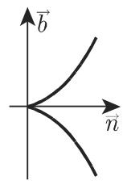
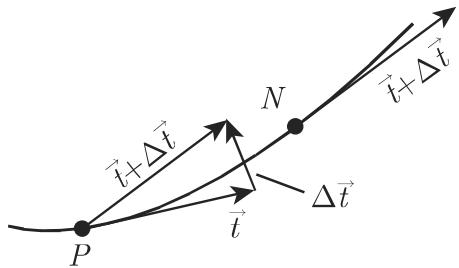
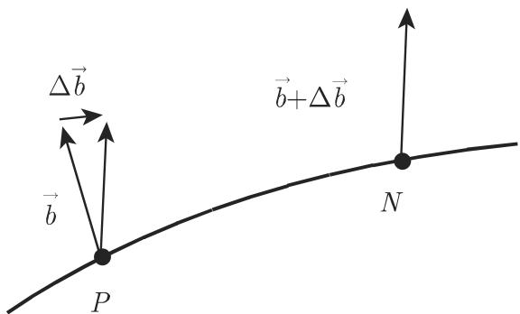

#### 3.6.2 空间曲线

3.6.2.1 空间曲线的定义方式

1. 坐标方程

有下列可能方式用来定义空间曲线：

a) 两曲面的交线

$$
F (x, y, z) = 0, \quad \Phi (x, y, z) = 0.\tag{3.523}
$$

b) 参数形式

$$
x = x (t), \quad y = y (t), \quad z = z (t),\tag{3.524}
$$

其中 是一个任意参数通常使用 $t = x , y$ z.

c) 参数形式

$$
x = x (s), \quad y = y (s), \quad z = z (s),\tag{3.525a}
$$

其中以定点 与动点 之间的弧长 s:

$$
s = \int_ {t _ {0}} ^ {t} \sqrt {\left(\frac {\mathrm{d} x}{\mathrm{d} t}\right) ^ {2} + \left(\frac {\mathrm{d} y}{\mathrm{d} t}\right) ^ {2} + \left(\frac {\mathrm{d} z}{\mathrm{d} t}\right) ^ {2}} \mathrm{d} t.\tag{3.525b}
$$

作为参数

2. 向量方程

是曲线上任意一点的向径（参见第 243 3.5.1.1, 6. ），方程 (3.524) 可以写成形式

$$
\vec {r} = \vec {r} (t), \quad \text {其中} \quad \vec {r} (t) = x (t) \vec {i} + y (t) \vec {j} + z (t) \vec {k},\tag{3.526}
$$

(3.525a) 可以写成形式

$$
\vec {r} = \vec {r} (s), \quad \text {其中} \quad \vec {r} (s) = x (s) \vec {i} + y (s) \vec {j} + z (s) \vec {k}.\tag{3.527}
$$

3. 正方向

对千巾形式 (3.524) (3.526) 给出的曲线这指的是参数 增加的方向；对千(3.525a) (3.527) 这是弧长增加的方向．

3.6.2.2 活动三面形

1. 定义

在空间曲线除奇点外的每一点 处可以定义三条直线和三个平面．它们在点相交，并相互垂直（图 3.239).

(1) 切线是割线PN N----+ 时的极限位置（参见第 328 页图 3.220).

(2) 法平面是与切线垂直的平面（图 3.239)．在这一平面上通过点 的每条直线都称为该曲线在点 的法线

(3) 密切平面是通过三个邻近的点 M,P 的平面当 N----+ M----+P时的极限位置（图 3.240)．切线在密切平面上．

  
3.239

  
3.240

(4) 主法线是法平面与密切平面的交线，即它是密切平面上的法线．

(5) 次法线是过点 垂直千密切平面的直线．

(6) 从切平面是由切线与次法线所展的平面．

(7) 活动三面形，切线、主法线和次法线上的正方向定义如下：

a) 在切线上由曲线的正方向给出；单位切向量 $\vec { t }$ 具有这一方向

b) 在主法线上它由曲线的曲率符号给出，并由单位法向量冗确定．

c) 在次法线上它由单位向量

$$
\vec {b} = \vec {t} \times \vec {n}\tag{3.528}
$$

确定，其中 ${ \vec { t , n } }$ 和 $\vec { b }$ 构成右手直角坐标系，称为活动三面形．

2. 相对千活动三面形的曲线位置

对千通常的曲线点空间曲线在点 处位千从切平面的一侧，并与法平面和密切平面都相交（图 3.241(a)）．曲线在点 处的一小段在三个平而上的投影大致具有下面的形状：

(1) 在密切平面上它类似千二次抛物线（图 3.241(b)).

(2) 在从切平面上它类似千立方抛物线（图 3.241(c)).

(3) 在法平面上它类似千半立方抛物线（图 3.241(d)).

如果在 点曲线的曲率或挠率等千 $0 ,$ 或者 是一个奇点，即如果 $x ^ { \prime } ( t ) =$ $y ^ { \prime } ( t ) = z ^ { \prime } ( t ) = 0$ 成立，则曲线可能具有不同的形状．

  
(a)

  
(b)

  
(c)

  
(d)  
3.241

3. 活动三面形构成要素的方程

(1) (3.523) 形式定义的曲线 关千切线见 (3.529) ，关千法平面见 (3.530):

$$
\frac {X - x}{\left| \begin{array}{c c} \frac {\partial F}{\partial y} & \frac {\partial F}{\partial z} \\ \frac {\partial \Phi}{\partial y} & \frac {\partial \Phi}{\partial z} \end{array} \right|} = \frac {Y - y}{\left| \begin{array}{c c} \frac {\partial F}{\partial z} & \frac {\partial F}{\partial x} \\ \frac {\partial \Phi}{\partial z} & \frac {\partial \Phi}{\partial x} \end{array} \right|} = \frac {Z - z}{\left| \begin{array}{c c} \frac {\partial F}{\partial x} & \frac {\partial F}{\partial y} \\ \frac {\partial \Phi}{\partial x} & \frac {\partial \Phi}{\partial y} \end{array} \right|},\tag{3.529}
$$

$$
\left| \begin{array}{c c c} X - x & Y - y & Z - z \\ \frac {\partial F}{\partial x} & \frac {\partial F}{\partial y} & \frac {\partial F}{\partial z} \\ \frac {\partial \Phi}{\partial x} & \frac {\partial \Phi}{\partial y} & \frac {\partial \Phi}{\partial z} \end{array} \right| = 0,\tag{3.530}
$$

这里 $x , y , z$ 是曲线上的点 $P$ 的坐标， X,Y,Z 是切线或法平面上的变动坐标；偏导数在点 P 取值．

(2) (3.524), (3.526) 形式定义的曲线在表 3.27 中利用 $x , y , z$ 还有 $\vec { r }$ 给出了属千点 的坐标方程和向量方程．动点的变动坐标和向径用 $X , Y , Z$ 和 $\vec { R }$ 表示．关千参数 的导数在点 取值

3.27 三面形要素的向量方程和坐标方程

<table><tr><td>向量方程</td><td>坐标方程</td></tr><tr><td colspan="2">切线:</td></tr><tr><td> $\vec{R}=\vec{r}+\lambda\frac{\mathrm{d}\vec{r}}{\mathrm{d}t}$ </td><td> $\frac{X-x}{x'}=\frac{Y-y}{y'}=\frac{Z-z}{z'}$ </td></tr><tr><td colspan="2">法平面:</td></tr><tr><td> $(\vec{R}-\vec{r})\frac{\mathrm{d}\vec{r}}{\mathrm{d}t}=0$ </td><td> $x'(X-x)+y'(Y-y)+z'(Z-z)=0$ </td></tr><tr><td colspan="2">密切平面:</td></tr><tr><td> $(\vec{R}-\vec{r})\frac{\mathrm{d}\vec{r}}{\mathrm{d}t}\frac{\mathrm{d}^2\vec{r}}{\mathrm{d}t^2}=0^*$ </td><td> $\begin{vmatrix}X-x&Y-y&Z-z\\x' &y' &z' \\x'' &y'' &z''\end{vmatrix}=0$ </td></tr><tr><td colspan="2">次法线:</td></tr><tr><td> $\vec{R}=\vec{r}+\lambda\left(\frac{\mathrm{d}\vec{r}}{\mathrm{d}t}\times\frac{\mathrm{d}^2\vec{r}}{\mathrm{d}t^2}\right)$ </td><td> $\frac{X-x}{\left|\begin{array}{cc}y' & z' \\y'' & z''\end{array}\right|}=\frac{Y-y}{\left|\begin{array}{cc}z' & x' \\z'' & x''\end{array}\right|}=\frac{Z-z}{\left|\begin{array}{cc}x' & y' \\x'' & y''\end{array}\right|}$ </td></tr><tr><td colspan="2">从切平面:</td></tr><tr><td> $(\vec{R}-\vec{r})\frac{\mathrm{d}\vec{r}}{\mathrm{d}t}\left(\frac{\mathrm{d}\vec{r}}{\mathrm{d}t}\times\frac{\mathrm{d}^2\vec{r}}{\mathrm{d}t^2}\right)=0^*$ </td><td> $\begin{vmatrix}X-x & Y-y & Z-z\\x' & y' & z' \\l & m & n\end{vmatrix}=0$ </td></tr><tr><td></td><td> $l=y'z''-y''z'$  $m=z'x''-z''x'$  $n=x'y''-x''y'$ </td></tr><tr><td colspan="2">主法线:</td></tr><tr><td> $\vec{R}=\vec{r}+\lambda\frac{\mathrm{d}\vec{r}}{\mathrm{d}t}\times\left(\frac{\mathrm{d}\vec{r}}{\mathrm{d}t}\times\frac{\mathrm{d}^2\vec{r}}{\mathrm{d}t^2}\right)$ </td><td> $\frac{X-x}{\left|\begin{array}{cc}y' & z' \\m & n\end{array}\right|}=\frac{Y-y}{\left|\begin{array}{cc}z' & x' \\n & l\end{array}\right|}=\frac{Z-z}{\left|\begin{array}{cc}x' & y' \\l & m\end{array}\right|}$ </td></tr></table>

注： $\vec { r }$ 空间曲线的位置向量， $\vec { R }$ 活动三面形的位置向量．  
＊关千三向量的混合积，参见第 249 页， 3.5.1.6, 2.

(3) (3.525a), (3.527) 形式定义的曲线 如果参数是弧长 s, 则对千切线和次法线以及法平面和密切平面，与情形 一样的方程也成立，只是 必须用代替主法线和从切平面的方程将比较简单（表 3.28).

3.28 三面形要素作为弧长函数的向量方程和坐标方程

<table><tr><td>三面形的要素</td><td>向量方程</td><td>坐标方程</td></tr><tr><td>主法线</td><td> $\vec{R}=\vec{r}+\lambda\frac{\mathrm{d}^{2}\vec{r}}{\mathrm{d}s^{2}}$ </td><td> $\frac{X-x}{x''}=\frac{Y-y}{y''}=\frac{Z-z}{z''}$ </td></tr><tr><td>从切平面</td><td> $(\vec{R}-\vec{r})\frac{\mathrm{d}^{2}\vec{r}}{\mathrm{d}s^{2}}=0$ </td><td> $x''(X-x)+y''(Y-y)+z''(Z-z)=0$ </td></tr></table>

注： $\vec { r }$ 空间曲线的位置向量， $\vec { R }$ 活动三面形的位置向量

3.6.2.3 曲率和挠率

1. 曲线的曲率和曲率半径

曲线在点 处的曲率是刻画曲线在该点非常近的范围内偏离直线的一种度量．精确的定义要借助切向量 ${ \vec { t } } = { \frac { \mathrm { d } { \vec { r } } } { \mathrm { d } s } }$ （图 3.242):

$$
K = \lim _ {\widehat {P N} \to 0} \frac {\Delta \vec {t}}{\widehat {P N}} = \frac {\mathrm{d} \vec {t}}{\mathrm{d} s}.\tag{3.531}
$$

  
3.242

(1) 曲率半径 曲率半径是曲率绝对值的倒数：

$$
\rho = \frac {1}{K}.\tag{3.532}
$$

(2) 计算 $\pmb { \rho }$ 的公式

a) 如果曲线的定义形式为 (3.525a) ，则

$$
K = \left| \frac {\mathrm{d} ^ {2} \vec {r}}{\mathrm{d} s ^ {2}} \right| = \sqrt {x ^ {\prime \prime 2} + y ^ {\prime \prime 2} + z ^ {\prime \prime 2}},\tag{3.533}
$$

其中导数是关千 来求的．

b) 如果曲线的定义形式为 (3.524) ，则

$$
K ^ {2} = \frac {\left(\frac {\mathrm{d} \vec {r}}{\mathrm{d} t}\right) ^ {2} \left(\frac {\mathrm{d} ^ {2} \vec {r}}{\mathrm{d} t ^ {2}}\right) ^ {2} - \left(\frac {\mathrm{d} \vec {r}}{\mathrm{d} t} \frac {\mathrm{d} ^ {2} \vec {r}}{\mathrm{d} t ^ {2}}\right) ^ {2}}{\left| \left(\frac {\mathrm{d} \vec {r}}{\mathrm{d} t}\right) ^ {2} \right| ^ {3}}
$$

$$
= \frac {(x ^ {\prime 2} + y ^ {\prime 2} + z ^ {\prime 2}) (x ^ {\prime \prime 2} + y ^ {\prime \prime 2} + z ^ {\prime \prime 2}) - (x ^ {\prime} x ^ {\prime \prime} + y ^ {\prime} y ^ {\prime \prime} + z ^ {\prime} z ^ {\prime \prime}) ^ {2}}{(x ^ {\prime 2} + y ^ {\prime 2} + z ^ {\prime 2}) ^ {3}},\tag{3.534}
$$

这里导数是关千 来计算的．

(3) 螺旋线方程

$$
x = a \cos t, \quad y = a \sin t, \quad z = b t \quad (a > 0, b > 0)\tag{3.535}
$$

刻画的是一条右手螺旋线（图 3.243)．如果观察者注视 轴的正向，它同时也是螺旋的轴则螺旋以逆时针方向爬升．以相反方向绕自身的螺旋线称为左手螺旋线

·确定螺旋线 (3.535) 的曲率．以 $s = t \sqrt { a ^ { 2 } + b ^ { 2 } }$ 替换 t. 则有

$$
x = a \cos {\frac {s}{\sqrt {a ^ {2} + b ^ {2}}}}, y = a \sin {\frac {s}{\sqrt {a ^ {2} + b ^ {2}}}}, z = \frac {b s}{\sqrt {a ^ {2} + b ^ {2}}},
$$

根据 (3.533), $K = \frac { a } { a ^ { 2 } + b ^ { 2 } } , \rho = \frac { a ^ { 2 } + b ^ { 2 } } { a }$ .K $\rho$ 这两个量都是常数

另一种方法不用在 (3.534) 中作参数变换，也产生同样的结果

  
3.243

2. 曲线的挠率和挠率圆的半径

曲线在点 处的挠率是刻画曲线在该点非常近的范围内偏离平面曲线的一种度量．精确的定义要借助次法向量；；（3.528) （图 3.244):

$$
T = \underset {\widehat {P N} \rightarrow 0} {\lim} \frac {\Delta \vec {b}}{\widehat {P N}} = \frac {\mathrm{d} \vec {b}}{\mathrm{d} s}.\tag{3.536}
$$

挠率半径是

$$
\tau = \frac {1}{| T |}.\tag{3.537}
$$

  
3.244

1) 计算 的公式

a) 如果曲线的定义形式为 (3.525a) ，则

$$
T = \frac {1}{\tau} = \rho^ {2} \left(\frac {\mathrm{d} \vec {r}}{\mathrm{d} s} \frac {\mathrm{d} ^ {2} \vec {r}}{\mathrm{d} s ^ {2}} \frac {\mathrm{d} ^ {3} \vec {r}}{\mathrm{d} s ^ {3}}\right) ^ {*} = \frac {\left| \begin{array}{c c c} x ^ {\prime} & y ^ {\prime} & z ^ {\prime} \\ x ^ {\prime \prime} & y ^ {\prime \prime} & z ^ {\prime \prime} \\ x ^ {\prime \prime \prime} & y ^ {\prime \prime \prime} & z ^ {\prime \prime \prime} \end{array} \right|}{(x ^ {\prime \prime 2} + y ^ {\prime \prime 2} + z ^ {\prime \prime 2})},\tag{3.538}
$$

其中导数是关千 来求的．

b) 如果曲线的定义形式为 (3.524) ，则

$$
T = \frac {1}{\tau} = \rho^ {2} \frac {\frac {\mathrm{d} \vec {r}}{\mathrm{d} t} \frac {\mathrm{d} ^ {2} \vec {r}}{\mathrm{d} t ^ {2}} \frac {\mathrm{d} ^ {3} \vec {r}}{\mathrm{d} t ^ {3}}}{\left| \left(\frac {\mathrm{d} \vec {r}}{\mathrm{d} t}\right) ^ {2} \right| ^ {3}} = \rho^ {2} \frac {\left| \begin{array}{c c c} x ^ {\prime} & y ^ {\prime} & z ^ {\prime} \\ x ^ {\prime \prime} & y ^ {\prime \prime} & z ^ {\prime \prime} \\ x ^ {\prime \prime \prime} & y ^ {\prime \prime \prime} & z ^ {\prime \prime \prime} \end{array} \right|}{(x ^ {\prime 2} + y ^ {\prime 2} + z ^ {\prime 2}) ^ {3}},\tag{3.539}
$$

其中 $\rho$ 要用 (3.532) (3.533) 计算

(3.538), (3.539) 计算的挠率可以是正的也可以是负的在 $T > 0$ 的情形，站在主法线上平行千次法线的观察者看到的曲线是右旋的；在 $T < 0$ 的情形，是左旋的．

·螺旋线的挠率是常数．用记号 表示右旋， 表示左旋，则挠率为

$$
\begin{array}{r l r} & & {T _ {R} = \left(\frac {a ^ {2} + b ^ {2}}{a}\right) ^ {2} \frac {\left| \begin{array}{l l l} - a \sin t & a \cos t & b \\ - a \cos t & - a \sin t & 0 \\ a \sin t & - a \cos t & 0 \end{array} \right|}{[ (- a \sin t) ^ {2} + (a \cos t) ^ {2} + b ^ {2} ] ^ {3}} = \frac {b}{a ^ {2} + b ^ {2}},} \\ & & {\tau = \frac {a ^ {2} + b ^ {2}}{b}; T _ {L} = - \frac {b}{a ^ {2} + b ^ {2}}.} \end{array}
$$

3. 弗雷内 (Frenet) 公式

向量 ${ \vec { t , n } }$ 和 $\vec { b }$ 的导数可以用弗雷内公式表示：

$$
\frac {\mathrm{d} \vec {t}}{\mathrm{d} s} = \frac {\vec {n}}{\rho}, \quad \frac {\mathrm{d} \vec {n}}{\mathrm{d} s} = - \frac {\vec {t}}{\rho} + \frac {\vec {b}}{\tau}, \quad \frac {\mathrm{d} \vec {b}}{\mathrm{d} s} = - \frac {\vec {n}}{\tau},\tag{3.540}
$$

其中 $\rho \mathrm { \cdot }$ 是曲率半径， $\tau .$ 是挠率半径．

4. 达布 (Darboux) 向量

弗雷内公式 (3.540) 也可以用更容易记忆的形式（达布公式）表示

$$
\frac {\mathrm{d} \vec {t}}{\mathrm{d} s} = \vec {d} \times \vec {t}, \quad \frac {\mathrm{d} \vec {n}}{\mathrm{d} s} = \vec {d} \times \vec {n}, \quad \frac {\mathrm{d} \vec {b}}{\mathrm{d} s} = \vec {d} \times \vec {b},\tag{3.541}
$$

其中 $\vec { d }$ 是达布向量，它具有形式

$$
\vec {d} = \frac {1}{\tau} \vec {t} + \frac {1}{\rho} \vec {b}.\tag{3.542}
$$

评论 (1) 借助达布向量可以在运动学的意义上解释弗雷内公式（见 [3.18]).

(2) 达布向量的模等千空间曲线的全曲率入：

$$
\lambda = \sqrt {\frac {1}{\rho^ {2}} + \frac {1}{\tau^ {2}}} = | \vec {d} |.\tag{3.543}
$$
