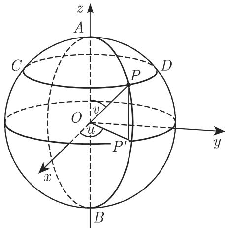
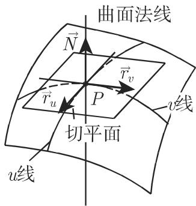
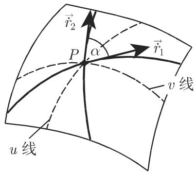
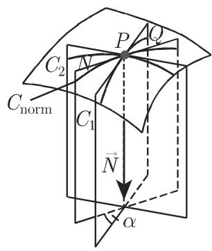
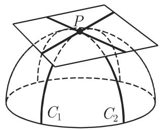
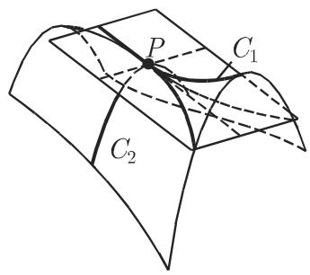
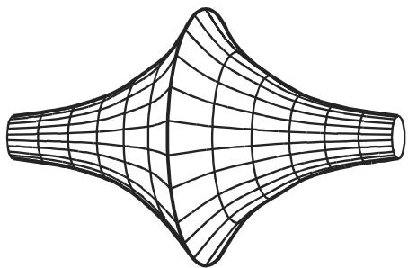

#### 3.6.3 曲面

3.6.3.1 曲面的定义方式

1. 曲面的方程

曲面可以用不同方式来定义：

a) 隐形式

$$
F (x, y, z) = 0.\tag{3.544}
$$

b) 显形式

$$
z = f (x, y).\tag{3.545}
$$

c) 参数形式

$$
x = x (u, v), \quad y = y (u, v), \quad z = z (u, v).\tag{3.546}
$$

d) 向量形式

$$
\vec {r} = \vec {r} (u, v), \quad \vec {r} = x (u, v) \vec {i} + y (u, v) \vec {j} + z (u, v) \vec {k}.\tag{3.547}
$$

如果参数 $u$ 和 $v$ 取遍所有的允许值，则通过 (3.546) (3.547) 就得到曲面上所有点的坐标和向径．从参数形式 (3.546) 消去 （如果可能的话）就得到隐形(3.544) ．显形式 (3.545) 是参数形式当 $u = x$ 和 $v = y$ 时的特殊情形．

·具有笛卡儿坐标、参数形式和向量形式的球面方程（图 3.246):

$$
x ^ {2} + y ^ {2} + z ^ {2} - a ^ {2} = 0;\tag{3.548a}
$$

$$
x = a \cos u \sin v, y = a \sin u \sin v, z = a \cos v;\tag{3.548b}
$$

$$
\vec {r} = a (\cos u \sin v \vec {i} + \sin u \sin v \vec {j} + \cos v \vec {k}).\tag{3.548c}
$$

2. 曲面上的曲线坐标

如果曲面是由形式 (3.546) (3.547) 给出的，而当固定另一个参数 $v = v _ { 0 }$ 时参数值 可以变化则点 ${ \vec { r } } ( x , y , z )$ 在曲而上描绘出一条曲线 $\vec { r } = \vec { r } ( u , v _ { 0 } )$ ．用不同但是固定的值 $v = v _ { 1 } , v = v _ { 2 } , \cdot \cdot \cdot , v = v _ { n }$ 一个接一个地替换 则给出曲面上的曲线族．当设 $v =$ 常数沿一条曲线移动时只有 在变动，这条曲线称为（图 3.245)．类似地我们可以通过变动 并固定如 $u _ { 1 } , u _ { 2 } , \ldots , u _ { n }$ 使 u= 常数得到另一族曲线即 线．这样，就在曲面 (3.546) 上定义了一个坐标线网其中两个固定的数 $u = u _ { i }$ 和 $v = v _ { k }$ 是曲而上点 的曲线坐标或高斯坐标．

如果曲面由形式 (3.545) 给出，则坐标线是曲面与平面 ＝常数和 ＝常数的交线利用隐形式的方程 $F ( u , v ) = 0$ 或这些坐标的参数方程 $u = u ( t )$ 和 $v = v ( t )$ 可以定义曲面上的曲线

·在球面的参数方程 (3.548b, c) 指的是点 的地理经度， 指的是它的极距．这里 线是子午线 $A P B ; u$ 线是平行圆 CPD （图 3.246).

  
3.245

  
3.246

3.6.3.2 切平面和曲面法线

1. 定义

(1) 切平面 关千切平面的精确的一般数学定义相当复杂，因此这里限千研究当曲面是由两个参数定义的情形假设，对千点 $P ( x , y , z )$ 的邻域映射 $( u , v ) \longrightarrow { \vec { r } } ( u ,$ v) 是可逆的，偏导 $\vec { r _ { u } } = \frac { \partial \vec { r } } { \partial u }$ 和 $\vec { r _ { v } } \ = \ \frac { \partial \vec { r } } { \partial v }$ 连续的，并且不互相平行．这时

$P ( x , y , z )$ 称为曲面的正则点．如果 是正则的，则过 的所有曲线的切线在同一平面内，这一平面称为曲面在 点处的切平面．如果这种情况发生，则偏导数 $\vec { r _ { u } }$ 和 ${ \vec { r } } _ { v }$ 是平行的（或 0) 仅对曲面的某些参数成立．如果对千任何参数它们都是平行的则该点称为奇点（参见第 353 3.6.3.2, 3.).

(2) 曲面法线 过点 垂直千切平面的直线称为 点处的曲面法线（图 3.247).

  
3.247

(3) 法向量 切平面是由两个向量，即 线和 线的切向量

$$
\vec {r} _ {u} = \frac {\partial \vec {r}}{\partial u}, \quad \vec {r} _ {v} = \frac {\partial \vec {r}}{\partial v}\tag{3.549a}
$$

张成的切向量的向量积 ${ \vec { r _ { u } } } \times { \vec { r _ { v } } }$ 是曲面法线方向上的一个向量．其单位向量

$$
\vec {N} _ {0} = \frac {\vec {r} _ {u} \times \vec {r} _ {v}}{| \vec {r} _ {u} \times \vec {r} _ {v} |}\tag{3.549b}
$$

称为法向量．它的方向指向曲面的一侧或另一侧依赖千 中哪一个变量是第一个坐标，哪一个是第二个坐标．

2. 切平面和曲面法线的方程（表 3.29)

：对千具有方程 (3.548a) 的球面有

a) 切平面

$$
2 x (X - x) + 2 y (Y - y) + 2 z (Z - z) = 0 \quad \text {或} \quad x X + y Y + z Z - a ^ {2} = 0;\tag{3.550a}
$$

b) 曲面法线

$$
\frac {X - x}{2 x} = \frac {Y - y}{2 y} = \frac {Z - z}{2 z} \quad \text {或} \quad \frac {X}{x} = \frac {Y}{y} = \frac {Z}{z}.\tag{3.550b}
$$

：对千具有方程 (3.548b) 的球面有

a) 切平面

$$
X \cos u \sin v + Y \sin u \sin v + Z \cos v = a;\tag{3.550c}
$$

b) 曲面法线

$$
{\frac {X}{\cos u \sin v}} = {\frac {Y}{\sin u \sin v}} = {\frac {Z}{\cos v}}.\tag{3.550d}
$$

3.29 切平面和曲面法线的方程

<table><tr><td>方程类型</td><td>切平面</td><td>曲面法线</td></tr><tr><td>(3.544)</td><td> $\frac{\partial F}{\partial x}(X - x) + \frac{\partial F}{\partial y}(Y - y)$  $+ \frac{\partial F}{\partial z}(Z - z) = 0$ </td><td> $\frac{X - x}{\frac{\partial F}{\partial x}} = \frac{Y - y}{\frac{\partial F}{\partial y}} = \frac{Z - z}{\frac{\partial F}{\partial z}}$ </td></tr><tr><td>(3.545)</td><td> $Z - z = p(X - x) + q(Y - y)$ </td><td> $\frac{X - x}{p} = \frac{Y - y}{q} = \frac{Z - z}{-1}$ </td></tr><tr><td>(3.546)</td><td> $\left| \begin{array}{ccc} X - x & Y - y & Z - z \\ \frac{\partial x}{\partial u} & \frac{\partial y}{\partial u} & \frac{\partial z}{\partial u} \\ \frac{\partial x}{\partial v} & \frac{\partial y}{\partial v} & \frac{\partial z}{\partial v} \end{array} \right| = 0$ </td><td> $\frac{X - x}{\left| \begin{array}{cc}\frac{\partial y}{\partial u} & \frac{\partial z}{\partial u} \\ \frac{\partial y}{\partial v} & \frac{\partial z}{\partial v} \end{array} \right|} = \frac{Y - y}{\left| \begin{array}{cc}\frac{\partial z}{\partial u} & \frac{\partial x}{\partial u} \\ \frac{\partial z}{\partial v} & \frac{\partial x}{\partial v} \end{array} \right|} = \frac{Z - z}{\left| \begin{array}{cc}\frac{\partial x}{\partial u} & \frac{\partial y}{\partial u} \\ \frac{\partial x}{\partial v} & \frac{\partial y}{\partial v} \end{array} \right|}$ </td></tr><tr><td>(3.547)</td><td> $(\vec{R} - \vec{r}) r_1 r_2 = 0^*$ 或 $(\vec{R} - \vec{r}) \vec{N} = 0$ </td><td> $\vec{R} = \vec{r} + \lambda (r_1 \times r_2)$ 或  $\vec{R} = \vec{r} + \lambda \vec{N}$ </td></tr></table>

注：在此表中 $x , y , z$ 和 $\vec { r }$ 是曲线上点 的坐标和向径； $X , Y , Z$ 和 $\vec { R }$ 是点 处切平面和曲面法线上动点的坐标和向径；此外 ${ \vec { r } } _ { 1 } = { \frac { \partial { \vec { r } } } { \partial u } } \ { \vec { r } } _ { 2 } = { \frac { \partial { \vec { r } } } { \partial v } } ; p = { \frac { \partial z } { \partial x } } , q = { \frac { \partial z } { \partial y } }$ 是法向量．

＊关千三个向量的混合积，参见第 249 3.5.1.6, 2.

3. 曲面的奇点

如果对千坐标为 $x = x _ { 1 } , y = y _ { 1 } , z = z _ { 1 }$ 的曲面上的点和方程 (3.544) ，等式

$$
\frac {\partial F}{\partial x} = 0, \quad \frac {\partial F}{\partial y} = 0, \quad \frac {\partial F}{\partial z} = 0, \quad F (x, y, z) = 0\tag{3.551}
$$

同时满足，即任何一阶偏导数在点 $P ( x _ { 1 } , y _ { 1 } , z _ { 1 } )$ 处都等千 0, 则该点称为奇点．通过此点的切线并不形成一个平面而是一个二阶锥面，方程为

$$
\begin{array}{l} \frac {\partial^ {2} F}{\partial x ^ {2}} (X - x _ {1}) ^ {2} + \frac {\partial^ {2} F}{\partial y ^ {2}} (Y - y _ {1}) ^ {2} + \frac {\partial^ {2} F}{\partial z ^ {2}} (Z - z _ {1}) ^ {2} + 2 \frac {\partial^ {2} F}{\partial x \partial y} (X - x _ {1}) (Y - y _ {1}) \\ + 2 \frac {\partial^ {2} F}{\partial y \partial z} (Y - y _ {1}) (Z - z _ {1}) + 2 \frac {\partial^ {2} F}{\partial z \partial x} (Z - z _ {1}) (X - x _ {1}) = 0, \end{array} \tag {3.552}
$$

其中二阶偏导数在点 $P ( x _ { 1 } , \ y _ { 1 } , \ z _ { 1 } )$ 处取值．如果在该点处的二阶偏导数也等千0, 则存在着一个更复杂类型的奇点．那时切线形成的是一个三阶或甚至更高阶的锥面

3.6.3.3 曲面的线素

1. 弧微分

考虑由形式 (3.546) (3.547) 给出的曲面．设 $P ( u , v )$ 是曲面上的任意点$N ( u + \mathrm { d } u , v + \mathrm { d } v )$ 是曲面上另一个接近千 的点则曲面上弧段 $\widehat { P N }$ 的弧长可以通过弧微分或曲面的线素利用下面的公式近似计算：

$$
\mathrm{d} s ^ {2} = E \mathrm{d} u ^ {2} + 2 F \mathrm{d} u \mathrm{d} v + G \mathrm{d} v ^ {2},\tag{3.553a}
$$

其中三个系数

$$
\begin{array}{l} {E = \vec {r} _ {u} ^ {2} = \left(\frac {\partial x}{\partial u}\right) ^ {2} + \left(\frac {\partial y}{\partial u}\right) ^ {2} + \left(\frac {\partial z}{\partial u}\right) ^ {2}, \quad F = \vec {r} _ {u} \vec {r} _ {v} = \frac {\partial x}{\partial u} \frac {\partial x}{\partial v} + \frac {\partial y}{\partial u} \frac {\partial y}{\partial v} + \frac {\partial z}{\partial u} \frac {\partial z}{\partial v},} \\ {G = \vec {r} _ {v} ^ {2} = \left(\frac {\partial x}{\partial v}\right) ^ {2} + \left(\frac {\partial y}{\partial v}\right) ^ {2} + \left(\frac {\partial z}{\partial v}\right) ^ {2}} \end{array} \tag {3.553b}
$$

是在点 处计算的．等式 (3.553a) 的右侧称为曲面的第一二次基本形式

：对千由形式 (3.548c) 给出的球面，显然有

$$
E = a ^ {2} \sin^ {2} v, \quad F = 0, \quad G = a ^ {2}, \quad \mathrm{d} s ^ {2} = a ^ {2} (\sin^ {2} v \mathrm{d} u ^ {2} + \mathrm{d} v ^ {2}).\tag{3.554}
$$

：对千由形式 (3.545) 给出的曲面，显然有

$$
E = 1 + p ^ {2}, \quad F = p q, \quad G = 1 + q ^ {2}, \quad \text {其中} \quad p = \frac {\partial z}{\partial x}, \quad q = \frac {\partial z}{\partial y}.\tag{3.555}
$$

2. 曲面上的度量

(1) 弧长 曲面上曲线 $u = u ( t ) , v = v ( t ) ( 0 \leqslant t \leqslant t _ { 1 } )$ 的弧长由下面的公式计算

$$
L = \int_ {t _ {0}} ^ {t _ {1}} \mathrm{d} s = \int_ {t _ {0}} ^ {t _ {1}} \sqrt {E \left(\frac {\mathrm{d} u}{\mathrm{d} t}\right) ^ {2} + 2 F \frac {\mathrm{d} u}{\mathrm{d} t} \frac {\mathrm{d} v}{\mathrm{d} t} + G \left(\frac {\mathrm{d} v}{\mathrm{d} t}\right) ^ {2}} \mathrm{d} t.\tag{3.556}
$$

(2) 两曲线之间的夹角 曲面 $\vec { r } = \vec { r } ( u , v )$ 上两条曲线 $\vec { r _ { 1 } } = \vec { r } ( u _ { 1 } ( t ) , v _ { 1 } ( t ) )$ ）和$\vec { r _ { 2 } } = \vec { r } ( u _ { 2 } ( t ) , v _ { 2 } ( t ) )$ 之间的夹角是它们具有方向向 $\vec { \dot { r } } _ { 1 }$ 六和 $\vec { \dot { r } _ { 2 } }$ 的两条切线之间的夹角（图 3.248)．它由下面的公式给出

$$
\begin{array}{r l} & {\cos \alpha = \frac {\vec {\dot {r}} _ {1} \vec {\dot {r}} _ {2}}{\sqrt {\vec {\dot {r}} _ {1} ^ {2} \vec {\dot {r}} _ {2} ^ {2}}}} \\ & {\qquad = \frac {E \dot {u} _ {1} \dot {u} _ {2} + F (\dot {u} _ {1} \dot {v} _ {2} + \dot {v} _ {1} \dot {u} _ {2}) + G \dot {v} _ {1} \dot {v} _ {2}}{\sqrt {E \dot {u} _ {1} ^ {2} + 2 F \dot {u} _ {1} \dot {v} _ {1} + G \dot {v} _ {1} ^ {2}} \sqrt {E \dot {u} _ {2} ^ {2} + 2 F \dot {u} _ {2} \dot {v} _ {2} + G \dot {v} _ {2} ^ {2}}},} \end{array}\tag{3.557}
$$

这里系数 $E , F$ 是在点 计算的， ${ \dot { u } } _ { 1 } , { \dot { u } } _ { 2 } , { \dot { v } } _ { 1 }$ 妇 $\dot { v } _ { 2 }$ 表示 $u _ { 1 } ( t ) , u _ { 2 } ( t ) , v _ { 1 } ( t )$ 和$v _ { 2 } ( t )$ 关千在点 对应的参数值 计算的一阶导数．

如果 (3.557) 的分子等千 0, 则两条曲线相互垂直．坐标曲线 V= 常数和 $u =$ 常数正交的条件是 $F = 0$

(3)曲面片的面积 曲面上由任意曲线所界的曲面片面积 可以用二重积分计算：

$$
S = \int_ {(S)} \mathrm{d} S,\tag{3.558a}
$$

其中

$$
\mathrm{d} S = \sqrt {E G - F ^ {2}} \mathrm{d} u \mathrm{d} v,\tag{3.558b}
$$

dS 称为曲面的面积元素

如果第一基本形式的系数 E,F 已知，则利用 (3.556)\~(3.558(a),(b) ）可以计算曲面上的长度、角和面积．因此第一二次基本形式定义了曲面上的度量

  
3.248

3. 通过弯曲进行曲面贴合

如果曲面通过弯曲变形，而不是拉伸、压缩或撕裂，则其度量保持不变．换旬话说，第一二次基本形式在弯曲下是一个不变量具有相同第一二次基本形式的两个曲面可以相互贴合

3.6.3.4 曲面的曲率

1. 曲面上曲线的曲率

如果引不同的曲线I'通过曲面上的点 （图 3.249)，则它们在点 处的曲率半有如下关系：

(1) 曲率半径 曲线 在点 处的曲率半径 $\rho$ 等千曲线 的曲率半径，它是曲面与曲线I'的密切平面的交线（图 3.249(a)).

(2) 默尼耶 (Meusnier) 定理 对千曲面的任意平面截曲线 （图 3.249) ，曲率半径可以用公式

$$
\rho = R \cos (\vec {n}, \vec {N})\tag{3.559}
$$

计算这里 是法截线 $C _ { \mathrm { n o r m } }$ 的曲率半径，它和 一样过同一切线 $N Q .$ 并且也包含曲面法线的单位向 ${ \vec { N } } ; \yen 123,456$ 是曲线 的主法截线的单位向量计与曲面法线的单位向量 $\vec { N }$ 之间的夹角．如果 $\vec { N }$ 位千曲线 $C _ { \mathrm { n o r m } }$ 的凹侧，则 (3.559) $^ { \mathnormal { \lceil } } \rho$ 的符号为正，否则为负

(3) 欧拉公式 对千点 处的任何一条法截线 $C _ { \mathrm { n o r m } }$ , 曲面的曲率可以用欧拉公式

$$
{\frac {1}{R}} = {\frac {\cos^ {2} \alpha}{R _ {1}}} + {\frac {\sin^ {2} \alpha}{R _ {2}}}\tag{3.560}
$$

计算，其中 $R _ { 1 }$ 和 $R _ { 2 }$ 主曲率半径（见 (3.562a)), 是法截线 $C _ { \mathrm { n o r m } }$ 和 $C _ { 1 }$ 的平面之间的夹角（图 3.249(c)).

  
(a)

  
(b)  
3.249

  
(c)

2. 主曲率半径

曲面的主曲率半径是具有极大值和极小值的半径．它们可以用主法截线 $C _ { 1 }$ 和$C _ { 2 }$ （图 3.249(c) ）计算． $C _ { 1 }$ 和 $C _ { 2 }$ 的平面相互垂直，它们的方向用值 $\frac { \mathrm { d } y } { \mathrm { d } x }$ 确定，后者可以由二次方程

$$
\left[ t p q - s (1 + q ^ {2}) \right] \left(\frac {\mathrm{d} y}{\mathrm{d} x}\right) ^ {2} + \left[ t (1 + p ^ {2}) - r (1 + q ^ {2}) \right] \frac {\mathrm{d} y}{\mathrm{d} x} + \left[ s (1 + p ^ {2}) - r p q \right] = 0\tag{3.561}
$$

计算，其中参数 p, q, r, s, (3.562b) 定义．如果曲面由显形式（3.545) 给出，则$R _ { 1 }$ 和凡 $R _ { 2 }$ 下面二次方程的根：

$$
(r t - s ^ {2}) R ^ {2} + h [ 2 p q s - (1 + p ^ {2}) t - (1 + q ^ {2}) r ] R + h ^ {4} = 0,\tag{3.562a}
$$

其中

$$
p = \frac {\partial z}{\partial x}, \quad q = \frac {\partial z}{\partial y}, \quad r = \frac {\partial^ {2} z}{\partial x ^ {2}}, \quad s = \frac {\partial^ {2} z}{\partial x \partial y}, \quad t = \frac {\partial^ {2} z}{\partial y ^ {2}} \quad \text {和} \quad h = \sqrt {1 + p ^ {2} + q ^ {2}}.\tag{3.562b}
$$

， $R _ { 1 }$ 和 $R _ { 2 }$ 的符号可以用和 (3.559) 中同样的规则确定．

如果曲面由向量形式 (3.547) 给出，则取代 (3.561) (3.562a) 相应的方程为

$$
(G M - F N) \left(\frac {\mathrm{d} v}{\mathrm{d} u}\right) ^ {2} + (G L - E N) \frac {\mathrm{d} v}{\mathrm{d} u} + (F L - E M) = 0,\tag{3.563a}
$$

$$
(L N - M ^ {2}) R ^ {2} - (E N - 2 F M + G L) R + (E G - F ^ {2}) = 0,\tag{3.563b}
$$

其中 L,M,N 是笫二二次基本形式的系数．它们由以下等式给出：

$$
L = \vec {r} _ {u u} \vec {R} = \frac {d}{\sqrt {E G - F ^ {2}}}, M = \vec {r} _ {u v} \vec {R} = \frac {d ^ {\prime}}{\sqrt {E G - F ^ {2}}},
$$

$$
N = \vec {r} _ {v v} \vec {R} = \frac {d ^ {\prime \prime}}{\sqrt {E G - F ^ {2}}},\tag{3.563c}
$$

这里向量 $\vec { r } _ { u u }$ $\vec { r } _ { u v }$ 和 $\vec { r } _ { v v }$ 是向径 $\vec { r }$ 关千参数 的二阶偏导数．在分子中有行列式

$$
\begin{array}{r} d = \left| \begin{array}{l l l} \frac {\partial^ {2} x}{\partial u ^ {2}} & \frac {\partial^ {2} y}{\partial u ^ {2}} & \frac {\partial^ {2} z}{\partial u ^ {2}} \\ \frac {\partial x}{\partial u} & \frac {\partial y}{\partial u} & \frac {\partial z}{\partial u} \\ \frac {\partial x}{\partial v} & \frac {\partial y}{\partial v} & \frac {\partial z}{\partial v} \end{array} \right|, \qquad d ^ {\prime} = \left| \begin{array}{l l l} \frac {\partial^ {2} x}{\partial u \partial v} & \frac {\partial^ {2} y}{\partial u \partial v} & \frac {\partial^ {2} z}{\partial u \partial v} \\ \frac {\partial x}{\partial u} & \frac {\partial y}{\partial u} & \frac {\partial z}{\partial u} \\ \frac {\partial x}{\partial v} & \frac {\partial y}{\partial v} & \frac {\partial z}{\partial v} \end{array} \right|, \\ d ^ {\prime \prime} = \left| \begin{array}{l l l} \frac {\partial^ {2} x}{\partial v ^ {2}} & \frac {\partial^ {2} y}{\partial v ^ {2}} & \frac {\partial^ {2} z}{\partial v ^ {2}} \\ \frac {\partial x}{\partial u} & \frac {\partial y}{\partial u} & \frac {\partial z}{\partial u} \\ \frac {\partial x}{\partial v} & \frac {\partial y}{\partial v} & \frac {\partial z}{\partial v} \end{array} \right|. \end{array}\tag{3.563d}
$$

表达式

$$
L \mathrm{d} u ^ {2} + 2 M \mathrm{d} u \mathrm{d} v + N \mathrm{d} v ^ {2}\tag{3.563e}
$$

称为笫二二次基本形式它包含曲面的曲率性质曲率线是曲面上的曲线它在每一点处具有主法截线的方向．通过积分 (3.561) (3.563a) 可以得到它们的方程

3. 曲面上点的分类

(1) 椭圆点如果在点 主曲率半径 $R _ { 1 }$ 和凡 $R _ { 2 }$ 有相同的符号，则在该点的邻近范围内曲面上的每一点都位千切平面的同侧，这时 称为椭圆点（图 3.250(a)).它的分析特征是关系

$$
L N - M ^ {2} > 0.\tag{3.564a}
$$

  
(a)

  
(b)  
3.250

  
(c)

(2) 圆点或跻点 这是曲面上的点 P, 在此处主曲率半径相等

$$
R _ {1} = R _ {2}.\tag{3.564b}
$$

因此对千法截线有 ＝常数

(3) 双曲点在主曲率半径 $R _ { 1 }$ 凡 $R _ { 2 }$ 有不同符号的情形，主法截线的凹侧具有相反的方向切平面与曲面相交，因此曲面在点 的邻近具有马鞍形． 称为双曲点（图 3.250(b)）；该点的分析特征是关系

$$
L N - M ^ {2} <   0.\tag{3.564c}
$$

(4) 抛物点 如果两个主曲率半 $R _ { 1 }$ 凡和 $R _ { 2 }$ 之一等千 $\infty .$ 则主法截线中任何一条在此具有拐点或它是一条直线．因此 是曲面的一个抛物点并有分析特征

$$
L N - M ^ {2} = 0.\tag{3.564d}
$$

·椭球面上的所有点都是椭圆点单叶双曲面上的点是双曲点柱面上的点是抛物点．

4. 曲面的曲率

刻画曲面的曲率最常用的两个量如下．

(1) 平均曲率 曲面在点 处的平均曲率：

$$
H = \frac {1}{2} \left(\frac {1}{R _ {1}} + \frac {1}{R _ {2}}\right).\tag{3.565a}
$$

(2) 高斯曲率 曲面在点 处的高斯曲率：

$$
K = \frac {1}{R _ {1} R _ {2}}.\tag{3.565b}
$$

：对千半径为 的圆柱面，这些是 $H = { \frac { 1 } { 2 a } }$ 和 $K = 0$

：对千椭圆点有 $K > 0 .$ ，对千双曲点有 $K < 0$ ，对千抛物点有 $K = 0$

(3) 的计算．

如果曲面由形式 $z = f ( x , y )$ 给出，则有

$$
H = \frac {r (1 + q ^ {2}) - 2 p q s + t (1 + p ^ {2})}{2 (1 + p ^ {2} + q ^ {2}) ^ {3 / 2}},\tag{3.566a}
$$

$$
K = \frac {r t - s ^ {2}}{(1 + p ^ {2} + q ^ {2}) ^ {2}}.\tag{3.566b}
$$

关千 $p , q , r , s , t$ 的含义见 (3.562b).

(4) 曲面按照其曲率所作的分类．

(a) 极小曲面极小曲面是在每点处具有 平均曲率 H, $R _ { 1 } = - R _ { 2 }$ 的曲而．

(b) 常曲率曲面 常曲率曲面具有常高斯曲率 ＝常数．

■ A: $K > 0$ ，例如球面．

■ B: $K < 0$ ，例如伪球面（图 3.251)，即曳物线（图 2.79) 围绕对称轴旋转所得到的曲面

  
3.251

3.6.3.5 直纹面和可展曲面

1. 直纹面

如果曲面可以由空间中一条移动的直线生成，则它称为直纹面

2. 可展曲面

如果直纹面可以展开在平面上，即铺开而不拉伸或压缩它的任何部分，则该曲面称为可展曲面．并不是任何直纹面都是可展的．

可展曲面具有下列属性：

a) 对千所有的点高斯曲率都等千 ，并且

b) 如果曲面由显形式 $z = f ( x , y )$ 给出则可展性的条件满足：

$$
\mathrm{a)} K = 0, \quad \mathrm{b)} r t - s ^ {2} = 0.\tag{3.567}
$$

关千 r, 的含义见 (3.562b).

■ A: 锥面（图 3.192) 和柱而（图 3.198) 是可展曲而．

：单叶双曲面（图 3.196) 和双曲抛物而（图 3.197) 是直纹面但它们不能展开在一个平面上

3.6.3.6 曲面上的测地线

1. 测地线的概念

（也见第 213 3.4.1.1, 3.) 过曲面上的每一点沿微商 $\frac { \mathrm { d } v } { \mathrm { d } u }$ 所确定的任何方向可以有一条假想曲线通过它称为测地线．它在曲面上与直线在平面上所起的作用相同，并具有下列性质

(1) 测地线是曲面上两点之间最短的曲线．

(2) 如果曲面上一个质点被在同一曲面上的另一个质点拖曳移动，并且没有其他的力作用千它则它将沿测地线移动

(3) 如果将一根松紧带在给定的曲面上拉伸，则它具有测地线的形状．

2. 定义

曲面上的测地线是这样一条曲线使得它在每点处的主法线具有与曲面法线相同的方向

·在圆柱面上测地线是圆柱螺旋线．

3. 测地线的方程

如果曲面由显形式 $z = f ( x , y )$ 给出，则测地线的微分方程是

$$
(1 + p ^ {2} + q ^ {2}) \frac {\mathrm{d} ^ {2} y}{\mathrm{d} x ^ {2}} = p t \left(\frac {\mathrm{d} y}{\mathrm{d} x}\right) ^ {3} + (2 p s - q t) \left(\frac {\mathrm{d} y}{\mathrm{d} x}\right) ^ {2} + (p r - 2 q s) \frac {\mathrm{d} y}{\mathrm{d} x} - q r.\tag{3.568}
$$

如果曲面由参数形式 (3.546) 给出，则测地线的微分方程将会十分复杂．关千$p , q , r , s$ 的含义见 (3.562b).

（程钊译）

章线性代数
