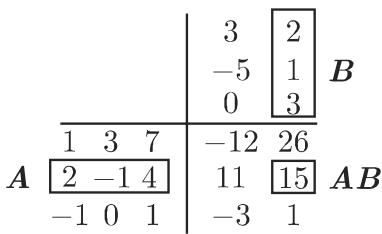

### 4.1 矩阵

#### 4.1.1 矩阵的概念

1. 大小为 $( m , n )$ 的矩阵 或（简记） $\pmb { A } _ { ( m , n ) }$

矩阵 $A _ { ( m , n ) }$ ）是一个排列为 行和 列的 $m \times n$ 个元素（例如，实数或复数，或函数、导数、向量）的系统：

$$
\begin{array}{r l r} {{\boldsymbol {A} = (a _ {i j}) = \left( \begin{array}{c c c c} {{a _ {1 1}}} & {{a _ {1 2}}} & {{\dots}} & {{a _ {1 n}}} \\ {{a _ {2 1}}} & {{a _ {2 2}}} & {{\dots}} & {{a _ {2 n}}} \\ {{\vdots}} & {{\vdots}} & & {{\vdots}} \\ {{a _ {m 1}}} & {{a _ {m 2}}} & {{\dots}} & {{a _ {m n}}} \end{array} \right)}} & & {{\leftarrow \text {第} 1 \text {行}}} \\ & & {{\leftarrow \text {第} 2 \text {行}}} \\ & & {{\vdots}} \\ & & {{\leftarrow \text {第} m \text {行}}} \\ {{\uparrow}} & {{\uparrow}} & {{\uparrow}} \\ {{\text {第}}} & {{\text {第}}} & {{\text {第}}} \\ {{1}} & {{2}} & {{\vdots}} & {{n}} \\ {{\text {列}}} & {{\text {列}}} & {{\text {列}}} \end{array}\tag{4.1}
$$

借助矩阵的大小的概念将矩阵分类：依据行数 和列数 $n ,$ 是大小为$( m , n )$ 的矩阵若一个矩阵行数与列数相等，则将它称为方阵，不然称为长方阵．

2. 实矩阵和复矩阵

实矩阵有实元素，复矩阵有复元素如果一个矩阵有复元素

$$
a _ {\mu \nu} + \mathrm{i} b _ {\mu \nu},\tag{4.2a}
$$

那么它可以分解为

$$
\mathbf {A} + \mathrm{i} \mathbf {B}\tag{4.2b}
$$

的形式其中 只有实元素（算术运算参见第 365 4.1.4)．如果矩阵复元素，那么它的共扼复矩阵 $A ^ { * }$ ＊有元素

$$
a _ {\mu \nu} ^ {*} = \mathrm{Re} (a _ {\mu \nu}) - \mathrm{i} \mathrm{Im} (a _ {\mu \nu}).\tag{4.2c}
$$

3. 转置矩阵 $A ^ { \mathrm { T } }$

互换 $( m , n )$ 矩阵 的行和列就给出转置矩阵 $A ^ { \mathrm { T } }$ ，它是大小为 $( n , m )$ 的矩阵，并且有

$$
(a _ {\nu \mu}) ^ {\mathrm{T}} = (a _ {\mu \nu}).\tag{4.3}
$$

4. 共辄转置矩阵

复矩阵 的共扼转置矩阵 $A ^ { \mathrm { H } }$ 是它的共辄复矩阵 $A ^ { * }$ 的转置：

$$
\boldsymbol {A} ^ {\mathrm{H}} = (\boldsymbol {A} ^ {*}) ^ {\mathrm{T}}\tag{4.4}
$$

（不要将它与伴随矩阵 $A _ { \mathrm { a d j } }$ 混淆，参见第 373 4.2.2).

5. 零矩阵

仅有零元素的矩阵

$$
\mathbf {0} = \left( \begin{array}{c c c c} 0 & 0 & \dots & 0 \\ 0 & 0 & \dots & 0 \\ \vdots & \vdots & & \vdots \\ 0 & 0 & \dots & 0 \end{array} \right)\tag{4.5}
$$

称为零矩阵．

#### 4.1.2 方阵

1. 定义

方阵有相同的行数和列数，即 $m = n$

$$
\boldsymbol {A} = \boldsymbol {A} _ {(n, n)} = \left( \begin{array}{c c c} a _ {1 1} & \dots & a _ {1 n} \\ \vdots & & \vdots \\ a _ {n 1} & \dots & a _ {n n} \end{array} \right).\tag{4.6}
$$

矩阵 从左上角到右下角的对角线上的元素称为（主）对角元素．将它们记作 $a _ { 1 1 }$ $a _ { 2 2 } , \cdots , a _ { n n }$ 九，即它们是全部满足 $\mu = \nu$ 的元素 $a _ { \mu \nu }$

2. 对角矩阵

方阵 称为对角矩阵，如果它的所有非对角元素全等千零： $a _ { \mu \nu } = 0$ （当 $\mu \neq \nu )$

$$
\boldsymbol {D} = \left( \begin{array}{c c c c} a _ {1 1} & 0 & \dots & 0 \\ 0 & a _ {2 2} & \dots & 0 \\ \vdots & \vdots & & \vdots \\ 0 & 0 & \dots & a _ {n n} \end{array} \right) = \left( \begin{array}{c c c c} a _ {1 1} & \mathbf {0} & \\ & a _ {2 2} & \\ & & \ddots & \\ & \mathbf {0} & & a _ {n n} \end{array} \right).\tag{4.7}
$$

3. 标量矩阵

对角矩阵 称为标量矩阵，如果它的所有对角元素是相等的实数或复数 $c$ :

$$
\boldsymbol {S} = \left( \begin{array}{c c c c} c & 0 & \dots & 0 \\ 0 & c & \dots & 0 \\ \vdots & \vdots & & \vdots \\ 0 & 0 & \dots & c \end{array} \right).\tag{4.8}
$$

4. 矩阵的迹

对千一个方阵，矩阵的迹定义为它的主对角元素之和

$$
\operatorname{Tr} (\boldsymbol {A}) = a _ {1 1} + a _ {2 2} + \dots + a _ {n n} = \sum_ {\mu = 1} ^ {n} a _ {\mu \mu}.\tag{4.9}
$$

5. 对称矩阵

如果方阵 等千自身的转置，则它是对称的：

$$
\boldsymbol {A} = \boldsymbol {A} ^ {\mathrm{T}}.\tag{4.10}
$$

对千关千主对角线对称的位置上的元素有

$$
a _ {\mu \nu} = a _ {\nu \mu}.\tag{4.11}
$$

6. 正规矩阵

正规矩阵满足等式

$$
\boldsymbol {A} ^ {\mathrm{H}} \boldsymbol {A} = \boldsymbol {A} \boldsymbol {A} ^ {\mathrm{H}}\tag{4.12}
$$

（关千矩阵的积，参见第 365 4.1.4).

7. 反对称或斜对称矩阵

反对称矩阵是具有性质

$$
\pmb {A} = - \pmb {A} ^ {\mathrm{T}}\tag{4.13a}
$$

的方阵 ．对千反对称矩阵的元素 $a _ { \mu \nu }$ ，有

$$
a _ {\mu \nu} = - a _ {\mu \nu}, \quad a _ {\mu \mu} = 0,\tag{4.13b}
$$

所以反对称矩阵的迹为零：

$$
\operatorname{Tr} (\boldsymbol {A}) = 0,\tag{4.13c}
$$

关千主对角线对称的位置上的元素仅差一个符号．

每个方阵 可以分解为对称矩阵 $A _ { \mathrm { s } }$ 和反对称矩阵 $A _ { \mathrm { a s } }$ 之和：

$$
\pmb {A} = \pmb {A} _ {\mathrm{s}} + \pmb {A} _ {\mathrm{as}}, \quad \text {其中} \pmb {A} _ {\mathrm{s}} = \frac {1}{2} (\pmb {A} + \pmb {A} ^ {\mathrm{T}}); \pmb {A} _ {\mathrm{as}} = \frac {1}{2} (\pmb {A} - \pmb {A} ^ {\mathrm{T}}).\tag{4.13d}
$$

8. 埃尔米特 (Hermitian) 矩阵或自共辄矩阵

埃尔米特矩阵是等千它自身的共辄转置矩阵的方阵 A:

$$
\boldsymbol {A} = \left(\boldsymbol {A} ^ {*}\right) ^ {\mathrm{T}} = \boldsymbol {A} ^ {\mathrm{H}}.\tag{4.14}
$$

在实数域上，对称矩阵与埃尔米特矩阵是相同的概念．埃尔米特矩阵的行列式是实数

9. 反埃尔米特矩阵或斜埃尔米特矩阵

反埃尔米特矩阵是等千其负共辄转置矩阵的方阵 A:

$$
\boldsymbol {A} = - \left(\boldsymbol {A} ^ {*}\right) ^ {\mathrm{T}} = - \boldsymbol {A} ^ {\mathrm{H}}.\tag{4.15a}
$$

对千反埃尔米特矩阵的元素 $a _ { \mu \nu }$ 和迹，下列等式成立：

$$
a _ {\mu \nu} = - a _ {\mu \nu} ^ {*}, a _ {\mu \mu} = 0; \mathrm{Tr} (\boldsymbol {A}) = 0.\tag{4.15b}
$$

每个方阵 可以分解为埃尔米特矩阵 $A _ { \mathrm { h } }$ 和反埃尔米特矩阵 $A _ { \mathrm { a h } }$ 之和：

$$
\pmb {A} = \pmb {A} _ {\mathrm{h}} + \pmb {A} _ {\mathrm{ah}}, \quad \text {其中} \pmb {A} _ {\mathrm{h}} = \frac {1}{2} (\pmb {A} + \pmb {A} ^ {\mathrm{H}}); \pmb {A} _ {\mathrm{ah}} = \frac {1}{2} (\pmb {A} - \pmb {A} ^ {\mathrm{H}}).\tag{4.15c}
$$

10. 恒等矩阵

恒等矩阵 是一个对角矩阵，它的每个对角元素等千 ，并且所有非对角元素都等千零：

$$
\pmb {I} = \left( \begin{array}{c c c c} {1} & {0} & {\dots} & {0} \\ {0} & {1} & {\dots} & {0} \\ {\vdots} & {\vdots} & & {\vdots} \\ {0} & {0} & {\dots} & {1} \end{array} \right) = (\delta_ {\mu \nu}), \quad \text {其中} \quad \delta_ {\mu \nu} = \left\{ \begin{array}{l l} {0,} & {\quad \mu \neq \nu ,} \\ {1,} & {\quad \mu = \nu .} \end{array} \right.\tag{4.16}
$$

记号 $\delta _ { \mu \nu }$ 称作克罗内克符号．

11. 三角矩阵

(1) 上三角矩阵 上三角矩阵 是一个方阵，它的所有位千主对角线之下的元素全等千零：

$$
\pmb {U} = (u _ {\mu \nu}), \quad \text {其中} \quad u _ {\mu \nu} = 0 (\text {当} \mu > \nu).\tag{4.17}
$$

(2) 下三角矩阵 下三角矩阵 是一个方阵，它的所有位千主对角线之上的元素全等千零：

$$
\pmb {L} = (l _ {\mu \nu}), \quad \text {其中} \quad l _ {\mu \nu} = 0 (\text {当} \mu <   \nu).\tag{4.18}
$$

#### 4.1.3 向量

大小为 (n, 1) 的矩阵是 列矩阵或 维列向量大小为 (l, n) 的矩阵是矩阵或 维行向量：

列向量

$$
\underline {{\boldsymbol {a}}} = \left( \begin{array}{c} a _ {1} \\ a _ {2} \\ \vdots \\ a _ {n} \end{array} \right);\tag{4.19a}
$$

行向 $\underline { { \pmb { a } } } ^ { \mathrm { T } } = ( a _ { 1 } , a _ { 2 } , \cdots , a _ { n } )$

(4.19b)

通过转置，列向量变为行向量，反之，行向量变为列向量． 维行向量或列向量能够确定 维欧氏空间中的一个点零向量分别记为 $\underline { { \mathbf { 0 } } } ^ { \mathrm { T } }$

#### 4.1.4 矩阵的算术运算

1. 矩阵的相等

两个矩阵 $A = \left( a _ { \mu \nu } \right)$ 和 $B = \left( b _ { \mu \nu } \right)$ 相等，如果它们有相同的大小，并且对应元素相等

$$
\boldsymbol {A} = \boldsymbol {B}, \quad \text {当} \quad a _ {\mu \nu} = b _ {\mu \nu} (\mu = 1, \dots , m; \nu = 1, \dots , n).\tag{4.20}
$$

2. 加法和减法

两个矩阵仅当大小相同时才可能相加减．两个矩阵的和（差）由它们的对应元 素相加（相减）得到

$$
\boldsymbol {A} \pm \boldsymbol {B} = (a _ {\mu \nu}) \pm (b _ {\mu \nu}) = (a _ {\mu \nu} \pm b _ {\mu \nu}).\tag{4.21a}
$$

.( 1 3 7\ 2 —1 4) + 3(2 —5 0\ —2 7 0 8) 4) 4

对千矩阵的加法交换律和结合律成立：

a) 交换律 $A + B = B + A ;$

(4.21b)

b) 结合律 $( A + B ) + C = A + ( B + C ) .$

(4.21c)

3. 数乘矩阵

实数或复数 与大小为 $( m , n )$ 的矩阵 相乘，就是用 的每个元素：

$$
\alpha \boldsymbol {A} = \alpha (a _ {\mu \nu}) = (\alpha a _ {\mu \nu}).\tag{4.22a}
$$

3 $\left( { \begin{array} { c c c } { 1 } & { 3 } & { 7 } \\ { 0 } & { - 1 } & { 4 } \end{array} } \right) = \left( { \begin{array} { c c c } { 3 } & { 9 } & { 2 1 } \\ { 0 } & { - 3 } & { 1 2 } \end{array} } \right)$

(4.22a) 可知我们显然可以提出矩阵每个元素都含有的常数因子．对千矩阵与标量的乘法乘法交换律、结合律及分配律都成立：、及

a) 交换律 $\alpha A = A \alpha ;$

(4.22b)

b) 结合律 $\alpha ( \beta A ) = ( \alpha \beta ) A ;$

(4.22c)

$$
(\alpha \pm \beta) \boldsymbol {A} = \alpha \boldsymbol {A} \pm \beta \boldsymbol {A}; \alpha (\boldsymbol {A} \pm \boldsymbol {B}) = \alpha \boldsymbol {A} \pm \alpha \boldsymbol {B}.\tag{4.22d}
$$

4. 数除以矩阵

用标量 $\gamma \neq 0$ 除矩阵即用 $\alpha = 1 / \gamma$ 乘矩阵．

5. 两矩阵相乘

(1) 矩阵乘积 两个矩阵 的乘积 AB 仅当左边因子 的行数等千右边因子 的列数时才可计算．如果 是大小为 $( m , n )$ 的矩阵，那么矩阵 的大小必须是 $( n , p )$ ，并且乘积 AB 是大小为 $( m , p )$ 的矩阵 $C = \left( c _ { \mu \nu } \right)$ ．元素 $c _ { \mu \nu }$ 等千左边因子 的第 $\mu$ 行与右边因子 的第 $\mu$ 列的标量积：

$$
\boldsymbol {A} \boldsymbol {B} = \left(\sum_ {\nu = 1} ^ {n} a _ {\mu \nu} b _ {\nu \lambda}\right) = (c _ {\mu \lambda}) = \boldsymbol {C} \quad (\mu = 1, 2, \dots , m; \lambda = 1, 2, \dots , p).\tag{4.23}
$$

$A = \left( { \frac { 1 3 7 } { 2 - 1 4 } } \right)$ $B = \left( \begin{array} { c c } { { 3 } } & { { \left. 2 \right. } } \\ { { - 5 } } & { { \left. 1 \right. } } \\ { { 0 } } & { { \left. 3 \right. } } \end{array} \right) .$ ，依照公式（4.23)，积矩阵元素 $c _ { 2 2 } = 2 \cdot 2 - 1 \cdot 1 + 4 \cdot 3 = 1 5 $

(2) 矩阵乘积的不相等 即使乘积 AB BA 都存在，通常 $A B \ne B A$ ，也就是说，乘法交换律一般不成立．如果等式 AB =BA 成立，那么我们称矩阵是可换的或互相交换的．

(3) 法尔克 (Falk) 格式矩阵乘法 AB= 可以借助法尔克格式实现（图 4.1) ．积矩阵 的元素 $c _ { \mu \nu }$ 恰好出现在 的第 $\mu$ 行与 的第入列的交点

• 应用法尔克格式矩阵 $A _ { ( 3 , 3 ) }$ 与 $B _ { ( 3 , 2 ) }$ 相乘如图 4.2 所示．

4.1  
  
4.2

(4) 复元素矩阵 $\pmb { K } _ { 1 }$ 和 $K _ { 2 }$ 的乘法 对千两个复元素矩阵的乘法，可以应用依据公式 (4.2b) 得到的实部和虚部分解式： $\pmb { K } _ { 1 } = \pmb { A } _ { 1 } + \mathrm { i } \pmb { B } _ { 1 } , \pmb { K } _ { 2 } = \pmb { A } _ { 2 } + \mathrm { i } \pmb { B } _ { 2 }$ , 这里$A _ { 1 } , B _ { 1 } , A _ { 2 } , B _ { 2 }$ 是实矩阵．作此分解后，相乘得到一些矩阵之和，其中各加项是实矩阵之积

■ $( A + \mathrm { i } B ) ( A - \mathrm { i } B ) = A ^ { 2 } + B ^ { 2 } + \mathrm { i } ( B A - A B )$ （关千矩阵的幕，参见第 3704.1.5, 8.）．当然，在做这些矩阵的乘法时，应当考虑到交换律对千乘法一般不成立，即矩阵 通常是不可互相交换的．

6. 两个向量的标量积和并积

如果将向量 分别看作 行矩阵和 列矩阵，那么依据矩阵乘法法则，存在两种可能将它们相乘

如果旦的大小是 (l,n),!!\_ 的大小是 $( n , 1 )$ ，那么它们的乘积的大小是 (1,1)，即是一个数它称作两个向量的标量积．反之，如果 有大小 (n,l),!!\_ 有大小 $( 1 , m )$ 那么它们的乘积的大小是 $( n , m )$ ，即是一个矩阵这个矩阵称为这两个向量的并积．

(1) 两个向量的标量积 行向量 $\underline { { { a } } } ^ { \mathrm { T } } \ = \ ( a _ { 1 } , a _ { 2 } , \cdot \cdot \cdot , a _ { n } )$ 与列向量!! $\underline { { \boldsymbol { b } } } \ = \ \left( \boldsymbol { b } _ { 1 } \right.$

$b _ { 2 } , \cdots , b _ { n } ) ^ { \mathrm { T } }$ （两者都有 个元素）的标量积定义为数，

$$
\underline {{{{\boldsymbol {a}}}}} ^ {\mathrm{T}} \underline {{{{\boldsymbol {b}}}}} = \underline {{{{\boldsymbol {b}}}}} ^ {\mathrm{T}} \underline {{{{\boldsymbol {a}}}}} = a _ {1} b _ {1} + a _ {2} b _ {2} + \dots + a _ {n} b _ {n} = \sum_ {\mu = 1} ^ {n} a _ {\mu} b _ {\mu}.\tag{4.24}
$$

乘法交换律对千标量积一般不成立，因此必须准确保持 $\underline { a } ^ { \mathrm { T } }$ 和 $\underline { { \boldsymbol { b } } }$ 的顺序．如果交换乘法顺序那么乘积 $\underline { { \boldsymbol { b } } } \underline { { \boldsymbol { a } } } ^ { \mathrm { T } }$ 将是并积

(2) 两个向量的井积或张量积 维行向量 $\underline { { \pmb { a } } } = ( a _ { 1 } , a _ { 2 } , \cdots , a _ { n } ) ^ { \mathrm { T } }$ 与 维列向量 $\underline { { b } } ^ { \mathrm { T } } = ( b _ { 1 } , b _ { 2 } , \cdots , b _ { m } )$ ）的并积定义为下列大小为 (n,m) 的矩阵：

$$
\underline {{\boldsymbol {a}}} \underline {{\boldsymbol {b}}} ^ {\mathrm{T}} = \left( \begin{array}{c c c c} a _ {1} b _ {1} & a _ {1} b _ {2} & \dots & a _ {1} b _ {m} \\ a _ {2} b _ {1} & a _ {2} b _ {2} & \dots & a _ {2} b _ {m} \\ \vdots & \vdots & & \vdots \\ a _ {n} b _ {1} & a _ {n} b _ {2} & \dots & a _ {n} b _ {m} \end{array} \right).\tag{4.25}
$$

在此乘法交换律一般也不成立．

(3) 关千两个向量的向量积概念的提示 在多向量或交错张量的范围中有所谓外积，其三维形式就是熟知的向量积或叉积（参见第 247 3.5.1.5, 2. 及其后）．本书不讨论高秩多向量的外积

7. 矩阵的秩

(1) 定义 矩阵 中线性无关的列向量的最大个数 等千线性无关的行向量的最大个数这个数 称为矩阵的秩，并且记作 $\operatorname { r a n k } ( A ) = r$

(2) 关千矩阵的秩的一些说明

a) 因为在 维向量空间中不存在多千 个线性无关的行向量或列向量（参见第 490 5.3.8.2) ，所以大小为 $( m , n )$ 的矩阵 的秩不可能大千 中的较小者：

$$
\operatorname{rank} \left(\boldsymbol {A} _ {(m, n)}\right) = r \leqslant \min \{m, n \}.\tag{4.26a}
$$

b) 方阵 $\boldsymbol { A } _ { ( n , n ) }$ ）称为正则矩阵，如果

$$
\operatorname{rank} (A _ {(n, n)}) = r = n.\tag{4.26b}
$$

大小为 $( n , n )$ 的方阵是正则的，当且仅当它的行列式不为零，即 det $A \neq 0$ （参见第373 4.2.2, 3.) ．不然它是奇异方阵．

c) 因此，对千奇异方阵 $\boldsymbol { A } _ { ( n , n ) }$ ' $\operatorname* { d e t } \ \pmb { A } = 0$ ，有

$$
\operatorname{rank} \left(\boldsymbol {A} _ {(n, n)}\right) = r <   n.\tag{4.26c}
$$

d) 零矩阵 的秩等千零：

$$
\operatorname{rank} (\mathbf {0}) = 0.\tag{4.26d}
$$

e) 矩阵的和及积的秩满足关系式

$$
| \operatorname{rank} (\boldsymbol {A}) - \operatorname{rank} (\boldsymbol {B}) | \leqslant \operatorname{rank} (\boldsymbol {A} + \boldsymbol {B}) \leqslant \operatorname{rank} (\boldsymbol {A}) + \operatorname{rank} (\boldsymbol {B}),\tag{4.26e}
$$

$$
\operatorname{rank} (\boldsymbol {A B}) \leqslant \min \left\{\operatorname{rank} (\boldsymbol {A}), \operatorname{rank} (\boldsymbol {B}) \right\}.\tag{4.26f}
$$

(3) 确定秩的法则 初等变换不改变矩阵的秩．其中初等变换是

a) 交换两列或两行

b) 用数乘一行或一列

c) 将一行加到另一行或将一列加到另一列．

为了确定它们的秩，可以通过适当的行的线性组合将每个矩阵变换为这种形式：在第 $\mu$ 行中至少最初 $\mu - 1$ 个元素等千零 $( \mu = 2 , 3 , \cdots , m )$ （高斯算法原理，参见417 4.5.2.4)．在变换得到的矩阵中非零向量的行向量的个数等千矩阵的秩 r.

8. 逆矩阵

对千正则矩阵 $A = \left( a _ { \mu \nu } \right)$ 总存在（对千乘法的）逆矩阵 $A ^ { - 1 }$ ，即

$$
\pmb {A} \pmb {A} ^ {- 1} = \pmb {A} ^ {- 1} \pmb {A} = \pmb {I}.\tag{4.27a}
$$

$A ^ { - 1 } = ( \beta _ { \mu \nu } )$ 的元素是

$$
\beta_ {\mu \nu} = \frac {A _ {\nu \mu}}{\det A},\tag{4.27b}
$$

其中 $\mathbf { } A _ { \nu \mu }$ 是属千矩阵 的元素 $a _ { \nu \mu }$ 的余因子（参见第 372 4.2.1, 1.）．为实际计算 $A ^ { - 1 }$ 可应用第 373 4.2.2, 2. 所给出的方法．在大小为 (2,2) 的矩阵的情形中，有

$$
\boldsymbol {A} = \left( \begin{array}{c c} a & b \\ c & d \end{array} \right), \quad \boldsymbol {A} ^ {- 1} = \frac {1}{a d - b c} \left( \begin{array}{c c} d & - b \\ - c & a \end{array} \right).\tag{4.28}
$$

为什么不定义矩阵的除法，而是应用逆矩阵进行计算？这与除法不能唯一地定义的事实相关方程

$$
B X _ {1} = A \quad \text {与} \quad X _ {2} B = A \quad (\text {其中} B \text {正则})
$$

的解

$$
X _ {1} = B ^ {- 1} A \quad {\text {与}} \quad X _ {2} = A B ^ {- 1}\tag{4.29}
$$

一般是不同的．

9. 正交矩阵

如果对千方阵 关系式

$$
\boldsymbol {A} ^ {\mathrm{T}} = \boldsymbol {A} ^ {- 1} \quad \text {或} \quad \boldsymbol {A} \boldsymbol {A} ^ {\mathrm{T}} = \boldsymbol {A} ^ {\mathrm{T}} \boldsymbol {A} = \boldsymbol {I}\tag{4.30}
$$

成立，则称它是一个正交矩阵，这就是说，它的任一行与另一行的转置的标量积，或任一列的转置与另一列的标量积都为零，同时任一行与它自己的转置或任一列的转置与它自己的标量积都等千 1.

正交矩阵有下列性质

a) 正交矩阵的转置和逆也是正交矩阵；并且其行列式

$$
\det \boldsymbol {A} = \pm 1.\tag{4.31}
$$

b) 正交矩阵的积也是正交矩阵．

• 旋转矩阵 也是正交矩阵，它被用来刻画坐标系的旋转，其元素是新轴向的方向余弦（参见第 284 3.5.3.3, 2.).

10. 酉矩阵

如果对千复元素矩阵 关系式

$$
(\pmb {A} ^ {*}) ^ {\mathrm{T}} = \pmb {A} ^ {- 1} \quad \text {或} \quad \pmb {A} (\pmb {A} ^ {*}) ^ {\mathrm{T}} = (\pmb {A} ^ {*}) ^ {\mathrm{T}} \pmb {A} = \pmb {I}\tag{4.32}
$$

成立，则称它是一个酉矩阵．在实数情形，酉矩阵与正交矩阵相同

#### 4.1.5 矩阵的运算法则

下列法则自然仅当运算可以实施时有效，例如，恒等矩阵 总具有与所给运算的要求相适应的大小

1. 恒等矩阵与矩阵相乘

也称为恒等变换：

$$
A I = I A = A.\tag{4.33}
$$

（这不意味着交换律一般地成立，因为左边和右边的恒等矩阵 的大小可以不同）

2. 标量矩阵 与方阵 相乘

标量矩阵 $S$ 与方阵 相乘或者恒等矩阵 与方阵相乘，是可换的：

$$
\boldsymbol {A} \boldsymbol {S} = \boldsymbol {S} \boldsymbol {A} = c \boldsymbol {A} \quad (\text {其中} \boldsymbol {S} \text {由(4.8)给出})\tag{4.34a}
$$

$$
\boldsymbol {A} \boldsymbol {I} = \boldsymbol {I} \boldsymbol {A} = \boldsymbol {A}\tag{4.34b}
$$

3. 零矩阵 与矩阵 相乘

零矩阵 $\bf \delta \cdot U \cdot \bf \delta u$ 与矩阵 相乘，结果是零矩阵：

$$
\mathbf {A} \mathbf {0} = \mathbf {0}, \quad \mathbf {0} \mathbf {A} = \mathbf {0}\tag{4.35}
$$

（上面的零矩阵可以有不同的大小）．逆命题一般不成立，也就是说，由 AB=O不出 $\mathbf { A } = \mathbf { 0 }$ 或 $\mathbf { \nabla } B = \mathbf { 0 }$

4. 两个矩阵之积为零

甚至两个矩阵 都不是零矩阵，它们的积可以是零矩阵：

AB=O BA=O 或两者都成立，虽然 $\pmb { \cal A } \neq \mathbf { 0 } , \ \pmb { \cal B } \neq \mathbf { 0 } .$

(4.36)

$$
\begin{array}{c c c c} & 1 & 1 \\ & 0 & 0 \\ \hline 0 & 1 & 0 & 0 \\ 0 & 1 & 0 & 0 \end{array}
$$

．三个矩阵相乘

$$
(A B) C = A (B C),\tag{4.37}
$$

即乘法结合律成立．

6. 两个矩阵之和或积的转置

$$
(\boldsymbol {A} + \boldsymbol {B}) ^ {\mathrm{T}} = \boldsymbol {A} ^ {\mathrm{T}} + \boldsymbol {B} ^ {\mathrm{T}}, (\boldsymbol {A B}) ^ {\mathrm{T}} = \boldsymbol {B} ^ {\mathrm{T}} \boldsymbol {A} ^ {\mathrm{T}}, (\boldsymbol {A} ^ {\mathrm{T}}) ^ {\mathrm{T}} = \boldsymbol {A}.\tag{4.38a}
$$

对千可逆方阵 $\boldsymbol { A } _ { ( n , n ) }$ ）有

$$
(\boldsymbol {A} ^ {\mathrm{T}}) ^ {- 1} = (\boldsymbol {A} ^ {- 1}) ^ {\mathrm{T}}.\tag{4.38b}
$$

7. 两个矩阵之积的逆

$$
(A B) ^ {- 1} = B ^ {- 1} A ^ {- 1}.\tag{4.39}
$$

8. 矩阵的幕

$$
\boldsymbol {A} ^ {p} = \underbrace {\boldsymbol {A} \boldsymbol {A} \cdots \boldsymbol {A}} _ {p \text {个因子}} (p > 0 \text {是整数}).\tag{4.40a}
$$

$$
\boldsymbol {A} ^ {0} = \boldsymbol {I} \quad (\det \boldsymbol {A} \neq 0).\tag{4.40b}
$$

$$
\pmb {A} ^ {- p} = (\pmb {A} ^ {- 1}) ^ {p} \quad (p > 0 \text {是整数}; \det \pmb {A} \neq 0).\tag{4.40c}
$$

$$
\pmb {A} ^ {p + q} = \pmb {A} ^ {p} \pmb {A} ^ {q} \quad (p, q \text {是整数}).\tag{4.40d}
$$

9. 克罗内克积

两个矩阵 $\pmb { A } = ( a _ { \mu \nu } ) \big ( ( m , n )$ 型）与 $\pmb { { \cal B } } = ( b _ { \mu \nu } ) \big ( ( p , r )$ 型）的克罗内克积按照法则

$$
\boldsymbol {A} \otimes \boldsymbol {B} = (a _ {\mu \nu} \boldsymbol {B})\tag{4.41}
$$

定义．由 的每个元素与矩阵 相乘，所得结果是一个 $( m \cdot p , n \cdot r )$ 型的新矩阵．$\pmb { A } = \left( \begin{array} { c c c } { 3 } & { - 5 } & { 0 } \\ { 2 } & { 1 } & { 3 } \end{array} \right)$ 是（2,3) 型矩阵， $B = \left( \begin{array} { c c } { { 1 } } & { { 3 } } \\ { { 2 } } & { { - 1 } } \end{array} \right)$ (2,2) 型矩阵，

$$
\begin{array}{r l} \boldsymbol {A} \otimes \boldsymbol {B} & = \left( \begin{array}{c c c} 3 \cdot \left( \begin{array}{c c} 1 & 3 \\ 2 & - 1 \end{array} \right) & - 5 \cdot \left( \begin{array}{c c} 1 & 3 \\ 2 & - 1 \end{array} \right) & 0 \cdot \left( \begin{array}{c c} 1 & 3 \\ 2 & - 1 \end{array} \right) \\ 2 \cdot \left( \begin{array}{c c} 1 & 3 \\ 2 & - 1 \end{array} \right) & 1 \cdot \left( \begin{array}{c c} 1 & 3 \\ 2 & - 1 \end{array} \right) & 3 \cdot \left( \begin{array}{c c} 1 & 3 \\ 2 & - 1 \end{array} \right) \end{array} \right) \\ & = \left( \begin{array}{c c c c c c} 3 & 9 & - 5 & - 1 5 & 0 & 0 \\ 6 & - 3 & - 1 0 & 5 & 0 & 0 \\ 2 & 6 & 1 & 3 & 3 & 9 \\ 4 & - 2 & 2 & - 1 & 6 & - 3 \end{array} \right) \end{array}
$$

给出 (4, 6) 型矩阵．

对千转置和迹下列等式成立：

$$
\left(\boldsymbol {A} \otimes \boldsymbol {B}\right) ^ {\mathrm{T}} = \boldsymbol {A} ^ {\mathrm{T}} \otimes \boldsymbol {B} ^ {\mathrm{T}},\tag{4.42}
$$

$$
\operatorname{Tr} (\boldsymbol {A} \otimes \boldsymbol {B}) = \operatorname{Tr} (\boldsymbol {A}) \cdot \operatorname{Tr} (\boldsymbol {B}).\tag{4.43}
$$

10. 矩阵的微分

如果矩阵 $A = A ( t ) = ( a _ { \mu \nu } ( t ) )$ 具有参数 的可微元素 $a _ { \mu \nu } ( t )$ ，那么它对千的导数由

$$
\frac {\mathrm{d} \boldsymbol {A}}{\mathrm{d} t} = \left(\frac {\mathrm{d} a _ {\mu \nu} (t)}{\mathrm{d} t}\right) = \left(a _ {\mu \nu} ^ {\prime} (t)\right)\tag{4.44}
$$

给出

#### 4.1.6 向量范数和矩阵范数

向量和矩阵的范数可以看作数的绝对值的一般化．千是，对千每个向量 $\underline { { \boldsymbol { x } } }$ 或矩，分别赋予一个实数 $\| { \underline { { \pmb x } } } \| ( { \underline { { \pmb x } } }$ 的范数）或 $\| A \| ( A$ 的范数），这些数必须满足范数公理（参见第 874 12.3.1,1) ．对千向量 $\pmb { x } \in \mathbb { R } ^ { n }$ ，它们是

(1) 对每个尘 $\underline { { \boldsymbol { x } } } , \lVert \underline { { \boldsymbol { x } } } \rVert \geqslant 0 ;$ 当且仅当 $\underline { { \boldsymbol { x } } } = \mathbf { 0 }$ 时 $\| { \underline { { \mathbf { x } } } } \| = 0 .$

(4.45)

(2) 对每个茎和每个实数入 $\lambda , \| \lambda \underline { { \boldsymbol { x } } } \| = | \lambda | \| \underline { { \boldsymbol { x } } } \|$

(4.46)

(3) 对每个 $\underline { { \boldsymbol { x } } }$ 和 $\underline { { y } } , \| \underline { { x } } + \underline { { y } } \| \leqslant \| \underline { { x } } \| + \| \underline { { y } } \|$ （三角形不等式）（还可参见第 2423.5.1.1, 1.).

(4.47)

有多种不同的方法定义向量和矩阵的范数．但由千实用，最好定义矩阵范数$\| A \|$ 和向量范数 $\lVert \underline { { \boldsymbol { x } } } \rVert$ 使它们满足不等式

$$
\| \boldsymbol {A} \underline {{\boldsymbol {x}}} \| \leqslant \| \boldsymbol {A} \| \| \underline {{\boldsymbol {x}}} \|.\tag{4.48}
$$

这个不等式对千误差估计特别有用．如果矩阵和向量范数满足这个不等式，那么称它们是互相相容的．如果对千矩阵 存在非零向量控使得 (4.48) 中等式成立，则称矩阵范数 $\| A \|$ 从属于向量范数 $\lVert \underline { { \boldsymbol { x } } } \rVert$

4.1.6.1 向量范数

如果 $\underline { { \pmb { x } } } = ( x _ { 1 } , x _ { 2 } , \cdots , x _ { n } ) ^ { \mathrm { T } }$ 是 维实向量，即 $\underline { { \boldsymbol { x } } } \in \mathbb { R } ^ { n }$ ，那么最常用的向量范数是

1. 欧氏范数

$$
\| \underline {{\boldsymbol {x}}} \| = \| \underline {{\boldsymbol {x}}} \| _ {2} = \sqrt {\sum_ {i = 1} ^ {n} x _ {i} ^ {2}}.\tag{4.49}
$$

2. 上确界范数或一致范数

$$
\| \underline {{\boldsymbol {x}}} \| = \| \underline {{\boldsymbol {x}}} \| _ {\infty} = \max _ {1 \leqslant i \leqslant n} | x _ {i} |.\tag{4.50}
$$

3. 和范数

$$
\| \underline {{{{\boldsymbol {x}}}}} \| = \| \underline {{{{\boldsymbol {x}}}}} \| _ {1} = \sum_ {i = 1} ^ {n} | x _ {i} |.\tag{4.51}
$$

·在 $\mathbb { R } ^ { 3 }$ ， $\| { \underline { { \boldsymbol { x } } } } \| _ { 2 }$ 被考虑作为基本向量分析中向量 $\underline { { \boldsymbol { x } } }$ 的大小．数量 $| { \underline { { x } } } | = \| { \underline { { x } } } \| _ { 2 }$ 给出向量竺的长度

4.1.6.2 矩阵范数

1. 实矩阵的谱范数

$$
\| \boldsymbol {A} \| = \| \boldsymbol {A} \| _ {2} = \sqrt {\lambda_ {\max} (\boldsymbol {A} ^ {\mathrm{T}} \boldsymbol {A})},\tag{4.52}
$$

其中 $\lambda _ { \operatorname* { m a x } } ( A ^ { \mathrm { T } } A )$ 表示矩阵 $A ^ { \mathrm { T } } A$ 的最大特征值（参见第 421 4.6.1).

2. 行和范数

$$
\| \boldsymbol {A} \| = \| \boldsymbol {A} \| _ {\infty} = \max _ {1 \leqslant i \leqslant n} \sum_ {j = 1} ^ {n} | a _ {i j} |.\tag{4.53}
$$

3. 列和范数

$$
\| \boldsymbol {A} \| = \| \boldsymbol {A} \| _ {1} = \max _ {1 \leqslant j \leqslant n} \sum_ {i = 1} ^ {n} | a _ {i j} |.\tag{4.54}
$$

可以证明矩阵范数 (4.52) 从属千向量范数 (4.49) ．同样，（4.53) 从属千向量范数(4.50), (4.54) 从属千向量范数 (4.51).
