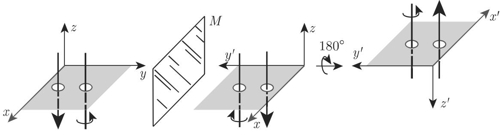

### 4.3 张量

#### 4.3.1 坐标系的变换

1. 线性变换

由线性变换

$$
\widetilde {\underline {{{{\boldsymbol {x}}}}}} = \boldsymbol {A} \underline {{{{\boldsymbol {x}}}}} \quad \text {或} \quad \left\{ \begin{array}{l l} & \widetilde {x} _ {1} = a _ {1 1} x _ {1} + a _ {1 2} x _ {2} + a _ {1 3} x _ {3}, \\ & \widetilde {x} _ {2} = a _ {2 1} x _ {1} + a _ {2 2} x _ {2} + a _ {2 3} x _ {3}, \\ & \widetilde {x} _ {3} = a _ {3 1} x _ {1} + a _ {3 2} x _ {2} + a _ {3 3} x _ {3} \end{array} \right.\tag{4.66}
$$

定义三维空间中的坐标变换，其中 $x _ { \mu }$ 和 $\widetilde { x } _ { \mu } ( \mu = 1 , 2 , 3 )$ 是同一个点在不同的坐标系K和 $\widetilde { K }$ 中的坐标．

2. 爱因斯坦求和约定

代替 (4.66) ，我们可以写出

$$
\widetilde {x} _ {\mu} = \sum_ {\nu = 1} ^ {3} a _ {\mu \nu} x _ {\nu} \quad (\mu = 1, 2, 3)\tag{4.67a}
$$

或者依照爱因斯坦求和约定，简写为

$$
\widetilde {x} _ {\mu} = a _ {\mu \nu} x _ {\nu},\tag{4.67b}
$$

即它是对千重复的指标 求和，并且对µ = 1,2,3 记下求和的结果．一般地，求和约定的意义是：如果在一个表达式中某个指标重复出现两次，那么这个表达式是对这个指标的所有值做加法．如果在一个方程的表达式中某个指标只出现一次，例如(4.67b) 中的 $\mu ,$ ，那么就意味着这个等式对这个指标的所有值都成立．

3. 坐标系的旋转

如果笛卡儿坐标系 $\widetilde { K }$ 是通过坐标系 的旋转给出的，那么对千 (4.66) 中的变换矩阵 A=D 成立，其中 $D = \left( d _ { \mu \nu } \right)$ 是正交旋转矩阵．正交旋转矩阵 有性质

$$
\pmb {D} ^ {- 1} = \pmb {D} ^ {\mathrm{T}}.\tag{4.68a}
$$

的元素 $d _ { \mu \nu }$ 是老轴与新轴间的夹角的方向余弦．由 的正交性，即由

$$
\boldsymbol {D} \boldsymbol {D} ^ {\mathrm{T}} = \boldsymbol {I}, \quad \text {以及} \quad \boldsymbol {D} ^ {\mathrm{T}} \boldsymbol {D} = \boldsymbol {I},\tag{4.68b}
$$

可推出

$$
\sum_ {i = 1} ^ {3} d _ {\mu i} d _ {\nu i} = \delta_ {\mu \nu}, \quad \sum_ {i = 1} ^ {3} d _ {k \mu} d _ {k \nu} = \delta_ {\mu \nu} \quad (\mu , \nu = 1, 2, 3).\tag{4.68c}
$$

因为 $\delta _ { \mu \nu }$ 是克罗内克符号（参见第 364 4.1.2, 10) ，所以等式 (4.68c) 表明矩阵的行向量和列向量是正交化的．

旋转矩阵 的元素 $d _ { \mu \nu }$ 可以由卡当 (Cardan) 角（参见第 287 3.5.3.5)欧拉角（参见第 289 3.5.3.6) 确定．关千平面旋转，参见第 256 3.5.2.2, 2. ；关千空间旋转，参见第 284 3.5.3.3.

#### 4.3.2 笛卡儿坐标下的张量

1. 定义

一个数学最或物理最 在笛卡儿坐标系 中可以用 $3 ^ { n }$ 个称作平移不变最的元素 $t _ { i j \cdots m }$ 来刻画．其中下标 $i , j , \cdots , m$ 的个数恰好等千 $n \left( n \geqslant 0 \right)$ ．指标是有序的，并且它们中每个都取值 1,2 ．如果在一个由 $\widetilde { K }$ 的坐标变换下，依据(4.66) ，对千元素 $t _ { i j \cdots m }$

$$
\widetilde {t} _ {\mu \nu \dots \gamma} = \sum_ {i = 1} ^ {3} \sum_ {j = 1} ^ {3} \dots \sum_ {m = 1} ^ {3} a _ {\mu i} a _ {\nu j} \dots a _ {\gamma m} t _ {i j \dots m}\tag{4.69}
$$

成立，那么 $_ { \mathbf { \delta T } }$ 称作秩 张量，并且将具有有序指标的元素 $t _ { i j \cdots m }$ （多数是数）称作张的分量

2. 张量

张量只有一个分量，即它是一个标量因为它的值在每个坐标系中都是相同的，所以我们称此为标量不变性或不变标量

3. 张量

张量有 个分量 $t _ { 1 } , t _ { 2 }$ 和 $t _ { 3 }$ ．变换律（4.69) 在此是

$$
\widetilde {t} _ {\mu} = \sum_ {i = 1} ^ {3} a _ {\mu i} t _ {i} \quad (\mu = 1, 2, 3).\tag{4.70}
$$

这是向量的变换律，也就是说，向量是秩 张量．

4. 张量

如果 $n = 2$ ，那么张量 $_ { \mathbf { \delta T } }$ 个分量 $t _ { i j }$ ，它们可以排列为矩阵

$$
\boldsymbol {T} = \boldsymbol {\mathbf {T}} = \left( \begin{array}{c c c} t _ {1 1} & t _ {1 2} & t _ {1 3} \\ t _ {2 1} & t _ {2 2} & t _ {2 3} \\ t _ {3 1} & t _ {3 2} & t _ {3 3} \end{array} \right).\tag{4.71a}
$$

变换律 (4.70) 现在是

$$
\widetilde {t} _ {\mu \nu} = \sum_ {i = 1} ^ {3} \sum_ {j = 1} ^ {3} a _ {\mu i} a _ {\nu j} t _ {i j} \quad (\mu , \nu = 1, 2, 3).\tag{4.71b}
$$

千是，秩 张量可以表示为矩阵

A: 刚体对千通过原点并且方向向量为 $\vec { a } = \underline { { a } } ^ { \mathrm { T } }$ 的直线 的惯性 $\theta _ { g }$ 可以表示为形式

$$
\boldsymbol {\Theta} _ {g} = \underline {{\boldsymbol {a}}} ^ {\mathrm{T}} \boldsymbol {\Theta} \underline {{\boldsymbol {a}}},\tag{4.72a}
$$

其中

$$
\pmb {\Theta} = (\Theta_ {i j}) = \left( \begin{array}{c c c} \Theta_ {x} & - \Theta_ {x y} & - \Theta_ {x z} \\ - \Theta_ {x y} & \Theta_ {y} & - \Theta_ {y z} \\ - \Theta_ {x z} & - \Theta_ {y z} & \Theta_ {z} \end{array} \right),\tag{4.72b}
$$

即所谓惯性张量其中 $\theta _ { x } , \theta _ { y }$ 和 $\varTheta _ { z }$ 是对千坐标轴的惯性矩， $\theta _ { x y } , \theta _ { x z }$ 和 $\theta _ { y z }$ 是对千坐标轴的偏矩

B: 弹性变形体的负荷条件可以用张力张量给出：

$$
\boldsymbol {\sigma} = \left( \begin{array}{c c c} \sigma_ {1 1} & \sigma_ {1 2} & \sigma_ {1 3} \\ \sigma_ {2 1} & \sigma_ {2 2} & \sigma_ {2 3} \\ \sigma_ {3 1} & \sigma_ {3 2} & \sigma_ {3 3} \end{array} \right).\tag{4.73}
$$

元素 $\sigma _ { i k } ( i , k = 1 , 2 , 3 )$ 用下列方法确定：在弹性体的一点 选取小平面曲面元素，其法向量指向直角笛卡儿坐标系的 $x _ { 1 }$ 轴的正向．在这个元素上每曲面单位受力（它与材料有关）就是坐标 $\sigma _ { 1 1 } , \sigma _ { 1 2 } , \sigma _ { 1 3 }$ 的向量．可以类似地解释其他分量．

5. 计算法则

(1) 初等代数运算 类似千向量和矩阵的相应运算，按分量定义数与张量相乘以及同秩张量的加法和减法．

(2) 张量积设给定秩 张量 和秩 张量 B, 它们分别有分量 $a _ { i j } .$ ..和$b _ { r s \cdots }$ 那么 $3 ^ { m + n }$ 九个标量

$$
c _ {i j \dots r s \dots} = a _ {i j} \dots b _ {r s \dots}\tag{4.74a}
$$

给出秩 $m + n$ 张量 的分量将此记作 $C = A B$ 并且称它为 的张量积．结合律和分配律成立：

$$
(A B) C = A (B C), \quad A (B + C) = A B + A C.\tag{4.74b}
$$

(3) 井积两个秩 张量 $A = \left( a _ { 1 } , a _ { 2 } , a _ { 3 } \right)$ 和 $B = ( b _ { 1 } , b _ { 2 } , b _ { 3 } )$ 给出元素为

$$
c _ {i j} = a _ {i} b _ {j} \quad (i, j = 1, 2, 3)\tag{4.75a}
$$

的秩2张量，即张量积产生矩阵

$$
\left( \begin{array}{c c c} a _ {1} b _ {1} & a _ {1} b _ {2} & a _ {1} b _ {3} \\ a _ {2} b _ {1} & a _ {2} b _ {2} & a _ {3} b _ {3} \\ a _ {3} b _ {1} & a _ {3} b _ {2} & a _ {3} b _ {3} \end{array} \right).\tag{4.75b}
$$

将此记作两个向量 和旦的并积．

(4) 缩井 在秩 $m \left( m \geqslant 2 \right)$ 张量中令两个指标相等，并且对它们求和，那么我们得到一个秩 $m - 2$ 张量，将此称作张量的缩并．

■ (4.75a) 中的秩 张量，其中 $c _ { i j } ~ = ~ a _ { i } b _ { j }$ ，是向量 $\underline { { \boldsymbol { A } } } \ : = \ : ( a _ { 1 } , a _ { 2 } , a _ { 3 } )$ ）和 $\underline { { \boldsymbol { B } } } \ : = \ :$ $\left( b _ { 1 } , b _ { 2 } , b _ { 3 } \right)$ 的张量积，可以通过指标 $i , j$ 的缩并给出一个标量

$$
a _ {i} b _ {i} = a _ {1} b _ {1} + a _ {2} b _ {2} + a _ {3} b _ {3},\tag{4.76}
$$

它是秩 张量．这给出向量 $\underline { { \boldsymbol { A } } }$ 和 $\underline { { \boldsymbol { B } } }$ 的标量积

#### 4.3.3 特殊性质的张量

4.3.3.1 张量

1. 计算法则

矩阵计算法则对千秩 张量同样成立．特别，每个张量 可以分解为对称和斜对称张量之和

$$
\pmb {T} = \frac {1}{2} (\pmb {T} + \pmb {T} ^ {\mathrm{T}}) + \frac {1}{2} (\pmb {T} - \pmb {T} ^ {\mathrm{T}}).\tag{4.77a}
$$

如果

$$
t _ {i j} = t _ {j i} \quad (\text {对所有} i, j),\tag{4.77b}
$$

那么张量 $\pmb { T } = ( t _ { i j } )$ ）称为对称的．在

$$
t _ {i j} = - t _ {j i} \quad (\text {对所有} i, j)\tag{4.77c}
$$

情形下，称它为斜对称或反对称的显然，斜对称张量的元素 $t _ { 1 1 } , t _ { 2 2 } , t _ { 3 3 }$ 等千零若认定某对元素，则可将对称性和反对称性的概念扩充到更高秩张量

．主轴变换

对千对称张量 T, 即当 $t _ { \mu \nu } = t _ { \nu \mu }$ 成立时，总存在正交变换 使得变换后张量有对角形：

$$
\widetilde {\boldsymbol {T}} = \left( \begin{array}{c c c} \widetilde {t} _ {1 1} & 0 & 0 \\ 0 & \widetilde {t} _ {2 2} & 0 \\ 0 & 0 & \widetilde {t} _ {3 3} \end{array} \right).\tag{4.78a}
$$

元素 $\widetilde { t } _ { 1 1 } , \widetilde { t } _ { 2 2 } , \widetilde { t } _ { 3 3 }$ 称作张量T的特征值.它们等于λ的3次代数方程

$$
\left| \begin{array}{c c c} t _ {1 1} - \lambda & t _ {1 2} & t _ {1 3} \\ t _ {2 1} & t _ {2 2} - \lambda & t _ {2 3} \\ t _ {3 1} & t _ {3 2} & t _ {3 3} - \lambda \end{array} \right| = 0\tag{4.78b}
$$

的根 $\lambda _ { 1 } , \lambda _ { 2 }$ 和 $\lambda _ { 3 }$ ．变换矩阵 的列向量 $\underline { { d } } _ { 1 } , \underline { { d } } _ { 2 } , \underline { { d } } _ { 3 }$ 化称作对应千这些特征值的特征向量，它们满足方程

$$
\boldsymbol {T} \underline {{\boldsymbol {d}}} _ {\nu} = \lambda_ {\nu} \underline {{\boldsymbol {d}}} _ {\nu} (\nu = 1, 2, 3).\tag{4.78c}
$$

它们的方向称为主轴方向化对角形的变换 称为主轴变换

4.3.3.2 不变张量

1. 定义

一个笛卡儿张量称为不变的，如果它的分量在所有笛卡儿坐标系中都相同物理量如标量和向量是特殊的张量，不依赖千确定它们的坐标系．因此在平移原点或坐标系 旋转时它们的值不应该改变．我们称此为平移不变性和旋转不变性，或一般地称此为变换不变性．

2. 广义克罗内克 函数和 张量

如果一个秩 张量的元素 $t _ { i j }$ 是克罗内克符号，即

$$
t _ {i j} = \delta_ {i j} = \left\{ \begin{array}{l l} 1, & i = j, \\ 0, & i \neq j, \end{array} \right.\tag{4.79a}
$$

那么巾坐标系旋转情形的变换律 (4.71b)，并考虑 (4.68c)，可得到

$$
\widetilde {t} _ {\mu \nu} = d _ {\mu i} d _ {\nu j} = \delta_ {\mu \nu},\tag{4.79b}
$$

即这些元素是旋转不变量将它们放在坐标系中，则它们与原点的选取无关，即它们是平移不变量，千是 $\delta _ { i j }$ 形成秩 张量，即所谓广义克罗内克 张量

3. 交错张量

如果 $\vec { e } _ { i } , \vec { e } _ { j }$ 和社 $\vec { e } _ { k }$ 直角坐标系的轴向单位向量，那么对千混合积（参见第 2493.5.1.6, 2.)

$$
\epsilon_ {i j k} = \vec {e} _ {i} (\vec {e} _ {j} \times \vec {e} _ {k}) = \left\{ \begin{array}{l l} 1, & i, j, k \text {循环(右手法则)}, \\ - 1, & i, j, k \text {反循环}, \\ 0, & \text {其他情形}. \end{array} \right.\tag{4.80a}
$$

在此共有 $3 ^ { 3 } = 2 7$ 个元素，它们是一个秩 张量的元素在坐标系旋转的情形下，由变换律 (4.69) 可知

$$
\widetilde {t} _ {\mu \nu \rho} = d _ {\mu i} d _ {\nu j} d _ {\rho k} \epsilon_ {i j k} = \left| \begin{array}{c c c} d _ {\mu 1} & d _ {\nu 1} & d _ {\rho 1} \\ d _ {\mu 2} & d _ {\nu 2} & d _ {\rho 2} \\ d _ {\mu 3} & d _ {\nu 3} & d _ {\rho 3} \end{array} \right| = \epsilon_ {\mu \nu \rho},\tag{4.80b}
$$

即这些元素是旋转不变量将其放在坐标系中，则其与原点的选取无关，即它们是平移不变量，千是数 $\epsilon _ { i j k }$ 形成秩 张量，即所谓交错张量．

4. 张量不变量

在此不要将张量不变量与不变张量混淆．张量不变量是张量的分量的函数，当坐标系旋转时它们的形式和值不变

A: 如果（例如）张量 $\pmb { T } = \left( t _ { i j } \right)$ ）通过旋转被变换为 $\widetilde { \pmb { T } } = ( \widetilde { t } _ { i j } )$ ），那么它的迹不变：

$$
\operatorname{Tr} (\pmb {T}) = t _ {1 1} + t _ {2 2} + t _ {3 3} = \widetilde {t} _ {1 1} + \widetilde {t} _ {2 2} + \widetilde {t} _ {3 3}.\tag{4.81}
$$

张量 $_ { \mathbf { \delta T } }$ 的迹等千特征值的和（参见第 362 4.1.2, 4.).

： 对千张量 $\pmb { T } = ( t _ { i j } )$ ）的行列式有

$$
\left| \begin{array}{c c c} t _ {1 1} & t _ {1 2} & t _ {1 3} \\ t _ {2 1} & t _ {2 2} & t _ {2 3} \\ t _ {3 1} & t _ {3 2} & t _ {3 3} \end{array} \right| = \left| \begin{array}{c c c} \widetilde {t} _ {1 1} & \widetilde {t} _ {1 2} & \widetilde {t} _ {1 3} \\ \widetilde {t} _ {2 1} & \widetilde {t} _ {2 2} & \widetilde {t} _ {2 3} \\ \widetilde {t} _ {3 1} & \widetilde {t} _ {3 2} & \widetilde {t} _ {3 3} \end{array} \right|.\tag{4.82}
$$

张量的行列式等千特征值的积．

#### 4.3.4 曲线坐标系中的张量

4.3.4.1 共变和反变基向量

1. 共变基

借助可变位置向量，我们引进一般的曲线坐标 $u , v , w$

$$
\vec {r} = \vec {r} (u, v, w) = x (u, v, w) \vec {e} _ {x} + y (u, v, w) \vec {e} _ {y} + z (u, v, w) \vec {e} _ {z}.\tag{4.83a}
$$

对应千这个系的坐标曲面可以通过在 ${ \vec { r } } ( u , v , w )$ 中每次固定一个独立变量得到．在所考虑的空间区域的每个点都有三个坐标曲面通过，并且它们中任何两个互相交千坐标曲线，当然这些曲线也通过所考虑的点．三个向量

$$
\frac {\partial \vec {r}}{\partial u}, \quad \frac {\partial \vec {r}}{\partial v}, \quad \frac {\partial \vec {r}}{\partial w}\tag{4.83b}
$$

指向所考虑的点的坐标曲线的方向它们形成曲线坐标系的共变基

2. 反变基

三个向量

$$
\frac {1}{D} \left(\frac {\partial \vec {r}}{\partial v} \times \frac {\partial \vec {r}}{\partial w}\right), \quad \frac {1}{D} \left(\frac {\partial \vec {r}}{\partial w} \times \frac {\partial \vec {r}}{\partial u}\right), \quad \frac {1}{D} \left(\frac {\partial \vec {r}}{\partial u} \times \frac {\partial \vec {r}}{\partial v}\right)\tag{4.84a}
$$

有函数行列式（雅可比行列式，参见第 159 2.18.2.6, 3.)

$$
D = \frac {D (x , y , z)}{D (u , v , w)} = \left| \begin{array}{c c c} x _ {u} & x _ {v} & x _ {w} \\ y _ {u} & y _ {v} & y _ {w} \\ z _ {u} & z _ {v} & z _ {w} \end{array} \right|,\tag{4.84b}
$$

它们总是垂直千所考虑的曲面单元的坐标曲面，并且形成曲线坐标系的反变基．

在正交曲线坐标情形，即若

$$
\begin{array}{r l} & {\frac {D (x , y , z)}{D (u , v , w)} = \left| \begin{array}{l l l} t _ {1 1} & t _ {1 2} & t _ {1 3} \\ t _ {2 1} & t _ {2 2} & t _ {2 3} \\ t _ {3 1} & t _ {3 2} & t _ {3 3} \end{array} \right| = \left| \begin{array}{l l l} \widetilde {t} _ {1 1} & \widetilde {t} _ {1 2} & \widetilde {t} _ {1 3} \\ \widetilde {t} _ {2 1} & \widetilde {t} _ {2 2} & \widetilde {t} _ {2 3} \\ \widetilde {t} _ {3 1} & \widetilde {t} _ {3 2} & \widetilde {t} _ {3 3} \end{array} \right|,} \\ & {\frac {\partial \vec {r}}{\partial u} \cdot \frac {\partial \vec {r}}{\partial v} = 0, \quad \frac {\partial \vec {r}}{\partial u} \cdot \frac {\partial \vec {r}}{\partial w} = 0, \quad \frac {\partial \vec {r}}{\partial v} \cdot \frac {\partial \vec {r}}{\partial w} = 0,} \end{array}\tag{4.85}
$$

则共变基和反变基的方向是一致的．

4.3.4.2 张量的共变和反变坐标

为了应用爱因斯坦求和约定，我们对共变基和反变基引进下列记号：

$$
\frac {\partial \vec {r}}{\partial u} = \vec {g} _ {1}, \quad \frac {\partial \vec {r}}{\partial v} = \vec {g} _ {2}, \quad \frac {\partial \vec {r}}{\partial w} = \vec {g} _ {3}, \quad \frac {1}{D} \left(\frac {\partial \vec {r}}{\partial v} \times \frac {\partial \vec {r}}{\partial w}\right) = \vec {g} ^ {1},
$$

$$
\frac {1}{D} \left(\frac {\partial \vec {r}}{\partial w} \times \frac {\partial \vec {r}}{\partial u}\right) = \vec {g} ^ {2}, \quad \frac {1}{D} \left(\frac {\partial \vec {r}}{\partial u} \times \frac {\partial \vec {r}}{\partial v}\right) = \vec {g} ^ {3}.\tag{4.86}
$$

那么下列表达式对吓成立：

$$
\vec {v} = V ^ {1} \vec {g} _ {1} + V ^ {2} \vec {g} _ {2} + V ^ {3} \vec {g} _ {3} = V ^ {k} \vec {g} _ {k} \quad \text {或} \quad \vec {v} = V _ {1} \vec {g} _ {1} + V _ {2} \vec {g} _ {2} + V _ {3} \vec {g} _ {3}.\tag{4.87}
$$

分量 $V ^ { k }$ 向量行 $\vec { v }$ 反变坐标，分量忱 $V _ { k }$ 其共变坐标．对千这些坐标，等式

$$
V ^ {k} = g ^ {k l} V _ {l}, \quad \text {以及} \quad V _ {k} = g _ {k l} V ^ {l}\tag{4.88a}
$$

成立，其中分别有

$$
g _ {k l} = g _ {l k} = \vec {g} _ {k} \cdot \vec {g} _ {l}, \quad \text {以及} \quad g ^ {k l} = g ^ {l k} = \vec {g} ^ {k} \cdot \vec {g} ^ {l}.\tag{4.88b}
$$

此外，应用克罗内克符号，等式

$$
\vec {g} _ {k} \cdot \vec {g} ^ {l} = \delta_ {k l}\tag{4.89a}
$$

成立，因而

$$
g ^ {k l} g _ {l m} = \delta_ {k m}.\tag{4.89b}
$$

依照 (4.88b) ，由 $V ^ { k }$ 到 $V _ { k }$ 或巾忱 $V _ { k }$ 尸 $V ^ { k }$ 换，是由外加调整通过提升或下降指标刻画的．

在笛卡儿坐标系中共变坐标和反变坐标相等．

4.3.4.3 张量的共变、反变和混合坐标

1. 坐标变换

在基向量为 $\vec { e } _ { 1 } , \vec { e } _ { 2 }$ 和 $\vec { e } _ { 3 }$ 的笛卡儿坐标系中，秩 张量 可表示为矩阵

$$
\boldsymbol {T} = \left( \begin{array}{c c c} t _ {1 1} & t _ {1 2} & t _ {1 3} \\ t _ {2 1} & t _ {2 2} & t _ {2 3} \\ t _ {3 1} & t _ {3 2} & t _ {3 3} \end{array} \right).\tag{4.90}
$$

为了引进曲线坐标 $u _ { 1 } , u _ { 2 } , u _ { 3 }$ , 我们应用下列向量

$$
\vec {r} = x _ {1} (u _ {1}, u _ {2}, u _ {3}) \vec {e} _ {1} + x _ {2} (u _ {1}, u _ {2}, u _ {3}) \vec {e} _ {2} + x _ {3} (u _ {1}, u _ {2}, u _ {3}) \vec {e} _ {3}.\tag{4.91}
$$

新基可由向量 $\vec { g } _ { 1 } , \vec { g } _ { 2 } , \vec { g } _ { 3 }$ 表出．现在有

$$
\vec {g} _ {l} = \frac {\partial \vec {r}}{\partial u _ {l}} = \frac {\partial x _ {1}}{\partial u _ {l}} \vec {e} _ {1} + \frac {\partial x _ {2}}{\partial u _ {l}} \vec {e} _ {2} + \frac {\partial x _ {3}}{\partial u _ {l}} \vec {e} _ {3} = \frac {\partial x _ {k}}{\partial u _ {l}} \vec {e} _ {k}.\tag{4.92}
$$

作代换 $\vec { e } _ { 1 } = \vec { g } ^ { 1 }$ ，可知 $\vec { g } _ { 1 }$ 和 $\vec { g } ^ { 1 }$ 分别是共变基向量和反变基向量．

2. 线性向量函数

在一个由等式

$$
\vec {w} = T \vec {v}\tag{4.93a}
$$

给出 (4.90) 中的张量 的固定坐标系中，下列向量表达式

$$
\vec {v} = V _ {k} \vec {g} ^ {k} = V ^ {k} \vec {g} _ {k}, \quad \vec {w} = W _ {k} \vec {g} ^ {k} = W ^ {k} \vec {g} _ {k}\tag{4.93b}
$$

定义向量 $\vec { v }$ 和伍间的线性关系．所以 (4.93a) 被考虑为线性向量函数

3. 混合坐标

改变坐标系，等式 (4.93a) 将有形式

$$
\overrightarrow {\widetilde {w}} = \widetilde {T} \overrightarrow {\widetilde {v}}.\tag{4.94a}
$$

$_ { \mathbf { \delta T } }$ 和 $\tilde { \boldsymbol { T } }$ 的分量间的关系如下：

$$
\widetilde {t} _ {k l} = \frac {\partial u _ {k}}{\partial x _ {m}} \frac {\partial x _ {n}}{\partial u _ {l}} l _ {m n}.\tag{4.94b}
$$

引进记号

$$
\widetilde {t} _ {k l} = T _ {\cdot l} ^ {k}.\tag{4.94c}
$$

因为 是反变指标， 是共变指标，所以我们将它称为张量的混合坐标．对千向量 $\vec { v }$ 和 $\vec { u }$ 的分量有

$$
W ^ {k} = T _ {\cdot l} ^ {k} V ^ {l}.\tag{4.94d}
$$

如果用反变基 $\vec { g } ^ { k }$ 代替共变基 $\vec { g } _ { k }$ 那么类似千 (4.94b) (4.94c) ，我们得到

$$
T _ {k} ^ {\cdot l} = \frac {\partial x _ {m}}{\partial u _ {k}} \frac {\partial u _ {l}}{\partial x _ {n}} t _ {m n},\tag{4.95a}
$$

并且 (4.94d) 变换为

$$
W _ {k} = T _ {k} ^ {\cdot l} V _ {l}.\tag{4.95b}
$$

对千混合坐标 $T _ { k } ^ { \cdot l }$ 和 $T _ { \cdot l } ^ { k }$ 今，则有公式

$$
T _ {\cdot l} ^ {k} = g ^ {k m} g _ {l n} T _ {m} ^ {\cdot n}.\tag{4.95c}
$$

4. 纯共变和纯反变坐标

在关系式 (4.95b) 中用关系式 $V _ { l } = g _ { l m } V ^ { m }$ 代替 $V _ { l } ,$ ，那么我们得到

$$
W _ {k} = T _ {k} ^ {\cdot l} g _ {l m} V ^ {m} = T _ {k m} V ^ {m},\tag{4.96a}
$$

其中还认定

$$
T _ {k} ^ {\cdot l} g _ {l m} = T _ {k m}.\tag{4.96b}
$$

因为指标都是共变的，所以 $T _ { k m }$ 称为张量 $_ { \mathbf { \delta T } }$ 的共变坐标．类似地，我们得到反变坐标

$$
T _ {l} ^ {k m} = g ^ {m l} T _ {\cdot l} ^ {k}.\tag{4.97}
$$

明显公式是

$$
T _ {k l} = \frac {\partial x _ {m}}{\partial u _ {k}} \frac {\partial x _ {n}}{\partial u _ {l}} t _ {m n},\tag{4.98a}
$$

$$
T ^ {k l} = \frac {\partial u _ {k}}{\partial x _ {m}} \frac {\partial u _ {l}}{\partial x _ {n}} t _ {m n},\tag{4.98b}
$$

4.3.4.4 计算法则

除在第 378 4.3.2, 5. 中所给出的法则外，下列计算法则成立：

(1) 加法和减法 同秩张量，若它们对应指标都是共变的或都是反变的，则可按元素相加减并且结果得到同秩张量

(2) 乘法 的张量的坐标与秩 的张量的坐标相乘，得到秩 $m + n$ 的张量．

(3) 收缩 如果令一个秩 $n ( n \geqslant 2 )$ 张量的共变坐标和反变坐标的指标相等，那么可以对这个指标应用爱因斯坦求和约定，并且得到一个秩 张量．这种运算称作收缩

(4) 外加调整 两个张量的外加调整是指下列运算：两者相乘，并且进行收缩使得实施收缩的指标属千不同的因子．

(5) 对称性 一个张量称作关千固定的两个共变指标或两个反变指标对称，如果交换它们时张量不变．

(6) 斜对称性 一个张量称作关千固定的两个共变指标或两个反变指标斜对称，如果交换它们时张量被乘以－1.

• 交错张量（参见第 380 4.3.3.2, 3.）关千任意两个共变指标或反变指标反对称

#### 4.3.5 伪张量

张量的反射在物理学中起着特殊作用．虽然极向量和轴向量在数学上可以用同样的方法处理，但由千它们关千反射的不同性状（参见第 242 3.5.1.1, 2.)，所以要加以区分极向量和轴向量相互间的差别在千它们的确定，因为轴向量除了长度和方向外，可以由定向来表示．轴向量也称为伪张量．因为向量可以看作张量，所以引进伪张量的一般概念

4.3.5.1 关于原点的对称性

1. 张量在空间反演下的性状

(1) 空间反演的概念 空间中点的位置坐标关千原点的反射称作空间反演或坐标反演．在三维笛卡儿坐标系空间反演意味着坐标变号：

$$
(x, y, z) \rightarrow (- x, - y, - z).\tag{4.99}
$$

由此右手坐标系变成左手坐标系．类似的法则对千其他坐标系也成立．在球坐标系中，有

$$
(r, \theta , \varphi) \rightarrow (- r, \pi - \theta , \varphi + \pi).\tag{4.100}
$$

在这种类型的反射中向量的长度和向量的夹角不变．可以通过线性变换进行转换．

(2) 变换矩阵 依据 (4.66)，三维空间线性变换的变换矩阵 $A = \left( a _ { \mu \nu } \right)$ 在空间反演情形有下列性质

$$
a _ {\mu \nu} = - \delta_ {\mu \nu}, \quad \det A = - 1.\tag{4.101a}
$$

对千 (4.69) 中秩 张量的分量，有

$$
\widetilde {t} _ {\mu \nu \dots \gamma} = (- 1) ^ {n} t _ {\mu \nu \dots \gamma}.\tag{4.101b}
$$

这就是说在关千原点对称的情形下，秩 张量仍然是标量，不变秩 张量仍然是向量，并且变号；秩 张量保持不变，等等

2. 几何表示

三维笛卡儿坐标系中空间反演可分两步实现（图 4.3):

  
4.3

(1) 通过关千坐标平面（例如 $x , z$ 平面）的反射，坐标系 $x , y , z$ 变为坐标系$x , - y , z .$ 右手系变成左手系（参见第 281 3.5.3.1, 2.).

(2) 通过坐标系 $x , y , z$ 轴旋转 $1 8 0 ^ { \circ }$ ，我们得到完全的关千原点对称的坐标系 $x , y , z .$ 因为它是实施步骤 (1) 的结果，所以这个坐标系保持为左手系．

结论 空间反演将极向量的定向改变 $1 8 0 ^ { \circ }$ ' 同时保持轴向量的定向

4.3.5.2 伪张量概念引论

(1) 空间反演下的向量积 在空间反演下，两个极向量 $\underline { { \pmb a } }$ 被变为— $- \underline { { a } }$ 和$- { \underline { { b } } } ,$ 即它们的分量满足秩 张量的变换公式 (4.101b) ．但是如果考虑（例如）两个轴向量的向量积 $\underline { { \boldsymbol { c } } } = \underline { { \boldsymbol { a } } } \times \underline { { \boldsymbol { b } } } .$ ，那么在关千原点的反射下，我们得到 $\underline { { \boldsymbol { c } } } = \underline { { \boldsymbol { c } } } .$ ．这违反秩张量的变换公式 (4.101a)．因此轴向量 $\underline { { \boldsymbol { c } } }$ 称作伪向量，或一般地，称作伪张量．

• 向量积 $\vec { r } \times \vec { v } , \vec { r } \times \vec { F } , \nabla \times \vec { v } = \mathrm { r o t } \vec { v }$ 都是轴向量的例子，它们在反射下有“违规”性状，其中 $\vec { r }$ 是位置向量， $\vec { v }$ 是速度向量， $\vec { F }$ 是力向量， 是那布拉算子．

(2) 空间反演下的标量积 如果对一个极向量和一个轴向量的标量积应用空间反演，那么又出现违反秩 张量的变换公式 (4.101b) 的情形．因为标量积的结果是一个标量，并且一个标量在每个坐标系中应当是相同的，所以在此它是一个特殊的标量，称作伪标量．它具有在空间反演下改变符号的性质．伪标量没有标量的旋转不变性．

• 极向量冈位置向量）和 $\vec { v }$ （速度向量）与轴向量已（角速度向量）的标量积是标量 $\vec { r } \cdot \vec { \omega }$ 和 $\vec { v } \cdot \vec { \omega } ,$ 它们在反射下都有“违规“性状，所以是伪标量．

(3) 空间反演下的混合积 依据 (2) ，极向量 $\underline { { \boldsymbol { a } } } , \underline { { \boldsymbol { b } } }$ !.和 的混合积 $( { \underline { { \mathbf { a } } } } \times { \underline { { \mathbf { b } } } } ) \cdot { \underline { { \mathbf { c } } } }$ （参见第 249 3.5.1.6, 2. ）是伪标量，因为因子 $( { \underline { { \mathbf { a } } } } \times { \underline { { \mathbf { b } } } } )$ !\_)是一个轴向量．混合积在空间反演下变号．

(4) 伪向量和秩 斜对称张量依据 (4.74b)，轴向量 $\underline { { \mathbf { a } } } ~ = ~ ( a _ { 1 } , a _ { 2 } , a _ { 3 } ) ^ { \mathrm { T } }$ 和$\underline { { \boldsymbol { b } } } = ( b _ { 1 } , b _ { 2 } , b _ { 3 } ) ^ { \mathrm { T } }$ 的张量积生产一个秩 张量，其分量 $t _ { i j } = a _ { i } b _ { j } \ : ( i , j = 1 , 2 , 3 )$ ．因为每个秩 张量可以分解为秩 对称张量和斜对称张量之和，所以依据 (4.81)

$$
t _ {i j} = \frac {1}{2} (a _ {i} b _ {j} + a _ {j} b _ {i}) + \frac {1}{2} (a _ {i} b _ {j} - a _ {j} b _ {i}) \quad (i, j = 1, 2, 3).\tag{4.102}
$$

(4.102) 中斜对称部分恰好是向量积 $( { \underline { { \pmb a } } } \times \underline { { \pmb b } } )$ 的分量与 $\frac { 1 } { 2 }$ 的乘积，所以分量为 $c _ { 1 } , c _ { 2 } , c _ { 3 }$ 的轴向量 $\underline { { \boldsymbol { c } } } = ( \underline { { \boldsymbol { a } } } \times \underline { { \boldsymbol { b } } } )$ 可以看作斜对称秩 张量

$$
\boldsymbol {C} = \underline {{\boldsymbol {c}}} = \left( \begin{array}{c c c} 0 & c _ {1 2} & c _ {1 3} \\ - c _ {1 2} & 0 & c _ {2 3} \\ - c _ {1 3} & - c _ {2 3} & 0 \end{array} \right),\tag{4.103a}
$$

其中

$$
\begin{array}{l} c _ {2 3} = a _ {2} b _ {3} - a _ {3} b _ {2} = c _ {1}, \\ c _ {3 1} = a _ {3} b _ {1} - a _ {1} b _ {3} = c _ {2}, \\ c _ {1 2} = a _ {1} b _ {2} - a _ {2} b _ {1} = c _ {3}, \end{array}\tag{4.103b}
$$

它的分量满足秩 张量的变换公式 (4.101b)．因此，每个轴向量（伪向量或伪秩张量） $\underline { { \boldsymbol { c } } } = ( c _ { 1 } , c _ { 2 } , c _ { 3 } ) ^ { \mathrm { T } }$ 可以看作秩 斜对称张量 C:

$$
\boldsymbol {C} = \underline {{\boldsymbol {c}}} = \left( \begin{array}{c c c} 0 & c _ {3} & - c _ {2} \\ - c _ {3} & 0 & c _ {1} \\ c _ {2} & - c _ {1} & 0 \end{array} \right).\tag{4.104}
$$

(5) 伪张量 伪标量和伪向量概念的推广是秩 伪张量．在旋转变换下它有与秩 张量相同的性质（旋转矩阵 的行列式 $\operatorname* { d e t } D = 1 )$ ，但它在关千原点反射后有一个因子(—1)．高秩伪张量的例子可在文献，例如，［4.2] 中找到．
