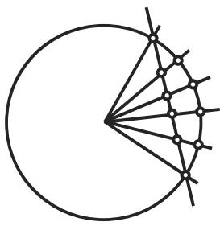
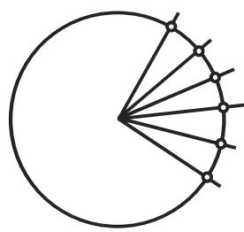

#### 4.4.3 四元数的应用

4.4.3.1 计算机绘图学中的 3D 旋转

为了刻画运动流，需要利用旋转的插值．因为 3D 旋转可以用单位四元数表示，所以在计算机绘图学中发展了对千旋转的插值算法．最直接的想法是从与欧氏空间的线性插值类似的定义出发．基本算法是 Lerp, Slerp $\operatorname { S q u a d }$

1. $\mathrm { L e r p }$ （线性 (1) 插值 (erp))

设 $p , q \in \mathbb { H } _ { 1 }$ 及 $t \in [ 0 , 1 ]$ ，那么

$$
\operatorname{Lerp} (p, q, t) = p (1 - t) + q t.\tag{4.143}
$$

·这是 $\mathbb { R } ^ { 4 }$ 中的一条连接 $p \in \mathbb { H } _ { 1 } \sim \mathrm { S } ^ { 3 } \subset \mathbb { R } ^ { 4 }$ 和 $q \in \mathbb { H } _ { 1 } \sim \mathrm { S } ^ { 3 } \subset \mathbb { R } ^ { 4 }$ 的线段．

• 这条线段是 $\mathbb { R } ^ { 4 }$ 中单位球的内部，并且不表示单位球 $\mathbb { H } _ { 1 } \sim \mathrm { S } ^ { 3 }$ 上的任何连通曲线

• 因此旋转由所求得的四元数的规范化确定．

这个简单的算法几乎是完美的仅有的问题是在通过给定点和规范化了的所求得的四元数之间的割线上求得插值点后，所得到的单位四元数不是等距四元数．这个问题可以用下列算法解决

2. Slerp （球面 (s) 线性 (1) 插值 (erp))

设 $p , q \in \mathbb { H } _ { 1 } , t \in [ 0 , 1 ] , \varphi ( 0 < \varphi < \pi )$ ）是一个介千 $p , q$ 之间的角．那么

$$
\operatorname{Slerp} (p, q, t) = p (\overline {{p}} q) ^ {t} = p ^ {1 - t} q ^ {t} = p \left[ \frac {\sin ((1 - t) \varphi)}{\sin \varphi} \right] + q \left[ \frac {\sin (t \varphi)}{\sin \varphi} \right].\tag{4.144}
$$

• 沿着单位球 $\mathrm { S } ^ { 3 } \subset \mathbb { R } ^ { 4 }$ 上的大圆插值，连接 $p$ 和 $q .$

• 选取最短连接， $- \mathrm { S c } ( p , q ) = \langle p , q \rangle > 0$ 必须成立（此处 $\langle \mathrm { ~ \bf ~ \cdot ~ } , \mathrm { ~ \bf ~ \cdot ~ } \rangle$ 表示 $p$ 和$q \in \mathbb { R } ^ { 4 }$ 的点积）．

在图 4.5 中比较了依据 Lerp （见图 4.5(a) ）和 Slerp （见图 4.5(b) ）的插值．

  
(a)

  
(b)  
4.5

特殊情形 $p = 1$ 设 $p = 1 = ( 1 , 0 , 0 , 0 ) ^ { \mathrm { T } }$ 及 $q = \cos \varphi + \underline { { { n } } } _ { q } \sin \varphi$ ，那么

$$
\operatorname{Slerp} (p, q, t) = \cos (t \varphi) + \underline {{\boldsymbol {n}}} _ {\boldsymbol {q}} \sin (t \varphi).\tag{4.145}
$$

特殊情形等距网格令心 $\psi = { \frac { \varphi } { n } }$ 则

$$
q _ {k} := \operatorname{Slerp} \left(p, q, \frac {k}{n}\right) = \frac {1}{\sin \varphi} \bigl (\sin (\varphi - k \psi) p + \sin (k \psi) q \bigr), \quad k = 0, 1, \dots , n.\tag{4.146}
$$

Slerp插值的解释 为证明 (4.144) 中两个表达式的等价性，首先算出 $Q \ =$ $p ^ { - 1 } q = \frac { \overline { { p } } } { | p | ^ { 2 } } q = \overline { { p } } q$ 因为 $p , q \in \mathbb { H } _ { 1 }$ , 所以标量部分是

$$
Q _ {0} = \operatorname{Sc} Q = \operatorname{Sc} (\bar {p} q) = \langle p, q \rangle = \cos \varphi .\tag{4.147}
$$

因为 $p = p \cdot 1$ ，以及 $q = p p ^ { - 1 } q = p Q$ ，所以 $Q$ 间的插值是乘以 $p$ 以保持 $p$ 和$q$ 间的插值

$$
\begin{array}{r l} & Q (t) = \frac {\sin ((1 - t) \varphi)}{\sin \varphi} + Q \frac {\sin (t \varphi)}{\sin \varphi} \\ & \qquad = \frac {\sin ((1 - t) \varphi)}{\sin \varphi} + \cos \varphi \frac {\sin (t \varphi)}{\sin \varphi} + \vec {n} _ {\vec {Q}} \frac {\sin (t \varphi)}{\sin \varphi} \\ & \qquad = \frac {\sin \varphi \cos (t \varphi) - \sin (t \varphi) \cos \varphi + \sin (t \varphi) \cos \varphi}{\sin \varphi} + \vec {n} _ {\vec {Q}} \frac {\sin (t \varphi)}{\sin \varphi} \\ & \qquad = \cos (t \varphi) + \vec {n} _ {\vec {Q}} \sin (t \varphi) = e ^ {t \vec {n} _ {\vec {Q}} \varphi} = e ^ {t \log Q} = Q ^ {t}. \end{array}\tag{4.148}
$$

由此得到

$$
q (t) = p Q (t) = p \frac {\sin ((1 - t) \varphi)}{\sin \varphi} + q \frac {\sin (t \varphi)}{\sin \varphi} = p Q ^ {t} = p (p ^ {- 1} q) ^ {t} = p ^ {1 - t} q ^ {t}.\tag{4.149}
$$

3. Squad （球面 (s) 和四角形 (quad) 插值）

对千 $q _ { i } , q _ { i + 1 } \in$ 玑及 $t \in [ 0 , 1 ]$ ，法则是

$$
\begin{array}{c} \operatorname{Squad} (q _ {i}, q _ {i + 1}, s _ {i}, s _ {i + 1}, t) \\ = \operatorname{Slerp} \bigl (\operatorname{Slerp} (q _ {i}, q _ {i + 1}, t), \operatorname{Slerp} (s _ {i}, s _ {i + 1}, t), 2 t (1 - t) \bigr), \end{array}\tag{4.150}
$$

其中

$$
s _ {i} = q _ {i} \exp \left(- \frac {\log (q _ {i} ^ {- 1} q _ {i + 1}) + \log (q _ {i} ^ {- 1} q _ {i - 1})}{4}\right).
$$

• 所得曲线类似千贝济埃 (Bezier) 曲线，代替线性插值，它保持了球面插值．

• 算法产生了对千四元数序列 $q _ { 0 } , q _ { 1 } , \cdots , q _ { N }$ 的插值曲线．

• 在第一个和最后一个区间表达式未被定义，因为 $q _ { - 1 }$ 对千计算 $s _ { 0 }$ , 以及 $q _ { N + 1 }$ 对千计算 $s N$ 是必须的．一个可能的方法是选取 $s _ { 0 } = q _ { 0 }$ 。以及 $s _ { N } = q _ { N }$ （或者定义 $q _ { - 1 }$ 和 $q _ { N + 1 } )$ ．还有其他的基千四元数的算法： nlerp, log-lerp, islerp, 四元数德卡斯特里奥 (de Casteeljau) 样条．

4.4.3.2 旋转矩阵的插值

可以借助旋转矩阵完全类似地刻画 Slerp 算法． $3 \times 3$ 旋转矩阵 （即群 $\mathrm { S O ( 3 ) }$ 的元素）的对数是需要的，并且用群论语言它被定义为满足 $\mathrm { e } ^ { r } = R$ 的斜对称矩阵（即李群 $\mathrm { s o } ( 3 )$ 的元素）．千是 ${ \mathrm { S l e r p } }$ 算法可以用千旋转矩阵 $\scriptstyle { \mathbf { } } _ { R _ { 0 } }$ 和 $\pmb { R } _ { 1 }$ 间的插值，这可以刻画为

$$
\boldsymbol {R} (t) = \boldsymbol {R} _ {0} (\boldsymbol {R} _ {0} ^ {- 1} \boldsymbol {R} _ {1}) ^ {t} = \boldsymbol {R} _ {0} \exp \left(t \log (\boldsymbol {R} _ {0} ^ {- 1} \boldsymbol {R} _ {1})\right).\tag{4.151}
$$

一般地说，应用四元数基本算法并且依据单位四元数转换为旋转矩阵的计算，由四元数 $q ( t )$ 确定 $R ( t )$ 要简单些．

4.4.3.3 球极平面投影

如果将 $1 \in \mathbb { H } _ { 1 } \sim S ^ { 3 }$ 取作三维球 $S ^ { 3 }$ 的北极，那么单位四元数或三维球的元素可以用球极平面投影

$$
\mathbb {H} _ {1} \ni q \mapsto (1 + q) (1 - q) ^ {- 1} \in \mathbb {H} _ {0} \sim \mathbb {R} ^ {3}
$$

分别映为纯四元数或 $\mathbb { R } ^ { 3 }$ 的元素．对应的逆映射是

$$
\mathbb {R} ^ {3} \sim \mathbb {H} _ {0} \ni p \mapsto (p - 1) (p + 1) ^ {- 1} \in \mathbb {H} _ {1} \sim S ^ {3}.\tag{4.152}
$$

4.4.3.4 卫星导航

环绕地球运行的人造卫星的航向是已经确定的恒星看作在无穷远处，千是它们相对千地球和相对千卫星的方向是相同的（图 4.6)．任何测量上的差别都可从不同的坐标系推导出来，因而也可由不同坐标系的相对旋转推出

  
4.6

设 $\vec { a } _ { i }$ 是在地球上的固定坐标系中指向第 颗恒星方向的单位向量， $\vec { b } _ { i }$ 是在卫星上的固定坐标系中指向第 颗恒星方向的单位向量．两个坐标系的相对旋转可以用单位四元数 $h \in \mathbb { H } _ { 1 }$ 刻画

$$
\vec {b} _ {i} = h \vec {a} _ {i} \overline {{h}}.\tag{4.153}
$$

如果考虑另一个恒星，并且数据被测量误差覆盖，那么解可以用最小二乘法即作为(4.154) 的极小值确定，其中 是单位四元数， $\underline { { \mathbf { a } } } _ { i } = \vec { a } _ { i }$ 和 $\underline { { \boldsymbol { b } } } _ { i } = \vec { b } _ { i }$ 是单位向量：

$$
\begin{array}{l} Q ^ {2} = \sum_ {i = 1} ^ {n} | \vec {b} _ {i} - h \vec {a} _ {i} \overline {{h}} | ^ {2} = \sum_ {i = 1} ^ {n} (\vec {b} _ {i} - h \vec {a} _ {i} \overline {{h}}) \cdot (\vec {b} _ {i} - h \vec {a} _ {i} \overline {{h}}) \\ = \sum_ {i = 1} ^ {n} (\underline {{\boldsymbol {b}}} _ {i} - h \underline {{\boldsymbol {a}}} _ {i} \overline {{h}}) \overline {{(\underline {{\boldsymbol {b}}} _ {i} - h \underline {{\boldsymbol {a}}} _ {i} \overline {{h}})}} = \sum_ {i = 1} ^ {n} (2 - \underline {{\boldsymbol {b}}} _ {i} h \overline {{\boldsymbol {a}}} _ {i} \overline {{h}} - h \underline {{\boldsymbol {a}}} _ {i} \overline {{h}}   \overline {{\underline {{\boldsymbol {b}}}}} _ {i}). \end{array}\tag{4.154}
$$

因为单位四元数群 $\mathbb { H } _ { 1 }$ 形成一个李群，所以 $Q ^ { 2 }$ 的临界点可以借助导数

$$
\partial_ {v} h = \lim _ {\vartheta \rightarrow 0} \frac {\mathrm{e} ^ {\vartheta v} h - h}{\vartheta} = v h \quad (v, h \text {是四元数}, \vartheta \text {是实数})\tag{4.155}
$$

从

$$
\partial_ {v} Q ^ {2} = - \sum_ {i = 1} ^ {n} (\underline {{\boldsymbol {b}}} _ {i} \underline {{\boldsymbol {v}}} h \overline {{\boldsymbol {a}}} _ {i} \overline {{h}} + \underline {{\boldsymbol {b}}} _ {i} h \overline {{\boldsymbol {a}}} _ {i} \overline {{(\boldsymbol {v} h)}} + \underline {{\boldsymbol {v}}} h \underline {{\boldsymbol {a}}} _ {i} \overline {{h}} \overline {{\underline {{\boldsymbol {b}}}}} _ {i} + h \underline {{\boldsymbol {a}}} _ {i} \overline {{(\boldsymbol {v} h)}} \overline {{\underline {{\boldsymbol {b}}}}} _ {i}) = 0\tag{4.156}
$$

确定．这里 $\underline { { \boldsymbol { v } } } , \underline { { \boldsymbol { b } } } _ { i }$ 以及 $h \underline { { { a } } } _ { i } \overline { { { h } } }$ 是纯四元数，所以 ${ \underline { { \overline { { v } } } } } = - { \underline { { v } } }$ ，因而（4.156) 可以化简为

$$
\partial_ {\underline {{\boldsymbol {v}}}} Q ^ {2} = - 4 \underline {{\boldsymbol {v}}} \cdot \left(\sum_ {i = 1} ^ {n} h \vec {\boldsymbol {a}} _ {i} \overline {{h}} \times \underline {{\boldsymbol {b}}} _ {i}\right) = 0.\tag{4.157}
$$

因为这里 是任意的，所以这个表达式当

$$
\sum_ {i = 1} ^ {n} h \vec {\pmb {a}} _ {i} \overline {{h}} \times \underline {{{\pmb {b}}}} _ {i} = \underline {{{\pmb {0}}}}\tag{4.158}
$$

时为零设 是由单位四元数 $h$ 表示的旋转矩阵，即 $h \vec { a } _ { i } \overline { { h } } = R \vec { a } _ { i }$ . 应用由向量$\vec { \pmb { a } } = ( a _ { x } , a _ { y } , a _ { z } ) \in \mathbb { R } ^ { 3 }$ 定义的 $3 \times 3$ 矩阵

$$
\boldsymbol {K} (\vec {\boldsymbol {a}}) = \left( \begin{array}{c c c} 0 & - a _ {z} & a _ {y} \\ a _ {z} & 0 & - a _ {x} \\ - a _ {y} & a _ {x} & 0 \end{array} \right),\tag{4.159}
$$

对千任何向量 $\vec { b } \in \mathbb { R } ^ { 3 }$ 我们得到

$$
\pmb {K} (\vec {a}) \vec {b} = \vec {a} \times \vec {b}, \quad \pmb {K} (\pmb {K} (\vec {a}) \vec {b}) = \vec {b} \vec {a} ^ {\mathrm{T}} - \vec {a} \vec {b} ^ {\mathrm{T}}.\tag{4.160}
$$

由这个关系式可确定极小值问题的临界点：

$$
\sum_ {i = 1} ^ {n} \boldsymbol {K} (\boldsymbol {R} \vec {\boldsymbol {a}} _ {i} \times \vec {\boldsymbol {b}} _ {i}) = \mathbb {O} \Leftrightarrow \sum_ {i = 1} ^ {n} (\vec {\boldsymbol {b}} _ {i} \vec {\boldsymbol {a}} _ {i} ^ {\mathrm{T}} \boldsymbol {R} ^ {\mathrm{T}} - \boldsymbol {R} \vec {\boldsymbol {a}} _ {i} \vec {\boldsymbol {b}} _ {i} ^ {\mathrm{T}}) = \mathbb {O} \Leftrightarrow \boldsymbol {R P} = \boldsymbol {P} ^ {\mathrm{T}} \boldsymbol {R} ^ {\mathrm{T}},\tag{4.161}
$$

其中 $\begin{array} { r } { { \pmb P } = \sum _ { i = 1 } ^ { n } \vec { \bf a } _ { i } \vec { \bf b } _ { i } ^ { \mathrm { T } } } \end{array}$ ．如果 分解为乘积 $\pmb { P } = \pmb { R } _ { p } ^ { \mathrm { T } } \pmb { S }$ ，其中矩阵 是对称的，而$P = R _ { p }$ 旋转矩阵，那么由 (4.161) 推出

$$
\boldsymbol {R} \boldsymbol {R} _ {p} ^ {\mathrm{T}} \boldsymbol {S} = \boldsymbol {S} \boldsymbol {R} _ {p} \boldsymbol {R} ^ {\mathrm{T}},\tag{4.162}
$$

并且

$$
\boldsymbol {R} = \boldsymbol {R} _ {p}\tag{4.163}
$$

显然是一个解；因为在这种情形，由千 $\pmb { R } _ { p } \pmb { R } _ { p } ^ { \mathrm { T } } = \pmb { E }$ ，所以 $\begin{array} { r } { R _ { p } R _ { p } ^ { \mathrm { T } } S = S = S R _ { p } R _ { p } ^ { \mathrm { T } } } \end{array}$ 但无论如何，还有另外 个解，即

$$
\boldsymbol {R} = \boldsymbol {R} _ {j} \boldsymbol {R} _ {p} (j = 1, 2, 3),\tag{4.164}
$$

其中 $R _ { j }$ 表示绕 的第 $j$ 个特征向量旋转亢，即有 $\pmb { R } _ { j } S \pmb { R } _ { j } = S$ ．我们可以从

$$
\boldsymbol {R} _ {j} \boldsymbol {R} _ {p} \boldsymbol {R} _ {p} ^ {\mathrm{T}} \boldsymbol {S} = \boldsymbol {S} \boldsymbol {R} _ {p} \boldsymbol {R} _ {p} ^ {\mathrm{T}} \boldsymbol {R} _ {j} ^ {\mathrm{T}} \Leftrightarrow \boldsymbol {R} _ {j} \boldsymbol {S} = \boldsymbol {S} \boldsymbol {R} _ {j} ^ {\mathrm{T}} \Leftrightarrow \boldsymbol {R} _ {j} \boldsymbol {S} \boldsymbol {R} _ {j} = \boldsymbol {S}
$$

看出 $\pmb { R } = \pmb { R } _ { j } \pmb { R } _ { p }$ (4.162) 的解

使得 $Q ^ { 2 }$ 取极小的解是

$$
\boldsymbol {R} = \left\{ \begin{array}{l l} \boldsymbol {R} _ {p}, & \det \boldsymbol {P} > 0, \\ \boldsymbol {R} _ {j _ {0}} \boldsymbol {R} _ {p}, & \det \boldsymbol {P} <   0, \end{array} \right.\tag{4.165}
$$

其中 $R _ { j _ { 0 } }$ 表示绕与 $S$ 的绝对值最小的特征值相应的特征向量旋转兀

4.4.3.5 向量分析

如果将算子 （参见第 933 (13.67), 13.2.6.1) 和向量 （参见第 919 13.1.3)等同千四元数计算中的 $\nabla _ { Q }$ ，即

$$
\nabla_ {Q} = \mathbf {i} \frac {\partial}{\partial x} + \mathbf {j} \frac {\partial}{\partial y} + \mathbf {k} \frac {\partial}{\partial z},\tag{4.166}
$$

$$
\underline {{\boldsymbol {v}}} (x, y, z) = v _ {1} (x, y, z) \mathbf {i} + v _ {2} (x, y, z) \mathbf {j} + v _ {3} (x, y, z) \mathbf {k},\tag{4.167}
$$

其中 i,j, 依据 (4.107) （参见第 387 页），那么四元数的乘法法则（参见第 389(4.109b) ）给出

$$
\nabla_ {Q} \underline {{\boldsymbol {v}}} = - \nabla \cdot \vec {v} + \nabla \times \vec {v} = - \mathrm{div} \vec {v} + \mathrm{rot} \vec {v}.\tag{4.168}
$$

（还可参见第 389 4.4.1.1, 4. ).将

$$
D = \frac {\partial}{\partial t} + \mathbf {i} \frac {\partial}{\partial x} + \mathbf {j} \frac {\partial}{\partial y} + \mathbf {k} \frac {\partial}{\partial z}\tag{4.169a}
$$

及

$$
\begin{array}{r l} w (t, x, y, z) & = w _ {0} (t, x, y, z) + w _ {1} (t, x, y, z) \mathbf {i} + w _ {2} (t, x, y, z) \mathbf {j} + w _ {3} (t, x, y, z) \mathbf {k} \\ & = w _ {0} (t, x, y, z) + \underline {{{{\boldsymbol {w}}}}} (t, x, y, z) \end{array} \tag {4.16}\tag{4.169b}
$$

代入则有

$$
D w = \frac {\partial}{\partial t} w _ {0} - \operatorname{div} \underline {{{{\boldsymbol {w}}}}} + \operatorname{rot} \underline {{{{\boldsymbol {w}}}}} + \operatorname{grad} w _ {0}.\tag{4.169c}
$$

特别对千任何二次连续可微函数 $t ( t , x , y , z )$

$$
\nabla_ {Q} \overline {{\nabla}} _ {Q} f = \overline {{\nabla}} _ {Q} \nabla_ {Q} f = \nabla \nabla f = \frac {\partial^ {2} f}{\partial x ^ {2}} + \frac {\partial^ {2} f}{\partial y ^ {2}} + \frac {\partial^ {2} f}{\partial z ^ {2}} = \Delta_ {3} f,\tag{4.170a}
$$

以及

$$
\nabla_ {Q} \nabla_ {Q} f = - \nabla \nabla f = - \frac {\partial^ {2} f}{\partial x ^ {2}} - \frac {\partial^ {2} f}{\partial y ^ {2}} - \frac {\partial^ {2} f}{\partial z ^ {2}} = - \Delta_ {3} f,\tag{4.170b}
$$

其中 $\Delta _ { 3 }$ 表示配 $\mathbb { R } ^ { 3 }$ 的拉普拉斯算子（参见第 934 13.2.6.5 (13.75)).

$$
D \overline {{D}} f = \overline {{D}} D f = \frac {\partial^ {2} f}{\partial t ^ {2}} + \frac {\partial^ {2} f}{\partial x ^ {2}} + \frac {\partial^ {2} f}{\partial y ^ {2}} + \frac {\partial^ {2} f}{\partial z ^ {2}} = \Delta_ {4} f,\tag{4.170c}
$$

其中 $\Delta _ { 4 }$ 表示配 $\mathbb { R } ^ { 4 }$ 的拉普拉斯算子． $. \nabla _ { Q }$ ，恰如 一样，常称为狄拉克或柯西－黎曼算子．

4.4.3.6 规范化四元数和刚体运动

1. 八元数

一个八元数 有形式

$$
\check {h} = h _ {0} + \epsilon h _ {1}, \quad h _ {0}, h _ {1} \in \mathbb {H}.\tag{4.171}
$$

这里 是对偶单位，它与每个四元数交换，并且 $\epsilon ^ { 2 } = 0$ ．乘法运算是通常的四元数乘法（参见第 391 (4.115)).

2. 刚体运动

在 $\mathbb { R } ^ { 3 }$ 可以借助单位八元数，即具有下列性质的八元数

$$
\check {h} \overline {{\bar {h}}} = (h _ {0} + \epsilon h _ {1}) (\overline {{h _ {0}}} + \epsilon \overline {{h}} _ {1}) = 1 \Leftrightarrow \left\{ \begin{array}{l} h _ {0} \overline {{h}} _ {0} = 1, \\ h _ {0} \overline {{h}} _ {1} + h _ {1} \overline {{h}} _ {0} = 0 \end{array} \right.\tag{4.172}
$$

刻画刚体运动（旋转和平移相互交替） （表 4.1).

4.1 用八元数表示刚体运动

<table><tr><td>元素</td><td>表示</td></tr><tr><td>空间中点  $\underline{p} = (px, py, pz)$ </td><td> $\check{p} = 1 + \underline{p}\epsilon$ , 其中  $\underline{p} = px\mathbf{i} + py\mathbf{j} + pz\mathbf{k}$ </td></tr><tr><td>旋转</td><td> $r \in \mathbb{H}_1$ , 单位四元数</td></tr><tr><td>平移  $\underline{t} = (tx, ty, tz)$ </td><td> $1 + \frac{1}{2}\underline{t}\epsilon$ , 其中  $\underline{t} = tx\mathbf{i} + ty\mathbf{j} + tz\mathbf{k}$ </td></tr></table>

因为 和— 刻画相同的刚体运动，所以单位八元数

$$
\check {h} = h _ {0} + h _ {1} \epsilon = \left(1 + \frac {1}{2} \underline {{\boldsymbol {t}}} \epsilon\right) r = r + \frac {1}{2} \underline {{\boldsymbol {t}}} r \epsilon , \quad \underline {{\boldsymbol {t}}} \in \mathbb {H} _ {0}, r \in \mathbb {H} _ {1},\tag{4.173}
$$

给出 $\mathbb { R } ^ { 3 }$ 中刚体运动群 SE(3) 的双重覆盖．
