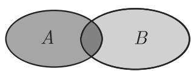
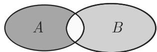

### 5.2 集论

#### 5.2.1 集合的概念、特殊集

集论的创始人是 ．康托尔 (1845 1918)．他引进的这个概念的重要性后来才为人所知集论在数学所有分支中都有决定性的作用并且它是当今数学及其应用中的本质性工具．

1. 从属关系

(1) 集合和它的元素 集论的基本概念是从属关系．一个集合 是由千某些原因而归在一起的某些不同的事物（个体、观念等） 的总体．这些个体称作集合的元素．我们分别用记号 $^ { 6 6 } a \in A ^ { \prime \prime }$ 或 $^ { 6 6 } a \notin A ^ { \prime \prime }$ 表示 $^ { 6 6 } a$ 的一个元素”或 $^ { 6 6 } a$ 不的一个元素”．集合可以通过在花括号中列出其元素，比如 $M = \{ a , b , c \}$ 或$U = \{ 1 , 2 , 3 , \cdots \}$ }，或者借助恰由这个集合的元素所满足的规定的性质来给出．例如奇自然数的集合 $U = \{ x \mid x$ 是奇自然数｝定义和表示．对千数集，下列记号是通用的：

$$
\begin{array}{l l} {{\mathbb {N} = \{0, 1, 2, \dots \}}} & {{\text {自然数集},}} \\ {{\mathbb {Z} = \{0, 1, - 1, 2, - 2, \dots \}}} & {{\text {整数集},}} \\ {{\mathbb {Q} = \left\{\frac {p}{q}   \Big |   p, q \in \mathbb {Z} \land q \neq 0 \right\}}} & {{\text {有理数集},}} \\ {{\mathbb {R}}} & {{\text {实数集},}} \\ {{\mathbb {C}}} & {{\text {复数集}.}} \end{array}
$$

(2) 集合的外延性原则 两个集合 恒等当且仅当它们恰有相同的元素，即

$$
A = B \Leftrightarrow \forall x (x \in A \Leftrightarrow x \in B).\tag{5.36}
$$

• 集合 {3,1,3, 7,2} {1,2,3, 7} 相同

一个集合每个元素仅含有“一次“，即使它被多次列举．

2. 子集

(1) 子集如果 是集合，并且

$$
\forall x (x \in A \Rightarrow x \in B)\tag{5.37}
$$

成立，那么 称为 的子集，并且记作 $A \subseteq B .$ ．换言之：若 的所有元素也属千，则 的子集．如果当 $A \subseteq B$ 时还存在 的某些元素不在 中，那么称的真子集，并且将此记作 $A \subset B$ （图 5.1)．显然，每个集合是它自身的子集$A \subseteq A$

设 $A = \{ 2 , 4 , 6 , 8 , 1 0 \}$ 是偶数的集合，而 $B = \{ 1 , 2 , 3 , \cdots , 1 0 \}$ 是自然数的集合．因为集合 不含奇数，所以 的真子集

(2) 空集 空集 $\emptyset$ 没有元素，引进这个概念是重要并且有用的由外延性原则，仅有一个空集

■ A: 集合 $\{ x | x \in \mathbb { R } \land x ^ { 2 } + 2 x + 2 = 0 \}$ 是空集

■ B: 对千每个集合 ，有 $\emptyset \subseteq M ,$ ，即空集是每个集合 的子集

对千集合 ，空集和 自身称为 的平凡子集

(3) 集合的相等 两个集合相等，当且仅当两者互为对方的子集：

$$
A = B \Leftrightarrow A \subseteq B \land B \subseteq A.\tag{5.38}
$$

这个事实经常用来证明两个集合恒等

(4) 幕集集合 的所有子集的集合称为 的幕集，并且记作胪(M)，即$\mathbb { P } ( M ) = \{ A \mid A \subseteq M \}$

• 对千集合 $M = \{ a , b , c \}$ ，幕集是

$$
\mathbb {P} (M) = \{\varnothing , \{a \}, \{b \}, \{c \}, \{a, b \}, \{a, c \}, \{b, c \}, \{a, b, c \} \}.
$$

下列性质成立：

a) 如果集合 个元素，那么幕集胪(M) 有 $2 ^ { m }$ 元素．

b) 对千每个集合 M, $M , \emptyset \in \mathbb { P } ( M )$ ，即 自身及空集是 的幕集的元素

(5) 基数有限集合 的元素个数称为 的基数并记作 cardM，有时也记|Ml.

关千有无穷多元素的集合的基数，参见第 449 5.2.5.

#### 5.2.2 集合运算

1. 维恩图

若用平面图形表示集合，以此给出集合及集合运算的图形解释，就是所谓维恩(Venn) 图解．例如图 5.1 表示子集关系 $A \subseteq B$

  
5.1

2. 并、交、补

借助集合运算，可以用不同方式由给定集合形成新的集合：

(1) 是两个集合．它们的并集或并（记作 AUB) 定义为

$$
A \cup B = \{x \mid x \in A \lor x \in B \},\tag{5.39}
$$

读作 “A $B ^ { \prime \prime }$ “A 的并“．如果 分别由性质 $E _ { 1 }$ 和 $E _ { 2 }$ 定，那么并集 $A \cup B$ 具有至少其中一个性质，即至少属千其中一个集合的元素．图 5.2 中阴影区域表示并集

  
5.2

■ $\{ 1 , 2 , 3 \} \cup \{ 2 , 3 , 5 , 6 \} = \{ 1 , 2 , 3 , 5 , 6 \}$

(2) 是两个集合它们的交集或交、割、割集（记作 $A \cap B )$ 定义为

$$
A \cap B = \{x \mid x \in A \land x \in B \},\tag{5.40}
$$

读作 $^ { 6 6 } A$ 的交”或 “A $B ^ { \prime \prime }$ . 如果 分别由性质 $E _ { 1 }$ 和 $E _ { 2 }$ 定，那么交集 $A \cup B$ 具有性质 $E _ { 1 }$ 和 $E _ { 2 }$ 即同时属千这两个集合的元素．图 5.3 中阴影区域表示交集

  
5.3

• 我们可以用两个数 的因子集合 $T ( a )$ 和 $T ( b )$ 的交来定义最大公因子（参见第 499 5.4.1.4) ．对千 $a = 1 2$ 和 $b = 1 8 ,$ 有 $T ( a ) = \{ 1 , 2 , 3 , 4 , 6 , 1 2 \}$ 和$T ( b ) \ = \ \{ 1 , 2 , 3 , 6 , 9 , 1 8 \}$ ，所以 $T ( 1 2 ) \cap T ( 1 8 )$ 含有公因子，并且最大公因子是$\operatorname* { g c d } ( 1 2 , 1 8 ) = 6$

(3) 不相交集 若两个集合 没有公共元素，则称它们是不相交的．对千它们，有

$$
A \cap B = \varnothing ,\tag{5.41}
$$

即它们的交是空集

• 奇数集和偶数集不相交；它们的交是空集，即

$$
\{\text {奇数} \} \cap \{\text {偶数} \} = \varnothing .
$$

(4) 如果只考虑一个给定集合 的子集，那么 对千 的补集或补$C _ { M } ( A )$ 含有 的所有不属千 的元素：

$$
C _ {M} (A) = \{x \mid x \in M \lor x \notin A \},\tag{5.42}
$$

读作 $^ { 6 6 } A$ 对千 的补”，并且 称为基本集，有时也称为泛集．如果基本集然来自所考虑的问题，那么也用记号 $\overline { { A } }$ 表示补集．图 5.4 中阴影区域表示补集．

  
5.4

3. 集代数的基本律

集合运算具有与逻辑运算类似的性质．集代数的基本律是

(1) 结合律

$$
(A \cap B) \cap C = A \cap (B \cap C),\tag{5.43}
$$

$$
(A \cup B) \cup C = A \cup (B \cup C).\tag{5.44}
$$

(2) 交换律

$$
A \cap B = B \cap A,\tag{5.45}
$$

$$
A \cup B = B \cup A.\tag{5.46}
$$

(3) 分配律

$$
(A \cup B) \cap C = (A \cap C) \cup (B \cap C),\tag{5.47}
$$

$$
(A \cap B) \cup C = (A \cup C) \cap (B \cup C).\tag{5.48}
$$

(4) 吸收律

$$
A \cap (A \cup B) = A,\tag{5.49}
$$

$$
A \cup (A \cap B) = A.\tag{5.50}
$$

(5) 幕等律

$$
A \cap A = A,\tag{5.51}
$$

$$
A \cup A = A.\tag{5.52}
$$

(6) 德摩根律

$$
\overline {{A \cap B}} = \overline {{A}} \cup \overline {{B}},\tag{5.53}
$$

$$
\overline {{A \cup B}} = \overline {{A}} \cap \overline {{B}}.\tag{5.54}
$$

(7) 一些其他定律

$$
A \cap \overline {{A}} = \varnothing ,\tag{5.55}
$$

$$
A \cup \overline {{{{A}}}} = M (M \text {是基本集}),\tag{5.56}
$$

$$
A \cap M = A,\tag{5.57}
$$

$$
A \cup \varnothing = A,\tag{5.58}
$$

$$
A \cap \varnothing = \varnothing ,\tag{5.59}
$$

$$
A \cup M = M,\tag{5.60}
$$

$$
\overline {{M}} = \varnothing ,\tag{5.61}
$$

$$
\overline {{\varnothing}} = M,\tag{5.62}
$$

$$
\overline {{\overline {{A}}}} = A.\tag{5.63}
$$

这个表也可以应用下列代换从命题演算基本律（参见第 434 5.1.1) 得到：/\,U $\vee , M$ T, 以及 $\emptyset$ 这个一致性不是偶然的；我们将在 528 5.7论它

4. 其他的集运算

除了上面定义的运算外，这里定义两个集合 间的一些其他运算差集或差 $A \backslash B ,$ ，对称差 $A \triangle B$ 以及笛卡儿积 $A \times B$

(1) 两个集合的差 的不属千 的元素的集合称作 的差集或差：

$$
A \backslash B = \{x \mid x \in A \land x \notin B \}.\tag{5.64a}
$$

如果 由性质 $E _ { 1 }$ , 由性质 $E _ { 2 }$ 定义那么 $A \backslash B$ 含有具有性质 $E _ { 1 }$ 但不具有性质$E _ { 2 }$ 的元素

5.5 中阴影区域表示差集．

  
5.5

■ $\{ 1 , 2 , 3 , 4 \} \backslash \{ 3 , 4 , 5 \} = \{ 1 , 2 \}$

(2) 两个集合的对称差 对称差 $A \triangle B$ 是所有恰好属千集合 之一的元素的集合：

$$
A \triangle B = \{x \mid (x \in A \lor x \notin B) \land (x \in B \lor x \notin A) \}.\tag{5.64b}
$$

由定义可知

$$
A \triangle B = (A \backslash B) \cup (B \backslash A) = (A \cup B) \backslash (A \cap B),\tag{5.64c}
$$

即对称差含有恰好具有定义性质 $E _ { 1 }$ （对千 A) 和 $E _ { 2 }$ （对千 B) 之一的元素．

5.6 中阴影区域表示对称差．

  
5.6

■ {1, 2, 3, 4}6.{3, 4, 5} = {1, 2, 5}.

(3) 两个集合的笛卡儿积 两个集合的笛卡儿积由

$$
A \times B = \{(a, b) \mid a \in A \land b \in B \}\tag{5.65a}
$$

定义． $A \times B$ 的元素 (a,b) 称为有序对，并且由

$$
(a, b) = (c, d) \Leftrightarrow a = c \vee b = d\tag{5.65b}
$$

刻画．两个有限集的笛卡儿积的元素个数等千

$$
\operatorname{card} (A \times B) = (\operatorname{card} A) (\operatorname{card} B).\tag{5.65c}
$$

■ A: 对千 $A = \{ 1 , 2 , 3 \}$ 和 $B = \{ 2 , 3 \}$ ，我们得到

$$
A \times B = \{(1, 2), (1, 3), (2, 2), (2, 3), (3, 2), (3, 3) \},
$$

以及

$$
B \times A = \{(2, 1), (2, 2), (2, 3), (3, 1), (3, 2), (3, 3) \},
$$

并且 $\operatorname { c a r d } A = 3 , \operatorname { c a r d } B = 2 , \operatorname { c a r d } ( A \times B ) = \operatorname { c a r d } ( B \times A ) = 6 .$

■ B: x,y 平面的每个点可以用笛卡儿积厌 良国是实数集）定义．坐标 $x , y$ 的集用良 厌表示，所以

$$
\mathbb {R} ^ {2} = \mathbb {R} \times \mathbb {R} = \{(x, y) | x \in \mathbb {R}, y \in \mathbb {R} \}.
$$

(4) 个集合的笛卡儿积 固定序列的一种次序（第一个元素，第二个元素，．．．，个元素），可由 个元素定义一个有序 组如果 $a _ { i } \in A _ { i } ( i = 1 , 2 , \cdots , n )$ 是这些元素，那么记 组为 $( a _ { 1 } , a _ { 2 } , \cdots , a _ { n } )$ ），其中 $a _ { i }$ 称为第 个分量

对千 $n = 3 , 4 , 5 ,$ 这些 组称为三元组、四元组、五元组

项笛卡儿积 $A _ { 1 } \times A _ { 2 } \times \cdots \times A _ { n }$ 是所有有序 $( a _ { 1 } , a _ { 2 } , \cdots , a _ { n } )$ （其中$a _ { i } \in A _ { i } )$ 的集合：

$$
A _ {1} \times A _ {2} \times \dots \times A _ {n} = \left\{\left(a _ {1}, a _ {2}, \dots , a _ {n}\right) \mid a _ {i} \in A _ {i} (i = 1, \dots , n) \right\}.\tag{5.66a}
$$

如果每个 $A _ { i }$ 都是有限集，那么有序 组的个数是

$$
\operatorname{card} \left(A _ {1} \times A _ {2} \times \dots \times A _ {n}\right) = \operatorname{card} A _ {1} \operatorname{card} A _ {2} \dots \operatorname{card} A _ {n}.\tag{5.66b}
$$

集合 与其自身的 次笛卡儿积记作 $A ^ { n }$

#### 5.2.3 关系和映射

1. 元关系

关系定义一个或不同的集合的元素间的对应．集合 $A _ { 1 } , \cdots , A _ { n }$ 间的 元关系位关系 是这些集合的笛卡儿积的子集，即 $R \subseteq A _ { 1 } \times \cdots \times A _ { n }$ ．如果集合$A _ { i } ( i = 1 , \cdots , n )$ 全是同一个集合 ，那么有 $R \subseteq A ^ { n }$ ，并且将它称作集合 中的 $n$ 元关系．

2. 二元关系

(1) 集合中二元关系的概念 一个集合中二位（二元）关系具有特殊的重要性．

在二元关系情形，也经常使用记号 $a R b$ 代替 $( a , b ) \in R$

• 作为一个例子，考虑集合 A= {1,2,3,4} 中的整除关系，即二元关系

$$
T = \{(a, b) \mid a, b \in A \land a \text {是} b \text {的因子} \}\tag{5.67a}
$$

$$
= \{(1, 1), (1, 2), (1, 3), (1, 4), (2, 2), (2, 4), (3, 3), (4, 4) \}.\tag{5.67b}
$$

(2) 箭头图或映射函数 集合 中的有限二元关系可以用箭头函数或箭头图或用关系矩阵表示． 的元素用平面上的点表示，并且若存在关系 $a R b$ ，则表示为一个从 的箭头

5.7 给出 A= {1,2,3,4} 中关系 $T$ 的箭头图

  
5.7

(3) 关系矩阵 的元素作为矩阵的行元素和列元素（参见第 361 4.1.1, 1.).若 $a R b ,$ ，则在 $a \in A$ 所在的行与 $b \in B$ 所在的列的交点处元素为 ，不然为 ．下面的表格给出 $A = \{ 1 , 2 , 3 , 4 \}$ 中关系 的关系矩阵

<table><tr><td></td><td>1</td><td>2</td><td>3</td><td>4</td></tr><tr><td>1</td><td>1</td><td>1</td><td>1</td><td>1</td></tr><tr><td>2</td><td>0</td><td>1</td><td>0</td><td>1</td></tr><tr><td>3</td><td>0</td><td>0</td><td>1</td><td>0</td></tr><tr><td>4</td><td>0</td><td>0</td><td>0</td><td>1</td></tr></table>

表格：关系矩阵

3. 关系积、逆关系

关系是特殊的集合，所以通常的集合运算（参见第 440 5.2.2) 可以在关系间实施除此之外，对千二元关系，还有关系积和逆关系，具有特殊重要性．

设 $R \subseteq A \times B$ 和 $S \subseteq B \times C$ 是两个二元关系．关系 $R , S$ 的积 $R \circ S$ 定义为

$$
R \circ S = \{(a, c) \mid \exists b (b \in B \land a R b \land b S c) \}.\tag{5.68}
$$

关系积是结合的，但不交换

关系 的逆 $R ^ { - 1 }$ 定义为

$$
R ^ {- 1} = \{(b, a) | (a, b) \in R \}.\tag{5.69}
$$

对千集合 中的二元关系，下列关系式成立：

$$
(R \cup S) \circ T = (R \circ T) \cup (S \circ T),\tag{5.70a}
$$

$$
(R \cap S) \circ T \subseteq (R \circ T) \cap (S \circ T),\tag{5.70b}
$$

$$
(R \cup S) ^ {- 1} = R ^ {- 1} \cup S ^ {- 1},\tag{5.70c}
$$

$$
(R \cap S) ^ {- 1} = R ^ {- 1} \cap S ^ {- 1},\tag{5.70d}
$$

$$
(R \circ S) ^ {- 1} = S ^ {- 1} \circ R ^ {- 1}.\tag{5.70e}
$$

4. 二元关系的性质

集合 中的二元关系可以具有下列特殊的重要性质： 称为

$$
\text { 自反的,   如果 } \quad \forall a \in A a R a;\tag{5.71a}
$$

$$
\text { 非自反的,   如果 } \quad \forall a \in A \neg a R a;\tag{5.71b}
$$

$$
\text { 对称的,   如果 } \quad \forall a, b \in A (a R b \Rightarrow b R a);\tag{5.71c}
$$

$$
\text { 反对称的,   如果 } \quad \forall a, b \in A (a R b \land b R a \Rightarrow a = b);\tag{5.71d}
$$

$$
\text { 传递的,   如果 } \forall a, b, c \in A (a R b \land b R c \Rightarrow a R c);\tag{5.71e}
$$

$$
\text { 线性的,   如果 } \quad \forall a, b \in A (a R b \vee b R a).\tag{5.71f}
$$

这些关系式还可以用关系积刻画．例如，如果 $R \circ R \subseteq R ,$ 则二元关系 是传递的．特别有趣的是，关系 的闭包 $\operatorname { t r a } ( R )$ ．它是最小的含有 的传递关系（对千子集关系而言）．实际上，

$$
\operatorname{tra} (R) = \bigcup_ {n \geqslant 1} R ^ {n} = R ^ {1} \cup R ^ {2} \cup R ^ {3} \cup \dots ,\tag{5.72}
$$

其中 $R ^ { n }$ 是 与自身的 次关系积

• 设集合 {1,2,3,4,5} 上的二元关系 由它的关系矩阵 给定：

<table><tr><td>M</td><td>1</td><td>2</td><td>3</td><td>4</td><td>5</td><td> $M^{2}$ </td><td>1</td><td>2</td><td>3</td><td>4</td><td>5</td><td> $M^{3}$ </td><td>1</td><td>2</td><td>3</td><td>4</td><td>5</td></tr><tr><td>1</td><td>1</td><td>0</td><td>0</td><td>1</td><td>0</td><td>1</td><td>1</td><td>1</td><td>0</td><td>1</td><td>1</td><td>1</td><td>1</td><td>1</td><td>0</td><td>1</td><td>1</td></tr><tr><td>2</td><td>0</td><td>0</td><td>0</td><td>1</td><td>0</td><td>2</td><td>0</td><td>1</td><td>0</td><td>0</td><td>1</td><td>2</td><td>0</td><td>1</td><td>0</td><td>1</td><td>0</td></tr><tr><td>3</td><td>0</td><td>0</td><td>1</td><td>0</td><td>1</td><td>3</td><td>0</td><td>1</td><td>1</td><td>0</td><td>1</td><td>3</td><td>0</td><td>1</td><td>1</td><td>1</td><td>1</td></tr><tr><td>4</td><td>0</td><td>1</td><td>0</td><td>0</td><td>1</td><td>4</td><td>0</td><td>1</td><td>0</td><td>1</td><td>0</td><td>4</td><td>0</td><td>1</td><td>0</td><td>1</td><td>1</td></tr><tr><td>5</td><td>0</td><td>1</td><td>0</td><td>0</td><td>0</td><td>5</td><td>0</td><td>0</td><td>0</td><td>1</td><td>0</td><td>5</td><td>0</td><td>1</td><td>0</td><td>0</td><td>1</td></tr></table>

用矩阵乘法计算 $M ^ { 2 }$ 气在此将值 看作真值，并且代替乘法和加法实施逻辑运算合取和析取，那么 $M ^ { 2 }$ 是属千 $R ^ { 2 }$ 的关系矩阵． $R ^ { 3 } , R ^ { 4 }$ 等的关系矩阵可以类似地计算

RU $R ^ { 2 } \cup R ^ { 3 }$ 关系矩阵（即下面的矩阵）可以用计算矩阵 $M , M ^ { 2 }$ 和 $M ^ { 3 }$ 的析取元素的方式得到因为 的较高次幕不含有新的元素 ，所以这个矩阵已经与 $\operatorname { t r a } ( R )$ 的关系矩阵相同

<table><tr><td> $M \lor M^{2} \lor M^{3}$ </td><td>1</td><td>2</td><td>3</td><td>4</td><td>5</td></tr><tr><td>1</td><td>1</td><td>1</td><td>0</td><td>1</td><td>1</td></tr><tr><td>2</td><td>0</td><td>1</td><td>0</td><td>1</td><td>1</td></tr><tr><td>3</td><td>0</td><td>1</td><td>1</td><td>1</td><td>1</td></tr><tr><td>4</td><td>0</td><td>1</td><td>0</td><td>1</td><td>1</td></tr><tr><td>5</td><td>0</td><td>1</td><td>0</td><td>1</td><td>1</td></tr></table>

关系矩阵和关系积在图论中路径长度的搜索中有重要应用（参见第 5405.8.2.1).

在有限二元关系情形，我们可以容易地从箭头图或关系矩阵识别出上面的性质．例如，可以从箭头图中的“自循环圈”以及关系矩阵中的主对角元 看出自反性．如果每个箭头都伴随一个反方向的箭头，或者如果关系矩阵是对称矩阵（参见第 4445.2.3, 2.），那么箭头图中对称性是显然的．从箭头图或从关系矩阵还容易看出可除性 是自反的但不是对称关系．

5. 映射

从集合 到集合 的映射或函数（参见第 61 2.1.1.1)，记作 $f : A  B$ 是一个法则，它对千每个元素 $a \in A$ 恰指派一个元素 $b \in B ,$ ，并称之为 $f ( a )$ ．映射可以看作 $A \times B$ 的一个子集，因而看作一个二元关系：

$$
f = \{(a, f (a)) \mid a \in A \} \subseteq A \times B.\tag{5.73}
$$

a) 如果对千每个 $b \in B$ 至多存在一个 $a \in A$ 使得 $f ( a ) = b ,$ ，那么称 是单射或一对一映射．

b) 如果对千每个 $b \in B$ 至少存在一个 $a \in A$ 使得 $f ( a ) = b ,$ ，那么称 是从的满射．

c) 如果 既是单射也是满射，那么 称为双射．

如果 是有限集，并且它们之间存在双射，那么 的元素个数相同（还可参见第 449 5.2.5).

对千双射映射 $f : A  B$ 存在逆关系： $: f ^ { - 1 } : B \to A$ 称为 的逆映射．

映射的关系积用千一个接着一个映射的复合：如果 $f : A  B$ 以及 $g : B  A$ 是映射，那么 $f \circ g$ 也是一个从 的映射，并且定义为

$$
(f \circ g) = g (f (a)).\tag{5.74}
$$

注意这个方程中 的顺序（在文献中它有不同的处理！）．

#### 5.2.4 等价性和序关系

对千集合 ，最重要的两类二元关系是等价性和序关系．

1. 等价关系

若与集合 有关的二元关系 是自反、对称和传递的，则称为等价关系．如果已知等价关系 $R ,$ ，那么对千 $a R b$ 也可应用记号 $a \sim _ { R } b$ 或 $a \sim b ,$ ，并读作 （对千 R)等价千 b.

等价关系的例

■ A: $A = \mathbb { Z } , m \in \mathbb { N } \backslash \{ 0 \}$ ．恰当 除有相同的剩余时有 $\{ a \} \sim _ { R } \{ b \}$ （它们模 同余）．

■ B: 在不同区域中的等价关系，例如在有理数集 $\mathbb { Q }$ 中 $: \frac { p _ { 1 } } { q _ { 1 } } = \frac { p _ { 2 } } { q _ { 2 } } \Leftrightarrow p _ { 1 } q _ { 2 } =$ $p _ { 2 } q _ { 1 } \left( p _ { 1 } , p _ { 2 } , q _ { 1 } , q _ { 2 } \right.$ 是整数， $q _ { 1 } , q _ { 2 } \neq 0 )$ ，这里第一个等式定义 $\mathbb { Q }$ 中的相等，而第二个等式表示 中的相等

■ C: 儿何图形的相似或全等

■ D: 命题演算的表达式的逻辑等价（参见第 434 5.1.1, 6.).

2. 等价类、分拆

(1) 等价类 集合 中每个等价关系定义 的一个分划，即将它分为两两不相交的非空子集（等价类）．

$$
[ a ] _ {R} := \{b | b \in A \land a \sim_ {R} b \}\tag{5.75}
$$

称为 对千 的一个等价类．对千等价类，下列性质成立：

$$
[ a ] _ {R} \neq \varnothing , a \sim_ {R} b \Leftrightarrow [ a ] _ {R} = [ b ] _ {R}, \text {并且} a \nsim_ {R} b \Leftrightarrow [ a ] _ {R} \cap [ b ] _ {R} = \varnothing .\tag{5.76}
$$

这些等价类形成一个新的集合，即商集 $A / R$

$$
A / R = \{[ a ] _ {R} \mid a \in A \}.\tag{5.77}
$$

幕集 $\mathbb { P } ( A )$ 的子集 $Z \subseteq \mathbb { P } ( A )$ 称为 的一个分拆，如果

$$
\varnothing \notin Z, X, Y \in Z \land X \neq Y \Rightarrow X \cap Y = \varnothing , \bigcup_ {X \in Z} = A.\tag{5.78}
$$

(2) 分解定理 集合 中每个等价关系 定义 的一个分拆 Z，即 $Z = A / R$ 反之集合 的每个分拆定义 中的一个等价关系 R:

$$
a \sim_ {R} b \Leftrightarrow \exists X \in Z (a \in X \land b \in X).\tag{5.79}
$$

集合 中的等价关系可以看作等式的推广，在此 的元素的“无关重要＂的性质被忽略，而对千某些性质没有差异的元素属千同一个等价类

3. 次序关系

集合 中的二元关系 称为偏序的，如果 是自反、反对称并且传递的．此外，如果 是线性的，那么 称为线性序或链集合 称为关千 有序或线性有序在线性有序集中任何两个元素是可比较的．如果巾问题已知次序关系 ，那么代替 $a R b$ 也可使用记号 $a \leqslant _ { R } b$ 或 $a \leqslant b$

次序关系的例

■ A: 数集 $\mathbb { N } , \mathbb { Z } , \mathbb { Q } ,$ 卫关千通常的 $\leqslant$ 关系是全序的

■ B: 子集关系也是有序的，但仅是偏序的．

■ C: 英语字的字典顺序是一个链．

如果 $Z = \{ A , B \}$ 的一个具有性质 $a \in A \land b \in B \Rightarrow a < b$ 的分拆，那么 $( a , b )$ 称为戴德金分割如果 没有最大元素，而 没有最小元素，那么这个分割唯一确定一个无理数．除了区间套（参见第 1.1.1.2) 外，戴德金分割的概念是另一种引进无理数的方法

4. 哈塞图

有限有序集可以通过哈塞图表示：设在有限集 上给定序关系< $\leqslant$ 的元素用平面上的点表示，在此若 $a < b ,$ 则点 $b \in A$ 位千点 $a \in A$ 上方．如果没有 $c \in A$ 满足 $a < c < b ,$ 则称 相邻接或是相邻成员．千是用一个线段连接 b.

哈塞图是一个“简化”的箭头图，其中所有的圈、箭头以及由关系的传递性产生的箭都被省略．图 5.7 给出集合 $A = \{ 1 , 2 , 3 , 4 \}$ 的可除性关系 的箭头图，图 5.8是其哈塞图表示

  
5.8

#### 5.2.5 集合的基数

在第 440 5.2.1 中我们将一个有限集的元素个数称为这个集合的基数．基数的概念可以扩充到无限集．

1. 基数

两个集合 称作等计数的，如果它们之间存在双射．对千每个集合派一个基数 $| A |$ card ，所以等计数集合有相同的基数．一个集合与它的幕集绝不会等计数，所以没有“最大”的基数

2. 无限集

无限集可以用下列性质来刻画它们具有与集合自身等计数的真子集“最小”的无穷基数是自然数集 的基数，将它记为 $\aleph _ { 0 }$ （阿列夫 0).

若一个集合与 等计数，则称为可枚举的或可数的．这意味着它的元素可以逐个列举，或写成一个无穷序列 $a _ { 1 } , a _ { 2 } , \cdots$

若一个集合不与 等计数，则称为不可数的千是每个不能枚举的无限集是不可数的．

■ A: 整数集 和有理数集 $\mathbb { Q }$ 是可数集．■ B: 实数集屈和复数集 是不可数集．这些集合与自然数集的幕集胪(N)计数，并且它们的基数称为连续统
