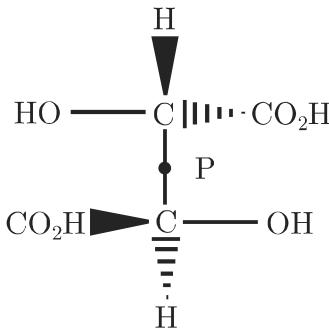
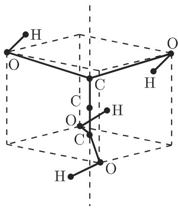
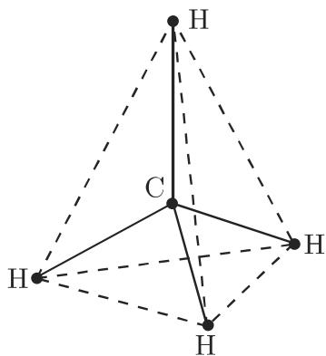
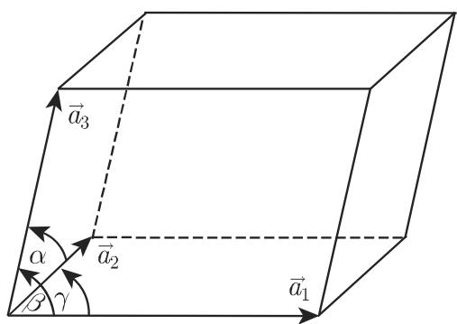

#### 5.3.5 群的应用

在化学和物理学中群被用来刻画相应的个体的“对称性”．这样的个体是，例如分子、晶体、固体结构或量子力学系统．这些应用的基本思想是冯·诺伊曼原理

如果一个系统有某个对称运算群，那么这个系统的每个物理观察量必有相同的对称性．

5.3.5.1 对称运算、对称元素

空间个体的对称运算是一个空间到自身的映射，它保持线段长度不变并且将个体变到与自身相适应的位置．对称运算 的不动点的集合，即所有对千 保持不变的空间点的集合，记作 Fixs. 集合 Fixs 称为 的对称性元素申弗利斯 (Schoenflies)记号用来表示对称运算

对称元素区分为两种类型无不动点运算和至少有一个不动点的运算．

(1) 无不动点对称运算 对千这种运算，空间中没有一个点保持不变，对千有界的空间个体这不可能出现，但现在只考虑这种个体．例如，平移是一个无不动点对称性运算

(2) 至少有一个不动点的对称运算 例如，旋转和反射．下列的运算属千这种类型

a) 绕轴旋转角度 $\varphi$ 对千 $\varphi = 2 \pi / n$ ，旋转轴以及旋转本身记作 $C _ { n }$ ．千是旋转轴称作 阶的．

b) 对千平面的反射 反射平面和反射本身记作 $\sigma .$ 如果还有主旋转轴，那么我们将它画成是直立的，而垂直千轴的反射平面记为 $\sigma _ { h } \mathopen { } \mathclose \bgroup ( h$ 来源千 horizontal （水平）），通过旋转轴的反射平面记为 $\sigma _ { v }$ (v 来源千 vertical （垂直））或 $\sigma _ { d } ( d$ 意味着dihedral （二面体），由此某些角被平分）．

c) 非正常正交映射 旋转 $C _ { n }$ 后紧接反射 $\sigma _ { h }$ 的运算称为非正常正交映射并记作 $S _ { n }$ 九．旋转与反射是交换的因此旋转轴称为 阶非正常旋转轴，并且也记作$S _ { n }$ 九．这个轴被相应地称作对称元素，虽然在实施运算 $S _ { n }$ 时只有对称中心保持不变．对千 $n = 2$ 非正常正交映射也称为点反射或反演（参见第 384 4.3.5.1)，并记i.

5.3.5.2 对称群或点群

对千每个对称性运算 ，存在逆运算 $S ^ { - 1 }$ ，它将 $S ^ { \  { \epsilon } }$ 返回”，即

$$
S S ^ {- 1} = S ^ {- 1} S = \epsilon .\tag{5.121}
$$

此处 表示恒等运算，它保持整个空间不变一族空间个体的对称运算对千它们的相继实施形成一个群，一般它是个体的非交换对称群．下列关系成立：

a) 每个旋转是两个反射的积．两个反射平面的交是旋转轴．

b) 对千两个反射 $\sigma$ 和 $\sigma ^ { \prime }$ ，当且仅当相应的反射平面恒同或互相垂直时有

$$
\sigma \sigma^ {\prime} = \sigma^ {\prime} \sigma .\tag{5.122}
$$

这个积在第一种情形是恒等元 $\epsilon ,$ ，在第二种情形是旋转 $C _ { 2 }$

c) 旋转轴相交的两个旋转的积仍然是旋转，其轴通过两个给定旋转轴的交点．

d) 对千旋转轴相同或互相垂直的两个旋转 $C _ { 2 }$ 和 $C _ { 2 } ^ { \prime }$ 有

$$
C _ {2} C _ {2} ^ {\prime} = C _ {2} ^ {\prime} C _ {2}.\tag{5.123}
$$

此积仍然是旋转在第一种情形相应的旋转轴就是给定的轴在第二种情形旋转轴与给定轴之一垂直

5.3.5.3 分子的对称运算

识别一个个体的每个对称元素要求做大量的工作．在文献中，例如在 [5.21],[5.22], [5.27] 中，详细地讨论了如果已知所有的对称元素怎样去求分子的对称群．下面的概念用千解释空间中的分子：图 5.11 上方的符号表示 OH 群位千图平面的上方， 右边的符号表示群 $\mathrm { O C _ { 2 } H _ { 5 } }$ 在 的下方．

  
5.11

可用下列方法确定对称群．

1. 没有旋转轴

a) 如果没有对称元素，那么 $G = \{ \epsilon \}$ 叶，即除恒等运算 外，分子没有任何对称运算

• 半乙缩酪分子（图 5.11) 不是平面的，并且有 个不同的原子群．

b) 如果 是反射或 是反演，那么有 $G = \{ \epsilon , \sigma \} = : C _ { s }$ ，或 $G = \{ \epsilon , i \} = : C _ { i }$ 并且由此可知它同构千 $Z _ { 2 }$

• 酒石酸的分子（图 5.12) 可以对千中心 反射（反演）．

  
5.12

2. 恰有一个旋转轴

a) 如果可以旋转任何角度，即 $C = C _ { \infty }$ ，那么分子是长条形，并且对称群是无限的．

■ A: 对千氯化钠（普通食盐）NaCl 的分子，没有水平反射．对应地由所有绕 $C$ 旋转组成的对称群记作 $C _ { \infty \upsilon }$

■ B: 分子 $\mathrm { O _ { 2 } }$ 有一个水平反射．对应的对称群由旋转和这个反射生成，并且将它记作 $D _ { \infty h }$

b) 旋转轴是 阶的， $C = C _ { n }$ ，但它不是 $2 n$ 阶非正常旋转轴．

如果没有其他的对称性元素，那么 由绕 $C _ { n }$ 转角为兀 $\pi / n$ 的旋转 生成，即$G = \langle d \rangle \cong Z _ { n }$ 九．在此情形 也记作 $C _ { n }$

如果还有一个垂直反射 $\sigma _ { v }$ ，那么有 $G = \langle d , \sigma _ { v } \rangle \cong D _ { n }$ （参见第 451 5.3.3.1),并将 记作 $C _ { n v }$

如果还有水平反射 $\sigma _ { h }$ 那么 $G = \langle d , \sigma _ { h } \rangle \cong Z _ { n } \times Z _ { 2 }$ .将G 记作 $C _ { n h }$ , 并且当是奇数时它是循环的（参见第 452 5.3.3.2).

■ A: 对千过氧化氢（图 5.13) ，当 $0 < \delta < \pi / 2 , \delta = 0$ 及 $\delta = \pi / 2$ 时上面给出的阶的 种情形都出现

  
5.13

■ B: 作为对称性元素，水 $\mathrm { H _ { 2 } O }$ 的分子有一个 阶旋转轴和一个垂直反射平面因此水的对称群同构千群 $D _ { 2 }$ ，后者又同构千克莱因四元群 $V _ { 4 }$ （参见第 454

5.3.3.2, 3.).

c) 旋转轴是 阶的同时它也是一个 $2 n$ 阶非正常旋转轴．我们要区分两种情形：

o) 不存在其他的垂直反射，千是有 $G \cong Z _ { 2 n }$ ，并且也将 记作 $S _ { 2 n }$

• －个例子是四胫基丙二烯，有分子式 $\mathrm { C _ { 3 } ( O H ) _ { \div } }$ （图 5.14).

  
5.14

f3) 如果还有垂直反射，那么 4n 阶群，将它记作 $D _ { 2 n }$

■ $n = 2$ 给出 $G \cong D _ { 4 }$ ，即 阶二面体群一个例子是丙二烯分子（图 5.15).

  
5.15

3. 多个旋转轴

如果有多个旋转轴，那么要进一步区分不同情形．特别地，如果多个旋转轴的阶 $n \geqslant 3$ ，那么下列的群是对应的对称群：

a) 四面体群 $T _ { d }$ 同构千 $S _ { 4 } , \mathrm { o r d } T _ { d } = 2 4 $

b) 八面体群 $O _ { h }$ 同构千 $S _ { 4 } \times Z _ { 2 } , \mathrm { o r d } O _ { h } = 4 8 .$

c) 二十面体群 $I _ { h } \mathrm { o r d } I _ { h } = 1 2 0 .$

这些群是在 207 3.3.3, 3.7, 中讨论的正多面体的对称群（图 3.63).

• 甲烧分子（图 5.16) 以四面体群作为对称群．

  
5.16

5.3.5.4 晶体学中的对称群

1. 格结构

在晶体学中平行六面体表示晶体的基本（单位）胞腔，这与特殊的原子或离子的排列无关它由从一个格点出发的 个不共面的基向量 $\vec { a } _ { i }$ 确定（图 5.17) ．无限儿何格结构由实施所有本原平移『 $\vec { t _ { n } }$ 产生：

$$
\vec {t _ {\pmb {n}}} = n _ {1} \vec {a} _ {1} + n _ {2} \vec {a} _ {2} + n _ {3} \vec {a} _ {3}, \quad \pmb {n} = (n _ {1}, n _ {2}, n _ {3}), n _ {i} \in \mathbb {Z},\tag{5.124}
$$

其中系数 $n _ { i } ( i = 1 , 2 , 3 )$ 是整数．所有通过格向量确定格 $L = \{ \vec { t } _ { n } \}$ ｝的空间点的平移 $\vec { t _ { n } }$ 的总体形成一个平移群 $T ,$ ，其中群元素为 $T ( \vec { t _ { n } } )$ ），逆元素 $T ^ { - 1 } ( \vec { t } _ { n } ) = T ( - \vec { t } _ { n } )$ 合成律是 $T ( \vec { t } _ { n } ) * T ( \vec { t } _ { m } ) = T ( \vec { t } _ { n } + \vec { t } _ { m } )$ ．群元素 $T ( \vec { t _ { n } } )$ 作用千位置向量 $\vec { r }$ 由

$$
T (\vec {t _ {n}}) \vec {r} = \vec {r} + \vec {t _ {n}}\tag{5.125}
$$

刻画

  
5.17

2. 布拉维格

考虑基向量 $\vec { a } _ { i }$ 的相对长度和每对基向量间的夹角（特别， $9 0 ^ { \circ }$ 角和 $1 2 0 ^ { \circ }$ 角）的可能的组合，我们得到七种不同类型的具有相应的格，即布拉维 (Bravais) 格的基本胞腔（图 5.17，表 5.4)．借助 个非本原基本胞腔及它们对应的格（其中在面或体的对角线的交点处增加附加的格点，并且保持基本胞腔的对称性），可将这个分类扩充．这样我们可以区分为单侧面中心化格、体中心化格和全侧面中心化格．

5.4 本原布拉维格

<table><tr><td>基本胞腔</td><td>基向量长度关系</td><td>基向量夹角</td></tr><tr><td>三斜晶</td><td> $a_1 \neq a_2 \neq a_3$ </td><td> $\alpha \neq \beta \neq \gamma \neq 90^\circ$ </td></tr><tr><td>单斜晶</td><td> $a_1 \neq a_2 \neq a_3$ </td><td> $\alpha = \gamma = 90^\circ \neq \beta$ </td></tr><tr><td>菱形晶</td><td> $a_1 \neq a_2 \neq a_3$ </td><td> $\alpha = \beta = \gamma = 90^\circ$ </td></tr><tr><td>三角晶</td><td> $a_1 = a_2 = a_3$ </td><td> $\alpha = \beta = \gamma < 120^\circ (\neq 90^\circ)$ </td></tr><tr><td>六方晶</td><td> $a_1 = a_2 \neq a_3$ </td><td> $\alpha = \beta = 90^\circ, \gamma = 120^\circ$ </td></tr><tr><td>正方晶</td><td> $a_1 = a_2 \neq a_3$ </td><td> $\alpha = \beta = \gamma = 90^\circ$ </td></tr><tr><td>立方晶</td><td> $a_1 = a_2 = a_3$ </td><td> $\alpha = \beta = \gamma = 90^\circ$ </td></tr></table>

3. 晶体格结构中的对称运算

在将空间格变换到等价位置的对称运算中有点群运算，如某些旋转、非正常旋转，以及对千平面或点的反射但并非所有的点群都是晶体学点群．群元素对格向量 $\vec { t _ { n } }$ 的作用导致格点 $\vec { t } _ { n } ^ { \prime } \in L ( L$ 是所有格点的集合）的这个要求限制了容许的点群 $P ,$ ，其中群元素 $P ( R )$ 按照

$$
P = \{R: R \vec {t} _ {\pmb {n}} \in L \}, \quad \vec {t} _ {\pmb {n}} \in L\tag{5.126}
$$

确定，其中 表示真旋转算子 $( R \in \mathrm { S O } ( 3 ) )$ 或非正常旋转算子 $( R = I R ^ { \prime } \in$ 0(3), $R ^ { \prime } \in \mathrm { S O } ( 3 )$ 是反演算子，并且 $I { \vec { r } } = - { \vec { r , } } { \vec { r } }$ 是位置向量）．例如，仅有 $n$ 重旋转轴（其中 $n = 1 , 2 , 3 , 4$ 6) 与格结构相适应．因此总共有 32 个晶体学点群．

空间格的对称群也可以含有同时表示旋转和本原平移的作用的算子．这样我们得到滑动反射，即平面中的反射和平行千平面的平移，以及螺旋式旋转，即旋转$2 \pi / n$ 并且按 $m \overrightarrow { a } / n$ 平移（其中 $m = 1 , 2 , \cdots , n - 1 ,$ 是基平移）．这样的运算称作非本原平移 ${ \vec { V } } ( R )$ ，因为它们对应千“分数“平移．对千滑动反射 是一个反射，而对千螺旋式旋转 是一个真旋转．

使晶体格不变的空间群 的元素由晶体学点群 的元素 $P ,$ ，本原平移 $T ( \vec { t _ { n } } )$ 及非本原平移 ${ \vec { V } } ( R )$ 组成

$$
G = \{\{R \mid \vec {V} (R) + \vec {t _ {n}}: R \in P, \vec {t _ {n}} \in L \} \}.\tag{5.127}
$$

空间群的单位元素是 $\{ e | 0 \}$ ，其中 的单位元素．元素 $\{ e | \vec { t } _ { n } \}$ 表示本原平移， $\{ R | 0 \}$ 表示旋转或反射．将群元素 $\left\{ R \vert \vec { t } _ { n } \right\}$ 作用千位置向量 ${ \vec { r } } ,$ ，我们得到

$$
\{R \mid \vec {t _ {n}} \} \vec {r} = R \vec {r} + \vec {t _ {n}}.\tag{5.128}
$$

4. 晶体系（全对称）

14 个布拉维格， $L = \left\{ \vec { t } _ { n } \right\}$ ， 32 个晶体点群 $P = \{ R \}$ 以及容许的非本原平移 $\vec { V } ( R )$ ，我们可以构造 230 个空间群 $G = \{ R \vert \vec { V } ( R ) + \vec { t } _ { \pmb { n } } \}$ ．点群对应千 32 个晶体类．在点群中有 个群，它们不是其他点群的子群但含有其他点群作为子群．这个点群中的每一个都形成一个晶体系（全对称）．这 个晶体系的对称性是反映在个布拉维格的对称性中． 32 个晶体类与 个晶体系的关系在表 5.5 中通过申弗利斯记号给出．

空间群 (5.127) 是“空“格的对称群．真实的晶体是将某些原子或离子排列在格位上得到的这些晶体成分的排列显示了其自身的对称性．因此，一般地真实晶体的对称群 $G _ { 0 }$ 。具有比 $G ( G \supset G _ { 0 } )$ 较低的对称性．

5.5 布拉维格、晶体系及晶体类

<table><tr><td>格型</td><td>晶体系(全对称)</td><td>晶体类</td></tr><tr><td>三斜晶</td><td> $C_i$ </td><td> $C_1, C_i$ </td></tr><tr><td>单斜晶</td><td> $C_{2h}$ </td><td> $C_2, C_h, C_{2h}$ </td></tr><tr><td>菱形晶</td><td> $D_{2h}$ </td><td> $C_{2v}, D_2, D_{2h}$ </td></tr><tr><td>正方晶</td><td> $D_{4h}$ </td><td> $C_4, S_4, C_{4h}, D_4, C_{4v}, D_{2d}, D_{4h}$ </td></tr><tr><td>六方晶</td><td> $D_{6h}$ </td><td> $C_6, C_{3h}, C_{6h}, D_6, C_{6v}, D_{3h}, D_{6h}$ </td></tr><tr><td>三角晶</td><td> $D_{3d}$ </td><td> $C_3, S_6, D_3, C_{3v}, D_{3d}$ </td></tr><tr><td>立方晶</td><td> $O_h$ </td><td> $T, T_h, T_d, O, O_h$ </td></tr></table>

记号： $C _ { n }$ 绕 $_ n$ 重旋转轴的旋转， $D _ { n }$ 二面体群， $T _ { n }$ 四面体群， $O _ { n }$ 八面体群， $S _ { n }$ n-n 重轴的镜旋转

5.3.5.5 量子力学中的对称群

保持量子力学系统的哈密顿算子 $\hat { H }$ （参见第 780 9.2.4, 2.) 不变的线性坐标变换表现为一个对称群，其元素 $g$ 与 $\hat { H }$ 交换：

$$
[ g, \hat {H} ] = g \hat {H} - \hat {H} g = 0, \quad g \in G.\tag{5.129}
$$

$g$ 与 $\hat { H }$ 的交换性质蕴涵在将算子 $g$ 和 $\hat { H }$ 的乘积应用千状态 $\varphi$ 时算子作用的顺序是任意的：

$$
g (\hat {H} \varphi) = \hat {H} (g \varphi).\tag{5.130}
$$

因此我们有：如果 $\varphi _ { E _ { \alpha } } \left( \alpha = 1 , 2 , \cdots , n \right)$ 是 $\hat { H }$ 的具有退化性 的能量特征值特征态，即

$$
\hat {H} \varphi_ {E _ {\alpha}} = E \varphi_ {E _ {\alpha}} (\alpha = 1, 2, \dots , n),\tag{5.131}
$$

那么变换态 $g \varphi _ { E _ { \alpha } }$ 也是属千相同特征值 的特征态：

$$
g \hat {H} \varphi_ {E _ {\alpha}} = \hat {H} g \varphi_ {E _ {\alpha}} = E g \varphi_ {E _ {\alpha}}.\tag{5.132}
$$

可以写成特征态 $\varphi _ { E _ { c } }$ 的线性组合：

$$
g \varphi_ {E _ {\alpha}} = \sum_ {\beta = 1} ^ {n} D _ {\beta \alpha} (g) \varphi_ {E _ {\beta}}.\tag{5.133}
$$

因此特征态 $\varphi _ { E _ { \alpha } }$ 形成哈密顿算子 $\hat { H }$ 的对称群 的表示 D(G)（其表示矩阵为$D _ { \alpha \beta } ( g ) )$ 的 $n$ 维表示空间的基．如果不存在“隐藏的“对称性，那么这个表示是不可约的我们可以说量子力学系统的能量特征态可以用哈密顿的对称群的不可约表示的符号差作为标志

因此群表示理论可用千最子力学系统的这种能量谱模型的定性描述，它们仅巾系统的外在或内部对称性确立在对称性或能量特征态间跃迁的矩阵元素的选择法则遭到破坏所造成的摄动的影响下，退化能量水平的分裂也可由对应千多状态共存及群运算下的算子变换的表示的研究得到．

大量的文献（见，例如 [5.14], [5.16], [5.24], [5.25], [5.26] ）给出群论在量子力学中的应用

5.3.5.6 群论在物理学中的其他应用

关千特殊连续群在物理学中的应用的其他例子，我们在此只能引述：

U(l) ：电动力学中的度规变换

SU(2) ：粒子物理学中的自旋和同位旋转．

SU(3) ：粒子物理学中重子和介子的分类．核物理学中的多体问题．

S0(3) ：量子力学中的角动量代数．原子和核多体问题．

S0(4) ：氢光谱的退化．

SU(4) ：由自旋和同位旋转自由度的统一产生的核壳层模型中的维格纳超多重谱线夸克模型中味 (flavor) 多重谱线（包括粲 (charm) 自由度）的描述．

SU(6) ：由味自由度和自旋自由度的组合产生的夸克模型中的多重谱线；核结构模型．

U(n) ：原子和核物理学中的壳层模型．

SU(n), SO(n) ：核物理学中的多体问题．

SU(2) ® U(l) ：电弱交互效应的标准模型．

SU $\mathrm { { J ( 5 ) } } \supset \mathrm { { S U ( 3 ) } } \otimes \mathrm { { S U ( 2 ) } } \otimes U ( 1 )$ ：基本交互效应的统一 (GUT).

SU(n) SO(n) 是李群，即连续群（参见 5.3.6 以及 [5.14]).
