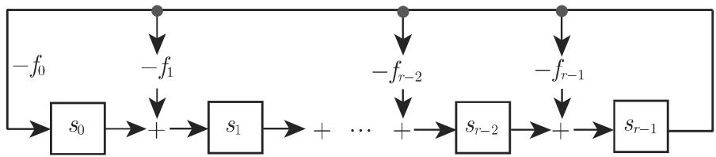

#### 5.3.7 环和域

这一节讨论具有两个二元运算的代数结构

5.3.7.1 定义

1.

具有两个二元运算＋和＊的集合 称为环（记作 $\left( R , + , * \right) )$ ），如果

$( R , + )$ ）是一个阿贝尔群；

$( R , * )$ ）是一个半群；

• 分配律成立：

$$
a * (b + c) = (a * b) + (a * c), \quad (b + c) * a = (b * a) + (c * a).\tag{5.173}
$$

如果 $( R , * )$ )是交换的或者 $( R , * )$ )有中性元素，那么 $( R , + , * )$ ＊）分别称作交换环或有恒等元素环（有单位元素环）．

有单位元素并且没有零因子的交换环称作整区．

环的非零元称为零因子或奇异元素，如果存在环的非零元使得它们的积等千零．

在有零因子的环中下列的蕴涵关系一般是错误的： $a * b = 0 \Rightarrow ( a = 0 \lor b = 0 )$

如果 是有单位元素环，那么最小的使得 $k 1 = 1 + 1 + \cdots + 1 = 0 ( k$ 乘1等千零）的自然数 称为环 的特征，并记为 $\operatorname { c h a r } R = k$ . 如果这样的 不存在，那么 $\mathrm { c h a r } R = 0$

$\operatorname { c h a r } R = k$ 意味着加群 $( R , + )$ 的由 生成的循环子群 (1〉有阶 k, 因而每个元素的阶都是 的因子

如果 $\operatorname { c h a r } R = k$ , 那么对千所有 $r \in R , r + r + \cdot \cdot \cdot + r ( k \ \backslash / / \backslash$ 等千零．整区的特征是零或素数

2. 除环、域

如果 $( R \backslash \{ 0 \} , * )$ ）是一个群，那么环 称为除环或斜域．如果 $( R \backslash \{ 0 \} , * )$ ）是交换群，那么 是一个域因此，每个域是一个整区，并且也是一个除环反之，每个有限整区以及每个有限除环是一个域．这个命题称作韦德伯恩 (Wedderburn) 定理

环和域的例子

■ A: 数集 z,Q卫和 对千加法和乘法是有恒等元环； $\mathbb { Q } ,$ 卫和 也是域．偶数集是没有恒等元的环的例子

■ B: 所有 阶实（或复）元素方阵的集合 $M _ { n }$ 对千矩阵加法和乘法是一个非交换环．它有单位元即恒等矩阵． $M _ { n }$ 九有零因子，例如当 $n = 2$ 时， $\left( { \begin{array} { c c } { 1 } & { 0 } \\ { 1 } & { 0 } \end{array} } \right) \left( { \begin{array} { c c } { 0 } & { 0 } \\ { 1 } & { 1 } \end{array} } \right)$ $= { \binom { 0 } { 0 } }$ ，即矩阵 $\left( \begin{array} { l l } { 1 } & { 0 } \\ { 1 } & { 0 } \end{array} \right)$ 和 $\binom { 0 } { 1 } \binom { 0 } { 1 }$ 是 $M _ { n }$ 中的零因子．

■ C: 实多项式 $p ( x ) = a _ { n } x ^ { n } + a _ { n - 1 } x ^ { n - 1 } + \cdot \cdot \cdot + a _ { 1 } x + a _ { 0 }$ 的集合对千多项式的通常加法和乘法形成一个环，即多项式环厌[x]．更一般些，代替匣上的多项式，可以考虑任意有恒等元的交换环上的多项式环．

■ D: 剩余类环 $\mathbb { Z } _ { n }$ 是有限环的例子． $\mathbb { Z } _ { n }$ 由所有除以 时有相同余数的整数的类 $[ a ] _ { n }$ 九组成 $( [ a ] _ { n }$ 是在 447 5.2.4, 1. 引进的由自然数 对千关系 $\sim _ { R }$ 定义的等价类）． $\mathbb { Z } _ { n }$ 上的环运算由， 定义为

$$
[ a ] _ {n} \oplus [ b ] _ {n} = [ a + b ] _ {n} \quad {\text {和}} \quad [ a ] _ {n} \odot [ b ] _ {n} = [ a \cdot b ] _ {n}.\tag{5.174}
$$

如果自然数 是素数，那么 $\left( \mathbb { Z } _ { n } , \oplus , \odot \right)$ 是一个域．不然 $\mathbb { Z } _ { n }$ 有零因子，例如，在 $\mathbb { Z } _ { 6 }$ 中 $[ 3 ] _ { 6 } \cdot [ 2 ] _ { 6 } = [ 0 ] _ { 6 }$ ．通常 $\mathbb { Z } _ { n }$ 九看作 $\mathbb { Z } _ { n } = \{ 0 , 1 , \cdots , n - 1 \}$ ，即用代表元（参见第 5055.4.3, 3.) 代替剩余类

3. 域扩张

是域并且 $K \subseteq L$ ，那么 的扩域或扩张域此时 可看作上的向量空间

如果 上的有限维空间，那么 称为一个有限扩域．如果这个维数是 n,那么 也称为 次扩张（记号： $[ L : K ] = n )$

例如 是厌的有限扩张． 上是 维的并且 {1, i} 是基．尺是 $\mathbb { Q }$ 上的无限维空间

对千集合 $M \subseteq L , K ( M )$ 表示含有域 及集合 M 的最小的域 (K 的一个扩域）．

特别重要的是单代数扩张 $K ( \alpha )$ ，这里 $\alpha \in L$ 是 $K [ x ]$ 中一个多项式的根．以为根的最低次数并且首项系数为 的多项式称为 上的极小多项式．如果$\alpha \in L$ 的极小多项式的次数是 n, 那么 $K ( \alpha )$ 次扩张，即极小多项式的次数等作为 上向量空间的维数．

例如， $\mathbb { C } = \mathbb { R } ( \mathrm { i } )$ ，并且 $\mathbf i \in \mathbb C$ 是多项式 $x ^ { 2 } + 1 \in \mathbb { R } [ x ]$ 的根，即 是单代数扩张，并且 $[ \mathbb { C } : \mathbb { R } ] = 2$

没有任何真子域的域称作素域

每个域 都含有一个最小的子域，即 的素域．

除同构外， Q(对千特征 的域），以及 $\mathbb { Z } _ { p } ( p$ 是素数）（对千特征 的域）是单素域

5.3.7.2 子环、理想

1. 子环

设 $R = ( R , + , * )$ ＊）是一个环，以及 $U \subseteq R .$ ．如果 对千＋和＊也是一个环，那么 $U = ( U , + , * )$ ）称作 的子环．

环 $( R , + , * )$ ）的非空子集 形成 的子环，当且仅当对千所有 $a , b \in U , a + ( - b )$ 和 $a * b$ 也在 中（子环判别法）．

2. 理想

子环 称为理想，如果对千所有 $a \in I$ 和 $a \in R , r * a$ 和 $a * r$ 也在 中．这些特殊的子环是形成商环的基础（参见第 486 5.3.7.3).

平凡子环{O} 总是 的理想．域只有平凡子环．

3. 主理想

如果一个理想的所有元素可以巾一个元素依据子环判别法生成，那么它称为主理想． 的所有理想都是主理想．它们可以写作 $m \mathbb { Z } = \{ m g \mid g \in \mathbb { Z } \}$ 的形式并且将它们记作 (m).

5.3.7.3 同态、同构、同态定理

1. 环同态和环同构

(1) 环同态设 $R _ { 1 } = ( R _ { 1 } , + , * )$ ）和 $R _ { 2 } = ( R _ { 2 } , \circ _ { + } , \circ _ { * } )$ 是两个环．映射 h:$R _ { 1 } ~  ~ R _ { 2 }$ 为环同态，如果对千所有 $a , b \in R _ { 1 }$

$$
h (a + b) = h (a) \circ_ {+} h (b) \quad {\text {及}} \quad h (a * b) = h (a) \circ_ {*} h (b)\tag{5.175}
$$

成立

(2) 的核是 $R _ { 1 }$ 的在 作用下的象是 $( R _ { 2 } , + )$ ）的中性元素 的那些元素的集合，并且记作 kerh:

$$
\ker h = \{a \in R _ {1} | h (a) = 0 \}.\tag{5.176}
$$

这里 kerh 是 $R _ { 1 }$ 的一个理想

(3) 环同构如果 还是双射，那么 称为环同构，并且称 $R _ { 1 }$ 凡和 $R _ { 2 }$ 是同构的．

(4) 商环 如果 是环 $( R , + , * )$ ）的理想，那么 在环 的加群 $( R , + )$ ）中的陪集 $\{ a + I | a \in R \}$ （参见第 452 5.3.3, 1.）的集合对千运算

$$
(a + I) \circ_ {+} (b + I) = (a + b) + I \quad \text {和} \quad (a + I) \circ_ {*} (b + I) = (a * b) + I\tag{5.177}
$$

形成一个环这个环称为 对千 的商环，并将它记作 $R / I$

对千主理想 (m) 的商环是剩余类环 $\mathbb { Z } _ { m } = Z / ( m )$ （参见第 484 页的环和域的例子）．

2. 环同态定理

如果在群同态定理中用理想的概念代替正规子群的概念，那么就可得到环同态定理：环同态 $h : R _ { 1 } \to R _ { 2 }$ 义凡 $R _ { 1 }$ 一个理想，即 $\ker h = \{ a \in R _ { 1 } | h ( a ) = 0 \}$ 商环 $R _ { 1 } / \ker h$ 同构千同态象 $h ( R _ { 1 } ) = \{ h ( a ) | a \in R _ { 1 } \}$ ．反之， $R _ { 1 }$ 的每个理想义一个同态映射 $\mathrm { n a t } _ { I } : R _ { 1 } \  \ R _ { 2 } / I _ { : }$ 并且 $\mathrm { n a t } _ { I } ( a ) = a + I$ 映射 $\mathrm { n a t } _ { I }$ 称为自然同态．

5.3.7.4 有限域与移位寄存器

1. 有限域

下列的论述给出有限域结构的概要．

(1) 伽罗瓦 (Galois) GF 对千每个素数幕 $p ^ { n }$ 存在唯一的含 $p ^ { n }$ 个元素的域（不计同构），并且每个有限域 $p ^ { n }$ 旷个元素． $p ^ { n }$ 个元素的域记作 ${ \mathrm { G F } } ( p ^ { n } )$ （伽罗瓦域）．

注意：对千 $n > 1 , \mathrm { G F } ( p ^ { n } )$ ）与 $\mathbb { Z } _ { p ^ { n } }$ 是不同的．

在构造含 $p ^ { n }$ 个元素 (p 是素数， $n > 1 )$ 时，需要 $\mathbb { Z } _ { p }$ 上的多项式环（参见第 484页 $5 . 3 . 7 . 1 , \ 2 . , \ \exists \mathrm { C } )$ 和不可约多项式： $\mathbb { Z } _ { p } [ \boldsymbol { x } ]$ 由所有的系数属千 $\mathbb { Z } _ { p }$ 的多项式组成．这些系数按模 $p$ 计算．

(2) 带余除法和欧几里得算法 在多项式环 $K [ x ]$ 中可以应用带余除法（带有余数的多项式相除），即对千 $f ( x ) , g ( x ) \in K [ x ] , \deg f ( x ) \leqslant \deg g ( x )$ ，存在 $q ( x ) , r ( x ) \in$ $K [ x ]$ ，使得

$$
g (x) = q (x) \cdot f (x) + r (x), \quad \text {并且} \quad \deg r (x) \leqslant \deg f (x).\tag{5.178}
$$

这个关系式记作 $r ( x ) = g ( x ) ( { \bmod { f ( x ) } } )$ ）．带余除法的重复实施称作多项式环的欧儿里得算法并且最后的非零余数给出 $f ( x )$ 和 $g ( x )$ 的最大公因子．

(3) 不可约多项式 若多项式 $f ( x ) \in K [ x ]$ 不能表示为较低次数的多项式之积，即（类似千 中的素数） $f ( x )$ 是 $K [ x ]$ 中的素元素，则称它是不可约的．例如对千二次或三次多项式不可约性意味着它们在 中没有根．

可以证明， $K [ x ]$ 中存在任意次数的不可约多项式．如果 $f ( x ) \in K [ x ]$ 是不可约多项式那么

$$
K [ x ] / f (x) := \{p (x) \in K [ x ] \mid \deg p (x) <   \deg f (x) \}\tag{5.179}
$$

是一个域这里加法和乘法由模 $f ( x )$ 实施，即 $g ( x ) * h ( x ) = g ( x ) \cdot h ( x ) { \bigl ( } { \bmod { f } } ( x ) { \bigr ) }$ 如果 $K = \mathbb { Z } _ { p }$ 并且 $\deg f ( x ) = n$ , 那么 $K [ x ] / f ( x )$ 有 $p ^ { n }$ 个元素，即 ${ \mathrm { G F } } ( p ^ { n } ) =$ $\mathbb { Z } _ { p } / f ( x )$ ，其中 $f ( x )$ 次不可约多项式．

(4) $\mathbf { G F } ( p ^ { n } )$ 中的计算法则 ${ \mathrm { G F } } ( p ^ { n } )$ ）中下列有用的法则成立：

$$
(a + b) ^ {p ^ {r}} = a ^ {p ^ {r}} + b ^ {p ^ {r}}, \quad r \in \mathbb {N}.\tag{5.180}
$$

千是在 $\operatorname { G F } ( p ^ { n } ) = \mathbb { Z } _ { p } / f ( x )$ 中存在一个元素 $\alpha = x$ 是 $\mathbb { Z } _ { p } ( x )$ 中不可约多项式 $f ( x )$ 的一个根，并且 $\mathrm { G F } ( p ^ { n } ) = \mathbb { Z } _ { p } / f ( x ) = \mathbb { Z } _ { p } ( \alpha )$ ．可以证明 $\mathbb { Z } _ { p } ( \alpha )$ 是 $f ( x )$ 的分裂域$\mathbb { Z } _ { p } ( \alpha )$ 中多项式的分裂域是 $\mathbb { Z } _ { p }$ 的含 $f ( x )$ 所有根的最小的扩张．

(5) 代数闭包、代数学基本定理 是代数闭的，如果 $K [ x ]$ 中所有多项式的根都在 中．代数学基本定理是说，复数域 是代数闭的． 的代数扩张为 K 的代数闭包，如果 是代数闭的．有限域的代数闭包并不有限所以存在特征$p$ 的无限域

(6) 循环群和乘法群 有限域 的乘法群 $K ^ { * } = K \setminus \{ 0 \}$ 是循环的即存在元素 $a \in K$ 使得 $K ^ { * }$ ＊的每个元素都是 $a$ 的幕： $K ^ { * } = \{ 1 , a , a ^ { 2 } , \cdots , a ^ { q - 1 } \}$ （若 $q$ 个元素）．

不可约多项式 $f ( x ) \in K [ x ]$ 称为本原的，如果 的幕表示 $L : = K [ x ] / f ( x )$ 的所有非零元素，即 的乘法群 $L ^ { * }$ 可由 生成．

应用 次本原多项式 $f ( x )$ 有可能从 $\mathrm { G F } ( p ) [ x ]$ 中构造一个 $\mathrm { G F } ( p ^ { n } )$ ）的“对数表”，这个表使计算简化

■ $\mathrm { G F } ( 2 ^ { 3 } )$ 的构造和它的对数表．

$f ( x ) = 1 + x + x ^ { 3 }$ 在 $\mathbb { Z } [ x ]$ 上不可约因为无论 还是 都不是它的根：

$$
\operatorname{GF} \left(2 ^ {3}\right) = \mathbb {Z} _ {2} [ x ] / f (x) = \left\{a _ {0} + a _ {1} x + a _ {2} x ^ {2} \mid a _ {0}, a _ {1}, a _ {2} \in \mathbb {Z} _ {2} \wedge x ^ {3} = 1 + x \right\}.\tag{5.181}
$$

$f ( x )$ 是本原的，所以对数表可以从 ${ \mathrm { G F } } ( 2 ^ { 3 } )$ 中产生．

$\mathbb { Z } _ { 2 } [ x ] / f ( x )$ 中每个多项式 $a _ { 0 } + a _ { 1 } x + a _ { 2 } x ^ { 2 }$ 都可以确定两个表达式．系数向量$a _ { 0 } , a _ { 1 } , a _ { 2 }$ 和所谓对数，后者乃是使得对千模 $1 + x + x ^ { 3 }$ 有 $x ^ { i } = a _ { 0 } + a _ { 1 } x + a _ { 2 } x ^ { 2 }$ 的自然数 ．对数表是

<table><tr><td>KE</td><td colspan="3">KV</td><td>Log.</td></tr><tr><td>1</td><td>1</td><td>0</td><td>0</td><td>0</td></tr><tr><td>x</td><td>0</td><td>1</td><td>0</td><td>1</td></tr><tr><td> $x^{2}$ </td><td>0</td><td>0</td><td>1</td><td>2</td></tr><tr><td> $x^{3}$ </td><td>1</td><td>1</td><td>0</td><td>3</td></tr><tr><td> $x^{4}$ </td><td>0</td><td>1</td><td>1</td><td>4</td></tr><tr><td> $x^{5}$ </td><td>1</td><td>1</td><td>1</td><td>5</td></tr><tr><td> $x^{6}$ </td><td>1</td><td>0</td><td>1</td><td>6</td></tr></table>

• GF(8) 中域元素 (KE) 的加法

• 按分量模 （一般情形模 p) 坐标向量 (KV) 的加法

• GF(8) 中域元素 (KE) 的乘法

• 对数 (Log) （一般情形模 $( p ^ { n } - 1 ) )$ 的加法

例： ${ \frac { x ^ { 2 } + x ^ { 4 } } { x ^ { 3 } + x ^ { 4 } } } = { \frac { x } { x ^ { 6 } } } = x ^ { - 5 } = x ^ { 2 } .$

有限域在编码理论中如线性码是极其重要的，其中考虑 $( \mathrm { G F } ( q ) ) ^ { n }$ 形式的向量空间这样的向量空间的子空间称作线性码（参见第 515 5.4.6.2, 3.）．线性码的元素（码字）也是有限域 ${ \mathrm { G F } } ( q ^ { n } )$ ）的元素形成的 组．应用千码的理论时重要的是要知道 $X ^ { n } - 1$ 的因子． $X ^ { n } - 1 \in K [ X ]$ 的分裂域称为 上的笫 个分圆域．如果 的特征不是 的因子，并且 是本原 次单位根，那么：

a) 扩域 K(a) $X ^ { n } - 1$ 上的分裂域．

b) $K ( \alpha )$ 中， $X ^ { n } - 1$ 恰有 个两两互异的根，它们形成一个循环群，并且其中有 $\varphi ( n )$ 个本原 次单位根，此处 $\varphi ( n )$ 表示欧拉函数（参见第 509 5.4.4, 1.).由一个本原 次单位根 次幕 $( k < n , \mathrm { \ g c d \ } ( k , n ) = 1 )$ 可得到所有单位根．

2. 移位寄存器的应用

多项式的计算可以由线性反馈移位寄存器（图 5.18) 很好地实施．对千基千反馈多项式 $f ( x ) = f _ { 0 } + f _ { 1 } x + \cdot \cdot \cdot + f _ { r - 1 } x ^ { r - 1 } + x ^ { r }$ 的线性反馈移位寄存器，我们由状态多项式 $s ( x ) = s _ { 0 } + s _ { 1 } x + \cdot \cdot \cdot + s _ { r - 1 } x ^ { r - 1 }$ 可得到状态多项式

$$
s (x) \cdot x - s _ {r - 1} \cdot f (x) = s (x) \cdot x (\mathrm{mod} f (x)).
$$

特别地如果 $s ( x ) = 1 , i$ 步（应用 次）后状态多项式是 $x ^ { i } ( \mathrm { m o d } \ f ( x ) )$

  
5.18

• 487 页的例子的证明： 选取本原多项式 $f ( x ) = 1 + x + x ^ { 3 } \in \mathbb { Z } _ { 2 } [ x ]$ 作为反馈多项式．那么长度为 的移位寄存器有下列状态序列：

从初始状态开始： $1 0 0 \widehat { = } 1$ (mod f(x))

$$
\begin{array}{l l} 1 1 1 \widehat {=} x ^ {5} \equiv 1 + x + x ^ {2} & (\mathrm{mod} f (x)) \\ 1 0 1 \widehat {=} x ^ {6} \equiv 1 + x ^ {2} & (\mathrm{mod} f (x)) \\ \hline 1 0 0 \widehat {=} x ^ {7} \equiv 1 & (\mathrm{mod} f (x)) \end{array}
$$

这些状态可以看作状态多项式 $s _ { 0 } + s _ { 1 } x + s _ { 2 } x ^ { 2 }$ 的系数向量．

一般地长度为 的线性反馈移位寄存器给出具有极大周期长度 $2 ^ { r } - 1$ 的状态序列当且仅当反馈多项式是 次本原多项式．
