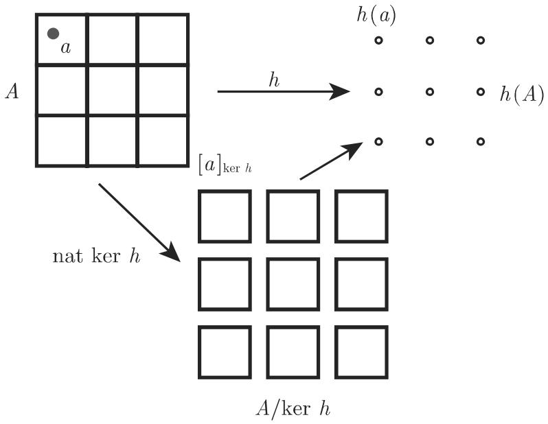

### 5.6 泛代数学

泛代数学由一个集合，称基集，以及在这个集合上的运算组成．简单的例子有半群、群、环和域它们在 5.3.2, 5.3.3 5.3.7 中讨论过．泛代数学（多数是多种类的，即有儿个基域）特别在理论信息学中被研究在这里它们形成抽象数据的类型和系统以及项重写系统的代数说明的基础．

#### 5.6.1 定义

是运算符号的集合，它被划分为两两不相交的子集 $\varOmega _ { n } , n \in \mathbb { N } . \quad \varOmega _ { 0 }$ 含常数， $\varOmega _ { n } , n > 0 ,$ 含 重运算符号．族 $( \Omega _ { n } ) _ { n \in \mathbb { N } }$ 称为型或标志．如果 是一个集合，并且对千每个 重运算符号 $\omega \in \varOmega _ { n }$ 指派一个 中的 重运算 $\omega ^ { A }$ ，那么$A = ( A , \{ \omega ^ { A } | \omega \in \varOmega \} )$ 称为 代数或型（或标志）为 的代数．

如果 是有限的， $\varOmega = \{ \omega _ { 1 } , \cdots , \omega _ { k } \}$ ｝，那么也可以将 记作 $A = \{ A , \omega _ { 1 } ^ { A } , \cdot \cdot \cdot$ $\omega _ { k } ^ { A } \}$

如果将环（参见第 483 5.3.7) 考虑为一个 代数，那么 分拆 $\varOmega _ { 0 } =$ $\{ \omega _ { 1 } \} , \Omega _ { 1 } = \{ \omega _ { 2 } \} , \Omega _ { 2 } = \{ \omega _ { 3 } , \omega _ { 4 } \}$ ｝，这里对运算符号 $\omega _ { 1 } , \omega _ { 2 } , \omega _ { 3 } , \omega _ { 4 }$ 指派常数 0, 取加法逆、加法和乘法

Q 代数． 称为 子代数，如果 $B \subseteq A$ 并且 $\omega ^ { B }$ 是运算$\omega ^ { A } ( \omega \in \varOmega )$ 限制在子集 上的运算

#### 5.6.2 同余关系、商代数

在对泛代数构造商结构时，需要同余关系的概念．同余关系是一个与结构相容的等价关系：设 $A = ( A , \{ \omega ^ { A } | \omega \in \varOmega \} )$ ）是一个 代数， 中的一个等价关系如果对千所有 $\omega \in \varOmega _ { n } ( n \in \mathbb { N } )$ 及所有使得 $a _ { i } R b _ { i } ( i = 1 , \cdots , n )$ 的 $a _ { i } , b _ { i } \in A$ 有

$$
\omega^ {A} (a _ {1}, \dots , a _ {n}) R \omega^ {A} (b _ {1}, \dots , b _ {n}),\tag{5.278}
$$

那么 称为 中的一个同余关系．对千同余关系的等价类形成的集合（商集），关千以代表元方式进行的计算也形成一个 代数：设 $A = ( A , \{ \omega ^ { A } | \omega \in \varOmega \} )$ 是一个代数， 中的一个同余关系商集 $A / R$ （参见第 448 5.2.4, 2. ，）是一个具有下列运算 $\omega ^ { A / R } ( \omega \in \mathcal { \Omega } _ { n } , n \in \mathbb { N } )$ 代数：

$$
\omega^ {A / R} ([ a _ {1} ] _ {R}, \dots , [ a _ {n} ] _ {R}) = [ \omega^ {A} (a _ {1}, \dots , a _ {n}) ] _ {R},\tag{5.279}
$$

并且将它称作 对千 的商代数

群和环的同余关系可以分别用特殊的子结构 正规子群（参见第 4535.3.3.2, 2.）和理想（参见第 485 5.3.7.2) 定义一般地例如，在半群中同余关系的这种刻画是不可能的．

#### 5.6.3 同态

恰如经典的代数结构，同态定理给出同态与同余关系间的联系．

代数．映射 $h : A  B$ 称为同态，如果对千每个 $\omega \in \varOmega _ { n }$ 及所有 $a _ { 1 } , \cdots , a _ { n } \in A$

$$
h (\omega^ {A} (a _ {1}, \dots , a _ {n})) = \omega^ {A} (h (a _ {1}), \dots , h (a _ {n})).\tag{5.280}
$$

如果 还是双射，那么 称为同构；称代数 同构． 代数 的同态象的一个 子代数在同态映射 $h$ 分解为具有相同的象的元素组成的子集，这个分解对应千一个同余关系，称它为 的核：

$$
\ker h = \{(a, b) \in A \times A \mid h (a) = h (b) \}.\tag{5.281}
$$

#### 5.6.4 同态定理

设A和B是Ω代数，而 $h : A  B$ 是同态．那么 定义 中一个同余关ker h. 商代数 $A / { \ker \ h }$ 同构千同态象 h(A).

反之，每个同余关系 定义一个同态映射 $\mathrm { n a t } _ { R } : A \to A / R$ ，并且 $\mathrm { n a t } _ { R } ( a ) =$ $[ a ] _ { R }$ ．图 5.19解释了同态定理

5.6.5

是由一些 代数组成的一个类，它在形成直接积、子代数以及同态象下是闭的，即形成的这些结果不会超出 ．这里直接积用下列方式定义：

考虑在这些 代数的基集的笛卡儿积上对应千 的以分量方式进行的运算，就得到一个 代数，即这些代数的直接积．伯克霍夫 (Birkhoff) 定理（参见第 5275.6.6) 将簇刻画为能够用方程方式定义的 代数组成的类．

  
5.19

#### 5.6.5 簇

#### 5.6.6 项代数、自由代数

设 $( \Omega _ { n } ) _ { n \in \mathbb { N } }$ 是一个型（标志）， 是簇的可数集．用下列方式归纳地定义项的集合 $T _ { \Omega } ( X )$

(1) XU $\Omega _ { 0 } \subseteq T _ { \Omega } ( X )$

(2) 如果 $t _ { 1 } , \cdots , t _ { n } \in T _ { \Omega } ( X )$ , 并且 $\omega \in \varOmega _ { n }$ ，那么也有 $\omega t _ { 1 } \cdot \cdot \cdot t _ { n } \in T _ { \Omega } ( X )$

这样定义的集合 $T _ { \Omega } ( X )$ 是一个 代数的基集，即 上型为 的项代数，并且具有下列运算：如果 $t _ { 1 } , \cdots , t _ { n } \in T _ { \Omega } ( X )$ ，并且 $\omega \in \varOmega _ { n } .$ ，那么 $\omega ^ { T _ { \Omega } ( X ) }$ 定义为

$$
\omega^ {T _ {\varOmega} (X)} (t _ {1}, \dots , t _ {n}) = \omega t _ {1} \dots t _ {n}.\tag{5.282}
$$

项代数是所有 代数的类中“最一般＂的代数，即“方程式”在项代数中无效．这些代数称为自由代数

方程式是指一对变量 $x _ { 1 } , \cdots , x _ { n }$ 的Ω项 $\left( s ( x _ { 1 } , \cdots , x _ { n } ) , t ( x _ { 1 } , \cdots , x _ { n } ) \right)$ ）．如果对千所有 $a _ { 1 } , \cdots , a _ { n } \in A$ 有

$$
s ^ {A} (x _ {1}, \dots , x _ {n}) = t ^ {A} (x _ {1}, \dots , x _ {n}),\tag{5.283}
$$

那么称 代数 满足这样一个方程．

用方程式定义的 代数的类是指由满足一组给定的方程式的 代数所形成的类

伯克霍夫定理 由方程式定义的类恰为簇

• 例如，分别由所有半群、群、阿贝尔群，以及环组成的类都是簇但是，例如循环群的直接积不是循环群，域的直接积不是域因此循环群或域不形成簇，并且不能由方程定义
