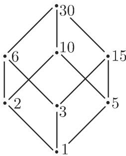
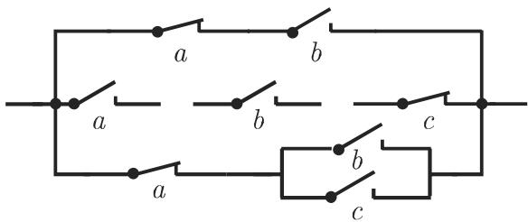

### 5.7 布尔代数和开关代数

与在第 441 5.2.2, 3. 中对千集代数以及对命题演算（参见第 434 5.1.1,6.）确立的法则相类似的计算法则也可对其他的数学对象建立．这些法则的研究产生布尔代数的概念

#### 5.7.1 定义

集合 、两个运算门（“合取“)和 LJ(“析取“)、一元运算(“否定”)，以及中的两个不同的（中性）元素 一起称为布尔代数 $B = ( B , \sqcap , \sqcup , \bar { \mathbf { \xi } } , 0 , 1 )$ ，如果它们具有下列性质

(1) 结合律

$$
(a \sqcap b) \sqcap c = a \sqcap (b \sqcap c),\tag{5.284}
$$

$$
(a \sqcup b) \sqcup c = a \sqcup (b \sqcup c).\tag{5.285}
$$

(2) 交换律

$$
a \sqcap b = b \sqcap a,\tag{5.286}
$$

$$
a \sqcup b = b \sqcup a.\tag{5.287}
$$

(3) 吸收律

$$
a \sqcap (a \sqcup b) = a,\tag{5.288}
$$

$$
a \sqcup (a \cap b) = a.\tag{5.289}
$$

(4) 分配律

$$
(a \sqcup b) \sqcap c = (a \sqcap b) \sqcup (b \sqcap c),\tag{5.290}
$$

$$
(a \sqcap b) \sqcup c = (a \sqcup b) \sqcap (b \sqcup c).\tag{5.291}
$$

(5) 中性元素

$$
a \sqcap 1 = a,\tag{5.292}
$$

$$
a \sqcup 0 = a.\tag{5.293}
$$

$$
a \sqcap 0 = 0,\tag{5.294}
$$

$$
a \sqcup 1 = 1.\tag{5.295}
$$

(6)

$$
a \sqcap \overline {{{a}}} = 0,\tag{5.296}
$$

$$
a \sqcup \overline {{a}} = 1.\tag{5.297}
$$

一个具有结合律、交换律和吸收律的结构称为格．如果分配律也成立，那么这个格称作分配格．因此布尔代数是一个特殊的分配格．

应用千布尔代数的记号不一定与命题演算中的运算记号相同

#### 5.7.2 对偶原理

1. 对偶化

在布尔代数的“公理”中包含下列的对偶性：在一个公理中，用 LJ 代替 ，用代替 LJ，用 代替 ，用 代替 1, 总是给出同一行中另一个公理．同一行中的公理是互相对偶的，并且代换过程称为对偶化．通过对偶化可以从布尔代数的一个陈述推出对偶陈述

2. 布尔代数的对偶原理

一个对千布尔代数正确的陈述的对偶陈述也是对千布尔代数正确的陈述，即对千每个被证明的命题，对偶命题也被证明

3. 性质

例如我们从公理得到布尔代数的下列性质

(El) 运算 是幕等的：

$$
a \sqcap a = a.\tag{5.298}
$$

$$
a \sqcup a = a.\tag{5.299}
$$

(E2) 德摩根法则：

$$
\overline {{a \sqcap b}} = \overline {{a}} \sqcup \overline {{b}}.\tag{5.300}
$$

$$
\overline {{a \sqcup b}} = \overline {{a}} \sqcap \overline {{b}}.\tag{5.301}
$$

(E3) 其他性质

$$
\overline {{\overline {{a}}}} = a.\tag{5.302}
$$

只需证明上面每条的两个性质之一就足够了，因为另外一个是对偶性质．最后一个性质是自身对偶的．

#### 5.7.3 有限布尔代数

所有有限布尔代数容易刻画到“同构“情形．设 $B _ { 1 } , B _ { 2 }$ 是两个布尔代数，并且$f : B _ { 1 } \to B _ { 2 }$ 双射． 称为同构，如果有

$$
f (a \sqcap b) = f (a) \sqcap f (b), \quad f (a \sqcup b) = f (a) \sqcup f (b) \quad \text {和} \quad f (\overline {{{{a}}}}) = \overline {{{{f (a)}}}}.\tag{5.303}
$$

每个有限布尔代数同构于一个有限集的幕集的布尔代数．特别地，每个有限布尔代数有 $2 ^ { n }$ 个元素，并且每两个元素个数相同的有限布尔代数是同构的．

今后用 表示有两个元素 {0,1} 并且有下列运算的布尔代数：

$$
\begin{array}{c c c} \sqcap & 0 & 1 \\ \hline 0 & 0 & 0 \\ 1 & 0 & 1 \end{array} \qquad \begin{array}{c c c} \sqcup & 0 & 1 \\ \hline 0 & 0 & 1 \\ 1 & 1 & 1 \end{array} \qquad \begin{array}{c c c} & - \\ \hline 0 & 1 \\ 1 & 0 \end{array}
$$

重笛卡儿积 $B ^ { n } = \{ 0 , 1 \} \times \cdot \cdot \cdot \times \{ 0 , 1 \}$ 上按分量定义运算 n,LJ，以及，那么 $B ^ { n }$ 是一个元素为 $0 = ( 0 , \cdots , 0 )$ 和 $1 = ( 1 , \cdots , 1 )$ 的布尔代数． $B ^ { n }$ 称为 B的n重直接积．因为 $B ^ { n }$ 含有 $2 ^ { n }$ 元素，所以这样我们得到所有有限布尔代数（不计同构者）．

#### 5.7.4 作为序关系的布尔代数

可以对每个布尔代数 确定一个序关系：若 $a \cap b = a$ （或等价地， $a \sqcup b = b )$ 成立，则有 $a \leqslant b .$

因此，每个有限布尔代数可以用一个哈塞图解来表示（参见第 449 5.2.4, 4.).• 30 的因子集合 {1,2,3,5,6,10,15,30} ．那么最小公倍数和最大公因子可以定义为二元运算，并且补作为一元运算数 30 对应千互异元素 1.应的哈塞图解见图 5.20.

  
5.20

#### 5.7.5 布尔函数、布尔表达式

1. 布尔函数

表示有两个元素的布尔代数（如第 529 5.7.3) ，那么 重布尔函数一个从 $B ^ { n }$ 到 的映射． $2 ^ { n }$ 个 $n$ 重布尔函数．所有具有运算

$$
(f \sqcap g) (b) = f (b) \sqcap g (b),\tag{5.304}
$$

$$
(f \sqcup g) (b) = f (b) \sqcup g (b)\tag{5.305}
$$

$$
\overline {{f}} (b) = \overline {{f (b)}}\tag{5.306}
$$

重布尔函数的集合是一个布尔代数．这里 总是表示 $B = \{ 0 , 1 \}$ 叶的元素的组，并且方程右边的运算是在 中实施的．互异元素 对应千函数 $f _ { 0 }$ 和 $f _ { 1 }$ ,并且对于所有 $b \in B ^ { n }$

$$
f _ {0} (b) = 0, \quad f _ {1} (b) = 1.\tag{5.307}
$$

■ A: $n \ = \ 1$ 的情形，即对千仅有一个布尔变量的情形，存在 个布尔

函数：

$$
\text {恒等} f (b) = b, \text {否定} f (b) = \bar {b}, \text {重言} f (b) = b, \text {矛盾} f (b) = b.\tag{5.308}
$$

■ B: n=2 的情形，即对千两个布尔变量 的情形，存在 16 个布尔函数，这里最重要的是它们的名称和记号它们列在表 5.6 中．

5.6 一些两变量 的布尔函数

<table><tr><td>函数名称</td><td>不同的记号</td><td>不同的符号</td><td> $\binom{a}{b} = \begin{pmatrix} 0 \\ 0 \end{pmatrix}, \begin{pmatrix} 0 \\ 1 \end{pmatrix}, \begin{pmatrix} 1 \\ 0 \end{pmatrix}, \begin{pmatrix} 1 \\ 1 \end{pmatrix}$ 的值表</td></tr><tr><td>Sheffer或NAND</td><td> $\overline{a \cdot b}$  $a|b$ NAND(a,b)</td><td></td><td>1, 1, 1, 0</td></tr><tr><td>Peirce或NOR</td><td> $\overline{a + b}$  $a \downarrow b$ NOR(a,b)</td><td></td><td>1, 0, 0, 0</td></tr><tr><td>反等价或XOR</td><td> $\overline{ab} + a\overline{b}$  $a$  XOR  $b$  $a \neq b, a \oplus b$ </td><td></td><td>0, 1, 1, 0</td></tr><tr><td>等价</td><td> $\overline{ab} + ab$  $a \equiv b$  $a \leftrightarrow b$ </td><td></td><td>1, 0, 0, 1</td></tr><tr><td>蕴涵</td><td> $\overline{a} + b, a \rightarrow b$ </td><td></td><td>1, 1, 0, 1</td></tr></table>

2. 布尔表达式

布尔表达式是用归纳的方式定义的：设 $X = \{ x , y , \cdot \cdot \cdot \}$ 是一个布尔变量（它们只能够在｛ ，叶中取值）的（可数）集：

(1) 常数 作为 中的布尔变量恰为布尔表达式．

(5.309)

(2) 如果 是布尔表达式那么 ${ \overline { { T } } } , ( S \cap T )$ (S LJ T) 也是布尔表达式 (5.310)

如果一个布尔表达式含变量 $x _ { 1 } , \cdots , x _ { n }$ ，那么它表示一个 重布尔表达式 $f _ { T }$ :是布尔变量 $x _ { 1 } , \cdots , x _ { n }$ 的一个“赋值＂，即 $b = ( b _ { 1 } , \cdot \cdot \cdot , b _ { n } ) \in B ^ { n }$

对表达式 用下列方式指派一个布尔函数：

(1) 如果 $T = 0$ 那么 $f _ { T } = f _ { 0 } ;$ ；如果 $T = 1$ ，那么 $f _ { T } = f _ { 1 }$

(5.311a)

(2) 如果 $T = x _ { i }$ 那么 $f _ { T } ( b ) = b _ { i }$ ；如果 $T = { \overline { { S } } } .$ 那么 $f _ { T } ( b ) = \overline { { f _ { S } ( b ) } }$

(5.311b)

$$
(3) \text {如果} T = R \sqcap S, \text {那么} f _ {T} (b) = f _ {R} (b) \sqcap f _ {S} (b).\tag{5.311c}
$$

(4) 如果 $T = R \sqcup S ,$ 那么 $f _ { T } ( b ) = f _ { R } ( b ) \sqcup f _ { S } ( b )$

(5.311d)

另一方面每个布尔函数 可以用一个布尔表达式 表示（参见第 5325.7.6).

3. 共点或语义等价的布尔表达式

布尔表达式 称为共点或语义等价，如果它们表示相同的布尔函数．布尔表达式相等，当且仅当它们可以依据布尔代数的公理互相变换．

在此对千布尔表达式的变换要特别考虑两个方面：

形式尽可能“简单＂的变换（参见第 533 5.7.7).

• “正规形式”的变换

#### 5.7.6 正规形式

1. 基本合取、基本析取

设 $B = \{ B , \sqcap , \sqcup , \displaylimits _ { , } ^ { - } , 0 , 1 \}$ 是一个布尔代数， $\{ x _ { 1 } , \cdots , x _ { n } \}$ ｝是一组布尔变量每个合取或析取，若其中每个变量或其否定恰出现一次则分别称为（变量 $x _ { 1 } , \cdots , x _ { n }$ 的）基本合取或基本析取．

设 $T ( x _ { 1 } , \cdots , x _ { n } )$ ）是一个布尔表达式若基本合取的析取 满足 $D = T .$ ，则称它为 的主析取正规形式 (PDNF)．若基本析取的合取 满足 $C = T$ 则称它为的主合取正规形式 (PCNF).

部分 为了说明每个布尔函数 可以表示为一个布尔表达式，我们来构造附表中给出的函数 PDNF 形式

布尔函数 PDNF 含有基本合取 $\bar { x } \cap \bar { y } \cap z , x \cap \bar { y } \cap z , x \cap y \cap \bar { z }$ ．这些基本合取属千使得函数 取值 的那些变量的赋值 ．如果变量 中有值 ，那么就实施基本合取，不然 实施基本合取

<table><tr><td>x</td><td>y</td><td>z</td><td>f(x,y,z)</td></tr><tr><td>0</td><td>0</td><td>0</td><td>0</td></tr><tr><td>0</td><td>0</td><td>1</td><td>1</td></tr><tr><td>0</td><td>1</td><td>0</td><td>0</td></tr><tr><td>0</td><td>1</td><td>1</td><td>0</td></tr><tr><td>1</td><td>0</td><td>0</td><td>0</td></tr><tr><td>1</td><td>0</td><td>1</td><td>1</td></tr><tr><td>1</td><td>1</td><td>0</td><td>1</td></tr><tr><td>1</td><td>1</td><td>1</td><td>0</td></tr></table>

部分 对千部分 中的例子， PDNF

$$
(\bar {x} \sqcap \bar {y} \sqcap z) \sqcup (x \sqcap \bar {y} \sqcap z) \sqcup (x \sqcap y \sqcap \bar {z}).\tag{5.312}
$$

PDNF 的“对偶”形式是 PCNF：基本析取属千函数 取值 的那些变量的赋值 b.

如果变量 $v$ 中有值 ，那么 就实施基本析取，不然 $\bar { v }$ 实施基本析取．千PCNF

$$
(x \sqcup y \sqcup z) \sqcap (x \sqcup \bar {y} \sqcup z) \sqcap (x \sqcup \bar {y} \sqcup \bar {z}) \sqcap (\bar {x} \sqcup y \sqcup z) \sqcap (\bar {x} \sqcup \bar {y} \sqcup \bar {z}).\tag{5.313}
$$

如果变量的顺序和赋值的顺序给定，即如果将赋值考虑为二进数并且将它们按递增顺序排列那么 PDNF PCNF 是唯一确定的．

2. 主正规形式

将布尔函数 $f _ { T }$ 的主正规形式看作对应的布尔表达式 的主正规形式．

通过变换检验两个布尔表达式的等价性通常是困难的主正规形式是有用的：如果两个布尔表达式所对应的唯一确定的主正规形式是按字母逐个恒等的，那么它们确实是语义等价的．

部分 在考虑的例子（见部分 和部分 2) 中，表达式 $( y \sqcap z ) \sqcup ( x \sqcap y \sqcap \bar { z } )$ 和$( x \sqcup ( ( y \sqcup z ) \sqcap ( \bar { y } \sqcup z ) \sqcap ( \bar { y } \sqcup \bar { z } ) ) ) \cap ( \bar { x } \sqcup ( ( y \sqcup z ) \sqcap ( \bar { y } \sqcup z ) ) )$ ）是语义等价的，因为两者的主析取（或合取）正规形式是相同的．

#### 5.7.7 开关代数

布尔代数的典型应用是串联－并联 (SPC) 的简化．因此一个布尔表达式被指派给某个 SPC（变换）．应用布尔代数的变换法则这个表达式将被“化简“．最后，一个SPC 被指派给这个表达式（逆变换）．结果是一个简化了的 SPD, 它产生与初始连接系统同样的效果（图 5.21).

  
5.21

SPC 有两种类型的连接点“接通”和“断开”，并且两种类型有两种状态：开或关．通常的符号表示是：当设备工作时，接通点闭且断开点开．应用布尔变量对开关设备的连接指派如下：

设备的位置“关”或“开“对应千布尔变量的值 ．由相同设备切换的连接用相同的符号即属千这个设备的布尔变量来表示．依据开关是未通电或是已通电，SPC 的连接值是 1. 连接值取决千连接的位置，所以它是指派给开关设备的变量的布尔函数 （开关函数）．图 5.22 给出了连接点、开关、符号以及对应的布尔表达式．

  
5.22

表示 SPC 的开关函数的布尔表达式有一个特殊的性质，即否定符号只可能出现在变量的上方（从不在子表达式的上方）．

• 5.23 SPC 的化简．这个联结对应千作为开关函数的布尔表达式

$$
S = (\bar {a} \sqcap b) \sqcup (a \sqcap b \sqcap \bar {c}) \sqcup (\bar {a} \sqcap (b \sqcup c)).\tag{5.314}
$$

依据布尔代数的变换公式，有

$$
\begin{array}{l} S = (b \sqcap (\bar {a} \sqcup (a \sqcap \bar {c}))) \sqcup (\bar {a} \sqcap (b \sqcup c)) \\ = (b \sqcap (\bar {a} \sqcup \bar {c})) \sqcup (\bar {a} \sqcap (b \sqcup c)) \\ = (\bar {a} \sqcap b) \sqcup (b \sqcap \bar {c}) \sqcup (\bar {a} \sqcap c) \\ = (\bar {a} \sqcap b \sqcap c) \sqcup (\bar {a} \sqcap b \sqcap \bar {c}) \sqcup (b \sqcap \bar {c}) \sqcup (a \sqcap b \sqcap \bar {c}) \sqcup (\bar {a} \sqcap c) \sqcup (\bar {a} \sqcap \bar {b} \sqcap c) \\ = (\bar {a} \sqcap c) \sqcup (b \sqcap \bar {c}), \end{array} \tag {5}\tag{5.315}
$$

其中我们从 $( { \bar { a } } \sqcap b \sqcap c ) \sqcup ( { \bar { a } } \sqcap c ) \sqcup ( { \bar { a } } \sqcap { \bar { b } } \sqcap c )$ 得到 anc, 从 $( { \bar { a } } \sqcap b \sqcap { \bar { c } } ) \sqcup ( b \sqcap { \bar { c } } ) \sqcup ( a \sqcap b \sqcap { \bar { c } } )$ 得到 $b \sqcap { \overline { { c } } } .$ 化简后的最终结果 SPC 显示在图 5.24 中．

  
5.23

  
5.24

这个例子表明通常通过变换得到最简布尔表达式并不那么容易．在文献中我们可以找到不同的化简方法．
