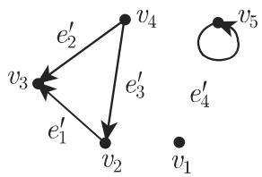
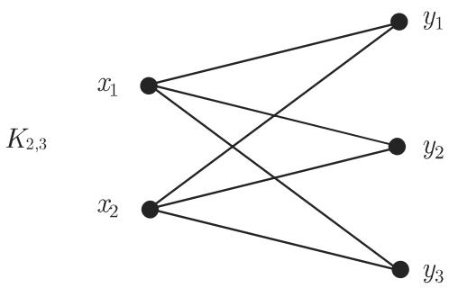
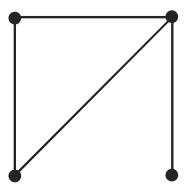
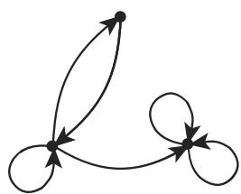
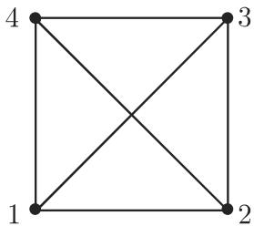
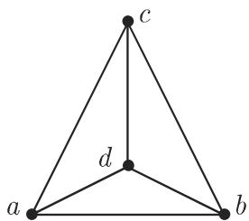
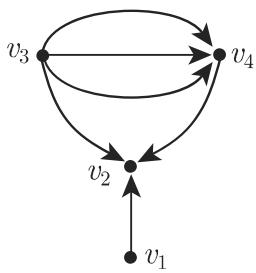

#### 5.8.1 基本概念和记号

1. 无向图和有向图

是顶点集合 和边集合 的有序对．存在一个定义在 上的称作关联函数的映射，对 的每个元素指派一个 的（不一定互异的）元素的有序或无序对．如果对 的每个元素指派的是无序对，那么 称为无向图（图 5.25)．如果指派的是有序对那么 称为有向图（图 5.26)，并且 的元素称为弧或有向边．所有其他的图称作混合图

在图的表示中，用点记图的顶点用箭记有向边并用没有方向的线记无向边．

  
5.25

  
图 5.26

■ A: 对千图 5.27 中的图 G:

$$
\begin{array}{r l} & V = \{v _ {1}, v _ {2}, v _ {3}, v _ {4}, v _ {5} \}, \quad E = \{e _ {1}, e _ {2}, e _ {3}, e _ {4}, e _ {5}, e _ {6}, e _ {7} \}, \\ & f _ {1} (e _ {1}) = \{v _ {1}, v _ {2} \}, \quad f _ {1} (e _ {2}) = \{v _ {1}, v _ {2} \}, \quad f _ {1} (e _ {3}) = \{v _ {2}, v _ {3} \}, \\ & f _ {1} (e _ {4}) = \{v _ {3}, v _ {4} \}, \quad f _ {1} (e _ {5}) = \{v _ {3}, v _ {4} \}, \quad f _ {1} (e _ {6}) = \{v _ {4}, v _ {2} \}, \\ & f _ {1} (e _ {7}) = \{v _ {5}, v _ {5} \}. \end{array}
$$

■ B: 对千图 5.26 中的图 G:

$$
\begin{array}{r l} & {V = \{v _ {1}, v _ {2}, v _ {3}, v _ {4}, v _ {5} \}, E ^ {\prime} = \{e _ {1} ^ {\prime}, e _ {2} ^ {\prime}, e _ {3} ^ {\prime}, e _ {4} ^ {\prime} \},} \\ & {f _ {2} (e _ {1} ^ {\prime}) = (v _ {2}, v _ {3}), f _ {2} (e _ {2} ^ {\prime}) = (v _ {4}, v _ {3}), f _ {2} (e _ {3} ^ {\prime}) = (v _ {4}, v _ {2}),} \\ & {f _ {2} (e _ {4} ^ {\prime}) = (v _ {5}, v _ {5}).} \end{array}
$$

■ C: 对千图 5.25 中的图 G:

$$
\begin{array}{r l} & V = \{v _ {1}, v _ {2}, v _ {3}, v _ {4}, v _ {5} \}, E ^ {\prime \prime} = \{e _ {1} ^ {\prime \prime}, e _ {2} ^ {\prime \prime}, e _ {3} ^ {\prime \prime}, e _ {4} ^ {\prime \prime} \}, \\ & f _ {3} (e _ {1} ^ {\prime \prime}) = (v _ {2}, v _ {3}), f _ {3} (e _ {2} ^ {\prime \prime}) = (v _ {4}, v _ {3}), f _ {3} (e _ {3} ^ {\prime \prime}) = (v _ {4}, v _ {2}), f _ {3} (e _ {4} ^ {\prime \prime}) = (v _ {5}, v _ {5}). \end{array}
$$

  
5.27

2. 邻接性

如果 $( v , w ) \in E$ 那么称顶点 与顶点 邻接．顶点 称为 $( v , w )$ 的始点，称为 $( v , w )$ 的终点，并且 称为 (v,w) 的端点

无向图中邻接性及无向边的端点可以类似地定义．

．简单图

如果多个边或弧指派给同一个顶点的有向对或无向对，那么它们称为重边．具有相同的端点边称为环．没有环和重边及重弧的图称为简单图

4. 顶点的次数

与一个顶点 关联的边或弧的个数称为顶点 的次数 $d _ { G } ( v )$ ．一个环被两次计数次数为零的顶点称为孤立顶点

对千有向图 的每个顶点 $v ,$ 我们区分 的外次数 $d _ { G } ^ { + } ( v )$ 和内次数 $d _ { G } ^ { - } ( v )$ 如下：

$$
d _ {G} ^ {+} (v) = | \{w | (v, w) \in E \} |,\tag{5.316a}
$$

$$
d _ {G} ^ {-} (v) = | \{w \mid (w, v) \in E \} |.\tag{5.316b}
$$

．特殊的图类

有限图有有限的顶点集和有限的边集．不然称图是无限的．在 次正则图中每个顶点有次数 r.

对千顶点集为 的无限简单图，若 中任何两个顶点都被一条边连接，则将它称为完全图．顶点集有 个元素的完全图记为 $K _ { n }$

如果一个无向简单图 的顶点集可以分拆为两个不相交的类 $\boldsymbol { Y } ,$ ，使得的每条边连接 的一个顶点和 的一个顶点那么 称为二部图．一个二部图称为完全二部图，如果 的每个顶点都有边与 的每个顶点连接如果元素， $Y$ 个元素，那么这个图记作 $K _ { n , m }$

  
5.28

  
5.29

• 5.28 表示有 个顶点的完全图

• 5.29 表示具有 元素集 元素集 的完全二部图

其他特殊的图类有平面图，树和运输网络它们的性质将在后节讨论

6. 图的表示

有限图可以直观表示：对千每个顶点指定平面上一个点并且用有向或无向曲线连接两个点（如果图中有相应的边）．图 5.30～图 5.33 给出一些例子．图 5.33出彼得森 (Petersen) 图，它是几个还没有一般性地证明的图论猜想中的一个著名的反例

  
5.30

  
5.31

  
5.32

  
5.33

7. 图的同构

图 $G _ { 1 } = ( V _ { 1 } , E _ { 1 } )$ ）称作与图 $G _ { 2 } = ( V _ { 2 } , E _ { 2 } )$ ）同构，当且仅当存在与关联函数相容的从 $V _ { 1 }$ 到 $V _ { 2 }$ 的双射 $\varphi ,$ 以及从 $E _ { 1 }$ 到 $E _ { 2 }$ 双射心 $\psi$ 即如果 u,v 是一条边的端点，或者 是一条弧的始点而 是其终点那么 $\varphi ( u )$ $\varphi ( v )$ 是一条边的端点或者$\varphi ( u )$ 和 $\varphi ( v )$ 分别是一条弧的始点和终点．图 5.34 和图 5.35 给出两个同构的图，使得 $\varphi ( 1 ) = a , \varphi ( 2 ) = b , \varphi ( 3 ) = c , \varphi ( 4 ) = d$ 的映射 $\varphi$ 是同构．在此情形，每个从{1,2,3,4} $\{ a , b , c , d \}$ 的双射是同构，因为两个图是顶点个数相同的完全图

8. 子图、因子

如果 $G = ( V , E )$ 是一个图，并且 $V ^ { \prime } \subseteq V , E ^ { \prime } \subseteq E$ ，那么图 $G ^ { \prime } = ( \boldsymbol { V } ^ { \prime } , \boldsymbol { E } ^ { \prime } )$ 称作的子图．如果 $G ^ { \prime }$ 恰好含有 的与 $V ^ { \prime }$ 的顶点相连接的边那么 $G ^ { \prime }$ 称为 的由$V ^ { \prime }$ 导出的子图（导出子图）．

使得 $V ^ { \prime } = V$ 的 $G = ( V , E )$ 的子图 $G ^ { \prime } = ( v ^ { \prime } , E ^ { \prime } )$ 称为 的部分图．

的因子 的含有 的所有顶点的正则子图

  
5.34

  
5.35

9. 邻接矩阵

有限图可以用矩阵刻画：设 $G = ( V , E )$ 是一个图，其中 $V = \{ v _ { 1 } , v _ { 2 } , \cdots , v _ { n } \}$ 和 $E = \{ e _ { 1 } , e _ { 2 } , \cdots , e _ { m } \}$ ．设 $m ( v _ { i } , v _ { j } )$ 是从 $v _ { i }$ 到 $v _ { j }$ 的边的个数．对千无向图，环要两次计数对千有向图，环计数一次 $( n , n )$ 型的矩阵 $\pmb { A } = ( m ( v _ { i } , v _ { j } ) )$ 称为邻接矩阵．如果还设 是简单图那么邻接矩阵有下列形式：

$$
\boldsymbol {A} = (a _ {i j}), \quad \text {其中} \quad a _ {i j} = \left\{ \begin{array}{l l} 1, & (v _ {i}, v _ {j}) \in E, \\ 0, & (v _ {i}, v _ {j}) \not \in E, \end{array} \right.\tag{5.317}
$$

即当且仅当存在一条从 $v _ { i }$ 到 $v _ { j }$ 的边时矩阵 中第 行和第 $j$ 列位置是 1. 无向图的邻接矩阵是对称的．

■ A: 5.36 旁边是有向图 $G _ { 1 }$ 的邻接矩阵 $A _ { 1 } = A ( G _ { 1 } )$

■ B: 5.37 旁边是无向简单图 $G _ { 2 }$ 的邻接矩阵 $A _ { 2 } = A ( G _ { 2 } )$

  
5.36

$$
\boldsymbol {A} _ {1} = \left( \begin{array}{c c c c} 0 & 1 & 0 & 0 \\ 0 & 0 & 0 & 0 \\ 0 & 1 & 0 & 3 \\ 0 & 1 & 0 & 0 \end{array} \right)
$$

  
5.37

$$
\boldsymbol {A} _ {2} = \left( \begin{array}{c c c c c c} 0 & 1 & 0 & 1 & 0 & 1 \\ 1 & 0 & 1 & 0 & 1 & 0 \\ 0 & 1 & 0 & 1 & 0 & 1 \\ 1 & 0 & 1 & 0 & 1 & 0 \\ 0 & 1 & 0 & 1 & 0 & 1 \\ 1 & 0 & 1 & 0 & 1 & 0 \end{array} \right)
$$

10. 关联矩阵

对千无向图 $G = ( V , E )$ ，其中 $V = \{ v _ { 1 } , v _ { 2 } , \cdots , v _ { n } \}$ 和 $E = \{ e _ { 1 } , e _ { 2 } , \cdots , e _ { m } \}$ 由

$b _ { i j } = { \left\{ \begin{array} { l l } { 0 , } & { v _ { i } } \\ { 1 , } & { v _ { i } } \\ { 2 , } & { v _ { i } } \end{array} \right. }$ 不与 $e _ { j }$ 关联，$\pmb { I } = ( b _ { i j } )$ ，其中 与 $e _ { j }$ 关联，并且 $e _ { j }$ 不是环，与 $e _ { j }$ 关联，并且 $e _ { j }$ 是环

(5.318)

给出的 (n,m) 型矩阵 称为关联矩阵．

对千有向图 $G = ( V , E )$ ，其中 $V = \{ v _ { 1 } , v _ { 2 } , \cdots , v _ { n } \}$ ｝和 $E = \{ e _ { 1 } , e _ { 2 } , \cdots , e _ { m } \}$ R关联矩阵 是一个由

$b _ { i j } = \left\{ \begin{array} { l l } { 0 , } & { v _ { i } } \\ { 1 , } & { v _ { i } } \\ { - 1 , } & { v _ { i } } \\ { 0 , } & { v _ { i } } \end{array} \right.$ 不与 $e _ { j }$ 关联，是 $e _ { j }$ 的始点并且 $e _ { j }$ 不是环，I= (bij) ，其中是 $e _ { j }$ 的终点并且 $e _ { j }$ 不是环，与 $e _ { j }$ 关联，并且 $e _ { j }$ 是环

(5.319)

定义的 (n,m) 型矩阵．

11. 加权图

如果 $G = ( V , E )$ 是一个图，而 是对每条边指派一个实数的映射，那么将$\left( V , E , f \right)$ 称为一个加权图，并且称 f(c) 为边 的权或

在应用中，这些边的权表示由构建、维护或通信产生的费用．
