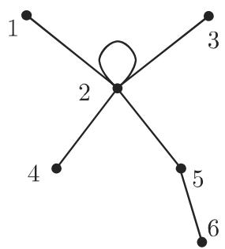
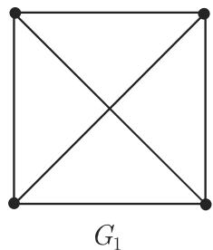
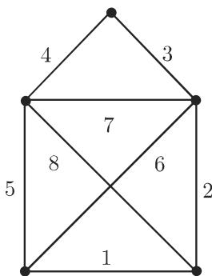
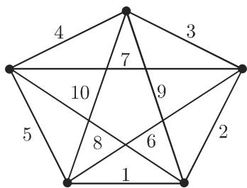
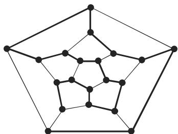

#### 5.8.2 无向图的遍历

5.8.2.1 边序列或路

1. 边序列或路

在一个无向图 = (V,E) 中，每个 的元素的序列

$$
F = (\{v _ {1}, v _ {2} \}, \{v _ {2}, v _ {3} \}, \dots , \{v _ {s}, v _ {s + 1} \})
$$

称作长 的边序列．

如果 $v _ { 1 } = v _ { s + 1 }$ ，那么序列称为一个圈，不然它是一个开边序列一个边序列称作路，当且仅当 $v _ { 1 } , v _ { 2 } , \cdots , v _ { s }$ 是两两不同的顶点．闭路是指一个环道．迹是指一个没有重复边的边序列

• 在图 5.38 中， $F _ { 1 } = ( \{ 1 , 2 \} , \{ 2 , 3 \} , \{ 3 , 5 \} , \{ 5 , 2 \} , \{ 2 , 4 \} )$ 是一个长为 的边序列$F _ { 2 } = ( \{ 1 , 2 \} , \{ 2 , 3 \} , \{ 3 , 4 \} , \{ 4 , 2 \} , \{ 2 , 1 \} )$ 是一个长为 的圈， $F _ { 3 } = ( \{ 2 , 3 \} , \{ 3 , 5 \}$ $\{ 5 , 2 \} , \{ 2 , 1 \} )$ ）是一条路， $F _ { 4 } = ( \{ 1 , 2 \} , \{ 2 , 3 \} , \{ 3 , 4 \} )$ ）是一条路 $F _ { 5 } = ( \{ 1 , 2 \} , \{ 2 , 5 \}$ ,{5，叶）给出一个基本圈

  
5.38

2. 连通图、分量

如果在图 $G$ 中，每对不同的顶点 v,w 之间至少存在一条路，那么 称为连通的．如果图 不连通，那么它可以分解为分量，即分解为具有极大个数顶点的诱导连通子图

3. 顶点间的距离

无向图中两个顶点 $v , w$ 间的距离 $\delta ( v , w )$ 是指具有极小个数的连接 $w$ 的边的路的长．如果这样的路不存在，那么令 $\delta ( v , w ) = \infty$

4. 最短路问题

设 $G = ( V , E , f )$ 是一个加权简单图，并且对千每个 $e \in E , f ( e ) > 0$ . 对千 $G$ 的两个顶点 $v , w$ 确定从 的最短路，即一条从 的路，其中边和弧的权之和分别极小．

有一个解决此问题的丹齐格有效算法，它是对有向图叙述的，并且也可类似地应用千无向图（参见第 551 5.8.6).

每个图 $G = ( V , E , f )$ ，其中 $V = \{ v _ { 1 } , v _ { 2 } , \cdots , v _ { n } \}$ ｝，有一个 $( n , n )$ 型的距离矩阵D:

$$
\boldsymbol {D} = (d _ {i j}), \quad \text {其中} \quad d _ {i j} = \delta (v _ {i}, v _ {j}) (i, j = 1, 2, \dots , n).\tag{5.320}
$$

在每条边的权都为 的情形，即 $w$ 的距离等千在图中从 到达 $w$ 所需要的边的极小个数，那么可以应用关联矩阵确定两个顶点间的距离：设 $v _ { 1 } , v _ { 2 } , \cdots , v _ { n }$ 是的顶点． 的关联矩阵是 $A = \left( a _ { i j } \right)$ ），并且将关联矩阵关千通常矩阵乘法（参见365 4.1.4, 5. ）的幕表示为 $\pmb { A } ^ { m } = ( a _ { i j } ^ { m } ) , m \in \mathbb { N }$

存在从顶点 $v _ { i }$ 到顶点 $v _ { j } ( i \neq j )$ 的长为 的最短路，当且仅当

$$
a _ {i j} ^ {k} \neq 0, \quad \text {并且} \quad a _ {i j} ^ {s} = 0 (s = 1, 2, \dots , k - 1).\tag{5.321}
$$

• 5.39 中给出的加权图有距离矩阵 $\pmb { D }$ （在图的旁边）．

• 5.40 中给出的图有关联矩阵 （在图的旁边），并且当 $m = 2$ 或 $m = 3$ 时得到矩阵 $A ^ { 2 }$ 和 $A ^ { 3 }$ ．长为 的最短路连接顶点 3, 4, 1 5, 6, 4,5, 5. 此外，顶点 $6 , 3$ 6, 以及最后， 之间的最短路的长为 3.

  
5.39

$$
D = \left( \begin{array}{c c c c c c} 0 & 2 & 3 & 5 & 6 & \infty \\ 2 & 0 & 1 & 3 & 4 & \infty \\ 3 & 1 & 0 & 2 & 3 & \infty \\ 5 & 3 & 2 & 0 & 1 & \infty \\ 6 & 4 & 3 & 1 & 0 & \infty \\ \infty & \infty & \infty & \infty & \infty & 0 \end{array} \right)\tag{•6}
$$

  
5.40

$$
\boldsymbol {A} = \left( \begin{array}{c c c c c c} 0 & 1 & 0 & 0 & 0 & 0 \\ 1 & 1 & 1 & 1 & 1 & 0 \\ 0 & 1 & 0 & 0 & 0 & 0 \\ 0 & 1 & 0 & 0 & 0 & 0 \\ 0 & 1 & 0 & 0 & 0 & 1 \\ 0 & 0 & 0 & 0 & 1 & 0 \end{array} \right),
$$

$$
\boldsymbol {A} ^ {2} = \left( \begin{array}{c c c c c c} 1 & 1 & 1 & 1 & 1 & 0 \\ 1 & 5 & 1 & 1 & 1 & 1 \\ 1 & 1 & 1 & 1 & 1 & 0 \\ 1 & 1 & 1 & 1 & 1 & 0 \\ 1 & 1 & 1 & 1 & 2 & 0 \\ 0 & 1 & 0 & 0 & 0 & 1 \end{array} \right), \quad \boldsymbol {A} ^ {3} = \left( \begin{array}{c c c c c c} 1 & 5 & 1 & 1 & 1 & 1 \\ 5 & 9 & 5 & 5 & 6 & 1 \\ 1 & 5 & 1 & 1 & 1 & 1 \\ 1 & 5 & 1 & 1 & 1 & 1 \\ 1 & 6 & 1 & 1 & 1 & 2 \\ 1 & 1 & 1 & 1 & 2 & 0 \end{array} \right).
$$

5.8.2.2 欧拉迹

1. 欧拉迹、欧拉图

含有图 的每条边的迹称为 的开或闭的欧拉迹

含有闭欧拉迹的连通图是一个欧拉图．

图 $G _ { 1 }$ （图 5.41) 没有欧拉迹． $G _ { 2 }$ （图 5.42) 有一个欧拉迹，但它不是欧拉图．图 $G _ { 3 }$ （图 5.43) 有一个闭欧拉迹但它不是欧拉图图伍 $G _ { 4 } ( $ （图 5.44) 是一个欧拉图

  
5.41

  
5.42

  
5.43

  
5.44

2. 欧拉希尔霍尔策 (Euler-Hierholzer) 定理

有限连通图是欧拉图，当且仅当它的所有顶点的次数都是正偶数．

3. 闭欧拉迹的构造

如果 是一个欧拉图，那么我们可以选取 的任意一个顶点 $v _ { 1 }$ ，并且由 $v _ { 1 }$ 开始遍历 直到它不再可能继续下去，这就构造一条迹 $F _ { 1 }$ ．如果 $F _ { 1 }$ 还没有含 的所有边那么我们构造另外一条含有不在 $F _ { 1 }$ 中的边的路 $F _ { 2 }$ ，但它从某过顶点 $v _ { 2 } \in F _ { 1 }$ 开始并且直到它不再可能继续下去．然后我们应 $F _ { 1 }$ 凡和 $F _ { 2 }$ 组成 中一个闭迹：从 $v _ { 1 }$ 开始遍历 $F _ { 1 }$ 直到到达 $v _ { 2 }$ ，然后继续遍历 $F _ { 2 }$ ，并且最后在以前没有用过的 $F _ { 1 }$ 的边上结束．重复这个方法在有限步骤内可得到一个闭欧拉迹．

4. 开欧拉迹

中存在开欧拉迹当且仅当 中恰存在两个有奇次数的顶点．图 5.45出一个图，它没有闭欧拉迹但有一个开欧拉迹．各边是相对千欧拉迹相继顺序标号的．图 5.46 中有一个具有欧拉迹的图

  
5.45

  
5.46

5. 中国邮递员问题

问题是：邮递员必须至少一次通过他的服务区的所有街道且回到出发地，并且要使路程尽可能短；这个问题可以用图论术语叙述如下：设 $G = ( V , E , f )$ 是一个加权图，并且对千每条边 $e \in E , f ( e ) \geqslant 0$ ．确定边序列使得它具有极小总长

$$
L = \sum_ {e \in F} f (e).\tag{5.322}
$$

这个问题的命名源千中国数学家管梅谷，他首先研究此问题．为解此问题要区分两种情形：

(1) 是欧拉图，那么每个闭欧拉迹是最优的；

(2) 没有闭欧拉迹．

解这个问题的一个有效算法是埃德蒙兹 (Edmonds) 和约翰逊 (Johnson) 给出的（见 [5.49]).

5.8.2.3 哈密顿圈

1. 哈密顿圈

哈密顿圈是覆盖图中所有顶点的基本圈

• 在图 5.47 中，粗线条表示一个哈密顿圈

  
5.47

在面为五边形的十二面体的图中构造哈密顿圈游戏的想法可以追溯到哈密顿爵士．

刻画有哈密顿圈的图的问题导致一个经典的 NP 完全问题．因此在此不能给出确定哈密顿圈的有效算法．

2. 狄拉克定理

如果简单图 $G = ( V , E )$ 至少有 个顶点并且对千 的每个顶点 $v , d _ { G } ( v ) \geqslant$ $| V | / 2$ ，那么 有哈密顿圈．这是哈密顿圈存在的一个充分而非必要的条件．下面具有更一般的假设的定理也是哈密顿圈存在的一个充分而非必要的条件．

• 5.48 给出一个图，它有一个哈密顿圈，但并不满足下述奥尔定理的假设

3. 奥尔 (Ore) 定理

如果简单图 $G = ( V , E )$ 至少有 个顶点并且对千每对非邻接的顶点$w , d _ { G } ( v ) + d _ { G } ( w ) \geqslant | V |$ ，那么 有哈密顿圈

4. 波萨 (Posa) 定理

设简单图 $G = ( V , E )$ 至少有 个顶点．如果满足下列条件：

(1) 对千 $1 \leqslant k \leqslant ( | V | - 1 ) / 2$ ，次数不超过 的顶点的个数小千 $k ;$

(2）若 $| V |$ 是奇数，则次数不超过 $( | V | - 1 ) / 2$ 的顶点的个数小千或等千 $( | V | -$ $1 ) / 2 _ { : }$ ，那么 有哈密顿圈

  
5.48
