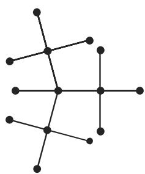
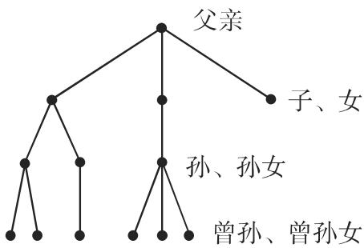
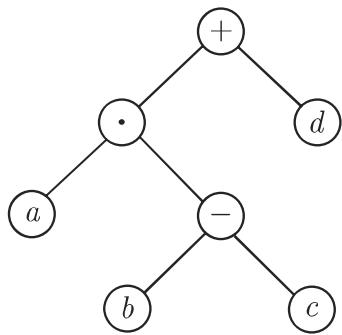
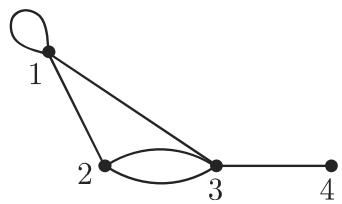
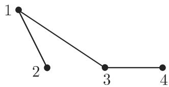

#### 5.8.3 树和生成树

5.8.3.1

1.

一个没有圈的无向连通图称为树．每个至少有 个顶点的树至少有 个次数的顶点．每个有 个顶点的树恰有 条边

如果有向图 连通，并且不含任何环道，那么称它为树（参见第 551 5.8.6).• 5.49 和图 5.50 表示两个不同构的有 14 个顶点的树．它们表示丁烧和异构丁烧的化学结构

  
5.49

  
5.50

2. 有根树

具有一个特异顶点的树称作有根树，并且这个特异顶点称作根．在图示中，根通常在顶部并且各边位千根的下方（图 5.51)．有根树用来表示等级结构例如工厂中设备的等级、系谱图、语法结构．

  
5.51

• 5.51 用有根树表示一个家庭的谱系．根是表示父亲的顶点

3. 正则二元树

如果一个树恰有一个 次顶点且不然仅有 次或 次顶点那么称它为正则二元树．

正则二元树的顶点个数是奇数．具有 个顶点的正则树有 (n+ 1)/2 次顶点一个顶点的水平是指根到它的距离树中出现的最大水平称为树的高正则二元有根树（例如在信息科学中）有若干应用．

4. 有序二元树

算术表达式可以通过二元树表示．在此，数和变量被指派为 次顶点运算“+“、"—”和“·“对应千次数＞ 的顶点并且左边的子树和右边的子树分别表示第一和第二运算对象一般地这也是一个表达式．这些树称为有序二元树

遍历一个有序二元树可以用三种不同的方法实施，它们是用递推方式定义的（还见图 5.52):

内序遍历： 遍历根的左子树（按内序遍历方式）抵达根，遍历根的右子树（按内序遍历方式）．

前序遍历： 抵达根，

遍历根的左子树（按前序遍历方式），遍历根的右子树（按前序遍历方式）．

后序遍历： 遍历根的左子树（按后序遍历方式），遍历根的右子树（按后序遍历方式），抵达根

应用内序遍历与给定表达式对照项的顺序是不变的．用后序遍历得到的项称为后缀表示法或波兰(Polish) 表示法．类似地，用前序遍历得到的项称为前缀表示法或逆波兰表示法

前缀表示法和后缀表示法唯一地刻画一个树．这个事实可以用千树的实现．

• 在图 5.52 中项 $a \cdot ( b - c ) + d$ 是用图表示的．内序遍历产生 $a \cdot b - c + d { \bigl . }$ 前序

遍历产生 $+ \cdot a - b c d ,$ 后序遍历产生 $a b c - \cdot d +$

  
5.52

5.8.3.2 生成树

1. 生成树

如果一个树是无向图 的子图，并且含有 的所有顶点那么称它为 $G$ 的生成树每个有限连通图 含有一个生成树 H:

如果 含有一个圈，那么去掉这个圈的一条边剩余的图 $G _ { 1 }$ 仍然是连通的并且又可以通过去掉 $G _ { 1 }$ 一个圈的一条边（如果存在这样的边）．经过有限多步后就可得到 的生成树

• 5.54 给出图 5.53 中的图 的生成树 H.

  
5.53

  
5.54

2. 凯莱定理

每个有 个顶点 $( n > 1 )$ 的完全图恰有 $n ^ { n - 2 }$ 个生成树

3. 矩阵生成树定理

设 $G ~ = ~ ( V , E )$ 是一个图，其中 $V ~ = ~ \{ v _ { 1 } , v _ { 2 } , \cdot \cdot \cdot ~ , v _ { n } \} ( n ~ > ~ 1 )$ 以及 $E =$ $\{ e _ { 1 } , e _ { 2 } , \cdots , e _ { m } \}$ ｝．定义 $( n , n )$ 型的矩阵 $\pmb { D } = ( d _ { i j } )$ :

$$
d _ {i j} = \left\{ \begin{array}{l l} 0, & i \neq j, \\ d _ {G} (v _ {i}), & i = j, \end{array} \right.\tag{5.323a}
$$

称它为次数矩阵．次数矩阵和邻接矩阵的差是 的容许矩阵 L:

$$
\boldsymbol {L} = \boldsymbol {D} - \boldsymbol {A}.\tag{5.323b}
$$

去掉 的第 行和第 列得到矩阵 $\mathbf { L } _ { i } , \mathbf { \nabla } \mathbf { L } _ { i }$ 的行列式等千图 的生成树的个数．

• 5.53 中的图的邻接矩阵、次数矩阵和容许矩阵是

$$
\boldsymbol {A} = \left( \begin{array}{c c c c} 2 & 1 & 1 & 0 \\ 1 & 0 & 2 & 0 \\ 1 & 2 & 0 & 1 \\ 0 & 0 & 1 & 0 \end{array} \right), \quad \boldsymbol {D} = \left( \begin{array}{c c c c} 4 & 0 & 0 & 0 \\ 0 & 3 & 0 & 0 \\ 0 & 0 & 4 & 0 \\ 0 & 0 & 0 & 1 \end{array} \right), \quad \boldsymbol {L} = \left( \begin{array}{c c c c} 2 & - 1 & - 1 & 0 \\ - 1 & 3 & - 2 & 0 \\ - 1 & - 2 & 4 & - 1 \\ 0 & 0 & - 1 & 1 \end{array} \right).
$$

因为 $\operatorname* { d e t } L _ { 3 } = 5$ ，所以这个图有 个生成树．

4. 极小生成树

设 $G = ( V , E , f )$ 是一个连通加权图如果 的生成树 的总长

$$
f (H) = \sum_ {e \in H} f (e)\tag{5.324}
$$

极小，那么 称为极小生成树．例如，如果边权表示成本，并且我们关心极小成本，那么就要搜索极小生成树．一个求极小生成树的方法是克鲁斯卡尔 (Kruskal) 算法：

a) 选取有极小权的边．

b) 尽可能地继续选取其他的有最小权，并且不与已经选得的边形成圈的边，将这样的边添加到树中

在步骤 b) 中，容许边的选取容易通过下列标号算法实现：

设图的顶点被两两不同地标号．

在每一步，仅可能在这种情形增加一条边它连接有不同标号的顶点．

增加一条边后，将较大标号端点的标号改为较小的端点标号值．
