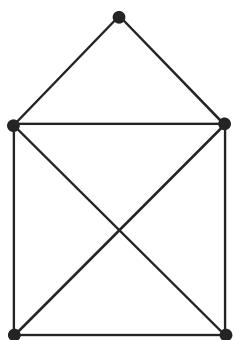
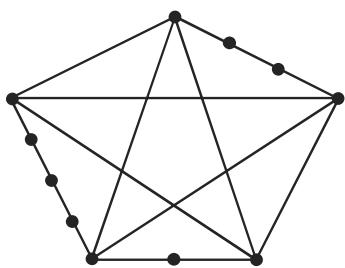

#### 5.8.5 可平面图

因为有向图是可平面图，当且仅当相应的无向图是可平面图所以我们在此限千考虑无向图

1. 可平面图

称为平面图，当且仅当 可以画在一个平面上，并且它的边仅在 的顶

点相交．与平面图同构的图称作可平面图．

5.56 给出平面图 $G _ { 1 }$ 5.57 中的图 $G _ { 2 }$ 同构千 $G _ { 1 }$ ，它不是平面图，但是一个可平面图，因为它与 $G _ { 1 }$ 同构．

  
5.56

  
5.57

2. 非可平面图

完全图 $K _ { 5 }$ 和完全二部图 $K _ { 3 , 3 }$ 是非可平面图

3. 细分

如果将二次顶点插入 的边中，那么我们就可得到图 的一个细分．每个图都是它自身的细分．图 5.58 和图 5.59 给出 $K _ { 5 }$ 和 $K _ { 3 , 3 }$ 的某些细分．

  
5.58

  
5.59  
4. 库拉托夫斯基 (Kuratowski) 定理

一个图是非可平面的，当且仅当它含有一个子图是完全二部图 $K _ { 3 , 3 }$ 或完全图$K _ { 5 }$ 的细分
