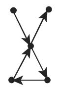
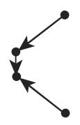
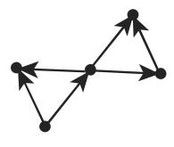
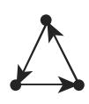
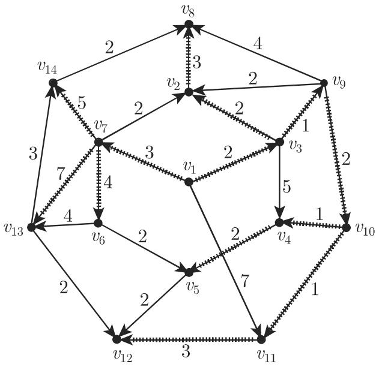

#### 5.8.6 有向图中的路

1. 弧序列

有向图中一个弧序列 $F = ( e _ { 1 } , e _ { 2 } , \cdot \cdot \cdot , e _ { s } )$ 称为一个长 的链，当且仅当两次含有任何一条弧并且每条弧 $e _ { i } ( i = 2 , 3 , \cdots , s - 1 )$ 的端点之一是 $e _ { i - 1 }$ 的一个端点而另外一个是 $e _ { i + 1 }$ 的一个端点

一个链称作有向链，当且仅当对千 $i = 1 , 2 , \cdots , s - 1$ 弧 $e _ { i }$ 的终点与 $e _ { i + 1 }$ 的始点相重合

遍历每个顶点至多一次的链或有向链分别称为基本链和基本有向链．

闭链称为圈一条闭有向路，若它的每个顶点恰是两条弧的端点则称为环道

5.60 包含不同种类的弧序列

  
有向链

  
基本链

  
基本有向链

5.60  
圈  
  
环道

2. 连通图和强连通图

有向图 称为连通的，当且仅当对千任何两个顶点存在一条连接它们的链．图称为强连通的，当且仅当对千任何两个顶点 v,w 存在一条给定的连接它们的有向链．

3. 丹齐格算法

设 $G = ( V , E , f )$ 是一个加权简单有向图，并且对千每条弧 $e , f ( e ) > 0 $ ．下列算法产生 的所有这样的顶点它们通过有向链与一个固定顶点 $v _ { 1 }$ 连接，并且它们与 $v _ { 1 }$ 的距离：

a) 顶点 $v _ { 1 }$ 有标号 $t ( v _ { 1 } ) = 0$ 令 $S _ { 1 } = \{ v _ { 1 } \}$

b) 被加标号的顶点的集合是 $S _ { m }$

c) 如果 $U _ { m } = \left\{ e \mid e = ( v _ { i } , v _ { j } ) \in E , v _ { i } \in S _ { m } , v _ { j } \notin S _ { m } \right\} = \emptyset$ ，那么算法结束．

d) 不然我们选取弧 $e ^ { * } = ( x ^ { * } , y ^ { * } )$ ）使得 $t ( x ^ { * } ) + f ( e ^ { * } )$ 极小．将 $e ^ { * }$ ＊和 $y ^ { * }$ 加标号，并且令 $t ( y ^ { * } ) = t ( x ^ { * } ) + f ( e ^ { * } )$ ），以及 $S _ { m + 1 } = S _ { m } \cup \{ y ^ { * } \}$ ｝，并且重复 b)，其中$m : = m + 1$

（如果所有弧的权是 1, 那么可以应用关联矩阵（参见第 541 5.8.2.1, 4.)出从顶点 到顶点 $w$ 的最短有向链的长．）

如果 的顶点 未被加标号，那么不存在从 $v _ { 1 }$ 到 $v$ 的有向路．

如果 有标号 $t ( v )$ ，那么 $t ( v )$ 是这样的有向链的长．在由被加标号的弧和顶点给出的树中可以找到从 $v _ { 1 }$ 的最短有向路，即对千 $v _ { 1 }$ 的距离树．

• 在图 5.61 中，加标号的弧和顶点表示图中对千 $v _ { 1 }$ 的距离树．最短有向链的长是

<table><tr><td>从  $v_{1}$  到  $v_{3}$ :</td><td>2,</td><td>从  $v_{1}$  到  $v_{6}$ :</td><td>7,</td></tr><tr><td>从  $v_{1}$  到  $v_{7}$ :</td><td>3,</td><td>从  $v_{1}$  到  $v_{8}$ :</td><td>7,</td></tr><tr><td>从  $v_{1}$  到  $v_{9}$ :</td><td>3,</td><td>从  $v_{1}$  到  $v_{14}$ :</td><td>8,</td></tr><tr><td>从  $v_{1}$  到  $v_{2}$ :</td><td>4,</td><td>从  $v_{1}$  到  $v_{5}$ :</td><td>8,</td></tr><tr><td>从  $v_{1}$  到  $v_{10}$ :</td><td>5,</td><td>从  $v_{1}$  到  $v_{12}$ :</td><td>9,</td></tr><tr><td>从  $v_{1}$  到  $v_{4}$ :</td><td>6,</td><td>从  $v_{1}$  到  $v_{13}$ :</td><td>10,</td></tr><tr><td>从  $v_{1}$  到  $v_{11}$ :</td><td>6.</td><td></td><td></td></tr></table>

  
5.61

注在 $G = ( V , E , f )$ 有带负权的弧的情形，还有一个修饰的求最短有向链的算法
