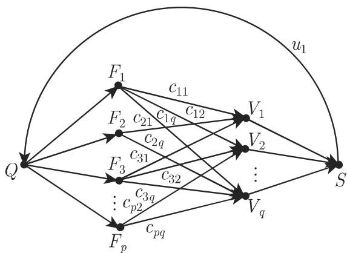

#### 5.8.7 运输网络

1. 运输网络

一个连通有向图称为运输网络，如果它有两个加标号的顶点 $Q \iota$ （称为源点）和S （称为汇点），具有下列性质

a) 存在一条从 $Q$ 的弧 $u _ { 1 }$ ，其中 $u _ { 1 }$ 是仅有的以 为始点及仅有的以 $Q$ 为终点的弧

b) 每个与 $u _ { 1 }$ 不同的弧 $u _ { i }$ 被指派一个实数 $c ( u _ { i } ) \geqslant 0$ ．这个数称为它的容量弧 $u _ { 1 }$ 有容量 $\infty$

若函数 $\varphi$ 对每条弧指派一个实数，并且对千每个顶点 $v ,$ ，等式

$$
\sum_ {(u, v) \in G} \varphi (u, v) = \sum_ {(v, w) \in G} \varphi (v, w)\tag{5.325a}
$$

成立，则称它为 上的流．将和

$$
\sum_ {(Q, v) \in G} \varphi (Q, v)\tag{5.325b}
$$

称为流的强度．如果对千 的每条弧 $u _ { i }$ 有 $0 \leqslant \varphi ( u _ { i } ) \leqslant c ( u _ { i } )$ ），那么称 $\varphi$ 中是与容量相容的．

• 关千运输网络的例子，见 553 页．

2. 福特 (Ford) －富尔克森 (Fulkerson) 极大流算法

应用极大流算法我们可以确认给定的流 $\varphi$ 是否极大．

是运输网络， $\varphi$ 是与容量相容的强度为 $v _ { 1 }$ 的流下面给出的算法包含给顶点标号后的步骤，以及完成这些步骤后我们可以了解基千所选取的标号步骤有多少流的强度可以改进．

a) 对源点 标号，并令 $\varepsilon ( Q ) = \infty$

b) 如果存在弧 $u _ { i } = ( x , y )$ ，其中 被标号而 未标号，并且 $\varphi ( u _ { i } ) < c ( u _ { i } )$ 那么给 $( x , y )$ 标号，并且令 $\varepsilon ( y ) = \operatorname* { m i n } \{ \varepsilon ( x ) , c ( u _ { i } ) - \varphi ( u _ { i } ) \}$ ｝，然后重复步骤 b),不然实施步骤 c).

c) 如果存在弧 $u _ { i } = ( x , y )$ ，其中 未标号而 被标号，并且中 $\varphi ( u _ { i } ) > 0$ 以及$u _ { i } \neq u _ { 1 }$ ，那么给 $( x , y )$ 标号，代以 $\varepsilon ( x ) = \operatorname* { m i n } \{ \varepsilon ( y ) , \varphi ( u _ { i } ) \}$ ｝，并返回继续实施步骤 b)（如果此步骤可行），不然算法结束．

的汇点 被标号，那么 中的流可以改进适当的量 $\varepsilon ( S )$ ．如果汇点未被标号，那么这个流是极大的．

• 极大流对千图 5.62 中的图，权是紧贴着边写的图 5.63 中的加权图给出一个与这些容度相容的强度 13 的流．它是一个极大流．

  
5.62

  
5.63

• 运输网络某种产品由 个企业 $F _ { 1 } , F _ { 2 } , \cdots , F _ { p }$ 生 $\vec { \cal P }$ ，有 $q$ 个用户 $V _ { 1 } , V _ { 2 } , \cdots , V _ { q }$ 在某个期间， $F _ { i }$ 生产织 $s _ { i } ($ （单位）产品， $V _ { j }$ 需要 $t _ { j }$ （单位） $\vec { \cal P }$ 产品，并且在该期间可以由 $F _ { i }$ 向 $V _ { j }$ 运送 $c _ { i j }$ （单位）产品在此期间是否可能满足所有要求？对应的图见图 5.64.

  
5.64
